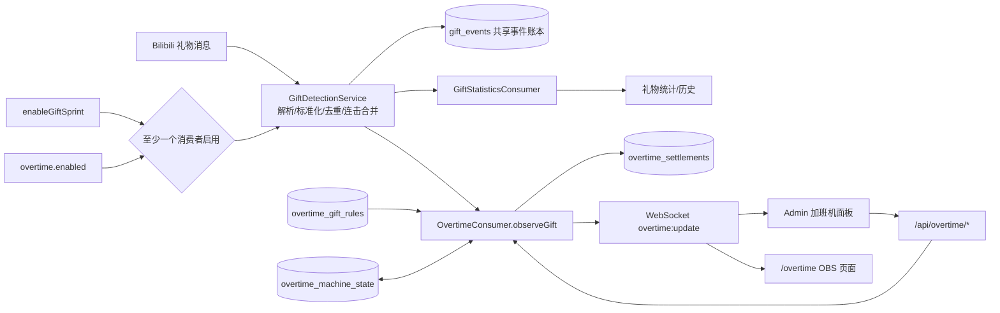

# 加班机设计规格

状态：Accepted（2026-08-10，AC-001–AC-016 已通过实现与验收）  
目标读者：产品确认、前后端开发、测试  
范围：共享礼物检测核心、独立 OBS 网页、Admin 控制、礼物固定增减、时间盲盒、持久化与幂等结算

## 1. 结论

加班机应作为现有本地服务中的一个新领域模块实现，不新增进程、框架或外部服务。

- 对外提供独立页面 `/overtime`，可直接添加为 OBS 浏览器源。
- 页面由背景层和前景层组成；前景固定包含本场剩余时间与已启用的礼物时间票券。
- Admin 使用已经预留的「百宝箱 → 加班机」入口管理本场时间、运行状态、礼物规则和画面地址。
- 服务端是唯一计时和礼物结算权威；浏览器只根据服务端锚点本地走秒，不每秒写数据库或广播。
- 将现有礼物服务中的底层收礼机制独立为共享 `GiftDetectionService`，统一完成解析、去重和连击合并；礼物统计与加班机是两个并列消费者，各自处理同一份标准礼物事件。
- 礼物规则按稳定的 `gift_id` 匹配，名称与图片从 `public/img/bilibili-gifts.json` 和 `public/img/bilibili-gifts/` 自动解析。
- 礼物结算以 `gift_events.id` 代表一整组礼物。共享检测核心在平台结束标记或 10 秒静默后只发出一次 `final`；例如 100 个 1 毛礼物只应用一次固定规则或抽一次时间盲盒，`num=100` 和总金额仅用于展示与审计。
- “时间盲盒”是加班机自己的随机时间规则，不复用现有 Bilibili 盲盒盈亏逻辑；随机结果在服务端生成并持久化，刷新页面不能重抽。

## 2. 已确认的现有代码事实

以下是设计约束，不是推测。

| 现状 | 代码依据 | 对设计的影响 |
|---|---|---|
| 项目是 Node.js 原生 HTTP + Vanilla JS + SQLite 的本地单体 | `package.json`、`src/server.js` | 新功能继续放在现有进程内 |
| 页面路由由静态 `pageMap` 映射 | `src/server/http-utils.js:75-99` | 新增 `/overtime -> pages/overlays/overtime.html` |
| HTML 响应会注入 session token，API 与 WebSocket 校验该 token | `src/server/http-utils.js:46-53`、`src/server/http-utils.js:105-129`、`src/server/ws.js:31-43` | 复制给 OBS 的 URL 不需要暴露 token |
| WebSocket 连接后会收到完整 snapshot | `src/server/ws.js:55-59` | `state` 中新增 `overtime` 即可完成首次同步 |
| Bilibili 礼物落库后以 `bilibili:gift` 广播 | `src/server.js:625-631` | 加班机结算应插在礼物落库之后、广播之前 |
| 收礼统一入口当前是 `domainServices.gifts.add(gift)`，礼物服务由 `createDomainServices` 组装 | `src/server.js:625-631`、`src/server/domain-services.js:21-72` | 当前检测、统计和存储耦合在一个服务；实现时先抽出共享检测核心，再接两个消费者 |
| 礼物表已有内部 `id`、`platform_id`、`gift_id`、`num` 等字段 | `src/storage/schema.js:275-306` | 不修改原礼物数据含义，新增结算表关联 `gift_events.id` |
| 同一平台礼物可能去重返回旧记录，也可能用同一记录更新 `num`/金额 | `src/bilibili/gift/event-service.js:211-228`、`src/bilibili/gift/event-service.js:316-359` | 不能用“收到一次广播就加一次时间”，也不能按每次数量增长结算 |
| 连击包最多缓冲 10 秒后合并落库 | `src/bilibili/gift/event-service.js:16`、`src/bilibili/gift/event-service.js:66-78` | 静默与 final 判定归共享检测核心所有；加班机收到 final 后立即结算，不重复等待 10 秒 |
| `enableGiftSprint` 关闭时礼物服务当前会直接返回、不落库 | `src/bilibili/gift/event-service.js:160-165` | 这个判断应从检测核心移到礼物统计消费者；检测核心由“至少一个消费者启用”决定是否运行 |
| `enableGiftSprint` 新安装默认是 `true`，Admin 复选框可独立修改 | `src/storage/settings-store.js:14`、`public/js/admin/settings.js:127-143` | 保留为礼物统计消费者开关，不再代表共享检测核心本身的开关 |
| 礼物最近记录和礼物冲刺统计都从 `gift_events` 查询 | `src/bilibili/gift/query-service.js:8-18`、`src/bilibili/gift/query-service.js:91-119` | `gift_events` 改为共享检测事件账本；统计是否计入仍由 `counted_in_sprint` 等消费者字段决定 |
| Admin 已有空的「百宝箱 → 加班机」面板 | `public/pages/admin.html:1308-1328`、`public/pages/admin.html:1637-1643` | 直接填充现有面板，不新增主导航 |
| 现有 OBS 页面使用窗口 resize、容器查询和 `cqw` 自适应 | `public/js/overlays/blindbox.js:49-56`、`public/css/overlays/blindbox.css:15-30` | 加班机沿用相同响应式思路，并升级为二维容器 |
| 礼物目录 JSON 已包含 `id`、`name`、`image`、价格和分类 | `public/img/bilibili-gifts.json` | Admin 礼物选择器无需新建第二份映射 |

## 3. 产品假设

本规格先按以下行为设计；文末列出需要最终确认的选项。

1. “本场直播时间”是倒计时，而不是已直播时长正计时。
2. 时间最小为 `00:00:00`，不显示负数；最大为 `999:59:59`。
3. 暂停期间收到礼物仍会修改剩余时间，但时间本身不继续减少。
4. 倒计时自然到零后进入“已结束”；此后收到正向礼物会自动恢复倒计时，负向礼物保持为零。
5. 多数量礼物按整组结算。一个 `gift_events.id` 无论最终是 `x1` 还是 `x100`，固定规则只应用一次，时间盲盒也只抽一次；数量与总金额只用于票券和 Admin 流水展示。
6. V1 只处理已经进入 `gift_events` 的有效付费礼物；免费礼物不在本期范围。
7. 程序关闭期间，处于运行状态的倒计时继续按真实时间流逝。
8. 新安装时加班机本身仍为未启用。共享检测核心没有用户开关：礼物统计消费者或加班机消费者任意一个启用时运行，两者都关闭时停止；两个消费者互不改写对方开关。

## 4. 功能需求（EARS）

**OT-FR-001 独立画面**  
系统应提供 `/overtime` 网页，并允许该网页作为 OBS 浏览器源独立运行。

**OT-FR-002 双层构成**  
系统应将加班机画面分为背景层和前景层；前景层应显示剩余时间以及所有启用的礼物时间票券。

**OT-FR-003 自适应缩放**  
当浏览器源宽度或高度改变时，系统应同步调整布局、字号、图标、间距和背景适配方式，不要求用户刷新页面。

**OT-FR-004 Admin 计时控制**  
当管理员设置本场时间、开始、暂停或重置时，系统应持久化新状态并立即同步所有已连接页面。

**OT-FR-005 固定规则**  
当一整组匹配固定规则的礼物结束时，系统应按规则秒数修改一次剩余时间，不得乘以该组礼物数量或金额。

**OT-FR-006 时间盲盒**  
当一整组匹配时间盲盒规则的礼物结束时，系统应按配置的带权结果池只抽取一次正或负秒数，并应用该结果。

**OT-FR-007 幂等**  
当相同 `gift_events.id` 已产生结算时，系统不得因重复广播、迟到包或后续数量变化再次修改时间、重新抽盲盒或播放礼物动效。

**OT-FR-008 整组封账**  
当同一礼物组收到平台结束标记，或 `last_platform_at_ms` 连续 10 秒未变化时，共享检测核心应把事件从 `progress` 改为 `final` 并分发一次；加班机收到 final 后应以封账快照立即结算，不得再次等待。

**OT-FR-009 随机结果稳定**  
当随机结果已经结算后，系统应持久化该结果；页面刷新、WebSocket 重连或重复礼物包不得触发重抽。

**OT-FR-010 零点限制**  
当负向调整大于当前剩余时间时，系统应将时间限制为零，并记录请求调整值和实际生效值。

**OT-FR-011 图片解析**  
当管理员选择礼物时，系统应使用 `gift_id` 从本地礼物目录解析名称与图片；实时事件名称仅作为回退显示，不作为主匹配键。

**OT-FR-012 断线恢复**  
当页面与服务端断线时，页面应继续依据最后的权威锚点走秒并展示断线状态；重连后应以服务端状态纠正本地显示。

**OT-FR-013 独立检测核心**  
系统应将礼物解析、标准化、平台去重和连击合并从礼物统计功能中独立为共享 `GiftDetectionService`；加班机和礼物统计不得各自解析同一原始 Bilibili 礼物包。

**OT-FR-014 双消费者启停**  
当礼物统计消费者 `enableGiftSprint=true` 或加班机消费者 `overtime.enabled=true` 任一成立时，系统应接受新礼物；两者都为 false 时停止接受新礼物，但应先排空已持久化的 progress 组。任何消费者启停都不得改写另一个消费者的设置。

**OT-FR-015 标准事件分发**  
当共享检测核心产生标准礼物事件时，系统应按首包时冻结的消费者资格分发同一事件；礼物统计更新自己的统计字段，加班机按规则观察并结算。加班机不得通过轮询 `receivedRmb`、礼物总数或前端统计面板差值来推断礼物。

**OT-FR-016 消费者隔离**  
当礼物统计关闭而加班机开启时，系统应继续检测并允许礼物驱动加班机，但不得把该事件计入礼物冲刺统计；反向情况下，礼物统计应继续工作而加班机不得创建 `pending` 或改变时间。

## 5. 直播画面设计

### 5.1 视觉主题：直播加班翻牌钟

画面的单一视觉重点是“时间票券盖章”：每种已启用的礼物规则都是一张带礼物图标与有符号时长的票券；一整组礼物封账后，对应票券只盖章一次并把一次时间变化送入主时钟。它同时表达“这个礼物值多少时间”和“刚刚发生了什么”，不增加无意义装饰。

视觉词：直播计时牌、票券、盖章、明确、远距离可读。

### 5.2 设计 token

| 角色 | 值 | 用途 |
|---|---|---|
| 深夜底色 | `#181823` | 默认背景底 |
| 柔粉 | `#FF6F91` | 品牌线、当前激活票券 |
| 青绿 | `#21B6A8` | 加时与运行状态 |
| 珊瑚红 | `#F0677D` | 减时与警告 |
| 暖金 | `#F5B72F` | 时间盲盒与随机揭晓 |
| 主文字 | `#FFF7FB` | 时钟与礼物名称 |
| 时钟字体 | `Bahnschrift SemiCondensed, Bahnschrift, "Arial Narrow", sans-serif` | 数字窄、稳定、适合大字号 |
| 中文/UI 字体 | `"Microsoft YaHei", "PingFang SC", sans-serif` | 本机可用，不依赖网络字体 |

数字必须使用 `font-variant-numeric: tabular-nums`，避免每秒跳动时宽度变化。

### 5.3 两层 DOM 结构

```text
.overtime-stage                    // 100vw × 100dvh，container-type: size
├── .overtime-background           // 背景层，绝对定位，不接收鼠标事件
│   ├── img                        // cover / contain / fill
│   └── .background-shade          // 保证前景对比度的轻遮罩
└── .overtime-foreground           // 前景层
    ├── .clock-status              // “直播加班中 / 已暂停 / 已结束 / 连接中断”
    ├── .clock-value               // 000:00:00
    ├── .gift-ticket-grid
    │   └── .gift-ticket × N       // 图标、名称、有符号时长或“随机”
    └── .adjustment-stage          // 只承载一次触发动效，不占布局
```

背景层与前景层必须完全解耦：背景加载失败时显示透明底或默认底色，时间与礼物仍正常可读。

### 5.4 横向画面线框

```text
┌──────────────────────────────────────────────────────────────┐
│                   LIVE · 直播加班中                          │
│                        02:37:18                              │
│                                                              │
│  [礼物图 +05:00] [礼物图 −03:00] [礼物图 随机] [礼物图 +30:00] │
└──────────────────────────────────────────────────────────────┘
```

### 5.5 窄高画面线框

```text
┌──────────────────┐
│   直播加班中      │
│    02:37:18       │
│                  │
│ [图标]  +05:00    │
│ [图标]  −03:00    │
│ [图标]  随机      │
│ [图标]  +30:00    │
└──────────────────┘
```

### 5.6 响应式规则

根节点使用 `container-type: size`，视觉尺寸优先使用 `cqmin`，布局使用容器宽高和宽高比切换。

| 场景 | 布局行为 |
|---|---|
| 宽度 `>= 1200px` 且高度 `>= 240px` | 最多 8 列，8 个礼物可单行展示 |
| 宽度 `720–1199px` 且高度 `>= 240px` | 固定最多 4 列，多于 4 个时换到第二行 |
| 宽度 `420–719px` 且高度 `>= 240px` | 固定 2 列 |
| 宽度 `< 420px` 且高度 `>= 240px` | 固定 2 列，隐藏礼物长名称，保留图标与时间 |
| 高度 `< 240px` | 最高优先级的紧凑模式：隐藏名称和状态文字，1–8 张票券强制单行等分 |
| 宽高比 `< 1.45` | 时钟与票券上下排列；列数仍由以上宽度规则决定 |

V1 最多允许 8 条启用规则，因此 `320 × 180` 的紧凑单行仍有可实现的空间。建议 OBS 源不小于 `640 × 360`；验收最小尺寸为 `320 × 180`。不设置固定的 16:9 画布，因此横向、方形、竖向都能使用。

时钟建议字号：`clamp(32px, 20cqmin, 220px)`；图标尺寸：`clamp(18px, 7cqmin, 82px)`。最终值应以截图回归为准，而不是只检查 CSS 文本。

兼容降级：若浏览器不支持 `container-type: size` 或 `cqmin`，使用 `vmin/vw/vh` 与普通 `@media` 查询实现同一组断点；不得因容器查询不可用而出现空白页。

### 5.7 背景层

V1 支持：

- 默认透明背景。
- 从 `public/img/overtime-machine/` 选择内置背景。
- 三种适配：`cover`（默认）、`contain`、`fill`。
- 背景加载失败时回退到透明，不隐藏前景。
- 只有配置了背景图片时才绘制轻遮罩；透明背景不绘制遮罩，方便 OBS 与直播画面合成。

V1 不做任意文件上传。这样不引入安装目录写入、文件类型校验和本地文件协议的新安全面；如果后续确认需要自定义背景，再单独设计导入到 `data/overtime-assets/` 的流程。

### 5.8 动效

只有礼物结算使用明显动效：

1. 对应票券高亮并出现一次“盖章”。
2. 固定规则显示整组数量与单次净值，例如 `×100 · 整组 +05:00`，不能显示成 `+500:00`。
3. 时间盲盒先显示 `×100 · ?`，翻牌一次后显示这一整组唯一且已持久化的结果。
4. 结果沿短路径进入主时钟，时钟颜色闪烁一次：加时青绿、减时珊瑚红、归零红色。
5. 全流程控制在 700–1000ms；连续事件进入最多 5 条的展示队列。队列已满时，后续视觉结果累加为一张“连续礼物 · 净变化”汇总票券；服务端结算不排队、不丢弃。

`prefers-reduced-motion: reduce` 或 URL 参数 `?quality=low` 时取消位移动画与模糊，只保留 180ms 颜色变化；不传参数时使用普通模式。

## 6. Admin 设计

位置：现有「百宝箱 → 加班机」空面板。

### 6.1 信息架构

```text
┌─ 加班机 ──────────────────────────────────────────────────────┐
│ [运行状态] 02:37:18     [开始] [暂停] [重置]                  │
│ 本场初始时间 [02:00:00]  当前剩余时间 [02:37:18] [应用]       │
├─ 礼物时间规则 ───────────────────────────────────────────────┤
│ [＋ 添加礼物]   共享收礼核心：运行中                          │
│ [图] 心动时刻  ID 35521  固定  +05:00     [↑][↓][编辑][删除] │
│ [图] 情书      ID 35545  固定  −03:00     [↑][↓][编辑][删除] │
│ [图] 盲盒礼物  ID 32251  时间盲盒 6 个结果 [编辑][删除]       │
├─ 画面 ───────────────────────────────────────────────────────┤
│ 背景 [透明/内置…] 适配 [铺满]  [打开画面] [复制 OBS 地址]     │
│ ┌──────────────── iframe 实时预览 ─────────────────────────┐ │
│ └──────────────────────────────────────────────────────────┘ │
└──────────────────────────────────────────────────────────────┘
```

### 6.2 本场时间控制

- 「启用加班机」总开关：开启后注册加班机消费者，不要求用户再去礼物页打开礼物统计；关闭后注销该消费者、不结算新礼物，页面保留最后时间并显示“未启用”。
- 状态区分别显示「共享收礼核心：运行中/未运行」「礼物统计：开启/关闭」「加班机：开启/关闭」，避免把底层检测状态与任一上层功能开关混为一谈。
- 用户关闭礼物统计时只停止统计消费者；如果加班机仍启用，共享核心继续运行，但这些事件标记为“不计入礼物冲刺”。
- 「本场初始时间」：用于重置，格式 `HHH:MM:SS`。
- 「当前剩余时间」：明确点击“应用”后写入；应用后默认暂停，防止编辑时误走秒。
- 「开始 / 暂停 / 重置」：根据当前状态只启用合法动作。
- Admin 与 overlay 使用同一状态源，不允许 Admin 自己维护一份浏览器计时器作为真值。

### 6.3 礼物选择器

点击「添加礼物」打开目录抽屉：

- 从 `/img/bilibili-gifts.json` 加载礼物。
- 支持按礼物名称或 ID 搜索。
- 卡片显示本地图片、名称、ID、人民币价格。
- 选择后保存 `giftId`、目录名称和图片路径快照；匹配始终只使用 `giftId`。
- 大航海补充三个内置映射：`guard-1` 总督、`guard-2` 提督、`guard-3` 舰长，对应现有三张 guard 图片。
- 同一个 `giftId` 只能存在一条规则；V1 最多允许 8 条启用规则。

### 6.4 规则编辑器

固定规则：

```text
类型：固定时间
效果：[增加/减少] [00:05:00]
画面文案：自动生成 +05:00 / −05:00
```

时间盲盒：

```text
类型：时间盲盒
结果 1：[+00:05:00] [权重 40]
结果 2：[+00:10:00] [权重 20]
结果 3：[−00:03:00] [权重 40]
[＋ 添加结果]
```

约束：

- 每条时间盲盒包含 2–10 个结果，至少包含一个正数或负数；允许 `0` 作为“空奖”。
- 单项权重为 1–10000 的正整数，总权重不得超过 100000；界面同时显示折算概率，但数据库保存权重。
- 单次结果绝对值不得超过 24 小时。
- 启用规则上限为 8 条；第 9 条必须先保存为停用状态或替换已有规则。
- 排序决定前景票券顺序；使用上移/下移按钮，键盘可操作。

## 7. 服务端架构



推荐模块边界：

```text
src/bilibili/gift/
├── detection-service.js     // 共享检测核心：标准化、去重、连击合并、事件分发
├── statistics-consumer.js   // 礼物统计消费者：counted_in_sprint、快照与历史
└── consumer-registry.js     // 消费者启停与统一通知

src/overtime/
├── overtime-service.js      // 计时状态机、礼物结算、随机抽取、事务
├── overtime-store.js        // 三张表的 SQL
└── overtime-contract.js     // 输入校验与公开状态序列化
```

启动时先创建只依赖 `gift-data.db` 的 `OvertimeService`，再由 `createDomainServices` 组装共享 `GiftDetectionService` 与两个消费者。检测核心的运行条件统一为：

```text
giftStatisticsConsumerEnabled = settings.enableGiftSprint === 'true'
overtimeConsumerEnabled       = overtime.enabled === true
giftDetectionCoreActive       = giftStatisticsConsumerEnabled || overtimeConsumerEnabled
```

`server.js` 只做编排：原始礼物只进入一次 `giftDetection.detect(gift)`，检测核心产出标准事件后由消费者注册表扇出，不允许 `GiftStatisticsConsumer` 和 `OvertimeConsumer` 分别重复调用解析器。共享核心在首次平台包到达时就持久化 `gift_events` 的 `progress` 记录，并冻结当时的消费者资格；后续连击只更新同一记录。平台明确结束或最后一个平台包静默 10 秒后，核心把记录改为 `final`，按冻结资格只发出一次最终事件。

所有连击定时器、主动 flush 和程序关闭前 flush 都必须回到检测核心的统一 `finalizeDetected(item)`，尤其不能让 `getGiftSnapshot()` 查询负责改变礼物生命周期。查询只能读取，不能触发一次“无分发落库”。检测核心使用独立的整数毫秒字段 `last_platform_at_ms` 计算静默时间；统计消费者更新 `counted_in_sprint` 时不得改动该字段。

检测核心分发 `progress` 时，加班机消费者只按 `gift_events.id` 新增或刷新 `pending`；收到 `final` 时立即封账，不再自行等待第二个 10 秒。礼物统计消费者也只在 `final` 时提交整组统计。若消费者首次投递失败，后台补偿器从共享事件账本查找符合消费者资格但尚无完成检查点的 `final` 事件，按 1–30 秒退避重新投递；不依赖平台重发。

## 8. 状态模型

### 8.1 状态

```text
paused    时间可被礼物修改，但不自动减少
running   按真实时间减少
finished  已到 0；正向礼物会自动转为 running
```

`disabled` 是 `enabled=false` 时的对外派生状态，不写入 `status` 字段；数据库中的 `status` 只保存 `paused/running/finished`。关闭总开关时先物化当前时间，再把持久状态设为 `paused`；重新启用后仍保持暂停，必须由管理员点击开始。

每次启用加班机都递增持久化 `enable_epoch`。检测核心在礼物组第一个平台包到达时，把当前 epoch 写入 `gift_events.overtime_epoch`；若当时加班机未启用则写 0，后续连击更新不得改变。加班机只在 `enabled=true AND overtime_epoch=enable_epoch` 同时成立时处理事件，因此关闭后即使尚未产生新 epoch 也禁止补投；关闭期间开始、重新启用后才 final 的旧组不会追溯加时，也不创建 `ignored` 流水。

加班机关闭时，已有 `pending` 立即改为 `ignored`；之后即使检测核心发出旧 epoch 的 `final` 也不会重开。礼物统计资格同样在礼物组首次检测时冻结为 `gift_stats_eligible`：当时统计关闭的组始终不计入冲刺，当时开启的组由统计消费者完成一次投递。所有启停边界都使用整数 epoch/资格字段，不比较 ISO 字符串时间。

两者都关闭时，共享检测核心停止接受新原始礼物，但继续把已经持久化为 `progress` 的旧组排空为 `final`，然后进入空闲；这样重新启用时不会把旧缓冲当成新礼物。礼物统计关闭而加班机开启时，事件的 `gift_stats_eligible=0`、`counted_in_sprint=0`，不得污染礼物冲刺总额。

### 8.2 权威计时字段

服务端不每秒更新数据库，保存：

- `remaining_ms`：锚点时刻的剩余毫秒。
- `anchor_at_ms`：锚点 Unix 毫秒。
- `status`：当前状态。
- `revision`：每次公开状态变更或已匹配礼物结算递增，客户端忽略旧增量消息。

读取运行中时间：

```text
effectiveRemaining = max(0, remaining_ms - (now_ms - anchor_at_ms))
```

任何开始、暂停、人工设置或礼物调整都先把时间物化到当前时刻，再写入新锚点。客户端收到状态时保存 `effectiveRemaining` 与本地 `performance.now()`，之后本地平滑走秒；状态变更时再校正。

服务端在进入 `running` 或正向调整后安排一个“下一次归零”的单次定时器；定时器触发时用事务物化为 0、改为 `finished`、递增 revision 并广播 `reason=finished`。时间超过 Node 单次定时器安全范围时，每 24 小时分段重新调度，不进行每秒写库。进程启动时若恢复为 `running`，先按持久化墙上时钟计算停机期间流逝，再重新安排定时器。

新安装或状态行丢失时使用安全默认值：`enabled=false`、`enable_epoch=0`、`initial_seconds=0`、`remaining_ms=0`、`status=paused`、透明背景、`background_fit=cover`、`revision=0`。

运行中的同一进程优先使用 Node 单调时钟计算流逝，避免 NTP 或手工校时让倒计时跳变；持久化仍保存 Unix 毫秒以支持跨重启。重启后若系统时间发生回拨，停机流逝按 0 计算，绝不反向增加时间；系统时间大幅前跳无法与真实长时间停机可靠区分，按真实墙上时钟扣减并在日志记录异常跨度。

显示格式为“小时至少两位，超过 99 小时自然扩展”：`02:05:09`、`120:00:00`，不固定要求三位小时。

## 9. 礼物幂等与结算算法

### 9.1 为什么不能在前端直接加时间

现有礼物服务在平台 ID 重复时会返回已有记录；连击进展时同一 `gift_events.id` 的 `num` 会增长。服务端仍可能为这些情况广播礼物 snapshot。前端若只看“最后一条礼物”就加时间，会发生重复结算，也无法正确处理 `x1 -> x5`。

### 9.2 礼物组与结算键

一个 `gift_events.id` 就是一整组礼物，也是唯一结算键。`num` 与 `total_price` 是该组在封账时的展示快照，不是结算次数或乘数。

```text
giftGroupKey = gift_events.id
detectionStatus = gift_events.detection_status       // progress/final
eventEpoch      = gift_events.overtime_epoch
currentEpoch    = overtime_machine_state.enable_epoch
currentEnabled  = overtime_machine_state.enabled
groupStatus     = overtime_settlements.status        // pending/applied/ignored
```

- `detectionStatus = progress`、`currentEnabled=true` 且 epoch 匹配：`observeGift` 插入或刷新 `pending`，只保存当前快照，不改时间。
- `detectionStatus = final`、`currentEnabled=true` 且 epoch 匹配：final handler 在结算事务内先以 `INSERT ... ON CONFLICT DO NOTHING` 幂等确保 `pending` 存在，再重读该组封账快照和当前规则并改为 `applied` 或 `ignored`；即使首次 progress 投递失败、原先没有行，也能直接完成。
- 当前 disabled、epoch 为 0 或 epoch 不匹配：补偿器不得新建流水；若旧 `pending` 已存在则改为 `ignored`。
- `groupStatus = applied/ignored`：重复包、迟到包或数量继续增长都不再修改行、时间或广播动效。

服务进程重启时，检测核心先扫描 `gift_events.detection_status='progress'`：根据 `last_platform_at_ms` 立即 final 或恢复剩余的单个静默定时器。随后加班机补偿器仅在 `overtime.enabled=true` 时扫描“`detection_status='final'`、`overtime_epoch=currentEpoch`、尚无 `overtime_settlements`”的事件补投；final handler 可自行幂等建立 pending，已有 `pending` 则继续完成。历史事件 epoch 不匹配，不会回放。若同一事件 final 后又收到极迟更新，检测核心仍保持 final，不进行第二次分发；只有新的 `gift_events.id` 才是新组。

消费者注册表的首次投递失败时，即使尚未来得及创建 `pending`，补偿器也能依据共享事件的 epoch 与“缺少 settlement”重新投递。封账事务失败时保留 `pending`，递增 `retry_count` 并记录不含敏感数据的 `last_error`；服务在 1、2、4、8、16、30 秒指数退避后自动重试，之后保持 30 秒上限。统计消费者使用 `gift_stats_delivered` 作同类检查点；重启后两个补偿器都从共享账本恢复。

`gift_id` 在进入服务前统一为 `String(value).trim()`；`num` 使用现有礼物 normalizer 的正整数结果，缺失时为 1。若数据库记录出现 `num<=0`、非整数或数量回退，只记录诊断日志并保留可审计快照；由于整组只抽取一次，绝不按 `num` 建立循环。单组显示数量上限设为 100000，超过时显示 `99999+` 并报警，但仍只结算一次。

`observeGift` 的“插入/刷新 pending”使用一个短 `BEGIN IMMEDIATE` 事务。收到 final 后，“确认 enabled 与 epoch → 幂等确保 pending 存在 → 重读封账时礼物组 → 读取当前规则 → 物化时钟 → 写入随机结果 → 改为 applied/ignored → 更新时钟”使用另一个 `BEGIN IMMEDIATE` 事务。当前 Node.js 单事件循环与 `DatabaseSync` 会串行调用，数据库写锁则作为第二层保证；唯一索引冲突时回滚并重读，不允许沿用事务外结果重复结算。

规则以封账事务开始时的启用配置为准；静默窗口内修改规则会影响尚未封账的整组。每条结算保存当时的完整规则快照，保证以后规则改变后仍可审计。

### 9.3 固定规则

```text
requestedDeltaSeconds = rule.fixedSeconds
```

例如规则为 `+300` 秒，一组 1 毛礼物最终为 `num=1`、`num=100` 或总价 10 元，结果都只增加 300 秒。

### 9.4 时间盲盒

规则表的 `outcomes_json` 固定为以下版本化结构：

```json
{
  "version": 1,
  "outcomes": [
    { "seconds": 300, "weight": 40 },
    { "seconds": 600, "weight": 20 },
    { "seconds": -180, "weight": 40 }
  ]
}
```

服务端按数组顺序计算累计权重，使用 `node:crypto.randomInt(totalWeight)` 做一次带权抽取。每个礼物组只保存一个版本化结果对象：

```json
{
  "version": 1,
  "selectedIndex": 0,
  "selectedSeconds": 300,
  "totalWeight": 100
}
```

客户端只播放已保存的 `selectedSeconds`，绝不自行随机。未知 `version`、不在 2–10 项范围内、总权重超过 100000 或结果秒数越界的配置必须在保存规则时拒绝。

`rule_snapshot_json` 同样使用 `version: 1`，并保存 `mode`、`fixedSeconds`、完整 `outcomes` 和 `ruleUpdatedAt`；固定规则的 `outcomes` 为 `[]`，随机规则的 `fixedSeconds` 为 `null`。这样流水可以仅凭快照还原当时配置，不依赖当前规则表。

### 9.5 负数归零

同时记录：

- `requested_delta_seconds`：规则要求的净变化。
- `applied_delta_seconds`：经过 0 与最大时间限制后的实际变化。

例如剩余 2 分钟时命中 `−5 分钟`，实际应用 `−2 分钟`，画面显示 `−02:00 · 已归零`。

礼物组首次封账且匹配规则时，无论实际变化是否为 0，都写结算、递增 revision 并广播 adjustment；这覆盖盲盒抽到 0、已在上限仍加时、已为 0 仍减时三种情况。负向调整把运行时钟降到 0 时，在同一事务内把状态改为 `finished`。`ignored` 结算只占用该 `gift_event_id` 的唯一结算键，不递增公开状态 revision，也不播放动效。

## 10. 数据设计

三张表放入现有 `gift-data.db`，便于礼物结算在单一 SQLite 事务内完成。

现有 `gift_events` 从“礼物统计内部表”提升为共享检测事件账本。字段写入所有权按列划分：检测核心唯一写礼物内容、生命周期、消费者资格和 epoch；`GiftStatisticsConsumer` 只写 `counted_in_sprint/gift_stats_delivered`；`OvertimeConsumer` 不修改 `gift_events`，只写 `overtime_settlements`。这样两个消费者共享同一 `gift_events.id`，但统计归属与加班结算互不污染。

### 10.0 `gift_events` 共享检测扩展

保留现有字段，并新增：

| 字段 | 类型 | 说明 |
|---|---|---|
| `detection_status` | TEXT | progress/final；历史迁移数据设为 final |
| `first_detected_at_ms` | INTEGER | 第一个平台包到达的 Unix 毫秒 |
| `last_platform_at_ms` | INTEGER | 最后一个平台包到达的 Unix 毫秒；唯一静默计时依据 |
| `finalized_at_ms` | INTEGER | 检测核心封账时刻；progress 时为 0 |
| `gift_stats_eligible` | INTEGER | 首包时礼物统计消费者是否启用；整组冻结 |
| `gift_stats_delivered` | INTEGER | 统计消费者是否已完成幂等提交 |
| `overtime_epoch` | INTEGER | 首包时的加班机 enable_epoch；未启用为 0，整组冻结 |

迁移时，旧版本只有在原礼物检测开启时才会落库，因此现有历史记录设置 `detection_status=final`、`gift_stats_eligible=1`、`gift_stats_delivered=1`、`overtime_epoch=0`；毫秒字段尽量由原 ISO 时间转换，无效时置 0。这样保留现有礼物历史，同时避免安装新版本后重放给加班机。`created_at/updated_at` 继续用于展示和通用审计，不参与静默或启用边界判断。检测核心首次持久化 progress 时同时冻结资格字段；后续同组更新不得改变它们。

统计消费者只处理 `detection_status=final AND gift_stats_eligible=1 AND gift_stats_delivered=0`。它在同一事务中根据封账总价设置 `counted_in_sprint` 并把 `gift_stats_delivered=1`；失败则保持 0 并由补偿器重试。现有礼物最近列表、历史和冲刺统计改为只查询 `detection_status=final AND gift_stats_eligible=1`，因此 progress 和仅供加班机使用的共享事件不会出现在礼物统计功能中；诊断工具可以单独查看完整共享账本。重置礼物冲刺只清 `counted_in_sprint`，不得清 `gift_stats_delivered`，避免旧组被重新统计。

### 10.1 `overtime_machine_state`

| 字段 | 类型 | 说明 |
|---|---|---|
| `id` | INTEGER PK CHECK(id=1) | 单例 |
| `enabled` | INTEGER | 总开关 |
| `enable_epoch` | INTEGER | 每次启用递增；与礼物事件 epoch 精确匹配 |
| `initial_seconds` | INTEGER | 重置值 |
| `remaining_ms` | INTEGER | 锚点剩余时间 |
| `anchor_at_ms` | INTEGER | 权威锚点 |
| `status` | TEXT | paused/running/finished |
| `background_path` | TEXT | 仅允许内置相对路径或空字符串 |
| `background_fit` | TEXT | cover/contain/fill |
| `revision` | INTEGER | 单调递增 |
| `updated_at` | TEXT | ISO 时间 |

### 10.2 `overtime_gift_rules`

| 字段 | 类型 | 说明 |
|---|---|---|
| `gift_id` | TEXT PK | 稳定匹配键 |
| `gift_name` | TEXT | 显示快照 |
| `image_path` | TEXT | 本地图片路径快照 |
| `mode` | TEXT | fixed/random |
| `fixed_seconds` | INTEGER | 固定规则；可正可负 |
| `outcomes_json` | TEXT | 版本化时间盲盒结果池；fixed 时为空字符串 |
| `enabled` | INTEGER | 单条开关 |
| `sort_order` | INTEGER | 前景排序 |
| `updated_at` | TEXT | ISO 时间 |

### 10.3 `overtime_settlements`

| 字段 | 类型 | 说明 |
|---|---|---|
| `id` | INTEGER PK | 待封账/结算流水 |
| `gift_event_id` | INTEGER | `gift_events.id`，唯一礼物组键 |
| `status` | TEXT | pending/applied/ignored |
| `gift_id` / `gift_name` | TEXT | 事件快照 |
| `quantity` | INTEGER | 封账时数量，仅展示与审计，不作为时间乘数 |
| `total_price` | REAL | 封账时金额快照 |
| `event_created_at` / `event_updated_at` | TEXT | 礼物事件时间快照 |
| `settle_after_ms` | INTEGER | pending 失败后的下一次重试时间；正常 final 不再延迟 |
| `retry_count` | INTEGER | 封账事务失败次数 |
| `last_error` | TEXT | 最近错误摘要；成功后清空 |
| `rule_mode` | TEXT | pending 时为空；完成后为 fixed/random/ignored |
| `rule_snapshot_json` | TEXT | 完成时的固定秒数或版本化结果池、权重与规则更新时间 |
| `requested_delta_seconds` | INTEGER | pending 时为空；完成后的请求变化 |
| `applied_delta_seconds` | INTEGER | pending 时为空；完成后的实际变化 |
| `outcomes_json` | TEXT | random 时为版本化单次抽取对象；其他模式为空 |
| `created_at` | TEXT | ISO 时间 |
| `updated_at` | TEXT | ISO 时间 |

唯一索引：`UNIQUE(gift_event_id)`；调度索引：`(status, settle_after_ms)`；最近流水查询索引：`(status, id DESC)`。

清空礼物数据库时必须在同一个 `BEGIN IMMEDIATE` 事务中同时清空 `gift_events`、`overtime_settlements` 及两者的自增序列，因为现有清理流程会重置 `gift_events` ID；任一步失败则整体回滚。规则和当前时钟状态应保留。

## 11. API 与 WebSocket 契约

所有 API 沿用现有 session token 鉴权。

### 11.1 HTTP

| 方法 | 路径 | 用途 |
|---|---|---|
| GET | `/api/overtime` | 获取轻量状态、规则、`pendingCount`，以及按 `id DESC` 排列的最近 20 条 applied/ignored 结算 |
| POST | `/api/overtime/time` | 设置 `initialSeconds` 或当前 `remainingSeconds` |
| POST | `/api/overtime/action` | `start` / `pause` / `reset` / `enable` / `disable` |
| POST | `/api/overtime/config` | 保存背景配置 |
| POST | `/api/overtime/rules` | 原子替换并校验规则列表 |

服务端对时间、权重、路径、状态和 JSON 结构做完整校验；不信任 Admin DOM 的 `min/max`。

### 11.2 Snapshot

现有 `/api/state` 和 WebSocket connect snapshot 新增：

```json
{
  "giftDetection": {
    "coreActive": true,
    "consumers": {
      "giftStatistics": false,
      "overtime": true
    }
  },
  "overtime": {
    "enabled": true,
    "status": "running",
    "effectiveRemainingMs": 9438000,
    "serverNowMs": 1786264800000,
    "revision": 42,
    "background": { "path": "", "fit": "cover" },
    "rules": []
  }
}
```

### 11.3 增量消息

```json
{
  "type": "overtime:update",
  "reason": "gift",
  "state": {
    "effectiveRemainingMs": 9738000,
    "serverNowMs": 1786264800500,
    "status": "running",
    "revision": 43
  },
  "adjustment": {
    "giftId": "35521",
    "giftName": "心动时刻",
    "imagePath": "/img/bilibili-gifts/0000-under-0100/35521.webp",
    "quantity": 100,
    "totalPrice": 10,
    "mode": "fixed",
    "requestedDeltaSeconds": 300,
    "appliedDeltaSeconds": 300,
    "resultSeconds": 300
  }
}
```

统一增量消息使用同一个结构，`reason` 取 `gift/manual/config/rules/finished`；非礼物更新省略 `adjustment`，配置或规则变化时 `state` 携带变化后的完整 `background/rules`。计时不每秒广播；只在人工操作、礼物结算、配置变化、自然归零和连接建立时同步。

客户端接收规则：

- WebSocket 初次连接或重连的完整 snapshot 无条件接受，即使 revision 与本地相同，用它校正断线期间的时间。
- 已保持连接时的增量消息只接受 revision 更大的状态。
- 每条消息都用 `serverNowMs` 抵消传输时延，再以本地 `performance.now()` 建立显示锚点。
- HTTP 最近 20 条 `applied/ignored` 结算只用于 Admin 流水，`pending` 只汇总为 `pendingCount`；overlay 不在刷新或重连时补播旧动效，只播放当前连接实时收到的 `adjustment`。

## 12. 安全与可靠性

- 复用现有 token 校验，不新增公开写接口。
- 背景和礼物图片路径必须是站内路径；拒绝 `..`、协议 URL、`data:` 与脚本 URL。
- Admin 渲染礼物名称时使用 `textContent` 或统一转义函数，图片路径只来自校验后的本地目录。
- 每次规则列表替换应在一个事务内完成；观察礼物时原子插入/刷新 `pending`，封账时再把随机抽取结果、完成态流水与时钟更新放在另一个同步 SQLite 事务内共同提交。
- WebSocket 消息带 `revision`；已连接状态下的增量消息只接受 revision 更大的状态，初次连接或重连的完整 snapshot 无条件接受。
- 页面断线不停止本地显示；恢复连接后以服务端状态覆盖本地估算。
- 若礼物目录 JSON 或某张图片损坏，显示礼物 ID 与通用礼盒占位图，不能阻断计时结算。
- 检测核心只接受服务端内部消费者注册，不提供浏览器可调用的“注入礼物”接口；Admin 只读取核心与两个消费者状态。
- 单个消费者抛错时由分发器隔离并记录，其他消费者仍应收到同一标准事件；不得因为加班机异常回滚已经成功写入的共享礼物事件。补偿器只查询带冻结资格且缺少完成检查点的 final 事件，所有消费者处理必须幂等。

## 13. 关键架构决策

### ADR-OT-001：服务端权威计时

状态：Proposed

背景：OBS 页面会刷新、断线、被隐藏，也可能同时开多个实例。把真值放在任一浏览器会导致时间漂移和多次礼物结算。

决定：服务端保存锚点和状态，浏览器仅用 `performance.now()` 做显示插值。

取舍：需要新增状态表和控制 API；换来多页面一致、重连可恢复且不需要每秒数据库写入。

### ADR-OT-002：按整组礼物事件只结算一次

状态：Proposed

背景：现有礼物服务会对重复平台事件返回旧记录，并对连击更新同一记录；低价礼物的一次连击可能表现为 `num=100`，但产品要求整组只触发一次。

决定：以 `gift_events.id` 为礼物组和唯一结算键，在记录静默 10 秒后读取封账时的数量与金额快照；固定规则应用一次，时间盲盒抽取一次。封账前以持久化 `pending` 状态支持重启恢复与失败重试。

取舍：加时反馈最多延迟 10 秒，且封账后的极迟更新不再触发；换来低价连击不会按件放大时间，固定和随机结果都可审计、可去重、不可刷新重抽。

### ADR-OT-003：复用现有单体与 gift-data.db

状态：Proposed

背景：应用是单用户本地桌面工具，已有礼物数据库、路由和 WebSocket。

决定：新增领域模块与三张表，不新增微服务、消息队列或依赖。

取舍：加班机随本地服务一起可用；这符合当前部署边界，也避免不必要的运维复杂度。

### ADR-OT-004：V1 只使用内置背景资源

状态：Proposed

背景：任意本地文件上传会引入安装版可写目录、文件类型、路径穿越和清理策略。

决定：V1 使用透明背景或 `public/img/overtime-machine/` 的内置图片。

取舍：第一版不能直接上传自定义背景，但能先完成核心计时和礼物链路；自定义导入可作为独立迭代。

### ADR-OT-005：独立共享礼物检测核心

状态：Proposed

背景：当前 `event-service.js` 同时承担底层检测、礼物事件落库和礼物冲刺开关判断，导致 `enableGiftSprint=false` 时加班机也拿不到礼物。加班机和礼物统计需要相同的标准化、去重和连击合并能力，但启停和业务结果必须彼此独立。

决定：抽出单实例 `GiftDetectionService`，每个原始礼物包只检测一次并持久化 progress/final 生命周期；`GiftStatisticsConsumer` 与 `OvertimeConsumer` 通过消费者注册表接收事件。消费者资格在首包时冻结，final 后由幂等检查点与补偿扫描保证至少一次投递、业务结果恰好一次提交。

取舍：需要先重构现有礼物服务边界，并为分发失败增加隔离测试；换来解析规则只有一份、两个功能互不依赖开关、不会重复解析或重复写礼物事件。

备选方案：让加班机直接调用带 `enableGiftSprint` 判断的现有服务会继续耦合两个开关；复制一套解析器会产生两套去重和连击状态。这两种方案均不采用。

## 14. 故障行为

| 故障 | 用户可见行为 | 恢复方式 |
|---|---|---|
| WebSocket 断线 | 保持走秒，状态点变灰 | 指数退避重连，服务端状态校正 |
| 服务端停止 | 使用最后锚点显示；注明“连接中断” | 服务恢复后重新连接 |
| 图片 404 | 通用礼盒占位，不影响时间 | 修复资源后刷新 |
| 礼物目录 JSON 失败 | Admin 不能新增目录礼物，但已保存规则继续工作 | 重载目录 |
| 礼物统计消费者首次投递失败 | 加班机仍正常结算；统计状态显示异常 | 扫描 eligible=1、delivered=0 的 final 事件退避重投，不重跑检测核心 |
| 加班机消费者首次投递失败 | 礼物统计仍正常；加班机显示待处理 | enabled=true 时扫描 epoch 匹配且无 settlement 的 final；handler 先幂等建 pending 再结算 |
| 重复礼物包 | 无画面变化 | 无需操作 |
| 连击数量增长 | 重置 10 秒静默窗口；期间不改时间 | 静默满 10 秒后整组只播放一次动效 |
| 短时间礼物突发 | 前 5 条排队，溢出合并为净变化汇总票券 | 服务端结算全部保留 |
| 随机结算事务失败 | 时间不变，流水保持 pending 并显示待处理数量 | 按 1–30 秒退避自动重试；重启后继续恢复 |
| 倒计时到零 | 显示“本场结束”；正向礼物可重新启动 | Admin 也可重置或设置时间 |
| 系统时钟回拨 | 运行中使用单调时钟不倒退；重启后停机流逝最小按 0 | 写诊断日志，绝不增加时间 |

## 15. 验收标准

### AC-001 页面缩放

Given `/overtime` 已打开且配置 6 个礼物规则  
When 浏览器源依次调整为 `1920×1080`、`800×800`、`360×640`、`320×180`  
Then 时钟始终完整可见，礼物图标与时间同步缩放，无页面滚动条或内容裁切。

### AC-002 固定加时

Given 剩余 `01:00:00`，1 毛礼物 A 配置 `+05:00`，同一 `gift_events.id` 最终为 `num=100`、总价 10 元  
When 该记录连续 10 秒未再更新并完成封账  
Then 剩余时间变为 `01:05:00`，只产生一条数量为 100 的结算与一次动效，不得增加 500 分钟。

### AC-003 重复包

Given AC-002 已结算  
When 相同 `gift_events.id` 与 `num=100` 再次到达  
Then 剩余时间、结算表和前景动效均不变化。

### AC-004 封账前连击增长

Given 1 毛礼物 A 配置 `+05:00`，同一事件先以 `num=2` 到达且尚未封账  
When 8 秒后该记录更新为 `num=100`，之后连续 10 秒不再更新  
Then 第一次到达后不立即加时，更新时重置静默窗口，最终只增加 5 分钟并记录整组数量 100。

### AC-005 时间盲盒稳定

Given `num=100` 的时间盲盒礼物组已抽出唯一结果 `+300` 并提交  
When 页面刷新、WebSocket 重连或相同礼物包重发  
Then 不新增抽取、不改变时间，Admin 最近结算仍显示已保存结果，overlay 不补播旧动效。

### AC-006 负数归零

Given 剩余 120 秒，规则结果为 `−300` 秒  
When 礼物结算  
Then 剩余时间为 0，流水记录请求值 `−300`、实际值 `−120`，页面显示归零状态。

### AC-007 暂停

Given 时钟已暂停  
When 等待 10 秒并收到 `+300` 秒礼物  
Then 剩余时间只增加 300 秒，等待期间不减少，状态仍为暂停。

### AC-008 清空礼物流水

Given 已有礼物结算且礼物事件 ID 将被重置  
When Admin 清空礼物数据库  
Then `gift_events` 与 `overtime_settlements` 在同一事务中清空，规则和当前计时状态保留；任一步失败时两者都不清空。

### AC-009 自然归零

Given 时钟运行中且剩余 2 秒  
When 2 秒经过且没有页面连接  
Then 服务端单次定时器仍把持久状态改为 `finished`、剩余时间改为 0、revision 递增；之后连接的页面立即得到结束状态。

### AC-010 禁用期间的重复礼物

Given 加班机关闭但礼物统计消费者开启  
When 礼物 A 的连击在关闭期间开始、重新启用后才结束缓冲并以 `num=2` 落库，随后相同记录再次广播  
Then 该组首包冻结的 `overtime_epoch=0`，加班机不创建 settlement、不加时；重新启用产生的新 epoch 也不得接收该旧组。

### AC-011 规则上限

Given 已有 8 条启用规则  
When 管理员尝试启用第 9 条  
Then Admin 与服务端都拒绝该启用操作，但允许将第 9 条保存为停用规则。

### AC-012 礼物统计关闭、加班机开启

Given `enableGiftSprint=false`、`overtime.enabled=true`，礼物 A 配置 `+05:00`  
When Bilibili 送出礼物 A 且整组完成封账  
Then 共享检测核心只解析一次并写入标准事件，加班机增加 5 分钟；该事件 `counted_in_sprint=0`，礼物冲刺总额和数量均不增加。

### AC-013 加班机关闭、礼物统计开启

Given `enableGiftSprint=true`、`overtime.enabled=false`  
When Bilibili 送出礼物 A  
Then 礼物统计正常更新，加班机不创建 `pending`、不修改剩余时间，也不在重新启用后回放该历史事件。

### AC-014 两个消费者同时开启

Given 礼物统计和加班机均开启  
When 一组礼物完成检测  
Then 检测核心对原始礼物只执行一次标准化/去重/连击合并，并把同一个 `gift_events.id` 分发给两个消费者；统计和计时结果各提交一次。

### AC-015 只等待一个静默窗口

Given 某礼物组没有平台结束标记，最后一个平台包在 `T0` 到达  
When `T0 + 10 秒` 检测核心将事件改为 final 并分发  
Then 加班机在处理该 final 的同一轮任务中结算，不得再等待到 `T0 + 20 秒`；统计消费者也以同一封账快照提交。

### AC-016 消费者首次投递失败

Given 检测核心已提交 final，两个消费者均具备首包冻结资格，但加班机第一次插入 pending 失败  
When 没有新礼物包且补偿器运行，或程序重启  
Then 加班机在确认 `enabled=true` 且 epoch 匹配后，从“缺少 settlement”的共享事件恢复，在同一事务内幂等创建 pending 并只结算一次；礼物统计结果不受影响。

## 16. 实现顺序与验证

1. 抽取 `GiftDetectionService`、统计消费者与消费者注册表  
   验证：progress/final 生命周期、单一 10 秒静默窗口、首包资格冻结、缓冲排空、统计查询隔离和补偿投递；现有礼物解析、去重、连击、统计和历史测试保持通过。
2. 后端状态机、三张表与迁移  
   验证：状态转移、锚点计算、上下限和重启恢复单元测试。
3. 加班机 final 消费与随机持久化  
   验证：1 毛礼物 `x1 -> x100` 仍只结算/抽取一次、final 后不再等待、epoch 隔离、迟到包、首次投递失败、重启恢复和事务回滚测试。
4. `/api/overtime/*` 与 `overtime:update`  
   验证：token、输入校验、snapshot 和 WebSocket 传输测试。
5. Admin 占位面板实现  
   验证：礼物目录搜索、规则校验、控制按钮与 URL 复制的前端回归测试。
6. `/overtime` 前景与背景  
   验证：四种尺寸截图、断线重连、低占用与减少动效测试。
7. 全量验证  
   运行：`npm run check && npm test`。

建议新增测试：

- `test/overtime-service.test.js`
- `test/overtime-routes.test.js`
- `test/overtime-overlay.test.js`
- `test/gift-detection-service.test.js`
- 在 `test/frontend-regressions.test.js` 增加 Admin 占位入口与资源引用回归。

## 17. 需要确认的 4 个产品选择

1. 时间是否确定为倒计时，而不是“已直播时长”的正计时？本稿按倒计时。
2. 倒计时在程序关闭期间是否继续流逝？本稿按继续流逝。
3. 背景第一版是否接受“透明 + 内置图片”，暂不做自定义上传？
4. 是否需要免费礼物也能触发？本稿只覆盖当前会进入礼物流水的付费礼物。
