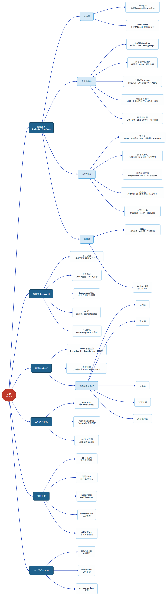
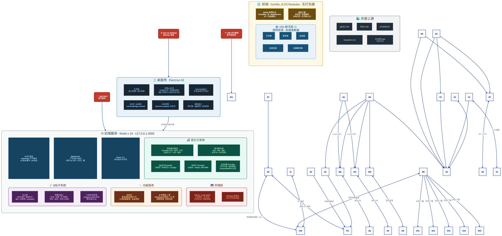

# LIRA 架构文档

> 适用代码:仓库根 [src/](../../src/)、[public/](../../public/)、[package.json](../../package.json)

本目录按**位置**组织架构文档(后端 / 前端 / 桌面端 / 工程),摒弃旧的 00–11 编号。核心约定:**每个技术事实只在一个文件成表**(单一事实源),其余文件用相对链接引用——低耦合、高细节(精确到端口、函数、通道、端点、常量)。事实归属见文末[事实地图](#事实地图)。

## 进程模型

- **后端服务**(Node ≥ 24,零框架 `node:http`):承载 HTTP API、静态页面、WebSocket 推送、Bilibili 弹幕长连与全部领域服务,端口 **3000**(`127.0.0.1`)。详见 [backend/server-core.md](backend/server-core.md)。
- **桌面壳**(Electron 43):main 进程**同进程**内嵌后端服务,提供窗口、登录 Cookie 分区、`local-media://` 协议、自动更新。详见 [desktop/main.md](desktop/main.md)。
- **前端**(无框架 Vanilla JS ES 模块):由后端同源服务的静态页面,含管理后台、播放助手与 5 个 OBS 悬浮层。详见 [frontend/pages.md](frontend/pages.md)。

### 产品形态与优先级

LIRA 的主要产品形态是 **Electron 桌面客户端**。`public/` 下的管理后台和播放页面通常是桌面客户端加载的 renderer 资源，不代表一个需要优先适配的独立网页版；直接浏览器访问主要用于调试、兼容性检查或局部维护。用户可见的布局、色彩、窗口尺寸、交互状态和桌面能力以 Electron 运行时为准。OBS 浏览器源悬浮层是明确的例外，按其独立的 OBS 消费场景维护。

三种运行形态:`npm run desktop`(主要产品)、`npm start`(独立服务/调试与兼容性检查)、OBS 浏览器源直连悬浮层页面(见 [engineering/build.md](engineering/build.md))。

## 架构图表

图表源文件在 [diagrams/](diagrams/):架构图用 D2(源 `.d2` + 渲染 PNG),时序图用 Mermaid。

**项目整体全貌**(思维导图 · 源 [diagrams/overview.d2](diagrams/overview.d2)):

**整体架构 · 组件与连接**(源 [diagrams/components.d2](diagrams/components.d2)):

**点歌全链路时序图**(观众弹幕 → 播放 · [diagrams/song-request-flow.md](diagrams/song-request-flow.md),Mermaid `sequenceDiagram`,GitHub 原生渲染;本地预览用 VSCode Mermaid 插件)。

渲染命令见各 `.d2` 文件头注释。

## 文档导航

### 后端 backend/

| 文档 | 内容 |
|---|---|
| [server-core.md](backend/server-core.md) | HTTP 服务核心与进程生命周期:端口、环境变量、请求管线、token 注入、启动/关闭时序 |
| [ws.md](backend/ws.md) | WebSocket 传输(手写 RFC 6455)、快照 16 字段、消息类型与广播原因全集 |
| [api.md](backend/api.md) | **HTTP API 端点全量注册表**:15 路由模块 × 90 端点 |
| [storage.md](backend/storage.md) | 存储层:数据目录、SQLite 五库 26 表、迁移系统、保留策略、settings 全表 |
| [ai.md](backend/ai.md) | AI 互动助手:模型服务、6 工具、配额与审计、密钥加密 |
| [overtime.md](backend/overtime.md) | 加班机:服务端权威倒计时、礼物结算幂等管线、规则与盲盒 |
| [music/qq-provider.md](backend/music/qq-provider.md) | QQ 音乐上游 API 逆向工程(13 端点、GTK、zzcSign、QRC) |
| [music/netease-provider.md](backend/music/netease-provider.md) | 网易云上游 API 逆向工程(12 端点、weapi 双 AES+RSA、歌词解析器) |
| [music/services.md](backend/music/services.md) | 音乐域服务:Provider 注册表、曲库、队列、匹配、缓存、歌词状态、**歌词解析器(LRC/YRC/QRC)** |
| [music/wesing.md](backend/music/wesing.md) | 全民K歌采集栈:日志扫描、QRC 解密、PowerShell/C# 监视、播放时钟 |
| [bilibili/protocol.md](backend/bilibili/protocol.md) | B站直播协议:HTTP API、WBI 签名、WS 二进制帧、自实现 protobuf、解析器 |
| [bilibili/danmaku.md](backend/bilibili/danmaku.md) | 弹幕监听管线与机器人:轮询器、去重、命令解析、签到/抽签/自定义回复 |
| [bilibili/gift.md](backend/bilibili/gift.md) | 礼物检测管道(progress→final 账本)与醒目留言服务 |

### 前端 frontend/

| 文档 | 内容 |
|---|---|
| [pages.md](frontend/pages.md) | 页面与入口 URL 清单、public/ 模块地图、CSS 与静态资源 |
| [comms.md](frontend/comms.md) | 前后端通信:token 注入、fetch 约定、WS 客户端、桌面桥 |
| [app.md](frontend/app.md) | Admin 应用与公共框架(EventBus/DI/StateService)及 27 个功能模块 |
| [playback.md](frontend/playback.md) | 播放引擎:状态机、音源解析、本地文件、队列持久化 |
| [overlays.md](frontend/overlays.md) | 浏览器源 ×11:队列/歌单/盲盒/加班机/礼物特效/歌词/弹幕/小游戏/转盘/开播画面/时钟 |

### 桌面端 desktop/

| 文档 | 内容 |
|---|---|
| [main.md](desktop/main.md) | 主进程:窗口、单实例、userData、`local-media://`、请求头伪装、关闭握手 |
| [windows.md](desktop/windows.md) | 辅助窗口:歌词窗、音乐登录窗、B站登录窗 |
| [auth.md](desktop/auth.md) | 登录与会话:分区模型、登录 URL、Cookie 加密快照与注入契约 |
| [preload.md](desktop/preload.md) | **IPC 全量注册表**:33 通道 + contextBridge 桥 + 调用方地图 |
| [update.md](desktop/update.md) | 自动更新运行时状态机与 IPC |

### 工程 engineering/

| 文档 | 内容 |
|---|---|
| [build.md](engineering/build.md) | npm scripts、依赖清单、electron-builder 配置、发布流水线、运行模式 |
| [test.md](engineering/test.md) | node:test 测试体系、覆盖地图、分层验证、静态检查与诊断脚本 |
| [modularity-standard.md](engineering/modularity-standard.md) | 模块边界、组合根、持久化端口、共享工具和架构适应度函数的强制规范 |
| [ai-workflow.md](engineering/ai-workflow.md) | AI 变更的 owner、contract、consumer 与 test 路由表 |
| [legacy-boundaries.md](engineering/legacy-boundaries.md) | 遗留边界、迁移方向与增量执行状态 |

### 图表 diagrams/

| 文档 | 内容 |
|---|---|
| [overview.d2](diagrams/overview.d2) | 项目整体全貌思维导图(D2 源 · 渲染 [overview.png](diagrams/overview.png)) |
| [components.d2](diagrams/components.d2) | 整体架构图:进程/子系统/存储/外部上游的组件与连接(D2 源 · 渲染 [components.png](diagrams/components.png)) |
| [song-request-flow.md](diagrams/song-request-flow.md) | 点歌全链路时序图(Mermaid):弹幕 → 命令 → 匹配 → 入队 → 广播 → 播放 |

### 决策记录 adr/

[0001-runtime-boundaries](adr/0001-runtime-boundaries.md) · [0002-server-authoritative-timing](adr/0002-server-authoritative-timing.md) · [0003-settle-once-per-gift-group](adr/0003-settle-once-per-gift-group.md) · [0004-reuse-monolith-and-gift-db](adr/0004-reuse-monolith-and-gift-db.md) · [0005-built-in-overtime-backgrounds](adr/0005-built-in-overtime-backgrounds.md) · [0006-shared-gift-detection-core](adr/0006-shared-gift-detection-core.md) · [0007-explicit-module-boundaries](adr/0007-explicit-module-boundaries.md) · [0008-ai-assisted-change-governance](adr/0008-ai-assisted-change-governance.md) · [0009-first-run-onboarding](adr/0009-first-run-onboarding.md) · [0010-bilibili-user-info-facade](adr/0010-bilibili-user-info-facade.md)

## 技术栈速查(名称速览,精确版本见 [engineering/build.md](engineering/build.md))

| 层 | 技术 |
|---|---|
| 运行时 | Node.js(engines ≥ 24) |
| 后端 | `node:http` 手写路由、手写 RFC 6455 WebSocket、`node:sqlite`(DatabaseSync)、`node:test` |
| 桌面 | Electron 43、electron-builder(NSIS)、electron-updater、safeStorage(DPAPI)、`local-media://` 自定义协议 |
| 前端 | 无框架 Vanilla JS ES 模块 + 原生 CSS(无打包器) |
| 运行时依赖(仅 3 个) | `@jixun/qmweb-sign`(QQ 签名)、`qrc-decoder`(QRC 解密)、`electron-updater` |

## 领域架构

| 子系统 | 文档入口 |
|---|---|
| 点歌(曲库/队列/匹配/冷却) | [backend/music/services.md](backend/music/services.md) + [backend/api.md](backend/api.md) §7–§8 |
| 音乐播放(QQ/网易云/本地/全民K歌) | [backend/music/](backend/music/) + [frontend/playback.md](frontend/playback.md) |
| 弹幕交互(协议/机器人/礼物/SC) | [backend/bilibili/](backend/bilibili/) |
| 加班机(礼物→倒计时) | [backend/overtime.md](backend/overtime.md) |
| AI 互动助手 | [backend/ai.md](backend/ai.md) |
| 桌面壳(窗口/登录/更新) | [desktop/](desktop/) |
| 悬浮层(OBS) | [frontend/overlays.md](frontend/overlays.md) |

## 事实地图(单一事实源归属)

查某一事实去哪儿找——每个事实族只有一个「成表处」,其他文档只能以句子+链接引用:

| 事实族 | 归属文件 |
|---|---|
| 端口/环境变量/启动与关闭时序/token 注入机制 | [backend/server-core.md](backend/server-core.md) |
| HTTP 端点(92 个)与方法/请求/响应/错误码契约 | [backend/api.md](backend/api.md) |
| `roomId` 规范化算法/`customReplyRules` 解析规则 | [backend/api.md](backend/api.md) §2.1–§2.2 |
| WS 传输参数/快照 16 字段/消息类型/reason 枚举 | [backend/ws.md](backend/ws.md) |
| Bilibili 用户信息合并、字段投影与房间 run 生命周期 | [backend/bilibili/danmaku.md](backend/bilibili/danmaku.md) §10 |
| 数据目录树/数据库文件/表 DDL/迁移版本/保留策略/settings 键 | [backend/storage.md](backend/storage.md) |
| IPC 通道(33 个)与 preload 桥 | [desktop/preload.md](desktop/preload.md) |
| 登录分区/登录 URL/Cookie 快照格式 | [desktop/auth.md](desktop/auth.md) |
| 自动更新状态机 | [desktop/update.md](desktop/update.md) |
| `local-media://` 协议/请求头伪装(webRequest) | [desktop/main.md](desktop/main.md) |
| 页面入口 URL 与 public/ 模块清单 | [frontend/pages.md](frontend/pages.md) |
| `bilibili-gifts.json` 字段 schema / `theme-presets.json` 结构 | [frontend/pages.md](frontend/pages.md) §6.1–§6.2 |
| 叠加层 CSS 变量(`--overlay-*`)完整注入表 | [frontend/overlays.md](frontend/overlays.md) §1.2 |
| 歌词解析器(LRC/YRC/QRC 行模型、逐字词、时间容差) | [backend/music/services.md](backend/music/services.md) §14 |
| 加班机算法(权重/时钟/重试) | [backend/overtime.md](backend/overtime.md) |
| npm scripts/依赖版本/electron-builder 配置 | [engineering/build.md](engineering/build.md) |
| 测试命令与测试文件清单 | [engineering/test.md](engineering/test.md) |
| 模块化、低耦合与组合根约束 | [engineering/modularity-standard.md](engineering/modularity-standard.md) |
| AI 任务的 owner/contract/consumer/test 路由 | [engineering/ai-workflow.md](engineering/ai-workflow.md) |
| 遗留边界、迁移方向与执行状态 | [engineering/legacy-boundaries.md](engineering/legacy-boundaries.md) |
| 规格生命周期状态与运行时证据 | [../../specs/README.md](../../specs/README.md) |
| 架构图表(D2 源与 PNG、Mermaid 时序图) | [diagrams/](diagrams/) |
| 架构决策 | [adr/](adr/) |

## 相邻文档树

- [../bilibili-live-api/](../bilibili-live-api/) — B站直播**平台 API** 参考(用户/信息/直播流/管理/消息流等),协议实现见 [backend/bilibili/protocol.md](backend/bilibili/protocol.md)。
- [../../UPDATE.md](../../UPDATE.md) — 版本变更日志。
- [../../specs/](../../specs/) — 逆向规格与设计稿(WeSing、桌面歌词等特性设计)。
