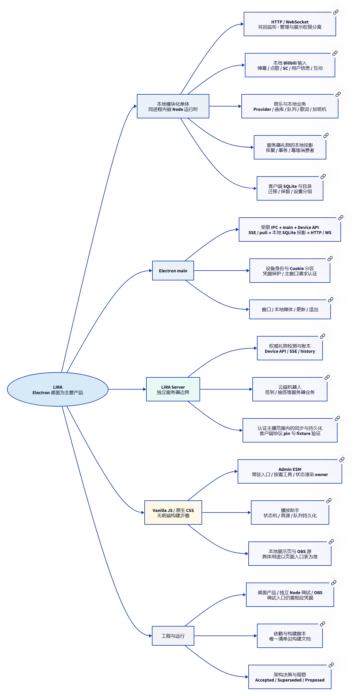
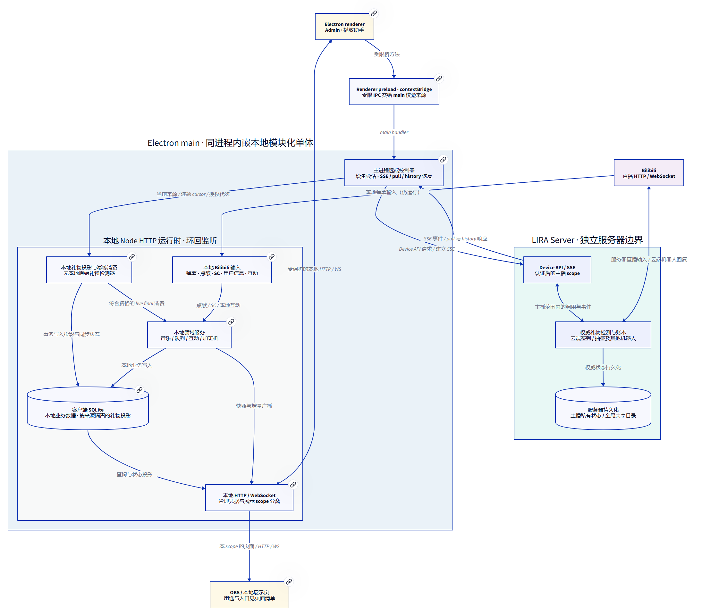

# LIRA 架构

本目录维护系统职责、进程与信任边界、依赖方向、数据流和架构决策。端点、DTO、表结构、常量及操作命令见 [技术参考与事实地图](../reference/README.md)。文档类型和维护规则见 [文档入口](../README.md)。

## 进程与产品边界

LIRA 是以 Electron 桌面为主要 UI 的模块化单体。Electron main 同进程内嵌本地 Node 后端；renderer 使用原生 JavaScript ES modules 和 CSS，本地 HTTP/WS 提供管理数据与展示投影。OBS / 哔哩哔哩直播姬的浏览器源是独立的浏览器消费场景，直播平台为 B 站。

| 边界 | 稳定职责 | 实现参考 |
| --- | --- | --- |
| 本地后端 | 组合本地领域服务、HTTP/WS、存储与本地 Bilibili 输入 | [服务核心](../reference/backend/server-core.md) |
| Electron main | 窗口、设备会话、平台登录、受限 IPC、远端同步及生命周期 | [主进程](../reference/desktop/main.md)、[认证](../reference/desktop/auth.md) |
| Renderer | UI 状态与用户交互；通过受限桥调用桌面能力 | [Admin](../reference/frontend/app.md)、[通信](../reference/frontend/comms.md) |
| LIRA Server | 权威礼物检测与账本、云端机器人和设备接口 | [礼物投影](../reference/backend/bilibili/gift.md)、[服务器契约锁](../../server-contract.lock.json) |
| 直播画面展示 | 消费范围受限的展示数据，不取得管理或设备凭据 | [页面入口](../reference/frontend/pages.md)、[展示页](../reference/frontend/overlays.md) |

管理页依赖桌面提供的本地授权；独立 Node 入口用于有明确凭据及能力边界的调试。本地 Bilibili 输入继续处理弹幕、点歌、SC、用户信息与互动。礼物原始检测及签到/抽签的执行属于服务器。

## 跨端与数据所有权

- 主播身份由受认证服务边界确定，稳定 `streamerId` 隔离租户；`roomId` 是外部属性。main 持有设备凭据，renderer 不能选择任意租户或取得凭据。授权、账号切换与 Cookie 契约见 [认证参考](../reference/desktop/auth.md)。
- settings、songs、Bilibili 各有明确的同步与恢复 owner。组合根负责接线，控制器负责并发和取消，存储层负责原子提交。各自持久化保证见 [main 的同步生命周期](../reference/desktop/main.md#22-云端同步生命周期) 和 [存储](../reference/backend/storage.md)。
- main 通过实时推送与 HTTP 恢复，将服务器礼物账本写入按来源隔离的本地 SQLite 投影；符合接收条件的连续 final 与同步进度原子提交，提交后才交给本地消费者和 HTTP/WS。恢复及实时业务资格由 [礼物参考](../reference/backend/bilibili/gift.md) 维护，决策见 [ADR-0021](adr/0021-atomic-live-gift-progress.md)。
- 跨仓契约通过固定提交和 fixture 摘要核对，不在运行时跨仓 import。共享源码提案 [ADR-0020](adr/0020-shared-danmaku-source.md) 仍为 Proposed。

## 架构图表

图表只表达稳定组件、边界和流向；易变清单由技术参考维护。D2 源与 SVG/PNG 同步更新，渲染命令在图源头部。

[全貌图源](diagrams/overview.d2)

[组件图源](diagrams/components.d2) · [点歌与播放时序](diagrams/song-request-flow.md)

## 工程边界与变更入口

- [模块化规范](engineering/modularity-standard.md)：依赖方向、组合根、持久化和公共契约。
- [AI 任务路由](engineering/ai-workflow.md)：owner、契约、消费者与测试的定位入口。
- [遗留边界](engineering/legacy-boundaries.md)、[模块化债务](engineering/modularity-debt.md)：现有限制与复审责任。
- [构建与发布](../reference/engineering/build.md)、[测试](../reference/engineering/test.md)：命令与操作参考。

## 架构决策

| 决策 | 状态与关系 |
| --- | --- |
| [0001-runtime-boundaries](adr/0001-runtime-boundaries.md) | Accepted |
| [0002-server-authoritative-timing](adr/0002-server-authoritative-timing.md) | Accepted |
| [0003-settle-once-per-gift-group](adr/0003-settle-once-per-gift-group.md) | Accepted |
| [0004-reuse-monolith-and-gift-db](adr/0004-reuse-monolith-and-gift-db.md) | Accepted |
| [0005-built-in-overtime-backgrounds](adr/0005-built-in-overtime-backgrounds.md) | Accepted |
| [0006-shared-gift-detection-core](adr/0006-shared-gift-detection-core.md) | Accepted |
| [0007-explicit-module-boundaries](adr/0007-explicit-module-boundaries.md) | Accepted |
| [0008-ai-assisted-change-governance](adr/0008-ai-assisted-change-governance.md) | Accepted |
| [0009-first-run-onboarding](adr/0009-first-run-onboarding.md) | Superseded；现用交互式引导，见 ADR 内的替代说明 |
| [0010-bilibili-user-info-facade](adr/0010-bilibili-user-info-facade.md) | Accepted |
| [0011-source-partitioned-gift-ledger-projection](adr/0011-source-partitioned-gift-ledger-projection.md) | Accepted；来源身份由 [ADR-0019](adr/0019-stable-gift-source-owner.md) 替代；实时提交由 [ADR-0021](adr/0021-atomic-live-gift-progress.md) 扩展 |
| [0012-local-paid-gift-catalog](adr/0012-local-paid-gift-catalog.md) | Accepted；旧目录 schema/图片兼容策略的替代关系见 ADR 首段 |
| [0013-persistent-desktop-user-data](adr/0013-persistent-desktop-user-data.md) | Superseded by [ADR-0015](adr/0015-install-local-desktop-data.md) |
| [0014-gift-identity-bound-overtime](adr/0014-gift-identity-bound-overtime.md) | Accepted |
| [0015-install-local-desktop-data](adr/0015-install-local-desktop-data.md) | Accepted |
| [0016-separated-client-data-lifecycles](adr/0016-separated-client-data-lifecycles.md) | Accepted |
| [0017-incremental-modularity-size-gate](adr/0017-incremental-modularity-size-gate.md) | Accepted |
| [0018-unified-logging-and-diagnostics](adr/0018-unified-logging-and-diagnostics.md) | Accepted；分阶段实施，未完成范围见 ADR 状态说明 |
| [0019-stable-gift-source-owner](adr/0019-stable-gift-source-owner.md) | Accepted；替代 [ADR-0011](adr/0011-source-partitioned-gift-ledger-projection.md) 的旧来源身份 |
| [0020-shared-danmaku-source](adr/0020-shared-danmaku-source.md) | Proposed；共享源码分发方案，不代表已部署能力 |
| [0021-atomic-live-gift-progress](adr/0021-atomic-live-gift-progress.md) | Accepted；连续 SSE 礼物和游标原子提交，HTTP 保留恢复与周期核对 |

## 事实地图

完整事实归属表统一维护在 [技术参考索引](../reference/README.md#事实地图单一事实源归属)。新增实现细节先更新对应 owner；架构变化更新本页、相关图表及适用 ADR。历史 ADR 保留决策上下文，状态与替代说明优先于当时的实现描述。
