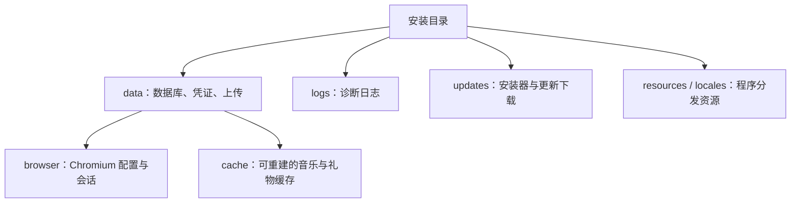

# ADR-0016: 按保留周期分离客户端数据

## Status

Accepted — 2026-09-13，用户要求参考成熟项目并修改代码与存储。细化 ADR-0015 的内部目录，不改变安装目录保存数据的决策。

## Context

旧版将业务数据库、上传素材、授权文件与 Chromium 配置、登录分区、缓存混放在 `data/`。仅凭目录名称难以区分可重建缓存与必须保留的用户资料。

公开实践并不存在统一的“全栈目录”。[Microsoft VS Code portable mode](https://code.visualstudio.com/docs/setup/portable) 在程序旁的 `data` 下分别保存用户资料与扩展；[JetBrains](https://www.jetbrains.com/help/idea/directories-used-by-the-ide-to-store-settings-caches-plugins-and-logs.html) 区分配置、缓存、插件和日志；[Chromium](https://chromium.googlesource.com/chromium/src/+/HEAD/docs/user_data_dir.md) 的 profile 包含 Cookie 等持久资料，Windows 的浏览器缓存也位于 profile。LIRA 采用按所有者与保留周期分类的原则，保留本地单体和安装目录可迁移性。

## Decision

- `dataDir` 继续表示业务数据根，五个数据库及其 WAL/SHM、配置、加密凭证、授权私钥、用户上传与媒体允许清单保持原位置及格式。
- Chromium `userData` 和 `sessionData` 指向 `data/browser`，默认会话和持久登录分区整体保存；该目录包含用户状态，不属于整目录可删除的缓存。崩溃报告位于其 `Crashpad` 子目录。
- 音乐 API、歌词、礼物图片及目录/初始化镜像归入 `data/cache`。礼物镜像与图片、索引一起迁移，HTTP 图片 URL 保持原样。
- 运行日志和更新文件继续位于安装级 `logs` 与 `updates/lira-updater`；更新位置由安装路径解析，不从新的浏览器目录推断。
- 新旧版本使用同一个业务数据根申请 Electron 单实例锁，持锁后、Electron ready 前才迁移并设置浏览器路径。
- 仅移动已知旧条目。先记录并落盘迁移日志，再在同卷逐项重命名；正常运行中不删除源数据、合并目标或丢弃未知文件。中断后按日志继续；两端同时存在、两端均缺失、符号链接或活动服务冲突时停止启动并保留文件。
- 安装器仍完整保留 `data`，因此浏览器、缓存和迁移日志都在原升级保护范围内。未完成的安装恢复仍优先于目录迁移。

## Alternatives and consequences

只移动浏览器缓存不能解决登录分区与业务数据混放；把所有数据再迁入 `data/app` 会无谓改变数据库、凭证和上传路径。当前选择保留业务数据契约，集中变更 Chromium profile 和可重建文件的归属。

目录整理不会直接减少磁盘用量，也不新增自动清理策略。同卷重命名避免复制整个缓存，但要求旧应用退出；迁移失败时不能继续启动空 profile。完成后的旧版本不理解新布局，不支持直接降级后继续写入；恢复旧版本应使用升级前完整备份。

## Verification

[迁移回归](../../../test/data-directory-migration.test.js) 覆盖保留、冲突、中断恢复和活动服务；[启动接线](../../../test/electron-startup-data.test.js) 检查持锁与 ready 时序；[原生 Electron 回归](../../../test/electron-data-layout.test.js) 使用临时 profile 验证 Cookie、音乐分区、localStorage、safeStorage 和单实例。权威目录树见 [storage.md](../backend/storage.md)。
