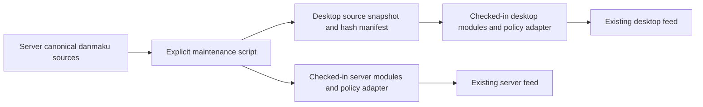

# ADR-0020: Distribute shared danmaku source as checked-in snapshots

## Context and requirements

Audit F07 requires one owner for common danmaku rendering and style rules while
preserving independent deployments and existing feed behavior. Server ADR-0049
requires the server to run without the desktop repository or Electron. Neither
repository may acquire a frontend build step or a new runtime package dependency.
This proposal is pending maintainer acceptance; it does not supersede ADR-0049.

## Proposed decision

LIRA Server owns three small ESM sources under `shared/danmaku/`: pure style
validation/defaults, DOM renderer, and the browser style application/parser.
The renderer has explicit policy inputs for system-message class decoration and
entrance delay. Existing desktop behavior stays at no system class and
`min(index, 8) * 24ms`; server behavior stays at system decoration and zero delay.
Timers, feed queues, expiry, reduced motion, removal callbacks and trimming remain
in each repository's existing feed implementation.

An explicit Node maintenance script copies the ESM sources and emits the CJS
style contract from the same restricted named-export source. Generated artifacts
are checked in. Existing consumer file paths stay as thin adapters/re-exports;
the browser loads only files within its own deployed application. Server static
allowlists must include any new local module paths.

The desktop snapshot has a manifest containing schema version, source repository,
source file mapping and SHA-256 hashes after LF normalization. Content hashes
identify the accepted source precisely without requiring a simultaneous release
or a new commit during local development. This manifest is independent of
`server-contract.lock.json`, which continues to pin protocol fixtures only.

Maintenance commands:

- Server `node scripts/sync-danmaku-source.cjs --check`: regenerate in memory and
  fail on stale/missing local artifacts; never silently rewrite in check mode.
- Server `node scripts/sync-danmaku-source.cjs --write`: explicitly refresh its
  checked-in local artifacts from canonical sources.
- Desktop `node scripts/sync-danmaku-source.cjs --server-root <path> --write`:
  explicitly import the selected server sources, regenerate its snapshot and
  refresh the content manifest. No network fetch and no runtime sibling lookup.
- Desktop `node scripts/sync-danmaku-source.cjs --check`: verify its checked-in
  snapshot and local generated artifacts without requiring a server checkout.
- Desktop `node scripts/sync-danmaku-source.cjs --server-root <path> --check`:
  additionally compare the selected server's canonical source hashes. Fail on
  drift, missing source or wrong manifest; do not compare arbitrary server HEAD
  against the unrelated protocol fixture lock.

Each repository runs its local check in normal CI. Cross-repository comparison is
required when importing shared-source changes; it may use an explicitly selected
checkout and does not demand that independently released snapshots always match
latest HEAD. Synchronization is a developer maintenance action, not a frontend
build or deployment requirement.

## Alternatives and tradeoffs

Manual copies plus parity tests detect some drift but retain multiple editable
owners. Runtime cross-repository imports violate deployment independence. A new
published npm package or frontend bundler adds release/build machinery beyond
this small shared surface. Checked-in snapshots add generated files and an
explicit import step, but give reviewable diffs and offline independent builds.
A content pin records exact inputs, not a guarantee that they are newest.

## Delivery and verification

1. Establish canonical sources and deterministic emit/check scripts, with tests
   proving check mode detects corruption and never writes.
2. Adapt both existing module entry points. Preserve exported APIs, trusted URL
   callbacks, text-node rendering, gift artwork fallback, measurement and all
   two-sided renderer policy differences.
3. Run both existing Node/browser style parity suites, renderer behavior suites,
   feed lifecycle tests and server static delivery tests. Compare source hashes
   across these worktrees; test each local check without the sibling checkout.
4. Review diffs, syntax, architecture and packaging inclusion. No fixture-lock
   revision change, commit, publication or deployment is part of this task.

## Acceptance

Deferred by the user on 2026-09-21; do not implement until resumed and accepted.
Pending review of ownership, checked-in source distribution and content-pin
policy. Once accepted, implement F07 against this design and record evidence in
`specs/plans/2026-09-21-client-server-reuse-modularity.md`.
