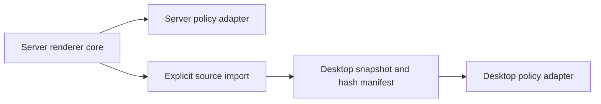

# ADR-0020: Distribute the shared danmaku renderer as a pinned source snapshot

## Context and acceptance

The user authorized delivery optimizations and reusable modules on 2026-10-10,
resuming the common-renderer part of the proposal deferred on 2026-09-21.
Both applications need the same message DOM, while their feed timing and system
message decoration intentionally differ. Server ADR-0049 requires independent
server deployment. Neither application needs a new runtime dependency or build.

The accepted scope is the message renderer only. Style defaults/validation,
style-specific decorators, feeds, and the proposed protobuf reader remain with
their existing owners; their wider source-distribution proposals are not treated
as implemented by this decision.

## Decision

LIRA Server owns `public/overlay/danmaku-renderer-core.js`. The desktop checks in
an identical LF-normalized copy at
`public/js/overlays/danmaku-renderer-core.js`. Existing
`danmaku-message-renderer.js` entry points remain small adapters, preserving
exports and supplying explicit system-message and entrance-delay policies.
The desktop retains no system class and `min(index, 8) * 24ms`; the server retains
the system class and zero delay. Each core imports only local style decorators.
Feed queues, expiry, trimming, observers and animation scheduling remain local.

The desktop's `src/shared/danmaku-source-manifest.json` records schema version,
source repository, source and target paths, and SHA-256 after LF normalization.
It is independent of `server-contract.lock.json`, which continues to pin wire
fixtures. The source and snapshot are reviewed and released independently;
latest server HEAD need not equal every previously released desktop snapshot.

Developer commands in the desktop repository:

- `node scripts/sync-danmaku-source.cjs --check`: verify the shipped snapshot
  against its manifest without needing a server checkout; never write.
- `node scripts/sync-danmaku-source.cjs --server-root <path> --check`: also compare
  the explicitly selected server checkout. Drift fails without changing files.
- `node scripts/sync-danmaku-source.cjs --server-root <path> --write`: explicitly
  import that source and update its manifest. Review before running this command.

Server maintainers edit the canonical module directly; there is no generated
server artifact. The existing asset snapshot includes the core automatically.
The desktop's engineering test checks its local pin. Importing a change also
requires cross-repository comparison and both renderer suites; each deployment
loads only its own files. No runtime sibling lookup, fetch, symlink, frontend
bundler or published package is introduced.

```mermaid
flowchart LR
  Source[Server renderer core] --> ServerAdapter[Server policy adapter]
  Source --> Import[Explicit source import]
  Import --> Snapshot[Desktop snapshot and hash manifest]
  Snapshot --> DesktopAdapter[Desktop policy adapter]
```

## Tradeoffs and alternatives

Two separately editable renderers require repeated bug fixes and can drift.
A runtime shared dependency would undermine offline desktop rendering and
independent deployments. A published package or bundler adds release machinery
for one small module. A pinned snapshot keeps independent releases and one
source owner, at the cost of an explicit review/import step. It does not claim
that unrelated theme files or all style rules have one source.

## Verification

`test/engineering/danmaku-source.test.js` checks pin integrity, CRLF normalization,
explicit imports, selected-server drift and read-only failure. Existing renderer,
feed and browser checks cover text-safe DOM, trusted image callbacks, gift/SC
rendering and theme behavior. Both adapters have explicit policy regressions.
Current delivery evidence is recorded in the
[optimization plan](../../../specs/plans/archive/2026-10-10-danmaku-delivery-efficiency.md).
