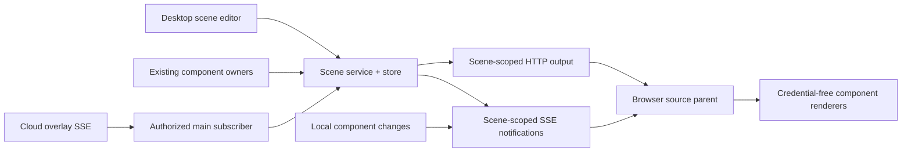

# ADR-0022: Local component scene ownership

## Status

Accepted under the user's 2026-09-30 request to execute P3 and local P4. The local scope is implemented and verified; completion evidence is recorded in the archived implementation plan.

## Context

Default component configuration has different local/cloud owners. A multi-component editor does not itself provide a stable, consumable scene or an atomic cross-domain save. The accepted design requires local combination, independent instances and a complete visual version without changing real business state.

## Decision

Add a scene service/store inside the existing modular monolith. Scene publication owns an immutable layout and style-selection snapshot. The browser-source parent consumes only a per-scene capability, reads a bounded display projection and supplies credential-free sandboxed renderer instances. It prepares a complete next version and swaps containers only when all required renderers are ready.

Main consumes the existing trusted cloud public-overlay SSE once per authorized owner. No new Server endpoint is required. Cloud capabilities stay in main; current owner comes from authorized Server identity. No local sample or Bilibili feed substitutes for cloud overlay events.

Persist the local scene capability as hash plus a safeStorage-encrypted, owner-bound package. It is accepted only by the exact scene output and notification HTTP routes, not general HTTP/WS authorization. Defaults remain owned by their existing components.

The user's 2026-10-08 shared-parameter requirement supersedes freezing shared
appearance values at publication. Desktop saved settings take precedence over
old scene copies. The existing component/settings owners and resource-style
library supply an allowlisted live appearance projection by published item ID.
The editor uses the same sources for all instances of a style; clock profiles and
opening media stay separated by style. Desktop cloud/IPC writes retain their
existing controller authority. Local display fields use the current attached
canvas capability, with Origin checks and reauthorization after reading bodies.
Saved appearance updates reach existing output frames without publishing draft
geometry or replaying events. Scene-only fields, layout, style selection and
third-party media/CSS instances retain their scene owner. No bulk scene rewrite,
schema migration or cross-owner atomic save is implied.

Under the user's 2026-10-01 fixed-pixel requirement, the scene store also owns
current-owner default component output dimensions. Shared geometry and the scene
snapshot publish atomically; original component sources consume the saved size
through their existing overlay principal. Independent source addresses project a
published item from that same scene, using the scene capability. This adds no
second appearance or business-state owner. Output pixels are independent of the
browser viewport; editor zoom remains separate.

The user's 2026-10-05 external-browser-source requirement adds an independent
`browser` item alongside the owned components. Its provider URL may contain a
provider capability; the existing scene secret codec encrypts that URL with
owner/scene/item binding, and templates require a fresh URL. It receives no LIRA
credentials or component data and retains the opaque iframe sandbox. Its load
event establishes navigation completion, not provider business readiness. The
[scene specification](../../../specs/component-scenes.md) records these limits.

For publications that retain the same visible instance identities/types, owned appearance and browser URLs, the existing prepared frames apply layout and browser viewport changes in place. Their DOM parents and live connections remain intact; version and projection acknowledgement advance synchronously. Other changes retain the complete-version preparation boundary.

The user's 2026-10-05 preventive latency optimization adds a local, scene-authorized
fetch SSE notification stream. Runtime changes coalesce by affected component
type; the stream contains only `ready`, `change` or `revoked`, and the existing
output API retains data projection, cursor semantics and final access checks.
Both routes use the fragment capability in an Authorization header with omitted
credentials. Stream access binds the owner epoch, scene, capability and optional
item; active projection receipts retain old component subscriptions until the
renderer commits. Access and server license/lifecycle are rechecked before each
notification and every second. Shutdown disposes streams before inflight drain.

The browser serializes output reads with a 100ms minimum start interval and a
five-second health check. A missing, saturated or disconnected stream falls back
to 750ms polling and bounded reconnect retries. Initial notification HTTP errors
alone do not revoke healthy output; an explicit stream revocation or output
authorization failure clears it. The local runtime allows at most four streams
to leave HTTP/1 connection capacity for data and assets. This changes neither
the generic WebSocket principal nor the remote Server contract.

## External Artwork Packages

The 2026-10-06 requirement externalizes Moonlit artwork while retaining the trusted client renderers. ZIP schema 2 declares known presets and complete asset maps; it never installs JavaScript or stylesheets. Scene appearances retain immutable per-package resource URLs alongside the preset. The existing library owns staged import and deletion, and existing component owners retain time, chat, wishes and animation behavior. CSS comes from a fixed client registry and only its validated resource URLs are substituted. A new renderer still requires a client update; additional styles using supported renderers do not. This avoids a general plugin execution boundary while preserving the original layered appearance. The archive schema allows variable subsets and repeated component types.

## Alternatives And Trade-offs

The user's 2026-10-06 scene-preset requirement keeps one active canvas output.
Presets reuse the existing independently saved scene documents. A small owner-scoped
store binding retains the original source identity and last applied preset. Selecting
or saving a preset changes no live output; explicit canvas publication checks the
preset revision and output version, then commits the snapshot, active preset and
shared dimensions together. Browser URLs are re-encrypted for the output identity.
The browser relay exposes desktop-mediated preset operations without granting
general scene-management authority. This adds no separate runtime or business owner.

- Rejected cross-component rollback: independent cloud/local writes cannot provide a common transaction.
- Rejected composing owned components through their credential-bearing source URLs: broadens capabilities and gives no complete-version preparation boundary. User-supplied external browser sources follow the narrower exception above.
- A notification-only SSE stream removes the mandatory polling wait while keeping the existing WS security contract and cloud cursor/gap semantics. It adds connection lifecycle and revalidation responsibilities; polling remains the compatibility fallback and health check. External provider frames keep their own direct data connections.
- A local source needs the desktop runtime. Encrypted capability recovery also needs the same OS secret protection. The existing port-fallback contract remains; changed network addresses require recopying sources.
- Templates and history contain display documents only. Cross-device/cloud publication and OBS control remain separate possible work.

## Verification

See specs/component-scenes.md and specs/plans/archive/2026-09-30-component-workspace.md for acceptance criteria and completion evidence, including the 3,280-test full suite and isolated Electron/browser-source checks. Synthetic verification does not claim production live-account acceptance.

The notification enhancement is recorded in the [scene live update plan](../../../specs/plans/archive/2026-10-05-scene-live-updates.md), including affected tests, compatibility gates and unrelated editor test limitations.
