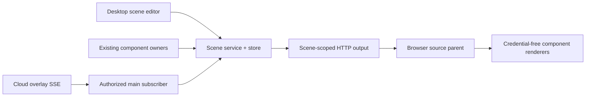

# ADR-0022: Local component scene ownership

## Status

Accepted under the user's 2026-09-30 request to execute P3 and local P4. The local scope is implemented and verified; completion evidence is recorded in the archived implementation plan.

## Context

Default component configuration has different local/cloud owners. A multi-component editor does not itself provide a stable, consumable scene or an atomic cross-domain save. The accepted design requires local combination, independent instances and a complete visual version without changing real business state.

## Decision

Add a scene service/store inside the existing modular monolith. Scene publication owns an immutable display snapshot. The browser-source parent consumes only a per-scene capability, polls a bounded display projection and supplies credential-free sandboxed renderer instances. It prepares a complete next version and swaps containers only when all required renderers are ready.

Main consumes the existing trusted cloud public-overlay SSE once per authorized owner. No new Server endpoint is required. Cloud capabilities stay in main; current owner comes from authorized Server identity. No local sample or Bilibili feed substitutes for cloud overlay events.

Persist the local scene capability as hash plus a safeStorage-encrypted, owner-bound package. It is accepted only by the exact scene output HTTP route, not general HTTP/WS authorization. Defaults remain owned by their existing components; “publish complete scene” freezes their current appearance explicitly.

Under the user's 2026-10-01 fixed-pixel requirement, the scene store also owns
current-owner default component output dimensions. Shared geometry and the scene
snapshot publish atomically; original component sources consume the saved size
through their existing overlay principal. Independent source addresses project a
published item from that same scene, using the scene capability. This adds no
second appearance or business-state owner. Output pixels are independent of the
browser viewport; editor zoom remains separate.

## Alternatives And Trade-offs

- Rejected cross-component rollback: independent cloud/local writes cannot provide a common transaction.
- Rejected composing credential-bearing source URLs: broadens capabilities and gives no complete-version preparation boundary.
- HTTP polling avoids changing the existing WS broadcast/security contract. It adds bounded polling latency and must preserve cloud cursor/gap semantics.
- A local source needs the desktop runtime. Encrypted capability recovery also needs the same OS secret protection. The existing port-fallback contract remains; changed network addresses require recopying sources.
- Templates and history contain display documents only. Cross-device/cloud publication and OBS control remain separate possible work.

## Verification

See specs/component-scenes.md and specs/plans/archive/2026-09-30-component-workspace.md for acceptance criteria and completion evidence, including the 3,280-test full suite and isolated Electron/browser-source checks. Synthetic verification does not claim production live-account acceptance.
