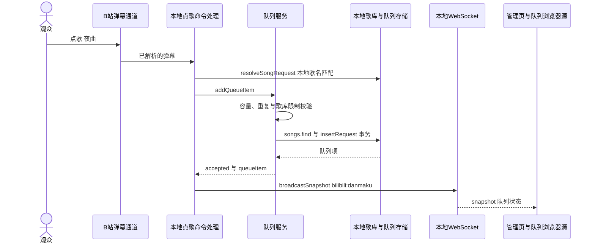
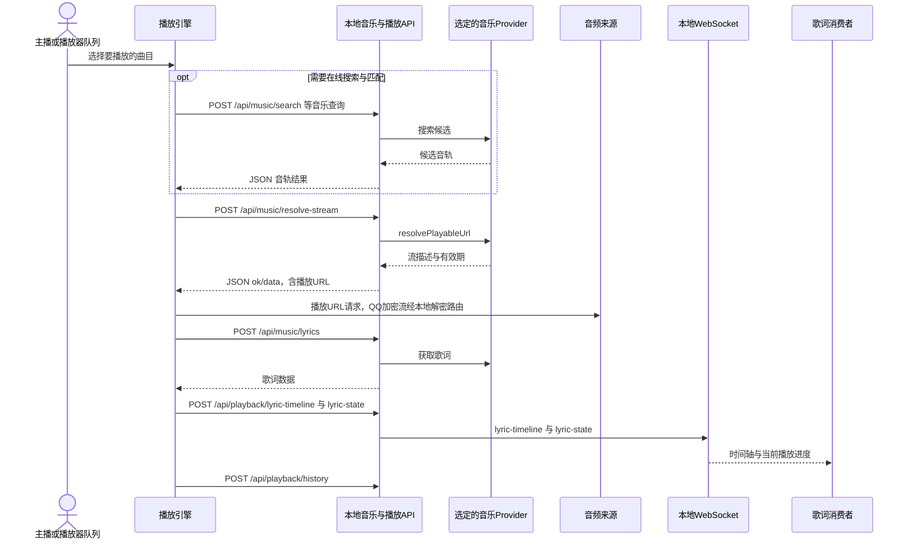

# 点歌与播放时序

弹幕点歌在本地歌库匹配并入队。播放器选中曲目后，独立执行在线音源搜索、匹配及流地址解析；入队本身不调用 QQ 搜索，也不保证自动开始播放。

拥有者：[命令处理](../../../src/bilibili/bilibili-message-handler.js)、[领域装配](../../../src/server/domain-services.js)、[队列服务](../../../src/music/queue-service.js)、[队列存储](../../../src/storage/queue-store.js)、[音乐路由](../../../src/server/routes/music-routes.js)、[播放路由](../../../src/server/routes/playback-routes.js)。

队列的请求人身份只在相应领域使用，公开页面使用各自的投影。点歌确认弹幕取决于机器人设置，不是每次入队的固定步骤。

本地文件和全民 K 歌分别走本地媒体与采集通道；详细播放/歌词消息约束见 [music/services.md](../backend/music/services.md) 和 [ws.md](../backend/ws.md)。
