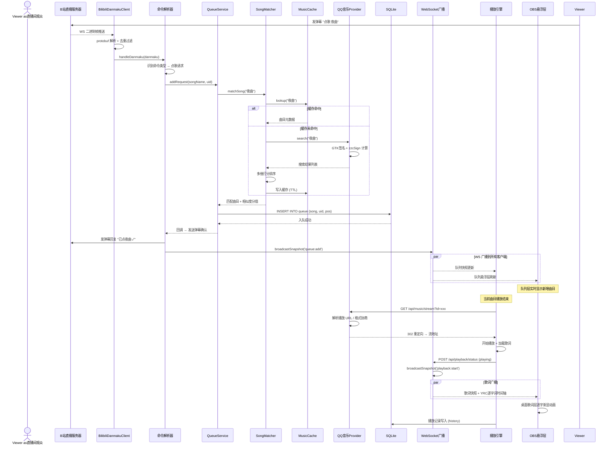

# 点歌全链路时序图(观众弹幕 → 播放)

> 涉及文件: [src/bilibili/danmaku-client.js](../../../src/bilibili/danmaku-client.js)(WS 二进制帧解析) · [src/bilibili/bilibili-message-handler.js](../../../src/bilibili/bilibili-message-handler.js)(命令解析) · [src/music/queue-service.js](../../../src/music/queue-service.js)(队列) · [src/music/song-matcher.js](../../../src/music/song-matcher.js)(匹配打分) · [src/music/music-cache.js](../../../src/music/music-cache.js)(缓存) · [src/music/providers/qq-provider.js](../../../src/music/providers/qq-provider.js)(上游搜索/流地址) · [src/storage/database.js](../../../src/storage/database.js)(SQLite) · [src/server/ws.js](../../../src/server/ws.js)(快照广播) · [public/js/playback/](../../../public/js/playback/)(播放引擎)

本图由 Mermaid `sequenceDiagram` 渲染(GitHub 原生支持;本地预览用 VSCode Mermaid 插件)。

