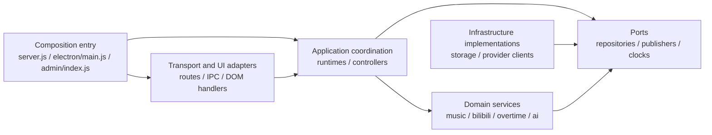

# Modularity And Low-Coupling Engineering Standard

> Status: Applies to new code and code changed by the current task
>
> Scope: `src/`, `public/`, `scripts/`, `tools/`, `test/`, and maintained installer source in `build/`

This standard defines dependency direction, composition, persistence boundaries,
and compatibility migration for the LIRA modular monolith. The objective is not
to maximize abstraction count. It is to keep a business change inside its owning
module and explicit consumers.

## 1. Design Goals

- Keep the backend embedded in Electron main. Do not add a service, background
  process, port, deployment unit, web framework, or frontend build system.
- Preserve HTTP, WebSocket, IPC, SQLite schema, persisted data, and browser page
  contracts by default.
- Runtime resources are owned by explicit runtime instances. Module loading must
  not implicitly create databases, sockets, timers, or listeners.
- Dependencies are visible through `import`, `require`, or factory parameters.
  Globals exist only at documented compatibility boundaries.
- A new abstraction must isolate a real source of change or protect a boundary.
  Do not add a wrapper used by one caller when it provides no boundary value.

## 2. Allowed Dependency Direction

Required direction:

1. `src/server/routes/` receives application capabilities, not database handles.
2. Domain services do not receive a broad `context` or complete `db` object when
   they need only a narrow store, repository, publisher, clock, or provider.
3. `src/storage/` may depend on pure shared helpers, but not on `src/server/`,
   `src/electron/`, or `public/`.
4. `src/server.js`, `src/electron/main.js`, and frontend entrypoints may depend on
   internal modules. Internal modules do not import those entrypoints.
5. Cross-domain calls use an explicit facade, consumer, or port. A domain does
   not read another domain's internal mutable state.

### 2.1 Directory Roles

| Code location                                                 | Architecture role      | Allowed dependencies                                      | Prohibited dependencies                         |
| ------------------------------------------------------------- | ---------------------- | --------------------------------------------------------- | ----------------------------------------------- |
| `src/server.js`, `src/electron/main.js`, frontend entrypoints | Composition Root       | Public factories and adapters from internal modules       | Reverse imports from internal modules           |
| `src/server/routes/`, `src/electron/ipc/`, DOM handlers       | Transport / UI Adapter | Application facades, stable contracts, pure helpers       | SQLite handles, domain internal state           |
| `src/server/*-runtime.js`, frontend controllers               | Application            | Domain services, ports, public infrastructure factories   | Entrypoints, undeclared globals                 |
| `src/music/`, `src/bilibili/`, `src/overtime/`, `src/ai/`     | Domain                 | Domain-local modules, narrow ports, pure shared contracts | Entrypoints, Electron, DOM, direct SQL          |
| `src/storage/`, provider clients, Electron adapters           | Infrastructure         | Domain contracts, pure shared helpers, platform APIs      | Mutable composition-root state                  |
| `src/shared/`, `public/js/shared/`                            | Stable Shared          | Standard APIs and same-topic pure helpers                 | Domain services, entrypoints, runtime resources |

Expose a cross-directory capability through a clearly named public factory,
facade, consumer, or port. Consumers must not import another domain's private
implementation merely because the file is reachable. A structural test for a
directory-wide boundary must enumerate the target directory instead of checking
only one known file.

## 3. Composition Roots

Composition roots create objects, connect callbacks, choose implementations,
start resources, and close them in reverse order.

- Business decisions, retry policy, state formatting, and log payload construction
  belong to the owning runtime or service.
- A composition root may import many modules, but it must not create a mutable
  dependency bag readable by arbitrary modules.
- A factory accepts only fields it uses. Split responsibilities instead of
  hiding an unclear interface inside `sharedDeps` or a generic context.
- Initialization ordering may use named callback ports. Do not use mutable
  forward declarations as an implicit dependency cycle.
- The runtime that creates a resource owns idempotent cleanup.

## 4. Frontend Modules

- New frontend code uses named ESM imports and exports.
- Do not add `window.AdminApp` dependencies.
  `public/js/admin/legacy-admin-bridge.js` is the intentional compatibility
  boundary for new Admin ESM consumers.
- Existing classic or IIFE modules may remain during incremental migration, but
  their legacy global text debt can only decrease.
- Entrypoints may use side-effect imports for documented compatibility modules;
  application code consumes narrow explicit interfaces.
- EventBus is for one-to-many notification, not hidden request-response calls or
  required dependencies.
- A dependency-injection container is justified only when production code
  resolves registered services. Registration without resolution adds no value.
- DOM, `window.musicAPI`, and network calls are infrastructure boundaries. Core
  logic receives them through focused adapters or injected functions where
  isolation provides test value.

## 5. Persistence

- SQL, table names, columns, and transactions target `src/storage/` store or
  repository adapters. Existing exceptions are frozen legacy debt, not examples
  for new code.
- Domain services depend on behavioral interfaces such as
  `queueStore.addRequest(input)`, not `db.prepare()` or `db.exec()`.
- Stores and repositories own transaction boundaries. Atomic writes across tables
  in one database use one coordinating repository or unit-of-work method.
- Do not split a database, add a process, or add a dependency merely to model a
  transaction.
- Store return values are stable domain objects and do not expose
  `DatabaseSync`, prepared statements, or SQLite-specific result objects.
- A schema change updates migrations, affected stores, regression tests, and
  `docs/architecture/backend/storage.md`.

## 6. Shared Modules

Shared code is cross-domain, side-effect-free, and semantically stable.

- Organize helpers by one subject, for example text, time, or a file codec.
- Platform-, protocol-, or domain-specific behavior remains with its owner.
- Do not create a new `utils.js` aggregation bucket to reduce import lines.
- Compatibility re-exports require a migration reason, a removal condition, and
  a structural regression test.

## 7. Rule Registry

Status meanings:

- `Enforced`: a deterministic gate comprehensively blocks the violation.
- `Incrementally Enforced`: tests freeze known debt or cover only selected paths.
- `Migration Target`: desired direction is documented but not comprehensively
  machine-enforced.

| Rule ID               | Rule                                                          | Status                 | Enforcement                                                                                                                                                                      |
| --------------------- | ------------------------------------------------------------- | ---------------------- | -------------------------------------------------------------------------------------------------------------------------------------------------------------------------------- |
| `MOD-COMPOSITION-001` | Composition roots only wire components and lifecycle          | Incrementally Enforced | Selected composition-root assertions plus review                                                                                                                                 |
| `MOD-STORAGE-001`     | Domain services do not issue SQL                              | Incrementally Enforced | Receiver-aware SQL debt budget                                                                                                                                                   |
| `MOD-STORAGE-002`     | Stores own transaction boundaries                             | Incrementally Enforced | Selected store atomicity tests plus review                                                                                                                                       |
| `MOD-ADMIN-001`       | New Admin code does not add global-state access               | Incrementally Enforced | `window.AdminApp` debt budget                                                                                                                                                    |
| `MOD-FRONTEND-001`    | New frontend code uses explicit ESM boundaries                | Incrementally Enforced | `test/esm-module-boundaries.test.js` rejects undeclared or unimported identifiers in ES modules under `public/js/`; review covers explicit exports and classic-script exceptions |
| `MOD-SHARED-001`      | Shared utilities remain domain-neutral                        | Migration Target       | Selected regression assertions                                                                                                                                                   |
| `MOD-CONTRACT-001`    | Public contracts remain compatible by default                 | Incrementally Enforced | Existing regression tests; full inventory deferred                                                                                                                               |
| `MOD-SIZE-001`        | Ordinary source has an 800-line ceiling; 601–800 needs review | Incrementally Enforced | `test/modularity-size.test.js` enforces physical lines and exact-file reviewed ceilings; existing overflow is frozen debt                                                        |
| `MOD-FUNCTION-001`    | Long or complex functions need semantic decomposition review  | Migration Target       | Named debt and next-change triggers in [modularity-debt.md](modularity-debt.md); no repository-wide function metric gate                                                         |

Review-only or partial coverage must not be labeled `Enforced`.

## 8. Tests And Architecture Fitness Functions

For a boundary change:

1. Add a focused failing structural or unit regression when practical.
2. Run the affected module tests.
3. Run `npm run check`.
4. Run `npm run verify:architecture`.
5. Run `npm test` before completion.

Compatibility coverage should include the changed part of each relevant public
contract:

- HTTP: method, path, status, response fields, and public error semantics.
- WebSocket: message type, required fields, snapshot fields, and important order.
- IPC: channel, arguments, result shape, and public error shape.
- SQLite: supported old-schema migration, data retention, atomicity, and repeated
  startup idempotency.

Current fitness functions block or freeze selected regressions, including:

- Song, Queue and SuperChat services issuing SQLite statements directly.
- Receiver-aware domain SQL debt expanding outside storage.
- Admin legacy global debt expanding to a new file or beyond a file baseline.
- Empty or comment-only catch debt expanding in `src/` or `public/js/`.
- Playback composition reintroducing generic dependencies or mutable forward
  declarations.
- Spreadsheet or ZIP codecs returning to the generic shared utility module.
- Selected server and desktop composition roots regaining mutable subsystem
  behavior.
- Public ESM modules referencing identifiers they neither declare nor import.
- Literal CommonJS imports of backend composition entrypoints from internal
  modules, checked by enumerating the backend directory.
- Storage adapters importing server, Electron, or browser modules.
- The reviewed queue, song, overtime, and blind-box overlays constructing their
  own sockets instead of using their owned transport adapter.
- Removal of wheel cleanup or reintroduction of the obsolete playback class.

Internal modules importing composition entrypoints remain prohibited. The
directory-wide gate checks literal CommonJS require paths; computed/dynamic
imports and frontend composition directions still require review. This is not
full dependency-graph enforcement.

### File Size Gate And Review

[ADR-0017](../adr/0017-incremental-modularity-size-gate.md) adopts the September
13 reassessment's batch D policy. `npm run verify:modularity` reports the size
gate directly; `verify:architecture`, `verify:quick`, `verify` and `npm test`
also run it. The [Check workflow](../../../.github/workflows/check.yml) runs the
quick gate on PRs and main pushes; its full client/server gate needs the
main-only private-repository environment described in [build.md](build.md).

- Count physical lines, including comments and blanks. Empty files have zero
  lines; a final newline adds no phantom line. CRLF, LF and CR use the same
  counting rule. Directory totals are not size limits.
- Format changed source with the repository Prettier configuration before
  counting. The dependency-free gate reads stored text; it does not install or
  invoke Prettier and does not certify formatting. The September 13 baseline
  uses the existing Prettier 3.7.4 formatting. Intentionally incomplete HTML
  in `.prettierignore` remains unformatted but is still counted.
- The scanner recursively includes `.js`, `.mjs`, `.cjs`, `.css`, `.html`,
  `.json`, `.ps1`, `.cmd`, `.bat` and `.nsh` in `src/`, `public/`, `scripts/`,
  `tools/`, `test/` and `build/`. It includes new/untracked files, test helpers
  and fixtures. These exact roots/extensions define the gate's coverage.
  Repository-root configuration, Markdown documents, binary/vector media and
  data outside these roots are not source-size inputs. New source kinds require
  updating the scanner and its coverage test; they are not implicit exemptions.
- **Up to 600 lines:** no file-size record is required. This does not waive
  function, dependency or ownership review.
- **601–800 lines:** require an exact-file `review` record identifying the owner,
  cohesive responsibility, alternatives/removal trigger, protection test,
  reviewed line ceiling and review date. Growth past that ceiling fails even
  when the file remains below 800.
- **Above 800 lines:** new ordinary source is prohibited. Current oversized
  files use `legacy` records with frozen ceilings and concrete extraction plans.
  They must not gain independent responsibilities, even through line-neutral
  rewrites. This semantic restriction requires diff review.
- The machine-readable register is
  [modularity-baseline.json](modularity-baseline.json). Paths must identify one
  existing scanned file; duplicate, wildcard, missing, invalid and expired
  records fail. `reviewBy` is inclusive and evaluated against the UTC date.
  Shrinking to 600 or below requires removing the file-size record. When a
  legacy file falls into the warning band, lower its ceiling and change it to
  `review`. Lower ceilings alongside reductions; do not restore removed debt.
- Do not regenerate or raise the baseline merely to pass a gate. New warning
  assessments and changed exceptions require explicit review of the diff and
  recorded rationale. Raising a legacy ceiling is not ordinary maintenance;
  split the new responsibility instead. The gate validates registry structure,
  not approval provenance or the truth of prose assessments.

### Test Policy And Exact-file Exceptions

Tests use the same default 600/800 review bands, with scenario cohesion as the
primary boundary. Split by behavior, provider or lifecycle stage; retain
cross-layer integration assertions and isolated state. Keep named test commands
such as `test:admin` synchronized with test moves. A large fake DOM may be
extracted when consumers justify it; neither all tests nor all fixtures are
excluded. A larger cohesive test needs its own reviewed `exception` with a
reason and ceiling. Current oversized tests remain `legacy` work, not fixtures.

Two static-content exceptions are accepted: `public/data/theme-presets.json`
keeps a fixed-address pure-data catalog, and
`public/pages/admin/toolbox/usage-guide.html` keeps help chapters and anchors.
Their exact ceilings, owners, reasons, exit triggers, deadlines and protection
tests are recorded in the registry. The help exception explicitly extends the
static-data rule to static HTML content; it does not cover settings forms or
other HTML. Exceptions still fail on growth or expiry and are reviewed for
continued static content. Handwritten migration executors and analyzers are
ordinary source, not generated snapshots or fixtures.

### Function Review And Incremental Debt

Functions spanning **81–120 physical lines** normally need semantic extraction;
those **over 120**, with **branch estimate over 20**, or **nesting over 4** need
an explicit remediation/defer decision. Count the full function span including
nested callbacks; moving it into a class or a mutable context bag is not a fix.
Keep cancellation, tokens, timers, transactions and cleanup with one owner.

For continuity with the reassessment, the branch estimate starts at 1 and counts
conditions, loops, non-default switch cases, catch, ternaries and logical
operators/assignments. Nested functions are counted separately; optional chains
and default parameters are excluded. Nesting counts control structures and
ternaries, with else-if not adding a level. This is a review estimate, not an
ESLint complexity result. Fix a parser/tool version before any future numeric
function gate; do not use regex estimates as a hard gate.

[modularity-debt.md](modularity-debt.md) records known factories, initializers
and historical migrations, their owners, protections and next-change triggers.
Reassess these on relevant edits and by the register's review dates. It is not
an audit of every function below 600 file lines. Preserving a coherent legacy
state owner does not certify compliance with the 120-line rule.

### Review Remediation Coverage

The settings contract is shared by local and cloud adapters; settings batch
atomicity is exercised against an in-memory SQLite database. Cloud requests,
gift retries/catch-up, wheel timers, playback request/cache ownership, and
overlay connections have explicit lifecycle regression tests. SSE reading stays
inside the remote client, and the overlay connector stays in its adapter domain;
neither is a domain-neutral shared utility or a universal sync manager.

These checks strengthen the existing rules without changing their status to
`Enforced`. Remaining legacy Admin globals, domain SQL exceptions, empty catches,
the shared utility aggregation point, and incomplete public-contract inventory
remain tracked debt. Passing the current gates does not certify the entire
repository as free of coupling or asynchronous defects.

## 9. Change Workflow

1. State behavior invariants and the boundary allowed to change.
2. Locate the owner through the fact map and AI workflow route table.
3. Add the smallest focused regression for the problem.
4. Implement the minimum change that passes it.
5. Remove only dead imports, compatibility code, or abstractions created by the
   current change.
6. Update the owning architecture document. Record an important dependency
   direction change in an ADR.
7. Run focused, quick, and full verification in increasing scope.

Do not opportunistically reorder, reformat, or migrate unrelated modules.

## 10. Nonfunctional Requirements

- **Performance:** A modularity change does not add network hops, database
  connections, or persistence operations without an accepted requirement.
- **Reliability:** Startup, reconnection, playback restoration, and shutdown flush
  remain idempotent.
- **Security:** Authentication tokens, cookies, `safeStorage`, renderer privilege,
  and local-media access boundaries remain intact.
- **Maintainability:** A new domain capability should be testable offline through
  a focused fake store, provider, clock, or publisher when the boundary warrants
  it.
- **Operations:** Do not add a process, port, service, or deployment unit.
- **Dependencies:** Modularity work does not add a package dependency or modify
  the lockfile. Dependency upgrades receive separate review.

## 11. Exceptions And Review

A permanent change to this standard requires an ADR. A temporary exception must
record the violated rule, responsible owner, narrow scope, reason, alternative
considered, expiry date or version, removal condition, and a failure-protection
test. An expired exception must not continue to merge. A temporary compatibility
layer without an exit condition is not acceptable.
