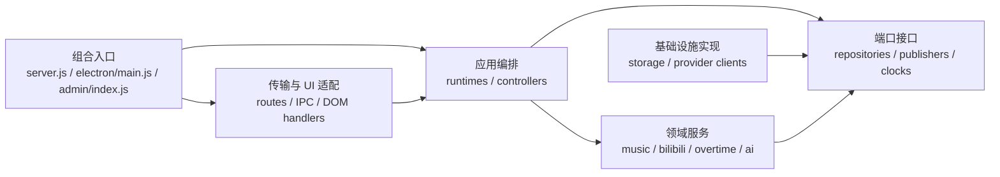

# 模块化与低耦合工程规范

> 状态：新代码与本次修改代码强制执行 · 适用范围：`src/`、`public/js/`、`scripts/`、`test/`

本规范约束 LIRA 模块化单体的依赖方向、组合方式、持久化边界和兼容迁移。目标不是增加抽象数量，而是让一次业务修改只影响所属模块及其明确调用方。

## 1. 设计目标

- 后端继续内嵌 Electron main；不新增独立服务、后台进程、端口或部署单元，并保持零 Web 框架、无前端构建器。
- HTTP、WebSocket、IPC、SQLite schema 和浏览器页面契约默认保持兼容。
- 运行资源由显式 runtime 实例拥有，禁止通过模块加载隐式创建数据库、Socket 或定时器。
- 依赖必须可从 `import`、`require` 或工厂参数直接看出；全局对象只可存在于兼容适配层。
- 新抽象必须隔离真实变化来源；只被一个调用点使用且没有边界价值的包装不得新增。

## 2. 允许的依赖方向

强制规则：

1. `server/routes/` 不得接收数据库句柄，只调用 API context 暴露的应用能力。
2. 领域服务不得接收包含无关能力的通用 `context` 或整个 `db` 对象；需要持久化时依赖窄 repository/store 接口。
3. `storage/` 可以依赖共享的纯函数，但不得依赖 `server/`、`electron/` 或 `public/`。
4. `server.js`、`electron/main.js` 和前端入口可以依赖内部模块；内部模块不得反向导入入口。
5. 跨领域调用必须经过显式 facade、consumer 或 port，不得直接读取另一领域的内部状态。

### 2.1 目录映射与导入矩阵

| 代码位置 | 架构角色 | 允许依赖 | 禁止依赖 |
|---|---|---|---|
| `src/server.js`、`src/electron/main.js`、前端入口 | Composition Root | 所有内部公开工厂与 adapter | 被内部模块反向导入 |
| `src/server/routes/`、`src/electron/ipc/`、DOM handlers | Transport / UI Adapter | application facade、稳定契约、纯工具 | SQLite 句柄、领域内部状态 |
| `src/server/*-runtime.js`、前端 controller | Application | 领域服务、port、基础设施 adapter 的公开工厂 | 入口模块、未声明全局依赖 |
| `src/music/`、`src/bilibili/`、`src/overtime/`、`src/ai/` | Domain | 领域内模块、窄 port、纯共享契约 | `server.js`、Electron、DOM、SQL |
| `src/storage/`、Provider client、Electron adapter | Infrastructure | 领域契约、纯共享工具、平台 API | 组合入口的可变状态 |
| `src/shared/`、`public/js/shared/` | Stable Shared | Node/浏览器标准 API、同主题纯函数 | 领域服务、入口、运行时资源 |

每个领域新增跨目录能力时，应通过一个命名明确的公开 factory/facade 暴露；调用方不得导入另一领域的私有实现文件。结构测试应遍历目标目录，而不是只检查单个已知文件。

## 3. 组合根规范

组合根只负责：创建对象、连接回调、选择实现、启动和按逆序关闭资源。

- 业务判断、重试策略、状态格式化和日志 payload 构造应放入所属 runtime/service。
- 组合根允许导入较多模块，但不得构造可被任意模块读取的“依赖大包”。
- 工厂只接收自身实际使用的字段。若参数超过一个清晰职责，应先拆分职责，而不是把字段装进 `sharedDeps`。
- 为解决初始化顺序，可注入命名回调端口；禁止依赖可变的前向声明形成隐式循环。
- 资源关闭必须幂等，并由创建该资源的 runtime 负责。

## 4. 前端模块规范

- 新代码使用具名 ESM 导入/导出；禁止新增 `window.AdminApp.*` 依赖。
- `legacy-admin-bridge.js` 是新 ESM 消费遗留全局的唯一入口；现有 IIFE 模块仍可作为遗留全局生产者和消费者，但其文件与引用次数由结构测试冻结，只能减少、不得增加。
- 入口文件允许副作用导入兼容模块，但应用代码必须通过 bridge 返回的窄接口使用它们。
- EventBus 仅用于一对多通知，不得用于请求/响应式调用或隐藏必需依赖。
- DI 容器只有在生产代码实际 `resolve()` 服务时才允许存在；仅注册而不解析的容器应删除。
- DOM、Electron `window.musicAPI` 和网络调用属于基础设施边界，应通过注入函数或专用适配器进入核心逻辑。

## 5. 持久化规范

- SQL、表名、列名和事务只出现在 `src/storage/` 的 store/repository 基础设施适配器中；领域目录中的 `*-store.js` 只能声明行为契约或内存 fake，不得包含 SQL。
- 领域服务依赖行为接口，例如 `queueStore.addRequest(input)`，不得调用 `db.prepare()`。
- 事务边界由 store/repository 拥有；同一数据库内的跨表原子写入由一个协调 repository/unit-of-work 方法完成。禁止为事务拆数据库、增进程或新增依赖。
- Store 返回稳定领域对象，不向上泄漏 `DatabaseSync`、statement 或 SQLite 特有结果。
- Schema 变更必须同时更新迁移、store、回归测试和 `docs/architecture/backend/storage.md`。

## 6. Shared 模块规范

`shared/` 仅放跨领域、无副作用、语义稳定的纯函数或契约。

- 文件按单一主题组织，例如 `text-utils.js`、`time-utils.js`、`xlsx-codec.js`。
- 平台、协议或业务专属函数必须放回对应领域。
- 不得为了减少 import 行数建立新的 `utils.js` 聚合桶。
- 兼容 re-export 只能用于迁移期，并必须有删除条件和结构测试。

## 7. 测试与架构适应度函数

每次边界调整至少包含：

1. 一个先失败的结构或单元测试。
2. 目标模块测试通过。
3. `npm run check` 通过。
4. `npm test` 全量通过。

兼容性验证至少覆盖：

- HTTP：方法、路径、状态码、JSON 字段和公开错误语义。
- WebSocket：消息类型、必需字段、快照字段和关键发布顺序。
- IPC：channel 名、参数形状、返回值与错误形状。
- SQLite：受支持旧 schema 可迁移、数据保留、事务原子性和重复启动幂等。

结构测试必须阻止：

- 领域服务重新出现 `.prepare()` / `.exec()`。
- `public/js/admin/app.js` 直接访问 `window.AdminApp`。
- 播放控制器重新引入 `sharedDeps` 或“前向声明解决循环依赖”。
- Spreadsheet/ZIP 实现重新进入通用 `shared/utils.js`。
- 内部模块反向依赖组合入口。
- Admin 遗留全局文件或 `window.AdminApp` 引用次数增加。

## 8. 变更流程

1. 写清行为不变量和允许改变的边界。
2. 为当前问题写失败测试。
3. 做能通过测试的最小结构调整。
4. 删除本次调整产生的废弃导入、兼容代码和死抽象。
5. 更新架构文档；重要依赖方向变化写 ADR。
6. 运行目标测试、静态检查和全量测试。

禁止顺手重排无关代码、统一格式或迁移未涉及的模块。

## 9. 非功能要求

- 性能：本次模块化调整不得增加网络跳数、数据库连接数或持久化次数。
- 可靠性：启动、重连、播放恢复和关闭冲刷保持幂等。
- 安全：认证 token、Cookie、safeStorage 和本地媒体访问边界保持不变。
- 可维护性：新增领域能力应能通过注入 fake store/provider 做离线测试。
- 运维：不增加新进程、新端口、新服务或运行时依赖。
- 依赖：模块化重构不得新增 `package.json` 依赖或修改 lockfile；依赖升级属于独立评审事项。

## 10. 例外与审查

永久改变本规范必须通过 ADR 修订规范。临时豁免必须记录：违反规则、责任人、原因、替代方案、截止日期或版本、删除条件和失败保护测试；过期豁免不得继续合并。没有退出条件的“临时兼容”不予接受。
