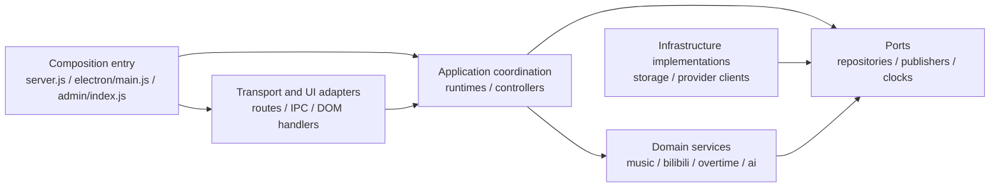

# Modularity And Low-Coupling Engineering Standard

> Status: Applies to new code and code changed by the current task
>
> Scope: `src/`, `public/`, `scripts/`, `tools/`, `test/`, and maintained installer source in `build/`

This standard defines dependency direction, composition, persistence boundaries,
and compatibility migration for the LIRA modular monolith. The objective is not
to maximize abstraction count. It is to keep a business change inside its owning
module and explicit consumers.

## 1. Design Goals

- Keep the backend embedded in Electron main. Do not add a service, background
  process, port, deployment unit, web framework, or frontend build system.
- Preserve HTTP, WebSocket, IPC, SQLite schema, persisted data, and browser page
  contracts by default.
- Runtime resources are owned by explicit runtime instances. Module loading must
  not implicitly create databases, sockets, timers, or listeners.
- Dependencies are visible through `import`, `require`, or factory parameters.
  Globals exist only at documented compatibility boundaries.
- A new abstraction must isolate a real source of change or protect a boundary.
  Do not add a wrapper used by one caller when it provides no boundary value.

## 2. Allowed Dependency Direction

```mermaid
flowchart LR
  Entrypoint["Composition entry\nserver.js / electron/main.js / admin/index.js"] --> Transport["Transport and UI adapters\nroutes / IPC / DOM handlers"]
  Entrypoint --> Application["Application coordination\nruntimes / controllers"]
  Transport --> Application
  Application --> Domain["Domain services\nmusic / bilibili / overtime / ai"]
  Application --> Ports["Ports\nrepositories / publishers / clocks"]
  Storage["Infrastructure implementations\nstorage / provider clients"] --> Ports
  Domain --> Ports
```

Required direction:

1. `src/server/routes/` receives application capabilities, not database handles.
2. Domain services do not receive a broad `context` or complete `db` object when
   they need only a narrow store, repository, publisher, clock, or provider.
3. `src/storage/` may depend on pure shared helpers, but not on `src/server/`,
   `src/electron/`, or `public/`.
4. `src/server.js`, `src/electron/main.js`, and frontend entrypoints may depend on
   internal modules. Internal modules do not import those entrypoints.
5. Cross-domain calls use an explicit facade, consumer, or port. A domain does
   not read another domain's internal mutable state.

### 2.1 Directory Roles

| Code location                                                 | Architecture role      | Allowed dependencies                                      | Prohibited dependencies                         |
| ------------------------------------------------------------- | ---------------------- | --------------------------------------------------------- | ----------------------------------------------- |
| `src/server.js`, `src/electron/main.js`, frontend entrypoints | Composition Root       | Public factories and adapters from internal modules       | Reverse imports from internal modules           |
| `src/server/routes/`, `src/electron/ipc/`, DOM handlers       | Transport / UI Adapter | Application facades, stable contracts, pure helpers       | SQLite handles, domain internal state           |
| `src/server/*-runtime.js`, frontend controllers               | Application            | Domain services, ports, public infrastructure factories   | Entrypoints, undeclared globals                 |
| `src/music/`, `src/bilibili/`, `src/overtime/`, `src/ai/`     | Domain                 | Domain-local modules, narrow ports, pure shared contracts | Entrypoints, Electron, DOM, direct SQL          |
| `src/storage/`, provider clients, Electron adapters           | Infrastructure         | Domain contracts, pure shared helpers, platform APIs      | Mutable composition-root state                  |
| `src/shared/`, `public/js/shared/`                            | Stable Shared          | Standard APIs and same-topic pure helpers                 | Domain services, entrypoints, runtime resources |

Expose a cross-directory capability through a clearly named public factory,
facade, consumer, or port. Consumers must not import another domain's private
implementation merely because the file is reachable. A structural test for a
directory-wide boundary must enumerate the target directory instead of checking
only one known file.

## 3. Composition Roots

Composition roots create objects, connect callbacks, choose implementations,
start resources, and close them in reverse order.

- Business decisions, retry policy, state formatting, and log payload construction
  belong to the owning runtime or service.
- A composition root may import many modules, but it must not create a mutable
  dependency bag readable by arbitrary modules.
- A factory accepts only fields it uses. Split responsibilities instead of
  hiding an unclear interface inside `sharedDeps` or a generic context.
- Initialization ordering may use named callback ports. Do not use mutable
  forward declarations as an implicit dependency cycle.
- The runtime that creates a resource owns idempotent cleanup.

## 4. Frontend Modules

- New frontend code uses named ESM imports and exports.
- Do not add `window.AdminApp` dependencies.
  `public/js/admin/legacy-admin-bridge.js` is the intentional compatibility
  boundary for new Admin ESM consumers.
- Existing classic or IIFE modules may remain during incremental migration, but
  their legacy global text debt can only decrease.
- Entrypoints may use side-effect imports for documented compatibility modules;
  application code consumes narrow explicit interfaces.
- EventBus is for one-to-many notification, not hidden request-response calls or
  required dependencies.
- A dependency-injection container is justified only when production code
  resolves registered services. Registration without resolution adds no value.
- DOM, `window.musicAPI`, and network calls are infrastructure boundaries. Core
  logic receives them through focused adapters or injected functions where
  isolation provides test value.

## 5. Persistence

- SQL, table names, columns, and transactions target `src/storage/` store or
  repository adapters. Existing exceptions are frozen legacy debt, not examples
  for new code.
- Domain services depend on behavioral interfaces such as
  `queueStore.addRequest(input)`, not `db.prepare()` or `db.exec()`.
- Stores and repositories own transaction boundaries. Atomic writes across tables
  in one database use one coordinating repository or unit-of-work method.
- Do not split a database, add a process, or add a dependency merely to model a
  transaction.
- Store return values are stable domain objects and do not expose
  `DatabaseSync`, prepared statements, or SQLite-specific result objects.
- A schema change updates migrations, affected stores, regression tests, and
  `docs/reference/backend/storage.md`.

## 6. Shared Modules

Shared code is cross-domain, side-effect-free, and semantically stable.

- Organize helpers by one subject, for example text, time, or a file codec.
- Platform-, protocol-, or domain-specific behavior remains with its owner.
- Do not create a new `utils.js` aggregation bucket to reduce import lines.
- Compatibility re-exports require a migration reason, a removal condition, and
  a structural regression test.

## 7. Rule Registry

Status meanings:

- `Enforced`: a deterministic gate comprehensively blocks the violation.
- `Incrementally Enforced`: tests freeze known debt or cover only selected paths.
- `Migration Target`: desired direction is documented but not comprehensively
  machine-enforced.
- `Review Required`: reviewers judge the semantic boundary; automated reports
  provide signals rather than a pass/fail verdict on that boundary.

| Rule ID               | Rule                                                          | Status                 | Enforcement                                                                                                                                                                      |
| --------------------- | ------------------------------------------------------------- | ---------------------- | -------------------------------------------------------------------------------------------------------------------------------------------------------------------------------- |
| `MOD-COMPOSITION-001` | Composition roots only wire components and lifecycle          | Incrementally Enforced | Selected composition-root assertions plus review                                                                                                                                 |
| `MOD-STORAGE-001`     | Domain services do not issue SQL                              | Incrementally Enforced | Receiver-aware SQL debt budget                                                                                                                                                   |
| `MOD-STORAGE-002`     | Stores own transaction boundaries                             | Incrementally Enforced | Selected store atomicity tests plus review                                                                                                                                       |
| `MOD-ADMIN-001`       | New Admin code does not add global-state access               | Incrementally Enforced | `window.AdminApp` debt budget                                                                                                                                                    |
| `MOD-FRONTEND-001`    | New frontend code uses explicit ESM boundaries                | Incrementally Enforced | `test/engineering/esm-module-boundaries.test.js` rejects undeclared or unimported identifiers in ES modules under `public/js/`; review covers explicit exports and classic-script exceptions |
| `MOD-SHARED-001`      | Shared utilities remain domain-neutral                        | Migration Target       | Selected regression assertions                                                                                                                                                   |
| `MOD-CONTRACT-001`    | Public contracts remain compatible by default                 | Incrementally Enforced | Existing regression tests; full inventory deferred                                                                                                                               |
| `MOD-SIZE-001`        | Review file size by source kind, responsibility and purpose | Review Required | `scripts/check-modularity.js` reports advisory size signals; `test/engineering/modularity-size.test.js` verifies counting and reporting, not semantic cohesion |
| `MOD-FUNCTION-001`    | Long or complex functions need semantic decomposition review  | Migration Target       | Named debt and next-change triggers in [modularity-debt.md](modularity-debt.md); no repository-wide function metric gate                                                         |

Review-only or partial coverage must not be labeled `Enforced`.

## 8. Tests And Architecture Fitness Functions

For a boundary change:

1. Add a focused failing structural or unit regression when practical.
2. Run the affected module tests.
3. Run `npm run check`.
4. Run `npm run verify:architecture`.
5. Run `npm test` before completion.

Compatibility coverage should include the changed part of each relevant public
contract:

- HTTP: method, path, status, response fields, and public error semantics.
- WebSocket: message type, required fields, snapshot fields, and important order.
- IPC: channel, arguments, result shape, and public error shape.
- SQLite: supported old-schema migration, data retention, atomicity, and repeated
  startup idempotency.

Current fitness functions block or freeze selected regressions, including:

- Song, Queue and SuperChat services issuing SQLite statements directly.
- Receiver-aware domain SQL debt expanding outside storage.
- Admin legacy global debt expanding to a new file or beyond a file baseline.
- Empty or comment-only catch debt expanding in `src/` or `public/js/`.
- Playback composition reintroducing generic dependencies or mutable forward
  declarations.
- Spreadsheet or ZIP codecs returning to the generic shared utility module.
- Selected server and desktop composition roots regaining mutable subsystem
  behavior.
- Public ESM modules referencing identifiers they neither declare nor import.
- Literal CommonJS imports of backend composition entrypoints from internal
  modules, checked by enumerating the backend directory.
- Storage adapters importing server, Electron, or browser modules.
- The reviewed queue, song, overtime, and blind-box overlays constructing their
  own sockets instead of using their owned transport adapter.
- Removal of wheel cleanup or reintroduction of the obsolete playback class.

Internal modules importing composition entrypoints remain prohibited. The
directory-wide gate checks literal CommonJS require paths; computed/dynamic
imports and frontend composition directions still require review. This is not
full dependency-graph enforcement.

### File Size Review

[ADR-0023](../adr/0023-purpose-aware-file-size-review.md) replaces ADR-0017's
numeric ceilings and expiring size registry. Decide whether to retain or split
a file by its kind, responsibility, consumers and purpose. Repository size does
not determine an acceptable file size, and a short file can still mix unrelated
responsibilities.

| Kind / purpose | Advisory signal | Review focus |
| --- | --- | --- |
| Business logic, controllers, adapters and executable scripts | Above 600 physical lines | Independent workflows, state/resource ownership, function complexity and dependency direction. Keep a coherent lifecycle together. |
| CSS | Above 800 physical lines | Component/page scope, cascade order, repeated overrides and reusable styles. Keep related layout, states, animation and responsive rules together. |
| HTML and templates | Above 800 physical lines | Complete page/section semantics, repeated components and embedded behavior. Static help content can be longer than an interactive form. |
| Tests and executable test helpers / fixtures | Above 800 physical lines | Behavior/provider/lifecycle scenarios, isolation and readable setup. Preserve complete integration assertions. |
| Pure data, catalogs, schemas, snapshots and generated output | No universal line threshold | Structure, validation, source of truth and reproducibility. Review the generator or executable consumer where applicable. |

These signals are not maximums or automatic exemptions. CSS at 601–800 lines
does not need a special record; a cohesive file above a signal may also stay
intact. For a signaled file affected by the task, explain its purpose, why
retaining it or extracting a real responsibility improves maintenance, and the
relevant verification in the normal change review. Do not create a separate
size approval, exact-line budget, expiry date or registry entry. Existing
unrelated files do not become mandatory cleanup work because a report lists them.

Split when a file gains independently changing responsibilities, unrelated
consumers, confusing dependencies or hard-to-test behavior. Do not split solely
at a line boundary, scatter one mutable state owner, add pass-through wrappers,
remove assertions/comments, or compress formatting to reduce the count.
Auth, tenant, storage, lifecycle and dependency rules remain binding regardless
of length. Handwritten migration executors and analyzers are executable logic;
calling a file a fixture or generated output does not exempt its behavior.

`npm run verify:modularity` prints advisory findings and succeeds when scanning
completes, even above a signal. `verify:architecture`, `verify:quick`, `verify`
and `npm test` retain the reporting tests and the independent architecture
gates. A successful size report does not certify cohesion or formatting.

- Count stored physical lines including comments and blanks; an empty file has
  zero lines and a final newline adds no phantom line. CRLF, LF and CR agree.
  Use the repository formatter for changed source; the scanner does not run it.
- Scan `.js`, `.mjs`, `.cjs`, `.css`, `.html`, `.json`, `.ps1`, `.cmd`, `.bat`
  and `.nsh` under `src/`, `public/`, `scripts/`, `tools/`, `test/` and `build/`,
  including untracked files. CSS/HTML use their own signals; other executable
  files under `test/` use the test signal. JSON is counted without a length
  finding. Other data/generated purposes are judged during review, not inferred
  from a filename to bypass behavioral checks.
- Root configuration, Markdown, media and runtime data outside these roots are
  not scanned. The policy still applies when reviewing maintained source outside
  the scanner's coverage.
- [modularity-baseline.json](modularity-baseline.json) is a historical snapshot
  of past assessments. Its line ceilings and dates are inactive; do not renew
  or update it for current changes. Semantic debt remains in
  [modularity-debt.md](modularity-debt.md).

Keep named commands such as `test:admin` synchronized when tests move. Preserve
the fixed-address theme catalog's data contract and the help chapters' content
boundary: help still excludes inline scripts and business forms. These are
content contracts, independent of file length.

### Function Review And Incremental Debt

Function spans above **80 physical lines**, especially above **120**, branch
estimates over **20**, and nesting over **4** are review signals, not mandatory
extraction criteria. Assess separate responsibilities and cognitive complexity;
record concrete debt when a real problem is deferred. Count the full span
including nested callbacks. Keep cancellation, tokens, timers, transactions and
cleanup with one owner; moving code into a class or mutable context bag is not
a boundary improvement.

For continuity with the reassessment, the branch estimate starts at 1 and counts
conditions, loops, non-default switch cases, catch, ternaries and logical
operators/assignments. Nested functions are counted separately; optional chains
and default parameters are excluded. Nesting counts control structures and
ternaries, with else-if not adding a level. This is a review estimate, not an
ESLint complexity result. Fix a parser/tool version before any future numeric
function gate; do not use regex estimates as a hard gate.

[modularity-debt.md](modularity-debt.md) records known factories, initializers
and historical migrations, their owners, protections and next-change triggers.
Reassess these on relevant edits and their concrete change triggers. It is not
an audit of every function in a short file. Preserving a coherent legacy state
owner does not certify that its internal workflows are easy to maintain.

### Review Remediation Coverage

The settings contract is shared by local and cloud adapters; settings batch
atomicity is exercised against an in-memory SQLite database. Cloud requests,
gift retries/catch-up, wheel timers, playback request/cache ownership, and
overlay connections have explicit lifecycle regression tests. SSE reading stays
inside the remote client, and the overlay connector stays in its adapter domain;
neither is a domain-neutral shared utility or a universal sync manager.

These checks strengthen the existing rules without changing their status to
`Enforced`. Remaining legacy Admin globals, domain SQL exceptions, empty catches,
the shared utility aggregation point, and incomplete public-contract inventory
remain tracked debt. Passing the current gates does not certify the entire
repository as free of coupling or asynchronous defects.

## 9. Change Workflow

1. State behavior invariants and the boundary allowed to change.
2. Locate the owner through the fact map and AI workflow route table.
3. Add the smallest focused regression for the problem.
4. Implement the minimum change that passes it.
5. Remove only dead imports, compatibility code, or abstractions created by the
   current change.
6. Update the owning architecture document. Record an important dependency
   direction change in an ADR.
7. Run focused, quick, and full verification in increasing scope.

Do not opportunistically reorder, reformat, or migrate unrelated modules.

## 10. Nonfunctional Requirements

- **Performance:** A modularity change does not add network hops, database
  connections, or persistence operations without an accepted requirement.
- **Reliability:** Startup, reconnection, playback restoration, and shutdown flush
  remain idempotent.
- **Security:** Authentication tokens, cookies, `safeStorage`, renderer privilege,
  and local-media access boundaries remain intact.
- **Maintainability:** A new domain capability should be testable offline through
  a focused fake store, provider, clock, or publisher when the boundary warrants
  it.
- **Operations:** Do not add a process, port, service, or deployment unit.
- **Dependencies:** Modularity work does not add a package dependency or modify
  the lockfile. Dependency upgrades receive separate review.

## 11. Exceptions And Review

A permanent change to this standard requires an ADR. A temporary exception must
record the violated rule, responsible owner, narrow scope, reason, alternative
considered, expiry date or version, removal condition, and a failure-protection
test. An expired exception must not continue to merge. A temporary compatibility
layer without an exit condition is not acceptable.
