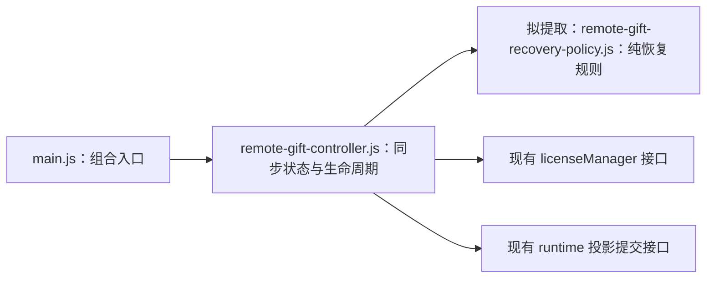

# 客户端格式化与 800 行文件审查报告

日期：2026-09-13。统计对象为本次工作区的现有代码，包含任务开始前尚未提交的修改。

本次已完成格式化、生产 JavaScript 超过 800 行人工审查软规则落地和拆分分析，**没有实施模块拆分**。

后续复审：用户提供更严格的文件、函数和依赖规则后，已形成[600–800 行与超 800 行模块化复审报告](D:/Work/Live/docs/client-modularity-reassessment-2026-09-13.md)。本报告的格式化与测试记录保留；下文“10 个拆分、20 个保留”的建议已由复审结论取代。

## 1. 结论

- 已在[模块化规范](architecture/engineering/modularity-standard.md#file-size-review-threshold)中定义：生产 JavaScript **超过 800 行**进入审查，恰好 800 行不超限。
- 最终有 **749 个代码与配置文件**通过 Prettier 检查；与任务开始时相比，**221 个文件**存在内容变化，包含格式化及必要的测试适配。
- **399 个生产 JavaScript 文件中，只有 1 个超过 800 行**：`src/electron/remote-gift-controller.js`，847 行。
- 扩展查看 CSS、HTML、测试和声明式数据后，共有 **30 个文件超过 800 行**。逐项审查结果为：**20 个保留，10 个建议拆分**。
- 10 个拆分建议包括：**1 个生产 JavaScript、3 个 CSS、6 个测试文件**。后两类依据实际职责混杂提出建议，不是新增 CSS 或测试的强制行数限制。
- 回归结果：**1713 项通过、2 项跳过、0 项失败**。

## 2. 统计与格式化口径

### 2.1 800 行规则

规则写在当前有效的[模块化规范](architecture/engineering/modularity-standard.md)，而不是只写在本报告中。

1. 统计 Prettier 格式化后的单文件物理行数，包含注释和空行；文件末尾的换行符不额外计一行。
2. 生产 JavaScript 范围是 `src/`、`public/js/`、`scripts/`、`tools/` 下的 JavaScript 源码。
3. 800 行是触发人工审查的阈值，不是自动失败的门禁，也不是必须把文件切成若干 800 行片段。
4. 文件夹的累计行数只用于汇总，不能把一个目录总计几万行判定为“超限”。
5. CSS、HTML、测试、生成资产和夹具不机械套用生产 JavaScript 的拆分限制，但可以因为明确的职责问题提出拆分建议。
6. 2026-08-30 已完成的旧计划已于 2026-09-22 清理，其 600 行目标不再适用；当前工作使用新定义的 800 行审查线。

### 2.2 与 VS Code 对齐

本机 VS Code 的 JavaScript、HTML、JSON 格式化器为 `esbenp.prettier-vscode`。实际使用该扩展 **12.4.0** 自带的 **Prettier 3.7.4**，读取仓库[.prettierrc.json](../.prettierrc.json)中的 `singleQuote: true`，其余使用该版本的默认格式规则。

格式化范围为 `src/`、`public/`、`scripts/`、`test/`、`tools/` 中受支持的源文件，以及根目录的 `package.json`、`.prettierrc.json`。最终覆盖 618 个 JavaScript 文件、84 个 CSS、41 个 HTML 和 6 个 JSON 文件。

沿用 `.gitignore` 和 [.prettierignore](../.prettierignore)排除依赖、构建产物、运行数据、日志和私有抓包材料。未批量重排架构文档、规格或历史计划；未修改依赖版本或锁文件。PowerShell、CMD/BAT、SVG 和二进制资产不在本次 Prettier 的内置解析范围内，保留原文件。

### 2.3 HTML 片段与测试适配

最初候选为 752 个文件。回归测试发现，Prettier 会给未闭合的起始片段补齐结束标签；单独解析片段时语法树看似等价，拼装后的页面却会提前闭合。因此，从格式化前的工作区快照恢复了三个起始片段，并加入忽略规则。

最终保留以下七个有意不完整的片段，不单独执行 Prettier：

- `public/pages/admin/shell-start.html`
- `public/pages/admin/song/shell-start.html`
- `public/pages/admin/toolbox/shell-start.html`
- `public/pages/admin/document-end.html`
- `public/pages/admin/main-end.html`
- `public/pages/admin/song/shell-end.html`
- `public/pages/admin/toolbox/shell-end.html`

格式化还暴露了测试对单行 `import`、数组、链式调用和 HTML 空白的依赖。格式化前快照上的相关 86 项测试全部通过，确认这些失败由格式变化触发。随后只调整了以下六个测试文件，使其接受等价的换行、尾逗号和空白，保持原有业务断言：

- [electron-main-modules.test.js](../test/electron-main-modules.test.js)
- [license-gate.test.js](../test/license-gate.test.js)
- [frontend-gifts.test.js](../test/frontend-gifts.test.js)
- [gift-artwork-identity.test.js](../test/gift-artwork-identity.test.js)
- [frontend-queue.test.js](../test/frontend-queue.test.js)
- [settings-auth-profile.test.js](../test/settings-auth-profile.test.js)

## 3. 文件夹汇总

下表只统计最终纳入格式化的 749 个文件。七个 HTML 片段及不支持的资产不计入文件数、目录累计行数；全部 30 个超过 800 行的审查对象均在表内。

| 范围                 |  文件数 | 本次内容变化文件数 |    累计行数 |     超过 800 行的文件数 |
| -------------------- | ------: | -----------------: | ----------: | ----------------------: |
| `src/`               |     237 |                 61 |      46,529 | 1，位于 `src/electron/` |
| `public/js/`         |     150 |                 27 |      38,943 |                       0 |
| `public/css/`        |      84 |                  5 |      29,780 |                       9 |
| `public/pages/`      |      41 |                 10 |      10,492 |                       3 |
| `public/data/`       |       1 |                  0 |         893 |                       1 |
| `scripts/`           |      13 |                  7 |       2,524 |                       0 |
| `test/`              |     220 |                111 |      70,892 |                      16 |
| `tools/`             |       1 |                  0 |          76 |                       0 |
| 根目录两个 JSON 配置 |       2 |                  0 |         117 |                       0 |
| **合计**             | **749** |            **221** | **200,246** |                  **30** |

生产 JavaScript 中接近阈值但没有超限的文件为：`src/electron/main.js` 789 行、`src/server.js` 785 行、`public/js/admin/todo.js` 771 行。它们不进入本次拆分清单，不能继续沿用旧的 600 行标准判定超限。

## 4. 建议拆分的 10 个文件

### 4.1 生产 JavaScript：1 个

| 文件                                                                                | 行数 | 判断依据                                                                                                           | 拆分边界                                                                                          |
| ----------------------------------------------------------------------------------- | ---: | ------------------------------------------------------------------------------------------------------------------ | ------------------------------------------------------------------------------------------------- |
| [src/electron/remote-gift-controller.js](../src/electron/remote-gift-controller.js) |  847 | 同时容纳有状态同步协调和独立的恢复规则、游标页校验。后者已经是文件末尾的纯函数，不需要接触计时器或修改控制器状态。 | 保留一个同步控制器，提取 `remote-gift-recovery-policy.js`。不要继续拆成多个互相操纵状态的控制器。 |

建议提取以下函数：

- `hasHistoryCapability`：判断远端历史恢复能力。
- `requiresProjectionReplacement`：根据本地恢复状态和远端发现结果判断是否重建。
- `validateEpochAwareCursorPage`：检查游标连续性、页边界和是否前进。
- `giftSyncStalledError`、`cursorGapError`：保留对应错误消息与错误码；仅被校验器使用的错误构造函数留作新模块内部实现。

新的恢复规则模块只接收数据并返回结果或抛出相同错误。`normalizeResolvedSource`、时钟函数、公开导出和运行时资源仍保留在控制器中。按现有函数规模，这次提取预计可让控制器降至约 790～800 行；具体以拆分后 Prettier 的实际统计为准。

需要完整保留的状态所有权包括 `controllerGeneration`、`authorizationEpoch`、当前 source/projection、串行任务队列、两个 AbortController 以及重连和对账计时器。`captureFence` / `ensureFenceCurrent` 必须继续围绕同一份状态工作。

依赖方向应保持为：



验收重点是 bootstrap 续页、过期 token、游标缺口、SSE 即时 final、断线补拉、授权切换和 stop/dispose 后旧回调失效。沿用[remote-gift-controller.test.js](../test/remote-gift-controller.test.js)的行为回归，给提取出的纯规则补充有意义的边界用例。公开 HTTP、IPC、SSE 和投影事务契约保持不变。

### 4.2 CSS：3 个

| 文件                                                                                        | 行数 | 具体问题                                                                                                                                                                      | 建议做法                                                                                                                                                   |
| ------------------------------------------------------------------------------------------- | ---: | ----------------------------------------------------------------------------------------------------------------------------------------------------------------------------- | ---------------------------------------------------------------------------------------------------------------------------------------------------------- |
| [public/css/admin/toasts/gifts.css](../public/css/admin/toasts/gifts.css)                   |  969 | 约前 236 行是礼物通知，后面还有 `.overlay-address-*`、`.identity-rule-settings`、`.monitor-*`、`.metrics-*`、`.hardware-*` 等不同功能的样式。文件路径已经不能解释大部分内容。 | 礼物通知留在原文件；将地址/样式设置和性能监控样式按真实消费者迁到各自模块。逐一核对通用 `.switch-*` 等选择器的全部调用方，不直接把它们误归到某一业务面板。 |
| [public/css/admin/desktop-lyric-preview.css](../public/css/admin/desktop-lyric-preview.css) | 1361 | 前半部分是管理页设置控件，后半部分是歌词预览渲染；整个文件同时被管理页和歌词浏览器源加载，存在清晰的消费者差异。                                                              | 分离“管理页设置布局”和“共用预览渲染”，保留现有 CSS URL 作为有序入口。混合选择器的媒体查询最后处理，保持控件与预览的响应式配合。                            |
| [public/css/overlays/games.css](../public/css/overlays/games.css)                           | 1504 | 包含数字炸弹、五子棋、绘画工具、结果展示，以及后段绘画布局覆盖和绘画弹幕样式。它们对应不同游戏模块，不只是同一组件的若干配色。                                                | 原文件作为有序入口，按共用布局、棋盘类游戏、绘画、结果层划分；绘画弹幕在需要时单独归入绘画模块。先保留后段覆盖相对前段规则的顺序，不顺便合并或重写选择器。 |

CSS 拆分复用现有 `@import` 机制，不新增构建步骤。首批仍从当前加载位置按原顺序引入，避免迁移文件时顺便改变级联优先级。随后验证实际的选择器匹配、相对图片路径及原页面 URL。

普通管理页以 Electron 为验收目标；`games` 和歌词浏览器源还要通过对应 OBS 页面验证。这些是后续拆分的验收要求，本次没有改动 CSS 的规则语义或开展视觉重设计。

### 4.3 测试：6 个

这些建议的原因是测试覆盖对象跨越了多个已有 owner。拆分时移动现有断言，优先并入已有主题测试，不因本报告增加测试数量。

| 文件                                                                      | 行数 | 已确认的主题边界                                                                                              | 建议拆法                                                                                                                                                |
| ------------------------------------------------------------------------- | ---: | ------------------------------------------------------------------------------------------------------------- | ------------------------------------------------------------------------------------------------------------------------------------------------------- |
| [test/frontend-gifts.test.js](../test/frontend-gifts.test.js)             | 2408 | 礼物历史抽屉、盲盒统计与配置、近期礼物卡片、盲盒 OBS 展示等混在一起。                                         | 历史、盲盒管理、近期卡片、盲盒 overlay 分组；先核对已有 `frontend-gift-history-recovery`、`frontend-gift-catalog-update` 等测试，避免平行复制相同夹具。 |
| [test/frontend-admin-shell.test.js](../test/frontend-admin-shell.test.js) | 2008 | Shell 初始化与导航之外，还覆盖使用文档目录、硬件摘要、播放器 dock、队列布局和主题加载。                       | 原文件保留 Shell/导航/生命周期断言；使用文档、播放器布局、主题等回到对应主题测试。使用文档自己的 fixture 随其测试一起移动。                             |
| [test/frontend-queue.test.js](../test/frontend-queue.test.js)             | 1936 | 队列皮肤和滚动之外，约第 1221 行开始的一组断言专门测试加班机控制台及规则编辑器。                              | 优先迁走加班机断言到现有加班机编辑器/选礼测试或独立前端加班机测试；剩余队列用例再按“样式设置”和“滚动布局”归组，不对每种皮肤各建一个文件。               |
| [test/desktop-lyrics.test.js](../test/desktop-lyrics.test.js)             | 1718 | 同时覆盖后端时间轴约束、管理页设置、字体权限、播放发布顺序，以及共享渲染器的时钟/动画。                       | 按时间轴契约、管理页设置、播放同步、渲染器划分。保留跨层一致性用例，检查现有 `lyrics`、`lyric-performance` 测试的覆盖，避免遗漏或重复。                 |
| [test/frontend-admin-ai.test.js](../test/frontend-admin-ai.test.js)       | 1430 | 名称是 AI，但前段还有通用模块装载、参数控件、弹幕连接/发送状态；后段是 AI 自动保存、provider 能力与密钥掩码。 | 通用 Shell/参数控件、弹幕工具和 AI 表单分别归属；AI 表单 fixture 留在 AI 测试，不制作全局可变 mock 容器。                                               |
| [test/ai-provider-adapters.test.js](../test/ai-provider-adapters.test.js) | 1028 | 模型 Chat/Responses 协议之外，还包含当前时间、和风天气、高德地图以及月度配额回退。                            | 按模型协议、天气工具、地图工具划分；连接检测用例跟随其 provider。只有确实被多个测试使用的无状态 response helper 才共享。                                |

测试迁移还需更新 `package.json` 中显式列举文件的 `test:admin` 命令，以及受影响的架构测试路由。不能仅依赖 `npm test` 自动发现新文件，就让原有聚焦命令漏掉已迁移用例。

## 5. 建议保留的 20 个文件

“保留”是本次结构审查结论，不是永久豁免。将来出现新的独立消费者、职责迁移或难以隔离的回归时再复查。

### 5.1 样式、页面和数据：10 个

| 文件                                                                                          | 行数 | 当前无需进一步拆分的原因                                                                                                              |
| --------------------------------------------------------------------------------------------- | ---: | ------------------------------------------------------------------------------------------------------------------------------------- |
| [public/css/admin/other-features/games.css](../public/css/admin/other-features/games.css)     |  832 | 同一个百宝箱游戏管理面板的卡片、配置与响应式样式；已从管理端总样式拆出，只超过 32 行，当前没有独立加载消费者。                        |
| [public/css/admin/overtime.css](../public/css/admin/overtime.css)                             | 1040 | 加班机控制台、规则表单和礼物选择器共用这一页面的布局与状态选择器；业务逻辑已由独立控制器和规则编辑器负责，继续切样式的收益有限。      |
| [public/css/overlays/clock.css](../public/css/overlays/clock.css)                             | 1228 | 大部分体积来自同一时钟 DOM 的四套外观、渐变和动画声明，已有清楚的主题注释分区；目前不需要独立装载主题文件。                           |
| [public/css/overlays/danmaku.css](../public/css/overlays/danmaku.css)                         | 1271 | 已按弹幕样式划分选择器与注释区段，共享消息节点、身份展示和动画约定；长度主要来自同一消息表面的外观变体，没有混入其他业务面板。        |
| [public/css/playback/fullscreen.css](../public/css/playback/fullscreen.css)                   |  894 | 已是独立的全屏播放器模块，渐变、唱片机和歌词展示产生较多声明；响应式规则已有单独文件，不必为不足百行的超出再增加资源层次。            |
| [public/css/playback/player.css](../public/css/playback/player.css)                           |  830 | 单一播放器控件表面，封面、进度、按钮、音质与音量连续协作；drawer 等已有独立样式，只超过 30 行。                                       |
| [public/pages/admin/song/desktop-lyric.html](../public/pages/admin/song/desktop-lyric.html)   | 1279 | 声明式设置控件及预览骨架，实际逻辑已经分到 settings/controls/preview 等 JS 模块；进一步拆 HTML 会扩大片段拼装清单，当前没有复用需求。 |
| [public/pages/admin/toolbox/danmaku.html](../public/pages/admin/toolbox/danmaku.html)         |  912 | 一份百宝箱页片段包含连接、展示、发送和 AI 表单，运行逻辑已分别归属模块；当前先保留完整 DOM 与锚点，避免再增加未闭合片段。             |
| [public/pages/admin/toolbox/usage-guide.html](../public/pages/admin/toolbox/usage-guide.html) | 1549 | 长度主要来自用户帮助正文、图片和 FAQ；已有章节与目录锚点。按行数拆文件不会降低运行逻辑复杂度。                                        |
| [public/data/theme-presets.json](../public/data/theme-presets.json)                           |  893 | 纯主题预设数据，通过一个固定 JSON 地址读取。拆分会增加加载和合并逻辑，声明式数据规模本身不是模块职责问题。                            |

### 5.2 测试：10 个

| 文件                                                                          | 行数 | 当前无需进一步拆分的原因                                                                                                        |
| ----------------------------------------------------------------------------- | ---: | ------------------------------------------------------------------------------------------------------------------------------- |
| [test/ai-assistant-service.test.js](../test/ai-assistant-service.test.js)     | 1105 | 围绕同一服务门面的触发、生成、发送、缓存与关闭链路，已有统一的服务 fixture；暂时保留完整行为回归。                              |
| [test/danmaku-overlay.test.js](../test/danmaku-overlay.test.js)               | 1056 | 主要覆盖同一弹幕组件的固定/随机显示和安全渲染，体积明显受到假 DOM 与计时器场景影响；当前不为缩短文件引入新的通用 DOM 模拟层。   |
| [test/gift-query-service.test.js](../test/gift-query-service.test.js)         |  809 | 同一来源隔离下的查询、分页、统计契约，只超出 9 行，没有迫切的拆分收益。                                                         |
| [test/license-manager.test.js](../test/license-manager.test.js)               | 1098 | 授权门面统一保证续期、撤销、并发重验证和受保护请求的安全语义；共用授权 harness，有必要集中复查状态转换。                        |
| [test/overtime-service.test.js](../test/overtime-service.test.js)             | 1703 | 一个结算服务的运算、幂等、回滚及恢复场景，规模主要来自规则组合和隔离数据库/时钟夹具；不应为了缩短测试而拆散同一结算契约。       |
| [test/processed-gift-import.test.js](../test/processed-gift-import.test.js)   | 1190 | 对同一礼物导入链路验证 wire 拒绝、来源、历史/实时差异和原子性；保留完整导入契约，避免把跨层验证拆成彼此不覆盖的单元断言。       |
| [test/remote-catalog-cache.test.js](../test/remote-catalog-cache.test.js)     | 1040 | 远端校验、持久化快照、失败回退和 room/hybrid 场景共同保护目录接入结果；当前先保留，后续若目录 owner 再分化才跟随迁移测试。      |
| [test/remote-gift-controller.test.js](../test/remote-gift-controller.test.js) | 1333 | 共享包含 source/auth/controller/projection 四重校验的同步 fixture；本次建议生产代码只提取纯规则，完整控制器行为测试应继续保留。 |
| [test/toolbox-sidebar.test.js](../test/toolbox-sidebar.test.js)               |  975 | 核心围绕侧栏分组、持久化、导航、隐藏与展开的一套 DOM runtime；少量面板映射断言用于验证导航目标，没有必要逐面板分散夹具。        |
| [test/wesing-capture.test.js](../test/wesing-capture.test.js)                 |  817 | 单一采集门面的日志、QRC、播放时钟和重采集流程，只超出 17 行；现有边界已经足够清晰。                                             |

## 6. 后续实施顺序

1. **先处理最明显的错误归属。** 优先整理 `toasts/gifts.css` 和跨领域测试；移动现有内容，验证选择器消费者、测试发现与 `test:admin` 覆盖完整。
2. **再处理两个具有清楚边界的样式文件。** 歌词设置/预览分离、游戏 overlay 分组，逐组保留加载入口、图片路径和级联顺序，并验证对应页面。
3. **单独实施礼物恢复规则提取。** 这是涉及恢复、授权和并发的高风险区域，应根据 [PLANS.md](../PLANS.md)先形成实施计划，保留一个状态 owner，用现有故障恢复用例验证后再考虑任何进一步改变。

每组完成后复核行数和职责，而不是要求所有 CSS、HTML、测试都降到 800 行以下。新提取模块需要有具体调用方；不创建空门面、通用依赖袋或只为搬行数服务的 `utils.js`。

## 7. 本次验证与限制

| 验证                      | 结果                                                                                                                                                                            |
| ------------------------- | ------------------------------------------------------------------------------------------------------------------------------------------------------------------------------- |
| 同版本 Prettier `--check` | 最终 749 个适用文件通过。                                                                                                                                                       |
| 格式化语法树对照          | 初始 752 个候选的格式化前后均通过归一化语法树比较；HTML 起始片段的问题由组合测试识别并恢复。六个测试的额外适配另作差异审查。                                                    |
| 格式化前失败项对照        | 通过外部临时快照重定向读取，相关 86 项基线测试全部通过，没有回滚当前工作区来执行对照。                                                                                          |
| `npm run check`           | 616 个 `.js` 文件语法检查通过。                                                                                                                                                 |
| 补充语法检查              | `test/fixtures/electron/data-layout.cjs` 与 `tools/qq-music-analyzer/dump-playlists.js` 通过 `node --check`，补足仓库脚本未覆盖的两个文件。                                     |
| `npm test`                | 1715 项中 1713 通过、2 跳过、0 失败；含页面拼装、架构边界和治理文档检查。                                                                                                       |
| 最终差异审查              | 743 个文件与格式化前快照的 Prettier 输出完全一致；另 6 个测试适配逐项核对；3 个起始片段与原快照逐字节一致。暂存区未改变，`git diff --check` 通过，已核对 `git status --short`。 |
| 独立阅读检查              | 报告数字、800 行口径、已完成与待实施范围、拆分边界均通过一致性检查。                                                                                                            |
| 跳过项                    | 两项安装器相关检查由现有测试条件跳过；其中 NSIS 检查需要 `LIRA_TEST_MAKENSIS` 与 `LIRA_TEST_NSIS_PLUGINS`。本次没有执行安装器打包验证。                                         |

Prettier 原生 `--debug-check` 在四个含 BigInt 的文件上遇到其内部 JSON 序列化限制，另有 `src/music/song-import-update.js` 第一次与第二次格式化结果不一致。实际校验使用同一 Prettier 的归一化语法树、支持 BigInt 的比较方式，并对后一文件格式化至稳定；没有升级工具或改写业务逻辑来绕过问题。

本次验证证明格式化与现有回归兼容，不代表上述 10 项拆分已经完成，也不代替未来拆分后的 Electron/OBS 运行验证。

## 8. 复查方法

使用与本次相同的已安装工具检查格式：

```powershell
$prettierCli = Join-Path $env:USERPROFILE '.vscode/extensions/esbenp.prettier-vscode-12.4.0/node_modules/prettier/bin/prettier.cjs'
node $prettierCli '{src,public,scripts,test,tools}/**/*.{js,mjs,cjs,css,html,json,jsonc,yml,yaml}' package.json .prettierrc.json --ignore-path .gitignore --ignore-path .prettierignore --check
```

格式确认后，重新检查生产 JavaScript 的 800 行审查线：

```powershell
rg --files src public/js scripts tools -g '*.js' -g '*.cjs' -g '*.mjs' |
  ForEach-Object {
    [pscustomobject]@{
      File = $_
      Lines = @(Get-Content -LiteralPath $_).Count
    }
  } |
  Where-Object { $_.Lines -gt 800 } |
  Sort-Object Lines -Descending
```

本次预期输出只有 `src/electron/remote-gift-controller.js`，847 行。文件以后变化时以重新统计为准。
