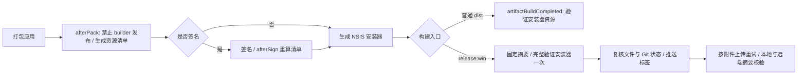

# 构建、打包与发布

> 涉及文件:[package.json](../../../package.json)(`scripts` 与 `build` 配置)、[scripts/create-icon.js](../../../scripts/create-icon.js)、[scripts/publish-release.js](../../../scripts/publish-release.js)、[scripts/check-js.js](../../../scripts/check-js.js)、[scripts/build-local.bat](../../../scripts/build-local.bat)、[scripts/build-debug.bat](../../../scripts/build-debug.bat)、[build/installer.nsh](../../../build/installer.nsh)

本文档是构建/打包/发布的**唯一事实源**:npm scripts、依赖清单、electron-builder 配置、图标生成、NSIS 脚本、发布流水线、运行模式、版本管理、本地批处理均只在此成表。自动更新的运行时状态机与 UI 同步见 [desktop/update.md](../desktop/update.md),桌面进程与 userData 布局见 [desktop/main.md](../desktop/main.md),各运行模式的认证能力差异见 [desktop/auth.md](../desktop/auth.md)。

## 1. npm scripts(唯一成表处)

| script                | 命令                                                                                                                                                              | 说明                                                                                                         |
| --------------------- | ----------------------------------------------------------------------------------------------------------------------------------------------------------------- | ------------------------------------------------------------------------------------------------------------ |
| `start`               | `node src/server.js`                                                                                                                                              | 纯 Web 模式:仅启动 HTTP 服务,进程模型见 [backend/server-core.md](../backend/server-core.md)                  |
| `desktop`             | `electron .`                                                                                                                                                      | 桌面模式:Electron 壳与 HTTP 服务同进程                                                                       |
| `check`               | `node scripts/check-js.js`                                                                                                                                        | 全量 JS 语法覆盖，逐文件复用；支持 `--plan` / `--force`（见 [test.md](test.md) §3） |
| `test` | `node scripts/run-tests.js` | 递归收集业务目录中的测试；默认文件并发 6，支持依赖组、目录和 `--file` 路径/通配符筛选(见 [test.md](test.md)) |
| `test:admin` | 具体文件清单见 [package.json](../../../package.json) 的 `scripts.test:admin` | 固定管理页组合、外壳、AI、弹幕与加班机回归；显式启用 ESM VM 模块 |
| `verify:docs`         | `node --test test/engineering/governance-docs.test.js`                                                                                                                        | 治理文件、路由表、规格索引和范围内 Markdown 链接检查                                                         |
| `verify:architecture` | `node --experimental-vm-modules --test test/engineering/module-boundaries.test.js test/engineering/esm-module-boundaries.test.js test/engineering/modularity-size.test.js`                                                         | 模块边界、遗留债务预算和前端 ESM 边界检查                                                                    |
| `verify:quick`        | `npm run verify:docs && npm run check && npm run verify:architecture`                                                                                             | 日常评审前快速门禁:文档 → 语法 → 架构                                                                        |
| `verify:contracts` | `node scripts/verify-server-contract.js` | 核对固定服务器提交和 fixture SHA-256；支持 `LIRA_SERVER_ROOT` |
| `verify:roundtrip` | `node scripts/verify-song-roundtrip.cjs` | 固定服务器真实 HTTP 歌库往返；两仓需安装依赖 |
| `verify` | `npm run verify:contracts && npm run check && npm test` | 完整门禁:实时契约输入 → 语法 → 全量测试 |
| `diagnose:wesing`     | `node scripts/inspect-wesing-playback.js`                                                                                                                         | 全民 K 歌播放状态交互诊断(见 [test.md](test.md) §4 与 [backend/music/wesing.md](../backend/music/wesing.md)) |
| `make:icon`           | `node scripts/create-icon.js`                                                                                                                                     | 生成 `build/icon.png` + `build/icon.ico`(见 §5)                                                              |
| `dist:win`            | `npm run make:icon && electron-builder --win nsis --x64 --publish never`                                                                                                          | 正式打包:下载 Electron 二进制 + 构建 NSIS 安装包                                                             |
| `dist:win:local`      | `npm run make:icon && set ELECTRON_SKIP_BINARY_DOWNLOAD=1 && electron-builder --win nsis --x64 --publish never --config.electronDist=node_modules/electron/dist`                  | 本地打包:跳过二进制下载,复用 `node_modules/electron/dist`                                                    |
| `release:win`         | `node scripts/publish-release.js`                                                                                                                                 | 完整发布流水线(见 §7)                                                                                        |

- 出处:[package.json](../../../package.json) 的 `scripts` 字段。
- `dist:win:local` 使用**原生 cmd 语法**(`set VAR=1 && …`,Windows-only),未引入任何跨平台环境变量注入工具；通过 Windows 上的 npm 执行。
- `test` 的 `--test-concurrency=6` 控制测试文件并发数，保留进程隔离；`--experimental-vm-modules` 必需:多个测试在 vm 中求值前端 ESM 模块(见 [test.md](test.md) §1)。

### 本地发布验证

当前仓库已移除 Check 工作流，发布前在 Windows 和 Node.js 24 环境执行 [发布指南](../../../RELEASE_GUIDE.md) 与本地验证命令。

Windows 发布验证使用 Node.js 24 LTS 最新补丁版（至少 24.16.0）。24.15.0 及更早 24.x 的 TCP 连接存在可能无 JavaScript 错误输出的原生崩溃，修复见 [Node #62561](https://github.com/nodejs/node/pull/62561) 与 [24.16.0 发布记录](https://nodejs.org/en/blog/release/v24.16.0)。可在 `tmp/` 使用校验过官方 SHA-256 的便携运行时并仅为当前命令设置 PATH，不需要重装依赖或修改系统 Node；这不改变桌面使用的 Electron 版本。

`npm run verify` 先实时校验 [契约锁](../../../server-contract.lock.json) 指定的服务器提交和夹具，再运行语法检查（逐文件复用）和完整 `npm test`，后者已包含文档与架构测试。依赖安装必须先结束，验证期间不要重装或修改依赖。服务器检出按显式路径、`LIRA_SERVER_ROOT`、已存在的平级 `lira-server-contract`、平级 `lira-server` 的顺序选择；准备方式与失败语义见 [测试参考](test.md#固定服务器契约输入)。不要为测试重置正在开发的服务器工作区。真实 HTTP 歌库往返由 `npm run verify:roundtrip` 单独执行，要求两边安装依赖。

原生安装器测试需要 `LIRA_TEST_MAKENSIS` 指向 NSIS 的 `makensis.exe`，`LIRA_TEST_NSIS_PLUGINS` 指向包含 `StdUtils.dll` 和 `nsProcess.dll` 的 `x86-unicode` 插件目录；可复用本机 electron-builder 缓存。发布验证应配置这些路径并检查测试汇总，确保安装、迁移和卸载场景实际执行。

未在上表展开的脚本（精确键名与 package.json 一致）：

| npm script | 用途及读写/环境边界 |
| --- | --- |
| `verify:modularity` | 运行 `scripts/check-modularity.js` 的源码规模检查；不修改源码 |
| `test:offline` / `test:browser` / `test:desktop` / `test:installer` / `test:contracts` | 按运行依赖选择测试组；完整发现命令、临时状态隔离、Chromium/Electron/NSIS/服务器 fixture 要求见 [test.md](test.md) §1 |
| `refresh:gifts` | `scripts/refresh-bilibili-gift-sale.js` 读取指定 dataDir 的当前 roomId/盲盒配置，联网获取 Bilibili 在售目录并写本地缓存；使用 `--room-id` / `--data-dir` 指定维护目标，不是纯检查 |
| `sync:gifts` | `scripts/initialize-gift-catalog.js` 从 LIRA Server 下载公开目录与图片，并迁移/写入指定数据目录的 cache；目录取首个位置参数、LIRA_DATA_DIR 或默认 data，不读写用户授权凭据，不是打包或发布步骤 |

## 2. 依赖清单(唯一成表处)

| 类型            | 包                  | 版本       | 用途                                                                    |
| --------------- | ------------------- | ---------- | ----------------------------------------------------------------------- |
| dependencies    | `@clamber_l/crypto` | `0.1.12`   | QQ音乐加密音频解码                                                      |
| dependencies    | `@jixun/qmweb-sign` | `2.0.3`    | QQ音乐 zzcSign 请求签名([package.json](../../../package.json))   |
| dependencies    | `qrc-decoder`       | `1.0.2`    | QQ音乐 QRC 歌词 3DES 解密([package.json](../../../package.json)) |
| dependencies    | `yauzl`            | `3.4.0`    | 有限体积、逐项读取本机素材 ZIP；精确锁定 |
| dependencies    | `electron-updater`  | `^6.8.4`   | 应用内自动更新(运行时见 [desktop/update.md](../desktop/update.md))      |
| devDependencies | `electron`          | `43.2.0`   | Electron 运行时,精确锁定([package.json](../../../package.json))  |
| devDependencies | `electron-builder`  | `^26.11.1` | 打包器([package.json](../../../package.json))                    |
| devDependencies | `playwright`        | `^1.62.1`  | 开发期浏览器自动化工具;不随正式应用打包,包括其依赖 `playwright-core`      |

**engines:`node >=24`**([package.json](../../../package.json))。运行时依赖 5 个,开发依赖 3 个;版本与依赖归类以 [package.json](../../../package.json) 为准。

**npm overrides**([package.json](../../../package.json)):js-yaml 强制 `^4.3.1` 以解决 GHSA-5p4m-2wfm-xmqj(CVE-2026-59870,!!omap 二次方 CPU 消耗)。该漏洞影响 electron-updater 与 electron-builder 的传递依赖 js-yaml 4.0.0-4.3.0;override 后生产依赖审计为 0 高危漏洞。

## 3. electron-builder 配置(唯一成表处)

本机导入的组件素材存储在 `dataDir/component-library/`，位于打包白名单之外。月渡花汀专用背景/开播/时钟/弹幕/许愿图片、WebM、字体和缩略图已从 `build.files` 排除，原始文件保留在源码；小型受信渲染 JS/CSS 继续打包。`node scripts/package-moonlit-suite.js` 生成独立 ZIP，主播导入后选用。排除的运行媒体与预览约 44.52 MiB（不是安装器最终减少量）；实际过滤由 packaging-scope 测试验证。未重新构建安装器。ZIP 格式见[套装指南](../../guides/component-style-packages.md)。

全部配置内联在 [package.json](../../../package.json) 的 `build` 字段,无独立 electron-builder 配置文件。

| 配置项                                                   | 值                                                            | 出处                                                | 说明                                                                                   |
| -------------------------------------------------------- | ------------------------------------------------------------- | --------------------------------------------------- | -------------------------------------------------------------------------------------- |
| `appId`                                                  | `com.aurorawhisperer.lira`                                    | [package.json](../../../package.json)        | 应用标识                                                                               |
| `productName`                                            | LIRA                                                          | [package.json](../../../package.json)        | 安装/卸载显示名                                                                        |
| `artifactName`                                           | `lira-setup-${version}.${ext}`                                | [package.json](../../../package.json)        | 安装包命名                                                                             |
| `directories.output`                                     | `release`                                                     | [package.json](../../../package.json)        | 产物目录(见 §4)                                                                        |
| `files`                                                  | `src/**/*` + `public/**/*` + `build/icon.png` + `package.json` + 静态 PNG 排除项 + 旧礼物资源排除项 | [package.json](../../../package.json) | 白名单打包；显式保留主窗口使用的 PNG 图标，其他 buildResources 不进入 asar；静态界面 PNG 由 WebP 兄弟文件替代；旧礼物资源不进入安装包 |
| `asar`                                                   | `true`                                                        | [package.json](../../../package.json)        | 源码打成 asar 归档                                                                     |
| `npmRebuild`                                             | `false`                                                       | [package.json](../../../package.json)        | 无原生模块,跳过重编译                                                                  |
| `afterPack`                                              | `scripts/after-pack.js`                                        | [after-pack.js](../../../scripts/after-pack.js)      | 拒绝直接 builder 发布、移除 default_app.asar，并生成应用资源完整性清单；时序见 §7 |
| `afterSign` | `scripts/after-sign.js` | [after-sign.js](../../../scripts/after-sign.js) | 签名可能改变 unpacked 文件，签名后重算资源清单；无签名构建不依赖此 hook |
| `artifactBuildCompleted` | `scripts/verify-client-installer.js` | [verify-client-installer.js](../../../scripts/verify-client-installer.js) | 普通构建对 NSIS exe 验证最终嵌入资源；发布专用配置由发布入口调用同一校验，不运行安装器；失败阻断，时序见 §7 |
| `win.icon`                                               | `build/icon.ico`                                              | [package.json](../../../package.json)        | 由 make:icon 生成                                                                      |
| `win.target`                                             | nsis / x64                                                    | [package.json](../../../package.json) | 仅 Windows x64                                                                         |
| `nsis.oneClick`                                          | `false`                                                       | [package.json](../../../package.json)        | 标准安装向导,非一键安装                                                                |
| `nsis.perMachine`                                        | `false`                                                       | [package.json](../../../package.json)        | 按用户安装,无需管理员权限                                                              |
| `nsis.allowToChangeInstallationDirectory`                | `true`                                                        | [package.json](../../../package.json)        | 允许自定义安装目录                                                                     |
| `nsis.shortcutName` / `uninstallDisplayName`             | LIRA                                                          | [package.json](../../../package.json) | 快捷方式与卸载显示名                                                                   |
| `nsis.createDesktopShortcut` / `createStartMenuShortcut` | `true`                                                        | [package.json](../../../package.json) | 桌面 + 开始菜单快捷方式                                                                |
| `nsis.include`                                           | `build/installer.nsh`                                         | [package.json](../../../package.json)        | 自定义 NSIS 宏(见 §6)                                                                  |
| `publish`                                                | GitHub `AuroraWhisperer/LIRA`,`releaseType: release`          | [package.json](../../../package.json) | electron-updater 更新源与发布脚本读取                                                  |

`artifactName` 在顶层 `build` 与 `build.nsis` 各声明一次([package.json](../../../package.json));发布脚本按 `build.nsis.artifactName` 计算产物文件名([publish-release.js:14-16](../../../scripts/publish-release.js#L14-L16))。

礼物图片和目录快照不再随源码或安装包分发。加班机房间目录由 Bilibili 面板/配置及在售盲盒展开决定；首次授权后，桌面运行时从 LIRA Server 获取付费目录并把全部可用图片写入 `data/cache/overtime-gift-images/`，元数据与完成状态写入同一用户数据目录，不属于 `app.asar`。构建验收应检查源码树、新生成的 `app.asar`、`win-unpacked` 和 NSIS 安装包均不含 `public/img/bilibili-gifts/`、`public/img/bilibili-gifts.json`、三份旧礼物 Markdown 或背包图库维护脚本；既有 release 产物不会因新构建自动改写。

## 4. 产物(release/)

正式应用不包含开发依赖 Playwright/Playwright Core 或 Electron 默认示例程序。`afterPack` 删除构建输出里的默认示例文件并生成资源清单；不修改开发环境的 Electron 分发目录。离线回归覆盖见 `test/engineering/packaging-scope.test.js`。

全屏礼物感谢与弹幕装饰的 18 个 PNG 后缀资源保留为源码素材,对应 WebP 进入安装包:其中 15 张 PNG 无损转换,3 张守护气泡图原本就是 WebP 编码,保留原始字节并使用正确后缀;已有第 3–6 套队列主题 WebP 不变。开播音乐与人物图不再内置,三个原始素材移至 `test/fixtures/opening/` 供手动上传测试;该目录在打包白名单之外,`public/img/overlays/opening/` 也显式排除。实际用户上传继续写入现有 data 目录,不会打入 `app.asar`。

| 产物                                | 说明                                     |
| ----------------------------------- | ---------------------------------------- |
| `lira-setup-{version}.exe`          | NSIS 安装包,发布时的上传主产物           |
| `lira-setup-{version}.exe.blockmap` | 差分更新块映射(electron-updater 用)      |
| `latest.yml`                        | 更新清单,electron-updater 的版本比对依据 |
| `win-unpacked/`                     | 未打包目录(本地运行/调试)                |

## 5. 图标生成(scripts/create-icon.js)

**零第三方依赖**的纯 Node 实现(`node:zlib` 之外不 import 任何包),**不使用 node-canvas**,无需任何系统级图形库(与旧文档相反)。

- 若 `build/icon-source.png` 存在([create-icon.js:15-25](../../../scripts/create-icon.js#L15-L25)):手写 PNG 解码器([create-icon.js:103-175](../../../scripts/create-icon.js#L103-L175))读取 → 居中裁正方形 → 暗色边缘背景泛洪去除([create-icon.js:219-241](../../../scripts/create-icon.js#L219-L241))→ 最近邻缩放到 256×256;
- 否则程序化绘制应用图标:圆角渐变底 + 麦克风/音符图形(圆与矩形图元,[create-icon.js:27-56](../../../scripts/create-icon.js#L27-L56));
- 输出 `build/icon.png` 与 `build/icon.ico` — ICO 为 **PNG 压缩的单尺寸 256×256**(宽度字段 0 表示 256,[create-icon.js:307-321](../../../scripts/create-icon.js#L307-L321))。

`npm run make:icon` 是 `dist:win`/`dist:win:local`/`release:win` 的前置步骤;electron-builder 读取 `build/icon.ico`([package.json](../../../package.json))。

## 6. NSIS 安装脚本(build/installer.nsh)

被 `nsis.include` 引用([package.json](../../../package.json)),在标准 NSIS 流程上追加:

- `ManifestDPIAware true`([installer.nsh:1](../../../build/installer.nsh#L1)):安装器进程高 DPI 感知。
- `customInit`([installer.nsh](../../../build/installer.nsh))只选择默认目录并检查本应用在当前安装上下文中的卸载项；仅在带引号的卸载程序路径明确不存在时删除该项，不遍历其他应用。首次安装有 D 盘时默认 `D:\LIRA`，无 D 盘时保留 builder 默认目录；升级沿用本机已有路径，不限制盘符。[installer-directory.nsh](../../../build/installer-directory.nsh) 在安装模式切换后的目录页再次应用默认值，保留 builder 的更新跳页行为。命令行 `/D` 和目录页的显式选择优先。
- [installer-data.nsh](../../../build/installer-data.nsh) 在标准安装 section 前确认旧 LIRA 已退出。交互安装检测到运行中程序时，先提示将自动关闭；用户确认后，仅向旧安装目录或所选安装目录中 LIRA 可执行文件所属的窗口发送正常关闭请求，不强制结束进程。等待约 10 秒仍未退出才提示手动关闭并重试或取消；取消不会移动数据。静默更新等待应用自行退出，不发送额外关闭请求，超时仍中止。确认退出后，用系统 `robocopy` 将完整数据复制并发布到 `<新安装目录>.lira-data-backup`。返回码 0–7 才允许运行旧卸载器；失败、数据冲突或无法检查进程时停止。程序替换后恢复 `data/`，恢复失败保留备份、报告位置并禁止启动空库。升级时 `customRemoveFiles` 只替换程序文件，保留 `data/`、`logs/`、`updates/`。详情见 [desktop/main.md](../desktop/main.md) §3 和 ADR [0015](../../architecture/adr/0015-install-local-desktop-data.md)。
- [installer-uninstall.nsh](../../../build/installer-uninstall.nsh) 拥有普通卸载选项和删除策略。普通卸载自动清理 `logs/`、`updates/`，完整保留 `data/`；“同时删除用户数据”默认不勾选。安装模式选定且程序退出后，勾选者需再次确认，默认回答“否”，拒绝确认会保留数据并继续卸载。确认后清理当前安装数据及当前用户的 `%APPDATA%/com.aurorawhisperer.lira`、`%APPDATA%/lira`，避免重装导入旧资料；手工/安装恢复备份及云端资料保留。静默卸载不删除数据，`--updated` 升级始终保留全部运行目录。删除前拒绝空路径、磁盘根（包括 NSIS 去掉尾斜杠后的裸盘符）与安装目录链接；递归清理只移除链接本身，不跟随目标，失败返回非零并留下卸载程序用于重试。[原生卸载回归](../../../test/engineering/installer-uninstall.test.js) 在隔离目录编译真实卸载页，覆盖默认保留、确认删除、静默/升级、目录链接和失败路径。
- 交互安装在迁移期间显示等待提示；复制或目录发布失败时显示错误步骤与复制返回码，并把详细输出以 UTF-16 保存到 `%TEMP%/LIRA-install-error.txt`。报告无法写入时仍显示错误弹窗。静默安装不显示等待提示或阻塞弹窗，失败仍返回非零退出码。
- [collect-install-diagnostics.cmd](../../../scripts/collect-install-diagnostics.cmd) 调用同目录的 [PowerShell 收集脚本](../../../scripts/collect-install-diagnostics.ps1)，在工具旁生成 `LIRA安装诊断-日期时间.txt`（写入失败时退回 `%TEMP%`）。内容限于 Windows 版本/位数、同目录最多五个安装包的大小/哈希/签名、相关进程名、两天内的迁移报告及匹配 LIRA 程序名的崩溃/拦截事件；不会运行安装包、读取业务数据库或上传报告。迁移报告不存在不能证明故障原因。

## 7. 发布流程(scripts/publish-release.js)

支持的 Windows 构建入口统一指定 `--publish never`；`afterPack` 拒绝直接启用 builder 发布，以免 blockmap 或安装器在最终验证前开始上传。发布必须经过 `npm run release:win`。

1. 拒绝有未提交/未跟踪修改的工作区，解析 `GH_TOKEN` 或 gh CLI 登录态，并只读核对本地标签和远端 peeled commit 与 HEAD 一致；保留代理探测和凭据脱敏。
2. 生成图标后再次核验工作区与 HEAD。
3. 只构建一次：`electron-builder --win nsis --x64 --publish never --config scripts/release-builder-config.js --config.electronDist=node_modules/electron/dist`。发布专用配置继承 package.json 的 build，仅将 `artifactBuildCompleted` 设为 null，由发布入口接管最终资源验证。普通 `dist:win` / `dist:win:local` 继续使用原钩子。构建失败直接停止，不根据旧附件判定成功。
4. `afterPack` 保留删除 default_app.asar 的行为，再按构建上下文版本/平台/架构生成资源清单；发生签名时 `afterSign` 重算最终资源。无签名构建不依赖 afterSign。
5. 发布入口记录 exe、exe.blockmap、latest.yml 的 SHA-256，完整校验最终 NSIS exe 一次。随后复核全部文件摘要，确保产物未变；验证失败或产物改变不创建新标签、Release 或上传附件。
6. 构建/验证后再次核验工作区、HEAD 和标签；只有一致才创建并推送标签，随后创建或复用 GitHub Release。标题使用当前版本，正文来自 UPDATE.md 的对应版本小节，经临时 notes 文件传入。
7. 首次上传前及每轮上传后核对远端名称、字节数和已验证的 SHA-256；远端无摘要时下载至独立临时目录计算并清理。本地对比复用固定摘要，上传前后仍复核全部本地文件，变化立即中止。
8. 最多三次调用 `gh release upload --clobber`，仅上传缺失或未确认一致的附件。命令失败也核对已完成的附件；若远端全部一致可恢复成功，否则只补传剩余附件。无法确认的附件不得判成功，重试耗尽报错；重试不重新构建。

资源摘要证明应用文件与随包清单一致；发布者签名验证是独立保证。`afterSign` hook 存在不代表正式证书配置或签名安装验收已完成，当前签名状态仍见 §12。

**最终资源验证**：`scripts/verify-client-installer.js` 使用 Windows 自带的 libarchive `tar.exe` 从当前 NSIS exe 读取嵌入应用归档。先检查列表中将被提取的路径、类型及重复项，再只提取清单和应用资源到独立临时目录；不运行安装器，不读取现有安装/用户数据。要求清单与实际随包应用资源集合及字节完全一致，结束后清理临时目录。构建主机缺少兼容的 tar，或后续 NSIS 格式不再支持此提取方式时，构建/发布失败，不能跳过验证或退回只验证 win-unpacked。非 Windows 构建主机需要兼容的 `bsdtar`。

**清单**：`resources/client-integrity-manifest.json`，4 MiB/10000 项上限；仅包含 app.asar 和实际存在的 app.asar.unpacked 普通文件；稳定排序，不含清单自身、运行环境和用户数据。构建生成器和运行时共用 `resource-integrity-files.js` 的格式/路径/摘要规则。运行期语义见 [desktop/update.md](../desktop/update.md)。

**凭据**：保持 GH_TOKEN/gh 登录态和已有输出脱敏，不将密钥放入参数。Git/gh 直接启动，仅 Windows npm/npx 使用 shell。latest.yml 与安装包/块映射一同由 gh 上传，不再由 builder 自动上传。测试见 `test/engineering/publish-release.test.js`、`test/engineering/packaging-scope.test.js`、`test/engineering/client-installer-integrity.test.js`。
## 8. 运行模式对比

| 模式     | 入口                   | ELECTRON_DESKTOP | 进程                          | 认证与功能                                                                                                                                            |
| -------- | ---------------------- | ---------------- | ----------------------------- | ----------------------------------------------------------------------------------------------------------------------------------------------------- |
| Node 调试 | `npm start`            | 未设             | 仅 HTTP Server                | 管理 HTML/API 仍需有效管理凭据；没有 preload、safeStorage、Cookie 注入和主进程远端代理。不是匿名完整 Web 管理产品；入口与凭据来源见 [pages.md](../frontend/pages.md) §2 |
| 桌面     | `npm run desktop`      | `'1'`            | Electron main + Server 同进程 | 完整:分区登录、Cookie 注入、自动更新                                                                                                                  |
| 开发桌面 | `electron .`(直接运行) | `'1'`            | 同上                          | 同上;未打包环境下调试桌面功能                                                                                                                         |

`ELECTRON_DESKTOP` 由 Electron main 启动早期写为 `'1'`([main.js](../../../src/electron/main.js)),`/api/health` 的 `desktop` 字段据此上报（[api-context.js](../../../src/server/api-context.js) 的 system.health）;进程模型见 [desktop/main.md](../desktop/main.md)。环境变量(`HOST`/`PORT`/`SONG_PLUGIN_DATA_DIR`/`AUTO_OPEN_ADMIN`)的唯一成表处在 [backend/server-core.md §3](../backend/server-core.md)。

## 9. 版本管理

- 版本号唯一来源:package.json `version`([package.json](../../../package.json))。
- 变更记录:`UPDATE.md`,按 `## v{version} 变更` 小节组织([UPDATE.md:7](../../../UPDATE.md));发布脚本自动截取当前版本小节作为 Release 正文([publish-release.js:117-131](../../../scripts/publish-release.js#L117-L131))。
- git 标签:每次发布创建附注标签 `v{version}` 并推送 origin([publish-release.js:67-79](../../../scripts/publish-release.js#L67-L79))。
- 发布前需确认 package.json 与 UPDATE.md 中的版本一致(版本不匹配时 Release 正文会退回占位文本)。

## 10. 本地构建批处理

| 脚本                                                | 内容                                                                                                                                                                                                      | 用途                                                                   |
| --------------------------------------------------- | --------------------------------------------------------------------------------------------------------------------------------------------------------------------------------------------------------- | ---------------------------------------------------------------------- |
| [build-local.bat](../../../scripts/build-local.bat) | `set ELECTRON_SKIP_BINARY_DOWNLOAD=1` + `ELECTRON_BUILDER_CACHE=%USERPROFILE%\.cache\electron-builder` → make:icon → `electron-builder --win nsis --x64 --config.electronDist=node_modules/electron/dist` | 使用本地已安装的 Electron 构建,避免重复下载;完成后列出 `release\*.exe` |
| [build-debug.bat](../../../scripts/build-debug.bat) | `set DEBUG=electron-builder` + `DEBUG_COLORS=true` → `npx electron-builder --win nsis --x64 %*`                                                                                                           | electron-builder 调试日志输出;`%*` 透传额外参数(如 `--publish never`)  |

两个批处理与 `npm run dist:win:local` 等价但带额外环境变量/参数;**均不改变 asar 打包行为**(与旧文档的描述相反)。

## 11. 自动更新

运行时依赖 `electron-updater` ^6.8.4(见 §2);更新清单即 §7 上传的 `latest.yml`。检查时机、更新状态机(`idle → checking → update-available → downloading → downloaded`)、安装与重启时序、状态到渲染进程的同步,全部成文于 [desktop/update.md](../desktop/update.md)。

## 12. Windows 代码签名

签名与独立验证脚本已实现，当前 `build.win` 未接入签名，发布入口也未执行发布者签名校验。脚本输入、配置前提与尚未完成的接入统一见 [code-signing.md](code-signing.md)；本节不重复维护配置模板。
