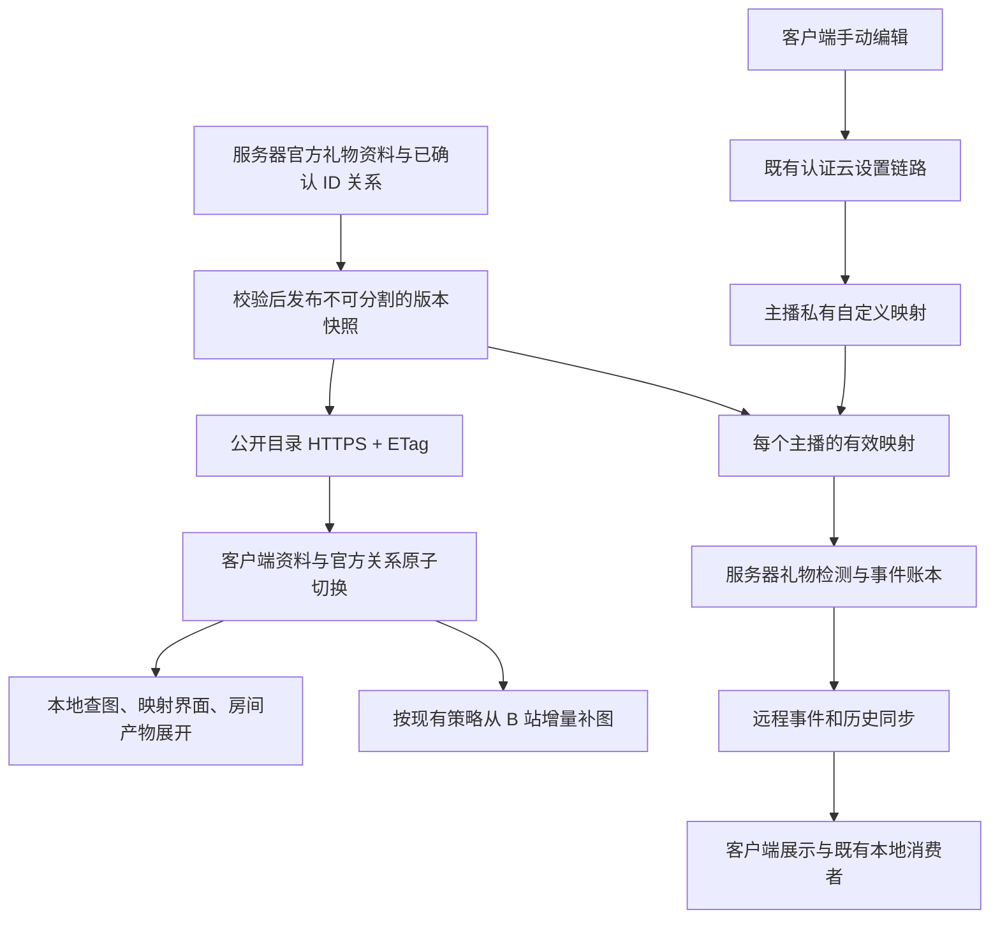

# 盲盒映射、礼物资料与图片更新方案报告

- 日期：2026-09-05。
- 状态：设计提案，待确认后实施；不是已完成功能或已接受 ADR。
- 范围：客户端 `D:/Work/Live` 与服务器 `D:/Work/lira-server`。本轮只编写本报告，不修改业务代码、数据库、接口或部署。
- 依据：前一任务中用户明确的需求，以及上述两个工作区的当前代码与协议。工作区已有未提交修改，报告中的“已有”指当前工作树，不代表已打包发布。

## 1. 结论

建议采用：**服务器维护官方礼物资料和盲盒关系，作为同一个版本的数据包发布；主播可以新增自己的盲盒映射，保存到所属主播的服务器配置；服务器负责实际检测，客户端负责同步、展示及既有本地业务消费。**

用户已确认：本次功能升级同时包含服务器映射及检测消费的更新，不是只更新客户端资料。服务器使用新映射识别后续礼物的盲盒归属、计算盈亏并同步结果；客户端负责最近礼物的盲盒图片、卡片颜色和盈亏展示。服务器不需要新增与客户端同款的“最近礼物”界面，识别是否正确通过事件、接口与账本验证。

这个方向适合现在的项目，不需要增加微服务、消息队列、前端框架或另一套图片下载系统。要补齐的不是下载按钮，而是三个数据边界：

1. 礼物资料、盲盒关系和版本必须一致。单独改关系，也要让客户端收到更新。
2. 官方映射与主播自定义映射分开保存。官方同名项可以接管自定义项，客户端不能把官方资料反向上传成主播配置。
3. “这个礼物可能由盲盒开出”不等于“这次送礼就是开盲盒”。事件来源与目录标签必须分开处理。

最终体验是：首次使用自动得到映射和图片；以后后台更新，新增盒子及产物无需重新安装客户端。心动、幸运保留原配色，其他盒子统一采用渐变紫色。历史盈亏与已配置的加班规则不随资料更新改变。

## 2. 已确定的需求与非目标

### 2.1 用户已明确的要求

| 要求 | 本方案的处理 |
| --- | --- |
| 本地礼物检测暂时停用，以后主要使用服务器检测 | 改造服务器检测入口；本地检测代码保留，不自动重新开启 |
| 服务器也要使用更新后的映射，但不需要客户端式最近礼物界面 | 服务器负责归属识别、盈亏计算和结果同步；客户端负责对应图片、颜色和盈亏展示 |
| 金瓜子价格 `>= 0` 的礼物可以进入资料库 | 新版资料镜像支持 `coinType === 'gold' && priceRaw >= 0`；不把缺失价格当作零 |
| 区分普通礼物、盲盒本体、盲盒产物 | 使用“是不是盒子”和“属于哪些盒子”两个维度，关系按 ID 保存 |
| 首次初始化映射，后续同时更新映射及图片 | 一次获取资料和官方映射，图片按现有规则增量下载 |
| 保留手动新增映射 | 新增的盲盒名称不能与当前官方项或本主播有效自定义项重复 |
| 后续出现同名官方盲盒时自动覆盖自定义项 | 官方整条关系接管，不把自定义产物偷偷并入官方关系 |
| 同名不同 ID 的产物通常可以放在一个盒子里 | 确认属于同一盒子的多个 ID 可一起维护，但不根据名字自动推导归属 |
| 闪耀盲盒很旧 | 保留历史关系，不因年代久删除，也不因产物同名影响其他盒子 |
| 心动和幸运保留颜色，其余统一渐变紫色 | 包括已有其他盒子、未来新盒子和自定义盒子；盈亏数字的语义颜色不变 |
| 先写完整报告再决定实施 | 本文描述新增行为及验收条件，不将提案标为已经实现 |

### 2.2 这次不做什么

- 不增加“开出零价值盲盒产物”的记账逻辑。用户已明确不存在这类业务需求。
- 不改变正式礼物历史、结算仍要求有效正金额的契约；收录零价资料不是接收零金额礼物事件。
- 不重新判定、重放或批量重算历史礼物，不删除已有加班规则。
- 不将主播私有映射放到公开目录中，也不允许客户端修改官方目录。
- 不因为目录更新自动开启本地检测，不让本地与远程来源重复入账。
- 不在服务器新增客户端式“最近礼物”页面；现有服务器页面不因本次分工澄清而删除或重做。
- 不把大航海权益的 `awardId` 当作礼物 `giftId`，不把 Super Chat 并入本方案。
- 首版不建设新的远程推送系统或官方映射管理后台。可继续从现有受维护的 ID 关系表发布。

## 3. 当前实现与真正缺口

### 3.1 已有能力

| 范围 | 当前工作树中的实现 | 证据 |
| --- | --- | --- |
| 公共礼物目录 | `/api/public/gifts/catalog` 一次返回扁平礼物资料，有 ETag 与条件请求 | [服务器目录查询](D:/Work/lira-server/src/modules/gifts/gift-catalog-queries.js:479)、[公共路由](D:/Work/lira-server/src/routes/gifts-public.js:135) |
| 首次初始化 | 首次授权后获取资料并扫描图片，单张图片失败不等于整个初始化失败 | [初始化器](D:/Work/Live/src/bilibili/gift/gift-catalog-initializer.js:65) |
| 后续更新 | 后续启动后台检查，运行中每 12 小时检查；包括 304 在内的检查会扫描缺图和换图 | [当前更新设计](D:/Work/Live/specs/remote-gift-catalog-sync_design.md)、[缓存周期](D:/Work/Live/src/bilibili/gift/remote-catalog-cache.js:8) |
| 图片增量与提示 | 按 ID 和图片来源标识复用缓存，换图失败保留旧图；有实际下载时使用同一条进度 Toast | [图片缓存](D:/Work/Live/src/bilibili/gift/remote-gift-image-cache.js)、[提示模块](D:/Work/Live/public/js/admin/gifts/catalog-update-toast.js) |
| 服务端盲盒关系 | 维护 `盲盒 ID -> 产物 ID[]`，供公共礼物详情使用；另有独立权益奖品表 | [官方关系来源](D:/Work/lira-server/src/modules/gifts/blind-box-catalog.js:4) |
| 主播映射同步 | `giftBlindBoxConfig` 是可选云设置，结构仍为名称、价格、产物名称数组 | [服务端设置校验](D:/Work/lira-server/src/lib/streamer-sync-settings.js:55)、[协议](D:/Work/lira-server/docs/protocol/client-server-api.md:81) |
| 服务端实际检测 | 从本主播的设置读取映射，不是直接读取公共目录的 ID 关系 | [检测器注入](D:/Work/lira-server/src/modules/bilibili/monitor-manager.js:73) |
| 远程事件客户端消费 | 规范化并导入服务器盲盒字段，不调用本地映射再次判定 | [远程控制器](D:/Work/Live/src/electron/remote-gift-controller.js:401)、[权威结果导入](D:/Work/Live/src/bilibili/gift/detection-service.js:166) |
| 卡片和通知颜色 | 最近礼物固定五种盒型/颜色，盲盒通知 Toast 目前使用通用粉色 | [固定盒型](D:/Work/Live/public/js/admin/gifts/recent.js:11)、[卡片 CSS](D:/Work/Live/public/css/admin/gifts/recent.css:328)、[通知 CSS](D:/Work/Live/public/css/admin/toasts/gifts.css:161) |

### 3.2 必须补齐的缺口

1. **公共扁平资料没有发布完整的官方盲盒关系。** 目前不能靠一次目录下载初始化这套映射。
2. **两套关系没有统一消费。** 公共目录使用 ID 表；检测读取名称配置，更新其中一份不会自动修正另一份。
3. **名称映射会覆盖同名产物。** `createBlindBoxMap()` 使用 `map.set(item.name, ...)`，后写入的同名记录覆盖前一条。
4. **版本只依赖成功抓取 run ID。** `listClientCatalog()` 按该 ID 复用快照，改映射文件本身不是版本更新事件。
5. **客户端白名单会丢弃新字段。** 只在 JSON 中加关系还不够，标准化、缓存克隆、指纹、通知和消费者都要保留并使用它。
6. **当前镜像仅收正价 gold 礼物。** `isPaidGift()` 使用 `priceRaw > 0`，与新需求的资料范围不同。
7. **事件缺少稳定的盒子 ID。** 当前解析器会读取部分盲盒字段判断真假，但标准化结果主要保留盒名和盒价；远程 DTO 也没有 `blindBoxId`。
8. **新增盒型不只是 CSS。** 设置、展示分类、统计筛选、OBS 和加班目录都有消费者，不能只加一条颜色规则。

证据：[名称映射](D:/Work/lira-server/src/lib/gift-blind-box-config.js:84)、[检测映射应用](D:/Work/lira-server/src/modules/bilibili/gift-detector.js:167)、[公共版本缓存](D:/Work/lira-server/src/modules/gifts/gift-catalog-queries.js:495)、[客户端标准化](D:/Work/Live/src/bilibili/gift/remote-catalog-cache.js:200)、[正价筛选](D:/Work/Live/src/bilibili/gift/remote-catalog-cache.js:304)、[事件解析](D:/Work/lira-server/src/modules/bilibili/gift-parser.js:482)、[远程 DTO 协议](D:/Work/lira-server/docs/protocol/client-server-api.md:79)。

### 3.3 同名不同 ID 的已知例子

| 产物名称 | 产物 ID | 项目现有映射中的所属盒子 |
| --- | --- | --- |
| 时空之站 | `32282` | 心动盲盒 `32251` |
| 时空之站 | `34082` | 闪耀盲盒 `32368` |

名称和价格来自服务器仓库的公开资料文件 `gift-import/bilibili-gifts.json`；关系来自上述维护表。这是**项目记录的事实，不是本次重新向 B 站核验的实际开盒记录**。两条关系应按各自 ID 保留，不以“同名”或“老盒子”决定合并。

同一个盒子也完全可以有多个同名产物 ID；同一个产物 ID 也可以出现在多个盒子的已确认关系中。数据结构应容纳这些情况，界面可以合并展示名字，但展开后必须能看见各个 ID。

## 4. 数据归属与整体流程



| 数据 | 权威拥有者 | 客户端角色 |
| --- | --- | --- |
| 官方礼物 ID、名称、币种、价格、图片地址、盲盒关系 | 服务器公共礼物目录模块 | 缓存与只读展示 |
| 主播自定义映射 | 认证后确定的 `streamerId` 对应私有设置 | 编辑、提交、缓存已确认结果 |
| 当前主播的有效映射 | 服务器由官方版本和本主播自定义版本计算 | 镜像同一规则，不能自行宣称远程检测已生效 |
| 这次礼物的来源、成本、产物金额和盈亏 | 服务器检测与事件账本 | 消费已处理字段，不按本地新目录重判远程事件 |
| 本机图片文件 | 客户端现有图片缓存模块 | 下载、校验、按 ID 更新显示 |
| 加班规则和本地结算 | 既有本地加班业务边界 | 保留原规则与幂等行为 |

公共快照不包含 `streamerId`、自定义配置、设备凭据或主播 B 站 Cookie。读取公共资料与写入私有映射必须保持不同权限边界。

### 4.1 三种版本不能混用

- 公共 `catalog.version`：只表示官方资料和关系，不包含任何主播私有内容。
- 既有 `settings.revision`：表示本主播服务器已确认的完整设置快照，不等于公共资料版本。
- 本主播有效映射的依据：`检测模式 + 官方 catalog.version + 已采用的 settings.revision`。旧模式仍在使用名称配置；v2 模式才表示已切换到官方加自定义的 ID 关系。

建议通过认证的 cloud-state 响应增加只读映射状态元数据，返回检测模式及上述两个已采用版本；不是让客户端自己填写版本作为生效凭据。客户端拿到新公共包或私有设置后核对该状态，未对齐时只能显示“资料已更新/检测仍用旧配置/同步待完成”，不能笼统声称本主播检测已切换。公共包和认证私有状态仍是不同请求，不影响“官方资料一次取得”的约定。

联合依据由服务端在建立礼物组时固定并作必要内部持久化。现阶段不要求把它新增到每条实时/历史事件 DTO：客户端直接消费自描述的事件来源、成本和金额，不依赖本地版本重算；新增的可空盒子 ID 仍按第 8.4 节贯穿事件链。若以后需要对外暴露诊断版本，再单独进入协议白名单。

## 5. 礼物分类与更新包

### 5.1 不采用 `0+1` 复合 tag

推荐表达两个独立概念：

- `isBlindBox`：这份礼物资料是否描述盲盒本体。
- `blindBoxIds`：这个礼物可能从哪些盒子开出。它是从关系表生成的只读反向索引，不是另一份人工维护表。

| 礼物 | `isBlindBox` | 派生的 `blindBoxIds` |
| --- | --- | --- |
| 普通付费礼物 | `false` | `[]` |
| 幸运盲盒 `35206` | `true` | `[]` |
| 幸运泡泡 `35207` | `false` | `["35206"]` |
| 已确认的多盒共有产物 | `false` | `["盒子A的ID", "盒子B的ID"]` |

官方维护源只保存 `盲盒 giftId -> outputGiftIds[]`。公开包传这张表，服务端和客户端各自生成 `blindBoxIds` 及查找索引即可，避免同时传两套可相互矛盾的关系。`isBlindBox` 可表达“已确认是盒子，但尚无已确认普通礼物产物”的情况。

不能通过名称包含“盲盒”、编号相邻或新抓到一个礼物，就自动认定完整产物关系。现有名称启发式可以继续辅助维护人员发现候选项，但不能成为新结算关系的发布依据。

### 5.2 新版数据包示意

下列字段名及版本协商方式是**建议协议**，不是当前接口已经支持的响应。完整白名单、限制和错误码应在实施时进入双方协议及 fixture。

```json
{
  "ok": true,
  "schemaVersion": 2,
  "catalog": "all",
  "version": "sha256:content-digest",
  "updatedAt": "2026-09-05T08:00:00.000Z",
  "stale": false,
  "sources": {
    "gifts": { "asOf": "2026-09-05T08:00:00.000Z", "stale": false },
    "effects": { "asOf": "2026-09-05T08:00:00.000Z", "stale": false }
  },
  "count": 2,
  "gifts": [
    {
      "id": "35206",
      "name": "幸运盲盒",
      "coinType": "gold",
      "priceRaw": 5000,
      "battery": 50,
      "rmb": 5,
      "bagGift": true,
      "active": true,
      "isBlindBox": true,
      "sourceUrl": null,
      "imageUrl": null
    },
    {
      "id": "35207",
      "name": "幸运泡泡",
      "coinType": "gold",
      "priceRaw": 1500,
      "battery": 15,
      "rmb": 1.5,
      "bagGift": true,
      "active": true,
      "isBlindBox": false,
      "sourceUrl": null,
      "imageUrl": null
    }
  ],
  "blindBoxes": [
    { "giftId": "35206", "outputGiftIds": ["35207"] }
  ]
}
```

示例只演示一条关系，不代表幸运盲盒只有一个产物；`active`、`bagGift` 与图片空值仅示意，不是线上状态核验结果。正式发布必须使用校验后的完整快照，不发布这种截断示例。

规则如下：

1. 所有 B 站 ID 使用规范化的正十进制字符串，不经过浮点转换来识别；同名不同 ID 不去重。
2. 新版 gold 资料范围包含已知 `priceRaw === 0`；非法、未知或缺失价格不转换成零。保留既有内部合成 ID、大航海别名等隔离规则，不把它们伪装成 B 站普通礼物。
3. 资料价格用于目录及必要的已确认计价补全；实际事件金额另有优先级，见第 8 节。使用既有金额规范化与安全范围，不增加另一套单位算法。
4. `active` 表示官方目录当前可用状态，不表示“当前直播间可购买”。房间列表仍由本房间的礼物面板/config 决定。
5. 为保留已确认的历史关系，新版包可带被这些关系引用的非 active 礼物最小资料，明确标为 `active: false`；不扩成全量已删除礼物数据库。
6. 关系引用的盒子与产物必须有经过验证的资料。首次发布前核对历史引用；缺资料就补齐可信记录，不能按同名替换 ID 或给未知价格填零。无法确认的关系留在维护侧待处理，不静默从已有成功快照中抹去。
7. 只有确认的普通礼物关系进入 `outputGiftIds`。现有 `BLIND_BOX_AWARDS` 保持独立，权益不进入加班礼物列表或普通礼物盈亏。
8. 官方全量包必须通过重复 ID、引用、币种、价格、大小与图片地址校验后才发布。新格式客户端整体拒绝损坏关系包，不先存一半资料再跳过坏关系。

### 5.3 版本必须覆盖映射变化

新版业务版本由确定性序列化后的礼物资料及官方关系计算。参与版本的内容包括 ID、名称、币种、价格、图片源地址、盒子身份、active 状态和关系；数组规范排序，避免单纯排序改变引发更新。

检查时间、下载进度以及是否过期等动态状态不作为业务版本的随机组成部分。HTTP ETag 可以继续反映完整响应表示，但不能用频繁变化的检查时间伪造一次业务更新。

- 只新增关系、删除错误关系或更换产物归属，也必须得到新版本和可观察的响应变化。
- 服务器查询缓存的 key 必须包含完整版本，不能只看 B 站抓取 run ID。
- 服务端检测器和公开下载接口必须消费同一份已发布关系快照，不能一边读新文件、一边仍提供旧缓存。
- 客户端的标准化、持久化、clone、fingerprint 和初始化器版本比较必须包含关系。
- 同一版本没有图片变化时不重复下载；同一版本缺图时仍按已有机制补图。

## 6. 官方与自定义映射的规则

### 6.1 保存两层，计算一份有效结果

```text
当前主播有效映射 = 官方映射 + 未被官方同名接管的本主播自定义映射
```

官方映射只读；自定义映射允许增、删、改。界面仍然以名字供人阅读，但每条记录有稳定身份：官方用 B 站盒子 ID，自定义用服务器确认的私有 `customId`。自定义记录如有真实盒子 ID，可关联该 ID；不得占用现有官方盒子 ID 来绕过名称限制。

自定义产物必须明确到礼物 ID，名称只用于显示。编辑器可以从本地资料搜索选择，多个同名 ID 可以一次选入；若新产物尚未收录，允许提交明确 ID 和必要资料供服务端校验，不能悄悄把名称转换成猜测的 ID。

只有自定义分组名称、没有真实盒子 ID 时，它仍可参与已确定为盲盒事件的唯一产物匹配；但不能凭这个自定义分组把普通送礼强行改成盲盒。

### 6.2 名称冲突与官方覆盖

建议名称比较使用双方一致的最小规范化：首尾去空白、Unicode NFC 后精确比较；拒绝控制字符。不使用拼音、模糊包含或删光所有空格的方式扩大“同名”。官方别名若要参与覆盖，必须先由维护者明确收录，首版不自动推断别名。

| 场景 | 结果 |
| --- | --- |
| 新增名称与已存在官方盲盒相同 | 拒绝新增，显示对应官方记录 |
| 新增名称与本主播有效自定义盲盒相同 | 拒绝新增，提示编辑现有项 |
| 主播 A 与主播 B 新增同名自定义盲盒 | 允许，互不影响 |
| 自定义项改名为现有官方名称 | 拒绝保存 |
| 后续发布同名官方盲盒 | 官方整条映射接管；原自定义项退出有效集合 |
| 官方与自定义名称不同，但自定义占用了同一个官方盒子 ID | 拒绝该身份冲突，不允许用改名覆盖官方 |
| 多个盒子共享一个产物 ID | 保留多对多关系，事件来源不明确时不强选 |
| 两个官方盒子同名但 ID 不同 | 保留两个官方身份，不按名称自动合并；编辑器可按名字分组展示 |

覆盖示例：主播创建“夏日盲盒”，自定义产物是 A、B；后来服务器发布同名官方盒子，产物是 A、C、D。接管后的有效关系是 **A、C、D**，不是 A、B、C、D。B 原有历史记录和加班规则不删除，只是不再由该盒子的新关系补入候选列表。

为避免覆盖后无法恢复原输入，建议将被接管的自定义记录保留为非生效记录，并记录接管版本。它不再参与检测、目录展开或普通编辑列表；官方回退或删除时也不自动复活。恢复只能是用户显式操作，并重新经过当前冲突校验。这个保留状态是提案，不是现有功能。

接管状态由服务器拥有并持久化，不是客户端每次用当前名称临时算出的隐藏状态。该主播采用新有效映射前先保存接管结果；失败则保留上次有效映射并报告未切换，公开包可已是新版。旧设备提交的自定义数组不能清除接管标记或复活相同 `customId`，备份/接管记录也不参与普通编辑的最后写入者覆盖。这样官方回退或客户端跳过某一版本时，已经发生的接管仍然可追踪。

### 6.3 手动保存什么时候真正生效

实际检测在服务器，所以客户端提交成功前不能提示“映射已生效”。保存流程为：

1. 客户端校验输入，提交本主播自定义映射，不上传官方合成结果。
2. 服务器从已认证 Device/Streamer 解析 `streamerId`，再次检查名称、身份、价格、大小及当前官方版本下的冲突。
3. 原子保存私有配置并推进既有设置 revision；给之后新建的礼物组使用新有效映射。
4. 返回确认结果，客户端更新本地缓存；通过既有云设置通知让同一主播的其他设备拉取。

离线或保存失败时，可以保留编辑草稿，但已生效映射保持不变。另一台设备最后一次成功提交的完整自定义集合获胜，沿用当前云设置的最后写入者规则，不在这次引入通用多人协同合并系统。此规则可能覆盖另一台设备尚未提交的编辑，界面需保留失败/待提交状态。

官方更新与自定义提交发生竞争时，服务端按当前已发布官方快照进行最终校验；若提交时已出现同名官方项，拒绝该新增，不能保存一个刚提交就被悄悄覆盖的有效项。

## 7. 初始化、更新、失败与提示

### 7.1 首次使用

1. 使用现有授权流程，由 main process 请求新版完整资料包。
2. 校验整个包，写临时文件并原子替换，初始化官方关系；自定义关系通过已有认证云设置链路单独拉取。
3. 按同一已提交快照生成查找索引，开始已有图片扫描和下载。
4. 首次没有任何可用包时按现有初始化错误流程重试；单张图片失败完成时给出警告，不制造半份映射。
5. 官方映射初始化不是“把默认值写进 `giftBlindBoxConfig`”，避免以后被旧云设置反向覆盖。

“一次获取”指**官方资料、关系、图片地址一次请求返回**。它不意味着图片字节也装入 JSON，更不意味着私有映射可以从公开接口获取。

### 7.2 后续启动与运行中更新

- 已完成初始化的客户端先进入主界面，使用上次成功的快照，后台条件检查；运行中继续每 12 小时检查。
- 下载并校验新版元数据后，资料和官方关系一起切换。所有读者取得一个完整快照，不允许读到“新名字、旧关系”。
- 重新计算本主播有效映射及接管状态；刷新映射界面和已缓存的本房间礼物候选，不要求用户重新启动。
- 图片独立补齐，复用当前增量下载器和本地 `gift-catalog:update`。图没下载成功，不阻止有效新映射生效。
- 正在显示的礼物只更新图片等展示资源，不重判事件来源或重算盈亏；正在编辑的自定义草稿不能被后台刷新静默覆盖。
- 元数据原子切换只保证本次客户端读取的一致性，不承诺所有在线客户端与服务器在同一毫秒升级。短暂版本差由服务器权威事件和版本展示处理。

### 7.3 Toast 行为

| 实际变化 | 提示 |
| --- | --- |
| 无业务变化、没有待下载图片 | 静默 |
| 仅检查时间或 freshness 变化 | 静默 |
| 只有普通名称/价格资料更新 | 默认静默，刷新相关资料视图 |
| 只有盲盒关系变化，没有图片工作 | 一条“盲盒映射已更新”完成提示 |
| 映射和图片同时变化 | 沿用同一条“开始 -> 图片进度 -> 完成/部分失败”提示 |
| 同名官方项接管本主播自定义项 | 在本次完成提示中说明接管数量；设置中保留可核对记录 |
| 新包校验失败 | 保留旧包，提示本次未应用；不显示映射更新成功 |
| 映射已切换，但部分图片失败 | 明确映射已更新、图片部分未完成，旧图继续可用 |

现有 Toast 主要由图片下载驱动，**映射独立变化的通知是待新增能力**。一次资料版本切换只提示一次，不按客户端软件版本去重；重复通知或重新渲染不得重复弹出“接管成功”。同版本的后续缺图恢复是独立下载任务，仍可使用现有进度提示。

### 7.4 网络和发布失败

- 服务器抓取失败或映射发布校验失败：继续提供上次成功发布的完整包，不发布空包或半包。
- 客户端断网、HTTP 错误、JSON 损坏、关系非法或写盘失败：保留上次成功资料和有效映射；内存也不能先切到未落盘版本后谎报成功。
- B 站图片下载失败：保留旧图或占位图。存在 B 站地址时，不转向 LIRA Server 批量兜底下载；仅服务器来源的旧兼容行按现有策略处理。
- 同一版本缺图：下次启动或周期检查继续补齐，包括 HTTP 304 的情况。
- 内容在相同图片 URL 后被原地替换，目前不能可靠发现。维护端换图应发布变化的源 URL 或已校验的服务器图片路径；本次不追加图片逐文件远程探测。
- 运行时停止、退出或账号切换：沿用生命周期清理，不允许旧账号的晚到结果写入新账号私有缓存。

### 7.5 “推送”与服务器负担

首版继续使用客户端主动 HTTPS 条件拉取，不增加跨主机目录 WebSocket/SSE。服务器发布新版本后，客户端在下一次启动或定时检查获取，因此这不是实时强制推送。HTTP 缓存还可能增加可见延迟，不能承诺发布后立即全员生效。

已有云设置 SSE 只负责本主播私有设置失效通知，不能用它广播公共目录内容或泄露其他主播的映射。以后确有秒级更新要求时，可以评估仅发送公开版本失效信号，再复用同一拉取流程；不作为首版必需项。

服务器应预先生成并缓存快照，客户端检查时不临时爬 B 站、不按每个盒子请求详情。客户端图片流量主要去 B 站；LIRA Server 主要承担小型元数据响应和已有云同步。额外映射体积与关系数相关，不能据此直接断言任意服务器能承载多少客户端。

粗略估算持续在线客户端的定时请求量可使用 `客户端数 × 2 次/天`，另加启动检查、重试及现有手动刷新；响应字节数再区分 304 和完整 JSON。实际容量应以发布包大小、同时启动峰值、缓存命中和带宽测量为准，本报告未做生产压测。

## 8. 服务端检测、盈亏与事件稳定性

### 8.1 两个阶段：先确定是不是本次开盒，再确定来自哪一个盒子

| 顺序 | 输入证据 | 处理 |
| --- | --- | --- |
| 1 | B 站受支持事件/字段明确这是盲盒事件，并给出来源盒子 ID | 保留来源 ID，优先使用该身份，不被同名配置覆盖 |
| 2 | 已明确是盲盒事件，但只有来源盒名 | 在当前产物 ID 的候选关系中精确匹配名称；唯一才确认 |
| 3 | 已明确是盲盒事件，没有来源身份，但产物 ID 只有一个有效父盒子 | 用唯一的 ID 关系补全来源 |
| 4 | 已明确是盲盒事件，但来源仍不唯一或资料缺失 | 保留盲盒事实和真实礼物金额，来源/缺失成本保持未知，不猜利润 |
| 5 | 没有本次盲盒证据，只是目录中存在父盒子 | 作为普通礼物处理；目录标签不能自动改变事件类型 |

“字段明确”指来自现有受支持解析路径并经过校验的上游数据，不是客户端提交的 `isBlindBox`。实施前应补充真实格式的脱敏 fixture，明确哪些字段确实代表原盒子 ID；不能看到字段叫 `blind_gift_id` 就未经验证认定其含义。

明确来源与旧映射矛盾时，优先保留事件来源，不拿另一盒子的关系覆盖；记录受限诊断供维护者修正目录。若事件自身已经提供有效总成本和产物金额，即使还无法识别盒名，也可以按这些真实金额计算盈亏；只有缺失部分才保持未知。

### 8.2 金额规则

1. 产物价值优先使用经过当前解析/连击归一化确认的事件金额，不因为资料库价格刚变化而覆盖它。
2. 成本优先使用事件提供的有效原盒子成本；缺失时，只有在来源唯一确认后，才使用该礼物组固定映射中的已知盒价。
3. `blindBoxPrice` 延续既有事件契约，表示这组礼物的总盒价，不是单盒价；不能在客户端再次乘数量。
4. `blindProfit = 本组产物总金额 - 本组盲盒总成本`。金额使用既有安全规范化路径，未知值保持 `null`，不显示成零成本或零亏损。
5. 金瓜子价格 `>= 0` 仅放宽资料库收录范围；正式事件正金额、安全整数数量、大航海与 Super Chat 隔离等规则不变。

现有检测代码在命中手动产物价格时会重写事件金额。这部分应结合已有命令 fixture 明确哪些旧兼容路径确实需要价格补全；迁移不能直接用当前目录价格覆盖所有有效事件金额，也不能未经证据删掉命令级兼容处理。

### 8.3 更新发生在连击中间

一个礼物组第一次建立时，固定本组使用的来源判定和必要价格补全快照。后续 progress 与 final 使用同一份映射依据；真实上游累计数量和金额仍按原连击规则更新。

官方版本或自定义版本更新只影响之后新建的礼物组，不修改已建立组的来源依据，也不能为了刷新映射重启检测器或提前 final。重连后继续同一未结束组时，也要保留原先判定；实施时若增加必要的内部快照字段，应提供局部迁移，不修改历史 final 行。

### 8.4 客户端与历史

- 远程礼物仍由客户端投影与历史导入消费，不送入本地检测器再算一遍。
- 建议为新事件补充可空 `blindBoxId`，用于稳定区分同名盒子与颜色识别；自定义没有真实盒子 ID 时不能伪造 B 站 ID。
- 增加字段必须贯穿解析、检测、ledger、事件 DTO、历史/bootstrap、客户端标准化与投影，更新白名单及双方 fixture；不能只加到实时 SSE。
- 老历史缺少 ID 就继续保留原来的盒名、成本和产物金额，不能通过今天的映射回填猜测的身份。
- 历史分析可以按每条已保存的成本和产物金额聚合/求差，但不得从今天的目录取新价格。这里“不重算旧账”指不改历史事实，不禁止基于历史事实计算汇总。
- progress/final、public event ID、cursor、source partition 和幂等约束保持不变；目录通知不是礼物事件，不触发加班、月度冲刺、通知或统计结算。

### 8.5 心动盲盒补齐映射后的效果

用户提出的核心场景是：以前没有心动盲盒映射，某个产物 A 已按普通礼物记录；补齐并应用映射后，下一次开出 A 应能识别其所属盒子，而不是仅在设置页多一条关系。

| 阶段 | 服务器处理 | 客户端效果 |
| --- | --- | --- |
| 补齐前的旧记录 | 原识别路径未确认 A 的心动盲盒归属，已按普通礼物保存 | 保留当时的普通礼物显示，没有对应盲盒图片和盈亏 |
| 补齐及应用映射 | 维护心动盲盒 ID、产物 A 的 ID 关系及已知盒价；发布资料，并让本主播检测采用新有效映射 | 拉取新版资料，更新映射内容和所需图片；此时不重判旧记录 |
| 下一次新的开盒事件 | 依照第 8.1 节确认本次开盒及唯一归属，使用新映射补全心动盲盒身份，按第 8.2 节计算并输出成本、产物金额和盈亏 | 消费服务器已处理的事件，显示心动盲盒图片、原有专属卡片颜色及盈亏；图片未就绪时使用已有占位/补图机制 |

此例的前提是新事件确属开盒、心动归属可以唯一确定，且成本和产物金额有效；不改变普通直接送礼、多候选归属和未知成本的处理规则。服务器采用新映射不以某台客户端已下载资料为前提；客户端同步完成也不能替代服务端检测切换。双方状态按第 4.1 节分别确认，旧记录和正在连击的组仍按第 8.3、8.4 节保留原依据。

以后新增、移除或调整盒内产物关系，也沿用这条“更新映射 -> 服务器处理后续新事件 -> 客户端展示结果”的链路；已有加班规则不因此改写。服务器这一侧不需要渲染卡片或弹出最近礼物窗口。

## 9. 客户端影响清单

| 功能 | 需要的适配 | 必须保持 |
| --- | --- | --- |
| 盲盒映射设置 | 分开呈现官方只读项、自定义项、待提交/被接管状态；选择产物按 ID | 保留手动增删改自定义的能力，不以空字段误清配置 |
| 最近礼物与高价礼物 | 使用事件已确定的盲盒事实、盒子身份和盈亏；按产物 ID 查本地图 | 不按当前产物标签把普通礼物变成盲盒，不再乘一次成本数量 |
| 盲盒汇总与历史分析 | 新盒型不能落入固定枚举后被漏算；读取事件快照 | 不用新版价格重估旧记录，不把“未知成本”当零 |
| 盲盒 OBS/播报 | 新盒名可显示，缺图有占位，通用样式可承接新类型 | 保留已有页面 URL、显示字段语义和播报开关 |
| 加班机房间礼物选择器 | 仅根据本房间当前盒子 ID 展开有效产物；关系更新时刷新已有房间快照 | 不把全局/历史所有盒子产物加入当前房间 |
| 加班规则编辑与结算 | 新产物可供用户新增规则，旧规则图片可按 ID 更新 | 不自动创建规则，不改时长、倍率、启停或已结算结果 |
| 全局本地搜索 | 支持新增资料和关系，区分当前资料与被保留的历史引用 | 搜索不触发服务器/B 站请求，同名不同 ID 可区分 |
| 云设置与多设备 | 仅同步本主播自定义部分；服务端确认后生效 | 官方配置不能回流到主播写入通道，不跨主播串数据 |
| 本地检测兼容路径 | 保留代码，后续用同一规范的 ID 解析器/适配输入 | 不自动恢复监听，不让同一远程事件重复本地入账 |
| 月度冲刺、通知、特效等下游 | 验证新可空身份字段和既有金额传播 | 映射更新不发礼物、不重放、不重复结算 |

当前代码的直接依据：[名称编辑器](D:/Work/Live/public/js/admin/settings-blindbox.js:64)、[按名称展开房间产物](D:/Work/Live/src/bilibili/gift/sale-catalog-parser.js:88)、[最近礼物盒型判定](D:/Work/Live/public/js/admin/gifts/recent.js:278)、[历史展示](D:/Work/Live/public/js/admin/gifts/history.js:307)、[按历史金额聚合](D:/Work/Live/src/storage/gift-query-store.js:17)、[盲盒分析](D:/Work/Live/src/bilibili/gift/blind-box-analysis.js:191)、[OBS 统计读取](D:/Work/Live/public/js/overlays/blindbox.js:79)、[加班规则 ID 查找](D:/Work/Live/src/overtime/overtime-store.js:167)、[旧云配置回种](D:/Work/Live/src/electron/cloud-sync-controller.js:223)。现有 OBS 的心动过滤使用固定盒名，应保留 URL 兼容并核对新 ID 路径，不能让新数据格式破坏原过滤器。

### 9.1 加班机展开的具体例子

房间当前面板有幸运盲盒 `35206`，则候选列表保留该盒子，并加入它当前有效关系中的产物 ID；已有普通列表包含同 ID 时只保留一项。房间没有闪耀盲盒，就不因为全局资料保留了闪耀历史关系而加入它全部产物。

当一个产物从某盒子的新版关系中移除时，只停止通过该关系添加候选；若它本来就是房间面板里的普通礼物，仍应保留。若用户已经为它设置加班规则，规则也保留，不自动改价或删除。

对于自定义盒子，有真实盒子 ID 时也按房间 ID 展开；只有自定义分组名称而无盒子 ID 时，不能靠模糊名称强插进房间列表。用户仍可从本地搜索选择具体产物配置规则。

## 10. 颜色规则

| 盒子 | 目标颜色 |
| --- | --- |
| 心动盲盒 | 保留当前专属颜色、边框及相关装饰 |
| 幸运盲盒 | 保留当前专属颜色、边框及相关装饰 |
| 其他已有官方盲盒 | 统一渐变紫色 |
| 未来新增官方盲盒 | 默认渐变紫色，不依赖新增盒名 CSS 枚举 |
| 自定义盲盒、已确定为盲盒但来源未识别 | 默认渐变紫色 |

渐变紫色应用于卡片背景、边框、相关角标和盒型装饰；盈利/亏损文字保留原有语义颜色，普通礼物和大航海样式不受影响。仅有“可能由盲盒开出”的目录产物不自动获得盲盒事件卡片样式。

新事件优先通过稳定盒子 ID 选择两种专属主题。旧事件没有 ID 时，仅按原有心动/幸运的明确名称兼容显示，不借此重新判定其盒子身份。多个官方 ID 如果经确认同属一个主题，可由客户端受控主题映射维护；服务器不下发任意 CSS、HTML 或可执行样式。

用户上一任务提供了渐变紫色截图。本轮能找到附件文件，但图像内容未能被当前工具呈现供目视核验，因此**尚未确认精确色值与截图一致**。实施时先核对原图和现有 CSS token，再在 Electron 查看；不把本报告当成已完成的视觉验收。

## 11. 兼容性与旧数据迁移

### 11.1 官方目录协议

当前服务端规范明确 `version` 是成功抓取 run ID，客户端镜像只收正价 gold；不能悄悄把这些行为改掉后仍声称原协议不变。

建议在现有目录路径上增加显式版本协商，例如新客户端请求 `?schemaVersion=2`。原路径的无参数请求继续提供 v1 表示；v2 使用第 5 节的资料范围、历史引用、完整版本与映射字段。两种表示的缓存与 ETag 分开，并纳入对应协议测试。

- 先部署支持双版本的服务器，再发布支持 v2 的客户端。
- 新客户端遇到不支持 v2 的旧服务器：可以继续旧资料/旧映射流程，但应明确“官方映射更新暂不可用”，不能将缺少 `blindBoxes` 当成清空映射。
- 本地只有 v1 图片初始化完成标记时，不能据此认定 v2 官方映射已初始化。复用图片缓存，补一次 v2 元数据初始化，不强制重下所有图片。
- 不支持的未来 schema、损坏的新格式或关系缺失必须保留已验证旧包，而不是降格为“正常空映射”。
- v2 包与 v1 包不能在同一个缓存文件中互相误读；可给既有持久化 envelope 增加格式区分及明确迁移，或使用独立版本缓存文件，由实施规格选择最小方案。

### 11.2 自定义设置迁移

建议在既有 settings 通道增加一个独立的可选 ID 结构字段，例如 `giftBlindBoxCustomConfigV2`，不原地改变旧 `giftBlindBoxConfig` 数组的含义。字段名是提案；实施时必须同时更新设置白名单、服务端校验和双方协议。

迁移步骤：

1. 保留原配置的可恢复副本，标记尚未迁移；不清空旧字符串设置或已有云端数组。
2. 读取服务器已发布的官方包。旧项名称与官方同名时按用户规则由官方接管，并保留旧输入为非生效记录。
3. 对其余旧项，按现有名字/价格辅助查找候选 ID。只有证据唯一或用户明确选择的 ID 才转换；不能仅凭同名就把所有 ID 加进去。
4. 无法确认的项保留为待确认，明确列出原因，不静默丢弃。该主播在确认或明确排除这些项前，不整体切换到新的自定义检测配置，避免升级使旧有效行为突然消失。
5. 校验后一次提交该主播新的自定义集合及迁移完成状态，成功后才让该主播检测切到官方加自定义的有效映射。
6. 已切换的主播以新字段为自定义权威，旧字段只作兼容备份；旧客户端写旧字段不能覆盖官方或新自定义结构。旧客户端需要升级才能继续编辑新版映射。

可选新字段**缺失表示不改动，明确空数组表示清空自定义集合**；两者都不能清空官方映射。服务端处理旧客户端完整 settings 写入时必须保留已迁移的新字段，不得因旧端不了解它就删除。这是需要显式写入协议的字段级兼容例外，不改变其余设置原有的完整 scope 最后写入者规则。

### 11.3 历史与回退

服务器启动新检测规则前，应完成必要字段迁移并验证旧行可读。新增可空字段不要求回填历史盒子 ID，不改历史金额；已结算记录保持幂等标识。

官方包回退是发布并选择一份经过验证的完整旧内容，不是删本地缓存或改所有客户端 JSON。客户端不得假定版本是单调递增数值；比较的是当前服务器选定的内容身份。被官方接管的自定义项不会因回退自动复活。

客户端代码回退与数据包回退不同：旧程序只能走 v1/旧配置路径，不能把 v2 私有配置重新写成名称映射。发布前必须验证这种降级边界；必要时限制旧版编辑能力，而不是默默丢字段。

## 12. 实施拆分与归属

此表是后续实施顺序，不是本轮执行计划或完成记录。

| 阶段 | 主要改造位置 | 完成证据 |
| --- | --- | --- |
| 1. 固化契约与迁移样例 | 双方规范、OpenAPI、fixture；明确 v1/v2 表示、ID 关系和自定义字段 | 新旧客户端兼容矩阵、同名/缺失/空数组样例可判定 |
| 2. 服务器公共快照 | `lira-server/src/modules/gifts/blind-box-catalog.js`、`gift-catalog-queries.js`、`src/routes/gifts-public.js` | 仅映射修改也产生新版本；非法发布保留旧包；历史引用不丢失 |
| 3. 私有映射及检测 | `lira-server/src/lib/gift-blind-box-config.js`、`streamer-sync-settings.js`、`src/modules/bilibili/monitor-manager.js`、`gift-detector.js`、`gift-parser.js` | 检测实际使用新映射输出归属及盈亏；官方接管、租户隔离、明确来源优先、连击固定依据通过测试；不新增最近礼物页面 |
| 4. 事件持久化与投影 | 服务器 ledger/DTO/history；客户端 remote gift、history 和 storage 边界 | 可空盒子 ID 一致传递，旧历史可读，重复 final 不重复结算 |
| 5. 客户端资料更新 | `Live/src/bilibili/gift/remote-catalog-cache.js`、`gift-catalog-initializer.js`、`hybrid-catalog.js` 与 Electron 窄桥 | 原子切换、只改关系通知、旧图复用、304 缺图恢复 |
| 6. 客户端设置与消费者 | `Live/public/js/admin/settings-blindbox.js`、`gifts/recent.js`、加班目录、盲盒统计/OBS、相关 CSS | 自定义状态准确；动态盒型可显示；房间范围、规则和颜色符合要求 |
| 7. 灰度与验收 | 测试 fixture、隔离 Electron 运行、部署后的受控样本 | 新旧协议均可用，无重算、重放、越权和批量回源 |

遵循已有模块边界：路由负责输入输出，目录拥有官方数据，主播运行时拥有有效映射及检测，存储层负责持久化，Electron main 持有远程连接和凭据。不要把所有规则塞到页面、路由或一个全局可变“当前主播”里。

需要更新的规范包括客户端现有 [远程目录设计](D:/Work/Live/specs/remote-gift-catalog-sync_design.md)、[初始化设计](D:/Work/Live/specs/local-gift-catalog-bootstrap_design.md)、对应拥有者架构文档，以及服务器 [系统规则](D:/Work/lira-server/docs/requirements/system-rules.md)、[客户端协议](D:/Work/lira-server/docs/protocol/client-server-api.md)、公共目录/设备 OpenAPI 和验收条件。它们当前仍是旧契约；本报告不原地将其改成“已接受”。

## 13. 后续验收清单

以下是本提案获确认后建议采用的验收清单，不代表其中待确认建议已经获批；若第 15 节的建议被调整，对应验收同步修改。本次没有运行这些业务验收。

### 数据与版本

- [ ] 新用户一次取得官方资料和关系；已有图片初始化完成的用户可补迁移而不重下全库。
- [ ] gold 零价资料可收录；未知价格不变成零；零金额事件范围没有被扩大。
- [ ] 同名不同 ID 的产物保留，确认属于同盒的多个 ID 可一起维护。
- [ ] 一个产物属于多个盒子的关系不互相覆盖，闪耀历史关系不因同名被合并。
- [ ] 只改映射、不改图片也改变业务版本、HTTP 条件请求结果和客户端关系。
- [ ] 损坏/截断/非法引用包不替换上次成功快照；写盘失败不让内存假装更新成功。
- [ ] 历史引用保留但不自动进入当前房间；权益 ID 不混入普通礼物关系。

### 自定义与权限

- [ ] 新增/改名与当前官方或本主播有效自定义名称冲突时拒绝，首尾空白与 NFC 规则一致。
- [ ] 官方同名接管采用整条官方关系，原自定义不自动复活、不抹掉恢复记录。
- [ ] 名称不同但占用官方盒子 ID 不能绕过限制；多个盒子共用产物 ID 仍可合法表达。
- [ ] 主播 A 的私有配置不会出现在主播 B、其他设备绑定或公开 JSON 中。
- [ ] 提交前/离线不显示已生效；官方发布与提交并发时以服务端当前快照校验。
- [ ] 旧字段缺失、明确空数组、旧客户端完整 settings 写入不会清空官方或已迁移的新结构。
- [ ] 多设备写入遵守已声明的最后成功写入规则，未提交草稿不被刷新静默覆盖。
- [ ] 公开资料版本、私有设置 revision 和检测模式分别表达；迁移未完成或接管状态写入失败时不显示检测已切换。

### 检测、历史与消费者

- [ ] 按第 8.5 节补齐并应用心动盲盒映射后，下一次新的开盒事件由服务器识别并计算盈亏，客户端显示对应盲盒图片和原有颜色；补齐前的旧记录不回算。
- [ ] 服务器以事件、接口和账本结果验证映射已应用，不以客户端已经下载资料或新增服务端最近礼物页面作为完成条件。
- [ ] 明确原盒子 ID 优先；名称不能把事件改归其他盒子；无来源且多候选不猜测。
- [ ] 普通直接送出的产物不会仅因目录父盒子标签被改成盲盒。
- [ ] 事件真实成本/金额优先，缺失成本保持未知，不显示成零；总成本不重复乘数量。
- [ ] 连击中更新官方或自定义关系不改变本组判定；重连恢复也保留本组依据。
- [ ] 旧历史金额、盒名与缺失身份原样保留，新汇总不读取现价重算。
- [ ] 新盒子能进入相关盲盒展示、筛选与 OBS，不受固定盒型枚举限制。
- [ ] 房间有盒子才展开对应产物；按 ID 去重，后台映射更新可刷新缓存候选。
- [ ] 不自动新增/删除加班规则，不改时长；目录更新不触发月度冲刺或其他礼物结算。
- [ ] 新事件字段同时覆盖实时、补拉、bootstrap、历史；重复 final/cursor 恢复仍幂等。
- [ ] 心动、幸运原配色不变，其余盒子渐变紫色；盈亏颜色与普通礼物不受影响。

### 更新与兼容

- [ ] 无变化无 Toast；仅映射变化有一次完成提示；映射加图片复用同一进度提示。
- [ ] 图片失败保留旧图，不阻止有效映射；304 仍能补图，不触发 B 站失败后的服务器批量兜底。
- [ ] v1 客户端仍能取得 v1 目录；新客户端遇到旧服务端不清空已有映射。
- [ ] 包回退不依赖数值版本比较，不恢复被接管自定义，也不重放旧礼物。
- [ ] Electron 的令牌、session、`safeStorage`、HTTPS origin、图片白名单与本地媒体约束未被放宽。

直接复用已有 `remote-catalog-cache`、`remote-gift-image-cache`、`gift-catalog-initializer`、`gift-catalog-background-updates`、`frontend-gift-catalog-update`、礼物检测/历史/加班/云设置测试，并为上述新增边界补 focused 用例。消费者侧现有入口包括 [前端礼物测试](D:/Work/Live/test/frontend-gifts.test.js)、[销售目录测试](D:/Work/Live/test/gift-sale-catalog.test.js)、[远程事件测试](D:/Work/Live/test/remote-gift-controller.test.js)、[云同步测试](D:/Work/Live/test/cloud-sync-controller.test.js)、[分析测试](D:/Work/Live/test/gift-analysis-service.test.js)、[加班测试](D:/Work/Live/test/overtime-service.test.js)。服务器已有 `gift-public-routes`、`gift-catalog-service`、`bilibili-gift-parser`、`device-gift-events` 等测试可作为对应入口。实施跨越协议、持久化和检测，届时再执行相关架构及安全门禁；本轮文档不需要启动真实检测或请求用户数据。

## 14. 关键决策记录草案

下列记录采用 ADR 结构，但全部为 **Proposed**，不占用仓库正式 ADR 编号；确认并进入实施后再纳入双方决策记录。

### 决策 A：官方资料与 ID 关系使用同一版本

- **状态：** Proposed。
- **背景：** 当前目录与检测分叉，映射单独变化不推进目录版本。
- **决定：** 发布完整资料及 ID 关系快照，检测和客户端共同消费该官方版本。
- **替代方案：** 分别下载两个独立版本的 JSON，或启动时逐个查询盒子详情。
- **取舍：** 一致性和恢复路径更明确，代价是同时升级快照缓存/协议；不需要逐个请求或新增服务。
- **依据：** 第 3、5、7 节。

### 决策 B：官方只读，主播私有补充，官方同名整条接管

- **状态：** Proposed。
- **背景：** 用户要求保留手动新增，并接受服务器后续同名覆盖；实际检测属于主播服务器运行时。
- **决定：** 分离两层存储，身份用 ID，名称只作规定的冲突/接管比较；被接管原输入非生效保留。
- **替代方案：** 客户端完全只读，或让本地自定义永远覆盖官方。
- **取舍：** 同时满足自动维护和手动补充，需要迁移、保存确认和接管状态；不引入通用字段合并系统。
- **依据：** 第 6、11 节。

### 决策 C：事件事实与目录可能性分开，更新只影响新组

- **状态：** Proposed。
- **背景：** 产物可多盒共享，名字可相同，资料更新不能修改一次已经发生的送礼。
- **决定：** 明确事件来源优先，ID 唯一关系仅作受限补全；未知保持未知，同组固定映射依据。
- **替代方案：** 仅看到产物标签就判为盲盒，或每条 progress 都按最新配置重算。
- **取舍：** 避免错误归属和中途换价，代价是少数事件显示来源/成本未知，并需保留组级依据。
- **依据：** 第 8、9 节。

### 决策 D：复用拉取和补图，使用显式新版契约迁移

- **状态：** Proposed。
- **背景：** 已有 ETag、12 小时检查和安全增量图片缓存，旧规范对版本和正价镜像有明确要求。
- **决定：** 首版不增加公共远程推送，元数据原子更新、图片独立；用版本协商和私有可选新字段保护旧客户端。
- **替代方案：** 原地更换字段含义，或者重建实时推送和下载管线。
- **取舍：** 复用已有能力且可分步发布，代价是短期维护双协议，公共更新不是实时到达。
- **依据：** 第 7、11、12 节。

## 15. 实施前需要确认的边界

用户已确定的需求不再重复提问；“服务器也更新映射并用于识别和盈亏计算，客户端负责最近礼物展示，服务器不新增同款界面”已经明确，不属于以下待确认项。以下是本报告给出的建议，进入实施前应连同协议一起确认：

1. 被官方接管的自定义项非生效保留，不在官方回退时自动恢复。
2. 没有本次盲盒证据时，不单靠产物关系计算盲盒盈亏；相关命令差异以脱敏 fixture 验证。
3. 自定义无真实盒子 ID 时不按名字插入房间面板展开；仍可按产物 ID 用于已确认盲盒事件和规则搜索。
4. 旧配置中无法唯一转换的项保留待确认，该主播完成迁移后再切换新检测配置。
5. 双版本目录、独立自定义字段、可空事件盒子 ID 的具体 wire 名称与兼容期限，由后续正式规格固定。
6. 紫色的最终 token 与附件视觉对应关系在 Electron 实施验收时确认。

总体建议：**可以按这个方向改，但应作为一项两端协同的功能升级，而不是只改客户端 JSON 或只加几条颜色。** 先统一官方关系与检测事实，再接通客户端更新和界面，才能做到新安装、已安装、手动补充和历史数据都各自有明确规则。
