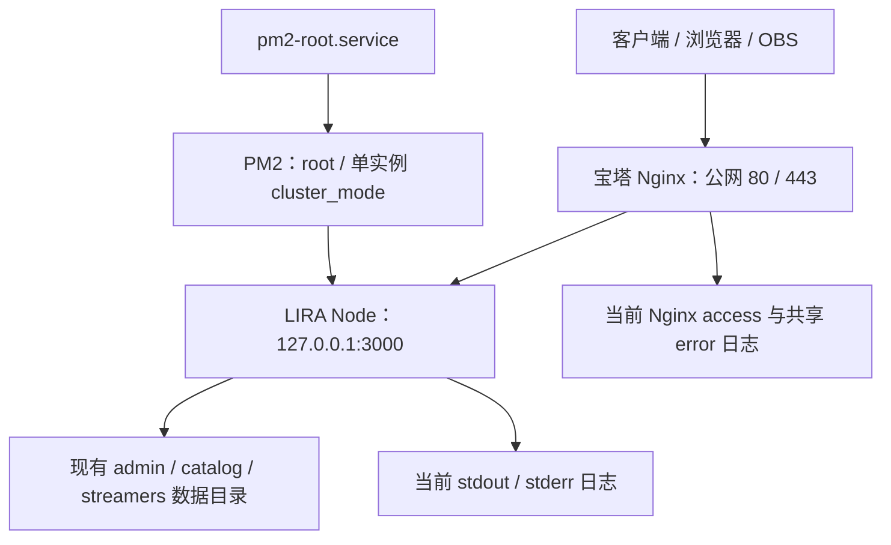

# LIRA 日志容量与有效信息专项复查报告

日期：2026-09-14。性质：现状复查、设计修订建议；**未修改运行代码或执行日志清理**。

依据 `D:/Work/Live`、`D:/Work/lira-server` 当前工作区代码、本地旧日志的匿名统计，以及临时目录中的合成实验；按用户要求，另于 2026-09-14 通过 SSH 只读核查了生产服务器的进程、部署配置、日志文件元数据和轮转入口。只输出允许的运行字段，没有导出凭据、生产日志正文或业务数据库。线上体积是单点快照，没有测量日增量或真实并发负载。文中的新容量、周期、阈值仍是建议，尚未部署。

> 后续实施状态：用户于同日要求按本报告开始调整；[阶段 A1 计划](../../specs/plans/archive/2026-09-14-log-volume-phase-a1.md)已完成并归档，先处理了源头高频输出、AI 摘要及现有客户端适配器的单条/队列/单文件保护。礼物管线窗口计数、统一分流轮转、跨重启日预算、故障上下文、两端页面、相邻服务器仓库和生产部署仍未完成；本注记不改变下文调查时点的证据。

## 1. 结论

日志应当采用：**正常运行少落盘，关键结果必留痕；重复事件计数，故障发生时补齐有限上下文；所有存储和缓冲都有上限。**

只设置“保留 7 天”还不够：一天内可能生成大量分片。只限制文件大小也不够：文件数量仍能增加。只在 ERROR 时记录也不够：可能失去错误发生前的操作过程，或漏掉被 catch 吞掉的实际失败。

本次需要收紧的五项设计：

1. 成功的高频事件主要保留数量、结果和耗时分布，不逐条写正常请求、礼物展示、歌词滚动。
2. 将“临时内存中的排错线索”与“磁盘日志”分开，只有新故障、慢操作或用户主动诊断时才保存有限上下文。
3. runtime 和 errors 按级别分流，一次错误只保存一份完整正文；界面合并时间线，不靠复制文件实现“只看错误”。
4. 同时限制单条字节数、正常每日写入量、文件数/总量/保留期、内存缓冲、问题样本、上传队列、导出包。
5. 保留首次失败、原因变化、关键操作结果、恢复和丢弃说明。无法保留全部细节时，明确显示不完整程度，不能把缺少日志显示为“运行正常”。

## 2. 复查证据

### 2.1 本地日志统计

统计只输出文件大小、时间范围和固定 scope 的数量，没有把日志中的用户、礼物、凭据或消息正文复制到报告。

| 文件 | 当前大小 | 非空行 | 统计说明 |
| --- | ---: | ---: | --- |
| `desktop.log` | 320,279 B，约 313 KiB | 1,441 | 可识别 58 个 runId；时间范围 2026-08-17 至 2026-09-08 |
| `terminal.log` | 1,652 B | 9 | 只保留 1 个可识别运行会话，7 行 log、2 行 debug |
| `ai.log` | 54 B | 1 | 当前只有会话头，不能据此推算实际 AI 日志量 |

`desktop.log` 中，`gift-display` 有 **594 行，占 41.22%**；lifecycle 为 678 行、window 为 104 行。礼物展示是成功路径也会触发的日志，证明正常事件已经占据明显篇幅；lifecycle 来自多次启动，不能据此推断持续空闲会高频写盘。

这些文件最后修改于 9 月 8 日，是开发工作区旧记录，不是 9 月 14 日的长时间直播或生产负载样本。terminal/AI 当前很小也不能证明增长受控：它们的初始化覆盖行为会隐藏之前的累积。

### 2.2 具体增长来源与调整建议

| 来源和证据 | 实际行为 | 建议 |
| --- | --- | --- |
| [礼物广播](../../src/server/runtime-transport.js)、A1 前的 `src/server/runtime-reporting.js`、[通知调用](../../public/js/admin/gifts/notification.js)、[展示 IPC](../../src/electron/ipc/update-ipc.js) | final 广播输出明细；展示通知再经 IPC 同时 console.log 和 writeLog，Electron 中可能形成广播 1 条、展示 2 条。明细还重复记录已有礼物数据 | 正常改为广播/符合展示条件/已发起展示/失败的窗口计数；有限内存只保留阶段摘要，不复制礼物正文。一次 final 不保证必然对应一次通知，统计要保留“未启用/不满足条件”等原因 |
| [全屏歌词](../../public/js/playback/ui/fullscreen.js)、[播放渲染](../../public/js/playback/core/renderer.js) | 歌词行变化时输出索引和正文，滚动时再输出位置；每次 renderPlayback 也有 console | 取消正常逐行/逐渲染输出；只保留播放状态转换、慢操作和实际失败。当前主要在 renderer console，**尚不能等同为磁盘增长**，以后统一捕获时不能全量接进文件 |
| [AI 请求链](../../src/ai/deepseek-client.js)、[AI logger](../../src/ai/request-logger.js) | 成功调用通常记录 request、response、normalized_response；response 同时含 rawText 和 payload，另有请求与标准化结果；使用多行漂亮 JSON | 成功主要按 provider/model/purpose 汇总调用数、耗时、token 用量；失败保留安全错误。移除请求/响应正文及重复表示，不依赖截断来保护隐私 |
| [桌面 logger](../../src/electron/desktop-logger.js)、[terminal 镜像](../../src/electron/terminal-log.js) | 同步逐条 append，未限制整条/文件/目录容量；terminal 包裹所有五种 console 方法 | 在输出前完成分级、准入和字节检查；有界异步写入，所有普通 console 经过同一策略 |
| [cloud sync](../../src/electron/cloud-sync-controller.js) | 定时、重连和状态通知的若干 catch 使用 `void error` | 保持正常无变化轮询安静；真正同步失败要在拥有上下文的边界记首次失败/重复次数/恢复。不能把“没有打印错误”当成“没有失败” |
| [服务器连接](../../../lira-server/src/modules/bilibili/room-monitor.js) | 正常心跳没有逐条打印；认证超时可能产生 timeout、通用 error、close、reconnect 等相关日志 | 保留正常安静行为；失败按连接尝试/故障时段关联，一份根错误及后续状态/重试摘要，避免按捕获点重复算故障 |
| [服务器维护](../../../lira-server/src/lib/maintenance.js)、[备份](../../../lira-server/src/lib/backup.js) | 清理任务默认 6 小时执行且只有实际删除时才写 INFO；备份启动后一次，随后每日一次成功结果 | **保留这些低频且有诊断意义的结果**，不为了少几行抹掉备份完成/失败和真实维护动作 |
| [礼物目录任务](../../../lira-server/src/modules/gifts/gift-sync-orchestrator.js)、[服务装配](../../../lira-server/src/modules/gifts/service.js) | 房间采样日志带新增/补全/冲突 ID 数组；正常定时每 12 小时；service 默认 logger 为 console，当前 runtime 未注入统一 logger | 降低单条载荷：保留任务编号、版本和数量；冲突具体对象只进有界诊断详情。优先改内容与接线，不能夸大它当前为每秒刷屏 |
| [HTTP app](../../../lira-server/src/app.js)、[Nginx 示例](../../../lira-server/nginx/lirahub.cn.conf.example) | app 主要记未处理错误，当前没有全量请求完成 logger；Nginx access 在 server 层记录请求 | 前稿新增全量应用 access 会引入额外正常增长，改为成功计数和例外明细；Nginx 另配筛选/轮转，不能只控制 Node 文件 |

### 2.3 合成实验：4,000 字符不等于事件有上限

用现有 `createAiRequestLogger` 写入一条合成 response：100 个字段，每个字段为 5,000 个重复中文字符。路径显式指向新建临时目录；实验后删除自身文件和空目录，没有使用真实 AI 内容或修改现有日志。

**单条事件新增 1,204,586 B，约 1.149 MiB。**

原因：现实现限制每个字符串至 4,000 字符，但没有限制字段数、数组项数、事件总字节数；UTF-8 中文字符也通常大于一个字节。这是边界验证，不是典型真实请求大小。正确上限必须作用于最终编码后的整条记录，并提前限制输入规模以避免序列化本身耗尽内存。

## 3. 正常运行的输出规则

### 3.1 三种处理方式

| 事件 | 磁盘处理 | 保留信息 |
| --- | --- | --- |
| 启动/正常退出、版本升级、迁移、备份、明确的关键状态转换 | 保留低频结果；启动多个正常阶段可合成一条 startup.completed | 版本、runId、结果、总耗时；异常/过慢阶段保留详情 |
| 正常心跳、无变化轮询、缓存命中、歌词滚动、音频进度、渲染调用 | 默认不逐条写文件 | 当前健康/最近成功时间可查；必要的短上下文只在有界内存中 |
| 正常礼物处理、成功请求、AI 成功调用 | 在固定窗口计数/统计；有业务活动才输出摘要 | 成功/失败/跳过数量、耗时范围或固定桶、实际观测时间范围 |
| 用户主动改变重要配置/连接恢复/后台任务失败后恢复 | 保留安全结果与关联编号 | 改动类别、结果、原因代码、影响范围；不含配置秘密或正文 |
| ERROR/FATAL、真实不变量破坏 | 首次及时保存，重复合并 | 错误码、应用栈、操作 ID、版本、首次/最近时间、次数与有限上下文 |

启动尚未完成时先保留小型 START；完成时一条结果记录必要阶段耗时。需要定位启动卡住的阶段时，保留有限关键阶段进入点，不能只等最后一条成功结果，也不逐个内部函数打印。

建议正常活动以 **15 分钟**为汇总窗口，所有计数为 0 或只有未变化的例行探测时不新增普通日志；正常运行不生成空文件。当前连接状态、最近成功时间、正在进行的操作由健康接口读取，不能通过每秒写“正常”维持存在感。

每个窗口只使用有限的 module/event/路由模板等分组键；不按用户名、完整 URL、requestId、任意错误文本创建分组。活跃分组上限建议客户端 128、服务器 256，超出归入明确标记的 other 计数；不能把日志文件的增长变成内存 Map 无限增长。

保留请求总量、失败量与延迟统计，才能在取消成功逐条日志后仍看出失败比例和性能变化。统计与日志分工参考 [Prometheus instrumentation](https://prometheus.io/docs/practices/instrumentation/)，只借鉴方法，不要求部署 Prometheus。

### 3.2 “精炼”保留哪些字段

普通结果保留：时间、level、event、module、runId、结果、必要关联 ID。重复运行环境可在会话起始记录，但导出单条错误时必须能附回版本/build/系统类型，不能产生无法解释的孤立记录。

摘要保留：`windowStart/windowEnd`、总次数、失败/成功/跳过次数、`durationMaxMs` 及固定延迟桶、最近成功时间。使用固定桶时可以展示粗粒度分布，不能用均值冒充 p95，不能把多个分组的 p95 直接平均。

错误保留：稳定 errorCode、安全 message、异常类型、应用栈顶部关键帧、有限 cause、operationId/requestId、首次/最近时间、实际失败操作数、恢复状态。用户数据和无上限对象不进入正文。

推荐一条汇总替代逐条正常输出，例如以下为虚构结构，实际 JSONL 仍为单行：

```json
{
  "event": "giftPipeline.summary",
  "level": "info",
  "windowSeconds": 900,
  "observedFinalCount": 1500,
  "displayEligibleCount": 1300,
  "displayRequestedCount": 1300,
  "displaySkippedCount": 200,
  "operationFailureCount": 0
}
```

各计数含义由原业务所有者定义；“已发起展示”不是“用户已看到”。通知关闭、重复导入、设备离线等可有合法差异，不能把数值不等自行判为数据丢失。财务/礼物结算等业务事实仍以既有权威存储和契约为准，日志汇总不能代替账本。

## 4. 少写日志仍保留排错能力

### 4.1 有界的报错前上下文

为关键流程保留精简的内存事件队列。借鉴 [Sentry breadcrumbs](https://docs.sentry.io/platforms/javascript/enriching-events/breadcrumbs/) 的故障前事件轨迹，LIRA 自行设置下面的容量与保存规则，不启用全量 console/点击/键盘采集。

| 限制 | 客户端 | 服务器 |
| --- | --- | --- |
| 精简事件数量/编码载荷 | 最多 512 条且最多 256 KiB | 全进程最多 4,096 条且最多 2 MiB；单租户最多 128 条 |
| 单条 breadcrumb | 最多 512 B，只选必要字段 | 同左 |
| 事件年龄 | 最多最近 60 秒 | 同左 |
| 首次故障附带 | 最多 64 条相关前序事件；整个上下文记录最多 64 KiB | 同左，严格筛选相同租户/操作或安全的平台公共状态 |
| 故障后的补充 | 进程仍健康时最多观察后续 10 秒，再补一次有限结果 | 同左 |

数量、字节、时间三个限制先到者生效；高峰时实际覆盖可能少于 60 秒，记录 `contextFrom/contextTo/evictedCount`。错误核心立即写盘，不能为了等待后续 10 秒而推迟第一份证据。

内存中也只收集允许的摘要，不先存 Cookie、歌词、聊天、礼物正文再等报错脱敏。服务器导出 A 租户故障上下文时不能附带 B 租户的缓冲。队列和 Map 的编码载荷上限不等同于 V8 实际堆占用，实施时还需观察对象/索引开销。

更早的关键状态变化由低频运行记录保留；复杂故障可临时开启模块 DEBUG，默认 15 分钟或本次 8 MiB 写入预算先到即结束。全局磁盘配额仍有效，DEBUG 到期不自动续期。

### 4.2 重复错误合并，同时保留变化

- 以稳定模块/错误码/应用栈特征、已认证租户/设备和故障时段聚合，第一次失败立即写核心错误和上下文。operationId/requestId 用于关联捕获点，不将每次请求都建成新问题组。
- 持续相同失败只更新计数；建议最多每 60 秒写一次增量摘要，恢复时写一次最终次数/持续时间/恢复结果。没有新发生则不输出空摘要。
- 原因、异常类型、阶段或影响范围发生实质变化，保留新代表事件；不同业务操作的失败可以聚合次数，但不同根因不能被一个通用“网络错误”抹平。
- 同一异常在 timeout/error/close 等捕获点流转时，通过连接尝试/operationId 关联；不能把三个捕获点当作三次失败操作。统计名称区分“失败操作数”和“观测事件数”。
- 错误指纹表本身有上限与过期机制，建议客户端 256、服务器 2,048 个活跃项；达到上限保留严重事件容量，并显示未细分事件计数，不能创建无限问题组或假称所有不同根因均已保留。
- 首次故障、数据完整性错误和 FATAL 不走普通随机抽样；在有限存储下仍是优先保存而非永不丢失的承诺。错误风暴耗尽专用预算时保留最近代表样本和溢出标记。

重复事件的序列化/堆栈生成也要在准入判断后执行；否则虽然文件变小，CPU 仍可能被大量重复错误拖垮。

### 4.3 正常成功但业务不对的情况

不能只依赖 HTTP 5xx。保留现有领域不变量检查、阶段结果、数量守恒条件与近期操作摘要；收到 200 但解码/校验失败、保存未生效等，由拥有事实的模块报告业务失败。

如果用户反馈的问题发生时程序没有识别为异常，超过内存窗口的成功操作细节可能已不可恢复。这时使用低频状态记录、现有业务记录和主动诊断复现，不能声称压缩后的日志仍能恢复任意历史细节。断电、OOM、被强杀也可能丢掉未落盘上下文；关键状态的小型落盘记录是补充，不承诺完全无损。

## 5. 容量控制：同时限制产生量和保留量

### 5.1 单条与每日准入

| 项目 | 建议限制 | 超限行为 |
| --- | --- | --- |
| 正常结果、请求样本、窗口摘要 | 单条最终 UTF-8 编码最多 2 KiB | 优先保留固定字段与计数；截短可选描述并标记 |
| 错误核心 | 单条最多 16 KiB | 保留错误码、版本、关联 ID、关键栈；cause 深度和数组项数单独限制 |
| 故障上下文文件 | 单份最多 64 KiB | 只取相关前序/代表事件；通过 contextId 关联，不把整个文件塞回日志行 |
| 正常诊断写入日预算 | 客户端 1 MiB/日；服务器应用 5 MiB/日，起始值 | 摘要也计入预算；临近上限先停低优先级样本、合并摘要，额度不足后停止这类落盘并通过健康状态显示计数。关键错误、恢复、审计不共用这笔预算 |
| 日预算恢复 | 重启后恢复有界持久化的当日已用/预留额度，计数状态固定大小且计入预算 | 清理旧分片不退回当日额度，不能仅对仍留存文件求和或每次重启重新领额度；时钟异常不绕过总量上限 |

日预算不代表必须写到该数值。无操作、无变化、无异常的客户端，建议验收目标为 **24 小时新增普通日志不超过 64 KiB**；仅保留必要启停/例行低频结果。正常直播也应主要随窗口数/状态变化增长，而不是随礼物、歌词行、心跳条数等比例增长。

### 5.2 文件与目录预算

沿用前稿的客户端 200 MiB、服务器应用与 PM2 合计 2 GiB 作为总保护边界；再增加各流的较小预算。剩余空间用于应急和兼容旧文件，不是可任意写满的目标。

| 托管内容 | 客户端上限/最长保留期 | 服务器上限/最长保留期 |
| --- | --- | --- |
| runtime 正常结果/聚合 WARN | 8 MiB / 7 天 | 64 MiB / 14 天 |
| errors 核心错误/重复摘要 | 32 MiB / 14 天 | 256 MiB / 30 天 |
| contexts 故障上下文 | 32 MiB / 14 天 | 128 MiB / 14 天 |
| access 例外样本 | 并入本地业务诊断，不另记全部本地请求 | 64 MiB / 7 天 |
| debug | 16 MiB / 24 小时；单次开启另受 8 MiB 限制 | 64 MiB / 24 小时；单次开启同样有限额 |
| exports 临时包 | 20 MiB / 24 小时；最多 2 个 10 MiB 包 | 管理端导出建议流式；确需落盘时另设 20 MiB 临时预算 |
| 待发摘要 | 5 MiB / 7 天、最多 200 条 | 不建立无上限重试/转发队列 |
| PM2 stdout/stderr 与守护进程日志 | 不适用 | 合计 128 MiB / 7 天，部署负责；包含 `pm2.log` |

单文件仍按客户端 10 MiB、服务器 20 MiB 为上限；若所属流预算更小，则采用更小值。日期变化、大小达到上限时轮转；日志分片与上下文文件合计建议客户端最多 256、服务器应用最多 512，包含活动文件。待发/导出文件另受各自数量限制，避免小文件或反复重启耗尽目录/句柄。

**字节、文件数和保留期先到者生效。** 写入前计算待写记录长度，单写者预留空间并删除允许清理的最旧关闭分片；没有可回收空间时停止低优先级写入并记录有限的降级计数。不能先写爆、再等午夜清理，也不能为每个 runId 建一个永不清理的独立目录。

所有 `.tmp`、压缩中间文件和导出副本也计入预算。第一版不要求在热写入路径压缩；启用压缩时先预留源/目标暂时共存的空间。清理不得跟随符号链接、删除活动文件或超出该所有者的目录。

legacy 文件停止被旧 logger 追加并计入已知占用，但保留只读；未知文件展示为未托管占用，不擅自删除。已有文件本就超过预算时必须显示“存量已超限”并限制新增普通日志，不能宣称目录已经自动降至上限。关闭应用后不会运行清理线程，保留期在下次启动/运行中周期检查时执行；此时没有新增写入也不会继续增长。

### 5.3 不能遗漏的其他增长点

| 位置 | 控制要求 |
| --- | --- |
| 内存写队列 | 沿用最多 2,000 条/4 MiB 编码载荷，独立于前序事件缓冲；优先丢弃低优先级和重复详情，错误留预留容量；不能只把同步写改成无界 Promise 链 |
| `diagnostics.db` | 256 MiB 预算包含 WAL/SHM；样本 30 天、汇总 90 天；加行数/每问题样本上限，例如每组最多 20 份，不能一条错误复制成一行永久详情 |
| 问题处理状态 | 低频存储与审计独立管理；历史已解决状态需要明确归档策略；不能因“不是日志文件”就永久无限增长，也不能静默删除仍待处理状态 |
| 客户端上报文件 | 7 天、全局 500 MiB，另设每租户限额与报告数限制；重复上报返回同一编号；无容量时明确拒绝/重试，不能已丢弃却返回接收成功 |
| Nginx | 独立设总量/分片数/期限，例如 128 MiB、7 天起步；低优先级成功请求可条件记录；发生在代理层的 502/504/TLS 等故障仍需可查 |
| 原生 dump | 与业务日志分开；未来启用时需限制完整 dump 数量和总量，例如最多 5 份/100 MiB；遵守 Crashpad 所有权，不能删除整个 browser profile |
| 审计与归档 | 不采样删除关键审计；需要单独定义热保留和归档期限/容量。可评审的起始方案为热查询 180 天、归档最长 365 天并限额；这是工程建议，非法律要求，也不自动覆盖当前规范 |

审计若要求保留期内一条不丢，达到容量上限时应优先完成经校验的归档/扩容；无法可靠记录时，按现有事务语义拒绝需要审计保障的管理更改，不能让普通日志清理器删除未到期审计。无限历史、所有细节都保留、磁盘固定不变这三个条件不能同时成立。审计具体限额需与现有身份库、备份/恢复规范一起设计，不能直接给整个 admin.db 设置会损害账号数据的截断规则。

PM2/Nginx 的周期轮转属于部署控制：轮转检查间隔内，活动文件仍可能暂时超过目标大小；应用的“写入前字节准入”不能约束独立进程。若要求物理磁盘绝不越界，还需要服务账号/卷级配额及足够的错误保留空间。报告中的应用逻辑容量不能被误称为对全部服务器文件的硬保证。

日志根达到 80% 只在状态跨越阈值时提醒；90% 优先停 DEBUG/可选样本；需要清理或达到拒写状态时保留一次降级记录，恢复时再记一次。不得每写一条日志就再写一条“空间不足”。

## 6. 服务器请求与管理员页面的精简策略

客户端继续把日志放在当前解析的 `<安装目录>/logs/`，开发工作区为 `D:/Work/Live/logs/`。在截图的“本地数据”卡片保留“日志目录”，增加“查看日志”和“导出诊断包”；默认看本次运行的警告/错误，显示实际保留时间、占用和采集状态，详情再展开技术内容。导出前给出范围和大小，不自动上传完整日志。

服务器应用建议通过 `LIRA_LOG_DIR` 指定日志根，部署可采用 `/var/log/lira-server/`；runtime/errors/contexts/access/debug 分目录，诊断数据库与租户报告放在受保护的状态目录。Admin 在审计入口附近新增“问题与日志”，分为问题列表、服务器日志、客户端报告，支持“待处理 → 处理中 → 已解决 / 暂时忽略”及复发标记。第一版跨租户查询沿用 `super_admin` 权限，审计入口继续独立；这些均是拟议调整，尚未部署。

服务器默认在请求结束时更新全量轻量计数，正常成功请求不逐条永久落盘。可按路由模板、方法、状态类别汇总次数与固定延迟桶；route 分组受容量控制，不能记录完整 query、动态路径参数或原始 payload。

5xx、业务失败、超时、慢操作保存代表性明细并按第 4 节控制风暴。普通交互接口可从 2 秒慢阈值开始测量调整；AI 长任务、媒体下载、SSE 不能套同一阈值。SSE 正常生命周期/续期也不能被当成连接异常，心跳不逐条落盘。

预期的 400/401/403/404/429 仍统计；异常模式、原因变化和必要安全事件保留有限样本，不能让扫描器制造无限“错误正文”。真正的管理修改、凭据变更、审计事件按原安全契约保留，不因为 HTTP 成功而省略。

Nginx 官方支持 `access_log ... if=...` 条件记录及缓冲写入，但**缓冲/压缩并不减少事件数量，也不等于总量上限**。应用完成的正常请求可以减少代理侧明细，代理自身错误保留；筛选仍保持现有不含 query 的隐私约束。[Nginx 日志模块](https://nginx.org/en/docs/http/ngx_http_log_module.html)

Admin 需要显示“最近正常摘要、首次/最近失败、实际失败次数、保留样本数、被合并/丢弃数量、实际覆盖时间、最后采集时间”。不能把 10 个样本显示为只发生 10 次，也不能从有采样的 access 文件推算精确失败率。

自动刷新日志列表/健康状态不是新的故障，也不应每次写一条“管理员查看日志”审计；敏感报告查看、人工导出和问题状态修改按明确的审计动作处理。页面实时滚动也设保留行数/暂停刷新，避免服务器磁盘有界而浏览器 DOM 无限增长。

### 6.1 线上核实的部署架构与现有目录

核查日期：**2026-09-14，北京时间**；以下为当时进程、配置与文件元数据的快照，不代表已实施新日志系统。部署 Git HEAD 为 `fac7bee9af81`；本轮也直接读取了线上 logger 与路径配置的相关源码，未仅凭提交号推断行为。



| 已核实项目 | 线上事实 | 对日志配置的影响 |
| --- | --- | --- |
| 主机 | Ubuntu 24.04.4 LTS；`/`、`/www`、`/var/log` 均落在同一 `/dev/vda3`，约 40 GiB，总使用 23%，可用约 29 GiB | 改目录不会增加磁盘容量；要同时观察整盘水位与各类配额 |
| 应用 | `/www/wwwroot/lira-server`；Node 24.20.0；root 运行 | README 的 `/opt/lira-server` 是示例，不能直接用于本机部署 |
| 进程管理 | PM2 7.0.4；`PM2_HOME=/root/.pm2`；`cluster_mode`、`instances=1`；退出等待 6,000 ms，内存重启阈值 450 MiB | 保留当前生命周期和单实例模型；新日志写入仍由唯一应用所有者负责 |
| 应用日志 | `/root/.pm2/logs/lira-server-out-0.log`，20,693 B；`lira-server-error-0.log`，0 B；`/root/.pm2/pm2.log`，5,100 B | 当前 logger 只写 console；守护进程日志也要纳入容量责任，不能只管 out/error |
| 新应用日志目录 | 项目 `logs/` 与 `/var/log/lira-server/` 当前均不存在；线上配置尚未读取 `LIRA_LOG_DIR` | 不能只在 `.env` 加一行就声称新目录已经生效 |
| Nginx | 实际二进制 `/www/server/nginx/sbin/nginx`，版本 1.30.4；主配置 `/www/server/nginx/conf/nginx.conf` | 检查和后续重载必须针对这一套宝塔 Nginx |
| LIRA 站点配置 | `/www/server/panel/vhost/nginx/lirahub.cn.conf`；普通 HTTP 与三类 SSE 均反代到 `127.0.0.1:3000` | 需同步实际站点文件及仓库示例；只改示例不会改变线上 |
| 当前代理访问日志 | `/var/log/nginx/lirahub.cn.access.log`，5,615,559 B，约 5.36 MiB；使用 `lira_path_only`，记录 `$uri` 而非 query | 路径已核实；减少成功明细时继续保留现有 query 隐私边界 |
| 当前代理错误日志 | LIRA 未单独配置 error 文件，继承 `/www/wwwlogs/nginx_error.log crit`；拟议的 `lirahub.cn.error.log` 不存在 | 普通 `error`/`warn` 严重程度的消息不在该门槛内，访问状态码也不能替代完整错误原因 |
| 轮转入口 | `logrotate.timer` 活跃；PM2 模块配置为空，无 `pm2-logrotate`；已检查的 logrotate/cron 配置没有匹配 LIRA 的规则 | 定时器存在不等于本项目已轮转；需要明确增加匹配路径与执行周期 |

日志大小来自分次只读取样，不能拿 out/error 的大小推导故障率。已检查 `/etc/logrotate.conf`、`/etc/logrotate.d`、`/etc/cron.d`、daily/hourly cron 和 root crontab 引用的任务；没有穷举宝塔所有插件内部的维护行为，因此结论是“已检查入口未发现对应策略”，不宣称全机绝无其他清理程序。

Nginx master/worker 当前打开的文件也证实上述 access 与共享 error 路径。`/www/wwwlogs/` 内还留有旧的 api/admin 命名日志，本轮未在 LIRA 加载配置或相关进程的日志文件描述符中发现它们作为当前输出；保留为待核实历史文件，不按文件名猜测当前入口或直接删除。

### 6.2 针对本机的目录与配置方案

第一版新增应用日志根，PM2 继续使用已核实的路径并单独轮转。业务目录、PM2 用户和进程模式沿用当前部署；未来改用专用非 root 服务账号时，再统一迁移目录所有权与 PM2_HOME。

| 数据 | 本机建议路径 | 所有者与权限 |
| --- | --- | --- |
| runtime / errors / contexts / access / debug | `/var/log/lira-server/` 下按前文分目录 | LIRA logger 管理；按当前账号为 root:root，目录 0750，应用创建的文件 0640 |
| 诊断摘要与样本库 | `/www/wwwroot/lira-server/admin/diagnostics/diagnostics.db` | 默认派生自 `path.dirname(adminDbPath)`，在日志清理根之外；包含 WAL/SHM 的独立容量预算 |
| 管理审计与问题处理状态 | `/www/wwwroot/lira-server/admin/admin.db` | 沿用既有事务和备份边界，普通日志清理器无权清理 |
| 已接收客户端报告 | `/www/wwwroot/lira-server/streamers/<data_dir>/diagnostics/reports/<reportId>.json` | 通过已认证 streamer 的 `storage.getPaths(streamerId).base` 解析实际目录，再使用专用子目录 |
| PM2 应用输出 | `/root/.pm2/logs/lira-server-out-0.log`、`lira-server-error-0.log` | PM2 写，部署轮转；不再镜像应用的全部 JSONL 正文 |
| PM2 自身事件 | `/root/.pm2/pm2.log` | 同属 PM2 预算；诊断系统不读取 PM2 的私密环境/进程转储文件 |
| Nginx 代理访问 | `/var/log/nginx/lirahub.cn.access.log` | Nginx 写，部署轮转；现有 path-only 格式继续生效 |
| Nginx 专用错误 | `/var/log/nginx/lirahub.cn.error.log` 为候选目录 | 只有错误内容脱敏方案通过验证后才启用，见下一节；共享主机日志仍由宝塔运维负责 |

`<data_dir>` 是数据库已登记的实际目录映射，可以是现行 ID-名称目录，也可以是兼容的旧目录。不能按传入用户名或裸 streamerId 拼路径，更不能为日志改名/搬迁租户目录。[既有目录边界](../../../lira-server/docs/architecture/data-boundaries.md)、[路径所有者](../../../lira-server/src/storage/streamer-storage.js)

实际配置文件是 `/www/wwwroot/lira-server/.env`。**待新 logger 与 `src/config.js` 支持之后**，增加以下配置；本轮没有在线写入：

```dotenv
LIRA_LOG_DIR=/var/log/lira-server
```

新版本应校验绝对路径、目录可写性和专属文件范围；在拟新增的 Admin 采集健康信息中显示解析后的真实路径、容量、轮转状态及降级原因。目录创建的部署示例为：

```sh
# 仅供未来部署使用，本轮未执行。
install -d -o root -g root -m 0750 /var/log/lira-server
```

logger 自行创建受控子目录和文件，并显式设置权限。不要为方便查看设置 777；Admin 通过已授权的 API 读取安全投影，无需让 Nginx 的 www 用户访问应用日志/数据库，也不增加这些目录的静态 alias。

当前备份实现显式保存 admin.db、租户库、目录库及指定业务资源，不会因新增目录而自动备份 diagnostics.db 或 reports。短期报告按自己的到期政策处理；若要求保留无法从短期原始日志完整重建的 90 天统计，需要显式纳入有界快照方案。问题处理状态仍随 admin.db 备份。[现有备份规则](../../../lira-server/docs/operations/sqlite-backup-and-restore.md)

### 6.3 Nginx 错误覆盖与轮转责任

此次确认的 `crit` 门槛会过滤较低严重程度的错误消息。后续应补齐 LIRA 专用的代理错误证据；仅改变文件路径不能改善覆盖。[Nginx error_log 级别](https://nginx.org/en/docs/ngx_core_module.html#error_log)

但不能直接把全局级别改为 `warn` 就结束：Nginx 原生错误上下文可能附带原始 request line、upstream URI 和 referrer，**不受 access 的 `lira_path_only` 格式保护**。因此，专用原生 error 文件及降低级别须先在隔离环境用合成敏感 query/referrer 验证，解决落盘前的秘密保护；不能只在 Admin 展示时再遮盖。原生日志也不直接进入客户端诊断包。[Nginx 错误上下文实现](https://github.com/nginx/nginx/blob/master/src/http/ngx_http_request.c)

第一阶段可先通过 path-only 的代理失败访问摘要保留状态码、请求耗时、upstream 状态/耗时与安全关联编号，结合 PM2 进程状态和应用 ERROR 定位代理故障；仅在隔离验收通过后增强原生错误细节。现有 `crit` 文件也不能被假定为天然无秘密，接入 Admin 前仍须安全投影。

| 文件归属 | 轮转方案与边界 |
| --- | --- |
| LIRA 应用 JSONL / contexts | 应用内按实际字节准入和分片清理；不交给 logrotate 或宝塔再次切同一份文件 |
| PM2 的两份应用输出及 pm2.log | 优先复用已安装的系统 logrotate，明确登记实际文件；改名轮转后使用 PM2 的 `reloadLogs` 重开文件，需先验证当前版本的文件描述符切换；不执行清空日志命令 |
| LIRA Nginx access 与将来的受控 error | 部署侧独立规则；轮转后对正确的 Nginx master 执行日志重开，PID 文件为 `/www/server/nginx/logs/nginx.pid`；不依赖常见发行版的另一条 pid 路径 |
| 宝塔共享 error / TCP / 其他站点日志 | 保持主机运维所有权，单独控制容量；LIRA 自有配额不代表这些主机文件已经受控 |

PM2 支持重开日志，Nginx 支持通过 USR1 重开轮转后的文件；这些属于后续轮转动作，**本轮未执行重开、重载或重启**。[PM2 官方仓库](https://github.com/Unitech/pm2#log-management)、[Nginx 日志轮转](https://nginx.org/en/docs/control.html#logs)

部署设计应给 LIRA 的 PM2/Nginx 文件设置独立的定期检查，例如每 15 分钟，并沿用前文合计预算、分片数和保留期。若采用专用 cron，可将规则放在 `/etc/logrotate-lira.conf`、状态放在 `/var/lib/logrotate/lira.status`，避免又被系统通用规则或宝塔任务重复管理；这些文件当前尚未创建。周期检查的 `maxsize` 仍可能被间隔内突发写入超过，`maxage` 也不能替代对空闲旧分片的到期核查；严格物理边界仍需磁盘配额。第一版不必同时安装 pm2-logrotate。

### 6.4 后续实施与验收顺序

1. 先实现并隔离验证 `LIRA_LOG_DIR`、脱敏、源头聚合、准入/轮转和目录健康信息；确认仅改环境变量的旧版本不会被误认为已启用。
2. 依据本机运行账号准备目录，在既有发布维护流程中部署新代码并配置 `.env`；保留当前 PM2 单实例、退出等待和业务数据路径。环境变更随受控应用重启生效。
3. 针对实际宝塔站点文件准备代理日志配置，先完成隐私验证，再用 `/www/server/nginx/sbin/nginx -t -c /www/server/nginx/conf/nginx.conf` 校验；配置加载与日志文件重开是不同动作，按维护流程分别处理。
4. 配置唯一轮转责任，验证连续写入跨分片、原文件描述符正确关闭、压缩暂存也计入容量；验证空闲情况下旧归档到期。测试使用合成事件与临时目录，不用生产故障注入证明功能。
5. 在新增 Admin 页面核对真实目录、来源、实际覆盖时间、队列/空间降级及错误编号关联；Node 不可用时由 PM2/Nginx 运维证据排查，不能依赖已经打不开的同机 Admin。

本轮已完成线上只读架构核查和 Nginx 当前配置校验；没有安装轮转模块、创建日志目录、改配置、运行备份、重载/重启进程或清理旧文件。上述是基于已核实部署的实施方案。

## 7. 量级算例

下面是明确假设下的算术估计，**不是线上实测或已经实现后的性能数据**。只比较指定类别，不包括错误、关键操作审计、业务数据库、其他模块或协议开销。

| 假设场景 | 逐条模式 | 建议的正常摘要 |
| --- | --- | --- |
| 8 小时，100 个 final/分钟；均经过广播和一次展示；每个 final 的三条输出平均各 1 KiB | 48,000 个 final，约 **140.6 MiB** | 每 15 分钟一条 512 B 管线摘要，共 32 条、约 **16 KiB** |
| 服务器 24 小时，50 个成功请求/秒；逐条 access 平均 300 B | 4,320,000 条，约 **1.207 GiB** | 20 个活跃路由每 15 分钟各一条 512 B 摘要，约 **960 KiB** |

实际摘要大小、路由数、租户数和关键动作频率决定真实体积；过多分组仍会撞到正常写入预算，因此“按租户/接口汇总”本身也不能无上限。对故障第一次的保留和错误专用预算，不用正常日预算来挤占。

## 8. 对前一版设计的修订

本报告补充并收紧 [两端日志设计草案](../../specs/client-server-logging-design.md)，同步修订 [Proposed ADR-0018](../architecture/adr/0018-unified-logging-and-diagnostics.md)：

- 成功请求从默认全量 access 改为窗口统计、有限内存线索和必要例外明细。
- ERROR/FATAL 只写 errors，普通 INFO/WARN 写 runtime；查看器合并流。access 需要状态/耗时摘要时可以引用同一 requestId，但不复制错误栈/正文，问题只按核心错误计数。
- 增加 `contexts/`，按 contextId 保存一次故障的有限上下文，普通事件仍受 2/16 KiB 上限控制。
- 200 MiB/2 GiB 之外增加正常日预算与更小的各流配额；索引、上传、导出、旧日志和部署侧文件都明确责任。
- 增加“不活跃不输出空摘要、记录实际覆盖范围、被合并与丢失情况、监控自身不刷屏”的验收。

建议先实施源头精简和容量保护，再开放两端查看器及上报。renderer 异常接入前先清理/分级高频 console，不能先把大量歌词/渲染日志接入磁盘再补救。

改动范围涉及 [AI 日志](../../src/ai/request-logger.js)、[桌面日志](../../src/electron/desktop-logger.js)、[终端镜像](../../src/electron/terminal-log.js)、礼物/播放器具体输出点、服务器统一 logger、代理部署配置及诊断存储。正式实施仍需遵循双方的规范/计划/验收规则，保留其他任务改动。

## 9. 验收与本轮验证范围

实施后至少验证：

1. 临时 profile 连续空闲 24 小时；无人工操作、无失败、无实际变更时，普通日志新增不超过 64 KiB，没有周期性“正常”刷屏和空分片。
2. 临时数据模拟 8 小时正常播放/高频礼物/心跳：歌词行数、礼物数增加不导致逐条文件增长，关键阶段计数和主动操作结果可核对。
3. 合成 100 个超长中文字段、深对象、大数组：编码后的核心事件仍受上限保护，固定关键字段未被截掉，无敏感正文、无无限序列化开销。
4. 同一故障一分钟触发 100,000 次：首次核心错误及时入盘；其余以增量计数汇总，无 100,000 份堆栈/上下文；原因变化能留下新样本，内存表数量和载荷受限。
5. 报错前最近的相关状态/操作可恢复，实际覆盖范围可见；双租户并发故障没有互带上下文，客户端更换账号不上传旧租户资料。
6. 极小配额下验证跨日、重启、时钟变化、持续写入和分片轮转；所有自有活动/临时文件算在预算中，受保护错误容量不被 INFO 用完。
7. 磁盘拒写、日志目录只读、清理失败、SQLite WAL 增长：业务不被普通日志阻塞，页面显示采集降级；需要事务审计的管理操作仍按原规范失败回滚。
8. 自动刷新 Admin 1 小时不产生新的问题风暴/审计刷屏；页面行数有界，采样样本数与实际失败计数明确区分。
9. 部署检查同时覆盖 PM2 和宝塔 Nginx：核对真实路径、写入与轮转所有者、文件保留数、周期和配额；日志重开后写入新分片；代理错误输出也通过 query/referrer 的秘密保护验证。第 6 节已核实当前目录与覆盖缺口，新增轮转和错误采集仍待实施。

已完成源代码调用链复查、本地旧日志匿名计数、现有 AI logger 的临时合成实验、容量算例核算，以及本次线上运行账号/PM2/Nginx/日志目录与轮转入口的只读核查。Nginx 当前 `-T` 配置检查成功，实际打开的日志文件与目录结论相符。文档治理、本地链接、JSON 示例、代码围栏与格式检查用于文档交付；没有进行生产压力测试或注入真实故障，新增功能的验收尚待实现后执行。当前运行代码的日志增长与覆盖问题仍然存在。

参考资料仅用于方法核对：除前文 Prometheus、Sentry、Nginx 外，[systemd journald](https://www.freedesktop.org/software/systemd/man/252/journald.conf.html) 展示了按服务限制突发量并报告抑制数量的思路。它不是当前 PM2 文件的自动限流器，也不需要为 LIRA 引入新的日志服务。
