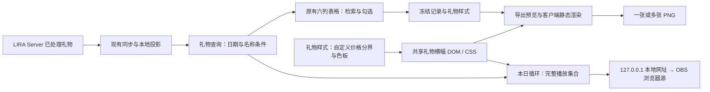

# 本日礼物循环展示与图片导出：调研及设计建议

初稿：2026-09-15；本次修订：2026-09-18。

本文保留实施前的调研与设计建议。2026-09-18 已按用户指令完成代码实施及隔离验证，结果和实际验证限制见[实施记录](../../specs/plans/archive/2026-09-18-live-gift-display-export.md)。下文“尚未实现/测试”描述调研阶段，不代表当前代码状态。本次调研核对 LIRA v4.2.3、Electron 43.2.0 的代码，以及下文列出的产品文档、公开源码、作者发布包和 B 站公开前端资源。

本次需求以用户的描述、补充说明和 B 站礼物条截图为准。旧报告中的路线选择和“不可修改”条款是待检验的旧建议，不是本次需求，也不自动构成实现约束。

## 0. 建议与已确认需求

**保留“最近礼物 → 全部礼物”现有的“全部礼物流水”表格、六个数据列及分页。只在管理界面增加复选框、日期范围、用户／礼物检索和“导出所选”。选定流水后，再进入礼物横幅的图片预览，选择合成一张或每条一张 PNG。直播展示使用独立的 OBS 浏览器源，与导出共用礼物横幅组件。**

容器建议改为**铺满 LIRA 窗口内容区的面板**，保留软件标题栏及窗口控制；关闭后回到原页面。礼物横幅按用户最新截图采用固定的紧凑比例，窗口大小只影响管理空间和预览缩放，不影响成品 PNG 的排版与尺寸。具体见 §1.3、§4.3。

本次以用户指定的[叮子礼物图片生成](https://play-live.bilibili.com/details/1768748454643)作为主要产品参考，聚焦 B 站收礼记录、礼物条出图和本日礼物展示。金额区间采用可自定义方案；官方金额阈值的研究不再作为开发前置条件。

用户已明确的行为：

- 展示：通过本地 `127.0.0.1` 地址提供独立页面，添加到 OBS 浏览器源；**循环滚动本地已收到、已同步的今天礼物**。播放完一轮后继续播放，不能退化成“新礼物出现一次就消失”。
- 管理列表沿用用户最新截图里的**时间、礼物、数量、金额、用户、备注**六列，在最左侧增加勾选列，上方增加日期和检索条件。管理表格不改成彩色礼物横幅列表。
- 导出预览、PNG 和 OBS 中的词条内容固定为：**送礼人头像、名字、有大航海身份时的身份框、“投喂＋礼物名”、礼物 WebP 图片、数量，以及随价格档位变化的背景条；不显示价格数字**。“投喂”前缀按用户最新成品参考图补回。三者使用同一种词条。管理表格继续显示原有金额和时间，方便核对记录。
- 背景分档依据已确认：**本条礼物总价值 = 礼物单价 × 本条数量**。一张 PNG 拼入多条记录时，每条仍按自己的价值分色，不按整张图片的合计金额变色。
- 用户允许自定义礼物价格区间。本报告建议保留蓝、紫蓝、粉红、橙金四组渐变，提供三个可编辑的分界金额；初始数值及边界规则见 §1.5，属于 LIRA 设计建议。
- 导出：选择具体的礼物记录。例如选一条“3000”的记录，只导出这一条；选两条，则选择“合成一张 PNG”或“分别导出两张 PNG”。
- 两条相同礼物、相同金额的记录仍是两个可独立选择的对象。**不按礼物名、金额或观众名自动合并。**
- 客户端优先，尤其是保存图片和批量保存的操作体验。
- 本轮交付为修改后的研究报告和内联交互预览；实际开发需据此形成相应实施计划。

本报告采用的默认建议：

| 项目 | 建议 |
| --- | --- |
| “今天” | 北京时间 `Asia/Shanghai` 的自然日，不是最近 24 小时 |
| 礼物范围 | 当前流水中已确认的有效付费礼物记录；沿用现有金额和盲盒口径 |
| 管理入口 | 保留“全部礼物”入口、“全部礼物流水”标题及六列表格；默认沿用全部记录，新增日期范围、用户／礼物检索和“今天”快捷操作 |
| 面板尺寸 | 打开后铺满软件窗口的内容区，标题栏和窗口按钮保留；首版使用这一种布局，不增加大小模式切换 |
| 图片格式 | PNG，支持透明背景；首版不增加格式选择负担 |
| 输出形态 | 单条一张、多条拼一张、多条分别保存 |
| 视觉模板 | 导出预览、PNG、OBS 共用固定比例的礼物横幅，建议基准 400 × 96 CSS px；有大航海则显示身份框，背景按本条单价 × 数量分档。管理表格保持现有样式 |
| 价格区间 | 客户端“礼物样式”中自定义三个分界；建议初值为 100 / 500 / 1000 元，自动形成四个连续区间，不标为官方金额规则 |
| 导出实现 | **优先验证共享 DOM/CSS + Electron `capturePage` + 原生保存对话框**；保留 DOM 光栅化库作为备选 |
| 展示资料 | 真实头像及送礼时的大航海身份需要补充数据契约；头像缺失用占位图，身份未知不伪造身份框 |

日期范围和用户／礼物检索已由用户明确要求，属于本次管理界面范围；当前代码尚未完整支持这些查询条件。“有效付费礼物”是沿用现有流水口径的建议。

## 1. 参考图是什么，能否还原

### 1.1 图片中的结构

用户截图的主体是**礼物气泡条**，不是排行榜，也不是 SC 卡片：

1. 左侧圆形头像及浅蓝色外圈。
2. 中间两行：昵称；“投喂 + 礼物名”，礼物名用黄色突出。
3. 右侧礼物图片，独立于文本区域。
4. 最右侧醒目的 `×数量`，黄色填充、深色边缘、略带倾斜。
5. 底板左端圆弧、右端斜切，整体是浅蓝色带透明感的横条。

以上是截图观察，不代表所有礼物都固定蓝底。用户随后明确要求大航海身份框、WebP 礼物图及按价格变色的背景条，以该补充为准。**礼物条只包含 §0 确认的内容**，不额外加入金额、时间、盲盒盈亏或粉丝灯牌。客户端管理表格保留原有六列核对信息；表格中的时间、金额和备注不进入 PNG 和 OBS。截图中的昵称已经打码，不能据此承诺恢复原始昵称。

### 1.2 本次对 B 站官方前端的核实

本次访问了 [52032 直播间](https://live.bilibili.com/52032)。浏览器自动化取得了页面标题，但读取实时界面超时，**没有实际观察到本次送礼动画，也没有解决用户的 F12 故障**。

随后通过公开页面 HTML 找到了其动态加载模块，读取了官方静态 JS/CSS，而不是凭截图猜 DOM：

- 入口注册了 `super-gift-bubble`，挂载点为 `#chat-gift-bubble-vm`。
- 礼物条结构包含 `.super-gift-item`、`.user-avatar-box`、`.gift-info`、`.gift-pic-count`。
- 底板 `.base-bubble-wrapper` 的源码基准是 218 × 44 CSS px，头像基准为 40 × 40 CSS px。
- 浏览器底板使用 `clip-path: polygon(0 0,100% 0,89% 100%,0 100%)` 实现斜切右端。
- 礼物名颜色为 `#ffeb2b`；昵称有单行省略处理。
- 底板渐变读取 `comboResourcesId` 对应的 `comboBanners.color_one/color_two` 资源配置；已继续核实四组官方色值，见 §1.4。**编号与色值已查明，现行金额阈值尚未查明。**
- 数量中的乘号及数字使用独立图形素材，连击数还带缩放动画。因而普通字体的斜体数字可以近似效果，但不能宣称逐像素一致。

证据：[本次页面加载的模块 JS](https://s1.hdslb.com/bfs/static/blive/blfe-live-room/static/js/6579.9a99e7953e47c27e9633.js)、[对应 CSS](https://s1.hdslb.com/bfs/static/blive/blfe-live-room/static/css/6579.37288bc32439b685bccb.vip.css)。这些链接含构建哈希，记录的是 2026-09-17 可读版本，将来可能失效。上述尺寸是源码基准，不能直接等同于用户截图的缩放后像素尺寸。

**判断：这类外观可以由 LIRA 自己的 DOM/CSS 重建，不需要截取正在运行的 B 站窗口，也不需要把 B 站整页嵌入客户端。**官方资源用于核对结构；本次没有把其整套脚本或图片资源复制进项目。

### 1.3 LIRA 的组件设计

**管理界面使用既有流水表格，礼物横幅只用于导出预览、PNG 和 OBS。**不再使用“管理气泡”的说法，也不把横幅组件嵌入每个表格行。两者通过同一条流水记录的稳定身份关联。

一个礼物条拆成固定四区：头像及可选大航海身份框、名字与礼物名两行文字、WebP 礼物图、数量。按价格分色的底板单独作为背景层，避免斜切同时裁掉头像、身份框或数量。

用户 2026-09-18 最新参考图约 **385 × 94 px**：头像框突出在左侧，浅蓝底板比整体画布矮，右边斜切；昵称较大，第二行是白色“投喂”和黄色礼物名；礼物图靠右上，黄色描边的 `×1` 靠右下。以这张图作为成品外观基准，替换此前偏松散的横幅草图。

建议归一化成 **400 × 96 CSS px** 的固定画布；以下坐标、字号是 LIRA 排版建议，不是对 B 站原始 CSS 的尺寸声明：

| 区域 | 基准布局 | 视觉要求 |
| --- | --- | --- |
| 底板 | 左约 28、上约 20，宽约 314、高约 66 | 左端圆弧，右端斜切，保持原渐变透明度；不是铺满 96px 高度的圆角卡片 |
| 头像及身份框 | 圆头像约 54 × 54，左约 13、上约 24；有身份时叠加约 76 × 76 的框 | 框与头像独立于底板裁切层，顶部和底部装饰完整露出 |
| 两行文字 | 左约 78，第一行上约 26；昵称约 18px，第二行约 13–14px | 昵称白色；第二行“投喂”白色、礼物名黄色，紧凑排列；不加单独的身份标签 |
| 礼物图 | 约 66 × 66，右侧为数量保留空间，顶部约 12 | 使用真实透明 WebP，等比包含，允许视觉上超出底板上沿；不放进额外白色方框 |
| 数量 | 右侧独立区，距右约 8，顶部约 36 | 黄色大号斜体数字与深色描边，乘号较小；与礼物图错开，不挤成一个小角标 |

- 保留参考图的横条轮廓、文字层级与数量位置。背景仍按本条总价值分档；参考图的浅蓝色不是所有礼物统一使用的颜色。金额口径见 §1.4，自定义区间见 §1.5。
- “投喂”是固定展示文案，不是新增礼物数据字段；不再沿用旧稿中“仅显示礼物名、不显示投喂”的建议。
- 有舰长、提督、总督身份时，在头像区域叠加对应身份框；身份框与礼物价格背景是两个独立维度，不能用高价礼物推断大航海身份。无身份时保留同样的头像和文字起点，避免拼图行对齐跳动。
- 礼物 WebP 和头像按真实素材加载，透明部分不填白；导出时与整个词条一起渲染成 PNG。内联布局示意中的文字头像、emoji 不属于正式交付效果，不能替代真实图片。
- 文本区只使用剩余宽度；长昵称和长礼物名单行省略。数量位数增加时为右侧预留更宽空间并适当调整字号、压缩文本区，图片和数量不得重叠；数量保留真实值，不用“999+”替代。
- 身份框、图片与描边越出底板的部分仍计入 400 × 96 画布的安全边界，不只截底板，也不把截图原来的浅灰页面背景或顶部分隔线绘进模板。
- 导出舞台固定此逻辑尺寸，预览按整体比例缩放；不随软件窗口变宽拉长底板、拉开文字和礼物图，亦不以预览缩小后的字号作为实际导出字号。
- 管理表格的复选框、金额、时间、备注和按钮不属于横幅组件。导出舞台按选中记录创建横幅，不截图整张管理表格。
- 真实头像缺失时显示统一占位头像；不按昵称去其他用户记录中猜头像。
- 原始数据已经脱敏的姓名按原样显示，不补全、不猜测。大航海身份框是明确需求；不另加平台装扮头像框、冠名或特殊连击装饰。

### 1.4 价格背景的口径

**已确认按本条总价值分色：礼物单价 × 数量；词条不显示价格数字。**例如 10 元礼物 ×100，按 1000 元的价值选择背景。一张图包含两条各 3000 元的记录，两条分别按 3000 元分色，不按 6000 元分色。

计算采用该历史记录的 `unitPrice` 与 `num`，不使用礼物目录后来调整的单价。先转成单位明确的整数金额再比较阈值；当前历史接口的金额为元，可沿用已有的“分”换算能力。`totalPrice` 只有在语义及数值符合该乘积时才能直接复用；本次视觉规则不改写原始流水金额。盲盒记录使用该词条展示的结果礼物价值，不拿购盒成本或盈亏代替。

#### 当前官方前端与接口能确认什么

继续核查的链路是：

`礼物消息中的 combo_resources_id → 前端 comboResourcesId → comboBanners[编号] → color_one/color_two → 横向渐变底板`。

官方主脚本从消息的 `giftInfo.combo_resources_id` 复制样式编号；同时传递 `combo_total_coin`，并用它比较、更新连击条。气泡组件监听样式编号变化并播放颜色升级动画。**在这条已读取的链路中，颜色由消息下发的编号选择，没有在气泡组件里按人民币金额重新计算档位。**证据：[官方主脚本](https://s1.hdslb.com/bfs/static/blive/blfe-live-room/static/js/app.d28940c9d94b9fcd56e9.js)、[官方气泡模块](https://s1.hdslb.com/bfs/static/blive/blfe-live-room/static/js/6579.9a99e7953e47c27e9633.js)。

本次直接读取 [giftConfig 官方接口](https://api.live.bilibili.com/xlive/web-room/v1/giftPanel/giftConfig?platform=pc&room_id=52032)，并以当前主脚本使用的 [roomGiftList 官方接口](https://api.live.bilibili.com/xlive/web-room/v1/giftPanel/roomGiftList?platform=pc&room_id=52032&source=live&build=0&base_version=0)交叉核对，两者均成功返回以下四组 `combo_resources`：

| 官方资源编号 | 外观 | 渐变起点 `color_one` | 渐变终点 `color_two` |
| --- | --- | --- | --- |
| 10 | 浅蓝 | `#62A6FF66` | `#6FADFE33` |
| 11 | 紫 → 蓝 | `#9F66FFCC` | `#6FACFE4D` |
| 12 | 粉红 | `#FF49A1CC` | `#FF66994D` |
| 13 | 橙 → 金黄 | `#FF9D00CC` | `#FFD4004D` |

色值为含透明度的八位十六进制颜色。组件的缺省蓝色与编号 10 对应。**这张表只能证明“编号 → 颜色”，不能证明“多少钱 → 编号”。**两份成功响应的该配置均未提供金额上下限；礼物目录中的同名 `combo_resources_id` 也不能直接当成某次连击消息的最终分档结果。

#### 历史官方示意与当前规则的区别

上海哔哩哔哩的公开技术文献 [US11653051B2](https://patents.google.com/patent/US11653051B2/en)在图 7（[PDF 第 9 页](https://patentimages.storage.googleapis.com/4e/b5/fd/079808a1070d97/US11653051.pdf#page=9)，图纸第 7 页）给过五个价格层级：`>200`、`20–200`、`1–20`、`<1`、免费；正文以人民币举例。图 19 也描述了通过资源编号取得渐变配置、升级背景色的过程。

该文件于 2023 年公开，相关申请可追溯到 2020 年。**它是历史技术方案示意，不能证明 2026 年线上仍用 1/20/200 元作为分界。**图中也没有充分说明这些边界的等号归属、单价与连击总价的具体口径，以及如何对应当前编号 10–13；不能把旧图和当前四组色值拼成一张“已核实官方金额表”。

#### 对 LIRA 的落实

- **保留上表四组官方渐变色，金额分界由 LIRA 用户自定义。**按本条 `unitPrice × num` 选色；§2.2 的第三方分档保留为研究证据，不作为必须遵守的默认值。
- 预览、PNG 和 OBS 共用一份配色配置；导出开始时冻结配置，已生成的 PNG 不随以后改档而变化。
- 当前功能不要求与官网每一次连击横幅完全同色。若以后增加这种模式，再核对官方消息样式编号及连击范围；不把该研究加入本次必需数据契约。

### 1.5 礼物价格区间：客户端可自定义

**建议首版保留四种背景，只编辑三个分界金额。**在礼物展示设置中提供“礼物样式”，显示四色区间及同一条礼物的即时预览；导出和本日展示可链接到这份设置。管理表格顶部只放查找记录的条件，不混入背景区间编辑。样式配置与本日循环、礼物 PNG 导出一起使用。

用户新增截图显示蓝 `50–100`、紫 `101–500`、粉 `501–1000`、黄 `1000–99999` 四行，可借鉴这种紧凑的颜色与区间对应关系。**不要直接复制其整数写法**：100.01–100.99 等小数金额会落入空档，1000 又会命中两行。截图仅作为编辑形式参考，不能据此认定工具内部判定或官方默认值。

LIRA 界面明确使用人民币“元”，支持两位小数；比较时换成整数“分”。建议初始分界为 **100 / 500 / 1000 元**，采用“包含起点、不包含终点”的统一规则：

| 背景 | 起点（元） | 自动显示的区间 |
| --- | --- | --- |
| 浅蓝 | `0`，固定 | `0 ≤ 本条总价值 < 100` |
| 紫蓝 | `100`，可修改 | `100 ≤ 本条总价值 < 500` |
| 粉红 | `500`，可修改 | `500 ≤ 本条总价值 < 1000` |
| 橙金 | `1000`，可修改 | `本条总价值 ≥ 1000`，无上限 |

以上初值是**LIRA 建议值**，不是用户已经指定的精确数值，也不是 B 站官方规则。例如把三个起点改为 20 / 200 / 2000 元，四档会自动变成低于 20、20 至低于 200、200 至低于 2000、2000 及以上。无需同时维护每行的上下限。

配置行为：

- 三个可编辑起点必须大于 0、严格递增，并符合两位小数的金额精度；不接受空值、非数字、负数、相等或逆序。保存前在对应输入处说明问题，保留已保存配置。
- 恰好达到分界时进入新档。例如默认值下，99.99 元是蓝，100 元是紫，500 元是粉，1000 元是金。
- 最低档从 0 开始、最高档不设封顶，避免小额和超大额礼物没有颜色。**区间只决定背景，不筛掉礼物**；不因为截图第一行从 50 开始，就隐藏 50 元以下的记录。
- 编辑时只更新设置区的草稿预览；“保存”后更新展示预览与 OBS 中可见词条的颜色，播放位置、顺序和已选记录不变。管理表格不按礼物价格分色。只有一条礼物、未发生滚动时也应生效。“取消”保留旧值；“恢复默认”先恢复草稿，保存后生效。
- 设置复用本机现有持久化通道，重启后保留；OBS 重新打开时读取当前已保存配置。保存边界验证参数，只记录三个整数分界和既定色板标识，完整上下限从分界推导。
- 导出预览冻结当时的区间、颜色和记录内容；其后修改设置不改变这一批预览和输出。重新打开导出预览才使用新设置。区间数字、设置按钮和金额说明均不进入礼物 PNG 或 OBS 词条。
- 配色逻辑归共享礼物展示模块，样式预览、导出页和 OBS 只消费它的结果；管理表格无需使用此配色函数，也不改写原始礼物流水金额。

## 2. 现成项目怎么做：本次复核结果

下面只列与 B 站收礼记录、礼物条展示或礼物截图直接相关的产品，区分产品说明、实现核查与未实测能力。

| 项目 / 一手来源 | 已确认的能力 | 对 LIRA 的借鉴与边界 |
| --- | --- | --- |
| [叮子礼物图片生成](https://play-live.bilibili.com/details/1768748454643) | B 站幻星详情中的作者说明包含实时收礼记录、日期筛选、手动生成礼物截图、每日礼物 H5 展示、本地 HTTP 服务及 OBS/直播姬浏览器源使用步骤 | **用户指定的主要产品参考**；当前详情版本 1.0.6。可借鉴“记录 → 出图”和“本机服务 → 本日展示”两部分；尚未验证任意多选后拼图/分图，也未确认其价格区间算法 |
| [BiliLiveTool](https://github.com/tp1415926535/BiliLiveTool) | 作者记录列出独立礼物条浏览器源、DIY 样式、历史加载、自动滚动、大航海显示，以及截图/录屏和流水筛选；本次进一步静态核查 v3.0.1.0 发布包中的礼物条组件和配色判断 | 补充参考 B 站横幅组件和金额分档，见 §2.2；礼物条属于其 Pro 功能，本次未运行产品，未确认任意多选记录的拼图/分图导出 |
| [bilibili_gift_screenshot](https://github.com/Ikaros-521/bilibili_gift_screenshot)及[作者演示](https://www.bilibili.com/video/BV154421w7zZ/) | 送礼事件触发指定屏幕区域截图 | 适合记录送礼当时的屏幕。对于今天稍后选择某条历史记录重新出图，数据重建卡片更合适 |
| [梅花机器人作者发布页](https://www.bilibili.com/video/BV1vjvCBPELr/) | 曾演示直播礼物截图导出；当前页面公告称已于 2026-09-11 停止开发、维护及分发 | 可作为历史需求样本，不能继续列成当前可用、可集成的成品；内部技术方案未核实 |

**综合建议：以叮子礼物图片生成的两个工作面为参照，在 LIRA 中实现“收礼记录选择与出图”及“本地本日礼物循环展示”，采用 B 站横幅结构和自定义价格区间。**

现成产品已能证明这类礼物工具的形态成立；任意选择具体记录、合成一张或分别出图仍按用户的需求设计，不能仅从产品“支持截图”推断出完整多选行为。

### 2.1 用户指定参考：叮子礼物图片生成

2026-09-18 读取用户提供的[幻星详情页](https://play-live.bilibili.com/details/1768748454643)及该站前端实际使用的[官方详情接口](https://api.live.bilibili.com/xlive/virtual-interface/v2/app/queryAppDetail?app_id=1768748454643)，接口成功返回 `叮子礼物图片生成`、版本 `1.0.6`，开发者显示为“小派sama”。这是 B 站平台上的第三方工具介绍，不代表其数值规则是 B 站官方标准。

作者说明可以确认：

- 礼物统计界面记录收到的礼物，可按日期查看，并提供手动“生成截图”操作。
- 启用每日礼物显示后启动本地 HTTP 服务，文档所列端口为 8899，复制链接后可加入 OBS 或直播姬浏览器源。
- H5 设置包含图片缩放、滚动时长、收到新礼物后自动刷新及平滑滚动。
- 当前版本说明还提到展示间距、大航海显示修复和房间筛选。

本次取得的是产品介绍和操作说明，未运行应用；**未确认其循环是否覆盖完整当日集合、任意多选拼图/分图、价格区间单位及精确边界**。这些能力由 LIRA 的本报告明确规定，不反向归给参考产品。

对 LIRA 的直接借鉴是两个入口：现有“全部礼物”承担浏览与选图，“本日礼物展示”提供实际的本地网址。沿用 LIRA 已有本机服务及端口，不照抄参考产品的 8899；礼物样式与金额区间由两处共享。

### 2.2 补充核查：B 站礼物横幅与截图插件的颜色

以下保留已核实的礼物工具实现，供对照色板及金额计算方式；不取代 §1.5 的可自定义方案。

#### BiliLiveTool v3.0.1.0：蓝、紫蓝、粉、金四档，另有特殊灰蓝色

作者的[固定版本说明及下载入口](https://github.com/tp1415926535/BiliLiveTool/blob/9de704e35f95ee42e43b15583275a4b64dbb9d58/README.md)列出了礼物条浏览器源、历史加载、自动滚动和 DIY 页面。本次从该页的[作者发布包](https://workdrive.zoho.com.cn/file/mdxkrb2df1dfd3b3f45d1b451d99dbd515a89)静态读取 HTML/CSS，并反编译相关 .NET 类型核对配色；没有运行产品或进行账号登录。仓库未公开完整实现，因此这里的证据是**发布包静态核查**，不能写成“开源源码已验证”或“界面实测”。

礼物条组件 `BiliLiveTool.Components.Pages.GiftBar.GetGradientColor` 使用横向渐变，保留头像、黄色礼物名、独立礼物图片和醒目数量；`wwwroot/css/bili.gift.css` 使用与参考图一致的斜切底板结构。DIY 页 `DiyGift.UpdateResoucesId` 按 `T = GiftPrice × CountAmount × ComboAmount` 计算人民币总价值，再选择以下颜色：

| DIY 自动配色的总价值 `T`（元） | 插件样式编号 | 外观 | 渐变起点 | 渐变终点 |
| --- | --- | --- | --- | --- |
| `0 ≤ T < 20` | 1 | 蓝 → 透明浅蓝 | `#6FADFEFF` | `#6FADFE0D` |
| `20 ≤ T ≤ 100` | 0 | 紫 → 浅蓝 | `#975EF9FF` | `#7A97FD40` |
| `100 < T < 700` | 3 | 粉红 → 珊瑚粉 | `#FF4CA4F2` | `#FF8064D9` |
| `T ≥ 700` | 2 | 橙金 → 亮黄 | `#F79C0AFF` | `#FFF300F2` |

表中都是 CSS `#RRGGBBAA` 色值，最后两位是透明度。**恰好 20 元、100 元均为紫蓝；恰好 700 元为金色。**组件还处理编号 5，颜色为 `#97BFC570 → #84B2CE70`；DIY 页面将其标为“未知”，自动分档函数不会选到它，不能把它编成第五个金额档。

需要区分该插件的三种行为：

- **DIY 生成礼物条**：上述四档是 `UpdateResoucesId` 的实际自动判断，页面也允许手动选择档次。页面对 700 元附近的文字描述带“大约”，因此这份实现不能证明官网在同一金额必然采用同色。
- **实时普通礼物**：`GiftComboService.Trigger(GiftData)` 直接保存消息中的 `combo_resources_id`，不是套用上述 DIY 金额表。该编号随后进入礼物条组件。
- **大航海开通词条**：`GiftComboService.Trigger(MsgData)` 自行按上述金额分界选色。它与“送礼人已有大航海身份时，在头像上显示身份框”是不同需求，不能据此扩展 LIRA 的礼物范围。

**与当前官网的关系：同为蓝、紫蓝、粉、金色系，具体色值、透明度及编号不同。**§1.4 的官方接口使用编号 10–13；此发布包使用 1/0/3/2 等编号。不能把两组编号当成相同契约，也不能用该插件的 20/100/700 元阈值宣称已查明当前官方规则。

复核标识：主程序集文件版本 `3.0.1.0`，产品版本附带修订号 `d964dad573b400b717eb65613f0d5721cf27297a`；主程序集 SHA-256 为 `F276C992DA3B9FC5A1B4CB0AA5F95BC72E85B92DF9227139C82EC03859322D1F`。发布包可能更新，复核时应核对版本及哈希。

#### bilibili_gift_screenshot：保存原画面，自身不改颜色

[作者源码 `bilibili2.py`](https://github.com/Ikaros-521/bilibili_gift_screenshot/blob/main/bilibili2.py#L83)低于 `min_price` 时跳过，达到后延迟截屏、裁剪区域、保存 PNG。**它截到什么颜色就保存什么颜色；金额门槛只控制是否截图。**因此适合参考自动抓取官网横幅的方式，没有独立的金额配色表可复用。

#### 梅花机器人：有礼物截图演示，颜色阈值没有核实

[作者视频](https://www.bilibili.com/video/BV1vjvCBPELr/)展示的主题是收到的直播礼物截图导出。本次确认了视频元信息，未成功检查实际视频画面，也没有取得实现，不能仅凭标题补写它的颜色或阈值。作者当前公告称已停止维护及分发，保留为历史功能样本。

### 2.3 对本次方案的具体结论

**产品流程以叮子礼物图片生成作为主要参考；外观沿用 B 站礼物横幅；金额区间由用户在客户端自定义。**初始 100 / 500 / 1000 元分界是本报告的 LIRA 建议值。BiliLiveTool 的 20 / 100 / 700 元及其边界归属仅保留在研究结果中，不再作为实现必须等待确认的结论。

LIRA 按**每条历史记录的 `unitPrice × num`** 分色，礼物条不显示金额。在建议初值下，一条 3000 元记录为橙金，两条各 3000 元的记录仍各自橙金；若用户把金色起点改为 5000 元，这两条则各自显示粉红。合成一张 PNG 不把两条相加成 6000 元选色。

预览、本日循环和 PNG 导出共用一份配置及礼物条组件；展示消费已保存设置，导出消费预览开始时冻结的设置。自定义分档作用于礼物展示，不影响原始记录、导出选择或本日播放集合。

## 3. LIRA 当前具备什么，还缺什么

| 能力 | 当前事实及代码位置 | 对本次的影响 |
| --- | --- | --- |
| 礼物权威来源 | [remote-gift-controller.js](../../src/electron/remote-gift-controller.js)负责远端 SSE、游标追赶和历史 bootstrap；[projection-service.js](../../src/bilibili/gift/projection-service.js)把处理后事件投影到本地 | 复用既有同步，不在展示页重新连接 B 站或重新识别礼物 |
| 最近礼物 | [query-service.js](../../src/bilibili/gift/query-service.js)的 `getGiftSnapshot` 只取最近 30 条；[gift-query-store.js](../../src/storage/gift-query-store.js)的 `listRecent` 还要求 `gift_stats_eligible=1` | **既有数量上限，也有统计资格过滤，不代表今天全部记录** |
| 完整历史 | `getGiftHistory` + `GET /api/gifts/history`，按活动来源查询，游标分页，单页最多 100 条 | 管理、选择、播放历史的正确基础 |
| 日期范围 | `GIFT_RANGES` 仅有 `7d/30d/90d/all`，近 N 天按相对时间计算 | **尚无 `today` 及自选起止日期，需要补充自然日和日期范围条件** |
| 查询条件 | 历史 `query` 当前匹配礼物名/盲盒名；可按时间、礼物名、金额、备注排序 | 复用礼物检索，补充独立的用户名称检索，并允许与日期组合；不能只过滤当前加载页。金额数字仍通过原有金额列核对 |
| 流水筛选 | `buildLedgerFilter` 要求当前来源、active、final、有效数量/日期及 `total_price>0`；没有最近列表的 `gift_stats_eligible` 条件 | 本日列表应复用完整流水口径，避免漏掉历史补齐记录 |
| 抽屉 | [history.html](../../public/pages/admin/gifts/history.html)、[history.js](../../public/js/admin/gifts/history.js)、[history-view.js](../../public/js/admin/gifts/history-view.js)实现六列表格、分页、排序、恢复及清空；[responsive.css](../../public/css/admin/responsive.css)中 `.gift-drawer` 为右侧固定抽屉，宽 `min(1040px, 94vw)`、高 `100vh`，表格最小宽度为 `960px` | 目前占满高度，但未占满较宽软件窗口；新增筛选和操作栏后，建议将容器扩至窗口内容区，保留六列及原控制流程 |
| 礼物图 | [recent.js](../../public/js/admin/gifts/recent.js)从礼物目录匹配本地素材；[remote-gift-image-cache.js](../../src/bilibili/gift/remote-gift-image-cache.js)负责缓存 | 抽取必要的素材解析逻辑给共享卡片，OBS 不应依赖 Admin 模块 |
| 图片身份 | 处理后契约已兼容 `giftVariantId/blindBoxVariantId`；但当前 `mapLedgerHistoryRow` 没有把它们返回给历史列表 | 实施时应保留变体身份，防止同 ID 的不同礼物变体拿错图片；缺失且匹配不唯一时用占位 |
| 头像与大航海身份 | [processed-gift-contract.js](../../src/shared/processed-gift-contract.js)的严格白名单没有头像、送礼人 `guardLevel`、观众 UID；当前历史映射同样没有 | 真实头像和正确身份框不是改 CSS 就能补上的，需要上游展示资料扩展 |
| 身份框素材 | [现有身份框引用](../../public/css/overlays/danmaku/bubble.css)指向舰长、提督、总督三套 WebP 文件 | 只复用图片文件，礼物组件独立布局及渲染 |
| 其他域的身份资料 | [gift-identity-hints.js](../../src/bilibili/users/gift-identity-hints.js)能从部分本地事件提取身份线索，但处理后历史没有稳定的观众关联键 | “其他地方有头像”不意味着能正确关联到每条礼物历史，不能按昵称回填 |
| 同步完整性 | `buildSyncMetadata` 返回 `partial/syncState/syncedThroughCursor/syncedAt` | 允许导出已收到的记录，但同步未完整时不可声称“今天完整记录” |
| 导出宿主 | [package.json](../../package.json)锁定 Electron 43.2.0；现有 Electron IPC 中可见选文件/目录模式，未找到通用图片导出保存桥 | 需要为该功能新增窄保存能力；不能假设已有接口可以直接复用 |

补充澄清：Electron 与**访问同一本地地址的浏览器**可以使用同一本地服务和投影库；远端 LIRA Server 是另一端的权威数据源。不能把“客户端和网页端都有数据”直接解释成“远端和本机是同一份 SQLite”。

### 3.1 “今天”的查询定义

新增 `range=today`，但保留旧范围、默认行为和游标语义，避免影响其他调用方。

- 服务端按 `Asia/Shanghai` 计算自然日起点。
- 记录范围为 `dayStart <= gift.createdAt < min(nextDayStart, asOf)`，沿用现有礼物时间字段。
- 一次分页遍历的 `asOf` 和日期边界保持不变；翻到次日不能让后一页突然采用新一天的起点。
- 界面明确日期及“北京时间”。循环页在零点切换到新一天；已经打开的导出预览保持原选择与日期。
- 不通过拉取最近 30 条后在前端筛选来实现“今天”。

**`asOf` 只限制礼物时间，不等于数据库的一致性快照。**旧时间记录可能在后续同步中补入，progress 也可能稍后成为 final。全日导出若要保证记录集合固定，应由本地查询服务在短只读事务中取得最终记录快照，再交给导出任务；不要把普通历史分页误当成这样的保证。

### 3.2 来源与重建边界

现有历史响应尚未提供能让新 UI 完整识别“来源切换/投影重建”的版本标记。

建议新增由后端生成的、不承载权限的 `viewRevision` 或等价不透明标记，绑定活动来源及投影代次；分页延续和导出请求都要核对。**它用于判定数据是否过期，来源授权仍由后端决定。**

切换账号、切换来源或清空/重建流水时，取消旧请求、清空勾选及播放队列、作废未完成的导出任务。清空仍沿用已有确认流程，不因布局改造变成普通按钮操作。

### 3.3 日期与检索组合

管理表格支持开始日期、结束日期、用户名称关键词、礼物名称关键词，非空条件之间取交集。名称采用包含匹配，不自动合并同名用户或同名礼物。

- 开始日期包含当天零点，结束日期包含当天全天；后端按北京时间转换成 `start <= createdAt < nextDay(end)`。单边日期只限制对应一端；起止都为空时沿用全部记录。起始晚于结束时提示修正，保留上一次有效结果。
- “今天”把起止日期都设为当前北京时间日期并执行查询，保留名称条件；“重置”清除日期及名称条件，回到全部记录。
- 条件由历史查询拥有层应用于当前来源的完整流水，再进行分页；不能在最近 30 条或当前页上做前端过滤。旧范围、旧 `query` 和既有调用方的默认行为保持兼容，新增条件的参数及游标绑定在实施时明确。
- 同一分页遍历绑定筛选条件、日期边界、排序与来源代次；切换条件重新开始第一页，旧响应不得覆盖新结果。导出全选时仍需取得固定记录快照。
- 管理筛选只帮助查找待导出的记录，不改变 OBS 的“今天全部有效流水”播放范围。

## 4. “全部礼物”如何改

### 4.1 复用到哪一层

复用入口、标题、抽屉生命周期、焦点恢复、游标分页、排序、同步状态、重试和清空行为。**保留“时间／礼物／数量／金额／用户／备注”六个数据列及原有视觉样式；左侧只增加一个勾选列。**

容器由原右侧限宽抽屉调整为窗口内铺满的面板，继续由同一入口打开、同一关闭流程退出，不另建窗口或新增一套管理路由。具体布局见 §4.3。

这次依据用户最新截图修正了之前“把管理列表改成礼物横幅”的设计。表格仍用于查找和核对流水；导出预览才把选中记录渲染为礼物横幅。复选框新增后共七列，空态的跨列数等相应调整，原有六列的内容与语义保留。

### 4.2 布局示意

以下仅表示层级与职责，外层管理控件沿用 LIRA 的桌面设计样式：

```text
全部礼物流水                         [清空全部记录] [关闭]
共 128 条

用户：[名称关键词]  礼物：[名称关键词]
开始日期：[日期]    结束日期：[日期]   [今天] [重置] [查询]
筛选结果 53 条                 [选择全部筛选结果（53 条）]

□  时间                 礼物        数量  金额    用户        备注
☑  2026/9/18 14:32:08    梦幻游乐园   1    ¥3000  晚风寄星河   —
☑  2026/9/18 14:30:26    梦幻游乐园   1    ¥3000  月亮不加班   —
□  2026/9/18 14:26:41    转运锦鲤     1    ¥666   小橘同学     —

已选 2 条 [取消选择]   [上一页] 第 1/2 页 [下一页]   [导出所选 2 条]
```

- 顶部筛选采用 §3.3 的日期和名称组合，回车或点“查询”执行；“今天”是快捷日期选择。价格区间仍用于输出横幅的背景分色，不增加金额筛选、统计看板等未要求功能。
- 管理表格不展示头像、身份框、礼物 WebP 或彩色价格底板。选中时只显示勾选状态及轻微行底色，方便识别选中了哪些记录。
- 排序沿用现有四类能力；金额明确使用当前记录的 `totalPrice`，与数量、单价不混用。
- 应用新的日期、用户或礼物条件，以及来源改变时，清空选择，避免导出隐藏在其他筛选结果中的记录。仅翻页或调整排序时保留选择。
- 跨页选择以“当前来源代次 + `eventId`”为身份，不能以索引、昵称、礼物名或金额为键。
- 表头复选框只全选／取消本页，部分选中时显示半选态，不取消其他页的选择；“选择全部筛选结果 N 条”在本地服务取得该筛选条件下的固定记录快照后，才更新实际选中数量。过程中可取消，不能只选已加载的一页却显示全部成功。
- 尚未完成同步时，筛选结果及全选提示限定为“已同步”，说明仍可能有记录待补齐。
- 底部保留分页，增加已选数量、取消选择和“导出所选”按钮；未勾选时导出按钮禁用。一条与多条使用同一入口，不给每行增加独立导出按钮或新操作列。
- 管理表格的金额、时间、备注帮助区别两条相似记录；导出成品只有礼物横幅，不包含表格、复选框、日期检索或分页控件。
- “清空全部记录”保留现有位置、全量作用范围及确认流程，不改成“清空当前筛选结果”，与底部导出操作分开。

### 4.3 容器尺寸与页面布局

**建议默认打开为“窗口内铺满”面板。**依据是当前 1040px 上限在大窗口里留下闲置宽度，而六个原有数据列、新增复选框、组合检索和批量导出都需要横向空间；进入批量操作后用户也无需同时操作背后的首页。

- 铺满标题栏以下的现有窗口内容区，沿用当前窗口大小；保留软件标题栏、拖动区和最小化／最大化／关闭控制。不调用系统全屏、隐藏任务栏或改变 Electron 窗口状态。
- 首版只采用一种铺满布局，避免新增“抽屉／全屏”偏好和切换操作。关闭面板后恢复原页面与入口焦点，不改变主导航。
- 顶部为标题、总条数、现有同步状态及清空／关闭操作；下面是紧凑的筛选区。它们固定在面板顶部，内容不能推走关闭入口。
- 中间表格填满剩余高度并独立滚动，表头保持可见。不要用固定几十行的高度把底部操作推到窗口之外，也不为“全屏”同时更换分页大小或全部渲染历史记录。
- 底部把选择数量、取消选择、分页及导出按钮合在一条固定操作栏：左侧选择状态，中间分页，右侧主导出按钮。较窄窗口允许分成两行。
- 列宽优先保障复选框、时间、数量与金额；礼物名、用户和备注分配剩余宽度。长名称省略、备注按需换行。小窗口确实放不下时仅在表格区域横向滚动，筛选和底部操作仍可见。
- 日期、用户和礼物输入在可用宽度内排列，宽度不足时换行；不要缩成不可读的输入框。沿用主题、字号与按钮层级，不因容器变大额外加入卡片、侧栏或统计面板。
- 点击“导出所选”后，在同一面板切换到导出预览；较宽窗口采用左侧预览、右侧约 300–320px 设置区，窄时上下排列。返回选择时保留筛选、页码和勾选，避免再开一层大弹窗。
- 面板可以铺满大窗口，但单条图片舞台仍为 §1.3 的 400 × 96 比例；预览区域增加的是周围空间，不增加横幅的逻辑宽度。OBS 的整体缩放也不改写模板尺寸。

## 5. 导出流程与文件结果

### 5.1 用户操作

1. 在现有流水表格中，通过日期、用户和礼物条件找到记录，勾选一条或多条，点底部“导出所选”。
2. 当前面板切换至导出预览，展示选中的记录以及将产生的文件数量；“返回选择”恢复原表格状态。
3. 一条记录直接预览一张 PNG。多条记录提供两种方式：
   - **拼成一张**：按当前选择的列表排序，竖向排布多条气泡。
   - **每条一张**：每条记录生成独立 PNG；可在预览中切换查看各张。
4. 预览面板显示输出文件数和本次保存路径；可使用默认文件夹，或通过“选择文件夹”更改位置。单图、多图均在确认预览后点一次“导出”，无需逐个文件选路径，详见 §5.3。
5. 完成后显示“已保存 N 张”，提供打开文件夹入口；失败或取消显示实际保存数。

“选两条 3000”对应的结果：

| 选择 | 输出方式 | 文件内容 |
| --- | --- | --- |
| 记录 A | 单条 | `..._001.png`，仅 A |
| 记录 A、B | 拼成一张 | `..._01.png`，依次包含 A、B |
| 记录 A、B | 每条一张 | `..._001.png` 为 A，`..._002.png` 为 B |

即使 A、B 内容看起来一样，也不能只输出一条。上游已经结算成一条的连击记录，则保留那条记录的原始 `num`，不人为拆分。

### 5.2 首版设置与约束

- 格式固定 PNG；背景提供“透明 / 白色”，默认透明，棋盘格仅用于预览透明区域。
- 使用 §1.3 的 400 × 96 固定逻辑画布及拟定 2× 输出倍率：一条为 **800 × 192 PNG**。多条竖向拼接，建议逻辑行间距 8px，输出为 16px；两条拼一张为 **800 × 400**，分别导出则各为 **800 × 192**。N 条拼图高度为 `N × 192 + (N − 1) × 16`。这是待真实出图验证的设计目标，不能以截图时窗口宽度决定文件尺寸。
- 词条不显示价格数字，也不添加水印、时间、标题、用户打码或品牌条；只呈现 §0 确认的内容。价格仍可作为背景分色的计算输入。
- 预览开始时冻结记录内容、头像与身份资料、排序、日期、已保存价格区间及色板；新收到的礼物不自动混入当前导出，其后修改区间也不改变本次预览和输出。
- 同来源离线时可以导出已加载且已核对的快照；来源变更或记录清空则使任务失效。
- 批量导出逐张处理，允许取消。已保存文件保留，并准确报告完成数；不假装整个任务成功。
- 每次导出创建独立任务目录，目录包含导出日期与时间；内部 PNG 使用稳定序号，例如 `礼物_001.png`。序号对应固定快照的排序，不直接使用昵称作为路径，也不覆盖既有文件。
- 选中多条拼图时，如果将超出单图像素预算，**在预览阶段明确显示会拆为几张**，让用户调整数量；不在保存后才静默缩小、截断或突然多出文件。
- 第一版建议以单边不超过 8192 输出像素、总面积不超过约 1600 万像素作为保守工程预算，须经目标运行时验证后定值。这不是 Chromium 的统一硬上限。
- 不使用连续触发 N 次 `<a download>` 作为客户端批量保存体验，也不为了批量导出先增加 ZIP 依赖。

### 5.3 默认文件夹与自定义位置

用户要求导出位置清晰，并能使用默认或自定义文件夹。建议单张、多张共用同一个“保存位置”区域：

- **系统默认**：操作系统的“图片”目录下 `LIRA/礼物导出`。由 Electron 获取真实系统目录，兼容用户把“图片”迁到其他盘或 OneDrive 的情况；不把 `C:/Users/Tom/Pictures` 写死为程序路径。
- **自定义文件夹**：点“选择文件夹”打开系统目录选择器；选择后显示完整路径。提供“下次默认使用此文件夹”复选框；未勾选则只对当前导出有效，勾选后持久化为本机导出偏好。
- 无已记住位置时，默认使用系统图片目录；有已记住位置时预选自定义目录。用户随时可切回系统默认或重新选目录。取消目录选择保留原位置，不触发导出。
- 每批输出放到 `<所选根目录>/<导出日期>/<任务时间>/`，例如 `C:/Users/Tom/Pictures/LIRA/礼物导出/2026-09-18/14-35-00/`。同一时刻重名时生成新的任务目录，不能覆盖上一次结果。日期指执行导出的日期，不限制所选礼物发生日期。
- 预览显示本次完整目标目录及将生成的文件名。点击“导出”才创建目录、保存图片；切换方式或预览本身不写文件。完成后提供“打开文件夹”。
- 目标不可写、已记住的磁盘断开或目录无法使用时，明确提示重新选择；保留礼物选择与预览，不静默保存到另一个目录。批量中断仍显示实际已保存数。

内联交互预览展示窗口内铺满的表格与导出流程，使用示例记录、示意头像与礼物图，并在软件预览之外附用户原始参考图用于对照外观；该参考图不是客户端里的新增面板。预览模拟目录选择及导出结果，不会调用系统选择器或实际保存 PNG。正式客户端使用真实礼物 WebP、送礼人头像和原生目录选择器，不能把参考截图当作每条礼物的成品素材。

## 6. 本日礼物怎样循环滚动

### 6.1 明确播放规则

**播放集合是今天的完整有效流水，默认按时间从早到晚，最后一条后回到第一条。**

- 建议默认同时显示 3 条，约每 4 秒向上推进一条，位移动画约 350–450 ms；属于待实机调整的初值。
- 没有礼物时 OBS 画面保持透明，管理预览显示“今天暂无礼物”。
- 记录数不超过可见行数时静态排列，不为制造动画重复填满同一条礼物。
- 超过可见行数时循环播放，只保留少量可见 DOM 和缓冲节点；**DOM 有上限，不代表礼物数据只保留 20/30 条**。
- 同一 `eventId` 因下一轮播放再次出现是正常行为；同一事件因重连重复入库、重复加入播放列表才需要去重。
- 新礼物和历史补齐记录按实际记录时间进入待更新集合，在行切换或下一轮边界应用，保留当前播放位置，不因每次刷新从第一条重来。
- 不增加“新礼物永久抢占”或按金额优先播放，以免旧记录长期轮不到。
- 用户在导出界面的勾选不改变直播播放集合；循环展示始终面向今天的记录。
- 暂停、恢复和低功耗模式只改变播放，不改礼物数据。低功耗可使用较少动画的逐页切换。

### 6.2 数据更新路线

首版建议沿用**完整历史查询 + 既有更新通知**：

1. 启动时通过 `range=today` 遍历全部游标页，得到当日集合。
2. 以现有本地快照中的礼物变化通知作为“需要更新”的信号，不把 `gifts.recent` 的 30 条当成播放数据。
3. 合并密集通知，不并行启动多次全日扫描；当前扫描结束后最多再执行一次待处理更新。
4. WebSocket 重连、同步恢复、页面重新可见时重新核对今天集合；另设低频对账以覆盖历史补齐等未触发普通礼物播报的变化。具体间隔实施时结合数据量确定。
5. 新集合完整取得后再替换当前集合；失败时保留同来源旧集合并在管理端提示，避免画面闪空。来源切换则立即清空，不保留旧账号画面。
6. 北京时间零点切换当天范围，移除昨天集合；尚未收到今日礼物时恢复透明空态。

这是基于现有本地能力的建议，**不需要首版就新增 `gift:received` 协议或重做所有 WebSocket 域订阅**。如果实测全日数据量造成明显开销，再在查询拥有层增加按版本的增量查询；增量仍须能覆盖补齐、删除及重建，不能只靠实时新礼物事件。

普通分页不是严格时间点快照，播放集合采用周期核对、按 `eventId` 去重并最终补全的语义；需要严格冻结的导出使用 §3.1 的任务快照。两种用途不要混淆。

### 6.3 本地网址与 OBS 浏览器源

- 新增本地独立页面，建议路径为 `/gift-feed`。地址形如 `http://127.0.0.1:<当前服务端口>/gift-feed`，由客户端生成可复制的实际网址；端口沿用运行时配置，不写死。复用管理端现有 `localOverlayOrigin(location)` 的地址生成规则，并核对其回环地址输出。
- 用户在同一台电脑的 OBS 中添加“浏览器源”，粘贴该网址。本机 LIRA 服务持续运行时，页面读取本地已接收、已同步的礼物并自动更新、循环；不需要把页面部署到外网。
- 数据链路是“现有接收/同步 → 本地投影 → 本日查询 → 本地网页循环”；浏览器源不重新连接 B 站，也不依赖“全部礼物”抽屉保持打开。用户关闭抽屉后，OBS 仍独立播放。
- 客户端提供复制地址和预览入口；显示行数、播放速度放在外部设置区，价格区间链接到同一份“礼物样式”，均不进入礼物词条。
- 页面初次加载时读取已保存的礼物样式；收到保存后的配置变化时更新可见词条的颜色，保留当前日期、播放位置和礼物集合，静态排列时同样更新。页面重新加载后仍使用持久化配置。
- 页面使用共享礼物条，循环动画由外层播放容器负责；导出只创建静态组件。
- OBS 页面自身保持透明；用户从 [OBS 浏览器源](https://obsproject.com/kb/browser-source)加载地址。OBS 支持不可见时卸载及场景激活时刷新，因此重新加载必须能重建今天的集合，不能依赖页面一直开着收消息。
- 路由映射、管理预览地址及需要 iframe 嵌入时的 frame 许可应一起核对。`frame-ancestors` 限制的是嵌入，不应写成“OBS 顶层浏览器源必然因缺少白名单而白屏”。
- 不要求用户额外打开一个置顶桌面窗口；此次展示宿主是 OBS，导出宿主是 LIRA 客户端。

## 7. 出图技术选择：共享模板，客户端保存

### 7.1 比较与结论

| 路线 | 本次优点 | 代价 | 建议 |
| --- | --- | --- | --- |
| **共享 DOM/CSS + Electron 原生截图** | 使用应用已有 Chromium；斜切、透明、字体及图片按真实页面渲染；无需维护第二套排版 | 需要受限导出桥和临时渲染窗口生命周期；隐藏状态、透明度和输出尺寸要验证 | **客户端优先路线，先做小样验证** |
| 共享 DOM/CSS + DOM 光栅化库 | 同一模板，可在页面内导出，也便于以后兼容浏览器保存 | 引入受维护的静态库；仍需核对 CSS、字体、图片和长图表现 | 备选，验证对象可用 `@zumer/snapdom` |
| Canvas 2D 从零排版 | 可完全控制像素，无第三方截图库 | 中文、省略号、四区布局和斜切等需要手写，并与 DOM 维护两份实现 | 不作为当前“展示/导出同样式”的默认路线；适合必要的位图拼接 |
| 服务端 Puppeteer / 原生图像库 | 适合远程统一渲染 | 增加运行环境、字体、部署和任务处理成本 | 本次无需引入 |

Electron 官方的 [43.2.0 `webContents.capturePage` 文档](https://github.com/electron/electron/blob/v43.2.0/docs/api/web-contents.md#contentscapturepagerect-opts)明确支持矩形区域，并提供 `stayHidden`。因此“只能截整页，不能导出一条记录”是错误的。它也不是自动截取无限长网页的 API，长图仍应采用有边界的舞台及分张。

备选库 [SnapDOM](https://github.com/zumerlab/snapdom)提供 DOM 捕获和 PNG 等输出；本次读取的 [package.json](https://github.com/zumerlab/snapdom/blob/main/package.json)为 3.0.0，包含 `dist/snapdom.mjs`、MIT 许可且无运行时 dependencies。**无前端构建不等于不能使用库**：固定版本的浏览器产物可以作为静态文件加载。是否引入取决于实测与维护成本，不应凭库的 stars 或“未找到同类项目使用”决定。

[html2canvas 官方支持表](https://html2canvas.hertzen.com/features/)列有 `box-shadow/filter/object-fit` 等限制；选用时应实际验证礼物条的斜切、头像框、图片和字体效果。

### 7.2 客户端导出任务的边界

建议采用一次导出任务、一个按需创建的隐藏渲染宿主：

1. 管理页提交受限的记录选择、模板参数及来源代次。
2. 本地礼物查询层解析活动来源并取得固定记录快照。Electron 层只协调任务、渲染及保存，不在主进程重新计算礼物金额或识别连击。
3. 隐藏页加载应用内固定模板，复用共享组件。禁止传入任意 HTML、远程页面 URL 或任意脚本作为待截图内容。
4. 礼物图走现有同源缓存，头像走受控代理/缓存；等待图片加载或明确回退、字体和布局就绪。
5. 对静态舞台捕获，生成 PNG，校验实际输出尺寸。多图顺序处理，及时释放上一张位图及对象 URL。
6. 默认根目录由 Electron 解析系统图片目录；自定义根目录由主进程的原生目录选择器确认。两者都交给窄导出桥创建任务子目录并保存 PNG，界面不能提交任意写入路径。渲染进程不获得通用写文件能力。
7. 完成、取消、出错、来源变化或应用退出时幂等清理窗口、监听器及任务资源。

保存请求应校验发送者窗口/来源、文件名、参数、输出规模与任务身份；根目录由系统目录解析或原生选择获得，不能允许 renderer 任意指定目标路径。继续保持 context isolation、沙箱与 `webSecurity` 等安全边界。

### 7.3 必须先验证的小样

本次尚未实现或测试隐藏导出窗口，因此以下是**开发前的选型验证门槛**：

- 一张包含中文、头像、大航海身份框、透明 WebP 礼物图、价格分色底板和大数量的词条，预览与 PNG 一致；身份框不会被裁掉，金额数字不会出现。
- 应用被其他窗口遮挡、后台运行时，隐藏舞台仍能完成，且不会闪出可见窗口。
- 透明 PNG 的背景确实有 alpha，棋盘格没有进入成品。
- Windows 100% / 125% / 150% 显示缩放下，指定导出尺寸一致；不能只以 CSS 的 2× 宣称输出一定是 2×。
- 两条拼一图和两条分两图均正确；缺图、取消、写盘失败不会留下隐藏窗口或报告虚假成功。
- 如果隐藏截图在目标运行时无法稳定满足要求，再用同一模板验证静态 vendored 光栅化库，不同时长期维护两条主路线。

## 8. 头像、身份框与 WebP 素材：完整视觉效果的前置工作

**真实头像、有大航海时的身份框、对应礼物 WebP 图均为用户明确要求。**大航海身份不是粉丝牌等级，也不能从礼物价格或所送礼物是否属于“大航海购买”推断。

当前处理后礼物契约没有头像和送礼人 `guardLevel`。建议由 lira-server 在已确认的事件旁附带最小展示资料：可空的头像资源引用，以及送礼时、相对于当前主播的大航海身份，再经过同步和本地历史查询进入组件。该扩展必须贯穿：

`服务端采集/身份解析 → 事件展示资料持久化 → 版本化传输 → 客户端投影 → 历史查询 → 同源素材加载`。

- 不把 UID、Cookie 或原始平台包塞进 renderer；头像不需要以观众 UID 暴露为前提。
- 当前契约是严格白名单，不能只在服务端随意增加字段。需要明确版本/能力兼容及旧客户端的处理方式。
- 本地已有头像代理是加载能力，不是礼物头像数据来源。按礼物昵称去弹幕缓存匹配会误认同名观众。
- 历史记录未保留头像或可靠关联键时，不保证能追补；这些记录继续使用占位图。
- 大航海身份区分 `1=总督`、`2=提督`、`3=舰长`、`0=已确认无身份` 和 `null=未知`，与现有弹幕等级映射一致。已确认有身份才显示对应框；旧记录身份未知时不伪造，也不把它当成已确认无身份。记录采用送礼时的身份，避免日后续费或到期改变历史导出。
- 可复用 `public/img/overlays/danmaku-guard/` 内已有的 `bubble-captain-frame.webp`、`bubble-admiral-frame.webp`、`bubble-governor-frame.webp`；尺寸、留白及导出边界由共享礼物条控制。
- 所有图片读取设置有界等待，失败回退占位，不使整批导出卡住。
- 礼物变体身份从处理后记录传到历史显示模型，再解析为对应 WebP 素材；不能因当前目录里某个礼物同名就替换历史礼物图。透明图不能带上预览棋盘格或白色底块。

可以先用占位图验证导出链路；完整视觉交付还须接入真实头像、正确大航海身份和礼物 WebP 素材，并落实 §1.5 的自定义区间映射。预览、导出与 OBS 对缺失资料使用相同的回退显示。

## 9. 实施边界与顺序

这是后续实施建议，不是本轮已完成代码。涉及查询契约、跨项目展示资料、IPC 和窗口生命周期，应在实施时编写正式计划。



| 步骤 | 交付 | 验证重点 |
| --- | --- | --- |
| 1. 组件与出图小样 | 制作共享礼物条，包含可选身份框及 WebP 图；实现三个自定义分界、配置持久化和同一配色函数，验证 Electron 原生静态出图 | §1.5 的区间边界与保存行为；§7.3 的透明、中文、身份框、隐藏窗口及输出尺寸 |
| 2. 查询与数据资料 | `today`、自选日期、用户／礼物组合检索、稳定记录身份、来源代次、导出快照；协调上游头像、大航海身份与变体字段 | 日期包含规则、完整范围检索、分页条件绑定、补齐、来源隔离、身份语义、旧协议兼容 |
| 3. 管理与导出 | 面板铺满窗口内容区，保留既有六列表格，增加筛选区和勾选列；跨页选择后在同一面板预览横幅，拼图／分图、原生保存 | 窗口控件和底部操作可达；原表格、分页及返回状态保留；用户的“一条／两条 3000”示例、文件数与内容、取消及失败 |
| 4. 本日循环展示 | 本地 `/gift-feed` 浏览器源及客户端预览，完整集合循环，更新与零点切换 | 复制实际 `127.0.0.1` 地址即能加载；超过 30 条仍轮到所有记录，关闭管理抽屉、刷新/重连/来源切换均正确 |

预计涉及的拥有层：

- 查询与存储：`src/bilibili/gift/query-service.js`、`src/storage/gift-query-store.js`、`src/server/routes/gift-routes.js`。
- 管理 UI：现有 `public/js/admin/gifts/history*.js`、`public/pages/admin/gifts/history.html` 及对应 CSS。
- 礼物样式：管理侧区间编辑、现有本地设置持久化通道及 OBS 配置读取/更新；只保存必要参数，不将样式写入礼物流水。
- 共享卡片：新增于 `public/js/shared/` 和共享 CSS 区域；只抽取必要的图片解析能力，避免把整个最近礼物模块搬给 OBS。
- 展示：新增 `public/pages/overlays/gift-feed.html` 及其 JS/CSS；路由和管理地址入口同步注册。
- 导出：新增窄 Electron 导出协调/保存桥、固定内部渲染页面，并遵守 [Electron 规则](../../src/electron/AGENTS.md)。
- 头像与大航海身份：修改双方处理后礼物契约与对应持久化/投影链路；属于另一个项目也参与的必要依赖。身份框复用现有 WebP 资源。

第一版不增加排行榜、金额自动汇总、按昵称合并、视频/GIF 导出、模板商城、独立出图服务或新的礼物采集通道。

## 10. 旧报告需要纠正的结论

| 旧说法 | 修订后的结论 |
| --- | --- |
| “业界没有纯客户端内部实现的主流先例” | 样本不足以判断主流；已经查到客户端礼物截图及流水导出成品。产品宿主与渲染技术也不是同一个维度 |
| “客户端与网页端共用同一数据库，因此不用同步” | 仅适用于同一本地服务的两个访问入口；远端 Server 与本地投影通过现有同步关联 |
| “列表限 20/30 条，新礼物播一次” | 与今日循环需求不符；完整当日集合参与每一轮，只有可见 DOM 限长 |
| “刷新不重播历史”“同一事件只能播一次” | 循环需求允许历史重播；去重作用于数据集合，不能禁止下一轮再次展示 |
| “默认按用户名 + 礼物名合并” | 本次按具体记录选择，默认不做二次合并；昵称也不是稳定身份 |
| “管理列表要改成彩色礼物横幅” | 用户已纠正：保留现有六列流水表格，只增加勾选、日期检索等必要操作；礼物横幅用于导出预览、PNG 与 OBS。测试只调整新增勾选列及筛选行为，保留原有保障 |
| “Canvas 手绘天然首选”“静态前端不能用库” | 本次重点是共用样式，优先验证 DOM/CSS + 原生截图；无构建可使用合适的静态浏览器库 |
| “Electron 只能截整页” | 支持矩形区域；但无限长图仍需有界渲染和分张 |
| “Electron 43 已移除 writeImage” | **错误**。本地 43.2.0 类型声明及 [43.2.0 官方文档](https://github.com/electron/electron/blob/v43.2.0/docs/api/clipboard.md#clipboardwriteimageimage-type)仍有 `clipboard.writeImage`；不能用 latest/main 文档代替锁定版本。复制图片不纳入本次必需范围 |
| “礼物条必须等官方金额阈值查清才能做” | 采用用户可自定义的连续价格区间，保留已核实的官方渐变；官方阈值研究不阻塞该功能 |
| “固定 32767px / 400 条即可保证长图” | 像素倍率、面积、运行时与内存均影响边界；采用实测过的预算并在预览中告知分张 |
| “OFFLINE 等于历史接口 409” | 当前校验拒绝的是来源缺失/切换等情况；已绑定来源的 OFFLINE 可读取本地记录，但完整性仍要提示 |
| “frame 白名单缺失必然使 OBS 白屏” | 顶层加载与 iframe 嵌入不同，需要分别核对 |
| “没有新依赖就没有维护成本” | 手绘排版、IPC 生命周期、第三方库各有成本，应依据这次功能比较，不能用绝对说法代替验证 |

## 11. 验收标准

| 范围 | 必须成立 |
| --- | --- |
| 管理界面 | 保留“全部礼物流水”标题、时间／礼物／数量／金额／用户／备注六列及分页；只增加勾选列、筛选区与导出操作，管理行不替换成横幅 |
| 面板布局 | 打开后铺满当前软件窗口内容区，保留标题栏和窗口控制；只有表格滚动，筛选、表头、分页与导出操作可达；不改变系统全屏状态。返回选择恢复筛选、页码、勾选 |
| 检索与勾选 | 日期包含结束日全天，用户／礼物关键词取交集；对完整流水筛选后分页。换条件清空勾选，翻页／排序保留；全选本页不影响其他页，空结果禁用导出 |
| 用户示例 | 选一条导出一张；选两条相同礼物分别得到一个含两条的 PNG，或两个各含一条的 PNG；不合并、不漏选 |
| 全日范围 | 北京时间当天边界正确；超过一页、超过 30 条仍可完整选择及播放，补齐记录不因统计资格被漏掉 |
| 记录一致性 | 预览、保存内容和文件数量一致；金额/数量沿用记录；新礼物不混入已冻结导出 |
| 日期与来源 | 跨零点分页边界稳定；循环切到新一天；切换来源、重建或清空使旧任务和晚到响应失效 |
| 循环 | 全部记录可被轮到，最后一条后继续；只有一条时不重复填满；重连不会在集合中重复插入 |
| 本地浏览器源 | 客户端提供使用实际端口的 `127.0.0.1` 网址；OBS 加载后显示本地今日记录，收到更新后自动纳入循环；不依赖管理抽屉打开 |
| 横幅样式 | 以用户最新参考图为基准：头像与身份框突出、两行白色昵称及“投喂＋黄色礼物名”、右上礼物图、右下大号描边数量、矮底板右侧斜切。价格只决定颜色；正式素材必须为真实头像和 WebP，不以 emoji 代替；长昵称、大数量、身份框与透明图不重叠或裁切。管理表格仍显示原有金额等字段 |
| 身份与配色 | 总督/提督/舰长映射正确，无身份与未知资料不伪造框；按本条历史单价 × 数量分色，同一配置下预览、PNG、OBS 一致，多条拼图仍逐条分色 |
| 自定义价格区间 | 三个分界支持两位小数并严格递增；分界值进入新档，无空档、重叠或金额封顶；默认值下覆盖 99.99 / 100 / 499.99 / 500 / 999.99 / 1000 元，以及高价礼物和数量改变 |
| 样式保存 | 草稿不影响 OBS，保存后展示预览与 OBS 使用新配置且重启保留；管理表格样式、勾选与循环顺序保持，不隐藏小额礼物；修改设置不改变已打开的导出预览及其最终 PNG |
| PNG | 背景透明或白色符合设置；无复选框、按钮、棋盘格或参考图的灰底／顶线。固定画布下，单条目标 800 × 192，两条拼图目标 800 × 400；软件窗口大小、预览缩放和系统缩放不意外改变文件尺寸 |
| 批量 | 一次选择目录，按实际完成数反馈；取消、重名、图片失败和写盘失败处理清楚，窗口资源被清理 |
| 保存位置 | 默认使用真实系统图片目录，可自定义并选择是否记住；预览展示完整任务路径，单图/多图共用目录规则；预览和取消不写文件，目录不可用不静默换位置，重复导出不覆盖旧图 |
| 同步状态 | 补齐/离线不冒充全量；同来源旧记录可用，未就绪来源不给空白成功图 |
| 安全与兼容 | 保留来源授权和 Electron 安全边界；新字段兼容旧数据；无通用截图任意 URL、任意写文件或泄露凭据的桥 |

实施验证应按变更范围选择查询、历史 UI、同步恢复、协议及 Electron 生命周期测试，并在真实 Electron 和 OBS 中检查对应行为。文档修订本身不需要运行应用全套测试；**本次没有完成运行时截图、批量出图或 OBS 循环验证**。
