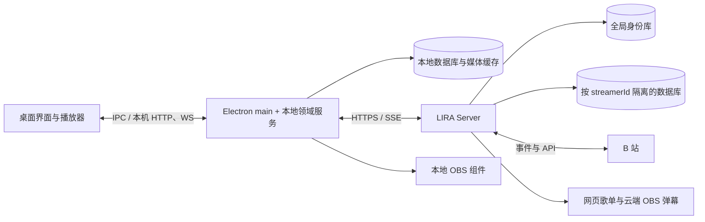

# LIRA 客户端与服务器架构审查报告

本文第 1—7 节记录原始架构审查，不新增需求、不替代协议或 Accepted ADR，也不表示生产环境已经通过容量或安全验收。原始审查任务只新增审查材料；根据后续用户指令开展的修复单独记录于第 8 节。

## 1. 审查基线与方法

| 对象 | 工作区 | HEAD 基线 | 状态 |
| --- | --- | --- | --- |
| 桌面客户端 LIRA 4.1.7 | `D:\Work\Live` | `c3e1e9770a7d36d72b00ff9bb640a067569fa4bb` | 存在大量未提交变更，结论包含当前工作区内容 |
| LIRA Server 0.6.0 | `D:\Work\lira-server` | `4afc8fb9e37afea8057f16b63b65483180961e46` | 存在大量未提交变更，结论包含当前工作区内容 |

HEAD 仅用于标识起点，不能复现全部未提交内容。本文引用的源码位置以本次工作区为准，不代表线上服务或已发布安装包。

第一轮先查阅官方工程资料，再检查仓库文档、启动入口、目录分工、依赖、鉴权与租户访问、云同步、礼物交付、前端状态和现有架构门禁。第二轮在本报告形成后继续进行定向复核，结果单独追加，避免把初步意见静默改写为已验证事实。

证据分级：

- **已确认事实**：有源码、配置、现有测试结果或隔离复现支持。
- **设计风险**：结构会增加维护或运行成本，但本次没有复现业务故障。
- **条件限制**：当前已接受设计的适用范围；超出范围才需要改变架构。
- **建议**：尚未实施或接受，不作为现有规范。

第一轮只统计版本控制已记录及未忽略新文件中 `src/`、`public/` 下的 JavaScript，排除路径含 vendor 或压缩文件标记的文件；包含空行、注释和服务端静态小游戏代码，不包含依赖、测试、CSS、HTML 或文档。

| 仓库 | JavaScript 文件 | 近似物理行数 |
| --- | ---: | ---: |
| 客户端 | 437 | 92,805 |
| 服务器 | 252 | 43,802 |

这些数字反映维护体量，不能换算成并发能力或微服务数量。

## 2. 外部设计原则及适用范围

| 来源 | 可借鉴原则 | 对 LIRA 的适用方式 |
| --- | --- | --- |
| [Shopify：模块边界与 Packwerk](https://shopify.engineering/enforcing-modularity-rails-apps-packwerk) | 业务聚合、明确公开接口、检查依赖和内部实现访问；目录划分后仍需执行边界 | 保持业务目录，通过代码与门禁约束跨域依赖，不为获得边界而直接拆服务 |
| [Shopify：2024 年复盘](https://shopify.engineering/a-packwerk-retrospective) | 模块化应以运行结果与真实开发体验检验 | 不以目录数量、文件行数或静态门禁通过替代行为验证 |
| [Microsoft：常见 Web 应用架构](https://learn.microsoft.com/en-us/dotnet/architecture/modern-web-apps-azure/common-web-application-architectures) | 模块化与单体部署兼容；微服务需要承担额外通信、恢复和运维成本 | 当前继续使用模块化单体，根据真实独立部署和扩容需求再决策 |
| [Google AIP-180：兼容性](https://google.aip.dev/180) | API 需要维护 wire 与行为语义兼容性 | 固定两端契约版本，验证旧客户端与新服务器的受支持组合 |
| [AWS：租户隔离](https://docs.aws.amazon.com/whitepapers/latest/saas-architecture-fundamentals/tenant-isolation.html) | 身份验证不能单独保证租户资源隔离 | 在认证边界建立 streamerId，并贯穿数据库、事件和订阅 |
| [Electron：进程模型](https://www.electronjs.org/docs/latest/tutorial/process-model)与[沙箱](https://www.electronjs.org/docs/latest/tutorial/sandbox) | 主进程、renderer、preload 权限有不同职责；沙箱 preload 支持受限 Electron API | 检查主窗口沙箱例外的真实必要性，避免扩大 renderer 权限 |

这些资料提供评估原则，不要求将 Rails、.NET 或 AWS 的框架和部署设施引入本项目。

## 3. 总体结论与现有架构

当前“Electron 桌面客户端 + 模块化单体服务器”的方向可以继续使用。客户端保留播放、文件与桌面能力，服务器负责共享身份、按主播隔离的数据、B 站监听与公开页面。抽查的目录与链路具备继续演进的基础，第一轮治理建议集中于依赖与契约、自动检查和运行边界。

第二轮又复现了两项具体缺陷：**B1：跨账号迟到请求的重试和回包未统一隔离；B2：合法歌库上传成功后可能超过客户端回读上限。** 具体证据见第 7 节，修复顺序应优先于一般目录整理。两项均未在本任务中修复。



该图省略礼物目录库、具体登录分区和内部 worker，只表示主要职责与信任边界。桌面 main 与本地后端当前同进程，不能将图中的逻辑分层理解为进程隔离。

### 已有优点

1. **领域与存储已有明确接口。** 客户端 [domain-services.js](../../src/server/domain-services.js) 在组合层创建歌曲等服务和存储接口；服务端 [song-library-sync.js](../../../lira-server/src/modules/streamer/song-library-sync.js) 拥有事务、revision 和提交后通知。
2. **租户作用域来自认证边界。** [device-auth.js](../../../lira-server/src/middleware/device-auth.js) 校验设备、Session、License 和 epoch；[device.js](../../../lira-server/src/routes/device.js) 使用已验证的 `req.device.streamer_id`；[streamer-storage.js](../../../lira-server/src/storage/streamer-storage.js) 负责目录与连接归属。
3. **礼物同步有恢复机制。** [remote-gift-controller.js](../../src/electron/remote-gift-controller.js) 区分 bootstrap、catch-up、live 等阶段，并携带来源与代际。SSE 作为在线加速，final 的恢复依赖服务器账本与游标，不能将临时推送等同可靠交付。
4. **服务端已有局部运行隔离。** [gift-query-executor.js](../../../lira-server/src/modules/streamer/gift-query-executor.js) 限制查询队列和每租户任务数；[backup-runtime.js](../../../lira-server/src/lib/backup-runtime.js) 与 [sse-writer.js](../../../lira-server/src/lib/sse-writer.js) 另有资源上限和退出协作。
5. **治理已落实一部分。** 存在协议、fixtures、ADR、文档与依赖边界测试；客户端在[遗留边界登记](../architecture/engineering/legacy-boundaries.md)中明确旧全局状态和 SQL 例外，防止已知债务继续增加。

这些是抽查链路的积极证据，不构成所有端点、所有异步路径均安全正确的证明。

## 4. 第一轮问题清单

优先级表示后续治理顺序，区别于已经确认的运行故障严重度。

### A1. 跨仓库测试输入依赖相邻工作区（优先处理，已确认事实）

- **证据**：[processed-gift-contract.test.js](../../test/processed-gift-contract.test.js) 直接读取 `../../lira-server/docs/protocol/fixtures/gift-sync-v1.json`；[gift-category.test.js](../../test/gift-category.test.js) 等测试同样读取服务器仓库。
- **影响**：只检出客户端且未准备该目录时测试缺少输入；服务器工作区内容变化会改变客户端测试基线。当前客户端 package 清单没有声明这些文件的版本。
- **判断**：共享同一权威 fixture 是合理目标，约定的相邻仓库目录和浮动版本是可复现性问题；本项以静态依赖为证据，未另做“仅检出客户端”的缺输入运行实验，也未据此证明运行协议错误。
- **建议**：明确受版本约束的契约与 fixture 获取方式，两端 CI 消费固定 revision/发布产物；决定保留双仓库或正式 workspace 时一并处理，不临时复制出无归属的协议副本。
- **验收方向**：按文档从干净机器准备工作区后，得到确定版本的契约输入；受支持的两端版本组合可验证。

### A2. 客户端仓库未见托管 CI 配置（优先处理，已确认仓库事实）

- **证据**：[客户端 modularity-standard.md](../architecture/engineering/modularity-standard.md) 明确记录没有托管 CI；服务端已有 [check.yml](../../../lira-server/.github/workflows/check.yml)。
- **影响**：仓库内未提供可核实的自动执行保障，无法从源码确认每次客户端变更都运行了架构、语法、协议与行为检查。
- **建议**：在解决 A1 的可复现输入后，接入适合 Windows/Electron 的检查与两端协议兼容门禁。
- **限制**：本次只能核实仓库中可见的自动化配置，未检查远端仓库保护规则、外部私有流水线或发布权限。
- **建议采纳后的验收方向**：干净检出能按声明的依赖与契约版本自动执行检查，故意破坏一个受保护契约时门禁失败。

### A3. 主窗口关闭沙箱，文档理由不足（优先验证，已确认配置与文档问题）

- **证据**：[main.js](../../src/electron/main.js) 主窗口设置 `sandbox: false`；[desktop/main.md](../architecture/desktop/main.md) 将原因归于 preload 需要 `contextBridge` 与 `ipcRenderer`。[preload.js](../../src/electron/preload.js) 当前只 require Electron API。
- **对照**：[Electron 官方沙箱说明](https://www.electronjs.org/docs/latest/tutorial/sandbox) 明确允许沙箱 preload 使用这两个 API。
- **判断**：现有文档理由不足以说明必须关闭沙箱；关闭后少了一层 OS 隔离。当前仍开启 context isolation 并禁用 renderer Node integration，不能把该配置直接等同任意代码执行漏洞。
- **建议**：单独验证沙箱下全部 IPC、播放、登录、更新和本地资源流程，再决定修改配置及说明；本次未运行 Electron 沙箱切换测试。
- **建议采纳后的验收方向**：验证主窗口真实 sandbox 状态及关键桌面流程；若仍保留例外，记录具体不兼容 API 和最小权限范围。

### A4. Admin 旧全局状态仍形成隐式依赖（持续治理，已确认设计债务）

- **证据**：[songs.js](../../public/js/admin/songs.js)、[forms.js](../../public/js/admin/forms.js) 等仍通过 `window.AdminApp` 访问其他模块；[legacy-admin-bridge.js](../../public/js/admin/legacy-admin-bridge.js) 提供迁移桥接。
- **影响**：模块调用关系、初始化顺序和可变状态归属不能全部从 ESM import 看出。
- **已有控制**：[module-boundaries.test.js](../../test/module-boundaries.test.js) 冻结已知全局依赖数量，禁止新增文件继续扩散。
- **建议**：随具体功能修改迁移到明确的 ESM 接口和状态 owner，避免一次性重写所有页面。
- **建议采纳后的验收方向**：被迁移功能无需全局调用即可独立测试，既有交互与初始化顺序保持，旧依赖登记相应减少。

### A5. 授权目录兼任大量远端业务适配（后续整理，设计风险）

- **证据**：[remote-license-client.js](../../src/electron/license/remote-license-client.js) 同时承载授权、云状态、歌曲同步、礼物历史与事件流。
- **影响**：领域职责越来越难从名称定位，相关改动集中在一个适配文件。
- **判断**：统一认证与 HTTP 请求代码具有复用价值。仅凭文件名称和行数不能认定违反单一职责或必须拆分。
- **建议**：只有出现独立变化、独立测试的稳定职责时，分别组织认证、远端传输和具体业务适配；不要机械地给每个端点加一层文件。
- **建议采纳后的验收方向**：认证状态机与业务 DTO 可分别测试；所有适配复用同一个主体有效性约束，不因拆文件丢失 B1 所需的隔离。

### A6. 单实例是当前部署约束（扩容前处理，条件限制）

- **证据**：[ecosystem.config.cjs](../../../lira-server/ecosystem.config.cjs) 为一个 PM2 实例；[monitor-manager.js](../../../lira-server/src/modules/bilibili/monitor-manager.js) 和 [gift-event-broker.js](../../../lira-server/src/modules/bilibili/gift-event-broker.js) 使用进程内状态。
- **影响推断**：直接增加实例会带来重复监听、事件订阅分散和后台任务协调问题，不能据此认定现有单实例部署有错。
- **当前基线**：[运行说明](../../../lira-server/docs/operations/bilibili-monitoring-and-reconnect.md) 记录约 10 用户、2 核 2 GB 的部署输入，并说明未在目标服务器完成容量验收。此处引用文档假设，不确认当前线上硬件或人数。
- **建议**：先定义目标负载、延迟、恢复与资源指标，实测后再选择垂直扩容、按租户分配实例或跨实例协调方案。
- **建议采纳后的验收方向**：在目标硬件按真实租户数、事件速率、历史量和订阅数完成压测与重启恢复；若引入多实例，验证不会重复消费且订阅能收到所属租户事件。

## 5. 目录维护建议

| 范围 | 当前判断 | 待采纳的维护建议 |
| --- | --- | --- |
| 客户端 `src/music`、`src/bilibili`、`src/overtime`、`src/ai` | 有业务归属，保留 | 跨域只依赖明确公开接口 |
| 客户端 `src/electron`、`src/server`、`src/storage` | 桌面、传输装配和持久化的划分合理 | 装配入口只拥有接线与生命周期，业务决策留在 owner |
| 客户端 `public/js/admin`、`public/js/playback`、`public/js/overlays` | 按界面与场景组织可继续维护 | 明确状态和副作用归属，逐步减少旧全局状态 |
| 服务端 `src/routes`、`src/modules`、`src/storage` | 主干合理，保留 | 角色入口复用同一业务能力，避免 Admin/Device/Streamer 各复制业务规则 |
| 两端协议与 fixtures | 已有规范，但跨仓库消费方式脆弱 | 固定版本、可复现获取、兼容性验证 |
| `shared`、`lib` | 通用功能允许集中，但需控制内容 | 业务决策和资源生命周期不因复用需要就自动成为通用工具 |

不建议仅因文件数量增加而引入微服务、前端框架、通用 DI 容器或全仓库搬迁。目录迁移应由稳定职责、变更频率和具体维护问题驱动。

## 6. 第一轮验证记录

| 检查 | 结果 | 能证明的范围 |
| --- | --- | --- |
| 客户端 `npm run verify:architecture` | 22/22 通过 | 当前脚本覆盖的模块边界、ESM 标识符与规模登记 |
| 服务器 `npm run docs:check` | 34/34 通过 | 当前文档、部分协议与架构治理规则 |
| 两仓库 `git diff --check` | 退出码 0；存在换行转换提示 | 已跟踪工作区差异没有该命令检测到的空白错误；不包含未跟踪文件审查 |
| 字面量 require/import 依赖扫描 | 未发现文件级循环 | 不覆盖计算路径、运行期注入、事件依赖或 `window.AdminApp` |

以上不是全量测试结果。未运行生产容量、真实上游、完整 Electron/OBS GUI、线上发布与安全渗透验证，也未据此宣称整个项目无缺陷。

## 7. 第二轮复核记录

第一轮报告先形成，再对实际模块做延迟响应、账号切换和完整歌库上传/读取的定向复核。以下 P1/P2 表示具体缺陷的建议修复优先级，和 A1—A6 的一般治理排序分开。

### B1. 通用授权请求未绑定发起时的主体（P1，已隔离复现，未修复）

**触发条件**：同一个 license manager 上，账号 A 的受保护请求尚未返回，随后成功激活并授权账号 B；旧请求此后成功或返回鉴权错误。未涉及第三方任意 token 或服务端接受伪造 streamerId。

**根因位置**：

- 客户端 [license-manager.js](../../src/electron/license/license-manager.js) 的 `withAuthorizedToken`（本次行 268—297）：重试只判断 token 是否已变化，没有区分同主体续期和不同主体切换；旧错误继续作用于当前授权状态。
- [license-operations.js](../../src/electron/license/license-operations.js) 的 `getProfile`（本次行 20—24）：返回后只检查 dispose，然后写入全局 profile，没有核对发起时的账号。
- 同文件的 `overlayOperation` 已实现局部 owner 防护，但歌曲和其他通用操作未统一获得该保护。

**实际观测**：

| 子场景 | 控制输入 | 观测结果 |
| --- | --- | --- |
| 旧歌曲写入被重试 | A 的 `syncSongs` 等待；切换 B；A 请求返回 `DEVICE_TOKEN_INVALID` | 同一份合成 A 歌单先以 A token 调用，随后以 B token 再次调用，最终返回成功 |
| 旧资料覆盖显示 | A 的 `getProfile` 等待；切换 B；A 资料成功返回 | 当前同步身份仍为 beta/B，但显示资料变成 alpha/A |
| 旧拒绝污染新会话 | A 的 `getCloudSongs` 等待；切换 B；A 请求返回 `DEVICE_REVOKED` | B 的新会话从 authorized 变为 blocked |

**影响**：旧写入意图可能带着新账号凭据发送，存在误写目标账号的风险；旧成功/失败响应还会污染当前资料或可用性。服务器仍按收到的合法 token 选择租户，本项是客户端主体绑定错误，不是已证明的服务器越权漏洞。

**复现边界**：使用真实 license manager、业务 operations、签名流程和现有测试 harness，网络返回为可控 Promise，身份和 token 均为合成数据。复现确认了跨主体重试调用与状态污染，没有让真实服务器提交错误账号数据，也未逐步操作 Electron GUI。带取消信号的云同步控制器另有局部保护；本项不宣称所有调用入口都会触发。

**建议修复归属**：通用授权请求执行层。操作发起时捕获稳定主体与生命周期；在首次执行、重试以及成功/失败处理前核对。区分同主体 token 续期与不同账号/设备切换，旧响应不得更新新 profile 或清理新 Session。不要简单禁止全部 token 轮换重试。

**建议验收**：上述三种延迟交错均不影响 B、不向 B 重发 A 的写入；同账号正常续期仍可按约定重试；dispose、阻断和账号切换的行为分别验证。

### B2. 歌库上传上限与回读上限不能保证往返（P2，已跨模块 HTTP 复现，未修复）

**触发数据**：5,000 首合成歌曲，名字为 `Song <index>`、作者为 `Synthetic`、点歌价格为短文本、每首 `songClip` 为 210 个 ASCII 字符。每项均通过当前歌曲标准化规则，没有使用超长字段或超出歌曲数量上限。

**探针实际执行链路**：客户端 `mapSongForSync` 与 remote client → 本机 HTTP → 服务器 `createApp` 的 JSON parser → 测试路由 adapter → 实际歌曲事务与内存 SQLite store → 实际歌曲 DTO 序列化 → 客户端 `getCloudSongs`。

| 项目 | 观测值 |
| --- | ---: |
| 上传 JSON 的 UTF-8 字节数 | 1,983,901 |
| 服务端 JSON body 上限 | 2,097,152（2 MiB） |
| 成功提交歌曲数 | 5,000 |
| 回读 JSON 的 UTF-8 字节数 | 4,251,750 |
| 客户端歌库响应上限 | 4,194,304（4 MiB） |
| 回读结果 | `RESPONSE_TOO_LARGE`，标记 `retryable: true` |

**根因位置**：

- 服务端 [app.js](../../../lira-server/src/app.js) 的 `express.json({ limit: "2mb" })`（本次行 75）允许此输入。
- [song-library.js](../../../lira-server/src/lib/song-library.js) 的 `serializeSongRow` / `LEGACY_ALIASES`（本次行 110—141）返回 canonical 字段、兼容别名与持久化元数据，回包大于请求。
- 客户端 [remote-license-client.js](../../src/electron/license/remote-license-client.js) 的 `getCloudSongs`（本次行 394—398）固定限制为 4 MiB，未覆盖这个已被服务器接受的快照。

**影响**：保存成功的歌库可能无法再下载到客户端或其他设备。相同内容的重试仍会超过大小限制；本次未证明服务器持久数据丢失。

**复现边界**：HTTP parser、歌曲转换/事务/store/序列化、客户端请求与响应检查均为真实实现；生产设备路由处理器、鉴权及设备业务接线由测试 adapter 替代，SQLite 为 `:memory:`，使用探针手建的最小表结构，发布回调为空。没有执行生产数据库初始化、启动生产 `startServer`、加载管理库或访问外部网络。该复现验证数据容量与往返，不验证登录、Nginx 或线上网络。

**与生产入口的对应证据**：[device.js](../../../lira-server/src/routes/device.js) 的歌曲路由调用 [device/song-sync.js](../../../lira-server/src/modules/device/song-sync.js)；后者将上传交给同一个 `songSync.replaceSongs`，回读返回相同的 `{ songs: listSongs(db, true), ...getSongSyncState(db) }`。该对应关系经过源码核对；真实路由的鉴权、设备事件记录、主播资料查询及数据库初始化未纳入本次 HTTP 执行。

**建议修复归属**：两端歌库契约及传输适配共同处理。根据实际响应 DTO 和兼容别名定义一致的字节预算，或设计有版本/能力协商的分批读取；保留歌曲替换原子性和旧客户端兼容性。不应只去掉全部响应限制或静默删除旧别名。

**建议验收**：所有允许提交的代表性边界歌库都能完整回读；覆盖 ASCII/中文、兼容别名、数量与字段边界。无法支持的输入必须在提交前给出明确结果，不能先保存成功再让回读永久失败。

### 7.3 已排除、降级或修正的判断

1. **“凭据解绑后旧登录必然反写”不成立。** `credential-service` 已有 `clearGenerations` / `createWriteGuard`，等待账号查询前后都会检查；`credential-lifecycle.test.js` 覆盖 clear、QR 取消与替换。合法且未取消的并发设置采用最后成功提交获胜，是文档明确接受的语义，本次不把它当作缺陷。
2. **服务器启动与歌库职责分离已在当前工作区实现。** 旧审计将拆分 `createApp`、生命周期及歌曲纯转换/store 列为后续事项；当前源码已经完成，不能照抄历史报告继续列为未解决问题。
3. **A2 只能确认仓库可见配置。** 报告措辞收窄为“仓库未见托管 CI”，不推断外部流水线一定不存在。
4. **A5 保持为低优先级维护建议。** 名称宽泛和文件较长不能单独证明错误；B1 的问题来自主体检查未统一，机械拆文件并不能解决。
5. **通过现有门禁不代表跨仓库行为完整。** 客户端 `license-protocol-e2e.test.js` 注释与实现明确采用内存假服务器，不能仅凭 E2E 文件名将其视为两仓库真实实现联测。既有 fixtures 和单端测试有价值，但未覆盖本次两类交错/往返。
6. **A3 尚未升级为利用漏洞结论。** 官方文档足以反证旧沙箱理由，实际 Electron 沙箱启用后的兼容性仍未验证。

### 7.4 复现附件与执行方法

附件：[2026-09-16-architecture-probes.cjs](support/2026-09-16-architecture-probes.cjs)。显式传入两个检出的绝对路径，使用两仓库已安装依赖；本次 Node 运行环境支持原生 fetch 与 SQLite 依赖。

```powershell
node D:\Work\Live\docs\reports\support\2026-09-16-architecture-probes.cjs D:\Work\Live D:\Work\lira-server
```

附件保留本次已观察缺陷的断言：**退出码 0 表示历史缺陷仍可复现，不表示业务测试通过。** 修复后应把场景转为断言正确行为的正式回归测试，并更新审查状态；不应为了维持这个历史附件通过而回退修复。

脚本只生成合成账号、临时密钥与内存 SQLite，HTTP 监听绑定 `127.0.0.1` 随机端口；所有网络调用重定向到此测试监听，结束后关闭 listener、manager 与数据库。不会连接真实 B 站、授权服务或生产数据库。

### 7.5 第二轮实际验证

| 命令/场景 | 结果 |
| --- | --- |
| 复现附件：跨主体重试、迟到资料、迟到拒绝、歌库往返 | 4 个子场景均复现记录结果；对应 B1、B2 两个根因 |
| 客户端：`node --test test/license-manager.test.js test/license-manager-renewal.test.js test/license-manager-revalidation.test.js test/danmaku-overlay-ipc.test.js test/remote-license-client.test.js` | 51/51 通过，无跳过 |
| 服务端：`node --test test/app-lifecycle.test.js test/song-library-sync.test.js test/credential-lifecycle.test.js test/streamer-storage-ownership.test.js` | 40/40 通过，无跳过；使用既有隔离测试环境 |

这些现有测试通过与发现新缺陷并不矛盾：已有测试没有包含本次跨主体通用操作和可接受歌库的完整往返边界。上述数量不与第一轮 22/34 相加计算覆盖率。

第一轮静态扫描只是临时辅助观察：以 `git ls-files --cached --others --exclude-standard` 获取 `src/public` JavaScript 路径，解析字面量 CommonJS `require`/`require.resolve` 与 ESM import/export，相对路径解析后使用强连通分量查找循环。脚本未作为正式架构分析器保留，没有 AST 语义保证，也未在本轮升级为完整依赖证明。

### 7.6 建议后续顺序

1. **先修复 B1**：统一通用请求的主体绑定，覆盖迟到成功、失败与重试。
2. **再修复 B2**：建立允许上传的数据必须能回读的契约与集成回归。
3. **推进 A1/A2**：明确契约版本输入并接入客户端自动门禁，把两端场景纳入可复现检查。
4. **独立验证 A3**：根据真实 Electron 兼容证据处理沙箱例外。
5. **按功能渐进处理 A4/A5**；A6 在明确容量或多实例目标后再决策。

本报告完成了写作与再次审查，业务修复、正式协议调整、生产压测、部署和发布均未执行。

## 8. 2026-09-16 后续修复记录

本节属于原始审查之后的独立实施记录。第 1—7 节中的“未修复”和验证数字保留原始时间点含义。实施计划见 [client-server-audit-fixes](../../specs/plans/archive/2026-09-16-client-server-audit-fixes.md)。本轮已修复 B1/B2，保留两仓库已有未提交变更，不提交或发布。

### 8.1 B1：请求绑定主体和生命周期

通用授权执行层现在在等待授权之前捕获主体及生命周期，在首次发送、回包、错误处理和重试时核对。激活、重新 bootstrap、清理会话和 dispose 使旧生命周期失效；A → B → A 也不会复活旧请求。同主体正常 token 续期仍允许原请求按约定重试一次。资料在通用校验和敏感字段清洗后同步提交，旧续期/心跳的完成和清理不再作用于新账号任务。

新增 [license-manager-identity.test.js](../../test/license-manager-identity.test.js) 覆盖迟到成功、失败、重试、首次发送前切换、ABA、续期、等待续期、阻断、dispose 和新旧维护任务交错。更详细的运行约束见 [desktop/auth.md](../architecture/desktop/auth.md)。这些检查不会撤回切换前已送达旧账号的请求；SSE 的流取消与事件消费继续由既有控制器的生命周期检查负责。

### 8.2 B2：有限回读预算与提交前保护

两端采用 8 MiB（8,388,608 字节）的完整 Device 歌库 JSON UTF-8 预算，保留 canonical 字段、旧别名和同步元数据；上传 parser 仍为 2 MiB，单次全量替换仍最多 5,000 首。服务器在原有事务内对真实回读 DTO 计数，超限的 replace/create/update 返回 `413 PAYLOAD_TOO_LARGE`，回滚歌曲、来源标记及 revision，不发布同步事件。客户端在读取流时执行有限预算，歌库超限错误标记 `retryable: false`；手动同步 UI 给出容量相关说明。既有云同步周期协调仍可能再次检查，这个错误分类不表示禁止所有后续请求。

预算不会自动删除、截断或迁移历史大歌库。超过 8 MiB 的既有数据仍可能无法由桌面完整读取，可以通过删除或替换为较小歌库恢复；单首删除继续允许逐步缩减历史大库。旧桌面版本的 4 MiB 限制不会因服务器更新而消失，需更新客户端才能读取 4—8 MiB 快照；返回字段及旧别名保持兼容。

权威预算和边界样本见服务器 [song-snapshot-budget.json](../../../lira-server/docs/protocol/fixtures/song-snapshot-budget.json)，行为约束同步维护在服务器 requirement、acceptance criteria、协议和 OpenAPI。正式两仓 HTTP 回归使用 [verify-song-roundtrip.cjs](../../scripts/verify-song-roundtrip.cjs)，输入为显式检出路径；测试 adapter 不覆盖生产设备认证。原第 7.4 节附件继续保留历史缺陷断言，修复后不再作为通过门禁使用。

### 8.3 A1/A2 的可复现输入前置条件

本轮只读调查确认，当前 7 个客户端测试直接消费 4 个服务器 fixture，其中 `gift-catalog-variants.json` 含未提交的 `giftCategory` 协议变更。客户端真实标准化函数读取服务器 HEAD `4afc8fb9e37afea8057f16b63b65483180961e46` 及可达旧 fixture 版本均返回 `CATALOG_INVALID`，读取当前工作区版本成功。B2 当前链路还依赖尚未提交的服务器 `song-library-store.js` 与 `server-lifecycle.js`。不能把现有旧 SHA 或浮动分支声明为当前实现的可复现输入。

下一步是将经审核的服务器协议和实现形成可获取的固定提交，再声明服务器仓库、完整 commit SHA、四个 fixture 路径与内容校验值；Windows/Node 24 CI 按该声明准备两仓、安装各自锁文件依赖并运行客户端完整门禁与显式往返检查。跨私有仓库的只读检出权限仍需在接入时确认。本轮未新增托管 CI，也未声称 A1/A2 已解决。

A3 的真实 Electron 沙箱兼容验证、A4/A5 的按功能渐进整理，以及需先明确容量目标的 A6，继续按第 7.6 节处理。

### 8.4 修复验证与限制

| 验证 | 结果 |
| --- | --- |
| B1 新增身份交错用例 | 17/17 通过；独立复审无阻断发现 |
| 授权、云同步、礼物、抽奖与桌面相关联合检查 | 326/326 通过，无跳过 |
| 最终远端 transport、歌库预算与同步 UI | 26/26 通过，包含 BOM 与分片 UTF-8 |
| 正式两仓 HTTP 往返 | 5/5 通过；原 1,983,901-byte 上传、4,251,750-byte 回包完整成功 |
| 服务器预算、真实写入路由、app/cloud/admin 回归 | 27/27 通过；歌曲事务 13/13、标准化 4/4 另已通过 |
| 服务器 `npm run docs:check` | 34/34 通过 |
| 客户端 `npm run verify` 的快速门禁 | 文档 5/5、语法 781 个 JS 文件、架构 22/22 通过 |
| 客户端完整测试阶段 | 1,983 通过、1 失败、4 跳过；未宣称全量通过 |
| 两仓 `git diff --check`、任务差异与最终状态检查 | 通过；已有用户变更保持 |

完整测试的唯一失败为 [frontend-admin-toolbox.test.js](../../test/frontend-admin-toolbox.test.js) 的 `browser source tab classifies and exposes every overlay address`：断言仍要求 [display.js](../../public/js/admin/display.js) 将地址设为本机 `/danmaku`，而已有未提交代码通过 `observeServerOverlayUrl` 使用服务器地址。这两个文件均未被本轮修改；定向单独重跑得到同一失败，未扩展本轮范围修改旧断言。4 项跳过来自未配置 NSIS 编译器/插件的安装器集成测试。完整运行后最终 BOM 解码兼容调整已用 26 项定向测试和 5 项往返检查重测，未重复完整套件。

所有新增场景使用合成数据、内存或临时数据库及本机监听。未执行 Electron/OBS GUI、生产容量或托管 CI 验收，也未部署服务器或发布客户端。实际命令见归档实施计划。
