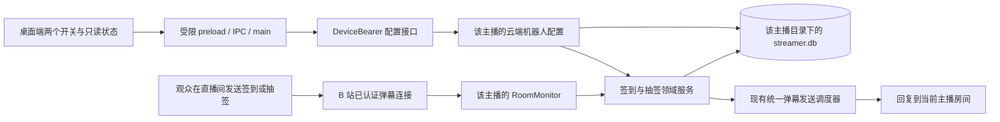

# 签到与抽签机器人云端运行设计报告

日期：2026-09-18

状态：**设计来源；执行要求以 [已接受规格](../../specs/cloud-daily-bots.md) 为准，不代表线上部署状态。**

2026-09-22 替代边界：后续用户要求已取消强制首次接管和旧数据处理界面。第 8 节及其他章节中“确认旧数据后才能开启”“pending 阻止启用”和旧数据摘要界面的描述已被直接启用流程替代；客户端不自动读取或上传旧库。旧导入 API/IPC 及进行中导入的 commit/cancel/expiry 契约仍保留，显式导入仍要求停写和归属确认。其余租户隔离、每日持久化、回复调度与整库恢复要求继续由规格承接。第 2 节是设计时的实现快照，其中本地签到/抽签源码已退役。

范围：LIRA 桌面客户端与 LIRA Server。本文依据两个仓库当前工作区核查，不代表线上服务器已部署同样的代码。

实施前提：**当前服务器仍为开发环境，本次不安排备份及备份恢复演练。** 下文切换和验收均针对开发环境；旧库原位保留兼容，首次启用不要求第 8 节的旧数据确认，不额外复制备份。

## 1. 推荐结论

将签到和抽签的**命令处理、每日判定、数据保存、回复发送**整体移到现有 LIRA Server；客户端保留两个云端开关和只读运行状态。观众仍在主播直播间发送“签到”或“抽签”，无需安装客户端或打开网页。

推荐直接复用服务器现有的持续房间监听、主播专属 SQLite 数据库和统一弹幕发送调度器。数据放在主播已经分配的账号目录下：

```text
<配置的 streamersRoot>/<该主播持久化的 data_dir>/db/streamer.db
```

不新建独立机器人进程，不给每个观众创建文件，也不引入 Redis、额外数据库服务或每日定时重置任务。客户端下线不会关闭云端开关；北京时间零点通过日期键自然进入新一天。

需要补齐的工作主要是：**云端业务处理与持久化、两个开关的 Device API、客户端退出本地执行、旧数据迁移。** 服务器已有全天监听基础，无需重新建设这一层。

### 本次明确需求与建议边界

| 项目 | 设计结论 |
| --- | --- |
| 全天运行 | 客户端退出、电脑关机、直播间未开播时，符合运行条件的云端机器人继续接收命令 |
| 数据归属 | 属于 LIRA 主播账号，以服务端解析的 `streamerId` 隔离；观众以有效 B 站 UID 区分 |
| 客户端职责 | 控制开启／关闭，展示服务器确认的状态；不计算结果、不累计天数、不自行回复 |
| 签到行为 | 沿用北京时间、同一观众每日最多增加 1 天、累计天数与重复签到提示 |
| 抽签行为 | 沿用每日一签；首次结果保存为快照，当天重复抽签、服务器重启或词库更新都返回同一结果 |
| 数据保留 | 关闭功能不删除记录；更换电脑不重置记录；停播不重置累计 |
| 词库 | 保留内置词库和已确认归属的旧自定义词库；按本次“客户端只控制开关”要求，移除这两项的日常编辑入口，不另建网页编辑后台 |
| 本次不迁移 | 随机点歌回复、DIY 关键词回复、AI 助手、欢迎及 PK 播报；保留其现有职责与入口 |

“24h”表示功能不再依赖桌面进程及开播状态，仍以服务器在线、主播账号有效、总监听开启、房间有效及云端 B 站凭据可用为条件。上游断线、凭据失效或停机期间未收到的命令无法补记；这不是零停机或消息必达承诺。

## 2. 当前实现核查

| 已核实事实 | 对设计的影响 | 依据 |
| --- | --- | --- |
| 签到在本地 `createCheckinService` 执行，按北京时间判断日期 | 可复用命令和回复语义，执行位置需要迁移 | `checkin-service.js`（已退役） |
| 本地签到保存于 `checkin-data.db` 的 `checkin_users`，只有累计、首次和最近签到信息 | 能迁移累计，不能还原全部历史签到日期；该表也没有主播账号／房间归属字段 | `checkin-store.js`（已退役）、[database.js](../../src/storage/database.js) |
| 本地抽签以 `dateKey:uid` 的哈希对当前签池取模，没有每日结果表 | 旧实现依赖签池保持不变；云端应保存选中的完整签文 | `fortune-service.js`（已退役） |
| 两个开关、祝福语与签池目前经本地设置接口读写，不在通用云同步键集合中 | 不能只改页面提示或把本地开关复制到服务器，就宣称完成迁移 | [danmaku-tool.js](../../public/js/admin/danmaku-tool.js)、[settings-contract.js](../../src/server/settings-contract.js) |
| 服务器 `MonitorManager` 启动符合条件的主播监听；监听活动生命周期独立于 overlay 开播场次 | 签到／抽签绑定 monitor source，不依赖 `liveSessionId` | [monitor-manager.js](../../../lira-server/src/modules/bilibili/monitor-manager.js)、[ADR-0060](../../../lira-server/docs/architecture/decisions/0060-continuous-room-monitoring.md) |
| `RoomMonitor` 已在 `DANMU_MSG` 分支取得 UID、昵称与完整命令文本；现有服务端未发现签到／抽签处理器 | 应从这个已认证入口接入，而非由客户端转发命令 | [room-monitor.js](../../../lira-server/src/modules/bilibili/room-monitor.js) |
| 服务器有统一发送器，各房间独立调度，任务受租户来源及凭据快照约束 | 新机器人复用该发送器，不直接另写 B 站 HTTP 发送链 | [send-runtime.js](../../../lira-server/src/modules/danmaku/send-runtime.js)、[ADR-0055](../../../lira-server/docs/architecture/decisions/0055-independent-room-danmaku-scheduling.md) |
| 主播数据库和目录归属已有实现 | 在现有 `streamer.db` 加表，沿用已验证的存储边界 | [streamer-storage.js](../../../lira-server/src/storage/streamer-storage.js)、[ADR-0039](../../../lira-server/docs/architecture/decisions/0039-tenant-directory-ownership.md) |

上一次“检查中”问题是页面初始化回归；修复它只能恢复现有控制界面，不能让这些本地机器人在关机后继续执行。本报告解决的是后者。

## 3. 运行架构与职责



`MonitorManager` 负责装配，`RoomMonitor` 负责消息入口和来源生命周期；新领域服务负责命令、日期、记录结果与待发回复；store 负责事务；现有 scheduler 负责发送顺序、限流、取消及结果分类。

建议新增一个小型 `DailyBotService`，内部协调签到与抽签两个明确的处理函数。它只接收当前租户数据库与来源对象，不按每条消息重新选择租户。业务代码不依赖路由，也不访问全局 `currentStreamer`。

接入点位于完整 `DANMU_MSG` 命令文本处理处，保留现有 overlay、礼物查询等消费逻辑。新服务只消费精确的“签到”“抽签”（沿用现有首尾空白清理规则），不把截短的展示文本、历史回放、网页请求或客户端伪造的观众消息当作签到依据。

## 4. 数据具体放在哪里

### 4.1 目录与数据库选择

```text
<streamersRoot>/
└── <data_dir>/                 # 使用服务端已经保存的目录映射
    ├── db/
    │   └── streamer.db         # 新增签到、抽签表；配置使用现有设置表
    ├── web/
    │   └── songs.db            # 现有歌库，职责不变
    ├── exports/                # 将来若提供用户导出，文件可放这里
    └── ...                    # 现有资产、运行目录
```

新账号目前使用 `<streamerId>-<subdomain>` 目录；已有合法的纯账号名目录继续使用原映射。不得直接把用户输入的账号名或房间号拼成路径，也不为本功能批量重命名账号目录。

**推荐同库新增表。** 独立 `bots.db` 虽然看起来直观，却会增加连接、迁移及配置与结果跨库协调；当前没有足够理由承担这些成本。每个 UID 一个 JSON 文件则难以稳定处理同日去重、原子更新与一致查询。

### 4.2 建议的数据模型

以下是职责级草案，实施时用增量迁移确定完整 SQL、索引及约束；不是当前已经存在的表。

| 存储对象 | 关键内容 | 约束与作用 |
| --- | --- | --- |
| 现有 `streamer_settings` | 独立的签到／抽签开关、各自 revision；词库内容及版本 | 新键建议使用 `danmaku.checkinBot`、`danmaku.fortuneBot`；不混入客户端通用 settings 全量覆盖 |
| 现有 `streamer_settings` 中的接管元数据 | `state`、`decision`、独立 revision、旧端停写确认时间、导入编号及摘要 | 建议键 `danmaku.dailyBotTakeover`；同租户共用，只有 `ready` 可开启，状态转换见 8.1 |
| `daily_bot_checkin_users` | UID、最近昵称、累计天数、首次／最近签到时间；可选旧累计基数和旧最近签到日 | UID 主键；只属于当前租户数据库 |
| `daily_bot_checkin_days` | UID、北京时间日期、服务器首次受理时间、来源房间、当日新增天数、累计结果、祝福语快照 | 唯一键 `(uid, dateKey)`；当日新增天数通常为 1，迁移当日已签到时为 0 |
| `daily_bot_fortune_days` | UID、日期、首次受理时间、来源房间、签池版本、算法版本、完整签文快照 | 唯一键 `(uid, dateKey)`；保存 `level/name/text/advice`，不只保存数组索引 |
| `daily_bot_legacy_imports` | 导入编号、来源摘要、截止时间、条目数、状态及各阶段操作回执 | 开始、提交、取消／过期均留下幂等凭证；重复请求不得再次推进状态或叠加累计 |

UID 使用经过验证的十进制字符串，拒绝缺失、零值及已丢失精度的数字，不用昵称替代身份。昵称只是当时的展示信息；改名不会变成新观众。来源房间用于解释记录，不作为授权或目录边界。

全部表位于按 `streamerId` 选出的租户数据库，因此不需要再建一个混合所有主播数据的全局签到表。同一个 UID 在两个主播账号下有两份独立累计与抽签记录。

首版保留业务结果，普通开关不提供清空功能，不按天删除历史。也不保存全部弹幕、原始 packet、Cookie 或令牌。新增记录属于用户明确要求的业务结果持久化，实施时须在现有“普通弹幕不落库”的规范中明确这一区别。

## 5. 签到与抽签如何保证结果稳定

### 5.1 签到处理

1. 从已认证 monitor 入口取得可信租户、UID、完整命令及服务器接收时间；接收时冻结北京时间日期，避免排队跨零点后归错天。
2. 在处理时核对签到开关及来源仍有效。关闭时不新增业务记录，也不排回复。
3. 在同一个租户数据库事务中按 `(uid, dateKey)` 尝试插入每日记录。
4. 只有首次插入且该日期未被导入基数覆盖，才把累计加 1；每日记录与累计同时提交。重复事件、重复请求或重新连接不能增加第二次。
5. 首次受理时保存祝福语快照；当天再次签到回复“今天已经签到过啦，已累计 N 天”，沿用该日祝福语。当天重复命令不产生新历史行。
6. 事务提交后才生成发送任务；数据库提交失败不得回复“签到成功”。

唯一键是正确性的保障，内存去重只是防刷优化。可使用针对该唯一键的 `INSERT ... ON CONFLICT ... DO NOTHING`，避免把其他字段错误误当作重复记录；SQLite 的冲突处理能力见 [官方 UPSERT 文档](https://www.sqlite.org/lang_upsert.html)。

不需要零点扫描全部用户或重置表，也不把“累计天数”改成“连续签到天数”。连续签到、积分、排行榜不在此次需求内。

同一 monitor 的业务落库按接收顺序完成，网络发送不阻塞后续命令受理。首次时间取已知最早值，最近时间／日期只向后推进；迟到处理的较早日期不能把最近签到日改小。每日记录里的累计结果表示该次事务提交后的累计快照，不是假定已拥有完整旧历史后重算出的日历累计。

### 5.2 抽签处理

首次抽签在事务中读取当时有效签池，沿用既有日签选择规则，保存完整结果；并发首次抽签遇到唯一键冲突时读取已保存结果。当日后续请求一律读取该行，不重新计算。

这解决三个问题：服务器重启不会换签、签池顺序变化不会换签、当天修改／升级词库不会改变已经抽到的签。后续日期使用当时生效的词库；日期采用同一北京时间规则。

初始迁移可沿用旧 `dateKey:uid` 哈希算法，减少当天结果变化；不必为“账号隔离”强制改为含主播 ID 的新算法。不同账号的数据库彼此独立，同一观众在相同签池下偶然得到相同签文不构成数据串用。

### 5.3 业务成功和发送成功分开

签到／抽签已经落库但回复被限流、超时或拒绝时，**不撤销记录、不扣回签到、不重抽**。观众在同一北京时间日期内稍后重发命令，可取回同日结果；跨日重发按新一天处理，旧日结果继续保存，本期不提供指定日期补查入口。

继续使用现有 sender 的 `accepted`、`rate-limited`、`credentials-invalid`、`result-unknown` 等分类。`accepted` 只表示平台接口接受，不保证观众已经看见；结果不明时不盲目自动补发。

首版不增加持久化待发队列。重启后保留业务记录，不批量重放旧回复；可能存在“结果已保存、回复未发出”的短窗口，允许观众同日重发查询本日结果。这一取舍避免重启后向房间补刷过期消息，也不承诺端到端 exactly-once。

## 6. 全天运行、发送限制与故障行为

### 6.1 生命周期

| 场景 | 推荐行为 |
| --- | --- |
| 客户端关闭／电脑关机 | 云端继续运行，开关及记录不变 |
| 下播／尚未开播 | 继续监听和回复；不要求 `liveStatus=1` 或 overlay 连接 |
| 暂停接收点歌 | 不暂停签到和抽签 |
| 单独关闭签到 | 停止新签到，取消该租户未提交给平台的签到回复；抽签及其他机器人继续 |
| 总监听关闭、主播账号禁用 | 现有 monitor 生命周期停止两项处理，保留开关和记录；恢复运行条件后继续 |
| 房间移除、云端 B 站退出 | 与配置移除在同一租户事务关闭两个开关并增加各自 revision，停止来源并保留记录；重新配置后手动开启 |
| 服务器重启 | 从数据库读取开关，恢复符合条件的监听；当天记录与累计继续使用 |
| B 站或网络临时断开 | 沿用现有重连；显示运行受阻，不把云端开关擅自改成关闭 |
| 同一 B 站账号刷新凭据 | 作废旧发送上下文，重建后使用保存的设置，不删除历史 |
| 改绑房间或更换 B 站账号 | 必须与改绑在同一租户事务关闭两个开关并增加各自 revision，取消旧来源任务；配置确认后手动开启，历史仍属于同一 LIRA 主播账号 |
| 桌面切换 LIRA 账号 | 展示新账号的云端状态并丢弃旧回包；不把旧账号设置复制过去，也不自动关闭旧账号云端服务 |

任务必须绑定 `streamerId`、真实房间、monitor source、凭据代际及有效期限。每个发送分段再次核对它们；关闭一个机器人只能取消对应 producer，不能影响欢迎、答谢、查询或 PK。

已交给 B 站的 HTTP 请求无法保证撤回。关闭成功的语义是“服务器已保存关闭，停止受理并取消尚未提交的回复”，不是抹除刚刚已经发出的弹幕。

**关闭的生效点是云端关闭配置及新 revision 的事务提交。** 命令落库事务必须重新核对开关、revision 及有效来源：关闭先提交的命令不再写入；业务记录先提交则属于已受理结果，关闭不回滚它。发送任务携带受理时的配置 revision，入队以及每个分段实际提交前都检查开关、revision 和来源仍一致。这样即使业务已落库、关闭后才尝试入队，也不会误发旧任务；关闭后再开启也不能复活旧 revision 的回复。关闭响应在配置提交及对应任务失效处理完成后返回。房间改绑和凭据替换同样使旧来源任务失效。

房间更新由现有 `cloud-state` 领域流程、凭据更新由 `credential-service` 领域流程调用同一个租户内的机器人配置 writer，在各自已有事务中完成上述关闭与 revision 更新；事务提交后才取消旧任务、重建 monitor。不能只在内存中暂停，否则重启或新 monitor 会重新读到旧开关。所有改绑入口都走该流程，迟到的旧开启请求必须因 revision 冲突被拒绝。同一 B 站账号刷新凭据按验证后的 UID 判断，不把 Cookie 或凭据 revision 的变化当作换号；主动退出后重新登录仍需手动开启。

### 6.2 发送与资源边界

现有 scheduler 只接受 `thanks/query/welcome/pk`，因此需要显式增加 `checkin`、`fortune` producer，不能把新业务伪装成其他 producer。

沿用现有每真实房间串行发送、不同房间可并行、同房同文冷却、实际发送账号退避和总计 80 个未完成分段的容量边界。新 producer 也计入该总预算。建议初始每租户、每种机器人最多 4 个待完成任务；待回复去重与重复查询冷却都按 `(streamerId, kind, uid, dateKey)` 隔离，同一键最多一个待回复任务，冷却为成功入队后 30 秒。上述数字是待验收的应用默认值，不是 B 站平台配额。

建议回复有效期为命令接收后 60 秒，排队和落库等待不延长有效期。接收时同时冻结墙钟时间与单调时钟时间：前者用于北京时间日期和业务记录，后者用于 scheduler 的有效期及冷却，不能混用 `Date.now()` 与 `performance.now()`。

回复沿用现有最多 4 段及单段长度校验，预算必须包含完整昵称和 `@`。内置文案预先通过长度测试；旧自定义文案过长时先分段，仍无法合法发送则保留完整业务结果并标注回复不可用，不偷偷截断昵称或签文。迁移预检必须列出不可用词条，并提供 8.3 的一次性修正入口。

重复冷却在业务查重之后控制回复；新一天首次结果不能被前一天的冷却或待回复去重挡住。新日结果落库后，取消该 UID 同类旧日任务的未发送部分，再尝试入队新日回复；旧 HTTP 若已在途，仍占用原房间与分段预算直至结束。新任务继续遵守同一容量和房间串行规则。冷却表采用有界、到期淘汰结构；队列拒绝不启动新冷却，队列满或回复过期不撤销已经保存的结果，并记录可诊断原因。

回复文案也绑定冻结的 `dateKey`。若回复有效期可能跨过北京时间零点，或生成回复时已跨日，使用明确日期，例如“2026-09-18 已签到，累计 128 天”或“2026-09-18 的签”，不用“今天”指代旧日结果。每段提交前复核相对日期文案是否仍适用；若时钟变化使其失效，终止未发送部分，业务记录保留。长度验收包含日期前缀和完整昵称。

不新增常驻用户计时器、排行榜扫描或每观众轮询。资源验收沿用现有单实例部署基线，实际观察事件循环延迟、队列拒绝数和每租户数据库增长。

## 7. 客户端只控制开关，应怎样改

### 7.1 界面

两个区域建议呈现为：

```text
签到机器人                       开 / 关
云端运行 · 关闭客户端后继续接收签到

抽签机器人                       开 / 关
云端运行 · 每位观众每天固定一签
```

实际状态按服务器返回显示：待处理旧数据、正在导入、已关闭、云端运行中、已开启但等待云端登录、监听未连接、服务器不支持、状态读取失败。开关表示已确认的保存值，辅助文字表示最近一次读取时能否运行，两者不能混为一谈。状态响应带服务器采样时间 `observedAt`，界面展示“最后确认 HH:mm:ss”；读取失败时保留上次确认值及时间并标明状态未知，不能继续把旧的“云端运行中”当作实时状态。

按用户本次要求，移除这两项的“编辑”“正在读取祝福语／签文”及客户端词库维护区；内置与迁移词库仍由服务器使用。若未来需要继续让主播编辑词库，应另行确认产品入口，不能暗中把功能转移到新网页或强迫用户手工改 SQLite。

以下交互必须覆盖：

- 初次读取失败给出明确错误和重试入口，不无限停在加载中。
- 保存期间禁止重复提交；只有服务器确认后才显示已开启／关闭。
- 关闭请求失败时显示“关闭尚未同步，服务器可能仍在回复”。
- 本地手动发送账号不可用，不应直接禁用云端开关；云端状态由云端凭据与 monitor 决定。
- 账号切换、退出和迟到响应按现有 generation 机制隔离；不在离线期间积攒开关写入后跨账号重放。
- 不支持新接口的旧服务器明确提示需要更新；新版客户端不偷偷回退到本地签到／抽签。

### 7.2 配置接口草案

复用现有 DeviceBearer → 服务端租户解析，以及 Electron preload／IPC／main 的固定接口模式。renderer 不获取服务器 token 或 B 站凭据。

| 建议接口 | 用途 |
| --- | --- |
| `GET /api/device/daily-bot-settings` | 读取两项已保存开关、各自 revision、接管状态与接管 revision、执行归属、只读运行原因及 `observedAt` |
| `PUT /api/device/daily-bot-settings/:kind` | `kind` 只允许 `checkin` 或 `fortune`；提交 `{ enabled, expectedRevision }`，只更新这一项 |
| `PUT /api/device/daily-bot-takeover` | 无需导入时提交 `{ decision, expectedRevision, legacyStoppedConfirmed }`；decision 只允许 `no-legacy` 或 `fresh-start`，保存明确选择及停写确认 |
| 一次性 legacy import 操作 | 提供开始、分批上传、预检、提交、状态查询及取消；开始时携带接管 revision、导入编号和停写确认，提交完整受限快照后才能形成 `imported` 决策 |

两项独立 revision，避免一个设备保存抽签时覆盖另一设备刚修改的签到。单项旧 revision 写入返回冲突并要求重新读取；数据库事务内同时更新值和 revision。该 revision 是新功能自己的配置版本，不擅自改变既有 settings／songs／Bilibili scope 协议。

开启事务内同时核对接管为 `ready` 及该开关的 expectedRevision；`pending/importing` 返回明确的接管未完成错误，不能仅凭客户端曾完成预检放行。普通网络或平台故障体现为运行原因，不把读取失败伪装成开关关闭。关闭在 Device 授权有效时可提交，不要求 B 站登录当前可用。

所有接口由认证信息解析 `streamerId`，拒绝请求体里的主播、路径、目标房间选择器及未知字段；响应使用 `no-store`，只返回白名单状态。页面打开、恢复连接或显式刷新时读取；首版不新建 SSE 通道和秒级轮询。多设备同时修改由 revision 冲突处理，未刷新的另一端只代表最后一次确认状态。

接口名称与字段在报告中仅为建议。实施时统一落实到 Server OpenAPI、fixtures、Device 协议、IPC allowlist 和两端测试。

## 8. 旧数据迁移与避免双重回复

### 8.1 不能假定旧本地数据已经按主播隔离

本地 `checkin_users` 只有 UID，没有每条记录属于哪个主播或房间的证据。当前登录的 LIRA 账号不能自动证明整份旧数据库都归它。迁移必须先核对来源；无法自动证明归属时，向主播展示本机来源、目标云端账号、人数、累计范围及最近日期，确认后再导入。混用过多个主播的旧库不能按当前房间强行分拆或自动上传。

日常使用只有两个开关；这一步是保留历史数据所需的一次性升级流程。来源不明确时保留旧库、标记待处理，不清空它，也不宣称已完成迁移。

云端启用的前提是**历史数据处置已经明确**，不要求每个账号都必须上传旧库：

| 情况 | 可否开启云端 |
| --- | --- |
| 新账号，升级检查及主播确认均无待迁移数据 | 通过接管接口保存 `no-legacy` 决策后允许开启；累计从 0 开始，无需空导入 |
| 有可归属旧数据，选择保留累计 | 导入及核对成功后才允许开启 |
| 旧数据归属或内容仍有冲突，尚未作出选择 | 暂不启用，保留原库和待处理状态 |
| 主播明确选择“云端重新开始，旧数据保留待核对” | 通过接管接口保存 `fresh-start` 决策后允许从 0 开始；界面明确旧累计尚未合并，不能显示为迁移成功 |

最后一种情况下，云端产生新记录后不得再自动叠加旧库；后续合并须按独立规则核对。这个选择只解决旧数据处置，不豁免旧客户端退出／升级的防双发条件。

**接管状态由服务端按租户持久化，两种机器人共用。** `state` 仅为 `pending`、`importing` 或 `ready`；`decision` 在前两种状态为空，在 `ready` 时为 `no-legacy`、`fresh-start` 或 `imported`。接管 revision 独立于两个开关及既有云同步 scope；仅通过旧库导入接口才能生成 `imported`，普通客户端不能直接写 `state=ready`。

| 转换 | 服务端条件及原子结果 |
| --- | --- |
| `pending → ready` | 接管接口检查 expectedRevision、两项关闭、无云端业务结果及明确的旧端停写确认，保存 `no-legacy/fresh-start`、确认时间并增加接管 revision |
| `pending → importing` | 导入开始检查相同前置条件，绑定导入编号与来源，增加接管 revision；后续分批数据只暂存，两项仍不可开启 |
| `importing → ready` | 完整快照预检通过并核对当前导入编号／revision 后，在同一事务提交旧累计、词库、导入凭证、`imported` 决策及新接管 revision |
| `importing → pending` | 显式取消当前导入，仅丢弃该次暂存内容并增加接管 revision；原库和其他业务数据保留 |

开始、提交及取消均核对当前接管版本和导入编号；另一个设备的不同决策或并行导入返回冲突。开始、提交、取消及过期的状态变化与操作回执在同一事务保存于 `daily_bot_legacy_imports`，回执包含操作、请求摘要及转换后的状态／revision。重试先按租户、导入编号和操作匹配相同输入的回执，返回原结果，不再次推进 revision 或叠加累计；无导入的接管请求则匹配已保存决策。取消／过期后保留终止回执，导入编号不得复用，迟到的上传或提交不能重新激活它。完成后的 `ready` 不能通过日常接管入口改成另一决策或接受第二来源；后续历史修正按独立核对流程处理。

客户端启动或更换电脑先读取服务端接管状态。新电脑的本机空库不能自动证明账号无旧历史；已为 `ready` 的账号直接沿用原决策，`pending` 才进入确认流程。重启保留 `importing` 和已暂存批次，允许查询进度后继续或取消，不自动改成已完成。导入提交与 `ready` 同事务，使另一设备不能在数据尚未提交时开启。旧端停写确认是主播对已知实例的确认，不是服务器已经技术性禁止旧版发送的证明。

### 8.2 累计如何迁移

对于选择迁移的账号，先核对来源，并确认同一房间所有已知旧客户端已退出或升级、本地两项业务已停写，再读取最终一致快照。冻结旧累计、首次／最近时间、最近日期及自定义词库，记录截止时间和内容摘要；快照是本次导入输入，不额外创建备份。发现旧实例恢复写入或来源发生变化时，取消尚未提交的导入、重新停写并取快照；若已提交则进入显式冲突核对，不能再自动补加。导入与云端开启分开，云端在导入完成前保持关闭。

推荐把旧累计保存为 `importedBaseDays`，把旧最近日期保存为 `importedLastDate`，不伪造此前每一天的历史。后续累计规则为：

```text
当前累计 = 已确认导入的旧累计 + 云端每日记录中 countedDelta 的总和

同日云端重复命令：读取已有记录，不再增加。
迁移当天本地已签到：首次云端记录 countedDelta = 0。
迁移当天尚未签到或之后的新日期：首次云端记录 countedDelta = 1。
```

例如观众已有 128 天且今天已在本地签到：导入后今天在云端再签到仍为 128 天，明天首次签到变为 129 天。首次／最近时间继续保留真实已知信息，不补造缺失日志。

初次自动导入只允许目标租户尚无云端签到或抽签业务记录、未完成其他接管决策；开始与最终提交都核对这些条件。用同租户的导入编号与服务端根据完整内容复算的摘要识别相同重试，最终提交凭证与数据、接管状态在同一事务提交。重复重试返回原结果；同一编号内容不同、不同来源或目标已使用则报告冲突，不能按“取最大值”或“直接相加”猜测合并。复杂合并需要独立规则和人工核对，现有云端数据保持完整。

未来日期、非法 UID、负累计和无效词库在预检阶段报告，不悄悄丢行。大快照采用有总量上限的分批暂存与校验；批次按导入编号、序号和摘要幂等写入，同序号内容不同则冲突，缺批或总摘要不符不得提交。每租户最多一个活动导入；具体批量、大小及暂存保留期限由实现验收确定，过期或取消须显式返回 `pending`，不能自动进入 `ready`。

### 8.3 抽签及词库迁移

旧抽签没有持久历史，因此不能生成一份声称真实发生过的旧抽签记录。导入已确认归属的签池和祝福语，并冻结版本即可；云端接管后开始保存实际每日结果。

预检中的无效或超长词条提供一次性处理入口：主播可以修正后重新预检，或明确选择将对应祝福语库／签池替换为内置版本，同时保留已核对的签到累计。选择及最终词库进入提交摘要；开始上传后要修改内容，应取消未提交导入并以新编号重新提交，不能在原编号下替换内容。未解决且无法合法发送的词条阻止导入提交，不能只标注错误后让账号永久处于“开启但不回复”。这一入口仅用于接管，完成后不保留日常编辑器；实际发送仍校验本次完整昵称下的长度预算。

沿用旧算法和相同签池，通常可保持接管当天重新抽取的内容一致；但如果旧词库当天被修改过，或迁移时选择修正／替换签池，无法保证与之前展示的签文一致。报告和迁移结果必须明确这个限制。

### 8.4 开发环境切换顺序及旧版限制

1. 开发服务器先支持增量表、配置读取、接管状态和导入，两个新开关默认关闭，接管默认为 `pending`。
2. 使用兼容客户端：签到／抽签只走云端控制；本地退出这两项的计算、写库和发送，保留精确命令拦截，网络异常也不恢复本地执行。
3. 核对旧数据来源，确认同一房间所有已知旧客户端已退出或升级，并完成停写确认；选择迁移时，此后才读取最终一致快照，不先取快照再停旧端。
4. 通过接管接口保存“无旧数据”或“明确重新开始”，或者导入并核对旧累计和词库，确认服务端接管已为 `ready`。
5. 由主播手动开启对应云端开关，不自动把旧版默认开启配置变成全天云端发送；用测试账号执行关闭桌面、未开播、重连、重启和跨日验收。

**云端无法单方面禁止旧客户端拿自己的 B 站登录态直接发弹幕。** 仅增加一个“云端已接管”字段或屏蔽旧 Device API，不能拦截旧版直连 B 站发送。因此旧版退出／升级必须作为启用前条件，不能把防双发承诺建立在服务器标记上。

接管后本地旧库保留原位供核对，不再作为实时真相源，也不持续双向同步。开发验证失败时先关闭云端并取消未发任务，再修正兼容的云端实现。不得自动恢复持有旧累计的本地机器人，否则会分裂接管后的记录；恢复本地执行需要另行导出并核对云端增量，不属于本次开发切换流程。

## 9. 存储安全与可观测性

- 数据库只由 `storage.getStreamerDb(streamerId)` 及现有路径校验打开，不新增公开数据库下载、目录浏览或跨租户批量查询接口。
- 新表通过幂等增量迁移创建，不改写旧 schema 假装所有数据库都是新安装；坏库只影响对应租户，不能阻止其他主播启动。
- 重启及事务中断验证包含累计、当日记录、签文快照、开关、接管状态与导入凭证的一致性。
- 账号删除沿用已有的租户目录删除规则，不新增随开关关闭而清数据的行为；取消导入只处理当前租户当前导入的暂存数据。
- 日志记录机器人类型、匿名错误原因、请求关联编号与必要租户标识，不写观众完整昵称、UID、原始弹幕和凭据。业务表里的 UID 不应原样进入诊断日志。
- 记录数据库失败、队列容量拒绝、凭据失效、发送结果不明等计数；运行状态应能区分“已开启但没连上”和“已经关闭”。不为本功能收集全部聊天记录或每次重复命令明细。
- 新的持久记录不自动转成公开排行榜，也不自动同步到粉丝档案；后续跨域消费须另定接口与权限。

## 10. 建议实施阶段及改动归属

| 阶段 | 主要工作 | 完成证据 |
| --- | --- | --- |
| A：确认行为与契约 | 将本报告转成正式需求／验收；定义云端执行权、记录模型、接管状态、改绑事务与客户端只开关边界 | 两端协议一致；新 ADR 标明替代范围 |
| B：服务器业务与存储 | 新增 store／迁移；签到／日签领域服务；接入 monitor 与共享 scheduler | 多租户、同日重复、重启、离线房间及发送失败测试通过 |
| C：客户端控制与本地退役 | 增加专用 Device API／IPC，显示云端状态及最后确认时间，移除两项本地执行及日常编辑入口，保留命令拦截 | 不依赖本地 canSend；关闭失败、旧服务器、账号切换、迟到响应和 DIY 重名命令测试通过 |
| D：迁移与切换 | 先确认旧端停写，再取最终快照；完成接管决策、词库预检、导入及重复导入保护 | 旧累计和当天结果核对；导入中断、跨设备冲突及词库修正验证通过 |
| E：开发环境全天验收 | 测试账号关掉桌面、下播、重连、重启和跨日验证 | 真实链路验收记录与运行指标；未发生的场景不能写成已验证 |

建议代码归属：

| 仓库 | 所有者与预期改动 |
| --- | --- |
| Server `src/modules/danmaku/` | 新增 daily bot 领域服务，复用 send-runtime；向 scheduler 注册明确 producer |
| Server `src/storage/` | 新增 daily bot store／增量迁移／配置与接管状态读写，复用主播数据库连接；提供可加入既有事务的开关关闭与 revision writer |
| Server `src/modules/bilibili/` | monitor manager 注入服务，room monitor 转交完整命令并控制来源取消；`credential-service` 在换号／退出事务中关闭两项，区分同 UID 刷新 |
| Server `src/modules/streamer/cloud-state.js` | 房间变更／移除与两项开关关闭、revision 增加同事务提交，提交后重建 monitor |
| Server `src/routes/device.js` | 仅认证后调用领域配置／迁移操作，不写命令和累计算法 |
| Live `src/electron/` | 在已有授权管理、preload 和 IPC 模式中增加受限云端操作，保持 token 留在 main |
| Live `public/js/admin/` | 两个云端开关独立模块；移除它们对本地发送状态及词库编辑器的初始化依赖 |
| Live `src/server/domain-services.js`、`src/server/bilibili-client.js`、`src/bilibili/danmaku/command-text.js` | 停用本地签到／抽签计算、写库及发送；保留两个精确命令的识别和提前返回，避免落入 DIY 或其他自动回复 |

特别注意：移除两项编辑器 DOM 后，必须同时调整 `danmaku-tool.js` 的必需元素检查及 editor 初始化，否则可能再次出现本次“整页不初始化”的同类回归。不要为迁移而顺带重写其他固定回复功能。

现有本地签到／抽签服务即使关闭，也会返回命令标记，使 `domain-services` 在 DIY 关键词匹配前结束处理。退役时必须保留这一命令占用规则：精确“签到”“抽签”不计算、不写库、不发送，也不交给其他本地自动回复；其他文本沿用原路由。仅删除两个服务调用会让同名 DIY 规则重新命中，破坏云端独占回复。

服务器正式实施应同步更新 `requirements/system-rules.md`、`acceptance-criteria.md`、`traceability.md`、Device OpenAPI／fixtures、数据边界文档及新的业务协议。全天接收延续 ADR-0060、同库租户隔离延续 ADR-0002／0039、统一发送延续 ADR-0055；新增每日业务记录和执行权迁移应单独形成 ADR。

## 11. 必须覆盖的验收场景

| 场景 | 预期结果 |
| --- | --- |
| 客户端和 OBS 都关闭，房间未开播 | 开启的机器人仍由服务器受理有效签到和抽签 |
| 同一观众同日多次签到／两条事件紧邻到达 | 只有一条每日记录，累计只加一次 |
| 北京时间 23:59:59 与 00:00:01 | 分别计入两天；队列等待不改变冻结日期 |
| 零点前受理、零点后发送；旧日回复待发时又收到新日命令 | 旧日文案使用明确日期；新日结果正常落库，取消旧日未发送部分，新日回复不被旧日去重或冷却挡住，仍遵守房间串行和容量限制 |
| 当天抽签后服务器重启／词库更新 | 返回已经保存的签文快照 |
| 同 UID 在两个主播账号签到／抽签 | 累计、词库、结果、开关完全独立 |
| 非法 UID／伪造 tenant、room 或路径 | 不写库、不越权、不使用昵称合并身份 |
| 数据库事务失败 | 不增加累计、不留下半条结果、不回复业务成功 |
| 落库后队列满／发送超时／接口接受但未看到回声 | 结果不撤销；同日重发取回同日结果且不重复记账，跨日重发按新一天处理，不声称消息必达 |
| 关闭签到，抽签或欢迎有待发任务 | 只取消签到；已经在途的请求按既有 transport 规则结束 |
| 命令刚落库时关闭，或关闭后迅速重开 | 已提交记录保留；旧 revision 的尚未发送回复不再入队或提交 |
| 关闭请求断网／账号切换后旧响应到达 | 不显示假关闭，不覆盖新账号状态 |
| 改绑房间、移除房间、B 站换号或退出后立即重启；旧开启请求迟到 | 新绑定或移除结果与两项关闭、各自新 revision 同时持久化；不自动开启，旧请求冲突，历史保留 |
| 同一 B 站 UID 仅刷新凭据 | 旧来源任务失效，新 monitor 沿用原开关；不能误判为换号而关闭两项 |
| 本地发送账号不可用，但云端凭据有效 | 云端开关和全天运行不受本地 canSend 误判影响 |
| 本地 DIY 规则包含“签到／抽签”，云端开启、关闭或不可用 | 两个精确命令始终被本地拦截，不产生本地业务记录或 DIY 回复；其他关键词行为不变 |
| 多设备使用旧 revision 修改同一项 | 冲突时重新读取；修改另一项不被覆盖 |
| 接管为 pending／importing 时另一设备请求开启 | 服务端事务拒绝；导入完成及 ready 同时提交后才能开启 |
| 旧累计 128 天、今天已签到，迁移请求重试 | 迁移后今天仍为 128，明天首次为 129；不重复导入 |
| 最终快照读取前旧端仍在写入；取快照后发现旧端恢复执行 | 不开始或不继续自动切换；停写后重新取快照，已提交时显式报告冲突，不静默漏迁或叠加 |
| 旧库混用多个主播／第二来源／目标已有云端记录 | 保留原数据并显式报告归属或合并冲突 |
| 新账号没有旧数据／明确选择云端重新开始 | 可开启且不被空导入卡住；旧数据未合并的状态如实显示 |
| 无数据／重新开始的接管响应丢失；更换电脑；另一设备提交不同决策 | 相同重试返回已保存决策，新电脑沿用服务端状态，不同决策冲突；本机空库不自动覆盖既有接管状态 |
| 导入开始／取消响应丢失、分批重试、缺批、提交前后崩溃或过期 | 各操作重试返回原回执，相同批次不重复写入，缺批或内容冲突不提交；活动导入可继续／取消，终止编号不复用，迟到请求不复活导入 |
| 旧词库不可发送，选择修正或改用内置词库 | 一次性预检通过后才可提交，签到累计保留；修正后的内容使用新导入编号及摘要，说明可能改变接管当天签文 |
| 页面长时间停留后断网或状态刷新失败 | 展示上次确认时间及状态未知，不把旧运行状态冒充实时状态，不新增高频轮询 |
| 云端接管后重连或旧服务器不支持 | 新客户端不恢复本地执行；旧版直连风险有启用前核对 |
| 账号删除、坏租户启动 | 删除遵守现有租户边界；单租户故障不影响其他主播 |

自动化用合成 UID、模拟平台响应及临时租户目录，不操作真实用户库。真实“24h”链路应另以测试账号执行离线房间、关闭桌面、凭据异常和跨日验收；本报告没有执行这些在线操作。

## 12. 待评审决策记录与结论边界

以下作为正式 ADR 的草案摘要，不赋予 accepted 状态。

| 决策 | 推荐及理由 | 代价／替代方案 |
| --- | --- | --- |
| D1：云端独占执行 | 复用现有 monitor 与发送器，客户端只控制开关，满足关机后运行 | 依赖云端及有效平台凭据；本地／云端双跑虽然迁移表面简单，却会双发、分裂累计 |
| D2：租户同库保存结果 | `streamer.db` 保存日记录、累计及快照，与既有账号目录和生命周期统一 | 数据库随真实使用增长，需要监测；独立数据库／逐人文件增加当前不必要的维护成本 |
| D3：业务持久化、发送不重放 | 先提交结果，短时有界发送；观众同日再次命令取回同日结果 | 崩溃窗口可能有记录无回复；跨日重发按新一天处理，持久化发件箱也不能消除平台超时的不确定性 |
| D4：一次性受控接管 | 先停旧端再取快照，旧累计按基数迁移；三种接管决策服务端持久化，默认不开启全天发送 | 旧库缺乏主播归属时需要一次性确认；导入和跨设备控制需事务与版本冲突保护 |

建议按上述默认方案进入评审：数据放在主播账号目录的现有 `streamer.db`，保存签到累计与每日签文，客户端仅两个云端开关。产品上的主要变化是两项词库编辑入口退出日常客户端；已有可归属的自定义内容在迁移中保留，今后的词库编辑入口不在本期扩展。

本文完成了源码和现行规范核查、方案及验收设计；未修改机器人运行逻辑、数据库、服务器配置或线上状态。设计中的 API、表结构、容量参数和迁移流程仍需通过正式规格及实施测试落地，不能当作已经可用的功能。
