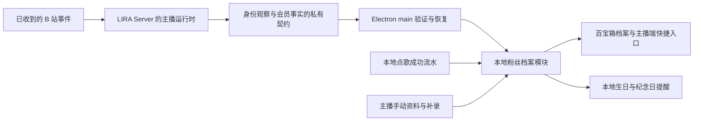

# LIRA 粉丝档案：调研报告与功能设计建议

日期：2026-09-18

状态：调研与设计建议，尚未成为已接受规格；本次未修改业务代码。

目标入口：**百宝箱 → 主播工作 → 粉丝档案**。

核心用户：需要长期记住观众、以大航海粉丝为重点的主播。

## 1. 结论与推荐方向

建议把粉丝档案做成主播的**关系记忆工具**：开播时能迅速认出这个人、接上上次的话题、查到喜欢的歌；下播后能补充互动、核对上舰记录、准备生日和纪念日。

第一版应覆盖六件事：

1. 用稳定身份关联一个人的资料，昵称更新后仍是同一份档案。
2. 保存称呼、生日、星座、MBTI、共同话题、需要避开的话题和私人备注。
3. 已建档粉丝成功点歌后自动留档，支持手动补录歌曲与明确偏好。
4. 分开管理上舰事件、会员有效期、累计在舰天数和本轮连续在舰天数。
5. 为开始使用 LIRA 前已经上舰的人提供日期与天数补录。
6. 在主播端集中提示生日、在舰里程碑、周年和自定义纪念日。

推荐界面为**粉丝列表、快速档案、完整详情、今日提醒**。平时从百宝箱管理，直播中从点歌人的姓名直接打开快速档案。沿用 LIRA 的桌面布局、字体、颜色和控件，不引入新前端框架。

最重要的技术结论：**现有“服务器礼物数据已经到本地”不等于“本地已经有建档需要的身份和会员信息”。** 当前礼物展示协议明确不传 UID，也没有会员生效与到期字段；自动上舰归档需要新增经过授权的档案数据契约。现有点歌流水则已经保存点歌人 UID、歌名、歌手和分类，可作为联动基础。详见第 4 节。

本报告采用以下暂定产品选择，均属于建议而非已经确认的需求：开播查询优先、下播整理兼顾；私密档案第一版本地保存并支持备份；完整跨电脑档案同步另立阶段。“mtbi”按“MBTI”理解。

## 2. 调研方法与证据范围

本次同时检查了公开产品资料与当前工作区：

- 用户提供的视频及其公开标题、作者简介；同类 B 站工具的作者仓库。
- Patreon 会员管理、Monica 人际关系管理、HubSpot 联系人档案、Microsoft 时间线等官方资料。
- Ant Design 与 Microsoft Fluent 2 官方设计文档。
- `D:\Work\Live` 的百宝箱、点歌存储、直播事件与礼物同步代码，以及 `D:\Work\lira-server` 的设备协议、入场解析、上舰礼物解析。

**证据边界：**参考视频的公开元数据接口返回成功，核实了标题、作者“莉岚Lena”、157 秒时长和简介。网页／播放器读取不稳定，因此没有完成逐帧观看，也没有安装或实测该软件。下文涉及它的功能，均标作“作者介绍”，不推断视频里未核实的具体交互。其他产品也以官方文档、作者说明为依据，不等同于实机测评。

仓库内有大量正在进行的其他修改，本报告只做只读核查并新增本文；所述实现事实对应调研时工作区，不代表生产服务器已经部署相同版本。网页按本次访问日期核实，不据搜索索引日期推断软件活跃程度。

## 3. 类似产品如何设计，LIRA 应借鉴什么

### 3.1 直接相关工具与创作者会员管理

| 产品／资料 | 已核实的设计或能力 | 对 LIRA 的启发 | 使用边界 |
| --- | --- | --- | --- |
| 星河牌粉丝档案管理库，用户提供的视频 | 作者介绍包含本地档案、生日／上舰周年／观看纪念日提醒、大航海有效期、舰礼寄送台账与支出记账；明确为手动录入或导入 | 档案、会员周期和纪念日确实构成一个完整工作流；旧粉丝导入与备份应从第一版考虑 | 未实测；不能以“自动核算有效期”推断能够自动取得 B 站真实到期日。[作者视频](https://www.bilibili.com/video/BV1d4bJ64E1R/) |
| 神奇弹幕 MagicalDanmaku，历史案例 | 原作者更新记录中，v5.0 增加粉丝档案，v6.0 增加历史弹幕／档案展示及最新发言者的实时档案；也有点歌相关功能 | 档案入口应贴近直播互动，最新出现的人值得快速查询；不照搬自动行为画像 | 原作者公告已自 2025-12-25 停止项目，仓库已归档，仅作历史设计参考；未据此确认生日、话题、雷区等全部能力。[历史更新](https://github.com/iwxyi/MagicalDanmaku/blob/master/CHANGELOG.md)、[项目状态](https://github.com/iwxyi/MagicalDanmaku) |
| bilibili-message-helper | 作者提供舰长礼物私信工具，使用模板与兑换码完成福利发放 | 舰礼履约是相邻需求，未来可把领取／发放结果关联到人 | 本次不纳入自动私信、地址采集或福利发货；该工具不能作为完整档案系统的证明。[作者仓库](https://github.com/Xinrea/bilibili-message-helper) |
| Patreon Relationship Manager | 官方把成员列表、会员状态、等级、加入日期、备注、到期信息、筛选、详情抽屉与导出放在同一管理流程中 | “一个人”与“这个人的某段会员关系”分开；列表用于找人，详情用于理解历史 | Patreon 的计费状态和规则不能直接套到 B 站大航海。[官方说明](https://support.patreon.com/hc/en-us/articles/360045516212-How-to-use-your-Relationship-manager) |

直接竞品给出的启示是：第一版要把资料记录、会员补录和提醒做好；点歌与实时身份联动可以成为 LIRA 的主要增益。神奇弹幕的归档状态以原作者公告为准，搜索中仍能找到的旧镜像不代表原项目继续运营。现有公开证据不足以给这些工具做准确的价格、稳定性或市场占有率排名，因此本报告不做这类结论。

### 3.2 成熟档案产品与大厂交互原则

| 参考 | 官方资料能支持的事实 | 本方案的设计推导 |
| --- | --- | --- |
| Monica | 以联系人为中心集中笔记、互动、重要日期和提醒；生日可以只填月日而不填年份 | 生日年份可空；关系记忆不用强迫填写完整个人信息。[联系人功能](https://www.monicahq.com/en/features/)、[无年份生日](https://www.monicahq.com/en/blog/birthdays-without-year/) |
| HubSpot | 联系人页分开基础属性、概览、活动时间线及关联资料 | 档案页区分“这个人是谁”和“发生过什么”；不要把所有内容塞进一个大备注框。[档案布局](https://knowledge.hubspot.com/object-settings/customize-records) |
| Microsoft Power Apps／Dynamics 时间线 | 以时间流集中活动、笔记等记录，支持筛选、搜索和置顶 | 互动记忆按时间记录，当前最重要的提醒可以置顶；直播时先看摘要。[官方时间线说明](https://learn.microsoft.com/en-us/power-apps/user/add-activities) |
| Ant Design | 按信息重要性、操作频率和关联性组织展示；表格适合结构化比较，折叠和时间线适合细节与历史 | 列表保留少量列；完整内容渐进展开；空值和未知状态明确表达。[数据展示规范](https://ant.design/docs/spec/data-display/) |
| Microsoft Fluent 2 | 窗口变宽时可并列列表与详情，变窄时调整结构，保留关键内容和操作 | 在 Electron 的实际可用内容宽度内，宽窗用列表加侧栏，窄窗切换详情；避免强塞三栏。[布局规范](https://fluent2.microsoft.design/layout) |

这些是设计依据，不要求安装相应组件库。LIRA 应借鉴信息组织与交互方式，继续使用现有 Vanilla JS、原生 CSS 和设计 token。

### 3.3 功能取舍

适合第一版的内容：身份与称呼、自由备注、互动记忆、话题与注意事项、歌曲与偏好、会员记录、纪念日、搜索筛选、导入备份。

适合后续扩展的内容：舰礼领取／寄送、联系待办、跨电脑同步、可授权的房管协作。它们在其他产品中有依据，但超出本次核心需求。

不建议作为默认功能：按消费金额给人排“价值等级”、自动推断 MBTI 或心理状态、自动抓取私人信息、全量弹幕长期入档、未经选择自动发送生日祝福。它们会增加维护成本，也容易让“记录事实”和“主观判断”混在一起。

## 4. LIRA 当前能力与缺口

### 4.1 已核实的实现事实

| 环节 | 当前证据 | 对设计的影响 |
| --- | --- | --- |
| 百宝箱 | 已有“主播工作”分组，包含“主播工作台”；导航与功能模块分离 | 粉丝档案作为同级工具加入，避免增加新的主导航页面 |
| 点歌流水 | `queue-store.js` 在同一事务写入 `queue` 与 `requests`；有 `requester_uid`、`requester_name`、歌名、歌手、分类、来源和时间 | 能在点歌被接受后按 UID 关联；无需从 OBS 点歌板 DOM 读取或二次猜测 |
| 点歌完成状态 | `queue` 有 waiting/current/done/deleted 等状态，`requests` 保存请求事实 | “点过”与“播放／处理完成”必须分开；队列 done 不能直接证明主播唱完 |
| 老点歌归属 | 现有 `requests` 表本身没有 `streamerId`／owner 字段 | 新功能必须补充归属；旧记录不能自动认定属于当前登录主播 |
| 入场身份 | Server 的 `bilibili-entry.js` 解析 UID、完整昵称和身份提示，`room-monitor.js` 交给欢迎服务 | 有可复用的入口；目前核查到的设备协议没有专门供档案使用的入场同步契约 |
| 本地昵称来源 | 本地弹幕管线、用户资料服务和点歌链已有 UID／昵称 | 可以作为在线补充；需按事件发生时间更新，不能让迟到旧数据覆盖新昵称 |
| 礼物同步 | Device 协议中的礼物 DTO 明确不传 UID；可选 display 仅增加头像、guardLevel | 昵称和头像都不能作为可靠关联键；现有礼物流不足以自动建档 |
| 会员期限 | 上舰解析器服务于礼物账本，当前对外 DTO 没有会员起止日期；部分起始字段用于构造事件身份 | 不得把礼物数量、金额或事件时间直接解释成真实到期日 |
| 清理行为 | 数据清理实现存在删除 `requests`／`queue` 的路径 | 档案需要保留自己的已归档歌曲快照，避免清空运行记录后记忆一起消失 |
| 视觉基础 | 现有共享样式已有粉色主色、青绿色操作强调色、中性色、字号与间距 | 新页面直接继承现有桌面系统，不另造一套视觉主题 |

代码定位：

- [百宝箱分组](../../public/pages/admin/toolbox/shell-start.html)、[页面装配](../../src/server/admin-page.js)、[导航模块](../../public/js/admin/other.js)。
- [点歌领域规则](../../src/music/queue-service.js)、[点歌事务](../../src/storage/queue-store.js)、[数据库定义](../../src/storage/schema.js)、[数据清理](../../src/storage/database-clear-operations.js)。
- [本地消息入口](../../src/server/bilibili-client.js)、[本地直播运行时](../../src/server/bilibili-runtime.js)。
- [礼物数据契约](../../src/shared/processed-gift-contract.js)、[远端礼物同步](../../src/electron/remote-gift-controller.js)、[设备 API 客户端](../../src/electron/license/remote-license-client.js)。
- [LIRA Server 设备协议](../../../lira-server/docs/protocol/client-server-api.md)、[入场解析](../../../lira-server/src/lib/bilibili-entry.js)、[房间监听](../../../lira-server/src/modules/bilibili/room-monitor.js)、[上舰礼物解析](../../../lira-server/src/modules/bilibili/gift-parser.js)。
- [共享设计 token](../../public/css/styles-base.css)。

补充：架构入口 README 对本地监听有较宽泛的“暂停”描述；更具体的 server-core 文档及当前代码仍保留弹幕／点歌等本地处理，暂停的是本地礼物检测。本文不据入口摘要推断点歌链已经全部迁到 Server，也不修改该文档差异。

### 4.2 自动化能力分级

| 用户希望的行为 | 第一版能否承诺 | 条件 |
| --- | --- | --- |
| UID、备注、生日、MBTI、话题等手动维护 | 可以 | 新增档案模块 |
| 已建档粉丝点歌后自动归档 | 可以设计并落地 | 使用已接受的点歌事务结果；增加主播归属与可恢复的归档机制 |
| 手动添加喜欢的歌和类别 | 可以 | 与自动统计分开保存 |
| 入场时更新昵称 | 条件性可以 | 新增私有身份观察同步；上游确实提供完整 UID／昵称时更新，不保证每次入场都有事件 |
| 上舰／续舰自动建档 | 条件性可以 | Server 提供带稳定身份与去重标识的会员事件 |
| 自动补齐使用软件前的全部上舰历史 | 不能承诺 | 取决于当前可访问历史的范围；无历史则手动补录 |
| 精确到期时间 | 不能无条件承诺 | 必须有已验证含义的会员到期数据，或用户手动确认日期 |
| 累计／连续在舰天数 | 可以显示，需标明依据 | 完整区间或可靠补录基线才能准确计算；不完整时显示“已记录”或“待确认” |
| 生日／里程碑提醒 | 可以 | 档案日期或会员口径有效；桌面关闭期间第一版不保证即时提醒 |

## 5. 信息架构与桌面界面

### 5.1 入口与首页

在“百宝箱 → 主播工作”下新增：

- 名称：**粉丝档案**。
- 副标题：**记住每位粉丝的故事与重要日子**。
- 位置：与“主播工作台”相邻。
- 百宝箱导航只负责切换；档案查询、编辑和保存由独立功能模块负责。

一级界面只保留两个页签：**档案**、**提醒**。设置、导入、导出、备份放在右上角更多操作。已有工作台日历未来可显示相同提醒的只读入口，不复制一套日期规则。

档案页顶部是标题、搜索与“新建档案”，下面是简洁的今日提醒摘要和快捷筛选。提醒为空时不展示空的大卡片。

推荐快捷筛选：全部、在舰、曾上舰、特别关注、待补资料。未知会员状态独立可筛选，不混进“已过期”。筛选结果允许交集，但身份不是人的永久分组：到期后档案和互动全部保留。

### 5.2 列表与详情

单独浏览列表时，可按以下信息组织；与详情并排时收敛为紧凑人物列表，不把六列挤进侧栏：

| 列 | 展示内容 |
| --- | --- |
| 粉丝 | 头像、常用称呼／昵称、UID；有备注名时同时保留当前平台昵称 |
| 大航海 | 等级与当前状态，必要时带“待核实” |
| 关系摘要 | 一句手写识别信息，或最多两个话题标签 |
| 最近互动 | 最近一次已记录互动时间，不写成“最后在线” |
| 下个重要日子 | 生日、里程碑或自定义纪念日 |
| 操作 | 打开档案；次要操作收进菜单 |

不要在主表中同时铺开 MBTI、星座、全部备注、所有天数和完整歌单。主播首先要找到人，字段编辑在详情内完成。

宽窗口默认采用紧凑人物列表与非模态档案面板并排：列表每行只保留称呼／昵称、大航海状态和一句关系摘要，UID、完整日期及长备注移入详情；排序默认最近互动，特别关注通过筛选查看。选人不会打开新的弹窗，也不会因为新事件到达自动跳到另一个人。可用空间不足时改为单栏详情并提供返回，保留搜索、筛选、滚动位置。窗口断点应按百宝箱扣除导航后的内容宽度验证，不直接套手机网站断点。

档案面板统一提供四个页签：**概览、互动、音乐、大航海**。“快速档案”是这个面板的紧凑展示，“展开档案”只是给同一内容更多宽度，不再维护另一套详情页面。展开或收起时保留当前粉丝、页签和未提交输入。基础资料与自由备注放在概览，纪念日可从概览编辑，所有人的提醒集中在“提醒”页。

### 5.3 布局示意

以下均为虚构示例与低保真信息结构，不代表已实现界面或真实粉丝数据。

```text
百宝箱 / 主播工作 / 粉丝档案

档案  提醒                         搜索昵称、备注名或 UID     ＋新建  ···
今日：生日 1 人 · 在舰里程碑 1 人                           查看提醒 →

全部  在舰  曾上舰  特别关注  待补资料

粉丝列表                            快速档案
─────────────────────────────      ─────────────────────────────
小海 / 海边听歌   舰长               小海                   ☆关注
吉他、粤语歌                         海边听歌 · UID 900000001
下个重要日子：明天生日               生日 09-19 · 明天

阿遥 / 遥远的风   曾上舰             可以聊：最近在练指弹
游戏、动画                           注意事项 1 条           展开
最近互动：09-16                     上次：聊到准备录一首翻唱

……                                  常点：粤语 · 最近《虚构曲目 A》
                                    连续在舰：待补日期
                                    到期：2026-10-02（手动确认）

                                    记一笔    添加纪念日    展开档案
```

```text
展开后的同一档案：小海                 编辑资料    记一笔    ···
当前昵称 海边听歌  /  UID 900000001  /  平台信息更新于 09-18 20:03

概览      互动      音乐      大航海

先记住这些                            基础资料
常用称呼：小海                        生日：09-19（不记录年份）
共同话题：吉他、粤语歌                 星座：处女座（按公历月日提示）
最近约定：下次聊新学的指弹曲           MBTI：INFP（本人自述）
注意事项：点击查看                     下个提醒：明天生日

自由备注                              最近记忆
喜欢慢一点的聊天节奏……                09-18 点了《虚构曲目 A》
                                      09-16 聊到练琴；主播手动记录
```

### 5.4 直播中的最短路径

在主播端点歌队列的点歌人姓名旁提供“档案”按钮。有明确身份时一次点击打开快速档案；没有档案时显示“为该 UID 建档”，预填已知资料。按钮不进入 OBS 公开点歌板。

快速档案默认显示概览，按“称呼与身份 → 基础资料 → 可以聊什么 → 相处提醒入口 → 最近共同经历 → 个人备注”组织。临近生日在基础资料旁提示；常点／喜欢的歌通过音乐页签查看。完整生日年份、长备注、来源详情按需展开。

“记一笔”只需要内容，默认填当前时间，可选话题／提醒，不要求填一整张表。昵称自动更新不得把正在输入的手写内容刷新掉；保存失败保留输入并明确显示“未保存”。

不在每次入场时自动弹出大抽屉。档案页标记“本场最近出现”，需要时由主播打开；生日等提醒采用汇总条或轻提示，避免打断唱歌。

### 5.5 视觉方向

以 LIRA 现有浅色桌面界面为基础：中性底色、清晰文字、细分隔线，现有粉色用于少量强调，青绿色继续承担操作／选中状态。生日可以有轻量节日标识，但不让每行都变成彩色大卡片。

复用当前字号层级和间距 token。档案阅读正文建议沿用 14px 主体字，UID 与来源说明为次级信息；密集表格保持状态文字完整。长昵称截断时可查看全文；颜色同时配文字，不单靠红绿区分状态。

“雷区”在界面中建议命名为**相处提醒**，说明为“哪些话题不适合提起”。记录具体偏好，例如“不喜欢被拿年龄开玩笑”，避免只有“敏感”“难相处”等难以行动的标签。

### 5.6 首屏与交互细化

首屏固定三个重点：找到人、看清当前人的识别摘要、快速记下一次互动。顶部提醒只占一行，没有提醒时收起；提醒有自己的页签，不在人物详情内再放一块全局提醒看板。

概览按“基本资料 → 可以聊的话题 → 相处提醒入口 → 最近的一段记忆 → 个人备注”组织。生日等临近事项可以出现在当前人物身份区，点歌观察在音乐页展开。相处提醒默认折叠，主播主动打开才展示正文。

音乐页先展示人工确认的“喜欢／不喜欢”，再展示“点歌观察”及其统计范围，最后列出具体歌曲记录。大航海页先展示当前等级、有效期及其来源，再展示累计／连续天数与历史，缺少日期时给“补录日期”动作。

以虚构资料制作的交互示例用于评审上述信息优先级：可切换人物与页签、搜索筛选、展开档案、记录互动和处理提醒。示例中的保存仅改变演示内容，不连接业务数据库；最终桌面实现仍需按第 14 节验收。

## 6. 档案字段与身份规则

### 6.1 建议字段

| 分组 | 字段 | 填写与更新规则 |
| --- | --- | --- |
| 身份 | 平台、UID、内部档案 ID | UID 使用字符串；有效身份决定自动关联 |
| 识别 | 当前昵称、历史昵称、头像 | 来自同一身份的新观察；保留改名历史，不覆盖手写称呼 |
| 称呼 | 备注名／常用称呼、识别摘要 | 主播手动维护，摘要建议一句话 |
| 关系 | 特别关注、标签 | 手动设置；与付费等级分开 |
| 生日 | 月日、可选年份、历法、提醒规则 | 年份非必填；未知保持空值 |
| 星座 | 自动提示值、手动值、来源 | 公历月日可生成常用太阳星座提示；边界日期允许手改，不从农历月日直接算 |
| MBTI | 16 型之一、未知、说明、确认日期 | 主播根据本人自述填写，不自动推断；不把类型当性格事实 |
| 交流 | 共同话题、相处提醒、下次想聊 | 每项可带说明、记录时间与来源，支持失效／归档 |
| 自由内容 | 普通备注、置顶摘要 | 适合不能结构化的内容；时间性故事进入互动记录 |
| 行为 | 点歌历史、明确喜欢／不喜欢、常点分类 | 明确偏好由人确认；统计内容只作为参考 |
| 会员 | 当前等级／状态、观察时间、起止区间、手动基线 | 自动证据、手动修正、未知状态分别表示 |
| 时间 | 创建时间、最近互动、首次已记录出现、纪念日 | “首次记录”不自动写成“第一次认识”或“首次观看” |

不默认添加电话、住址、真实姓名、职业、收入等与本次场景无直接关系的字段。用户自己的普通备注可记录必要内容，但系统不主动去外部补全这些信息。

### 6.2 唯一身份与昵称

档案归属至少是：**服务器来源 + 已认证主播 streamerId + 平台 + 身份类型 + 外部身份值**。同一个粉丝在不同主播处的备注互不共享；直播间 roomId 是外部属性，不代替主播授权边界。

对常规 B 站 UID 建唯一关联。开放平台 `open_id` 与公开 UID 是不同命名空间：当前解析代码有把多种身份放进 `uid` 字段的兼容处理，新档案不能沿用这种模糊语义直接合并。没有可靠映射时标记“身份待关联”，不能按昵称、头像或相同数字串猜测。

手动建档仅要求常用称呼；有 UID 时即可关联，没有 UID 时保存为未绑定草稿。绑定时若该 UID 已有档案，展示现有档案并由用户选择合并资料；不产生两个同时接收自动事件的档案。合并应保留来源和可恢复记录。

昵称自动更新规则：

1. 同一认证主播下，收到带可靠身份、完整昵称和观察时间的入场／弹幕／点歌／送礼资料时更新。
2. 空昵称、占位“观众”、截断昵称和较旧观察不能覆盖较新的完整昵称。
3. 平台昵称变化只影响平台资料；备注名、话题、生日、偏好和私密备注保持独立。
4. 显示“最近获取：某时间”；事件没到或断线时保留旧值，不能承诺每次进入直播间都会刷新。
5. 某条消息缺少 guardLevel 不代表已经下舰；会员状态由专门证据维护。

### 6.3 谁会自动建档

首次开启时提供简明选择，推荐为：**已建档粉丝自动更新；收到可验证的大航海记录时自动建档**。普通观众、普通点歌默认不批量建档，需要时从点歌人入口手动添加。

自动建档只填已知事实并标记“待补资料”。生日、话题、雷区、MBTI 留空，不生成看似完整的虚构人物介绍。用户关闭自动建档后，已有档案仍可按单独的自动更新设置接收事实。

## 7. 互动、共同话题与个人备注

需要区分三种内容：

- **长期资料**：常用称呼、长期兴趣、相处提醒。
- **互动记录**：某次聊了什么、某首歌对对方有什么意义、某次共同活动。
- **待跟进的约定**：下次想问什么、答应唱什么；可附提醒日期和完成状态。

互动记录最小字段为发生时间、内容、来源；可加类型、关联歌曲／事件、置顶。时间线提供“全部／手记／点歌／大航海／纪念日”筛选，默认不把每次入场都刷成一条占屏记录。

共同话题不是只有标签。例如“游戏”只能用于检索，“最近在玩某款游戏，卡在第二章”才有助于接话。建议用“标签 + 一句话详情 + 最近确认时间”的形式。

相处提醒支持常驻与临时两类语义：例如“不要在直播间公开生日”长期有效，“近期不聊考试成绩”可设置复查日期。过时条目可归档，历史互动不被改写。

普通备注保留一个自由文本区，不把备注变成几十个必填字段。直播快速入口优先展示用户置顶的一句话；长文放在详情中。

自动记录可以保存点歌、上舰等结构化事实。聊天内容默认由主播选择“记一笔”后保存；第一版不持续收集所有弹幕，也不自动推断私人特征。

## 8. 点歌板联动与音乐偏好

### 8.1 何时保存

触发点是**点歌请求被业务接受并成功持久化**。弹幕刚出现、匹配失败、队列满或重复被拒绝，都不产生一条“点过这首歌”的正式记录。

只有事件身份能匹配当前主播下的已有档案时才自动归档。新建档案时可以选择补入本机旧点歌记录，但只处理有可靠 UID 和可验证主播归属的部分；旧表缺归属的数据先展示数量和范围，由用户确认，不默认为当前账号的数据。

点歌存储拥有“请求是否成功”的判断；档案模块只消费已经确认的结果。不要把保存逻辑绑到页面打开、列表渲染、OBS 页面刷新或 WebSocket 重复广播。

### 8.2 记录内容

每条记录保留：歌曲名称与歌手快照、当时的曲库分类、点歌时间、点歌人身份、来源、可用的请求 ID／队列 ID，以及可选备注。若能够可靠关联音乐平台曲目 ID，也一并保存。

歌库歌曲之后改名、改分类或被删除，原点歌事实仍可读。展示当前曲库对应项可以作为辅助链接，不覆盖历史快照。

状态区分“已点歌”“已加入队列”“队列已处理”“已撤销／移除”。如产品未来提供主播显式“已唱”动作，再记录“已唱”；播放器播完伴奏、手动下一首、队列 done 都不足以单独证明完成演唱。

幂等键使用当前归属和稳定事件标识。同一次重连、重放、重复回调只记一次；同一个人隔天再次点同一首歌，是新的有效记录，不能按歌名永久去重。

### 8.3 手动添加与修正

“添加歌曲”提供三个清楚的动作：补记一次点歌、标记喜欢、标记不喜欢。补记需要日期，可选择曲库或自由输入；喜欢／不喜欢表示偏好，不虚增点歌次数。

错误关联可以解除并更正，自动事件原始依据保留；不能让重放立即把已经排除的错误记录重新加回。手动录入需标“手动补录”，不是冒充平台事件。

### 8.4 喜欢听什么类别

界面分两块：

| 区块 | 示例 | 规则 |
| --- | --- | --- |
| 明确偏好 | 喜欢粤语、喜欢慢歌、不喜欢某首歌 | 主播根据交流确认，可写原因；始终保留人工结论 |
| 点歌观察 | 近 90 天已记录 8 次，其中粤语分类 5 次；2 次未分类 | 从记录统计并显示时间范围、次数与分类缺失情况，不直接写“他一定喜欢粤语” |

曲库现有分类可能是“会唱／练习中”等工作分类，不一定是音乐风格。因此先展示“常点曲库分类”；只有分类被确认是风格／语种时再用作对应偏好提示。多标签分类的计数口径要注明，不能把多次计数百分比凑成一个饼图。

样本少时只展示具体记录，不生成偏好断言。主播可把观察结果“添加为偏好”，也可忽略；自动统计不得覆盖明确喜欢／不喜欢。随机点歌或替别人点的歌可保留事实但排除在偏好统计外。

## 9. 大航海记录、老舰长补录与天数

### 9.1 必须拆开的六个概念

| 概念 | 含义 | 不应混用为 |
| --- | --- | --- |
| 上舰／续舰事件 | 某时发生了一次购买或变更行为 | 完整会员期限 |
| 当前状态／等级 | 最近证据显示的在舰情况及档位 | 全部历史都已完整 |
| 首次上舰日期 | 最早一次真实上舰的日期，需要历史或人工确认 | LIRA 第一次收到事件的时间 |
| 本轮连续在舰 | 当前未中断的有效期连续覆盖 | 从首次上舰到今天的自然天数 |
| 累计在舰 | 历次有效会员区间合并后累计的天数 | 总购买数量 × 固定天数 |
| 到期时间 | 当前已确认权益覆盖的终点 | 最近购买时间、预计扣费日或礼物出现时间 |

另可提供“首次上舰至今”的关系纪念天数，但必须用此名称。它允许包含中间断舰的日子，因此不替代累计／连续在舰。

### 9.2 到期时间的证据等级

1. **平台确认**：通过已经验证字段含义的上游数据得到明确起止边界，并记录来源、时间与精度。
2. **手动确认**：主播依据后台或本人确认补录；记录修改时间与说明。
3. **估算／待核实**：只有购买数量、单位或不完整历史；可供人工核对，不作为确定事实展示或自动发出到期结论。
4. **未知**：没有足够依据，显示“待补到期时间”。

建议第一版宁可保留未知，也不默认用“一个月 = 30 天”。跨月、活动赠送、短期体验、提前续费、升降档和退款等情况必须按实际含义处理。当前代码的礼物金额结算规则不能直接复用为会员期限规则。

等级与期限分开保存：更高等级的短期有效期结束，可能仍有其他有效记录；不能用“最近购买的档位”永久覆盖全部资格。没有足够数据时保留待核实状态。

### 9.3 已上舰后才开始使用：三种补录方式

| 用户掌握的信息 | 录入方式 | 系统结果 |
| --- | --- | --- |
| 知道开始和到期日期 | 添加历史／当前有效区间，可填等级与说明 | 从已确认区间计算天数和提醒 |
| 只知道“截至某日已累计在舰 N 天” | 填累计基线 N、截至日期、数据来源；当前到期可另填 | 展示“累计 N 天，含手动补录”；不反推首次上舰或连续天数 |
| 只知道“本轮连续在舰 N 天” | 填连续基线 N、截至日期，并确认这一轮连续；首次上舰另填 | 显示当前连续基线；只在后续连续有效期有证据时递增 |

表单默认“截至日期”为今天，但可改。单独的“手动更新日期”用于编辑当前到期日或基线；修改前展示会影响哪些天数和提醒，保存后写一条修正记录。

示例：9 月 18 日填写“截至今日累计在舰 120 天”，已确认之后 9 月 19 日仍有效，则累计可增加为 121 天。它不意味着首次上舰在 120 天前；若后续资格不明，仍保留截至日期，不让数字无限增长。

之后取得覆盖基线之前的历史时，先比对重叠范围，再让用户选择用完整历史替代基线或保留原基线。**不能把基线 120 天再加上同一段自动历史 120 天。** 历史缺失不当作零天，也不自动判断断舰。

### 9.4 建议统一的日期口径

- 业务时区第一版采用 Asia/Shanghai，并在日期说明中注明；实际事件时间保存为标准时间戳，纯生日月日单独存储，不做时区转换。
- 精确有效期内部采用开始包含、结束不包含的区间；手填“有效至某日”明确为该业务日结束。仅日期精度不能伪装成平台精确秒级结果。
- 当前累计／连续天数只统计到查询当日，不计未来的有效期。累计天数以截至查询时刻已发生、且被已确认有效区间覆盖的业务日计数，同一天、重叠区间、多档身份不重复计入；当天已生效即计为一天。日期补录须展示此口径。
- 已确认的未来有效期只用于预测里程碑日期；未到达的天数不能标记为已完成或触发当日庆祝。续费到年底不意味着今天已在舰到年底。
- 连续性优先由真实区间是否连续决定。日期级补录不能证明小时级无间断，显示“按日期补录”，精度冲突时待核实。
- 基线截至日已经包含在 N 内，后续只计该日之后的新有效日；未知缺口不自动补齐。
- 第 100 天与满一周年分别计算。周年按日期，不能把所有周年统一当成 365 天。

### 9.5 重复消息、续费与修正

同一笔上舰可能有多个消息表现。服务端应在会员领域根据可靠事件／订单证据合并后输出一个事实，而不是让客户端把每个消息都加一次天数。

续费事件更新有效区间，不能仅在界面累计数字；中断后重新上舰产生新的连续段，累计仍保留以前的有效天数。退款／撤销有明确证据时重算并保留修正依据；没有证据时不得凭昵称消失或暂未出现来推断。

人工修正保存为独立修订，不直接篡改原始自动事件。新数据与手动修正冲突时进入“待核实”，给出两种来源和时间，避免后台悄悄覆盖。

## 10. 生日、节日与里程碑提醒

### 10.1 提醒种类

| 种类 | 推荐规则 |
| --- | --- |
| 生日 | 公历月日每年重复，年份可空；默认当天，用户可另开提前 7 天 |
| 连续在舰里程碑 | 推荐 30／100／365 天，可按人关闭；只基于可信连续数据 |
| 累计在舰里程碑 | 单独命名“累计在舰满 100 天”等，不与连续混用 |
| 首次上舰周年 | 首次上舰日期经确认后，按周年计算；断舰不影响这个关系纪念日 |
| 相识／首次观看纪念日 | 主播手填真实日期；“首次被软件看到”只能作为另一条记录 |
| 自定义节日／纪念日 | 名称、日期、一次性或每年重复、提醒提前量与备注 |
| 到期提醒 | 可选，仅用已确认的到期边界；显示来源，不自动向粉丝催续费 |

农历生日属于需要明确实现的差异：最终产品应支持历法字段与闰月语义。第一阶段若没有经过验证的农历转换能力，应明确显示“农历生日，待设置本年提醒”，允许手动填本年对应日期；不能按农历数字直接当作公历每年触发。完整农历自动换算列入后续明确验收项。

2 月 29 日的生日默认非闰年在 2 月 28 日提醒，并允许改为 3 月 1 日；创建时明示规则。出生年份未知不影响月日提醒；星座提示只使用确认的公历月日或人工值。

### 10.2 展示与提醒状态

“提醒”页按今天、未来 7 天、之后分组。每条显示粉丝、事项、依据和快捷动作：打开档案、记已祝福／已处理、稍后提醒、忽略本次。大航海推算不确定的事项进入“待核实”，不混进正式祝福清单。

默认仅在 LIRA 内提醒，系统通知作为可选项。生日、注意事项、昵称之外的备注不自动发到弹幕、私信、欢迎语或 OBS。

同一人同一天的多个事项合并展示。提醒按“档案 + 规则 + 本次发生日期”去重；重新打开页面、程序重启或重连不能重复轰炸。编辑日期取消旧的未处理提醒并生成新日期事项，已处理记录保留；无关备注修改不能让同一提醒复活。

桌面关闭时不承诺即时执行。下次打开汇总今天与最近 7 天未处理的重要事项，过期内容标“已错过”，不连续弹出历史通知。以后若需要关机期间提醒，再单独设计服务器执行与通知授权。

## 11. 数据组织与模块边界建议

本节是实现方向，具体表名和 API 尚未定稿；需要在实施前转为正式规格，不能直接当作已存在的接口。

### 11.1 推荐的数据流



服务器已有事件入口，建议在所属主播运行时内产生明确的“身份观察”和“会员事实”，只传必要结构化资料。**优先新增受控的粉丝档案契约，不让通用礼物展示数据承担私人档案职责，不把原始包塞进通用快照。** 现有礼物 Device 接口本身也需要认证，并非公开接口；这里区分的是数据用途。端点、协议版本和兼容策略需双方共同确认。

该链路与私人备注上传是两件事：第一版可以接收服务器已观察到的直播事实，同时让主播写的生日、话题与私人备注仅保存在本机。

### 11.2 最小逻辑实体

| 实体 | 职责与关键内容 |
| --- | --- |
| FanProfile | 内部 ID、主播归属、平台身份、称呼、生日、MBTI、摘要、归档状态 |
| IdentityObservation | 昵称／头像观察、来源和发生时间；支持改名历史及排除旧覆盖 |
| InteractionNote | 主播手记、共同经历、话题、相处提醒；关联歌曲或会员事件可选 |
| FanSongRecord | 已归档点歌快照与手动补录、稳定来源键；不依赖活跃队列生存 |
| MusicPreference | 明确喜欢／不喜欢、风格／语种／歌手标签与依据 |
| MembershipRecord | 上舰事件、有效区间、等级、置信来源与修订；人工基线需单独语义 |
| Reminder | 日期／里程碑规则，以及本次事项的处理状态 |

这是逻辑划分，不要求七个独立服务或七个数据库。实施时按现有存储层与迁移规范落地；身份、备注、天数归档应属于同一个粉丝档案领域。

### 11.3 一致性与恢复

- 主播归属由认证边界决定。客户端缓存还要区分服务器来源与稳定 streamerId；切换账号后停止旧任务，迟到响应不能写入新账号档案。
- 服务器提供的档案同步至少要能表达事件稳定 ID、发生时间、身份类型、来源范围、版本／游标和历史覆盖范围。仅有实时通知不足以承诺离线补齐。
- 昵称可以用最新快照恢复，不必永久保存每次入场；需要精确累计的会员事件则应持久化并可恢复。超过可恢复范围时显示缺口。
- 一条事实入档与消费游标应原子提交，重复读取安全；程序在点歌成功后崩溃，重启应能从已持久化且带归属的请求补齐。
- 自动字段、手动字段、统计结果分开维护；不使用一个整档“最后写入获胜”覆盖人工内容。
- 第一版私密资料不进入现有 settings 全量同步，不以 JSON 塞进无关设置键。跨电脑同步需另立记录版本、冲突和删除传播契约。
- 现有礼物协议刻意排除 UID。新增私有身份能力需要更新 Server requirement、acceptance、protocol／OpenAPI 和双方测试，不能只改客户端期待更多字段。

### 11.4 备份、导入、归档与删除

第一版提供两种输出：可选择字段的列表导出，以及能恢复完整档案关系的版本化备份。简单 CSV 不等于完整备份；完整备份应保留身份归属、手记、歌曲快照、会员依据和提醒状态。

导入先预览新建／更新／冲突数量，按稳定身份去重；昵称相同不自动合并，空列不默认清空现有资料。跨账号／跨服务器备份不能自动并入当前档案，必须明确处理归属。

档案默认可归档、可恢复；永久删除需要单独流程。若开启自动建档，删除时提供“停止为该身份自动建档”，用最小抑制标记避免下次事件或历史回放立刻重建；彻底移除该标记前需说明会允许再建档。

删除档案不联动删除原始礼物账本。普通队列清理不删除档案副本；全量数据清理则必须明确列出是否包含粉丝档案。备份恢复前预览归属与冲突，并保留恢复前快照。

## 12. 私密信息的可见范围

这里的“仅主播可见”指 LIRA 产品内的权限与展示范围，不代表别人取得电脑或未加密备份后仍无法读取。

| 位置 | 默认可见内容 |
| --- | --- |
| 百宝箱档案详情 | 当前主播自己的完整档案；相处提醒可折叠 |
| 主播端快速档案 | 称呼、选定摘要、音乐和纪念日；长备注按需展开 |
| OBS 点歌板／公开歌单／弹幕投屏 | 沿用现有公开字段；不增加生日、MBTI、话题、雷区、私人备注 |
| 自动欢迎／答谢 | 第一版不读取私人档案字段；未来需要单独的明确公开字段选择 |
| 日志与诊断 | 记录操作结果与必要标识，避免输出备注正文和完整档案内容 |
| 导出 | 用户选择字段；明确提示导出范围，私密字段不默认进入普通列表导出 |
| AI 功能 | 第一版不把档案作为默认上下文上传 |

档案读写通过受认证的私有 API／IPC；通用 WebSocket 快照和 overlay 的订阅不承载档案。界面隐藏不能代替数据访问边界。未来房管协作需单独定义可见字段与角色授权。

## 13. 分阶段落地范围

| 阶段 | 内容 | 完成标准 |
| --- | --- | --- |
| 第一阶段：可用档案 | 百宝箱入口、身份与称呼、生日／星座／MBTI、共同话题／相处提醒／备注、互动手记、搜索筛选、手动会员区间与基线、基本提醒、备份恢复 | 离线也能完整维护一个粉丝；老舰长信息可补录；私人内容不会进入投屏 |
| 第二阶段：兑现自动联动 | 已建档粉丝成功点歌归档、点歌人快捷入口、手动音乐偏好、常点分类；私有身份／会员契约、入场改名更新、可信上舰自动建档与恢复 | 同一身份不串档，重放不重复，客户端重启不漏已确认事件；期限缺失明确待核实 |
| 第三阶段：增强能力 | 农历规则、历史导入体验、已验证会员区间的更完整恢复、工作台日历联动；按实际需求再考虑跨电脑同步与舰礼履约 | 每项有独立需求与验收，不因“别人有”直接扩充 |

**第一、二阶段共同构成本次需求的完整首发目标。** 如果先交付第一阶段，只能称为“手动档案基础版”，不能声称已完成用户要求的自动改名和大航海联动。精确到期仍受上游证据限制，手动确认路径始终保留。

建议先做一个不接真实粉丝数据的端到端样例：手动补录老舰长 → 收到新昵称 → 成功点歌 → 续舰事实去重 → 生成一个里程碑。这个样例验证最关键的数据语义，再扩展批量管理。

## 14. 验收场景

以下均使用虚构身份、隔离临时存储和模拟事件，不使用真实粉丝资料。

| 编号 | 场景 | 期望结果 |
| --- | --- | --- |
| A01 | 一个 UID 改名后再次进入 | 更新平台昵称，保留备注名和全部历史；旧时间事件不能改回旧名 |
| A02 | 两个 UID 使用相同昵称 | 两份档案，不合并；搜索结果能靠 UID 区分 |
| A03 | 只有截断昵称／没有可靠身份 | 不覆盖完整资料，不自动绑定未绑定档案 |
| A04 | 已建档粉丝成功点歌，通知重复两次 | 归档一次；隔天真实再次点同歌再增加一次 |
| A05 | 点歌失败、队列满、重复被拒绝 | 不生成成功点歌记录 |
| A06 | 歌曲改名／删除、队列清理 | 历史快照仍可读，不丢粉丝音乐记录 |
| A07 | 手动标记喜欢某曲 | 喜好更新，点歌次数不增加；自动统计不覆盖手动偏好 |
| A08 | 填累计 120 天，截至今日；之后补拉旧历史 | 重叠不双算，不凭累计数反推连续天数 |
| A09 | 只知道已上舰，不知道到期 | 显示已观察在舰／待补期限；不凭礼物金额算到期 |
| A10 | 上舰多个消息、提前续费、中断后再上舰 | 同笔不重复；续费区间合并；中断后连续段重新开始 |
| A11 | 手动到期与新平台证据冲突 | 显示来源与冲突，保留修正记录，不静默覆盖 |
| A12 | 生日只填月日、2 月 29 日、农历资料未换算 | 年份可空；闰日按已选规则；未支持的农历不触发错误公历提醒 |
| A13 | 重启、断网、离线期间经过提醒日期 | 已处理事项不重复；恢复汇总近期漏提醒，过期不刷屏 |
| A14 | 同一 UID 在两个主播账号；途中切账号 | 私人档案隔离，迟到的旧请求不能污染新账号 |
| A15 | open_id 与 UID 看起来相同 | 不自动视为同一身份；要求可靠映射或明确绑定 |
| A16 | 查询 OBS 数据、公开歌单和通用快照 | 不含私人档案字段，前端隐藏之外仍有访问隔离 |
| A17 | 档案保存失败／进程在归档前终止 | 输入保留并提示；已成功点歌从持久化来源恢复，幂等补齐 |
| A18 | 无粉丝／无筛选结果／同步未完成 | 分别显示“新建第一份档案”“调整筛选”“资料仍在同步”，不混用空状态 |
| A19 | 归档恢复、删除后有重复历史、导入同 UID | 归档可恢复；抑制自动重建有效；导入先显示冲突，空值不清数据 |
| A20 | 长昵称、普通窗口宽度、从队列进入后返回 | 关键操作可见；详情正确切换；返回保留原列表状态 |
| A21 | 9 月 18 日补录有效期为 9 月 1 日至 12 月 31 日 | 当前已在舰计 18 天；未来部分只预测提醒，不立即触发满百天 |

体验目标属于待验证指标：从点歌人入口到识别摘要尽量一次点击；快速记一笔只需要正文；相同身份的昵称和记录归档一致性应达到确定性通过。查询延迟目标应在隔离的代表性档案规模上测量，不能凭空承诺所有设备都达到某个毫秒数。

## 15. 实施前仍需核实的事项

| 项目 | 当前建议／未决原因 | 如何核实 |
| --- | --- | --- |
| 主要场景 | 暂按直播认人优先，兼顾下播整理 | 用上述快速档案流程确认是否满足日常使用 |
| 私密资料保存 | 暂按本地、可备份；跨电脑同步没有纳入首发默认范围 | 若第一版必须换电脑即用，提升同步优先级并补冲突设计 |
| 会员到期证据 | 当前 Device DTO 不含期限，不承诺自动精准补齐 | 用授权来源的脱敏样例核实不同事件和查询字段的实际含义、覆盖范围 |
| 首次使用时的舰队名单 | 现有核查不足以保证完整历史名单可用 | 验证当前名单／历史来源；不具备时用手动或导入建档 |
| 旧点歌数据归属 | 旧 requests 无 owner 字段 | 设计明确的一次性归属确认；不把旧记录自动灌进当前账号 |
| 农历生日 | 需要历法转换与闰月规则 | 若首发必须支持，提前纳入依赖评估与日期测试 |
| 数据库迁移与恢复 | 本文只定义逻辑责任，尚未设计迁移脚本 | 实施前按存储规范确定物理表、升级、备份与回滚方案 |

这些未决项不妨碍理解和评审产品方向，但会影响自动化承诺和实施范围。尤其是到期字段和身份同步，应先验证证据，再写成必须准确完成的验收条件。

## 16. 来源目录

以下列出本文实际采用的一手材料，访问日期均为 2026-09-18；正文对应段落已注明用途。产品能力以文档为证据，不构成实测稳定性评价；已公开的停止维护状态单独注明。

1. [用户提供的星河牌粉丝档案视频](https://www.bilibili.com/video/BV1d4bJ64E1R/)：作者标题与简介；通过 B 站公开视频元数据核实，未完成视频画面实测。
2. [神奇弹幕原作者历史更新](https://github.com/iwxyi/MagicalDanmaku/blob/master/CHANGELOG.md)、[项目状态公告](https://github.com/iwxyi/MagicalDanmaku)：历史粉丝档案、实时展示与点歌能力；项目已停止并归档。
3. [bilibili-message-helper 作者仓库](https://github.com/Xinrea/bilibili-message-helper)：舰长福利发放的相邻工作流。
4. [Patreon Relationship Manager 官方帮助](https://support.patreon.com/hc/en-us/articles/360045516212-How-to-use-your-Relationship-manager)：会员列表、状态、备注、历史、筛选与导出。
5. [Monica 联系人功能](https://www.monicahq.com/en/features/)：关系记忆、私人笔记与提醒。
6. [Monica 无年份生日设计](https://www.monicahq.com/en/blog/birthdays-without-year/)：只知道生日月日时的录入方式；属于历史功能说明。
7. [HubSpot 档案布局](https://knowledge.hubspot.com/object-settings/customize-records)：属性、概览、活动与关联的组织方式。
8. [Microsoft 时间线使用说明](https://learn.microsoft.com/en-us/power-apps/user/add-activities)：活动、笔记、筛选和置顶。
9. [Ant Design 数据展示规范](https://ant.design/docs/spec/data-display/)：展示优先级、表格、折叠与时间线。
10. [Microsoft Fluent 2 布局规范](https://fluent2.microsoft.design/layout)：列表与详情在不同窗口宽度下的组织方式。

本次验证：对照以上资料和相关源码核查关键结论；完成独立读者审查，并补清“当前在舰天数不得计入未来有效期”的边界。已检查本地引用、文档结构和空白格式。仅新增报告，未运行应用、未迁移数据库、未进行真实粉丝数据采集，也未执行业务测试。
