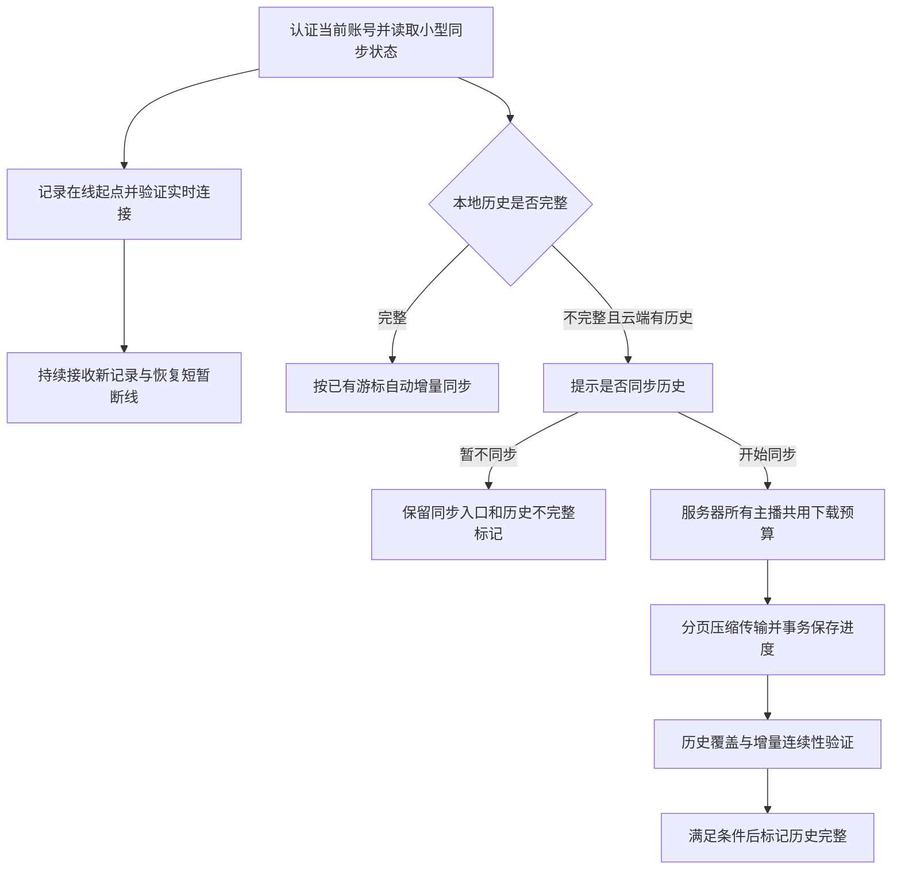

# 数据库查询优化与首次历史同步修改报告

建议保留现有 SQLite 存储布局，优先修复客户端查询放大，并把首次历史恢复改为“用户确认后，在服务器统一限速下后台补齐”。服务器带宽按 3 Mbps 出口估算，建议历史恢复功能先共用 **100 KB/s 总预算**，使用 **gzip level 1、分页、断点续传**。100 KB/s 是建议初值，可在服务器端调整，不是已经部署的设置。

本文覆盖四项查询优化和首次同步问题，给出修改位置、交互、实现约束及验收方法。初稿仅编写报告；用户随后要求按报告开始修改，已完成下述客户端查询批次。其余同步与服务器设计仍待实施，不替代当前协议、规格或已接受的 ADR。

## 实施进度（2026-09-19）

已完成队列关联索引、礼物最近列表索引、历史双向边界分页与有效版本内的计数复用、粉丝候选批量读取。song v7 / gift v12 均走正式迁移；旧时间解释、同时间 ID 降序、现有灯牌排序与来源隔离保留。参见[实施记录](../../specs/plans/archive/2026-09-19-query-optimization.md)和[存储事实源](../architecture/backend/storage.md)。没有发布或修改真实用户数据库。

基准入口：[benchmark-client-queries.js](../../scripts/benchmark-client-queries.js)，使用临时磁盘库及合成数据：10 万礼物、1,000 档案/50,000 明细、10 万条点歌流水。每项单列首次读取，随后保存 30 次热态原始样本，运行环境、commit、相关未提交差异与查询计划见[修改前](2026-09-19-client-queries-before.json)和[修改后](2026-09-19-client-queries-after.json)。执行命令分别为 `node scripts/benchmark-client-queries.js docs/reports/2026-09-19-client-queries-before.json`、`node scripts/benchmark-client-queries.js docs/reports/2026-09-19-client-queries-after.json`；before 文件在修改运行代码前生成。

| 场景 | 修改前 P50 / P95（ms） | 修改后 P50 / P95（ms） |
| --- | --- | --- |
| 最近 30 条 | 121.39 / 125.38 | 0.14 / 0.16 |
| 时间降序深页 | 10.10 / 10.96 | 0.28 / 0.35 |
| 时间升序深页 | 11.53 / 12.58 | 0.32 / 0.38 |
| 相同筛选历史页（热态） | 230.67 / 238.83 | 0.43 / 0.66 |
| 粉丝搜索一人 | 351.73 / 370.35 | 2.01 / 2.47 |
| 队列关联未命中查询 | 2.85 / 2.97 | 0.014 / 0.018 |

粉丝搜索 SELECT 数由 2,002 降至 4（档案、候选记录、候选提醒、scope 设置各一次）。历史计数不再每页执行：最多保存 64 个来源/筛选/时间组合，任何同连接写入、外部提交或 schema 变化均失效；`asOf` 不被视为不可变水位。实测发现重复上界会让 SQLite 虽显示 SEARCH 仍从 asOf 扫描，因此两段定位同时合并为最严格时间边界。

验证：146 项直接受影响用例通过，包含 8 项新增查询回归、pre-v1 与 v3 升级、重复启动、会员/提醒/灯牌行为、外部提交与读快照、回滚及失败页面缓存；文档治理 5 项通过。模块体积检查仍有两项既有 UI 超限（`usage-guide.css`、`queue-theme.html`），本批未改这两个文件或放宽其门槛。

**本批不构成整体性能上线验收。** 基准是 Node 下插入后的首次访问与热态测量，未清 OS 缓存，也未测 Electron 主线程停顿、统计 worker、Device 恢复、代理或持续监控。第一次/失效后的 COUNT 仍会扫描匹配数据。队列微基准以 NULL 关联数据中的未命中键测量，真实关联行为由队列/粉丝点歌回归覆盖。统计优化与 worker、服务器出口保护、用户确认/暂停及实时分离、回退保护、服务器规模优化尚未完成；第 9.4 节门槛仍待专门验收。

## 1. 范围与结论

| 项目 | 现状与影响 | 建议修改 | 顺序 |
| --- | --- | --- | --- |
| 客户端礼物查询 | 最近记录排序不能完全利用现有索引；历史每页计数；统计多次扫描，可能阻塞桌面主线程 | 匹配排序索引、改进深页定位、复用可靠计数、合并统计并隔离重查询 | 第一批 |
| 粉丝列表 | 筛选一个人仍读取全部档案的记录和提醒状态 | 先筛选基础字段，再批量读取候选资料；保留会员与灯牌排序语义 | 第一批 |
| 点歌队列关联 | `requests.queue_id` 缺少索引 | 通过正式迁移补充单列索引 | 第一批 |
| 服务器规模增长 | 完整性检查失效范围过大；主播列表逐个开库；目录归属表达式导致扫描 | 精确失效与增量检查、索引查归属、按需读取列表摘要 | 分阶段 |
| 首次历史同步 | 本地缺少投影就自动连续补历史；完成前不建立实时礼物连接；没有所有主播共用的字节限速 | 明确确认、历史与实时分开管理、服务器全局限速、压缩及恢复控制 | 第一批保护，随后完整实现 |

数据库继续按现有职责存放。服务器的新主播使用独立的 `<streamerId>-<subdomain>` 目录，已有合法目录沿用持久化映射；主播身份以认证得到的稳定 `streamerId` 为准。客户端礼物投影按可信服务器 origin 与稳定主播身份分区。无需为这些性能问题搬目录或更换数据库。

按本次要求，不新增客户端备份或备份导入方案；服务器沿用现有在线备份维护。历史同步传递经过筛选的业务记录，不传输服务器的原始 SQLite 文件。

## 2. 证据与适用范围

以下为前序审查使用合成数据取得的基线，本次又核对了相关工作区实现。数据不是生产库，也不是已经完成优化后的成绩。当前工作区存在其他正在进行的修改，实施时应重新跑受影响基准。

| 场景 | 合成规模 | 结果 |
| --- | --- | --- |
| 客户端最近 30 条 | 10 万条礼物 | 80.62 ms |
| 客户端历史第一页 / 深页，各取 51 条 | 10 万条礼物 | 0.28 / 32.99 ms |
| 客户端历史计数 | 10 万条礼物 | 108.17 ms |
| 客户端全量统计 | 10 万条礼物 | 1,311.18 ms |
| 粉丝列表搜索一人 | 1,000 档案、共 50,000 条记录 | 2,002 次 SELECT，157.72 ms |
| 队列关联查询，补索引前 / 临时索引后 | 10 万条点歌流水 | 2.00 / 0.03 ms |
| 服务器完整性检查，未命中 / 命中缓存 | 10 万条礼物 | 25.17 / 0.09 ms |
| 服务器无关设置写入后再次完整性检查 | 同上 | 25.10 ms |

客户端礼物基准使用实际建库/迁移入口和临时磁盘数据库，取三次中位数；服务器上述基准使用内存数据库，不能横向比较两端速度。粉丝列表仍在并行修改，基线不作为最新界面的耗时保证；本次复核确认逐档案查记录、最后再搜索的结构仍存在。

查询计划比单次耗时更能说明问题：最近礼物存在 `USE TEMP B-TREE FOR ORDER BY`；队列关联存在 `SCAN requests`；目录归属查询存在 `SCAN streamers`。后续验收要同时看计划、扫描规模和桌面/监控响应，不能只追求某台机器上的毫秒数。

**补齐可复现证据后才能用作优化验收。** 上表尚未附齐脚本、版本和原始结果，本轮不补造这些信息。实施时为每项基准保存以下内容，并用相同条件对比优化前后：

- 两仓库 commit SHA、相关未提交差异、完整执行命令、脚本或 fixture 路径、随机种子与固定时钟。
- OS、CPU、内存、磁盘、Node/Electron 与 SQLite 版本；内存库或磁盘库、WAL/同步设置、冷启动与热态条件。
- 记录数、租户/设备数、筛选命中率、同时间记录比例、历史页深度；网络实验另记代理配置、页大小、编码和限速参数。
- 首次访问单列，热态至少 30 次，保留原始样本、P50/P95、查询计划及 SQL 次数；持续监控负载按第 9.4 节采样。

服务器现有 [benchmark-gift-ledger.js](D:/Work/lira-server/scripts/benchmark-gift-ledger.js) 可作为普通礼物查询的复现入口，但不能代替 Device 恢复接口与真实代理链路基准。客户端和 Device 恢复缺少的基准入口在对应实施批次补齐；没有证据的项目标为“待验证”，不沿用上表数字宣称已达标。

## 3. 四项查询优化

### 3.1 客户端礼物查询

主要位置：[gift-query-store.js](D:/Work/Live/src/storage/gift-query-store.js)、[query-service.js](D:/Work/Live/src/bilibili/gift/query-service.js)、[schema.js](D:/Work/Live/src/storage/schema.js)。

**最近记录：让查询表达式与索引一致。** 当前排序使用 `datetime(created_at)`，已有索引对应原始 `created_at`。SQLite 要求表达式索引与查询中的表达式匹配，不能指望它自动把两种排序等同处理。[SQLite 表达式索引说明](https://www.sqlite.org/expridx.html)

首选在保留既有时间解释和并列顺序的前提下，通过迁移增加匹配的索引，并检查最近列表、冲刺查询及相关筛选是否真正命中。另一种方案是统一成可索引的规范时间值，但需先验证旧时间格式、时区、毫秒和同秒并列记录，并完成历史兼容迁移。仅在合成 ISO 时间样本中去掉 `datetime()` 后得到的约 0.26 ms，不足以证明可以直接这样改生产代码。

**历史分页：分开处理“取这一页”和“统计总数”。** 同一来源、相同筛选与稳定快照下复用一次计数，不再每页重新扫描。缓存需要有限容量，并包含来源、筛选、时间边界和数据版本；写入、清空、重建或外部数据库修改后失效。当前接口有总数字段，第一步保持返回契约，不能直接删掉计数或一直返回旧数。

`asOf` 只是时间条件，不能排除“后来写入、时间更早”的记录。若要让跨页总数固定，还需要明确的行/交付水位或等价版本边界；否则版本改变时应重新计数。不得把不稳定数据当成快照缓存。

时间排序的深页改为两次有明确索引边界的定位，保留当前升降序均以 `id DESC` 处理同时间记录的契约。两次查询使用相同来源、筛选和快照，位于同一个短读事务；第一次已取足条数时不发第二次，第二次只取剩余额度。

| 排序 | 第一次定位 | 第二次定位 |
| --- | --- | --- |
| `created_at DESC, id DESC` | 同一时间且 `id < cursor.id`，按 ID 降序 | 严格早于游标时间，按时间降序、ID 降序 |
| `created_at ASC, id DESC` | 同一时间且 `id < cursor.id`，按 ID 降序 | 严格晚于游标时间，按时间升序、ID 降序 |

服务器 [gift-ledger-queries.js](D:/Work/lira-server/src/storage/gift-ledger-queries.js) 可作为降序定位参考，不能直接代替升序实现。历史查询继续使用其既有 `created_at` 表达式，不与最近列表的 `datetime(created_at)` 混用。分别检查两种排序的查询计划；反向扫描复合索引也会反转 ID 方向，不能据此认定两种顺序都已覆盖。只有现有索引不能满足实际定位与排序时，才通过迁移补充对应方向的索引。其他名称、金额和备注排序保留原语义，按实际访问频率决定是否值得增加索引，避免为每种组合建一套索引。

**统计：减少重复扫描，并控制主线程工作。** 一次遍历匹配行，同时累计总数、金额、礼物分组和时间桶，保留逐行整数分金额校验及盲盒口径；避免对同一行反复调用多个 SQLite JavaScript 函数。若优化后全量统计仍会明显占用主线程，将重读放入有界只读 worker，主进程仅提交来源明确的查询和接收有限结果。Promise 包装同步 SQL 本身不会解除阻塞。

worker 需要处理只读连接、快照、取消、账号切换、清库和退出释放，不能在繁忙时回退到主线程执行全量统计。不要顺带重写整个存储层。

**验收：** 最近记录无额外全量排序；时间升降序的深页均从游标边界定位，同时间记录跨页、空页和末页不重不漏；同一有效快照翻页不重复 COUNT；优化前后所有筛选、时间边界、金额和统计结果一致；客户端完整统计满足第 9.4 节的主线程停顿门槛。

### 3.2 粉丝列表

主要位置：[profile-service.js](D:/Work/Live/src/fans/profile-service.js)、[fan-profile-store.js](D:/Work/Live/src/storage/fan-profile-store.js)、[fan-record-store.js](D:/Work/Live/src/storage/fan-record-store.js)。

当前每份档案分别读取全部记录及提醒处理状态，计算会员信息、灯牌等级和提醒后，才匹配昵称、身份、摘要和标签。搜索一人也承担所有人的计算量。

建议分三步执行：

1. 先按当前 scope、归档状态及仅依赖档案本身的条件筛选，包括文本搜索、收藏、资料缺失。第一步可以沿用现有 JavaScript 字符串比较，避免改变大小写和中文匹配行为。
2. 只为候选档案批量读取记录与提醒状态；按数据库参数上限分批，避免每份档案各发两次 SQL。读取完成后按档案 ID 分组，并保持记录原有排序。
3. 计算会员有效期、冲突、灯牌等级、最近互动和提醒，最后执行依赖会员状态的过滤与既有全局排序。详情页再读取完整详情。若继续精简记录列，应以会员/提醒计算真正依赖的字段为准。

不能先随意截取一页档案再计算会员过滤和灯牌排序，否则会漏人、错序。当前排序以最近名单观察中的本房间灯牌等级优先；不要退回旧的单纯互动时间排序。时间型会员/提醒状态应在同一次请求使用一致的“现在”，且不能只靠数据库写入失效缓存，跨日也会改变结果。

**验收：** 搜索一人时记录读取只覆盖候选人，查询数量由批次数决定，不再与所有档案数成两倍关系；会员、归档、提醒处理、灯牌和同等级排序与原实现一致；完整列表仍允许随实际所需记录量增长，不声称已变为常数复杂度。

### 3.3 点歌队列关联索引

主要位置：[queue-store.js](D:/Work/Live/src/storage/queue-store.js)、[database-migrations.js](D:/Work/Live/src/storage/database-migrations.js)。

更新队列状态时，需要通过 `requests.queue_id` 找到关联流水。外键不会自动为这个查询补齐所需索引，现有相关索引不覆盖此字段。

在歌曲数据库的下一条正式迁移中增加：

```sql
CREATE INDEX IF NOT EXISTS idx_requests_queue_id ON requests(queue_id);
```

实施前核对届时最新迁移版本，不在报告中预占版本号。升级及新建库应走一致迁移入口，不手工修改用户数据库。保持队列状态、点歌流水和粉丝成功点歌记录原有事务关系。

**验收：** `EXPLAIN QUERY PLAN` 使用 `queue_id` 索引；旧库升级保留原数据；重复启动不重复建索引、不报错；一次队列状态变化仍更新相同的关联记录。

### 3.4 服务器规模增长

**完整性检查：缩小失效范围，但保留损坏检测。** [gift-ledger-integrity.js](D:/Work/lira-server/src/storage/gift-ledger-integrity.js) 目前以连接的 `total_changes()` 和 `data_version` 等作为缓存戳，任何同库设置写入都会使历史扫描重跑。

建议由存储层维护仅与礼物账本及交付映射有关的已提交版本/变更范围。启动、恢复世代变化、外部连接修改或无法证明变更来源时，保留完整检查；已证明安全的本地无关写入可复用检查结果。增量检查必须覆盖旧 progress 行变为 final，以及已有 delivery 被修改或删除，不能只比较最大行 ID。版本更新、final 和 delivery 必须遵循同一事务，回滚不得留下“检查通过”的缓存。先落实精确失效，再根据基准决定是否需要更复杂的增量范围跟踪。

**目录归属：利用已持久化映射。** [streamer-paths.js](D:/Work/lira-server/src/storage/streamer-paths.js) 的 `COALESCE/NULLIF` 表达式把正常映射与遗留回退合在同一查询，无法直接使用现有非空 `data_dir` 唯一索引。改为先通过索引查找持久化目录冲突，再仅对缺失映射的旧条目做兼容检查。旧库映射补齐必须验证唯一性与目录归属，不自动改名或占用已有目录。

查询加速不能移除目录包含关系、符号链接、文件身份和共享目录检查。缓存连接仍需匹配当前解析路径，遵循 [ADR-0039](D:/Work/lira-server/docs/architecture/decisions/0039-tenant-directory-ownership.md)。

**主播列表：减少逐个开库与初始化。** [streamers.js](D:/Work/lira-server/src/modules/admin/streamers.js) 的列表读取会为各主播调用 provisioning，再读设置。主播数增加时，列表遍历叠加每次目录归属扫描，可能接近平方增长。优先去掉正常列表路径中的重复 provisioning，生命周期入口负责初始化；旧租户仍需有明确的惰性迁移或维护路径。列表只获取实际展示的摘要，详情按需读取。

如果仍不足，再增加有界摘要缓存或列表分页。缓存必须有写入失效和失败状态；分页要同步修改管理接口与前端契约，不能把原本全量返回悄悄截断。连接池的空闲回收是后续优化，必须先证明没有 monitor、查询、备份或维护任务正在使用该句柄。

服务器普通礼物历史已采用匹配索引、游标定位和有界查询 worker，优先保留；不要因本报告重新实现。已有 worker、快照和清库约束见 [ADR-0031](D:/Work/lira-server/docs/architecture/decisions/0031-bounded-gift-query-worker.md) 与 [ADR-0059](D:/Work/lira-server/docs/architecture/decisions/0059-gift-query-snapshots.md)。Device 首次恢复页面仍同步执行完整性检查和读取；字节限速不会解除这些工作对主线程的占用，真实礼物写入也仍可能使精确缓存失效。

将 Device 读取成本列为出口保护上线的前置检查：覆盖冷缓存、无关设置写入、持续 final 写入和外部修改，单独计时完整性检查、取页、序列化及事件循环停顿。若精确失效和查询优化后仍不满足第 9.4 节门槛，则在该批次扩展有界只读执行路径，将完整性检查与取页放入同一读快照，主线程只做认证、任务编排和有界结果处理。优先复用既有 worker 的调度与维护边界，但需更新职责 ADR 和双方契约，不能假定网页查询 worker 已覆盖 Device 恢复。超时/取消必须能终止运行任务并确认句柄释放；不允许通过省略检查、提高主线程超时或同步回退来达标。

**验收：** 无关设置写入不再触发全账本扫描；缺 delivery、外部修改、回滚、恢复和旧行 final 化仍被正确处理；正常目录归属走索引；测试 10/100/1,000 个合成租户时，列表不再重复初始化全部租户，也不出现目录检查相互叠加的平方增长。

## 4. 首次同步当前到底会发生什么

主要位置：[remote-gift-controller.js](D:/Work/Live/src/electron/remote-gift-controller.js)、[remote-license-client.js](D:/Work/Live/src/electron/license/remote-license-client.js)、服务器 [device.js](D:/Work/lira-server/src/routes/device.js) 与 [gift-history-service.js](D:/Work/lira-server/src/modules/bilibili/gift-history-service.js)。

1. 客户端识别当前账号的本地礼物投影；尚未完成 bootstrap 时自动进入历史恢复。
2. 历史请求当前不传 `limit`，所以采用服务器默认的 **100 条/页**；协议允许最多 200 条。增量发现/追赶使用的 200 条，不能当成当前历史页大小。
3. 每页写入记录和下一页 token 后，立即请求下一页，直到完成。已有分页、去重及持久化进度，但没有用户确认和主动字节限速。
4. 历史完成后才建立实时礼物 SSE，并从恢复游标追赶。这不会停止服务器监控，但新客户端可能很久没有进入正常实时礼物处理状态。
5. 历史接口已有每设备 30 次/分钟的请求限制。它允许短时间连续请求，且多个设备额度叠加，不能保证总出口平稳。

因此，当前会**尝试自动补齐该账号的全部可恢复礼物历史，但按页传输**。不是一次把所有数据库文件搬下来。云端设置、歌库和粉丝事实有各自同步流程，见第 7 节。

假设“3m 上行”指服务器公网出口 **3 Mbps**，理论值约 **375 KB/s**，还需容纳 HTTP/TLS 开销和其他业务。B 站事件进入服务器主要消耗入站；服务器向客户端、网页、OBS 发数据消耗出口，出站拥堵也会拖慢心跳、应答和控制请求。不能据此认为恢复历史对日常监控完全没有影响。

10 万条历史按当前 100 条/页需要约 1,000 页；单设备 30 页/分钟下通常约半小时量级，尚未计入重试与其他等待。压缩可以显著降低占用字节，但**不会绕过当前页数限制**。

## 5. 首次同步的提示、确认与实时行为

### 5.1 提示内容

在确认当前认证账号的本地历史缺失或不完整，并发现云端有可恢复记录后显示：

> **同步云端礼物历史？**
>
> 当前账号在云端保存了礼物历史，这台电脑还没有完整记录。
>
> 同步会在后台下载历史数据，可能需要一些时间，你可以随时暂停。暂不同步也可以继续接收新的礼物记录；历史查询和统计会显示为不完整。
>
> **[暂不同步]　[开始同步]**

这是客户端与服务器都具备新同步能力时的目标文案。关闭弹窗等同“暂不同步”；不设置倒计时自动同意。不要在弹窗中展示 token、epoch、压缩算法或服务器排队实现。

如果没有便宜、可靠的总数和字节估算，就不显示虚构的“共多少条”“还需几分钟”。进度可以先显示“已同步 12,300 条”“正在等待同步”“已暂停”；存在可信分母后才显示百分比，时间估算需要注明会随带宽分配改变。

### 5.2 触发与操作规则

| 情况 | 行为 |
| --- | --- |
| 首次发现缺失历史 | 仅请求小型状态信息，显示确认；确认前不请求批量历史页面 |
| 用户暂不同步 | 记住该来源的选择，停止自动补历史；保留“同步历史数据”入口，不在每次轮询/登录时重复弹窗 |
| 用户开始同步 | 保存选择和任务状态，逐页下载；同来源、同恢复世代的中断可继续，无需每页确认 |
| 用户暂停 | 取消在途下载，保留最后一个完整提交页面的位置；下次明确继续，暂停不能被自动重试覆盖 |
| 关闭或重启客户端 | 保留确认选择、暂停状态及已提交进度；原任务已批准且未暂停时可继续，同一恢复任务无需重新确认 |
| 网络短暂中断 | 已批准且未暂停的任务退避重试；失败页不推进进度 |
| 账号/服务器切换或注销 | 取消旧任务，迟到响应不得落库；旧账号的同意不适用于新账号 |
| 云端确实为空 | 通过可信边界建立空投影完整状态，不为零数据强行要求下载确认 |
| 恢复世代改变或本地投影损坏 | 废弃不能证明连续的进度，按现有隔离重建规则处理；需要重新大量下载时重新提示 |

选择和进度归属于可信 origin、认证 `streamerId`、本机及数据种类。账号同名重建不继承旧选择。检测依据是投影同步状态与服务端能力，不是“本地数据库文件存在”或“本地已经有一条新记录”。

新增一个轻量发现能力，给出恢复能力、是否有可恢复历史及既有 epoch/cursor 边界；优先扩展现有 discovery，不为显示弹窗全量 COUNT。存在性查询应利用相同有效记录口径及索引，旧迁移记录没有 delivery 时也能被发现。损坏检查失败应报错，不能误显示云端为空。完整字段在实施时维护于双方协议和 fixture。

### 5.3 实时接收与历史完整度分开

当前 `bootstrapComplete` 同时限制增量提交和实时状态。**只把弹窗加在原流程前面，或把这个标志提前改成 true，都不正确。** 需要分别持久化历史恢复进度与在线增量进度；界面可以“新礼物接收正常，同时历史尚未补齐”。



建议按下面的顺序处理，复用现有历史快照和增量协议，避免增加每台设备的服务器历史副本：

1. 尚无可信增量位置时，在认证 discovery 的一致性边界取得 epoch 和最新 cursor `L0`，原子保存固定在线起点 `S=L0` 与当前在线 cursor `L0`，表示“从 L0 开始接收新记录，此前历史待补”。之后 cursor 可前进，S 不随重连或取新快照改变；同来源、同 epoch、同投影世代的 `(S, 当前 cursor]` 必须始终有连续提交证据。已有可信在线链时继续使用原 S 和 cursor；已证明完整的旧投影以其完整覆盖水位衔接在线链，不重新跳到最新值。
2. 建立并验证 SSE，再从已保存 cursor pull，填补 discovery 与建流之间的间隙。增量事件、cursor 及其必要的待消费/已消费状态原子提交；SSE 保持加速通道，不能代替恢复依据。历史未完成时也允许这一条连续增量链工作，但对外历史仍为 partial。
3. 用户批准后，按下述续传规则选择有效 token 或请求历史第一页，取得固定恢复游标 `R`。**先验证 R ≥ S，再把在线增量链连续提交到至少 R，最后提交历史页面**；这里的提交包括可靠保存实时消费者的处理状态，不能仅推进 cursor。重启后按现有幂等标识恢复未完成的本地消费，历史合并不修改其待处理/已处理状态。等待期间最多保留这一页的有界数据，不持有数据库事务。这样快照中发生在 S 之后的事件已经进入实时导入链，历史重放不会抢先将它们标记为“已处理”而吞掉实时效果。
4. 后续历史页继续使用同一 high watermark、R 和 epoch。现有服务器快照已经排除 R 之后的 delivery；保留这个谓词，防止旧 progress 行稍后 final 化混入历史范围。历史 importer 只补记录，不触发弹幕感谢、加时、冲刺或礼物动画，也不覆盖已存在的实时消费状态。
5. 历史最后一页提交“快照已完整覆盖到 R”，**不能把在线 cursor 回写成 R**。随后一次性读取当前服务端水位 `C`。只有同来源、同 epoch、同投影世代的历史已覆盖至 R（含符合口径的 legacy 记录），且 `S ≤ R ≤ C`、在线链从 S 连续提交至至少 C，才能原子保存“历史完整覆盖到 C”的事实。只检查当前 cursor ≥ R 或 ≥ C 不足以证明中间没有缺口。C 之后的新记录继续走在线链，不因持续新增而无限推迟完成。后来掉线不撤销已有覆盖事实；为兼容现有查询 API，离线或增量滞后仍可返回 `partial=true`，界面须区分“历史已同步，当前离线”和“历史尚未补齐”。
6. token 过期但 epoch 未变时，沿用现有幂等重启原则并重新取得快照；再次先追赶到新 R，再合并历史。每页记录和下一 token 必须同事务提交。每个新 token 有自身有效期，不能误写成整个恢复过程必须在首次请求后 24 小时内结束。

**部分同步升级与旧快照续传：** 现有客户端可能保存了历史 token 和 `bootstrapRecoveryCursor`，但 `finalCursor` 仍为空。若旧快照 R=100，升级时新建在线起点 S=150，继续旧快照再接收 150 之后的记录会遗漏 101～150，即使在线 cursor 已超过 R 也不能标完整。

第一版采用“保留记录、必要时重取快照”的规则，不增加独立的缺口下载队列：

- 只有 token 的来源、认证绑定、epoch、投影世代均有效，且能够证明 R ≥ 固定在线起点 S 时，才继续该快照。比较的是 S，不是已经前进的当前在线 cursor。
- R < S，或旧状态缺少证明这一衔接所需的元数据时，在同一状态事务中清除旧 token、旧快照锚点和旧覆盖标记，保留同来源同 epoch 的已提交记录及实时消费状态，维持历史不完整。不能把 S 倒退并将缺口历史当作新礼物触发效果。
- 用户批准后从第一页取得新快照；同 epoch 下其 R 应不小于已记录的 S，再执行上述交接。重复记录由幂等 importer 合并；若仍返回 R < S，视为连续性验证失败，不循环接受坏边界。账号、epoch 或投影损坏导致的重建仍走既有隔离规则。
- 升级前没有明确下载同意的状态仍须提示；已有有效同意且未暂停的同世代任务可重取快照续传。UI 可显示“重新确认历史范围”，不把重新读取的重复记录计入新增同步条数。

验收至少包含旧 R=100、新 S=150、完成目标 C=180，证明 101～150 最终通过新历史快照补齐且不触发实时消费；另测 R=S、R>S、在线 cursor 已超过 R 但 S≤R 的合法续传，以及清除旧锚点前后崩溃重启。

以上顺序要求扩展 [gift-sync-store.js](D:/Work/Live/src/storage/gift-sync-store.js) 的状态和提交规则，并验证重复 `eventId` 的历史合并不会改变既有消费状态。对外部弹幕等副作用沿用其现有投递保证，不把本地事务描述为能够实现跨网络的严格只执行一次。首次记录的 L0 只界定新记录自动处理范围，不代表更早数据已下载。既有按 `{sourceId, authorizationEpoch, controllerGeneration, projectionGeneration}` 丢弃旧响应的规则必须继续覆盖两条路径。

长期离线产生的大量增量欠账也不能从高优先级通道无限冲刺。服务器应依据恢复距离和实际发送量，将批量追赶纳入同一低优先级预算；少量实时缺口仍优先。不能只信任客户端自报“这是实时请求”，也不能为避免下载而静默丢弃已承诺的连续增量。需要全量重建时回到确认流程。

## 6. 所有主播共用的总带宽与高效传输

### 6.1 建议的初始预算

| 参数 | 建议 | 含义 |
| --- | --- | --- |
| 恢复功能总预算 | 100,000 B/s，约 100 KB/s、0.8 Mbps | 所有主播、所有设备合计；不是每人 100 KB/s |
| 其他业务剩余理论空间 | 约 275 KB/s | 还需扣除网络开销，并非为其他功能作出的吞吐保证 |
| 突发额度 | 约 16 KiB | 防止长时间空闲后累积额度，一次突发打满出口 |
| 同一设备并发 | 1 个历史请求 | 禁止多连接放大份额 |
| 初始全局发送并发 | 2 个有界页面 | 所有页面仍从同一个字节预算扣款；排队数量另设有限上限 |
| 初始排队/压缩并发 | 最多 16 个等待任务、1 个压缩任务 | 同一主播最多 1 个发送和 1 个等待任务，设备合计仍受主播限制 |
| 公平单位 | 按认证主播分配有界页面的服务机会，再在主播设备之间轮转 | 多设备不增加该主播的页面调度权重；不承诺按字节均分 |

第一版选择**按页公平推进、全局按实际字节限速**。页面压缩体积不同，相同轮次数下，128 KiB 页面与 8 KiB 页面取得的字节量可相差 16 倍；因此不再承诺 5 个主播各 20 KB/s 或 10 个各 10 KB/s。初始最多同时发送两页，发送阶段在可写槽位间按字节轮转；跨页面的公平单位仍是服务机会。实际完成时间还受页数限制、编码、队列和网络影响。若以后确需按字节均分，应另行采用跨请求的主播字节记账，并据此调度下一页，不能只修改估算文案。可先以当前保守预算观察，若已有出口业务接近上限，再调低预算或暂停历史恢复。

### 6.2 服务器限速实现

在现有服务器进程的组合入口创建**唯一**恢复调度器，所有相关认证下载路由共享它。每个租户或每个 HTTP 请求各建一个限速器不能满足总量要求。保持模块化单体，不为这个功能引入微服务或 Redis。

调度顺序：认证并解析租户 → 按主播轮转获得有界页面处理名额 → 短读事务取一页 → 关闭读事务 → 序列化并异步压缩 → 获得发送槽位后在可写槽位间轮转有限大小的数据块 → 释放任务。

按压缩后的响应体字节扣减全局令牌，支持 socket backpressure 和请求取消；未协商压缩的响应按原始体字节计入。不能先一次性 `res.json()` 发完，再睡眠补足平均时间。应用层可检验的预算约束是：任意区间发送的受控响应体字节不超过 `100000 × 秒数 + 突发额度`，所有流合并计算。

等待令牌、网络发送或客户端收包时，不能持有 SQLite 事务。查询、压缩并发、内存中的未发送页面及等待任务都要有上限。暂停、断开、失去授权、清库或账号切换立即撤销相应等待与输出；服务停止后不保留需要服务器恢复的设备下载队列，由客户端持久化位置续传。

已准入任务按主播轮转，同一主播下一页（包括另一设备预先提交的等待请求）在当前页结束后回到队尾，不能抢在已经等待且可服务的其他主播之前；多个设备不能占据多个等待位置，单页完成后释放发送槽位。同一主播不能同时占据两个发送槽位。队列满或等待期限将超限时，在发响应头前返回有 `Retry-After` 的明确可重试响应，客户端在服务端要求的等待之后增加少量随机间隔，避免同时重试。公平验收覆盖已准入且可服务的任务；队列满而被拒绝的请求不保留席位，也不承诺无限过载下的无饥饿。过载解除后必须能恢复准入，不能要求客户端从第一页重来。

现有每设备 30 页/分钟限制先保留；全局字节限速稳定后，如确有恢复过慢，再按协议变更调整页数配额，不与首次上线一起盲目放开。

部署代理必须与调度一致：受控响应在应用压缩后不再二次压缩，关闭会积攒整页的代理缓冲/缓存，避免代理向公网再次突发。现有 nginx 示例对 SSE 关闭了 buffering，普通 Device JSON 路径未明确关闭，需为恢复路径补齐。`limit_rate` 单独使用是每请求限速，多连接会叠加，不能冒充全局上限。[nginx limit_rate 文档](https://nginx.org/en/docs/http/ngx_http_core_module.html#limit_rate)

应用统计的是响应体，不包括 HTTP/TLS/TCP 开销，公网短时间速率也受内核缓冲影响。保留上述带宽余量，并通过真实代理链路观察出口；若要求物理接口层面的硬上限，需要在统一出口另做流量整形。若以后运行多个 Node 进程，它们必须共享出口总预算，不能每个进程各配置 100 KB/s。

### 6.3 超时与分页必须配套修改

[remote-license-client.js](D:/Work/Live/src/electron/license/remote-license-client.js) 当前默认请求总超时为 10 秒，涵盖响应体读取。全局限速后排队和传输可能超过它，若不调整，就会反复中断并重传同一页。

新客户端仅为批量恢复设置专用超时，建议先采用 60 秒单页总期限、15 秒无数据超时；总期限从发起请求开始，包含排队、查询、压缩和收包，无数据期限从请求开始并在实际收到数据时重置。取消操作仍应立即生效，不能把授权和普通设置请求都改成长期等待。页面继续同时受条数和字节上限约束，默认 100、最多 200 条，解压后整页仍须小于当前 512 KiB 上限；必要时返回较短页面，token 只推进到实际返回的最后一条。

服务器的配套初值如下，使用实际压缩后体积与发送槽位估算，不能拿“每主播长期平均速度”直接推算单页截止时间：

| 能力 | 服务器排队上限 | 查询/压缩预算 | 发送条件与失败处理 |
| --- | --- | --- | --- |
| 新客户端 | 5 秒 | 合计 2 秒 | 发首字节前验证剩余时间可容纳此页；令牌调度不故意造成超过 1 秒的块间停顿；总发送预算给客户端网络保留余量 |
| 旧客户端 | 1 秒 | 合计 1 秒 | 压缩/identity 体积目标最多 128 KiB；以 100 KB/s、两个发送槽计算，体传输约 2.6 秒，服务端预估总时间须不超过 6 秒，为客户端 10 秒期限留余量 |

这里的查询/压缩预算是请求阶段的墙钟期限，不是允许主线程连续阻塞 1～2 秒。同步 SQLite 工作不能靠定时器或 Promise 超时打断；是否必须移入可取消的有界 worker，由第 9.4 节的上线前置验证决定。

预算调低、槽位调整或页面更大时，重新计算准入与页大小；不能继续硬套 128 KiB。无法满足时在响应头前返回忙碌响应。已获发送槽位的任务在该页完成前不被等待任务插入分摊，页内按实际字节轮转；完成后才为下一主播释放名额。慢客户端背压不能占着名额无限等待，达到其专用期限就取消该页，其他客户端继续运行。

这些是服务端主动排队/整形的时间约束，不保证故障网络一定按时收完。单条记录若无法放入当前兼容边界，应明确提示需要新版能力或返回不可自动重试的体积错误；压缩故障也须明确结束，不得截断 JSON、静默跳行或推进 token。新客户端的专用超时、页大小与服务器忙碌重试需要一起验证。

### 6.4 压缩方式与收益

**第一选择是 JSON + gzip level 1。** Node 已提供异步压缩能力，可保留既有 JSON 校验、分页和持久化恢复语义；限制同时进行的压缩数量，避免同步 `gzipSync()` 在监控主线程处理页面。更高压缩级别会在 CPU 与体积之间交换成本，应比较 level 1/3 后再决定。[Node.js 24 zlib 文档](https://nodejs.org/download/release/v24.15.0/docs/api/zlib.html)

前序使用真实历史 DTO 投影函数构造 100 条合成记录，包含不同用户、礼物、头像哈希和部分盲盒信息，得到：

| 内容 | 未压缩 JSON | gzip level 1 |
| --- | --- | --- |
| 一页 100 条样本 | 60,247 B | 10,237 B |
| 按相同数据特征外推 10 万条 | 约 60.25 MB | 约 10.24 MB |

该样本传输体积减少约 **83%**。这是可行性样本，不是生产压缩率保证；更多随机文本或不同 DTO 会改变结果。按一个恢复任务独占 100 KB/s，仅传输字节的理论时间分别约 10 分钟和 102 秒；**沿用当前 30 页/分钟限制时仍可能约半小时**，两者不是同一种耗时估算。

传输规则：

- 通过 `Accept-Encoding` 协商，响应正确设置 `Content-Encoding` 与 `Vary: Accept-Encoding`，不支持时返回普通 JSON；遵守客户端明确拒绝的编码，不仅匹配字符串。
- 保持认证和 `Cache-Control: no-store`，私有历史不进入 CDN/代理公共缓存；不要把压缩扩展到含 Cookie、授权凭据的接口。
- 保留客户端对**解压后**字节数的限制，不能仅检查压缩 `Content-Length`；同时验证 Node/Electron 实际 fetch 的自动解压行为和取消行为。
- 每页独立压缩、校验与提交；断线只重试未提交页。不要先导出整份历史大文件，再要求从头重下。
- 历史 DTO 保留必要展示字段和身份，不包含 raw packet、凭据、图片二进制。头像/礼物图沿用 URL/已有资源机制；不把图片转成 Base64 嵌入每条历史。
- SSE 继续低延迟传输，不与历史一起缓冲压缩。gzip 的作用是减少历史字节，不承担实时优先级或总带宽调度。

不建议第一版引入 Protobuf、MessagePack 或自定义压缩包，它们增加双方协议和调试成本。Brotli/Zstd 暂不作为必需依赖；只有在相同数据和服务器 CPU 条件下证明收益后再协商增加。公开且不变的共享资源可另行评估预压缩，但不能与私有历史混用缓存。

## 7. 其他数据同步与预算边界

“服务器有数据、客户端没有”涉及不同数据种类，不能全部套用礼物恢复规则。本报告的首个必交付范围是**礼物首次/重建历史与大量礼物追赶**；总限速覆盖这个功能的所有主播和设备。

| 数据 | 当前行为 | 本报告处理建议 |
| --- | --- | --- |
| 礼物历史 | 未完成 bootstrap 就自动全历史分页 | 按第 5、6 节加入确认、暂停、恢复和全局预算 |
| 粉丝身份/会员事实 | 本地档案配置初始化后按 cursor 拉取；每轮最多 10 页，每页最多 200 条，再等待约 15 秒 | 作为下一项接入同一恢复预算；首次大量补事实需要明确提示，沿用原自动建档/更新选择。少量新事实可自动增量 |
| 云端歌库 | 未有本地版本或 revision 变化时读取完整快照 | 属于另一个可能较大的出口来源。先保留当前业务契约；若也纳入预算，须同时解决整份快照的超时和断点问题，不能直接套用 60 秒历史页超时 |
| 授权、房间设置、凭据恢复 | 账号初始化和日常配置同步 | 保持小型必要请求优先，独立于是否下载礼物历史；凭据仍只由主进程处理 |
| 共享礼物目录与资源 | 独立公共数据同步 | 继续利用现有版本/缓存机制，另行观测下载量，不把租户历史混入公共缓存 |

粉丝服务端事实只能恢复可靠身份观察和会员事实，**不能恢复没有上传的手写资料、备注和全部私人档案**。服务器没有这些内容，就不能通过新增“同步”按钮承诺找回它们。本报告不扩展私人资料上传范围。

相关位置：[fan-profile-controller.js](D:/Work/Live/src/electron/fan-profile-controller.js)、[cloud-sync-controller.js](D:/Work/Live/src/electron/cloud-sync-controller.js)、[fan-profiles.md](D:/Work/Live/specs/fan-profiles.md)。歌库目前读取上限为解压后 8 MiB；在低速共享通道上明显可能超过历史页期限。后续若要覆盖所有首次下载，应先设计固定 revision 的歌库分段恢复，完成后再原子替换，并保留 dirty 本地修改保护，或设计与最大体积匹配的有界流式超时策略。

因此，首批上线可以承诺“礼物历史恢复合计受到限制”，**不能宣称整个服务器所有下载都已被这个预算约束**。其他批量恢复接入时复用同一预算，不能为每种数据再独立增加 100 KB/s。暂停礼物历史也不等于停止必要的账号同步。

## 8. 提议的架构决策记录

以下均为 Proposed，实施时按两仓库治理流程登记正式 ADR，不直接改写已接受结论。

| 决策 | 背景 | 建议选择 | 代价及未采用方案 |
| --- | --- | --- | --- |
| 历史恢复与在线增量独立 | 慢速恢复不能阻挡新礼物，用户可以暂不同步 | 分开保存覆盖状态和增量位置，复用历史快照、串行提交与幂等 importer | 增加状态迁移和竞态验证；拒绝只提前打开 SSE 或伪造 bootstrap 完成 |
| 服务器共享字节预算 | 多设备请求限额不能控制总出口 | 进程内唯一调度器，全局按压缩后实际字节限速，按认证主播轮转有界页面 | 页公平不等于字节均分；需要队列、取消与代理联调；拒绝仅客户端限速、仅每请求 nginx 限速 |
| 分页 JSON 的低成本压缩 | 3 Mbps 出口需要减少重复字段传输 | 优先 gzip level 1，保留 DTO 与恢复点 | 增加少量 CPU 和缓冲开销；暂不引入整库压缩下载、自定义二进制协议 |

## 9. 实施顺序、兼容与验收

### 9.1 分批实施

1. **查询修复与基线：** 队列索引、礼物双向排序/计数与粉丝候选批量读取。按第 2 节保存可复现证据；统计 worker 若涉及主线程生命周期，独立安排验收。同步建立 Device 恢复与持续监控基线。
2. **出口保护：** 服务器压缩、共享限速、有界队列、代理配置和新客户端批量超时配套上线。第 9.4 节是此批次的前置门槛；完整性精确失效或 Device worker 若为达标所必需，必须在此批次完成，不能推迟到规模优化。旧客户端仍可能自动请求历史，但其对应下载路由也受总预算限制。
3. **兼容保护、确认及实时分离：** 先按第 9.2 节建立最低可回退版本及启动保护，再启用双方新能力、本地状态迁移、确认 UI、暂停与恢复。完成第 5.3 节无缺口交接及部分同步升级验收后，才可以对用户使用“不先同步历史也能接收新礼物”的完整承诺。
4. **规模与后续数据：** 目录索引查找、列表摘要及不影响第 2 批门槛的进一步增量完整性优化；再按实际出口数据把粉丝事实、歌库恢复纳入共享预算。

步骤 2、3 可作为一次协调版本交付；分批部署时必须让界面文案反映当时实际能力。报告中的实现顺序不表示已授权发布或已完成部署。

### 9.2 合同与旧版本

需要更新客户端 [投影同步规格](D:/Work/Live/specs/gift-ledger-projection-sync_design.md) 和对应实施计划；服务器 [客户端协议](D:/Work/lira-server/docs/protocol/client-server-api.md)、[Device OpenAPI](D:/Work/lira-server/docs/protocol/device-api.openapi.json)、需求/验收及 fixture 同步更新。当前“先 bootstrap 再正常增量”是明确契约，不能只改控制器而保留文档和测试声称原行为。

采用可协商的新恢复控制能力。新客户端即使连到旧服务器也不能越过用户选择偷偷开始批量历史；若旧服务器不能证明安全的部分历史在线模式，就明确说明该模式需要服务器升级，保留服务端监控，不误显示桌面礼物已实时接通。旧客户端不可能自动拥有新确认窗口，服务器的总限速必须独立生效。

新增本地同步状态只能通过正式迁移：已证明完整的旧状态保持完整；部分历史保留已提交记录，token 仅在满足第 5.3 节的快照与固定在线起点衔接条件时保留。不满足时只重置该快照的进度与覆盖标记，等待有效同意后重取快照；不能把旧状态缺少新字段默认解释为已确认全部下载。

**回退采用最低兼容版本与启动保护，不能只增加 schema 版本号。** 当前 [schema.js](D:/Work/Live/src/storage/schema.js) 在数据库版本高于代码版本时仍允许程序继续运行，旧程序也不会识别新增的暂停或部分在线字段。实施时必须配套以下措施：

1. 新模式启用前先准备可回退的兼容保护版，并将它作为正式发布、更新及回退入口的最低版本；具体版本号在发行时登记，不在提案中虚构。该版本至少能够识别新的同步格式，或在不能安全使用时停止受影响来源的投影访问。
2. 存储入口在自动迁移、投影读写、消费者恢复和控制器启动之前检查本地同步格式。兼容保护版与后续版本遇到不支持的格式时，禁止该来源的查询、消费及自动下载，给出升级提示；不得退回旧 bootstrap 流程，也不得删除新状态来使旧逻辑运行。新格式标记与状态迁移同事务提交。
3. 受支持的回退只能进入能正确保留新状态语义的版本，或上述明确停用投影的保护版；后者重新升级后应保留暂停选择、记录和游标。用实际发布构建对升级、回退、重新升级链路验收，不能只测试新版中的模拟分支。

该机制不声称能改造已经发布的旧二进制。用户绕过受支持安装/回退入口手动运行更老程序，旧程序仍可能忽略保护；这类降级不属于兼容范围。若尚无可用的保护版及已验证回退路径，则不启用新部分在线状态。服务器恢复开关只能控制下载，不能代替本地格式保护。

服务器开关停用恢复时应停止新的批量任务并保留进度，实时路径继续按能力工作；已加索引通常可以留存，不为回退盲目删除索引或历史数据。

### 9.3 验收场景

| 范围 | 必须证明的结果 |
| --- | --- |
| 缺失历史确认 | 空客户端面对 10 万条云端记录，确认前批量历史请求数为 0；关闭提示和暂不同步不会自动下载 |
| 部分在线 | 暂不同步时能从持久化在线起点连续接收新礼物；历史/统计明确不完整；重启不因已有新记录误判历史完整 |
| 快照交接 | discovery 与 SSE 建立之间发生 final、旧 progress 后来 final、历史/增量重叠、同一事件先实时后历史均不丢不重；消费状态随 cursor 可靠保存；历史恢复不重复触发消费效果；持续写入下按固定 C 完成 |
| 部分同步升级 | 旧 token 的 R=100、无 finalCursor，新在线起点 S=150、目标 C=180：101～150 必须补齐且不触发实时效果；旧锚点清除原子化；R=S、R>S 及在线 cursor 已超过 R 的合法续传不被误判；覆盖有空洞时禁止标完整 |
| 暂停与恢复 | 页面中途断网、程序退出、token 过期后重试，记录与进度一致；暂停后不自动复活；恢复不把在线 cursor 倒退 |
| 隔离与生命周期 | 两账号、多设备、同名新主播、清库、授权失效、epoch 变化时旧请求无法写入新来源；停止后释放读连接 |
| 总限速与页公平 | 1/5/10 个合成主播，多设备、不同页面体积及 gzip/identity 混合下载，合并实际字节满足预算和有限突发；同主播不能占两个发送槽，下一页不得越过已等待且可服务的其他主播；不以字节均分作为页公平验收；超量请求正确退避，压力下降后恢复 |
| 压缩与内存 | gzip/identity 内容一致；解压后超限、取消和畸形响应不落库；压缩并发、缓冲及排队数量有界 |
| 慢速兼容 | 经真实代理模拟 3 Mbps 出口和共享预算；新旧客户端不因固定 10 秒超时无限重传；30 页/分钟退避正常 |
| 日常监控与读取隔离 | 出口保护上线前通过第 9.4 节；覆盖冷缓存、持续 final 写入和外部修改；需要 worker 时验证取消、超时、清库及退出确实释放读句柄，不以带宽平稳代替主线程验收 |
| 回退保护 | 实际兼容保护版打开新版完整、部分在线、暂停和续传状态时，要么正确保持语义，要么在投影访问前阻止使用；重新升级保留记录与进度；受支持回退入口不能选择最低版本以下的构建 |
| 查询四项 | 验证第 3 节各项计划/次数/结果要求；时间升降序分别验证索引定位、同时间跨页、空页和末页；确保优化收益没有以漏记录、错统计或去掉完整性检查为代价 |

测试只使用临时数据库和合成账号，不向真实直播间发送弹幕、不修改生产历史。相关现有测试可作为起点：客户端 `gift-query-service`、`gift-display-query`、`remote-gift-controller`、`remote-gift-controller-reconciliation`、`remote-license-client` 及粉丝、队列用例；服务器 `gift-ledger-integrity`、`gift-ledger-query-plan`、`streamer-storage-ownership`、`device-gift-history`、`gift-history-page-token` 等用例。

前序审查已执行客户端查询/存储相关 49 项、同步相关 40 项，以及服务器存储/查询相关 29 项、历史协议相关 7 项测试，均通过。本轮审查另执行 `node --test test/gift-sync-store.test.js test/gift-query-service.test.js`，10 项通过；这些是**当前行为的验证**，不是本文方案的验收。随后修订报告时仅检查文档内容、引用路径和差异，没有把尚未实现的方案记为测试通过。

### 9.4 性能上线门槛与未达标处理

本节是建议纳入正式验收的门槛，不是本轮实测结果。服务器已有[礼物查询验收标准](D:/Work/lira-server/docs/requirements/acceptance-criteria.md)要求主线程、入站可处理及 final→SSE 延迟的 P95 增量目标不超过 20 ms，写入 P95 不超过无查询基线的 1.2 倍；本提案将相同的监控保护目标用于 Device 恢复，并要求实现前登记测量环境与负载。

服务器采用临时磁盘库，覆盖每租户 10 万条及计划支持的最大账本规模；1/5/10 个主播、多设备、两种编码、冷缓存与持续写入分别运行。先测同事件负载但无恢复流量的基线，再测恢复开启状态；每个持续负载场景预热后至少观察 10 分钟。固定合成事件速率及时间分布，独立事件源记录预期输入与实际 final/delivery，避免主线程阻塞连生成器也一并暂停而漏报延迟。每页分别记录排队、完整性检查、SQL、序列化、压缩和传输耗时。

| 项目 | 建议上线判据 |
| --- | --- |
| 服务器监控延迟 | 主线程事件循环、入站可处理及 final→SSE 延迟的 P95 相对同负载基线增量均 ≤20 ms；同时记录 P99 和最大值 |
| 服务端写入与心跳 | 写入 P95 ≤基线 1.2 倍，亚毫秒基线另列绝对差；受控链路上不新增由恢复造成的心跳超时或断连 |
| 主线程连续停顿 | 客户端 10 万条完整统计、服务器恢复页面在目标负载下，不出现由相关同步计算造成的单次超过 50 ms 的主线程连续占用；统计总耗时与主线程占用分开计时 |
| 正确性与资源 | 合成事件无丢失、重复消费；并发、排队与缓冲满足上限；记录 CPU、RSS、WAL 高水位，任务结束后无残留任务/读句柄，连续运行无资源单调累积 |

服务器查询检查必须包含“每页前又有 final 提交”的缓存失效场景，不能只测静态库缓存命中。无关写入精确失效可先作为最小修复，但无法替代持续写入下的验证。若不达标，先定位扫描和序列化的主线程占用，再按第 3.4 节落实必要的只读 worker 隔离；降低下载速率仅能减少频率，不能作为单次阻塞超标的修复。处理完成后重跑受影响场景，未达标前不开启恢复能力的正式上线。

上述绝对数值是固定环境下的部署验收目标，不直接写成任意 CI 机器必须满足的毫秒断言。证据不足或基线本身已饱和时记录“未验证/未达标”并处理原因，不把超时预算调大或降低测试事件速率当作通过依据；如需修改目标，应在实施前给出实测理由并同步修改正式验收文档。
