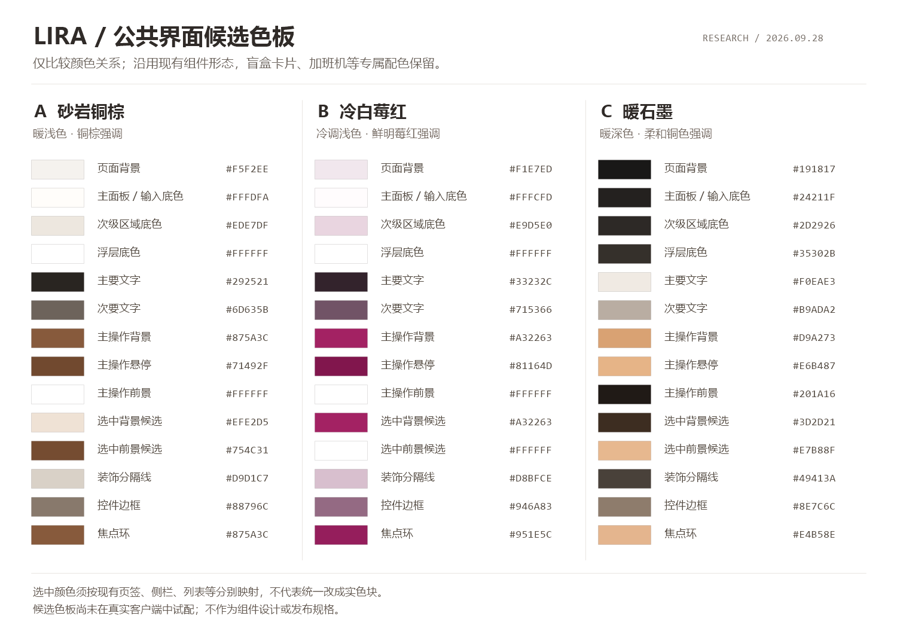

# LIRA 客户端主题配色与公共样式调研

- 日期：2026-09-28。
- 性质：调研报告与候选方案，尚未成为已接受规格，未实施客户端改动。
- 基线：本地工作区，Git HEAD `0284d38f1712`，包含已有未提交改动。
- 范围：Electron 客户端公共界面的主题价值、非蓝色配色、公共样式与深色适配边界。按用户澄清，盲盒卡片、加班机等已有专属配色不属于本次重新设计的对象。外部资料统一于 2026-09-28 查阅。

## 1. 建议

**值得做，建议以“客户端主题切换与深色适配”为课题；深色模式的使用价值高于继续增加许多浅色皮肤。** 对夜间直播、习惯暗色工作环境的用户，深色提供了实际选择；新增浅色主题主要改善审美适配。尚无 LIRA 用户访谈或使用统计，不能据此声称多数用户需要深色，也不将深色等同于护眼。

**可以实现；把范围限定为客户端公共界面的配色，是适合当前项目的做法。** 页面多、组件形态不统一，并不妨碍它们共享背景、文字、边框和交互状态的颜色规则。保留现有布局和交互即可，不需要先把全部页面改成同一种组件。

本报告目前只达到调研与候选色板阶段，尚不能作为完整的适配规格。少量通用控件示意和色对计算不足以判断实际效果，仍需在已有导航、列表、表单及浮层中验证。盲盒卡片、加班机等专属颜色保留，不以它们的复杂程度来扩大本次主题课题。

本次明确排除蓝色主调。**砂岩铜棕、冷白莓红、暖石墨**保留为候选方向，尚未选定默认方案或确定发布组合。先保留经典外观，待真实组件试样通过后，再决定新增哪套浅色和深色预设。这些候选是本报告提出的设计探索，不是调研得出的“行业标准配色”。跟随系统可作为后续选项，首版不需要自由调色器、主题商店或主题导入导出。

**现有项目有公共基础，但不能概括为“大多数组件已经统一”。** 跨页面基础控件、模块内复用组件和业务专属视觉同时存在。公共化应针对确实共享的颜色职责；普通控件的局部覆盖继续在各自 owner 中适配，业务专属视觉作为保留项，无需另建组件库或换框架。

### 1.1 本次主题改什么

| 对象 | 本次处理 |
| --- | --- |
| 窗口、页面、普通面板的底色；正文、辅助文字、边框、分隔线 | 纳入公共外观主题。 |
| 普通导航、按钮、输入框、搜索、下拉、开关、提示和弹窗 | 在现有形态与状态上适配颜色，不改变结构和行为。 |
| 盲盒卡片、加班机等已有专属配色 | 保留；不能因改全局变量而被间接染色。它们周围的公共页面背景可随主题变化。 |
| SC / 点歌分类、盈亏、成功 / 警告 / 错误、日历事件类型 | 保留语义与识别色；深色下仅在确有辨识度问题时补充必要的明暗配对。 |
| OBS、观众侧预览、直播素材、封面、海报和品牌图像 | 按原有配置和内容显示。 |

这里的“公共”指颜色职责能够共享，不要求组件已经由同一个 CSS 或 JS 文件实现。

## 2. 其他产品和设计系统怎样做

下表区分官方资料能确认的事实与对 LIRA 的推论。产品主题的存在不代表其配色适合直接照搬。

| 参考对象 | 官方资料中的做法 | 对 LIRA 的启发 |
| --- | --- | --- |
| Todoist | 提供默认、深色、月光石、柑橘等主题，并分别设置主题同步和自动深色。[1][todoist] | 少量命名预设就能支持个性化；设备外观偏好可以与账号同步分开考虑。 |
| Bear | 提供 Red Graphite、High Contrast、Dark Graphite 等主题，主题涉及文字、样式和背景。[2][bear] | 可从石墨、中性色和有限的红色强调建立识别度；浅色与深色应作为完整外观设计。 |
| Raycast | Theme Studio 区分背景、主要文字和辅助颜色；允许分别指定浅色、深色主题，并提供预览。[3][raycast] | 主题预览应同时展示文字、背景与状态；其完整编辑器不是 LIRA 首版的必要范围。 |
| Radix Colors | 将色阶按背景、组件状态、边框、实色背景和文字分配用途；同时提供中性灰及带色相的灰阶。[4][radix-compose] [5][radix-scale] | 选定铜棕后仍须定义不同用途的颜色，不能让所有控件都直接引用同一个色号。 |
| IBM Carbon | 以角色命名颜色变量；深色界面中，较高的表面层逐渐变亮，组件在不同主题中保持同样的颜色职责。[6][carbon] | 借鉴层次和变量组织；不采用它的蓝色品牌主调。 |
| Atlassian | 深色下阴影较难辨认，弹层等较高表面同时依靠更亮的底色建立层次。[7][atlassian] | 下拉菜单、确认框、悬浮播放器必须有独立的表面颜色，不能全部压成同一块黑色。 |

这些资料共同支持的方向是：先定义颜色的用途，再为每套主题赋值。对于内容密集的直播工具，大面积中性色能让歌曲、头像、礼物和业务状态保持突出。后一判断是本报告结合 LIRA 使用场景作出的设计推论。

Radix 特别区分纯灰与带色相的灰：`slate` 偏蓝，`sand` 偏黄。考虑本次偏好，铜棕用暖灰底，莓红用不偏蓝的冷调玫瑰灰底，石墨用暖黑底；避免把偏蓝灰当作“无色”带回方案。[4][radix-compose]

## 3. LIRA 的现状和具体影响

| 已核查的位置 | 当前事实 | 对主题工作的影响 |
| --- | --- | --- |
| [公共基础样式](../../public/css/styles-base.css)，`:root`、按钮和输入控件 | 已定义背景、文字、边框、成功/警告/危险色、间距、圆角、字体及字号；声明 `color-scheme: light`；主按钮固定使用白字。 | 可复用现有基础。深色需有按钮前景色，不能只替换按钮背景。 |
| [桌面主题](../../public/css/desktop/theme.css)，`html.desktop-shell`、`body.desktop-shell` | 两处设置桌面变量，主要覆盖 `--surface`、`--text`、`--primary` 等别名；顶栏、页面渐变仍直接写色值。 | 要统一标准变量与旧别名的映射，并处理 body 的固定覆盖；只改一组变量会留下局部旧色。 |
| [双队列](../../public/css/admin/workspace/song-layout.css)，`.sc-queue-panel`、`.song-queue-panel` | SC 使用 warning 色，点歌使用 success 色；点歌主按钮也使用队列强调色。 | 黄绿带有业务含义，保持分类识别。若公共主题映射会改变它们，再在该模块显式保留分类角色；不把解耦全部业务颜色作为前置重构。 |
| [下拉框](../../public/css/components/select-menu.css) | 已有公共组件，但筛选、设置、百宝箱、加班机、游戏等变体自行定义青绿、粉、棕、黄、紫等颜色。 | 区分普通外观变体与要保留的专属变体，前者接入主题，后者保留局部配色；不能对全部变体批量换色。 |
| [开关](../../public/css/components/switch-control.css)与[滑块](../../public/css/components/parameter-range.css) | 有统一样式；轨道、禁用色、选中边框等仍有直接色值。 | 补轨道、拇指、选中、禁用和焦点的主题映射；沿用现有控件行为。 |
| [帮助提示](../../public/css/components/contextual-help.css)与[系统通知](../../public/css/admin/toasts/system.css) | 提示气泡直接定义浅蓝底；系统通知有蓝紫渐变与独立文字色。 | 新主题需要覆盖这些浮层，否则主界面换色后仍出现原来的蓝紫表面。业务专属通知需分别评估。 |
| [底部播放器](../../public/css/playback/player.css)、[播放确认框](../../public/css/playback/dialogs.css) | 固定白色或半透明白色背景仍存在。另有[使用变量的确认框](../../public/css/playback/panels/confirm-dialog.css)。 | 先统一它们消费的颜色角色；不能因外形相近就直接合并不同确认流程。 |
| [Admin 首屏](../../public/pages/admin/shell-start.html)与[Electron 主窗口](../../src/electron/main.js)，`createMainWindow` | 首屏提前设置 desktop class；窗口启动底色固定为 `#f7f3ef`。 | 需在首帧前确定主题，并协调窗口底色，防止启动或切页出现浅色闪屏。 |
| [登录页](../../public/css/license.css) | 已有自身的颜色变量与 `prefers-color-scheme: dark` 分支。 | 并非全项目都没有深色；应协调已有登录页与客户端偏好，而非另写第二套登录页方案。 |
| [点歌板主题工具](../../public/js/shared/theme.js) | 加载的是经典点歌板、歌单展示板等预设。 | 它不是客户端换肤控制器，不宜直接把桌面主题塞入其中。 |

现有截图[客户端主页](../../public/img/usage-guide/A/client-main-first-open.webp)用于确认总体视觉语境；现状判断以当前代码为准。截图不是本次启动 Electron 获得的运行证据。

当前黄绿是同一套界面里的功能配色，不是两个已实现的客户端主题。公共界面还混有红色主操作、粉色下拉变体、蓝色提示等。本次新增主题聚焦这些普通界面颜色的协调，功能分类色不因此全部归为待替换的装饰色。

### 3.1 真实组件差异：为什么通用控件示意不够

补充核查了礼物、加班机、粉丝档案、主播工作台、小游戏的仓库截图，以及播放搜索与底栏截图，并对照相关 CSS 和 HTML。以下是代表性差异，**不是已完成的全量组件盘点**。礼物和加班机的例子用于确定保留边界，不是建议把它们的专属视觉纳入重设计。截图只证明其记录时的外观，当前实现事实由对应源码确认；本次仍未运行 Electron 验证。

| 真实界面 / 组件族 | 已核实的差异与依据 | 换主题时应怎样处理 |
| --- | --- | --- |
| 顶栏、二级页签、百宝箱侧栏 | [桌面顶栏](../../public/css/desktop/shell.css)有独立的主导航选中规则；[页签](../../public/css/admin/tabs.css)使用下划线；[侧栏](../../public/css/admin/toolbox/shell.css)有浅色背景、图标及侧边标记。 | 分别映射各自的背景、文字和选中标记，保留现有形态。不能把所有选中项都改成莓红实色按钮。 |
| SC 与点歌双队列 | [队列样式](../../public/css/admin/workspace/song-layout.css)包含分类侧标、数量标签、行操作和队列专属按钮。 | 适配普通背景与正文；保留分类与队列按钮的识别色，检查换底色后密集列表与标签是否清晰。 |
| 播放器及其浮层 | [真实底栏](../../public/img/usage-guide/C/playback-player-bar.webp)有圆形播放键、进度轨道、音质入口；[音量控件](../../public/css/playback/volume-control.css)自行定义面板、轨道、滑块色，[队列弹层](../../public/css/playback/queue-modal.css)另有布局。 | 音量滑块不能当成已由 `parameter-range` 覆盖。分别检查封面、时间、播放状态、音量与队列浮层，保留已有行为。 |
| 礼物与盲盒卡片（保留项） | [礼物截图](../../public/img/usage-guide/D/gift-page-overview.webp)显示分类卡片与盈亏；[盲盒主题](../../public/css/admin/gifts/blindbox-themes.css)按 `data-blind-box-theme` 定义局部颜色。 | 保留卡片专属配色；只检查公共主题是否通过继承或变量别名误改卡片内部。外层页面和普通工具栏可随公共主题变化。 |
| 加班机控制台与规则编辑器（保留项） | [实际界面](../../public/img/usage-guide/E/toolbox-overtime-controls.webp)在浅色页面中已有深色控制台；[控制台](../../public/css/admin/overtime/console.css)与[规则编辑器](../../public/css/admin/overtime/rule-editor.css)有专属按钮、状态与局部样式。 | 延续现有专属颜色，检查全局文字或控件变量是否造成意外变化，不为新增客户端主题重设计控制台。 |
| 粉丝档案 | [实际界面](../../public/img/usage-guide/E/toolbox-fan-profiles.webp)包含分栏、筛选、提醒和档案操作；[样式](../../public/css/admin/toolbox/fan-profiles.css)由模块管理，另有编辑器样式。 | 验证档案列表、详情、编辑器、提醒和空状态；一个设置表单无法代表这些表面。 |
| 主播工作台日历 | [实际界面](../../public/img/usage-guide/E/toolbox-planner.webp)包含日期格、日程、便签与待办；[日历样式](../../public/css/admin/toolbox/streamer-planner/calendar.css)区分直播、工作、个人事件。 | 保留事件分类，分别适配今天、选中日期、跨月日期和事件文字。选择状态不等同于事件类型。 |
| 小游戏及直播画面预览 | [实际界面](../../public/img/usage-guide/E/toolbox-games.webp)包含游戏海报、玩法卡片与配置；[页面结构](../../public/pages/admin/toolbox/games.html)按游戏分区。其他投屏设置也有独立预览内容。 | 配置界面随客户端主题适配；游戏识别视觉和观众侧预览按各自契约处理，不能用全局换色替代。 |

公共主题的适配单元应是现有颜色规则和实际使用它们的组件。页面数多不意味着每页都要重新设计，但不同导航形态、普通控件的局部覆盖与动态浮层仍需覆盖。保留项主要验证不受误改，无须为其另做三套配色。

### 3.2 完整设计还缺什么证据

先从 [Admin 页面组合入口](../../src/server/admin-page.js)及其 HTML 分片列出公共外观的消费者，再补上 JS 动态创建的普通菜单、弹窗、通知和抽屉。对纳入主题的组件族记录“使用位置、样式 owner、局部覆盖、重要状态、主题映射、验证情况”，另记专属配色保留项。多个页面使用同一公共实现时可以合并核查；存在会影响颜色的局部覆盖时保留独立项。

按实际消费者补足颜色角色。公共层定义共同职责，模块层只补普通界面所需的局部映射。可以先对代表性真实组件试样，再逐步补齐覆盖；不必等全部业务组件标准化后才能开始，也不能假定一张通用控件示意图已经覆盖项目。

## 4. 具体候选色板

### 4.1 方向与取舍

| 候选 | 视觉方向 | 适合的地方 | 需要注意 |
| --- | --- | --- | --- |
| A：砂岩铜棕，候选 | 暖灰白背景，较深铜棕强调，低饱和浅棕辅助色 | 探索延续 LIRA 温暖感、降低金色装饰占比的方向 | 不加金属渐变、仿材质或大面积棕色；与现有经典主题的差异及适配性需在真实页面确认。 |
| B：冷白莓红，候选 | 冷调玫瑰灰背景、清白面板、高饱和莓红强调；实色白字只作为高强调选中场景的候选色对 | 希望与暖铜棕和暖石墨形成明显差异时 | 不将所有导航、日期、行选择统一为实色块；保留各组件的选中形态及危险操作语义。 |
| C：暖石墨，深色 | 暖黑背景、递增明度的灰色面板、柔和铜色强调 | 暗色直播工作环境 | 文字保持足够亮度；弱化大片高饱和颜色；不做整页反色。 |

三者分别探索暖浅色、冷调且更鲜明的浅色、暖深色。第二种通过底色温度和强调色色相拉开区别，具体使用面积与选中态强度必须由真实组件的层次决定。

图中仅比较色板。以下色号由本报告提出，借鉴前述方法，**并非上述产品的原始色号或官方推荐组合，也不是完整的客户端主题变量表**。它们用于进入真实页面试样前的讨论，不作为现有组件形态、颜色用量或选中方式的规格。

### 4.2 色号与用途

| 用途 | A：砂岩铜棕 | B：冷白莓红 | C：暖石墨 |
| --- | --- | --- | --- |
| 页面背景 | `#F5F2EE` | `#F1E7ED` | `#191817` |
| 主面板 / 输入框底色 | `#FFFDFA` | `#FFFCFD` | `#24211F` |
| 次级区域底色 | `#EDE7DF` | `#E9D5E0` | `#2D2926` |
| 浮层底色 | `#FFFFFF` | `#FFFFFF` | `#35302B` |
| 主要文字 | `#292521` | `#33232C` | `#F0EAE3` |
| 次要文字 | `#6D635B` | `#715366` | `#B9ADA2` |
| 主操作背景 | `#875A3C` | `#A32263` | `#D9A273` |
| 主操作悬停背景 | `#71492F` | `#81164D` | `#E6B487` |
| 主操作上的文字 / 图标 | `#FFFFFF` | `#FFFFFF` | `#201A16` |
| 选中底色 | `#EFE2D5` | `#A32263` | `#3D2D21` |
| 选中文字 | `#754C31` | `#FFFFFF` | `#E7B88F` |
| 装饰分隔线 | `#D9D1C7` | `#D8BFCE` | `#49413A` |
| 用于识别控件的边框 | `#88796C` | `#946A83` | `#8E7C6C` |
| 键盘焦点环 | `#875A3C` | `#951E5C` | `#E4B58E` |

表中的“选中底色 / 选中文字”是一组候选色对。页签下划线、侧栏浅色选中、表格行选择、日历日期和实色按钮需要分别映射；不能将这两行数值直接套到全部选中态。业务渐变、常驻深色面板和已有专属配色不消费这组通用候选值。

“装饰分隔线”与“控件边框”特意分开：柔和分隔线适合分组，但若输入框只靠边框表达可编辑性，就必须检查边框的辨识度。[9][wcag-nontext]

业务语义不随铜棕或莓红主色整体替换。以下是对明暗配对的计算样本，用于现有语义色在深色背景中出现辨识度问题时参考，**不是要求重配现有业务颜色，也不适用于盲盒卡片、加班机等保留项**：

| 角色 | 浅色：文字 / 底色 | 深色：文字 / 底色 |
| --- | --- | --- |
| 成功提示 | `#226B4E` / `#EAF5ED` | `#8BCBA9` / `#21382E` |
| 警告提示 | `#825400` / `#FBF1D9` | `#E6C276` / `#3B311D` |
| 错误 / 危险提示 | `#AC2E2E` / `#FCEAEA` | `#F2A3A0` / `#422725` |
| SC 队列分类 | `#8A631C` / `#FBF1D9` | `#E6C276` / `#3B311D` |
| 点歌队列分类 | `#226B4E` / `#EAF5ED` | `#8BCBA9` / `#21382E` |

若实施时确需补充局部角色，两个角色可以使用相同色值，但不因此共用同一个业务变量。SC 不意味着警告，点歌不意味着成功。分类标签保留文字和图标；盈亏、失败、运行状态同样不只依靠颜色表达。[10][wcag-color]

### 4.3 已计算的对比度样本

采用 WCAG 2.x 的 sRGB 相对亮度公式，计算 `(较亮亮度 + 0.05) / (较暗亮度 + 0.05)`。普通文字以至少 `4.5:1` 为检查基准；具有识别作用的控件边界等以至少 `3:1` 为基准。后者不代表所有装饰边框都必须达到该值。[8][wcag-text] [9][wcag-nontext]

| 检查组合 | A：铜棕 | B：莓红 | C：石墨 |
| --- | --- | --- | --- |
| 主要文字 / 主面板 | 14.98:1 | 14.53:1 | 13.40:1 |
| 次要文字 / 四种常规表面中的最低值 | 4.77:1 | 4.81:1 | 5.94:1 |
| 主按钮文字 / 默认背景 | 5.90:1 | 7.08:1 | 7.67:1 |
| 主按钮文字 / 悬停背景 | 7.79:1 | 9.74:1 | 9.21:1 |
| 选中文字 / 选中底色 | 5.82:1 | 7.08:1 | 7.30:1 |
| 控件边框 / 四种常规表面中的最低值 | 3.42:1 | 3.24:1 | 3.26:1 |
| 焦点环 / 四种常规表面中的最低值 | 4.81:1 | 5.75:1 | 7.02:1 |

四种常规表面指页面、主面板、次级区域、浮层。表中保留两位小数，阈值判断使用未舍入结果。上述语义色的文字与底色也进行了计算，最低为浅色 SC 标签的 `4.81:1`。

这些结果仅说明所列不透明色对满足对应数值基准，不等于整套 UI 已通过无障碍验收。半透明播放器、图片背景、禁用态、实际焦点相邻色、图表等仍需在真实界面检查；Radix 文档中的 APCA 指标也不能直接当作 WCAG 2.x 比值使用。[5][radix-scale]

## 5. 还需要哪些公共样式与组件

### 5.1 先沿用现有 owner

此表仅列出已发现的基础与入口，不代表所有页面都使用这些组件。例如，原生参数滑块、播放器音量滑块和播放进度条虽然都能调数值，样式与行为 owner 并不相同；通用确认框也不能代表全部业务弹层。完整适配清单按第 3 节的方法建立。

| 组件 / 样式 | 已有实现 | 本课题需要补齐的内容 |
| --- | --- | --- |
| 按钮、图标按钮、原生输入框 | [styles-base.css](../../public/css/styles-base.css) | 主要、次要、危险、禁用、悬停、按下、焦点的颜色职责；主按钮前景色。 |
| 下拉选择 | [select-menu.css](../../public/css/components/select-menu.css)、[select-menu.js](../../public/js/shared/select-menu.js) | 纳入公共主题的变体适配底色、选中态、悬停、边框、文字及浮层颜色；专属变体保留；保持原生 select 同步和现有定位契约。 |
| 复选框与开关 | 原生输入控件、[switch-control.css](../../public/css/components/switch-control.css) | 明确开、关、禁用和焦点；开关拇指不能误用随主题变暗的普通面板色。 |
| 参数滑块 | [parameter-range.css](../../public/css/components/parameter-range.css)、[parameter-range.js](../../public/js/shared/parameter-range.js) | 已填充、未填充、滑块、零点标记、禁用的颜色；数值和进度计算继续复用。 |
| 确认框与遮罩 | [confirmation-dialog.css](../../public/css/components/confirmation-dialog.css)、[confirmation-dialog.js](../../public/js/shared/confirmation-dialog.js)及播放模块自己的对话框 | 表面、遮罩、边框、危险动作和按钮前景；主题适配不改变确认流程。 |
| 帮助气泡 | [contextual-help.css](../../public/css/components/contextual-help.css)、[contextual-help.js](../../public/js/admin/contextual-help.js) | 浮层颜色和阴影映射；保持现有焦点、popover 与生命周期。 |
| 系统通知与业务通知 | [toasts 入口](../../public/css/admin/toasts.css)、[toast.js](../../public/js/shared/toast.js) | 系统通知适配公共表面与文字，业务专属通知保留其识别色；保留通知分组、去重、朗读与交互。 |
| 页签、列表、表格、标签 | [tabs.css](../../public/css/admin/tabs.css)、[workspace 入口](../../public/css/admin/workspace.css)及各业务样式 | 共享确实相同的颜色职责，保留各自的选中形态、密度和布局；业务分类、金额档位、盈亏保持独立语义。 |
| 桌面壳、播放器、滚动条 | [theme.css](../../public/css/desktop/theme.css)、[player.css](../../public/css/playback/player.css)、[desktop-scrollbars.css](../../public/css/overlays/desktop-scrollbars.css) | 去除会妨碍主题切换的固定表面颜色，统一顶栏、浮层和滚动条状态。 |
| 图片图标与插画 | [导航标记](../../public/pages/admin/shell-start.html)引用的 WebP 等资源 | 检查透明边缘、深色辨识度和自带浅色底板；按具体缺陷调整，不能对全部图片套反色滤镜。 |

共享颜色规则不要求所有组件变成同一个 JS 类，也不要求把列表、表格、业务卡片合并成万能组件。现有行为已经满足需求的地方，只调整它们消费的颜色。

### 5.2 最小需要补齐的公共能力

1. **主题定义。** 为每个预设提供同一组颜色角色。优先扩展桌面主题入口，必要时拆出预设样式文件，不引入主题框架或构建工具。
2. **缺失的颜色角色。** 在已有变量上补按钮前景、控件边界、悬停/按下/选中/禁用、开关轨道与拇指等确实被普通组件需要的角色；专属配色保留局部值，不为假想组件提前建数百个变量。
3. **主题控制模块。** 只负责应用、保存、恢复选定预设；若支持跟随系统，再负责订阅系统变化和解除监听。它属于客户端界面外观，不能并入 OBS 主题预设工具或业务状态广播。
4. **主题选择入口。** 在现有设置体系中放一个“客户端外观”控件，使用原生单选或现有选择控件，并显示小型预览。唯一主题值驱动界面，避免各页分别保存。
5. **组件状态对照。** 在开发验证中复用真实组件，集中检查默认、悬停、按下、选中、焦点、禁用及已有错误/加载态。可沿用现有测试夹具，不必新增用户可见的“组件演示”页面。

字体、字号、圆角和间距已经有公共变量。这个课题不需要同时重做排版、布局、动效和全部图标；那会让主题差异难以评估，也扩大回归范围。

## 6. 实现边界与常见遗漏

### 6.1 颜色依赖关系

建议采用“预设值 → 现有语义变量 → 组件局部变量”的关系。颜色只在需要复用和区分职责的地方命名。新增角色名在实施时遵循现有命名约定，报告不固定新的公共 API。

需要特别处理三点：

- **新旧变量在同一主题作用域内映射。** 当前 `--color-*` 与 `--surface`、`--primary` 等别名都被使用，桌面 html/body 又有覆盖。要让两组消费者最终获得一致的主题值；不能只添加一个新的根节点变量块就认为完成。
- **前景色随其背景角色配对。** 石墨主题的铜色按钮应使用深色文字；为此增加主操作前景角色，不应把 `--color-text-white` 的含义改成深色。保留独立绿色背景的队列按钮，也要保留与其配对的前景，不能误用通用铜色按钮的深色文字。
- **不机械替换所有色号。** 礼物等级、品牌图像、业务图表、投屏预览里的颜色可能有自身契约。只把属于客户端界面外观的固定颜色收回主题 owner。

主题作用域建议限定在桌面壳。`styles-base.css` 也被其他页面使用，直接改它的全局默认值可能影响 OBS、网页页面或预览。客户端主题应在桌面根节点生效，预览框周围的控件随客户端主题变化，预览内容仍按观众侧配置显示。

### 6.2 偏好、首帧与 Electron

建议默认将客户端主题视为本机外观偏好，而不是直播间业务设置或云端租户配置。最终存储位置应遵循[客户端数据生命周期 ADR](../architecture/adr/0016-separated-client-data-lifecycles.md)，并明确其是否跟随本机数据保留策略。

`localStorage` 能用于页面偏好，但若要求 Electron 创建窗口前也读到用户选择，就必须安排主进程可读的权威偏好来源或明确的同步方式。不能假设主进程在创建窗口前已经知道 renderer 的本地存储值，也不宜维护互不一致的两份配置。

Electron 官方已有 `nativeTheme` 与浅色、深色、系统模式的实现示例。[11][electron] 对 LIRA 而言，应在主窗口、现有 preload/IPC 和外观 owner 的职责内接入，保持隔离和授权边界。解析后的浅深外观还应同步到 CSS `color-scheme`，替换目前固定的 `light`，让原生控件也使用对应外观；只改 CSS 变量或只设 `nativeTheme` 都不代表所有控件已适配。涉及启动生命周期或偏好持久化的实际改动，应按仓库相应风险等级规划与验证。

目前登录页自身跟随系统。如果主界面允许手动指定深色，首个完整版本应协调 LIRA 自有登录页、主界面和启动背景的选择。[登录页](../../public/pages/license.html)没有 `desktop-shell`，应由其独立样式入口消费同一外观偏好，不能假设桌面根节点覆盖已经包含它。Bilibili、QQ 等第三方登录网页不属于可随意改色的客户端页面。

### 6.3 深色需要重点检查的地方

- 下拉框、帮助气泡、确认框和通知可能处于不同挂载位置，应都能继承主题。
- 半透明播放器和渐变背景必须按合成后的实际颜色检查，而不是只算 CSS 中单独的色值。
- 业务标签、图表、头像透明边缘和位图按钮图标在深色下需要单独观察。
- 登录到主界面、重启、页面恢复时主题应一致；仅“点击切换时成功”还不完整。
- 主题切换应只更新外观，不能重新初始化播放、重建整个业务 DOM、重复注册监听或发起业务请求。

## 7. 推进顺序、工作量与验收

| 阶段 | 交付内容 | 工作量判断 | 通过条件 |
| --- | --- | --- | --- |
| 公共外观盘点 | 从真实页面、动态浮层及组件 owner 建立公共颜色消费者清单，标记局部覆盖与专属配色保留项 | 按共享规则与局部覆盖估算；本次只完成代表性核查 | 范围内的公共组件有对应入口、重要状态和验证项；保留边界清楚。 |
| 真实组件试样 | 在现有导航、普通列表、表单、播放器公共表面及典型浮层上试配色 | 先做代表性组合，不以通用示意图替代 | 保留结构与交互，同一真实内容下比较；第二候选差异明显，专属配色不被误改，再决定候选是否入选。 |
| 公共与局部适配 | 共同职责接入公共变量，普通界面的局部覆盖在各自 owner 中补足映射，逐项关闭清单 | 实际工作量取决于局部覆盖与状态，当前不承诺固定规模 | 范围内的公共组件和受影响状态有证据；盲盒、加班机等专属配色保持原有设计。 |
| 桌面完整接入 | 偏好保存、启动恢复、登录页协调和窗口底色；按需要支持系统模式 | 涉及桌面生命周期后风险高于纯 CSS，单独评估 | 重启与登录过程一致，首帧无明显错误主题，监听与业务行为不重复。 |

这里没有给出精确工期：本次为针对主题入口和代表性组件的审查，没有穷尽公共样式消费者及其局部覆盖。收窄范围后不需要重设计全部业务组件；主要成本是普通界面的颜色映射、深色辨识度、状态覆盖和桌面偏好接入。

实施时的验收建议：

1. 在有正常 preload、IPC 和授权会话的 Electron 中，按公共外观清单验证范围内的组件、局部变体与重要状态；保留项重点检查是否因继承或别名而误改。普通浏览器截图不足以证明桌面启动与偏好行为。
2. 按实际改动复用[样式 owner 测试](../../test/admin/admin-style-ownership.test.js)、[下拉框定位测试](../../test/ui/frontend-select-menu-overflow.test.js)、[通知测试](../../test/ui/frontend-toast.test.js)、[帮助提示测试](../../test/admin/contextual-help.test.js)。只有新增的主题选择、恢复或监听行为存在具体回归风险时，再补对应测试。
3. 对文字、控件边界、焦点和关键状态做实际配色检查；同时保留文案、图标等非颜色线索。[8][wcag-text] [9][wcag-nontext] [10][wcag-color]
4. 确认客户端换肤不改变 OBS 投屏、直播素材、导出图片与观众网页的外观配置；切换过程不触发播放或业务数据变化。

报告完成时已做：官方资料核查、代表性源码与仓库截图审查、真实组件差异清单、上述色对的计算、纯色板比较图制作。未做：客户端主题实现、Electron 实机试样、全页面与动态组件的完整盘点或用户偏好验证。候选颜色能否适配全客户端尚未得到验证，后续实施必须另行建立与变更范围对应的验收证据。

文档检查：`npm run verify:docs` 的 9 项检查通过；另核对本报告 60 处本地链接、11 项参考文献引用和 21 组主题对比度表格数值，并完成纯色板图目视检查。初稿另经过独立读者检查；本次按用户澄清收窄为公共界面配色，未重新进行独立读者检查。

## 8. 参考文献

以下均为产品、设计系统或标准组织的一手资料。访问日期统一为 2026-09-28；未标注发布日期的页面以访问时内容为准。色板为本报告自拟，外部资料支撑的是设计方法和能力，不构成对色板的背书。

1. Doist. [更改主题颜色 — Todoist Help][todoist]。页面标注更新于 2026-09-17。用于主题预设、本机与跨设备偏好、自动深色的产品参考。
2. Shiny Frog. [About free and Pro themes in Bear][bear]。用于非蓝色主题及整套外观预设的产品参考。
3. Raycast. [Themes — Raycast Manual][raycast]。用于浅深主题分别选择、颜色角色和预览机制的产品参考。
4. WorkOS / Radix. [Composing a color palette][radix-compose]。用于中性灰、带色相灰、强调色与语义色的区分。
5. WorkOS / Radix. [Understanding the scale][radix-scale]。用于按用途与交互状态分配色阶；文中的 APCA 描述不作为本报告 WCAG 2.x 数值结论的依据。
6. IBM. [Color — Overview, Carbon Design System][carbon]。用于主题变量、稳定角色和浅深表面层次。
7. Atlassian. [Elevation — Atlassian Design System][atlassian]。用于深色浮层的底色与层次处理。
8. W3C WAI. [Understanding SC 1.4.3: Contrast (Minimum), WCAG 2.2][wcag-text]。用于文字对比度要求和计算依据。
9. W3C WAI. [Understanding SC 1.4.11: Non-text Contrast, WCAG 2.2][wcag-nontext]。用于必要控件边界、图形与状态指示的对比度要求。
10. W3C WAI. [Understanding SC 1.4.1: Use of Color, WCAG 2.2][wcag-color]。用于避免仅凭颜色传达分类或状态。
11. Electron. [Dark Mode — Electron Documentation][electron]。用于系统外观与 `nativeTheme` 的平台能力参考；实际接入仍须遵循 LIRA 的 Electron 契约。

[todoist]: https://www.todoist.com/zh-CN/help/account-and-billing/account/change-your-todoist-color-theme-zD0N5K
[bear]: https://bear.app/faq/about-free-and-pro-themes-in-bear/
[raycast]: https://manual.raycast.com/themes
[radix-compose]: https://www.radix-ui.com/colors/docs/palette-composition/composing-a-palette
[radix-scale]: https://www.radix-ui.com/colors/docs/palette-composition/understanding-the-scale
[carbon]: https://carbondesignsystem.com/elements/color/overview/
[atlassian]: https://atlassian.design/foundations/elevation
[wcag-text]: https://www.w3.org/WAI/WCAG22/Understanding/contrast-minimum.html
[wcag-nontext]: https://www.w3.org/WAI/WCAG22/Understanding/non-text-contrast.html
[wcag-color]: https://www.w3.org/WAI/WCAG22/Understanding/use-of-color.html
[electron]: https://www.electronjs.org/docs/latest/tutorial/dark-mode
