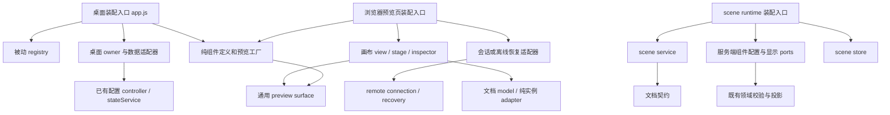

# 画布、组件预览与场景输出：函数级依赖复审

日期：2026-10-01。性质：审查记录与修改建议，未实施业务代码修复，也不是已接受的实施计划。

工作区：`D:/Work/Live`。审查基线为 HEAD `cc7cb35738836a5edc23cdd7e3b310a2af7ef6d0` **加当时的未提交改动**，不能只用该提交复原本报告现场。审查包含当天新增的固定像素输出、连接重试和浏览器草稿恢复。行号按本次工作区记录，后续定位以函数名为准。

## 1. 结论与范围

现有 scene service/store、配置 controller、文档 model、预览 transport 和沙箱 renderer 已形成可保留的边界，不需要整体重写。主要缺口是：发布依赖范围与并发校验不完整；renderer 的版本切换没有完整承接断线和增量事件语义；新增恢复路径未覆盖部分组件契约；新增组件需要同步修改多处类型清单。

本次确认 **8 类行为缺陷**，另有 **4 类结构调整建议**：A08 是实测的通知放大，S01–S03 是基于调用关系的扩展与复用建议。结构建议不等于当前一定出错。

依赖扫描从 51 个画布相关入口展开到 130 个本地模块，AST 解析错误 0；静态 import/export/require 环 0；加入字面量动态 import 后环仍为 0。**目前没有证据表明这条模块链已有循环依赖。** 但直接让现有 registry 反向导入组件实现，会引入明确的环，见第 5 节。

人工重点审查范围：浏览器编辑 → 命令中继 → 桌面配置 owner → 保存/发布 → 场景投影 → 子 renderer，以及撤销/手势、断线、恢复、类型扩展、来源尺寸和权限边界。130 个可达模块是图分析范围，不代表逐行审查了全部依赖模块。没有宣称全仓库无环、全产品无 bug，也没有以真实直播账号或正在运行的用户 Electron 验证。

判断依据包括 [场景规格](../../specs/component-scenes.md)、[组件工作区规格](../../specs/component-workspace.md)、[ADR-0022](../architecture/adr/0022-local-component-scenes.md)、[API 契约](../reference/backend/api.md)、[overlay 契约](../reference/frontend/overlays.md) 和直接运行证据。报告不把现有代码或通过的测试自动当作预期行为。

## 2. 待改项总表

优先级含义：P1 为可能丢失未保存工作或破坏直播数据连续性，建议先处理；P2 为明确的功能边界问题或新增组件前应整理的扩展点；P3 为可随相关工作整理的复用问题。这里的优先级不表示所有用户都会触发。

| 编号 | 优先级 / 性质 | 需要修改的结果 | 主要负责函数 |
| --- | --- | --- | --- |
| A01 | P2 / 已复现 | 画布发布被无关组件阻断，且会保存无关草稿 | `prepareComponentPreviewCanvas().publish()`、`mountPreviewCanvasOutput().run()` |
| A02 | P1 / 已复现 | 较早 owner 在等待后续保存时产生新草稿，仍会发布旧外观 | `prepareComponentPreviewCanvas().publish()` |
| A03 | P2 / 真实 HTTP 已复现 | 合法场景因 saved/draft 双份封装被预览接口 413 拒绝 | `handleComponentPreview()`、`cloneSceneJson()` 的配套边界 |
| A04 | P1 / 已复现 | 断线后 staging 完成，重新投递旧的在线弹幕状态 | `createSceneRenderer().disconnect()/commit()` |
| A05 | P1 / 已复现 | 首次准备 renderer 期间增量事件被后续空批次覆盖 | `createSceneRenderer().update()/commit()`、`scene.js::poll()` |
| A06 | P2 / 真实浏览器已复现 | 过期草稿含加班机时出现缺失数据接口异常 | 预览页 `mount()/start().catch`、`createOvertimePreview().startData()` |
| A07 | P1 / 已复现 | 任一未加载组件使其他组件的本地草稿持久化静默失效 | `createPreviewDraftRecovery().persist()/snapshot()` |
| A08 | P2 / 实测结构问题 | 纯几何变化向全部实例重发外观通知 | `createSceneItemController().subscribe()`、`mountComponentPreview().update()` |
| A09 | P1 / 服务与 renderer 联合复现 | 新版移除组件类型且准备失败时，保留的旧版停止获得该类数据 | `createSceneService().getOutput()`、`createSceneRenderer().fail()/data()` |
| S01 | P2 / 扩展建议 | 组件类型、样式选择和尺寸规则缺少明确扩展入口 | registry / picker / validators / renderer / migration，见第 4 节 |
| S02 | P2 / 依赖建议 | 纯预览工厂与桌面初始化耦合，集中注册容易造环 | `createClockPreview()`、`createOvertimePreview()`、stage 的数据适配 |
| S03 | P3 / 复用建议 | 发布重写已有批量保存规则，场景 API 与实例适配混在同模块 | `createComponentSaveBatch()`、`scene-editor-state.js`、canvas controller |

## 3. 已确认问题的函数级证据

### A01：发布依赖了全部注册组件，影响超出当前场景

**位置与调用链：** [component-preview-canvas-output.js](../../public/js/admin/component-preview-canvas-output.js) 第 18、24 行 `mountPreviewCanvasOutput().run()` 先 flush 全部 controller；[component-preview-canvas-controller.js](../../public/js/admin/component-preview-canvas-controller.js) 第 79–97 行 `prepareComponentPreviewCanvas().publish()` 遍历全部 `components` 加 canvas，最后才计算 `sharedTypes`。

**复现：** 场景只放一个独立时钟，未使用的弹幕 controller 读取失败：`publish()` 报“尚未读取完成”，发布请求一次也没有发出。另一个用例中，同样的独立时钟场景之外，点歌板默认配置存在草稿；发布画布会实际保存该点歌板草稿一次。

**原因与影响：** “页面建立过连接的 owner”被当成“本次发布必须保存的 owner”。独立实例已有配置，不应要求未引用组件先上线；对无关默认配置的保存还可能影响原有单组件直播来源。API 的“等待所有浏览器编辑确认”描述应与场景规格里的 affected owners 对齐，不能仅改一端。

**建议修改：** 在发布编排处先确定待提交场景和实际引用的共享 owner，并明确本次动作是否包含其他被显式编辑的默认配置。浏览器 flush、桌面预检、保存和 `expectedDefaults` 使用同一目标集合。不要用全局 `loaded` 门槛替代依赖选择。旧 `openSceneEditor().publicationBlocker()` 已按共享类型筛选，可借用规则；不要照搬旧 UI 的不同保存语义。

**回归条件：** 独立时钟场景可在无关弹幕不可用时发布；无关点歌板草稿和保存次数不变；真正被引用的共享 owner 未完成读取/保存时必须阻止发布。新组件缺省不成为所有场景的前置依赖。

### A02：逐个保存后的检查不能证明发布前全部 owner 仍一致

**位置：** 同上 `prepareComponentPreviewCanvas().publish()` 第 81–97 行。每次只检查刚保存的 owner；全部保存结束后没有重新检查已通过的 owner。

**复现时序：** 场景共享时钟和点歌板；时钟草稿 `first` 保存成功；点歌板保存被延迟；此时把时钟改成 `later unsaved`；点歌板完成。函数仍发送发布请求，`expectedDefaults.clock.label` 为 `first`，而时钟 controller 的 `dirty` 为 true。

**原因与影响：** `assertCurrent()` 只检查账号/配置来源 generation，不检测同一 generation 的后续编辑。后端能核对已保存默认配置，却不知道桌面还存在未保存草稿。这里的新编辑发生在发布请求发出之前，不是“发布已经提交后继续编辑、留待下次应用”的正常情况；与 API 中“仍有并发草稿时停止发布”的约定不一致。

**建议修改：** 复用 `createComponentConfigController().prepareSave()` 与已有 `createComponentSaveBatch().save()` 的同步准备/冻结思想，先预检所需 owner，再提交。发送 `publish` 前再次核对所有参与 owner、场景 revision/内容和连接代际，处理 dirty、saving、loading、error、conflict；必要时用本次提交的编辑标识确认一致性。仅换成 `Promise.all()` 不能解决该问题；batch 完成也不自动意味着可发布。

**回归条件：** 用可控 Promise 覆盖“前一个 owner 已完成、后一个仍在保存”的窗口，新草稿必须保留且此次发布被明确停止；确认发布后的后续编辑仍留作草稿。维持部分 owner 已保存后不跨域回滚的既有契约。

### A03：单文档允许的大小与预览中继请求大小不相容

**位置：** [component-preview-routes.js](../../src/server/routes/component-preview-routes.js) 第 10 行 `handleComponentPreview()` 将整个 JSON body 限制为 256 KiB；[scene-contract.js](../../src/scenes/scene-contract.js) 第 40、61 行 `cloneSceneJson()/normalizeSceneDocument()` 允许单个文档达到 256 KiB。`stateOf()` 中继状态包含 `saved`、`draft` 两份文档，open/exchange 还有其他字段。

**真实 HTTP 复现：** 构造 21 个独立弹幕实例，使用正常配置归一化器接受的样式参数（各样式的 fontFamily 含 200 个中文字符）。归一化文档 **136,270 bytes**，低于 262,144；带两份状态的 open 请求 **272,661 bytes**，返回 **HTTP 413**。这是合法配置的边界用例，不代表普通 21 个组件一定达到该大小。

**影响：** 服务层和数据库接受的场景，可能无法再打开浏览器编辑；编辑后增大到相应体积时，exchange 也可能断开。不能把它当成无效模板或仅提示重试。

**建议修改：** 明确区分文档限额、状态快照限额、action 封装限额，在中继 owner 统一规定并校验可容纳双份合法文档和受限元数据的上限。继续保留每份文档的大小与结构限制，不取消 HTTP 上限。若以后优化增量 exchange，应先有需求，当前无需换传输协议。

**回归条件：** 接近文档上限、saved/draft 不同、UTF-8 多字节内容的 open/edit/exchange 可用；超限文档和恶意超大封装仍拒绝。普通 scene save 另走 `createBodyReader()` 的上下文限额，主服务当前配置为 16 MiB；没有把该路径误报成同一个 256 KiB 封装缺陷。

### A04：disconnect 没有更新 staging 随后使用的数据

**位置与调用链：** [scene-renderer.js](../../public/js/overlays/scene-renderer.js) `disconnect()` 第 88 行只给 active 发送离线 reset；`commit()` 第 22 行随后仍通过 `data(next, latestData)` 使用此前保存的数据。

**复现：** v1 正在显示；v2 staging 已收到在线状态和一条事件 `stale`；调用 `disconnect()`；v2 发来 ready/prepared 后提交。v2 实际收到的最后一条 data 仍是 `status: connected`，并含 `stale`，输出版本变为 2。

**原因与影响：** 连接代际增加了，但 `latestData` 与 staging 没有一起失效。新子页面将旧状态当作新代际数据，断线后重新显示在线状态/旧消息。active 的 reset 并不足以保护尚未提交的版本。

**建议修改：** 在 renderer owning 状态中统一维护连接状态、最新可替换快照与事件代际。disconnect 必须影响当前和随后提交的版本；是否取消 staging 或允许其离线提交可以按既有 UI 取舍，但不得再投递断线前的在线批次。revoke 继续使用更强的清空语义。

**回归条件：** 在 ready 前、ready 后 prepared 前、准备完成后分别断线；均不重放旧在线状态。重连的新 epoch 正常恢复，旧回调不能覆盖新状态。

### A05：首次 renderer 准备期间，增量事件被当作快照覆盖

**位置与调用链：** `createSceneRenderer().update()` 第 82 行覆盖 `latestData`，只向 active 投递；`commit()` 只发送最后一份数据。[scene.js](../../public/js/overlays/scene.js) `poll()` 第 17–33 行在 `renderer.update()` 后立即推进弹幕 epoch/cursor。

**复现：** 没有 active 的首次加载中，先建立 staging；接着收到含 `lost` 的弹幕批次；再收到空批次；最后 renderer 准备完成。真实 renderer 模块发给 iframe 的所有消息都没有 `lost`。上层 poll 已经推进游标，后续不会再次请求该事件。

**原因与影响：** 队列/倒计时快照可被更新值覆盖，弹幕 events 是增量，不能共用一个覆盖策略。初次加载较慢时，确已进入本地输出链路的消息会静默丢失；这与上游断线造成且显式报告的 gap 不同。

**建议修改：** 在输出投递边界区分快照和增量事件，为实际消费者建立有界的待投递状态或确认机制。与 cursor、epoch、reset/gap 一起定义消费时点，提交/放弃 staging 时有明确规则。不要无限缓存，也不要伪造消息或从本地结算管线补发。已向旧 active 展示过的事件与首次无人消费的事件要分别考虑，避免修复后重复展示。

**回归条件：** 初次准备跨多个轮询，多个事件批次穿插空批次，准备完成后应按契约只投递一次；缓冲溢出明确表示 gap；reset/账号或直播场次变化清理旧批次；切换失败不会重复注入旧 active。

### A06：过期草稿恢复对象不满足加班机的数据提供者契约

**位置与调用链：** [component-preview-page.js](../../public/js/admin/component-preview-page.js) `start().catch` 第 66 行之后构造只读恢复 connection，只提供 controller/close；`mount()` 第 51 行把其缺失的 `startActualData` 传给工厂；[overtime-preview.js](../../public/js/admin/overtime-preview.js) `startLayerData()` 第 107 行 → `restartLayerData()` 第 46 行 → `startData()` 第 36–38 行无条件调用 `startActualData(emit)`。入口来自 `mountSceneEditorStage().render()` 的 overtime 分支。

**真实浏览器复现：** 保存一个含独立加班机的场景，打开浏览器编辑器，等待本地恢复记录生成；撤销桌面预览 handle 后刷新原 URL。页面显示“已找回上次编辑进度”，同时触发 `pageerror: startActualData is not a function`。另有函数级用例直接复现。

**影响：** 只读恢复 UI 可以出现，但加班机初始化未完整完成并产生未捕获异常；不是简单的空数据，也不能概括成整个页面必然白屏。现有恢复浏览器用例只覆盖时钟，因而仍通过。

**建议修改：** 由恢复页装配入口提供显式的无实时数据/离线 provider，或由预览定义声明数据能力并统一处理无 provider 状态。加班机预览保留已存外观，实际状态明确不可用；不能在离线恢复分支偷偷接回桌面 stateService 或生成伪实时数据。

**回归条件：** 四种现有组件分别恢复、混合恢复均无 pageerror；加班机不订阅已失效会话；恢复页不能发布或写入；从桌面重新打开后可恢复草稿并正常接收数据。

### A07：一个未加载 owner 会静默关闭整个页面的本地草稿保存

**位置：** [component-preview-drafts.js](../../public/js/admin/component-preview-drafts.js) `createPreviewDraftRecovery().persist()` 第 44–46 行，发现任一 connection 的 `loaded` 为 false 就直接 return；`snapshot()` 第 38 行以全连接为单位收集状态。

**复现：** 时钟连接已加载，未使用的弹幕连接未加载；编辑时钟后 `dirty === true`，注入的 storage 写入次数为 0，也没有保存失败提示。该条件没有时间性：只要另一个 owner 一直未就绪，后续 persist 和 dispose 前最后一次 persist 都会跳过。

**影响：** 用户看见可编辑的画布/参数，但新增工作没有本地恢复快照。关闭或刷新后可能丢失未获桌面确认的编辑。A01 影响发布，本项影响恢复，不能只修其中一个。

**建议修改：** 独立决定各 connection 是否具有可持久化的有效状态，合并保存已加载组件；对于未加载或已断开的组件保留已有有效快照，禁止用初始化默认值覆盖旧草稿。若仍选择整页不能持久化，必须将该状态明确展示，不能声称已经保留。保持现有 owner/scene 的 draftKey 隔离与能力凭据不入缓存的规则。

**回归条件：** 未使用 owner 读取失败、一个 owner 失效、另一个 owner 有未确认编辑、storage 抛错分别覆盖；有效草稿仍能恢复，不串账号/场景，不覆盖未就绪组件的旧快照。

### A08：纯几何变化触发全体实例的外观更新（结构/性能）

**位置与调用链：** [scene-document-model.js](../../public/js/admin/scene-document-model.js) `notify()` 第 19 行对每个订阅者克隆文档；[scene-editor-state.js](../../public/js/admin/scene-editor-state.js) `createSceneItemController().subscribe()` 第 85 行同时订阅整个 model 和默认 controller；[component-preview-surface.js](../../public/js/admin/component-preview-surface.js) `update()` 第 70 行无条件发送 config 并 fit；`mountComponentPreviewCanvas().renderLayers()` 第 172 行在 model 变化时整体重建图层列表。

**实测：** 创建 32 个独立时钟，只让第一个实例 x 增加 1，32 个实例 controller 全部通知，32 份 appearance 都没有变化。对已 ready 的 surface，后续代码会把这些未变化配置再次发给 iframe；而各 surface 的 fit 又进行布局读取。

**结论边界：** 已证明无用通知和数据处理放大，未进行 FPS、CPU 或 Electron 长时性能测量，不能声称已经导致卡死。随着实例和外观配置增多，这条路径值得优先控制。

**建议修改：** 在 owning adapter 对实例外观/可编辑状态做选择与去重，几何更新交给舞台布局；独立实例不要被无关默认配置变化驱动。优先利用 model 内部已有不可变快照，减少每个订阅者重复读取完整文档。图层列表只在顺序、名称、可见性、选择等相关字段变化时更新。不要改成所有代码共享可变文档，也不需要引入状态管理框架。

**回归条件：** 用投递次数验证移动一层不向其他层重发 config；改外观仅影响该独立实例，改共享默认值影响正确引用者；尺寸标签/fit/自动高度、撤销和手势合并仍正确。随后按实际需要测一次多实例拖动开销。

### A09：失败时保留了旧 DOM，却没有保留旧版本所需的数据投影

**位置与调用链：** [scene-service.js](../../src/scenes/scene-service.js) `getOutput()` 第 214 行之后仅从当前最新 `publishedDocument` 计算 types；[scene-components.js](../../src/server/scene-components.js) `getDisplayData()` 第 83 行只返回这些类型；`createSceneRenderer().fail()` 第 33 行保留 active，但 `data()` 第 16 行在相应类型不再出现时什么也不发送。

**联合复现：** 使用真实场景 service/store 与受控 DOM renderer。v1 含点歌板，正常收到歌曲“合成实时歌曲”；合法发布 v2，仅含时钟；模拟该时钟 renderer 的准备失败；此时 `getVersion()` 仍为 1。改变真实 fixture 的队列后继续请求 output，响应版本为 2、没有 `data.queue`，旧点歌板最后一次数据仍是原歌曲。

**原因与影响：** 客户端的“已成功显示版本”和服务端的“最新发布版本”是两个状态。当前 `version` 查询仅决定是否返回 document，没有参与数据投影的选择。新版移除某类组件且持续准备失败时，旧版该组件不再更新，与 overlay 契约的“旧版仍接收数据”不符。现有失败切换浏览器测试保留相同类型，漏掉了该条件。

**建议修改：** 在 scene service/output 契约拥有处协调实际 active 与 staging 所需的受控投影，或定义有界、按 owner/能力隔离的旧版本投影保留机制；前端仅改 `fail()` 无法补回服务端未提供的数据。方案需同时考虑 capability 撤销、账号变化、旧版本清理和单实例来源，不能允许客户端任意请求未授权域数据。本项可能涉及协议/版本保留，实施前单独明确兼容方案。

**回归条件：** v1 有队列/加班机/弹幕、v2 删除相应类型且准备失败，旧版继续接收所需更新；v2 成功提交后旧订阅释放；撤销/登出仍立即清空，不能以回退名义继续显示失效数据。

## 4. 新增组件前应整理的扩展点

### S01：集中组件能力，分别维护各运行环境的适配器

目前增加第五类组件不只是加一个 factory。下列 owning 函数都需要有明确扩展规则；遗漏其中任一处可能导致编辑器可选、验证拒绝、恢复丢失或发布 SQL 失败。

| 扩展职责 | 当前位置 / 函数 / 行号 | 建议归属 |
| --- | --- | --- |
| 桌面可用组件与顺序 | [component-preview-registry.js](../../public/js/admin/component-preview-registry.js) `registerComponentPreview()` 14、`getComponentPreviews()` 18、`COMPONENT_ORDER` 1 | 被动注册表接收定义；未知注册不应因另一份 order 清单而悄悄消失 |
| 浏览器工厂和数量 | [component-preview-page.js](../../public/js/admin/component-preview-page.js) `factories` 11、`start()` 28 的 `> 4` | 浏览器装配根从自己的显式定义表获得允许项，不依赖魔法数字 |
| 样式选择和缺省外观 | [component-preview-picker.js](../../public/js/admin/component-preview-picker.js) `STYLE_FIELDS` 4、`show()` 41 | 定义提供样式项与配置转换；缺少样式字段不能默认显示“默认倒计时” |
| HTML 参数片段 | [server/component-preview-page.js](../../src/server/component-preview-page.js) `FRAGMENTS` 7、`composeComponentPreviewHtml()` 10 | 服务端页面适配表；保持安全的明确 allowlist |
| 文档与模板类型 | [scene-template.js](../../public/js/admin/scene-template.js) `validateSceneDocument()` 49；[scene-contract.js](../../src/scenes/scene-contract.js) `SCENE_TYPES` 5、`normalizeSceneDocument()` 61 | 格式契约定义标识；浏览器做文档检查，服务端仍是配置验证权威 |
| 中继与草稿缓存类型 | [component-preview-sessions.js](../../src/server/component-preview-sessions.js) `open()` 49；[component-preview-drafts.js](../../public/js/admin/component-preview-drafts.js) `readPreviewDraft()` 7 | 分清渲染组件类型与 `canvas` 控制会话类型，两者不应混成一个组件列表 |
| 默认配置、独立配置和显示投影 | [scene-components.js](../../src/server/scene-components.js) `normalizeSceneConfig()` 33、`getDefaultConfig()` 75、`getDisplayData()` 83 | 按组件的服务端 ports 表复用既有 owner 校验/投影；场景 service 不认识具体业务字段 |
| 子页面 URL 和断线处理 | [scene-renderer.js](../../public/js/overlays/scene-renderer.js) `prepare()` 50、`disconnect()` 88；`mountPreviewCanvasOutput().run()` 18 | 明确 renderer 路由与数据重置能力；不能假设新增组件都是 `/<type>` 或只有弹幕需要重置 |
| 自动高度和缩放规则 | `resizeSceneItem()` 165；stage `render()` 113、`scheduleContentResize()` 24、`positionContentLabel()` 57；inspector `render()` 43 | 定义已存在的 `resizeAxes` / 内容高度能力或等价简单字段，避免每层再写一次 overtime 分支 |
| 默认来源尺寸持久化 | [scene-migration.js](../../src/storage/scene-migration.js) `migrateComponentOutputSizes()` 23 / SQL CHECK 27；`createSceneStore().publish()` 47 | 新增组件类型涉及已有数据库时追加迁移，不能只修改已经执行的建表函数 |

这里需要的是少量显式定义和按环境注入的适配器，不是插件引擎、依赖注入容器、新前端框架或构建步骤。服务端不能导入前端 UI，storage 更不能导入 factory。适合共享的是稳定标识与能力契约，不能把 HTTP、DOM、主进程凭据和 SQL 一起塞进“万能 registry”。对前后端允许类型增加契约一致性测试，比把所有逻辑强行放进同一个文件更合适。

`openComponentWorkspace()` 和旧 `openSceneEditor()` 也保留四组件假设。它们目前属于兼容/已有入口，新增类型时先核实是否仍在产品入口使用；不要为统一外观而扩大旧路径或重新激活它们。

### S02：拆开纯预览定义与桌面初始化，数据由入口注入

`createClockPreview()` 与 `initClockCard()` 同在 [clock-card.js](../../public/js/admin/clock-card.js)；`createOvertimePreview()` 与 `createOvertimeAppearance()` 同在 [overtime-preview.js](../../public/js/admin/overtime-preview.js)；`createDanmakuPreview()` 与 `openDanmakuCanvas()` 同在 [danmaku-canvas-dialog.js](../../public/js/admin/danmaku-canvas-dialog.js)。浏览器预览为复用前者，也引入后者所在模块的桌面依赖。

另一路是 `mountSceneEditorStage()` → `startSceneEditorOvertimeData()` → `stateService/eventBus`。通用舞台因此知道桌面数据来源，加班机又有 layer provider、实际 provider 和回退 provider 多个入口；A06 已证明新恢复环境很容易漏掉其中一个契约。

修改时保留各组件自己的 panel、配置投影和 renderer 实现，把纯预览 factory/定义与桌面 owner 初始化分开。桌面、浏览器会话、只读恢复各自装配合适的数据 provider，stage 只消费其约定。清理中要验证每个 provider 的启动/停止次数，不要让独立实例重复建立相同的业务连接。

### S03：优先复用已有保存协议，分清场景状态职责

已存在 [component-save-batch.js](../../public/js/admin/component-save-batch.js) `createComponentSaveBatch().save()` 第 38 行：先对所有目标 `prepareSave()`，完整校验后才提交，按 owner 保留成功/失败，支持 generation 变化取消和只重试失败项。[component-workspace.js](../../public/js/admin/component-workspace.js) `getWorkspaceSession()` 第 10 行已经使用它；相关 16 项测试通过。

canvas controller 目前另写逐个 `save()` 循环，是 A01/A02 的直接发生点。应在确认目标集合后复用该协议或抽取其相同部分；不要再新增第三套批量保存工具，也不要将“批量保存成功”直接等同于“可发布”。场景 revision、共享默认快照核对、发布前最终检查仍属于画布发布编排。

[scene-editor-state.js](../../public/js/admin/scene-editor-state.js) 同时导出 `requestScene()`、`createSceneEditorSession()`、`createSceneItemController()`；canvas controller 又通过替换 controller 的 `getState/discard` 叠加冲突逻辑。修改相关功能时可拆出纯实例 adapter 和 scene API port，并明确 scene session 持有 revision/conflict/publication 状态。不要仅因文件名或重复的错误文本就合并两套不同交互流程；旧编辑器“单独保存默认配置”与新画布“保存并应用”的契约需要继续区分。

## 5. 依赖方向与防环约束

### 5.1 本次分析方法与限制

使用 Node 自带 Acorn 解析 JS AST，读取相对 import/export、字面量 `require()` 和 `import()`；解析可达文件并运行强连通分量检查。记录每条边的来源行号及函数归属，也记录文件 SHA-256。结果：51 seeds、130 files、0 parse errors、0 static cycles、0 all-literal-import cycles。

不覆盖第三方包内部、非字面量动态路径、由 HTTP/postMessage/eventBus 形成的运行时关系，也不以文件图无环证明状态机不会反馈。后者另外检查了 canvas `receiving` 与内容相等保护、gesture 状态、remote 命令序列/ack、controller generation 和 renderer 生命周期。所发现的是上述不完整边界；未复现无限通知或无限请求循环。

### 5.2 不能采用的注册表整理方式

下列当前导入边均存在；如果 registry 为“集中管理”而反向导入这些实现，会出现环：

| 当前真实依赖 | 加入哪条反向边会成环 |
| --- | --- |
| `clock-card.js → component-preview-registry.js` | registry 导入 clock-card |
| `overtime-preview.js → component-preview-registry.js` | registry 导入 overtime-preview |
| `danmaku-canvas-dialog.js → component-preview-dialog.js → component-preview-registry.js` | registry 导入 danmaku-canvas-dialog |
| `scene-editor-stage.js → scene-editor-preview-data.js → overtime-preview.js → component-preview-registry.js` | registry 导入 stage 或继续沿这条链装配舞台 |

不要只把反向 import 改成动态 import 来隐藏静态环。职责应由装配入口下移为纯定义，registry 维持被动。

### 5.3 建议的无环导入结构

下面箭头表示代码依赖，不表示业务事件往返；框中名称是职责，不要求一框对应一个新文件。



装配入口把 ports/definitions/provider 作为参数传递；service 不反向 require runtime，registry 不 import owner，model 不 import view/HTTP/storage，preview factory 不注册自己、不读取桌面全局状态。保持现有 CommonJS 后端、原生 ESM 前端与单体部署。

## 6. 人工检查的函数与边界

下表记录深入检查的核心路径及结果，包含“没有提出修改”的边界，避免把复杂代码概括成一个“建议拆分”。同一问题的相关函数归并到同一行。

| 模块 / 函数 | 实际检查内容 | 结论 |
| --- | --- | --- |
| `component-config-controller`：`edit/receive/reload/prepareSave/commit/save/discard/reset` | 冻结提交、外部更新合并、读取/保存竞态、编辑 revision、账号 generation | 可复用；A02 在调用编排层，不应推翻 controller |
| `component-save-batch`：`save/isCurrent/retryFailed/dispose` | 所有目标预检、冻结、部分失败、取消、重试范围 | 已有能力，S03；不能替代发布的最终一致性检查 |
| `component-preview-dialog`：`openComponentPreview/exchange/stopConnection/close` | 桌面执行队列、ack、异步发布结果、关闭和代际结束 | 重点与 remote/relay 对照；本轮未新增独立缺陷 |
| `component-preview-remote`：`enqueue/flush/receive/disconnect/request/send/poll/run/start/stop` | pending 乐观草稿、网络重试、commandId 单飞、ack、取消和 4xx 终止 | 已有重试与重复回执边界应保留；A01 的 flush 目标由上层修正 |
| `component-preview-sessions`：`prune/get/stateOf/open/exchange/browser/publicState` | TTL、owner、token、generation、bounded commands、重复 commandId、可编辑键 | 不将恢复绕过权限；类型扩展纳入 S01，体积问题在 route |
| canvas controller：`prepareComponentPreviewCanvas/assertCurrent/read/persist/publish/source` | 缓存 key、owner reset、revision、冲突和来源读取 | A01/A02；保留明确 source 读取和场景能力隔离 |
| canvas view/output：`edit/add/select/renderLayers/renderStatus/run` 及 model/controller 订阅 | 图层上限、shared/independent、输入校验、busy、恢复 pending、同步保护 | A01/A08；恢复 pending 已禁用交互，不再把旧疑点列为缺陷 |
| draft recovery：`readPreviewDraft/changesFor/restore/useCurrent/persist/dispose` | 缓存 key、逐字段差异、冲突选择、storage 错误、退出前保存 | A07；恢复仅改草稿、不自动发布的边界保留 |
| preview page：`start/mount/close` 与失败恢复分支 | 链接校验、并行连接初始化、只读 fallback、资源释放 | A06；fallback 当前只对 401/403/410 启用；无效 URL 显示错误已验证 |
| scene document model：`change/edit/beginGesture/updateGesture/commitGesture/cancelGesture/undo/redo/reset` | 不可变历史、单手势一个记录、cancel、shared 尺寸联动、100 条历史 | 现有约束保留；A08 改通知成本时不能破坏历史 |
| geometry helpers：`resizeSceneCanvas/moveSceneItems/resizeSceneItem/alignSceneItems` | 逻辑坐标、边界、锁定、组合移动、对齐、自动高度 | 类型专属规则在 S01 建议能力化；未另列未经复现的几何缺陷 |
| scene stage：`pointerDown/pointerMove/pointerUp/cancelGesture/render/scheduleContentResize/fit/dispose` | pointer capture、缩放、取消、内容高度、frame 生命周期 | A06/A08/S01/S02；保留既有 dispose 和手势收敛 |
| inspector：`edit/render/clear/dispose`；item adapter：`getState/edit/subscribe` | shared/independent 切换、locked、panel 重建/退订、外观投影 | A08；不能把独立实例更新写回默认 owner |
| template：`safeJson/validateSceneDocument/exportSceneTemplate/collectBindings/importSceneTemplate`；模板 UI 的提交分支 | UTF-8 大小、字段/凭据排除、重生成 ID、显式资源绑定、服务端验证先于创建 | 保留后端最终验证；A03/S01 需保持契约一致 |
| 四类 preview factory / panel / `startData/startLayerData` | 默认配置投影、实际/示例数据、实例复用和停止回调 | A06/S02；没有要求复制真实业务状态以实现“独立外观” |
| scene service：`withOwner/assertCurrent/checkRevision/save/publish/getSource/rotate/getOutput` | owner scope/epoch、默认快照核对、保存与发布隔离、单实例投影、凭据 | A09；正常发布中的同类型默认只读取一次、最终 DB revision 校验保留 |
| scene store：`create/save/publish/getComponentSize/rotate`；migration 两函数 | owner SQL 条件、乐观版本、SAVEPOINT、尺寸与发布同事务、迁移兼容 | 本轮未发现事务漏洞；第五组件类型的 SQL 约束见 S01 |
| scene runtime：`createSceneRuntime`；component ports：`normalizeSceneConfig/getDefaultConfig/getDisplayData` | composition root 注入、复用已有校验与投影、数据与外观隔离 | 边界合理，S01 做按类型扩展，A09 协调所需投影 |
| cloud buffer：`reset/syncOwner/receive/getSnapshot/getSettings` | 首个 state、epoch、liveSession、200 事件界限、gap、owner reset | 输出桥不能破坏现有规则；A05 是 buffer 下游的消费问题 |
| scene cloud controller：`context/matches/active/refresh/connect/consume/disconnect/cancel/stop/dispose`；`streamUrl/displayEvent` | 授权源、代际拒绝旧回调、SSE 分块/限额、超时重连、无凭据转发、清理 | 保留 main 的单连接和授权边界；未将已受信响应中的流域名差异误报为漏洞 |
| scene routes：管理 `reply` 与 `handleSceneOutput`；preview route `handleComponentPreview` | admin/scene principal、精确路径、opaque CORS、错误和限额 | A03；不为复用放宽 Bearer、Origin 或公开管理 API |
| renderer：`prepare/receive/commit/fail/update/data/disconnect/revoke/dispose`；`scene.js::poll` | 完整换版、子页面 ready/prepared、active/staging、游标、断线/撤销 | A04/A05/A09；三个问题对应不同状态不变量，需分别覆盖 |
| 子 renderer：`createComponentPreviewClient().receive/dispose`、`createSceneDanmakuDisplay().update`、clock/queue/overtime 的配置与数据入口 | parent/source 校验、scene 禁示例、无子凭据、更新/销毁 | 修复父级时保持这些契约；未建议改成凭据 iframe 拼接 |
| output size/source：`watchComponentOutputSize().poll/apply/dispose`、`initDanmakuComponentSource().fit/poll`、`sceneSourceUrl()`、canvas `run('source')` | 逻辑像素与 viewport、共享原来源/独立场景来源、显式复制 token | 类型扩展见 S01；不修改已约定的场景级单实例 capability 范围 |

## 7. 推荐处理次序与完成条件

1. **先修正确性，分别交付可验证的小改动。** A01/A02 一起梳理发布目标与提交边界；A06/A07 修恢复；A04/A05/A09 梳理输出状态机与服务端投影。A03 单独统一大小边界。它们不需要等待整个组件定义重构。
2. **在第五类组件接入前整理 S01/S02。** 保持 registry 被动，拆纯工厂与环境适配；建立类型契约一致性检查；已有数据库用追加迁移。用现有四类组件回归，不为测试引入一个虚构生产组件。
3. **处理 A08 的通知范围，S03 随拥有者修改推进。** 先减少明确的重复通知/配置投递，再按测量决定是否进一步优化克隆和图层列表；已有保存 helper 能满足的地方不再实现一遍。

本轮不建议把整个编辑器改写为新框架，也不建议跨本地/云组件 owner 做原子回滚。ADR-0022 已明确拒绝跨 owner 回滚；应呈现哪个 owner 已保存、哪个失败，场景发布失败仍保留之前的整套输出。

实施完成的共同条件：每个已确认问题有对应反向断言的回归用例；所有原有 focused checks 保持通过；追加迁移/协议变动有相应兼容验证；重新运行依赖图检查无环；最终 diff 只含该步骤范围。现阶段报告不承诺“这些改完后不会有 bug”。

## 8. 验证记录与复现入口

### 8.1 本轮实际执行

| 验证批次 | 结果 | 解释 |
| --- | --- | --- |
| 原有相关测试第一批，20 个文件 | 208 passed，0 failed | 覆盖配置 controller、canvas 编辑/输出/重连、场景 model/editor、service/store/runtime、授权、云与 renderer、中继 |
| 当天新增草稿恢复测试，2 个文件 | 6 passed，0 failed | unit 与真实 Chromium 恢复流程 |
| 追加已有 `component-save-batch.test.js` | 16 passed，0 failed | 确认 S03 推荐复用的工具；按执行批次记录，不把批次相加当作去重覆盖率 |
| 审查函数/HTTP 探针 | 10 passed，0 failed | A01 两个用例；A02–A09 各一个，其中 A08 为结构测量 |
| 审查 Chromium 探针 | 2 passed，0 failed | A06 真实恢复异常；X01 排除无效链接错误兜底疑点 |
| AST 依赖图检查 | 51 seeds / 130 files，无解析错误或模块环 | 相对路径的静态边和字面量动态边 |
| `npm run verify:docs` | 9 passed，0 failed | 包含历史报告的文档链接检查 |
| `git diff --check` | 通过 | 工作区差异检查；本轮正式文件仅为报告及索引 |

**探针通过表示成功观察到了报告中的缺陷，不表示生产问题已经修复。** 修复后应把断言改成预期正确行为并放到对应模块的测试套件，不能原样把“应当发生错误”的探针当成回归通过标准。

复现脚本和依赖清单放在工作区 `tmp/canvas-audit-2026-10-01/`，不进入产品代码。所有账号、token、数据库、HTTP 端口和浏览器上下文均由隔离 fixture 生成并关闭，没有读取或迁移用户真实数据，没有控制正在使用的桌面进程。

```powershell
node --expose-internals tmp/canvas-audit-2026-10-01/dependencies.cjs final
node --experimental-vm-modules --test --test-reporter=spec tmp/canvas-audit-2026-10-01/probes.test.cjs
node --experimental-vm-modules --test --test-reporter=spec tmp/canvas-audit-2026-10-01/browser-probes.test.cjs
node --experimental-vm-modules --test --test-reporter=spec test/admin/component-save-batch.test.js
```

`dependencies-baseline.json` 与 `dependencies-final.json` 记录当时每个可达模块的 SHA-256、函数起止行和依赖边。工作区在审查期间有并行改动，两个快照间变化集中在 preview page 与 canvas view；已再次检查恢复状态的 inert 限制和 HTTP 错误 fallback 条件，并以最终代码重跑相关复现。没有把这些已调整的旧疑点保留为缺陷。

最终依赖清单生成于 2026-10-01 16:55:12（Asia/Shanghai），其文件 SHA-256 为 `45e625ab99be068afbc8f12d488a380ea288621f926697f0b13aeeede6114eb3`。关键源码内容指纹如下，便于后续修复时判断基线是否变化：

| 文件 | SHA-256 |
| --- | --- |
| `public/js/admin/component-preview-canvas-controller.js` | `6831033932486035a8878a31db33715843576d1233eca457a3ddd75ceb0a0b91` |
| `public/js/admin/component-preview-drafts.js` | `d82e0975f5bb7f797de91ff8f75d5c7c121c14051d9cd518b91568a51c6975af` |
| `public/js/admin/component-preview-page.js` | `ace659ffbca5d7058f91cf128953de620d75451bbb8988444f15b4d3a6f7951f` |
| `public/js/overlays/scene-renderer.js` | `52f86ef8bee5b738c5a0da641154c86c6029fe05889192d5d7cf623a2ad60a31` |
| `src/scenes/scene-service.js` | `574e0bc3bdaa91a4c4bcfcf7180a857f346bdbd6ae9fbfaaae773c355dbc0ca6` |
| `src/server/routes/component-preview-routes.js` | `782fc9873dbacffef09144c228114f438df5ad963a47706c740a663c7d6062de` |

### 8.2 覆盖缺口与已排除事项

- 现有 renderer 失败切换测试没有移除组件类型，故 A09 不会被它发现；现有恢复浏览器测试只选时钟，故 A06 未被覆盖。
- 单文档体积测试通过不能证明双快照中继封装可用；需要 A03 这种真实 HTTP 联合边界用例。
- 模块无环不代表无运行时竞态；controller 的单 owner 冻结测试不能代替 A02 的跨 owner 等待窗口。
- 实际加载完整预览页后，无效链接正常显示错误、没有 pageerror；不报告“previewElement 未导入”。
- 单实例 URL 使用场景级 capability、opaque iframe 的 `postMessage('*')`、独立外观共享真实业务数据均有现有契约，不仅因形式相似就认定为安全或独立性 bug。
- 未进行真实直播长时运行、OBS/直播姬全组合测试，也未测量多实例 Electron 性能；本次浏览器证据不能代替 Electron preload/IPC 集成证明。

后续修复状态以实施计划和代码/测试为准；本报告保留审查时点的证据。
