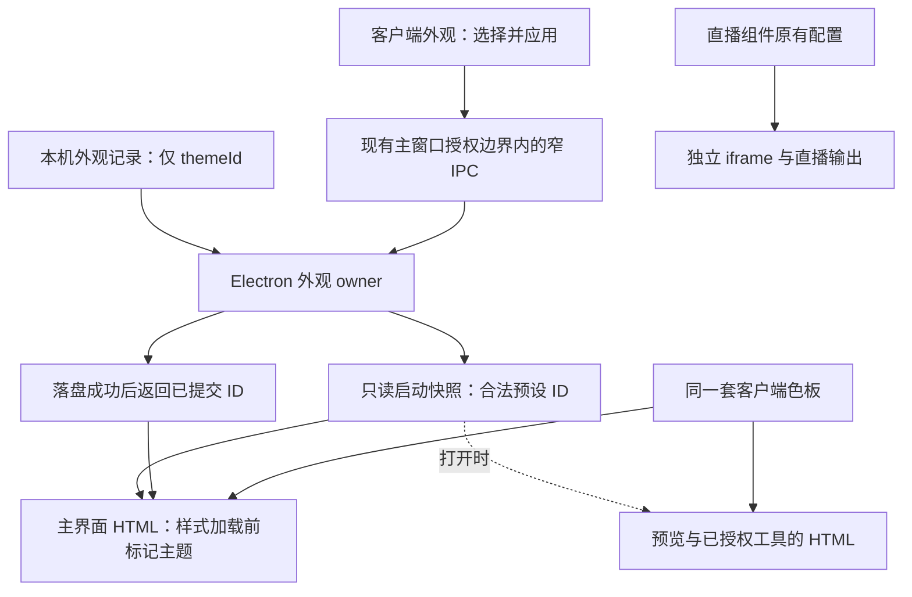

# 客户端三主题：边界、使用体验与实现风险审查

- 日期：2026-10-02。
- 状态：**设计审查提案，未实施，等待与其他界面调整一并确认。** 本文不是已接受规格、ADR 或实施授权。
- 当前代码基线：`5cf23f99c6dd460d0b61774020cf91ed8667a2ea`（v5.0.14）；经典配色取证基线：标签 `v5.0.13`，提交 `597ba3323a497bd39b6737ab947a7c3b181e6e1c`。
- 证据：当前源码、上述历史标签、用户提供的客户端截图、暖陶第二版组件样张，以及色对计算。没有启动、重启或修改正在使用的客户端，没有操作实际业务数据。

## 1. 审查结论

**建议采用“一套组件与操作规则，三套配色预设”。** 这符合希望恢复选择权、保持温暖和色彩层次、又避免杂乱的目标。三套独立 CSS 界面会使修复和维护成倍分叉；只替换几个主色值又不足以覆盖已有页面和控件状态。

建议同时确定以下边界，再实施：

1. **三种主题只改变公共界面的配色与相应表面层次。** 布局、字体、字号、间距、圆角、控件尺寸和操作位置共用。暖陶样张中的尺寸、排版调整不随色板自动进入正式客户端。
2. **保留现有公开 token 名与兼容别名。** 补齐确实缺失的颜色职责及其消费规则，不把样张的 `--brand` 等新命名整套搬入生产。
3. **主界面、普通浮层和独立工具的界面外框接入同一色板；直播内容独立。** 登录页全部排除。场景预览的编辑工具、检查底色、实际输出需要分开处理。
4. **主题选择作为本机偏好保存。** 主客户端原位生效，重新打开仍保留；不要求刷新、重启、重新登录或重新连接直播间。
5. **系统浏览器中的工具首版采用“打开时跟随”。** 当前组件预览确实在系统浏览器打开，不能承诺它与 Electron 主界面即时同步。既有编辑页面不自动刷新。
6. **三套都接受同一可读性与状态检查。** “经典”保留色彩身份，不等于复刻旧布局或保留旧的低对比度问题；“中性蓝”也不是冻结全部历史缺陷。

**可确认方案有可行的实现路径；不能据此承诺没有运行时 bug。** 本报告给出了具体故障触发条件、处理规则和实施后的验收项，尚未执行这些运行验收。

### 回退状态

本次开始及调查过程中核查：`desktop/theme.css`、`gift-audit.css`、`gift-audit.html`、`license.html` 均无工作区差异。`license.css` 保留任务开始前的用户版本，Git 内容哈希为 `9bc15c26b687e66e2a32b29298f5139d40203953`。此前误加的主题接入不在这些文件中。

以下四个既有修改继续保留，不属于本报告的改动：导航样式 `public/css/admin/workspace/base.css`、登录样式 `public/css/license.css`、欢迎动画 `public/css/license/welcome-art.css`、导航标记 `public/pages/admin/shell-start.html`。本报告不以“恢复到 HEAD”覆盖它们。

## 2. 三个原始“坑”的复核与处理

| 问题 | 代码核查结果 | 建议怎样处理 |
| --- | --- | --- |
| token 名不能改，只能换值 | 当前确有 **42 个 CSS 文件**直接消费 `var(--color-primary…)`、`var(--color-accent…)` 或 `var(--color-control-accent…)`。这只是这组变量的消费者数量，不是全部主题覆盖量。保持名称是正确的兼容要求，但“只能换值就能完全落地样张”不成立。 | 保持既有名称与职责；公共色板赋值，兼容别名指向它。对按下、禁用、必要控件边线、选中文字等缺失职责，按实际消费者最少量补充。状态选择器在原组件 owner 中适配，三套共用。 |
| 桌面层没有覆盖阴影、字体等 | [桌面主题](../../public/css/desktop/theme.css)已经覆盖 `--shadow-sm`、`--shadow-md`、`--shadow-floating`、`--shadow-dialog`。字体、字号和滚动条几何从 base 继承并非错误。`--shadow-lg` 未覆盖，但本次找到的使用为确认框的后备值，不能据此认定当前存在可见缺陷。 | 共同的几何和排版继续共享。阴影等级统一，必要时按色板调整色相或透明度。只处理真实生效的遗漏，不为“完整覆盖”重复所有 base 变量。 |
| gift-audit 和 license 各有独立色值体系 | [礼物审计](../../public/css/gift-audit.css)确有整组硬编码色值、独立焦点色与局部别名，且页面未载入桌面主题。登录页的 `--license-*` 是另一套平行副本，它并非遗留旧蓝：文件注释与取值表明这套中性色与蓝色是照着桌面主题主动对齐的重复定义，目前还叠加了当前用户修改。 | 礼物审计纳入公共外观的样式适配；登录页按明确要求排除，连间接继承污染也要防止。两者虽都独立取值，成因不同（一个是未接入，一个是主动平行），不能当成同一种“旧蓝残留”处理，也不能靠同一次合并解决。 |

这三项应在同一次主题适配中协同设计：**颜色 owner、入口作用域、组件状态与独立工具映射一起完成**。实现可以分阶段核验，但不应发布“主界面已暖陶、常用弹窗仍旧蓝、禁用态又是另一套”的半成品。

## 3. 三套预设的定义

名称和 ID 是建议值，不是现有配置项。全部为浅色；本次不增加深色、跟随系统、自由调色器或主题导入导出。

| 建议名称 / ID | 保留的视觉身份 | 取证与限制 |
| --- | --- | --- |
| 中性蓝 / `neutral` | v5.0.14 的灰白环境与蓝色动作 | 页面 `#F3F3F1`，卡片 `#FFFFFF`，动作 `#2F62D4`。已有弱文字、焦点和功能边线问题仍须修正。 |
| 经典暖金 / `classic` | v5.0.13 的暖纸色、朱红操作、金色点缀 | 历史值包括页面 `#F7F3EF`、卡片 `#FFFCF8`、动作 `#D92D20`、金色 `#C79A3B`。旧版还混用 base 的粉色与青绿变量，不能把它简化为“全粉主题”。 |
| 暖陶 / `terracotta` | 明亮燕麦环境、陶土操作、少量有意义的状态色 | 采用第二版样张作为候选视觉基线：页面 `#F8F5EF`、卡片 `#FFFCF7`、动作 `#9E5540`。样张是设计示意，不是客户端运行效果。 |

经典预设不恢复旧版顶部渐变、毛玻璃、标题装饰条、旧排版或旧按钮位置。应从历史变量和真实消费者提取颜色职责，不能直接导入 v5.0.13 的整个 `theme.css`。

建议对已有用户和无偏好记录的安装均以 `neutral` 为默认，避免升级后突然换色。暖陶可突出为新的可选方案，但不自动替用户选择。将来调整默认值需要单独决定，不能把未知主题值偷偷映射成“本次推荐色”。

三套之间允许普通语义色的明暗配对适配背景，但成功、错误、警告及业务分类的含义不能换。不能在一套里以绿色表示开启，另一套里又以绿色表示成功而没有其他状态线索。

## 4. 明确作用边界

| 区域 | 是否跟随客户端主题 | 处理规则 |
| --- | --- | --- |
| 主窗口页面、顶栏、普通卡片、表单、列表、播放器外框 | 是 | 通过现有颜色 token 消费同一预设；播放进度、音量、播放状态不因换色改变。 |
| 主导航、页内 Tab、侧栏 | 是 | 同色阶、各自保留形态；不用一条通用样式把它们全部变成实心按钮。 |
| 菜单、帮助气泡、系统 Toast、确认框、抽屉 | 是 | 包括动态挂载到 body 的浮层，以及页面局部覆盖；实际背景与文字成对检查。 |
| 礼物审计页公共外观 | 是，限样式与只读主题初始化 | 使用色板变量及本地别名映射，不导入窗口拖拽、隐藏按钮等桌面壳规则。其访问授权保持原状，见第 8 节。 |
| 组件预览／场景编辑器工具栏、参数栏、图层列表 | 是 | 主界面内继承；系统浏览器页面打开时取当前已保存预设。 |
| 棋盘、浅色／深色检查底 | 否，独立的评估环境 | 固定检查底色，不由界面 `--surface` 派生，避免换客户端主题改变判断依据。 |
| 场景中的组件、实际浏览器源输出、观众侧点歌页面 | 否 | 保留各自配置。OBS 与哔哩哔哩直播姬均使用这些浏览器源，不能把排除规则写成仅适用于 OBS。 |
| 悬浮歌词的实际内容和用户选定颜色 | 否 | 设置页的普通控件可跟随；歌词画面、专属深色检查区及其滚动条保持自己的配对。 |
| 盲盒主题、加班机专属控制台、游戏与业务内容视觉 | 保留独立设计 | 普通外部工具栏可适配；内部不能因为继承公共变量而被动染成陶土。此边界延续专属外观的职责，不新增三套业务卡片。 |
| 分类、盈亏、连接与错误状态 | 保留含义，分别映射 | SC 不是警告、点歌不是成功、处理中不是成功；可以共享数值，不能因此合并职责。 |
| 封面、礼物图片、Logo、平台图标、现有位图导航图标 | 不自动重着色 | 检查与三种背景是否协调，不能对图片统一套滤镜。需要替换资源时另列具体素材设计项。 |
| 登录／授权页面及欢迎动画 | **全部排除** | 保持当前颜色、木炭色主按钮、动画及自身系统深色规则；不增加客户端主题标记或样式导入，不改 `--license-*`。 |

已有 [9 月 28 日调研](2026-09-28-client-theme-research.md)曾讨论深色及登录协同；那是历史候选。**本次明确要求优先：只做上述三种浅色预设，登录页排除。**

## 5. 从使用者角度看，哪里可能不协调

### 5.1 高级感不能只靠变暖或降低饱和度

用户截图中，大面积相近底色、多层边框和密集粗体共同造成沉重感。暖陶样张的留白、字重与布局也变了，所以不能把样张观感全部归因于新色值。后续应在**同一份真实页面、同一内容、同一尺寸**下对比三套配色。

实算当前灰底／白卡片对比为 **1.11:1**，暖陶页面／卡片约 **1.06:1**。暖陶更明亮、更温暖，但卡片与页面的亮度分离反而更小。它需要恰当的间距、面层和轻量边界，不能声称仅换这两个色值就让卡片“浮起来”。卡片装饰边并不统一要求达到控件边界的对比度标准。

“蓝色必然廉价”“HSL 饱和度拉开三倍就高级”“明度差达到某个百分比就有层次”都不是可靠的设计验收规则。蓝色在这里不符合用户想避开模板感的偏好，足以支持新增暖陶；无需给颜色本身定高低。HSL 饱和度、相对亮度和感知亮度也不能混用。

### 5.2 色彩可以丰富，但必须能解释用途

建议采用四类职责，而不是把所有非主色都当作噪声：结构、动作、状态、业务分类。图片与品牌素材另有内容职责。

| 场景 | 暖陶候选规则 | 人的判断依据 |
| --- | --- | --- |
| 保存、确认等当前主要动作 | 陶土实心、白字 | 在相关任务区域内建立入口，不要求整屏机械地只能有一个主按钮。 |
| 重新检测、复制、打开预览等普通操作 | 暖白／透明底、灰褐字 | 明确仍可点击；不要为了“安静”全部做成像禁用的浅灰字。 |
| 删除、清空等危险动作 | 玫红文字和边界、明确动词 | 不能只靠与陶土相差一点色相。危险确认沿用已有流程，主题工作不顺手增删确认步骤。 |
| 当前 Tab／导航位置 | 浅底、深陶字、位置标记 | 常驻选中与键盘焦点分开；辅助使用 aria 状态，不仅改变颜色。 |
| 已连接／成功 | 灰绿与勾选／状态文字 | 开关开启表示启用，不自动等于已连接成功。 |
| 未检测、等待、需处理 | 普通空闲状态用中性；需用户处理才强调金棕 | 样张“待检测”是示例，不能把所有正常等待都做成警告。 |
| 普通说明／信息消息 | 普通说明灰褐；明确的信息消息才用雾蓝 | 消息色不应让不可点击的说明看起来像链接。 |
| SC／点歌队列数量 | 固定分类标签及明确文字 | 类别与操作强调分离，避免主色变陶土后两类队列都变成近似暖色。 |

当前 [队列样式](../../public/css/admin/workspace/song-layout.css)的点歌分类与主操作共同依赖 `--primary`，SC 依赖 warning。它们目前表现如此，但这不等于长期正确的职责划分。建议将**分类标记**与**队列主按钮**在模块内分开映射；分类含义保持，按钮消费动作色。具体分类色在三主题真实队列对照中确认，本报告不擅自把现有蓝色或旧绿色全部换成另一色。

### 5.3 暖陶按钮和危险玫红仍需非颜色区别

保留第二版 `#9E5540` 与 `#AF4052` 的组合可行，但不能保证所有人仅凭颜色分清。主按钮实心、危险按钮文字／描边，以及明确的“删除／清空”动词，才是主要区别。危险、成功等信息须有文字或图标。[WCAG 颜色使用说明](https://www.w3.org/WAI/WCAG22/Understanding/use-of-color.html)

不建议为了让危险色“更粉”直接替换为更亮的值；先验证它在默认、悬停、按下、错误背景上的真实对比度。原建议中“只拉开色相就解决危险混淆”的结论过强。

### 5.4 导航形态、图标与文字要一起看

主导航适合较大的浅色选中面；页内 Tab 适合下划线；纵向侧栏宜保留现有侧边标记和浅底。样张把侧栏也画成底部下划线，是示意，不应机械迁入所有纵向列表。

当前用户修改已把主导航切成普通／选中两套 WebP。样张使用的简洁图形不能证明这些位图在暖陶上协调。先检查实际素材；若选中状态仅靠位图换色不足，就由共同的选中面、文字和标记补足，不强制为三个主题各重画一整套资源。

字体、留白、减少嵌套边框确有改善空间，但应列为**三主题共用的下一组界面调整**。本次不能因为选择经典色板就恢复旧大阴影，也不能因为选择暖陶就突然改变控件高度。

### 5.5 换主题不应打断正在直播的人

建议入口为设置中的“客户端外观”，与已有“点歌板主题／直播组件样式”明确分开。展示三个相同构图的小样，包含背景、普通按钮、主按钮、选中态和一条状态信息；只摆色块不足以帮助判断。

建议交互为：**选择候选 → 看选项内小样 → 点击“应用配色” → 主界面立即生效并保存**。候选与“当前使用”分开，切换候选不改整个应用；离开未应用的候选不写入。这样无需额外的全局预览恢复机制，也不干扰其他未保存表单。

应用时只改主题状态与根节点颜色标记，不重建面板、重新挂载播放器或刷新业务状态。保存失败时保持原主题，保留候选供重试，并说明“配色未保存，请重试”；不能先显示成功再偷偷恢复。

用户需要知道的范围说明可简写为：**“客户端立即生效，网页工具下次打开时跟随；直播画面保持原设置。”** 三套都固定为浅色，本次不将操作系统的浅深模式与此选择混成一个控件。

## 6. 色值与状态契约

### 6.1 暖陶第二版保留的候选参数

以下记录颜色职责，避免报告依赖临时样张文件才可阅读。这些是设计值，不是要求把左列名称变成新的生产 token。

| 职责 | 候选值 |
| --- | --- |
| 页面／内容面／导航面 | `#F8F5EF` / `#FFFCF7` / `#F2EEE7` |
| 标题／正文／辅助说明 | `#36312C` / `#575048` / `#6F655B` |
| 主操作默认／悬停／按下 | `#9E5540` / `#8D4B37` / `#743A29`，前景 `#FFFFFF` |
| 选中文字、链接／选中底／中性悬停底 | `#8B4935` / `#F5ECE4` / `#F4EFE8` |
| 装饰线／普通按钮边／按钮悬停边 | `#DED5C8` / `#D2C7BA` / `#B7A797` |
| 输入底／功能边线／功能边线悬停 | `#FFFDF9` / `#938779` / `#796E61` |
| 禁用底／禁用字 | `#EEEAE4` / `#8B8176` |
| 成功前景／底 | `#41745C` / `#EDF4EB` |
| 警告前景／底 | `#89601C` / `#FAF2DE` |
| 信息前景／底 | `#526B86` / `#EFF3F7` |
| 错误／危险前景、浅底、描边、按下底 | `#AF4052` / `#FBEEF0` / `#D5A3AD` / `#F7E4E8` |

三个预设应提供相同的公共职责，不允许经典少一项就悄悄继承 base 的粉色，或暖陶的信息提示直接继承旧主蓝。

### 6.2 为什么不能承诺“只改 token 值”

| 现有实现 | 值替换无法解决的部分 | 设计处理 |
| --- | --- | --- |
| 输入默认边线用 `--border`，悬停用 `--color-border-strong` | 加深 strong 不会改善默认输入轮廓；把 `--border` 一律加深又会让所有卡片很重。 | 在桌面作用域内分开装饰边与功能边，相关输入组件改消费功能边角色。 |
| `button:disabled` 整体 `opacity: .55`，select 为 `.58` | 新禁用色仍会二次变淡；底色不同会得到不同结果。 | 对纳入主题的普通控件定义禁用背景／前景；中和其原透明度，抑制 disabled hover/active。专属业务控件独立检查。 |
| 只有 primary 与 primary-strong | 缺独立按下色；同一 strong 可能既作悬停背景又作链接文字。 | 必要时在 `--color-*` 体系内增补 active、选中文字等职责；旧变量名不删，不把别名偷偷改成另一含义。 |
| 普通 Tab 当前只改变文字和下划线 | 替换 primary-light 不会自动出现样张浅底。 | 是否采用浅底属于共同选中规则，需在 Tab owner 中明确应用；不是每套主题独立写规则。 |
| `--text` / `--muted` 兼容别名被广泛使用 | 不能简单把“标题／正文／说明”的三列数字塞进去，就假定每处文字角色正确。 | 核查实际消费者；默认可读文字、辅助信息、链接分别消费正确职责。不全局把正文降为浅灰。 |
| gift-audit 的 `--blue` 同时用于动作和 info | 直接把 blue 映射成陶土会让信息消息一起变动作色。 | 保留必要局部别名，拆开动作和信息消费者；局部紫／橙分类先确认含义，不批量抹掉。 |

新增 token 的最终名单应以实际状态表为依据，遵循现有 `--color-*` 命名。样张名 `--brand`、`--brand-ink`、`--selected` 不成为第二套公开 API。兼容别名应在同一主题作用域映射；局部覆盖也要检查，不能假定父级已计算的别名会随子级另一个变量自动重新绑定。

### 6.3 对比度复算与解释

方法：WCAG 2.x 的 sRGB 线性化、相对亮度与 `(L亮 + .05) / (L暗 + .05)`。以下结果本轮按色值独立复算，表格显示两位小数，判断使用未舍入值。

| 色对 | 比值 | 本次判断 |
| --- | ---: | --- |
| 现有弱文字 `#9A958E` / 白面 | 2.97 | 不适用于普通说明文字；3:1 门槛也未达到。需核查真实文字／图形用途，不能整体称为合格弱文字。 |
| 现有辅助文字 `#66625C` / 白面 | 6.06 | 数值满足普通文字基准。 |
| 现有默认输入边 `#E1DFDA` / 白面 | 1.33 | 若识别输入区域依赖此边线，明显不足；装饰线不能据此直接判失败。 |
| 现有悬停边 `#CBC8C1` / 白面 | 1.67 | 仅悬停加深也不足以解决上述必要边界问题。 |
| 现有 38% 蓝焦点环合成到白面 | 1.76 | 不能因原色蓝够深就认定半透明焦点清晰；还需检查真实相邻色和其他提示。 |
| 经典金 `#C79A3B` / 暖白 `#FFFCF8` | 2.53 | 可保留装饰身份，不直接用于小字号金色字或唯一状态标记。 |
| 白字 / 经典红 `#D92D20` | 4.83 | 普通文字数值通过，仍需检查实际状态和透明度。 |
| 白字 / 暖陶主操作 `#9E5540` | 5.49 | 有一定余量。 |
| 暖陶危险字 / 按下底 | 4.68 | 通过但余量小，不再附加降低透明度。 |
| 暖陶功能边 `#938779` / 导航底 | 3.04 | 通过但接近边界，只适用于已核对的背景配对。 |
| 暖陶辅助说明 / 导航底 | 4.92 | 数值满足普通文字基准。 |

普通文字检查基准为 4.5:1；大字可为 3:1，不能把“18px 普通文字”直接当作大字，常用换算约为 24 CSS px 普通字或 18.67 CSS px 粗体。真正不可用的控件有相应例外，但不能把仍可操作的弱化按钮归作禁用。[WCAG 文字对比度说明](https://www.w3.org/WAI/WCAG22/Understanding/contrast-minimum.html)

必要控件边界、状态和识别图形应按实际相邻色检查 3:1；不是所有细线都需加深。2px 实线焦点环也只有在实际背景上可见、未被裁剪时才有效。[WCAG 非文字对比度说明](https://www.w3.org/WAI/WCAG22/Understanding/non-text-contrast.html)

选中、悬停、按下、焦点应可组合：选中项获得焦点时两者都能辨认；错误输入获得焦点时保留错误说明与错误边线。使用 `:focus-visible`，不为了去橙框直接去掉 outline；它由浏览器判断，并非严格“只有键盘才显示”，文本输入框用鼠标聚焦时也可能匹配。[MDN focus-visible](https://developer.mozilla.org/en-US/docs/Web/CSS/Reference/Selectors/:focus-visible)

这些数字不代表三个正式主题或整套客户端已经通过无障碍验收。半透明浮层、图片背景、组合状态以及实际 Windows 渲染仍须验证。

## 7. 建议的所有权与加载方式

### 7.1 样式归属

建议从现有 `desktop/theme.css` 提取**仅变量的客户端色板入口**，例如 `public/css/desktop/palettes.css`。这是为主壳和独立工具共同使用而拆分，不引入主题框架、构建工具或新服务。

| 所有者 | 责任 |
| --- | --- |
| `styles-base.css` | 继续提供公共基础、字体、尺寸等默认能力；不全局替换其粉色／青绿品牌默认，避免影响登录与其他页面。 |
| 建议的客户端色板文件 | 三个预设的标准颜色 token 与兼容别名；只在明确加入主题的根节点生效。 |
| `desktop/theme.css` 及桌面壳样式 | 共用的桌面几何、拖拽区等规则；不能把这些规则导入独立浏览器工具。 |
| 按钮、Tab、select、switch、range、Toast 等既有 owner | 定义共用状态规则，消费 token；有实质差异的模块保留自身职责。 |
| gift-audit 的局部样式 | 将旧局部变量接到标准角色，保留自己的页面布局、分类与工具交互。 |
| 登录、专属业务视觉、预览内容 owner | 维持自身样式与配置，显式防止公共主题误入。 |

建议使用语义明确的根标记，例如 `data-client-theme="terracotta"`，避免复用既有直播组件的 theme 字段。该属性只是呈现状态，**不证明页面有任何权限**。所有预设应采用确定的加载顺序；不要靠不断提升选择器权重或追加 `!important` 对抗遗留赋值。

后续调整设计参数时，集中修改对应预设，重新加载就能使用它的新色值；偏好只保存 ID，不把旧色号拷贝进每个用户的配置。实际用户切换预设则原位生效，无需重新加载。这里区分了开发时调整色板与使用者选择外观，首版不增加逐个按钮自由调色的编辑器。

### 7.2 偏好存在哪里

已有侧栏偏好会经 `/api/settings` 持久化，故不能声称项目“没有可复用的持久化模式”。但本次还要求主进程与首帧能使用该值，需要明确单一权威来源。[侧栏偏好测试](../../test/admin/toolbox-sidebar-preferences.test.js)

另一个需要纠正的推断是：**把设置放入 settings 表不等于必然上云。** 当前 [settings-contract](../../src/server/settings-contract.js)按白名单序列化云设置。选择单独的本机外观存储，是出于职责、启动时序和生命周期，而不是假设全部 settings 自动同步。

| 选项 | 评价 |
| --- | --- |
| 仅 renderer localStorage | 最少代码，但主进程创建窗口前无法直接使用；外部浏览器也不共享 Electron 的存储。它按 origin 分开，不能当作跨进程或跨浏览器同步机制。 |
| 现有 settings 增加本地键 | 可行且能复用 SQLite，但需要明确业务设置广播、读取时序和客户端外观的边界；不得让外观保存触发业务重配置。 |
| **主进程拥有一个小型本机外观记录，推荐** | 满足首帧读取和单一写入者；独立于直播间、账号、云设置及浏览器缓存。代价是需要窄 IPC、落盘失败处理和相应测试。 |

建议记录放在既有 `dataDir` 下的专用文件，例如 `client-appearance.json`，只保存白名单 `themeId`，不保存任意 CSS 或每个按钮的用户色值。目录遵循 [ADR-0016](../architecture/adr/0016-separated-client-data-lifecycles.md)，不放进 cache，不复用 license 文件，不重新迁移数据目录。可沿用仓库现有“临时文件写完后替换目标”的本地文件写入模式，但不调用授权存储来保存外观。

`desktop-state.js` 只是内存状态，不能直接声称它已提供重启持久化。主题偏好应与账号切换、退出登录、直播间切换和业务设置导入分离；普通缓存清理不删除它。整份客户端数据被用户删除或迁移时，则遵循同一数据根的既有生命周期。首版不另加主题导入／导出功能。

localStorage 按来源隔离见 [MDN localStorage](https://developer.mozilla.org/en-US/docs/Web/API/Window/localStorage)。当前桌面默认使用 3000，服务端按请求端口 `listenExactly`；本报告**不以“每次启动随机换端口”作为否决 localStorage 的理由**。真正问题是权威所有者和不同运行环境。

### 7.3 首帧与后续切换

建议的数据流如下，虚线表示仅在页面打开时传递：

建议主进程在创建主窗口前读取、校验外观；通过现有本地 runtime 组合入口提供**只读主题快照**，由白名单页面生成过程在 CSS 前写入合法枚举值。主窗口后续修改走窄 IPC，沿用 `createMainWindowIpcRegistrar` 的主 frame、窗口身份、精确 origin 与路径校验。不要用同步 IPC 在首帧临时读取文件。

这里的快照不是启动时永久固定的值：主进程落盘成功后更新当前已提交状态，每次生成主界面或工具 HTML 都读取该状态。沿用当前 HTML 的 `Cache-Control: no-store`，不缓存带旧主题快照的完整页面，也不改写磁盘上的共享 HTML 模板。页面已经打开或从已有页面状态恢复，仍按“既有页面不强制同步”的边界处理。

HTML 初始化只处理显式列出的主界面、组件预览、授权后的礼物审计页面；不对所有 HTML 注入，不触及 license、scene 或各浏览器源内容。没有 Electron owner 的独立服务模式可采用中性默认，不能为了取颜色要求浏览器获得桌面权限。主题快照不包含账号、路径、Token 或业务设置。

三套色值以 CSS 为主要来源。若主进程需要主题对应的 `backgroundColor`，只维护必要的三项启动底色元数据，并验证其与 CSS 页面底相符，避免再复制完整色板。当前原生窗口底为 `#F7F3EF`，不能仅处理 DOM 后就宣称首帧一致；登录路由继续使用原先启动外观，不全局切 `nativeTheme` 影响登录。

所有持久化修改按顺序处理。UI 在一次应用未完成时禁止重复提交；落盘成功后才切换已提交主题，失败保持旧主题。若实现允许排队，则明确按提交顺序完成，不能让旧响应覆盖新选择。请求、样式属性和值均只接受三个 ID，不接收文件路径、CSS 片段或 URL。

未设置时用中性默认；非法／无法解析记录在本次运行回退到中性并留下适度诊断，不因读取失败覆盖原文件；显式应用合法主题时才写入。未知的未来主题 ID 也按此规则处理。这只定义偏好解析兼容，不承诺整个产品可以安全跨版本降级。

### 7.4 系统浏览器中的预览与礼物审计

证据明确：[component-preview-dialog.js](../../public/js/admin/component-preview-dialog.js)创建 `/component-preview` 链接，`desktop-request-auth.js` 将窗口打开请求交给系统浏览器。它没有主窗口 preload，不能使用同一 IPC；即使 URL 相同，两个浏览器的 localStorage 也不是同一个存储。

建议首版通过上一节的 HTML 只读快照让**新打开的工具页面**取到已提交主题。已打开的页面保留原外观，不轮询、不刷新、不重建编辑器。正常完成保存或取消后，下一次打开自然跟随。这个范围有暂时不一致的代价，但边界明确，不应宣传为“所有窗口实时换肤”。

如果后续确认必须即时同步外部工具，需另行设计只读、受限的外观通知及其生命周期；不能把它塞进组件配置草稿、发布数据或通用管理员凭证，也不应仅为主题建立新的服务。首版方案不依赖这项能力。

礼物审计通过 `/pages/gift-audit.html` 访问，当前静态 HTML 受授权检查。其脚本还读取 `window.__API_TOKEN__`，而全仓库只在 [overlay-bootstrap.js](../../src/server/overlay-bootstrap.js) 注入该字段，[http-utils.js](../../src/server/http-utils.js) 也只对 overlay scope 页面拼接这段 bootstrap；礼物审计作为普通静态页走的是直接读取文件的分支，**没有任何注入点**，因此该页面上的 `window.__API_TOKEN__` 恒为空，其携带 Token 的请求不会带上凭据。这属于本报告未运行验证的独立问题。现有文档与旧工具接入存在需要单独核实之处。因此，**样式可纳入统一设计，工具实际可达性与数据连接不能算作本次已验证结果**。只在已有授权通过后的响应中增加外观快照，绝不扩大主窗口 IPC 路径、传出管理员 Token 或把该页改成免授权来“方便换肤”。

## 8. 从实现审查角度列出的主要风险

以下优先级表示实施时的阻断程度，不表示这些未来能力已经存在 bug。“已证实”仅限表中现状。

| 优先级 | 触发条件与后果 | 证据状态 | 实施防线 / 验收 |
| --- | --- | --- | --- |
| P1 | 改 base 全局色或误导入桌面样式，登录、直播画面或业务专属卡片被染色 | 共用 base 与多个独立主题已证实 | 明确入口白名单与局部隔离；切换三套后排除对象颜色、配置和输出保持原契约。 |
| P1 | 用 reload 应用主题，播放中断或未保存参数丢失 | 预览有草稿恢复与 pagehide 清理；后果为设计风险 | 原位改主题标记；活动播放、未保存输入、已开弹窗保留；不产生重连／业务保存。 |
| P1 | 经典／中性原样复制弱字、金字、半透明焦点 | 数值不足已证实，实际适用点需逐项判断 | 三套共用可读性标准，不把“经典保留”当作豁免；对实际背景计算。 |
| P1 | 把普通边线和功能边线混成一个 token | 输入默认值与 strong 消费位置已证实 | 普通面板轻线，必要控件可见边界；默认、悬停、焦点分别检查。 |
| P1 | 为外部工具同步主题而放宽授权或暴露任意样式／文件能力 | 现有跨运行环境与 IPC 限制已证实 | 只传合法主题 ID；主窗口可写、工具只读；未授权请求仍按原规则拒绝。 |
| P1 | “浅色检查底”引用 `--surface`，主题改变用户对输出颜色的判断 | [component-preview-page.css](../../public/css/component-preview-page.css)第 48 行已证实 | 检查底使用独立固定值；主题切换不改检查底、草稿、发布数据及实际组件外观。 |
| P2 | 只改变 root，body／局部变量、内联色和动态浮层仍保留旧值 | 局部别名及硬编码已证实 | 从实际消费者和生成节点检查，按职责接入；不使用全局字符串换色。 |
| P2 | 主色同时表示队列分类、信息消息与主要动作 | 点歌队列及审计页复用已证实 | 分开角色消费，保留文字／图标；给配色身份与业务分类分别建映射。 |
| P2 | 保存失败仍显示新主题，或快速选择产生旧响应覆盖 | 未来异步切换风险 | 单一写入者、应用期间禁止重复提交，持久化成功后提交；失败和重启验证。 |
| P2 | 启动先出现 base 粉色／旧蓝，稍后才换色 | 当前已有 CSS 前的 desktop 标记，但无三主题启动路径 | 合法 ID 在 CSS 前可用；检查原生窗口底及登录到主界面转换。 |
| P2 | disabled 仍触发 hover 变色、错误+焦点互相覆盖 | base 透明度与无 disabled 过滤的 hover 规则已证实 | 明确状态组合优先级，保留语义说明，避免只测单独状态。 |
| P2 | 外部页面缓存旧主题，被误称为全窗口同步 | 系统浏览器边界已证实 | 按“新打开时跟随”验收和说明；不自动重载未保存编辑器。 |
| P2 | 监听重复注册，换色引发重复请求或业务广播 | 未来接入风险 | owner 负责幂等初始化与清理；不把换色放进业务 mount／save 流程。 |
| P3 | 导航 WebP、渐变和透明边缘与暖陶不协调 | 位图资源已证实，当前三主题效果未实测 | 用实际图片检查；需要时只对具体素材提出变体，不统一滤镜。 |

实际预览组件由 [component-preview-surface.js](../../public/js/admin/component-preview-surface.js)创建 sandbox iframe，父级 CSS 不会自动穿过文档边界。这是已有隔离优势；仍应检查工具有没有把客户端主题写进发送给 iframe 的配置。不能把“有 iframe”当作所有预览都已验证安全的结论。

## 9. 实施后的验收矩阵

本节是未来验收要求，**本次没有执行运行测试**。可复用现有 select、Toast、组件预览、启动与 IPC 测试夹具；必要时补主题自身的持久化／初始化契约测试，不新造一整套 UI 测试框架。

| 验收项 | 具体通过条件 |
| --- | --- |
| 三预设完整性 | 每套提供同一必要颜色职责；新旧别名一致；无意外继承 base 粉色／青绿；非法值回到中性。 |
| 同构比较 | 同一真实页面、同一内容、相同窗口大小比较三套；布局、密度、按钮位置一致。普通 100% 与实际使用的 Windows 缩放下检查中文细字与焦点。 |
| 按钮与输入 | primary、secondary、ghost、danger 的默认／悬停／按下／焦点／禁用及现有 loading；输入 normal/error/readOnly/disabled 与焦点组合。readOnly 不被误画成不可读的禁用态。 |
| 导航 | 当前页与焦点独立可见；鼠标、键盘状态与 ARIA 一致；不因取消橙色外框而丢失键盘位置。 |
| 控件 | 开关开／关／禁用，复选、单选、select、参数滑块、播放器独立音量和进度控件，必要图形与底色可分。 |
| 浮层 | 菜单、帮助气泡、确认框、Toast、抽屉在三主题中与所在表面配对；动态挂载后仍继承，不残留旧蓝色背景或错误透明度。 |
| 真实页面代表 | 双队列、播放设置、百宝箱表单、礼物列表、场景工具至少覆盖对应的不同 owner；同一共享实现可复用证据，有局部覆盖的实例单独检查。 |
| 本机持久化 | 应用、切页、重新加载主页面、退出再打开均恢复；账号／直播间切换与普通缓存清理不误清；未知 ID、坏记录、写入失败有确定行为。 |
| 快速交互与反馈 | 重复点击不并发写入；失败不显示“已应用”；当前主题标签、真实页面及落盘状态一致。 |
| 活动工作保持 | 播放、队列、未保存设置、未保存场景、选区、滚动与焦点不被重建；换色没有触发业务设置保存、发布、WebSocket 重连或额外云请求。 |
| 首帧 | 冷启动、主页面重新加载、登录后进入主界面，无可见的错误主题首帧；登录仍用自己的设计。 |
| 系统浏览器工具 | 新打开时跟随已提交主题；旧编辑窗口不刷新、不丢草稿；独立打开缺乏桌面 owner 时使用约定默认。 |
| 内容隔离 | 棋盘与浅／深检查底不变；组件配置、直播输出、观众侧页面、歌词与专属业务视觉没有被公共主题意外修改。 |
| 授权与生命周期 | 主题 IPC 仅接受合法主窗口来源和枚举；外部工具不可写全局偏好；已有受限页面仍受限；重复进入设置不重复监听。 |

聚焦的新增验证应覆盖首帧初始化、存储失败、快速切换和隔离边界这些真实风险；普通色值改动不必逐个写与实现重复的测试。涉 Electron 启动、IPC 与持久化的部分已超出“几个 CSS 值”的风险，应按仓库相应流程验证。测试必须用临时 dataDir 和独立会话，不能重启用户正在直播的应用。

## 10. 建议的后续执行顺序

**现在只保存这份报告，不实施。** 后续与其他 UI 调整一起确认时，以以下顺序减少返工：

1. 确定三预设、登录与内容排除边界，以及系统浏览器工具“打开时跟随”的体验；明确经典是色彩身份保留。
2. 在现有组件中整理角色与状态表；提取纯色板，补必要角色，保持现有公开名。以中性主题作为公共接入基线，再加入经典与暖陶，避免同时变化太多无法归因。
3. 同步适配主界面浮层、表单与独立工具别名；拆开动作／分类／检查底职责。先做同一真实页面的三套对照，用户一起确认色彩与另行提出的公共布局调整。
4. 接入本机保存、首帧快照与“应用配色”，验证失败路径、未保存工作和跨页面边界。最终通过同一验收矩阵后再作为完整功能交付。

这一顺序是设计建议，不是要求本轮开始修改。最终 token 补充名单、队列分类的具体配对、位图是否需要变体，需要真实组件试样后定稿；它们不能用通用样张替代。主体边界、单一颜色职责、登录排除与无重载应用的建议已经明确，不需要先改代码来试探这些决定。

## 11. 证据范围与限制

本轮完成：工作区与回退状态核对；v5.0.13 主题历史读取；当前 token 消费与关键状态规则检查；首屏、IPC、系统浏览器预览、持久化和云设置白名单路径核查；用户截图与第二版样张对照；上述关键色对复算。没有运行客户端测试，也未宣称所有 42 个文件的所有状态已审完。

文档验证：完成一次无聊天背景的独立读者审读；全文 39 个 Markdown 链接，其中 12 个为 http 标准链接，其余 34 处本地链接去重后为 **27 个文件**，本次逐个复核均可解析；`npm run verify:docs` 的 9 项检查通过。这些检查证明文档及引用的完整性，不替代第 9 节的产品运行验收。

重点代码依据：

| 依据 | 支持的结论 |
| --- | --- |
| [styles-base.css](../../public/css/styles-base.css)、[desktop/theme.css](../../public/css/desktop/theme.css) | 标准 token、兼容别名、已覆盖阴影、继承的几何及控件默认状态。 |
| [tabs.css](../../public/css/admin/tabs.css)、[song-layout.css](../../public/css/admin/workspace/song-layout.css) | 实际页签形态与队列分类／主操作耦合。 |
| [gift-audit.html](../../public/pages/gift-audit.html)、[gift-audit.css](../../public/css/gift-audit.css)、[gift-audit/index.js](../../public/js/gift-audit/index.js) | 独立入口、局部颜色体系及旧授权依赖；不是桌面子窗口接入的证明。 |
| [license.html](../../public/pages/license.html)、[license.css](../../public/css/license.css) | 登录独立设计及当前用户改动，明确排除。 |
| [shell-start.html](../../public/pages/admin/shell-start.html)、[overlays/desktop.css](../../public/css/overlays/desktop.css) | CSS 前的桌面标记、样式加载顺序及当前位图导航。 |
| [main.js](../../src/electron/main.js)、[desktop-state.js](../../src/electron/desktop-state.js)、[desktop-user-data.js](../../src/electron/desktop-user-data.js) | 主窗口初始底色、内存状态和持久数据路径。 |
| [main-window-ipc.js](../../src/electron/ipc/main-window-ipc.js)、[desktop-request-auth.js](../../src/electron/desktop-request-auth.js) | 主窗口 IPC 白名单与外部浏览器打开策略。 |
| [http-utils.js](../../src/server/http-utils.js)、[component-preview-page.js](../../src/server/component-preview-page.js) | HTML 授权与组合位置；未来只读初始化可接入的入口。 |
| [component-preview-dialog.js](../../public/js/admin/component-preview-dialog.js)、[component-preview-page.js](../../public/js/admin/component-preview-page.js) | 外部预览链接、受限会话、恢复与页面销毁行为。 |
| [component-preview-surface.js](../../public/js/admin/component-preview-surface.js)、[component-preview-page.css](../../public/css/component-preview-page.css) | iframe 内容隔离与浅色检查底耦合。 |
| [admin/theme.js](../../public/js/admin/theme.js)、[settings-contract.js](../../src/server/settings-contract.js) | 现有“主题”属于点歌板配置；云设置有明确白名单，不是全部设置自动同步。 |

标准来源在相关论述处直接链接，查阅日期为 2026-10-02。最终审查结论为：**设计可继续收敛为统一的三预设系统，已发现的耦合有明确处理路径；运行正确性与最终观感仍以实施后的真实 Electron／对应浏览器验证为准。**
