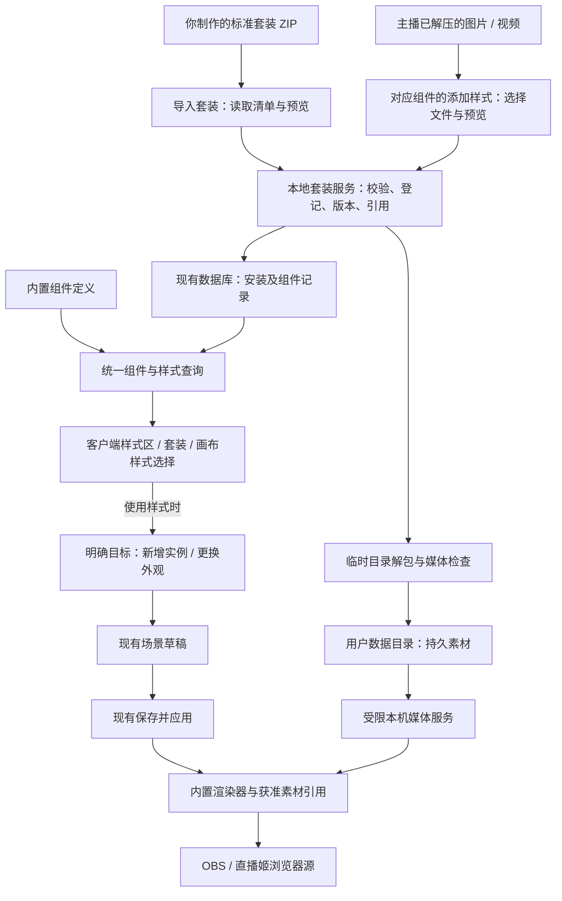

# LIRA 套装包与第三方素材导入：调研及设计报告

**状态：Draft · 设计建议，尚未实施，也不替代已接受的规格或 ADR。**

调研及可行性复核日期：2026-10-06。基线为本机当前工作区源码；体积对照为 2026-10-04 生成的 `lira-setup-5.0.20.exe`，两者并非同一版本的资源集合。复核方法为源码与调用链检查、用户任务推演及交互准则对照；未实施导入功能，未进行真实主播可用性测试或跨直播软件实播。

## 1. 建议采用这个方向

把 LIRA 做成“软件本体 + 可安装的套装和素材”，很适合当前需求。软件负责弹幕、时钟、开播、收礼触发、画布编排和直播输出；体积大的图片、视频、字体与外观预设单独分发。用户安装一次软件，以后可以继续添加你制作的新套装，也可以使用从第三方购买的素材。

**复核结论：方向可行，但需要为不同组件补齐素材使用能力。主入口应放在客户端对应组件页，画布保留同一套样式库的快捷入口。** 添加一种外观、更换当前组件外观和新增一个画布组件，是三种不同的操作，按钮必须说清楚结果。

推荐用户只需理解三件事：**组件是功能，样式是外观，套装是一组配套外观。** “素材 ID、渲染器、安装版本、引用计数”属于实现细节，不出现在常规操作中。第一版不把不同组件伪装成完全相同的“上传后就能用”的插件。

第一版完整交付应同时包含下面两条路径：

| 用户拿到的东西 | 在 LIRA 中怎么添加 | 添加后的结果 |
| --- | --- | --- |
| 你制作的标准套装 ZIP，包含 LIRA 清单 | 点击“导入套装”，预览后导入 | 自动识别背景、弹幕样式、开播动画、礼物展示等条目，加入对应分类，并保留整套入口 |
| 第三方购买并由主播自行解压得到的图片/视频 | 到对应组件的样式区，点击最后的虚线“＋添加样式”，单独选择文件 | 按该组件的用途预览和设置，保存成可重复使用的自定义样式 |

**网页链接继续使用已经实现的浏览器源功能。** 当前分类栏底部的“＋更多”已经可以填写 HTTP/HTTPS 地址；这次增加本地文件入口，并不需要再做一套网页链接系统。[现有操作说明](../guides/component-sources.md)

**ZIP 导入专门用于你制作的标准套装；第三方素材由主播先自行解压，再逐项添加。** 产品无需扫描商家 ZIP、猜测分类或提供整包用途分配向导。导入后落到现有样式列表，名称使用“自定义样式”，不另造一个与“组件”“样式”含义重叠的“我的组件”系统。

### 对安装包体积的实际价值

前一轮打包审计发现，目前最显著的资源是：

| 资源 | 未压缩文件大小 | 所在基线 |
| --- | ---: | --- |
| 林野繁花礼物边框视频 | 61.16 MiB | 已在 5.0.20 安装包中 |
| 月渡花汀动态背景视频 | 40.14 MiB | 当前源码新增资源，尚不能计入旧安装包 |
| 两项合计 | 101.31 MiB | 当前源码中的文件大小合计 |

原安装 EXE 为 173.74 MiB。更强的压缩参数实验将其中的应用载荷从 172.88 MiB 压到 164.24 MiB，约减少 5%，并未生成新的正式安装器。相比继续调整压缩参数，把大型素材从本体拆出去更值得优先做。

这些数字不能直接推算新 EXE 会减少 101.31 MiB：其中一个视频还没进入旧安装包，压缩后占用也需要重新构建测量。拆包减少的是首次下载和本体更新携带的资源；用户装回全部套装后，素材仍会占磁盘空间。详细审计当时保存在本机 `tmp/packaging-audit-93b94a2f/打包体积检查.md`，属于不随仓库分发的临时证据，不是长期契约。

## 2. 同类产品怎么做，哪些值得借鉴

以下区分官方资料、公开演示和实际核验范围，不把没有看到的登录后功能写成事实。

| 产品 | 可核实的做法 | 对 LIRA 的启发 | 证据与限制 |
| --- | --- | --- | --- |
| OBS | 用“来源”添加图片、媒体、浏览器等内容，再在场景中摆放；媒体源有循环等播放设置 | 用户能理解“选素材 → 设播放方式 → 加到画面”这条路径 | [官方来源指南](https://obsproject.com/kb/sources-guide)、[媒体源说明](https://obsproject.com/kb/media-sources)；不能据此声称原生可自动识别任意商家 ZIP |
| 哔哩哔哩直播姬 | 官方教程展示从本地选择媒体，以及素材列表的重命名、调整次序和删除 | 保留直接添加本地素材的低门槛体验；组件卡片可以预览和移除 | [UP 主服务中心教程](https://www.bilibili.com/read/cv16150737/)；依据公开旧教程的可检索文字，未操作当前桌面版本 |
| Streamlabs Desktop | 官方说明支持导入 `.overlay` 文件；主题安装也可选择内容 | 标准套装携带结构信息，导入后可分项使用；普通文件和标准套装应有不同识别方式 | [官方添加 Overlay 指南](https://streamlabs.com/content-hub/post/how-to-add-an-overlay-to-your-stream)；其专有格式不等于通用 ZIP |
| 彗星号 | 官网定位为弹幕助手、排队、语音播报、点歌等直播插件；公开演示强调直播间布置 | 可以借鉴“在同一个工具中管理多种直播组件”的产品方向 | [官网](https://huixinghao.cn/)、[公开布置演示](https://www.bilibili.com/video/BV1tZ421y76P/)；本次官网进入登录页，未核实其登录后的 ZIP 导入或删除流程 |
| StreamElements | Overlay 编辑器组合多种部件，再提供浏览器源地址 | LIRA 已有相近的组合输出思路，本次让本地素材也进入现有画布 | [官方 Overlay 文档](https://docs.streamelements.com/overlays)；不作为新增 URL 功能的理由 |

OBS 官方还专门说明：便携模式不会自动让场景里的媒体文件变成可随程序移动的资源。因此 LIRA 导入后应把文件复制到自己管理的素材目录，用内部引用定位，避免用户删除下载文件夹后直播缺图。[OBS 便携模式说明](https://obsproject.com/kb/portable-mode)

综合建议是：**第三方素材采用 OBS 式的逐项添加体验；你自己的标准套装提供一次导入、分项使用。** 两种操作各有明确入口，无需让主播给普通商家文件编写套装清单。

## 3. 用户会看到怎样的界面

### 3.1 客户端管理样式，画布就地使用

这里“客户端页”指弹幕姬、时钟、开播等功能设置页；画布本身也属于客户端。比较的是操作入口，不是两个独立产品。

| 方案 | 使用时的表现 | 判断 |
| --- | --- | --- |
| 只在画布添加样式 | 布置画面时顺手，但只用单组件的主播要先学会进入画布；在弹幕设置页找不到添加入口 | 不作为唯一入口 |
| 只在客户端功能页添加 | 按“我要改弹幕，就去弹幕页”的习惯容易找到，但画布里换外观要离开当前任务 | 适合作为主入口，需要画布快捷入口 |
| 客户端主入口 + 画布共用入口 | 初次添加按组件找；布置时直接加或换；数据、预览和删除行为一致 | **推荐** |

具体放置方式：

- **已有功能设置页：** 在原样式区末尾放虚线“＋添加样式”，附近提供低强调的“套装”入口。当前用途由所在组件决定。
- **整套导入：** 在客户端现有“浏览器源 / 直播场景”区域增加“样式与套装”按钮，打开统一选择器的套装页；各功能页的“套装”以及画布已有“套装”分类进入同一页面。背景等没有独立设置页的类别也在这里管理，不必为每一类新增顶层导航。
- **画布新增：** “添加组件”沿用现有分类和样式卡，主动作明确为“添加到画布”。
- **画布换样式：** 选中组件后，在右侧“样式”区选择或添加样式，主动作明确为“更换样式”。不调用新增图层的行为。

两处复用一个样式选择/导入组件及一份记录，只传入当前组件类型和编辑目标。不能各自维护一份列表，也不能要求主播先到“素材库”上传，再回到“插件库”登记，最后去画布寻找。

```text
客户端 · 弹幕姬 · 样式                        [套装] [管理]

┌──────────┐ ┌──────────┐ ┌──────────┐ ┌╌╌╌╌╌╌╌╌╌╌┐
│ 内置样式  │ │ 月渡花汀 ×│ │ 自定义边框×│ ╎    ＋    ╎
│          │ │          │ │ 本机      │ ╎ 添加样式 ╎
└──────────┘ └──────────┘ └──────────┘ └╌╌╌╌╌╌╌╌╌╌┘

选择自定义样式 → 在当前区域预览        [加入画布]
仅添加到样式库时，不创建直播图层、不改变直播。

画布 · 已选中「弹幕姬 1」
样式  [当前样式 ▾]  [＋添加样式]
选择后仅修改「弹幕姬 1」的外观；原位置、大小和业务内容保留。
```

卡片上的 × 表示“删除这个已添加样式”，不是删除当前画布图层；悬停或键盘聚焦可见，具有包含样式名称的提示，点击时不能同时触发选用。所有后添加的样式都有 ×，随本体提供的固定样式没有库删除按钮。

只有对应组件已提供适配能力，才开放对应添加用途。弹幕窗口写“添加弹幕装饰”，礼物窗口写“添加感谢视频”，让用户知道文件会用在哪里。常规界面不显示“插件类型”“renderer”等字段。

### 3.2 三种动作必须区分

| 从哪里开始 | 确认按钮 | 确认后发生什么 | 何时影响直播 |
| --- | --- | --- | --- |
| 客户端功能页的“＋添加样式” | 添加样式 | 保存样式并在原位置选中预览；图层数量不变 | 仅保存样式不影响直播；之后显式加入画布并应用 |
| 画布选中组件的“＋添加样式”或样式列表 | 使用此样式 | 保存新样式（如有），替换当前实例的外观草稿 | 点击现有“保存并应用”后 |
| 画布的“添加组件” | 添加到画布 | 新建一个实例并选中它，继续摆放 | 点击现有“保存并应用”后 |

窗口始终显示编辑目标，例如“更换：弹幕姬 1”。已锁定组件先解锁再换；打开选择器后若目标已删除或切换，不得把样式误应用到另一个组件。取消预览恢复原草稿，不改变正在直播的版本。

取消尚未完成的添加不产生新样式；样式已经添加成功后，再放弃画布修改只恢复场景，样式仍留在库中。若文件导入成功但应用到目标失败，明确提示“样式已添加，尚未应用”，保留卡片并允许重试，不能让用户误以为需要再次导入。

客户端页的“加入画布”就是明确的新增动作：打开现有场景编辑器，在用户选定的场景中新建一个实例；当前有未保存草稿时保留它。没有明确目标场景时使用既有场景选择，不静默切换当前直播场景。只用单组件的主播，首次也需将实例加入场景并“保存并应用”，之后才能复制它的单组件地址，无需把其他组件一并导出。纯样式预览和未发布的新实例不提供可直播的地址；已有已发布实例的地址仍指向上次应用版本，不能声称它已包含未保存预览。

换样式保留实例身份、坐标、尺寸、层级、锁定/可见状态，以及关联的许愿目标、排队和计时数据；仅采用新样式允许修改的外观参数。需要按照素材比例重置尺寸时，提供次要动作“恢复推荐尺寸”，不在换皮时悄悄挪动直播布局。

### 3.3 本机素材与在线弹幕必须讲清楚

当前弹幕功能页通过服务器保存样式，原链接可以在关闭客户端后继续工作；本地 ZIP 和图片并没有上传到服务器。因此首期外置样式在卡片和预览中标注“本机”，使用它需要 LIRA 运行。[当前弹幕设置实现](../../public/js/admin/danmaku-overlay-settings.js)

在弹幕页点击本机样式时，展示本机预览与“加入画布”，不把它写进在线样式的保存接口，也不把旧在线链接放在这个样式旁边称为已生效。第一次发布本机样式后，以一句话说明“此样式需要使用本机链接，并保持 LIRA 运行”，提供“复制本机链接”；以后同一实例换样式继续沿用该本机链接。

画布和单组件输出读取同一份已应用场景记录。首期不提供“导入本机文件后原在线地址自动生效”的承诺；把本机文件上传和同步到服务器是另一项能力。该区别只在实际选择本机样式时解释，不在每个内置样式上重复警告。

### 3.4 导入你制作的标准套装

以“月渡花汀.zip”为例：

1. 点击“导入套装”，选择你制作的标准 ZIP，无需主播自行解压。
2. 软件读取清单，展示封面、名称、版本、作者、安装大小和包含的条目；检查当前客户端是否支持。
3. 点击“导入套装”，软件复制所需文件并登记样式。默认安装完整套装，避免内部共用素材缺失；不要求主播逐项选择依赖文件。
4. 导入完成后直接打开该套装详情，显示“已添加 6 个样式”，可以逐项选择“添加到画布”。有布局的包提供一个明确按钮“按推荐布局创建场景”；没有布局时不显示。仅导入不改变正在直播的画面。
5. 推荐布局创建新的场景草稿，沿用现有“保存并应用”流程生效，不自动激活新场景。向已有场景添加时只加入所选条目，不覆盖原有组件和坐标。

套装里可能同时有静态、动态背景。默认在“推荐布局”中二选一，不把两张全屏背景同时铺上去；用户仍可手动添加多个背景。没有布局文件的包只提供组件选择，不猜测整套应该放在哪里。

你以后发布“新背景视频 + 新颜色 + 现有弹幕布局”的套装，可以只发新 ZIP。若要加入宿主从未支持的新交互或新动画算法，仍需要先扩展客户端能力，不能仅靠压缩文件获得这种能力。

套装中的开播和感谢组件不会因为导入就自动开启，也不改礼物金额门槛、已有触发开关或统计目标。背景和弹幕可以立即预览；事件动画有“试播”按钮，只在预览中使用示例，不假装收到真实礼物。

### 3.5 主播自行解压第三方素材，再按组件添加

假设商家 ZIP 里有 `背景.mp4`、`弹幕框.png`、`开播.webm` 和 `感谢.mov`：主播先用系统或解压软件解压，随后分别操作。

| 主播要添加什么 | 在哪里选择文件 | 添加时设置什么 |
| --- | --- | --- |
| `背景.mp4` | 背景 → 虚线“＋添加样式” | 预览；名称自动取文件名，默认循环、静音 |
| `弹幕框.png` | 弹幕姬 → 虚线“＋添加样式” | 预览现有弹幕与装饰的组合；必要时拖动文字区域 |
| `开播.webm` | 开播动画 → 虚线“＋添加样式” | 试播；默认单次、结束后隐藏 |
| `感谢.mov` | 对应礼物边框或上任感谢分类 → 虚线“＋添加样式” | 先检查能否播放；不支持时提示另选兼容文件，支持时复用该组件原有触发设置 |

每次操作都是“选择文件 → 看预览 → 添加”。用途由主播进入的组件分类决定，不再增加一个跨分类的用途选择步骤。常用情形不要求修改参数；需要调整时再展开“更多设置”。

```text
添加背景样式

名称     [春日动态背景]
素材     [背景.mp4                       选择文件]
         ┌──────────────────────────┐
         │          预览            │
         └──────────────────────────┘
默认循环播放、静音                           [更多设置 ▾]

                              [取消] [添加样式]
```

点击“添加样式”后，LIRA 复制选定文件，在原列表追加并选中新卡片，不再要求用户去其他库查找。若从画布的“更换样式”入口进入，则按钮改为“使用此样式”，直接进入当前实例的预览草稿，不需要保存后再找卡片点一次。同一个文件可以在不同分类分别添加，并拥有各自的播放设置。其他购买文件和商家原 ZIP 不由 LIRA 处理。

单张弹幕框属于外观素材；商家专有网页模板、工程文件或程序仍不能通过选择图片自动变成完整组件。边界见下一节。

### 3.6 放到哪个文件夹

你制作的套装 ZIP 可以放在任意方便的位置，通过“导入套装”选择；第三方购买素材也可以解压到任意目录，再到对应组件选择具体文件。**两条路径都由 LIRA 把实际使用的文件复制到持久素材目录。** 用户不必把素材搬到 EXE 旁边。管理页提供“打开素材目录”，用于备份和查看占用，并说明不要直接移动已安装文件。

如果之后需要“把自己的套装放进文件夹再加载”，可以增加“待导入套装”目录和手动加载按钮，仍只接受标准套装。首期选择文件即可，不增加目录自动监听或第三方 ZIP 扫描。

### 3.7 默认值承担复杂度

| 细节 | 默认行为 | 何时再让用户选择 |
| --- | --- | --- |
| 名称和尺寸 | 名称取文件名；读取媒体尺寸；在当前画布内保持比例 | 需要重命名或精确调整时 |
| 背景显示 | 保持比例铺满，预览直接显示裁切结果 | 需要完整显示或改为装饰时；绝不默认拉伸变形 |
| 装饰、边框 | 保持完整轮廓；跟随所属组件移动缩放 | 需要裁切时 |
| 动态背景 | 循环播放、静音 | 用户明确开启素材声音时 |
| 开播/感谢视频 | 单次播放、结束隐藏，默认关闭素材原声 | 在“更多设置”明确开启原声；开播原声与现有开播配乐不能默认叠播，需选择本次使用哪一个 |
| 弹幕/时钟文字区域 | 使用当前模板区域，画出可拖动的内容框及示例文字 | 图片边框遮住内容时直接拖拽，不要求填写 X/Y 或写 CSS；像素微调收在更多设置中 |
| 素材列表 | 静态缩略图，只播放当前预览的动态素材 | 用户点击试播时；不让几十张视频卡片一起播放 |
| 新样式 | 添加后在原位置可见、已选中、可预览 | 用户主动“加入画布”或“保存并应用”时才影响使用中的场景 |

没有文字显示区域的纯装饰，只需文件和预览；感谢素材没有用户名留白时，默认只播放动画，不强行叠字。印在图片或视频里的固定文字无法作为普通文本编辑，提示更换对应素材。

首次导入显示一句“套装会加入各组件的样式列表”，不用多页教程。普通文件只在出错处说明“这个视频无法播放，请选择 MP4 或 WebM 的兼容版本”，保留用户已输入的名称和其他设置。大型文件显示真实导入进度和取消按钮；失败不留下半张卡片。

### 3.8 为什么这样更容易理解

主入口贴着现有组件、卡片用真实预览、动作写明对象，目的是让人根据眼前信息识别下一步，减少记忆菜单位置和猜按钮结果的负担。这与 NN/g 的[识别优于回忆](https://www.nngroup.com/articles/recognition-and-recall/)原则一致。

主界面只展示当前任务常用项，字体、声音和精确位置按需展开，采用[渐进展示](https://www.nngroup.com/articles/progressive-disclosure/)；画布右侧提供针对当前组件的更换命令，符合 Windows 对[按上下文安排命令](https://learn.microsoft.com/en-us/windows/apps/design/basics/commanding-basics)的建议。这里是把公开准则用于 LIRA 的设计推断，不代表已经证明所有主播都能直接上手。

设计走查应能回答三句话：“我添加后去哪了？”——原样式列表；“我是在换外观还是新增一个？”——按钮和编辑目标写明；“为什么直播没变？”——仍在预览，按现有按钮应用。原型完成后再让首次使用的主播分别完成导入套装、添加购买背景、更换已有弹幕外观、删除误加样式，记录卡住的位置；不能用开发者熟悉流程代替这项验证。

## 4. 素材如何进入各类组件

导入模块负责识别文件，具体组件负责说明自己能使用什么素材。统一保存“用途、素材引用、外观预设”，不让 ZIP 直接操作业务数据。

### 4.1 按当前实现逐项复核

| 组件 | 当前代码能证明什么 | 可行的外置方式 | 必须补齐或限定的部分 |
| --- | --- | --- | --- |
| 背景 / 独立装饰 | 背景目前只接受两个月渡花汀样式，动态文件地址写在实现内 | **最直接。** 同一媒体显示能力接受已登记图片、动图或视频 | 新增素材引用、适配/循环/静音配置；当前不是任意文件播放器 |
| 开播动画 | 当前是固定样式枚举，含代码动画、人物图和音乐控制 | **可行。** 自定义视频作为新的媒体展示模式，仍由开播模块控制 | 单次/结束行为、音源和隐藏生命周期；不能拿更换人物图的接口冒充完整视频导入 |
| 礼物边框 | 现有播放器只接收 `woodland-bloom`，触发配置也按固定主题处理 | **可行，需要事件与外观适配。** 已命中的礼物展示事件驱动本实例选定的视频 | 打通预览、配置和播放端的固定主题限制；添加外观不创建新收礼规则，不绕过原开关、门槛、队列与去重 |
| 大航海感谢 | 已有专门感谢渲染与展示事件，文字和演出是代码生成 | **可行。** 复用其触发链路，增加自定义媒体外观 | 不与普通礼物边框混成同一种触发；素材时长、连播和用户名区域由该组件适配 |
| 弹幕姬 | 既有样式、布局、消息类型和头像/礼物逻辑；样式枚举受客户端及服务器校验 | **整块面板装饰可行。** 在现有弹幕内容外加图片/视频装饰和内容区域 | 整块弹幕框与“每条弹幕一个新气泡”不同；逐条气泡、头像槽位等需明确模板，任意 PNG 不能自动重建 |
| 时钟 | 有固定数字/翻页等样式及配色配置 | **背景加时间文字可行。** 由现有时钟提供真实时间 | 自定义指针、分片翻页、扇面运动是新的表现能力，不能由一张表盘图自动得到 |
| 礼物许愿 / 月底冲刺 | 有真实目标、进度投影及特定样式渲染 | **面板装饰与现有模板预设可行。** 进度继续来自原功能 | 单张进度条图片不会自动裁出填充区；需要支持的进度布局及填充区域。导入不替换目标和统计数据 |
| 点歌板 / 展示板 / 加班机等 | 已有列表、数字和外观参数；加班机背景仍限制在内置图片路径 | **可沿同样原则扩展面板装饰。** 复用各自文字/数据内容 | 逐类开放真实可用的槽位；即使已有背景字段，也不能把磁盘路径直接塞进去 |
| 文本框 | 已有持久图片上传、动态图及文本编辑 | **已有基础应复用。** 套装字体、图片引用按契约接入 | 保留原上传/编辑职责，不能照搬小图限制处理大视频，也无需再做另一套文本图片库 |
| 直播小游戏 / 外部网页 | 游戏有自身交互，网页由供应方运行 | **外观可按已支持能力扩展，文件不能变出新功能。** 已有网页入口继续使用 | 第一版不承诺导入图片就生成新游戏，也不给没有素材用途的类别强塞添加按钮 |

这些结论是**源码层面的可行性**，不是运行验收。最小改造由“媒体播放”“现有内容加面板装饰”“事件触发媒体”三类能力组成，在各自所属模块实现即可；不必先开发能运行任意代码的通用插件框架。

关键核对位置：[背景与固定资源](../../public/js/overlays/background-moonlit.js)、[开播样式约束](../../src/server/opening-contract.js)、[礼物边框播放器](../../public/js/overlays/gift-frame-player.js)、[礼物触发规则](../../src/bilibili/gift/frame-config.js)、[组件字段定义](../../public/js/shared/scene-extra-components.js)、[场景配置校验](../../src/server/scene-components.js)、[加班机背景约束](../../src/overtime/overtime-contract.js)。

### 4.2 样式与业务的边界

你制作的套装可包含全部已适配组件的素材和外观预设，由清单自动归类。每种组件保留自己的参数与触发方式；一次导入只是安装整套外观，不表示同时启用所有功能。已存在的扇面、卷轴等程序动画先保留在宿主，包提供其所需素材；以后采用已支持模板的新配色、新图片或视频可以只更新包。

第三方的一个弹幕边框在内部应作为同一弹幕组件的装饰层，拖动和缩放时一起变化。不要让普通主播自己创建两个独立图层，再手工对齐、分组和维护；需要做完全自由拼贴时，再使用画布中的独立装饰组件。

套装不能自带一份新的礼物监听、计时状态或弹幕订阅。礼物试播不计入真实记录；样式失效或导入失败也不能停止原来的礼物、点歌和计时业务。显示分辨率和动画资源变了，业务条件仍由原功能设置负责。

### 4.3 文件支持建议

图片首期接收 PNG、JPEG、WebP、GIF；视频以 MP4、WebM 为主要目标。扩展名只是候选，实际还要检查编码、尺寸和播放是否成功。带透明通道的 WebM 应专门验证透明效果；不能承诺任意 MP4/MOV 都透明或都能播放。

单项素材选择器不接收 ZIP、RAR、7z、PSD、AI、AE 工程、HTML、CSS、JS、DLL、EXE。主播自行解压购买文件后，选择里面可用的图片或视频；解压格式及密码由其解压软件处理。SVG 首期也不直接接收，避免把带脚本或外部引用的文档当作普通图片。

字体作为附属资源，可允许用户明确选择本地字体文件，或由标准清单引用字体；只在对应组件中加载，不安装到 Windows，也不改变全客户端字体。说明、作者和授权信息放在套装详情中，文本安全展示，其他文档不自动执行或打开。

导入时先提供实际播放预览，不引入大体积转码程序作为首期前提。尚未通过目标环境验证的编码不标注“完整支持”；后续有明确需求时再增加压缩、转码工具。

外置包解决分发体积，不会降低同一视频的播放开销。多个 2K/60fps 透明动画仍可能消耗较多解码和绘制资源；标准套装应给出经过组合测试的默认搭配，必要时另附静态或低帧率版本。没有选中或没有使用的样式不创建播放器，预览结束释放资源。

## 5. 删除、更新和正在直播时的行为

这里要区分三个用户动作，按钮位置应让差别明确：

| 动作 | 用户在哪里操作 | 结果 |
| --- | --- | --- |
| 从画布移除 | 画布图层的删除按钮 | 删除这个场景实例；素材仍可再次添加；直播输出沿用现有“保存并应用”时机 |
| 删除样式 | 导入卡片右上角 × | 不再出现在可选样式中；已使用它的场景继续保留，详情提示仍在使用 |
| 删除套装 | “套装详情 → 删除套装” | 移除该套装的可选条目；没有引用的文件可释放，被场景使用的文件保留并显示占用原因 |

所有后添加的条目都有 ×。点击前述 × 只处理当前样式，不连带删除同套装的其他样式；固定随本体提供的默认样式只能从画布移除，不能从样式库删除。套装详情用“已添加 5/6”，不让套装封面显示完整而内部悄悄缺项。被删成员所需文件仍在时提供“恢复”；文件已回收时显示“重新导入套装”，要求重新选择原 ZIP，不承诺随时凭空恢复。

未被使用的条目直接删除并提供“撤销”，撤销期限内保留文件；正在使用时才确认一次：“2 个场景正在使用此样式。删除后，这些画面会保留现有外观。”提供“删除样式”和“取消”，不再追加第二层确认。原画布仍显示该外观，样式栏标明“已从样式库删除”，可以换其他样式或恢复入库。

彻底释放文件前，用户需在相关场景中替换或移除实例，并保存应用。单组件来源也是已发布场景中某一实例的输出，同样纳入保护。常规页面只展示“已删除，部分文件仍在使用”；具体占用和释放操作放到管理详情。租期、回执等技术状态不进入样式选择流程，安全回收规则见 7.6。

更新继续保护现有外观；普通界面只显示“可更新”和预览入口，不让主播维护一棵版本目录。实现规则为：

- 相同包、相同版本、相同内容再次导入：显示“已导入”，不重复生成卡片。
- 若同一版本有用户删除的成员或已回收文件，按明确的恢复操作补齐；普通重复导入不悄悄撤销用户的删除决定。缺文件时必须从本次选择的原 ZIP 重新校验和复制。
- 相同包与版本却内容不同：提示冲突，不静默覆盖；用户可作为独立副本导入。
- 新版本：与旧版本并存，现有场景固定到原版本。用户选择升级、预览并保存应用后才切换；只有无人使用的旧版才可清理。
- 包声明的名称和作者只是元数据，不能因其自称“官方”或使用内置 ID 就覆盖内置条目。标准套装只沿已登记的安装关系更新，冲突时不覆盖。

普通素材的重复识别也要考虑用途：同一个视频可以同时用于背景和开播。文件可以复用，两个具有不同播放设置的组件不能被错误合并。

## 6. 标准套装包建议

### 6.1 使用普通 ZIP，加一份清单

首期推荐直接使用 `.zip`，识别其中的 `lira-pack.json`；后续可以把同一种 ZIP 容器命名为 `.lirapack`，但无需把自定义扩展名或系统文件关联作为使用前提。

```text
月渡花汀.zip
├─ lira-pack.json          套装身份、版本、组件及文件清单
├─ cover.webp             套装封面
├─ previews/              各条目的轻量预览图
├─ assets/
│  ├─ backgrounds/
│  ├─ opening/
│  ├─ danmaku/
│  ├─ clock/
│  ├─ gifts/
│  └─ fonts/
├─ presets/               对应已支持组件的外观参数
├─ layouts/               可选的推荐画布布局
└─ LICENSE.txt            附属授权说明
```

清单位于根目录；也可接受唯一一层外包文件夹。没有清单的 ZIP 提示“这不是 LIRA 套装；第三方购买素材请先解压，再到对应组件添加文件”，不扫描或导入其中的素材。发现 LIRA 清单但版本未知或格式错误时，应报告套装错误。

建议清单表达下列信息，字段名在正式规格阶段固定，本文不把示意结构当作已发布接口：

| 信息 | 用途 |
| --- | --- |
| 格式版本、包 ID、包版本、最低宿主能力 | 判断能否安装和是否为更新；包 ID 与本机生成的安装 ID 分开 |
| 名称、作者、封面、描述、授权说明 | 导入预览和管理 |
| 素材 ID、相对路径、类型、字节数、SHA-256 | 校验文件完整性、解析依赖；摘要不能证明作者可信 |
| 组件稳定 ID、所属分类、宿主模板及其版本、预览图 | 将条目准确加入现有分类；分类相同不等于模板参数相同 |
| 素材槽位和配置 | 例如背景视频、文字区域、字体、循环、结束行为；只允许相应模板声明的配置 |
| 套装成员、可替代条目组、可选布局 | 保留整套关系；推荐布局中静态与动态背景二选一 |

首期的包由图片、视频、字体和声明式配置组成，事件和渲染代码仍归客户端。包中的 HTML/JS 不会因为带有清单就被加载执行。后续真要支持自定义代码，需要另立能力和隔离设计，不混入这次素材导入。

不写入主播账号、房间凭据、含令牌的浏览器源 URL、礼物记录或其他个人数据。推荐布局引用组件 ID 和预设，不能把主播正在使用的完整业务状态打进去；保留现有场景模板清理凭据及导入重绑定的规则。[现有模板实现](../../public/js/admin/scene-template.js)

ZIP 对已经压缩过的视频和图片通常收益有限。标准制包可对文本用 Deflate，对压缩媒体选择 Store 或低压缩级别，以缩短制包和安装时间；不会以更复杂的压缩格式为条件。首期标准包使用未加密 ZIP，不嵌套其他归档。

### 6.2 你如何制作和分发

建议配套一个开发侧制包命令：读取素材目录与清单，检查缺失引用、尺寸、模板能力和私人数据，生成预览与 ZIP，并输出校验结果。普通主播不需要接触这个命令。

发布时提供“LIRA 安装程序”和单独的“月渡花汀套装.zip”，也可以提供同时包含两者的离线分发文件。软件安装后，通过导入按钮添加套装。以后调整视频、颜色和已支持模板参数，只更新套装版本；改变宿主能力时才同时要求升级软件。

新的安装包保留轻量默认样式，做到不导入额外包也可以使用。后续新做的大型套装以外置包为默认交付方式。

## 7. 结合当前代码的落地设计

### 7.1 已有基础与需要补齐的部分

| 当前事实 | 本次应如何处理 |
| --- | --- |
| [套装导出清单](../../scripts/package-moonlit-suite.js) 定义“月渡花汀”6 个条目：静态背景、动态背景、开播、时钟、弹幕、礼物许愿 | 后续用户要求已将其外置为 ZIP，默认不显示且专用素材不随 EXE；导入后的分类页与套装页共用素材库。6 个条目不等于 6 个不同组件类型 |
| [组件选择器](../../public/js/admin/component-preview-picker.js) 已有分类、样式、套装和浏览器源 | 在这里扩展文件导入、导入条目和移除入口，不另造一套选择器 |
| 同一选择器部分样式从客户端页的按钮提取，点击现有样式卡会调用 `add(...)` 新增实例 | 用共同样式查询替代“各处补按钮”；显式区分管理、新增、更换三种意图。更换只修改既有实例，不能复用新增回调 |
| [弹幕功能页](../../public/js/admin/danmaku-overlay-settings.js) 的保存走服务器；[画布属性面板](../../public/js/admin/scene-editor-inspector.js) 区分共享默认与独立实例 | 添加本机样式时不调用原在线保存。对画布中的共享实例应用外置外观时，明确转为本实例独立外观并保留已有内容，不改其他共享入口 |
| [场景类型](../../src/shared/scene-component-types.js)、[场景契约](../../src/scenes/scene-contract.js) 与[组件配置](../../src/server/scene-components.js) 对类型和配置有明确约束 | 包增加的是已支持类型下的外观定义；通用媒体与各类素材槽位需要正式补齐契约，不把任意包 ID 塞入现有样式枚举 |
| [场景模板](../../public/js/admin/scene-template.js) 已能导入导出显示文档 | 它不是带素材的套装归档；复用校验和资源重绑定经验，不把现有 JSON 模板按钮悄悄改为 ZIP 安装 |
| [文本框图片存储](../../src/server/scene-text-images.js) 已将用户图片作为持久资源保存 | 复用持久目录、校验、原子落盘原则；大视频不能直接套用文本框 5 MB 上传限制 |
| [场景渲染器](../../public/js/overlays/scene-renderer.js) 与[既有 ADR](../architecture/adr/0022-local-component-scenes.md) 已定义隔离、展示数据及完整版本切换 | 外置素材继续进入既有渲染和发布链路；导入、卸载和升级不得破坏正在展示的版本 |

当前“月渡花汀”还包含代码实现的扇面动画、弹幕展开等表现。第一步应外置它们使用的素材和预设，已有表现代码继续随宿主提供；不能简单把整个 `public` 子目录压成 ZIP 就宣称形成通用插件系统。

“月伞花汀”全屏上任/礼物感谢目前只是独立视觉样片，未接真实事件，也不在套装选择器。若纳入正式套装，需要先接入对应事件展示能力，再列为可用条目。[当前套装状态](../guides/overlay-suites/README.md)

### 7.2 在现有单体内增加素材管理职责



套装服务作为本地单体中的明确职责模块，负责安装记录、包版本、素材引用和移除；HTTP/IPC 入口只作授权与调度。画布布局仍归场景服务，各组件仍负责自身展示和业务。无需新增远程服务、前端框架或独立运行进程。[现有场景装配](../../src/server/scene-runtime.js)

建议沿用应用解析出的持久 `dataDir`，在其中增加 `component-packs` 目录；其内部区分临时导入、已安装不可变文件和待回收文件。具体根路径由应用当前存储策略决定，不写死到项目目录、EXE 安装目录或 Downloads。

安装记录写入现有数据库，由存储模块迁移管理。数据库保存本机安装 ID、声明包 ID、版本、组件记录、启用状态和引用；文件按本机生成的 ID 保存，不能直接把第三方提供的名称拼成磁盘路径。素材不作为普通缓存清理。

首期按当前已授权用户范围登记，并从可信桌面/后端上下文取得 owner，不能相信 ZIP 或请求里自报的账号。默认只在这台电脑可用，账号切换不串用私人包；不自动上传到 LIRA Server。在线弹幕源若运行在远端，无法直接使用本机包，本次通过本机组件和本机场景输出使用它。

### 7.3 导入与故障恢复

标准套装流程为“检查清单 → 临时解包 → 校验组件依赖和媒体 → 用户预览确认 → 安装文件就位 → 事务登记 → 显示导入成功”。整个包没准备好前，不能先把一半条目暴露到组件库。

单项素材沿用同一文件管理与登记职责，但入口直接给出组件类别和用户选择的文件，只检查该组件所需的媒体及设置，不经过套装解包或全目录扫描。预览绑定所选文件的实际内容，安装时复核，避免文件在预览后被替换而登记错误。

文件系统与数据库不是一个事务：先将校验后的文件在同一数据卷内原子改名到最终目录，再在数据库事务中登记；登记失败的文件保持不可见，记录为可清理残留。启动恢复只处理本应用未完成的导入，不误删已登记或已有引用的文件。

大文件使用流式复制/解压和可取消进度，不在内存中同时放下整个 ZIP。磁盘空间检查应考虑解包、旧版本并存及临时副本；解压过程中继续限制实际写入量，不能仅信 ZIP 头部声明的大小。建议初始限制为单文件 2 GiB、累计解包 4 GiB、10,000 个条目，并在首批真实素材上校准；这是提议值，不能照搬现有小图片上传上限。

路径必须落在本次导入目录内，拒绝绝对路径、`..` 穿越、符号链接、Windows 特殊设备名和备用数据流；规范化后同名的条目报错，不让后者覆盖前者。标准包缺少引用文件或摘要不符时整包不安装；单项素材不可用时只报告本次添加失败。取消、损坏 ZIP、空间不足都不能改坏已有安装。

### 7.4 给 OBS 和直播姬怎样读取

素材经已有本机 HTTP 体系提供受限读取，使用内部素材 ID 和包版本解析实际文件，支持正确 MIME、视频 Range/拖动读取和稳定的版本缓存。不能把 Windows 绝对路径直接写入场景，也不能只使用 Electron 专用协议，否则直播软件里的浏览器源读不到。

媒体读取能力只能访问对应已授权场景或组件所引用的资源，不能扩大成磁盘浏览接口。需要在既有 scene capability 边界下设计媒体读取能力与失效规则；不能把管理令牌或整套账号凭据放进图片/视频地址，也不能为了方便加载放开任意跨域访问。保留现有 iframe 隔离与消息来源校验。

保存场景时记录稳定组件身份、素材引用和固定包版本，不保存某次运行的端口或临时媒体 URL。运行时生成可用地址；关闭客户端后，本机素材源随本机输出一同停止。

### 7.5 缺包、模板和老用户迁移

模板引用的套装缺失时，显示“缺少：月渡花汀 1.x”和替换/导入入口，保留组件位置和参数；必需素材未解决时不能把损坏的新版本发布出去。已有有效直播版本继续工作。场景 JSON 导出仍可只携带引用并提示依赖，首期不附加“把商家全部素材重新打包导出”的功能。

已有用户正在使用内置素材，不能直接在下一版打包排除后让旧路径失效。推荐先发布支持外置包和兼容映射的过渡版本，把符合条件的内置素材迁入用户数据目录并记录成功，再在后续精简版本减少内置资源。

必须覆盖“从较旧版本直接跳过过渡版升级”的情况：首次精简安装器需要在替换前备份并迁移已安装旧资源，或暂时保留兼容资源；不能要求用户恰好安装过每一版。只有迁移、旧引用映射和恢复路径均验证后，才启用对应排除项。应用升级保留用户素材目录。

### 7.6 引用与回收的实现约束

同一素材被多个场景或样式引用时，最后一个引用释放后才可回收；程序还要保护尚未切换的旧版直播输出。引用检查覆盖库中仍保留的样式、持久草稿、当前发布版本、撤销保留期和正在使用旧版的输出。

运行占用复用现有输出回执与订阅生命周期：场景刷新、心跳或媒体读取均能续期，进行中的视频 Range 请求持有文件直到读取结束。订阅断连本身不释放文件，因为 OBS/直播姬可能还在播放旧视频。

收到旧输出已切换或正常关闭的确认后，可自动释放其运行占用。租期超时只将失联旧输出标为待清理，不直接删除它仍可能使用的文件。管理详情提供“释放保留文件”，列出哪些旧输出可能需要重新加载，用户明确执行后才使对应旧读取能力失效并回收；这不是每次点 × 的必经步骤，也不会清掉持久草稿和当前发布版本的引用。

失效后的媒体请求不能续用旧版本，父渲染器重新取得当前已发布配置后恢复播放。实际删除在没有进行中读取时执行，并在同一串行生命周期内复核引用，避免与保存、应用或重新导入竞争。程序崩溃残留不要求用户理解版本引用结构，管理详情给出可释放空间及操作结果即可。

## 8. 建议的实施顺序与验收

以下为开发拆分建议，不是已经开始执行的计划。**第一版完整功能应完成 A、B、C，才能同时满足自己的整套素材和第三方购买素材。** D 属于兼容风险更高的本体精简，可以随后实施。

| 阶段 | 交付内容 | 完成判断 |
| --- | --- | --- |
| A：管理与基础媒体 | 你的标准套装 ZIP 导入；客户端样式区及画布快捷入口共用单项添加；持久素材、样式记录、通用图片视频、背景/装饰和 × 删除 | 两条路径均能用；新增样式、更换外观、新增实例互不混淆；重启、移动原始文件后仍正常 |
| B：对应组件接入 | 开播媒体、礼物边框/上任感谢播放适配、弹幕整块面板装饰、时钟/礼物许愿已有布局的外观预设 | 素材进入承诺分类；事件沿原链路触发；不重复接收或执行业务。任意逐条气泡、指针时钟和自定义进度算法不列为通用上传能力 |
| C：整套体验 | 制包校验、套装成员与可选布局、统一样式查询、版本升级、引用与删除、月渡花汀示范包 | 标准套装完整呈现；首次本机输出引导清楚；素材逐项添加无需填写技术字段；现有 URL 功能及场景发布不退化 |
| D：本体瘦身 | 旧用户迁移、旧路径兼容、打包排除大型资源、正式安装器和更新验证 | 新安装无包可用默认样式；跨版本升级不丢素材；拿新 EXE 实测体积和更新收益 |

不把普通第三方 ZIP 识别、在线商城、付费授权系统、任意脚本插件或云端同步列入本次完整交付前提。它们可以另行设计，不应拖住已经明确的两条路径。

开发验收至少覆盖这些实际场景：

1. 导入标准套装：成员进入正确分类；推荐布局不同时启用互斥背景；只导入不改当前直播。
2. 主播自行解压第三方素材，分别在背景、弹幕和开播等分类选择图片或视频；未选择的文件不被扫描或导入；误选普通 ZIP 时提示正确操作。
3. 分别作为背景、弹幕面板、开播和感谢素材使用；没有配置事件用途的装饰不会自行响应礼物。
4. 断网、重启客户端、删除下载目录中的原始套装 ZIP 或已添加的源文件后，本地已安装素材仍能加载；直播数据是否在线按既有服务规则处理。
5. 单项 ×、整套删除、相同素材多处使用，以及两个直播软件同时读取旧版；移除卡片不使仍引用它的直播画面缺图，未使用项可撤销。
6. 重复导入、版本冲突、升级失败、取消、空间不足、损坏文件及路径穿越；旧版和原始购买文件保持有效。
7. 在 Electron 预览以及目标 OBS、直播姬实际浏览器源中验证播放、透明、声音、循环、视频读取和切换；记录版本及测试编码，不把桌面预览当作全部环境通过。
8. 应用升级及跨过渡版升级、账号切换、模板缺包、数据备份恢复；固定路径和私人数据不泄漏进分发包。
9. 在客户端添加样式后，画布能立即选到同一条目；更换样式不增加图层，新增组件才增加一个；位置、尺寸和业务数据不因换样式被重置。取消、目标变更、应用失败有一致结果。
10. 本机弹幕样式不会提交到在线保存接口；首次使用明确提供本机地址，此后同一实例换样式无需更换链接。已有在线来源保持原来的能力及配置归属。
11. 用真实套装同时显示动态背景、弹幕、时钟和一次感谢动画，验证组合负载、文字可读性、透明效果及声音；导入成功不等于组合使用不卡顿。

实现前再将本报告中选定的范围转为正式规格、契约和分阶段计划。届时对场景字段、存储迁移、媒体读取授权、更新器迁移分别做针对性验证；本次报告不产生这些运行时变更。

## 附录：拟议架构决策

这些为随报告评审的 Proposed 决策记录，未写入 Accepted ADR。

| 决策 | 背景与选择 | 备选及代价 |
| --- | --- | --- |
| P1：自制套装用 ZIP + 清单，第三方素材逐项添加 | 套装自动归类；主播自行解压购买素材，在对应组件选文件 | 专有压缩容器增加工具成本；通用 ZIP 扫描与跨分类映射超出本次需要 |
| P2：素材外置，表现能力由宿主提供 | 解决大资源分发，又复用已有事件和展示模块 | 任意可执行插件扩展力更大，但需要独立接口、权限与兼容体系；第一版不承担它 |
| P3：持久复制与不可变版本 | 消除下载路径依赖，保证正在直播的版本可读 | 直接引用原文件更省复制时间，但移动文件即失效；覆盖安装节省空间，却可能破坏旧场景 |
| P4：组件库移除与文件回收分离 | 满足卡片 ×，并保护现有场景及共享素材 | 立即物理删除简单，但容易使直播缺图；延后回收需显示实际占用和引用原因 |
| P5：扩展既有场景及组件模块 | 保持单体、一个组件查询入口和原业务归属 | 并行建设另一套插件画布或事件系统会造成配置不一致、重复渲染与多份状态 |
| P6：客户端主入口，画布同库快捷入口 | 初次按功能找到样式，布置时就地添加/更换；明确区分管理、新增与更换 | 只放一个入口会让另一种任务来回跳转；两份独立样式库会产生不同步和重复导入 |

本报告完成的是源码核对、公开资料调研和设计；没有修改应用代码、删除资源、构建安装器，也没有声称完成 OBS/直播姬实播验证。
