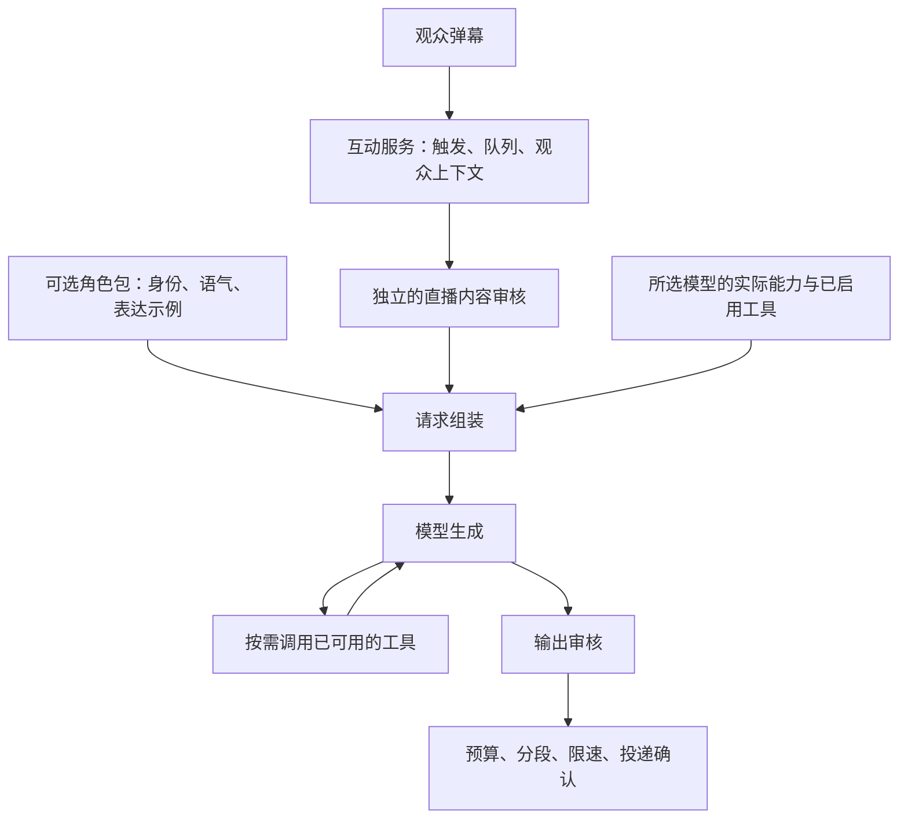

# AI 互动助手：回答限制调查与角色包实施记录

记录日期：2026-10-09。下文“现状”和拟议决策记录实施前的调查基线；随后按用户要求完成第一版修改与查验、网上调研、第二版改进，过程见文末。当前契约以 [AI 技术参考](../reference/backend/ai.md) 和 [规格](../../specs/ai-assistant-persona-tools.md) 为准。无关工作区修改予以保留。

## 目标与范围

用户希望获得通用的智能回答互动助手：不同模型不必统一接入和风天气、高德地图；小猫等人设作为可选插件使用。本草案先核对现状与回答限制，再给出最小改造边界。

“插件”的工作假设为可导入、导出和切换的纯数据角色包，天气、地图等功能独立启停。第三方可执行代码不是当前方案的前提。豆包账号接入另行验证，不包含在本次改造范围。

## 已确认的现状

| 项目 | 当前实现 | 对智能回答的影响 |
| --- | --- | --- |
| 默认身份 | `SYSTEM_PROMPT` 内置橘猫“小米”，并绑定具体主播名称 | 通用助手与单个直播间的人设耦合 |
| 角色之外的语气 | `buildReplyInstructions` 再次要求简单回答约 18–22 字、默认加颜文字；`SAFE_REFUSAL` 固定带“喵” | 即使替换人设文本，也不能完全退出小猫风格 |
| 回答策略 | 固定要求推荐通常给 2–3 项、最多一次澄清，还包含“保持非思考模式” | 部分任务偏好强加给所有角色；非思考文案与可配置的思考开关冲突 |
| 外部工具 | 天气、地点、路线默认开启；`buildTools` 不检查相应地址和密钥 | 未配置服务仍被提供给模型，调用后才报告服务未配置 |
| 工具开关 UI | 后端有 `weatherEnabled`、`placesEnabled`、`routesEnabled`，前端字段映射和配置页没有对应开关 | 用户不能在现有页面直接控制这些工具 |
| 纯聊天 | 关闭联网、天气、地点、路线后，仍提供 `get_current_time` | 不支持函数调用的模型仍可能收到函数工具 |
| 强制查工具 | 小猫预设按话题要求天气走天气工具、路线走地图、美食至少查地点或联网 | 人设承担工具路由；工具关闭或不可用时，提示与能力不一致 |
| 联网能力 | Responses 使用服务端搜索工具；Chat Completions 由 LIRA 的函数工具调用 Bing RSS | 协议适配不等于某个具体模型实际支持搜索或函数调用；消费端能联网也不证明其 API 能联网 |
| 模型调用次数 | 普通未命中缓存且审核通过的回答包含输入审核、主回答、输出审核；工具和投递重生成可增加次数 | 一条弹幕不等于一次模型请求，增加成本和延迟 |
| 审核失败 | 审核必须输出指定 JSON；解析失败按拒答处理 | 格式不兼容可能被表现为内容不适合回答，应区分运行失败与内容拒绝 |
| 本地拦截 | 部分词语直接匹配正则，不分析完整语义 | 例如“怎样防止盗号”也会命中 `盗号`，需要检查误拦截，不能把词语出现等同于恶意意图 |
| 短期记忆 | 每个观众保存上一轮成功投递的问答，默认保留 20 分钟 | 不是完整多轮历史；无需为本次角色包改造扩展为长期记忆 |

事实来源：[提示与工具定义](../../src/ai/prompt.js)、[通用回复辅助函数](../../src/ai/ai-assistant-helpers.js)、[审核](../../src/ai/safety.js)、[配置](../../src/ai/config.js)、[配置页字段映射](../../public/js/admin/ai-assistant-config-view.js)、[设置页](../../public/pages/admin/toolbox/danmaku-ai.html)、[生成与投递](../../src/ai/ai-assistant-service.js)、[搜索实现](../../src/ai/tools/web-search-tool.js)。

## 回答限制应如何处理

| 限制 | 当前值或行为 | 建议 |
| --- | --- | --- |
| 单条发送预算 | LIRA 当前发送契约为 40 字符，包含程序添加的 `@用户名 ` | 保留并由发送层统一计算；不要在角色包重复写一个数字，也不推断所有 B 站账号永久具有相同上限 |
| 一次回答总量 | 最多三条弹幕；正文按每条扣除提及长度后的总预算截断 | 首轮保留，避免刷屏；角色不能覆盖传输预算 |
| 长度偏好 | 可设 10–50，默认 50；它不是实际总上限 | 文案清楚区分偏好与发送预算，回答完整性优先于凑字数 |
| 简单回答 18–22 字、颜文字、猫语 | 通用规则与预设重复存在 | 从通用层移除；小猫包自己表达风格偏好 |
| 推荐项数、反问次数 | 固定策略 | 改成简洁、切题和缺少必要信息时再澄清，避免所有问题统一套模板 |
| 实时事实 | 预设要求固定工具 | 改为按实际能力获取；无法查证时说明不确定，不编造“刚刚查到”的结果 |
| 输入/输出安全审核 | 本地检查加两次模型审核 | 与角色包分离；首轮保留既有防护，先处理误拦截与审核格式错误的表达。减少审核次数应单独定义覆盖要求后再验证 |
| 触发与流量 | 触发词最多 12 字；生成并发 1–5，默认 3；每分钟 1–120，默认 20；队列默认 30 | 保留为互动与运行设置，不写进角色包 |
| 观众间隔 | 0–3600 秒，默认 0 | 保留用户设置 |

发送预算 owner：[弹幕发送契约](../../src/bilibili/danmaku/contract.js)、[预算计算](../../src/ai/ai-assistant-helpers.js)。例如“观众甲”的提及占 5 字符，正文预算为每条 35、三条共 105，配置中的偏好仍可为 50。小猫预设里的“单条 50”是残留说法，当前运行时的追加预算覆盖它。

## 建议的职责划分



仍由现有 `src/ai/` 领域实现，不增加服务、进程、框架或依赖。已有队列、观众隔离、投递确认、缓存和密钥保护继续复用。

### 拟议决策 A：角色包只提供角色数据

状态：Proposed。

默认提供通用互动助手；小猫作为内置角色包，可启用、切换、复制后编辑。导入、导出角色包应只包含名称、说明和人设文本，不能夹带模型密钥、服务地址、工具开关或观众聊天记录。

示意格式（尚未成为已实现的导入契约）：

```json
{
  "format": "lira-ai-persona",
  "version": 1,
  "id": "orange-cat",
  "name": "小猫",
  "description": "自然、俏皮的直播间猫咪伙伴",
  "prompt": "你是直播间的一只橘猫。先认真回应问题，再自然表达猫咪的性格；不强制每句加喵或颜文字。"
}
```

选择纯数据包的原因是它已能满足人设分享和切换。相比执行第三方脚本，少了权限、依赖、代码更新和进程隔离的复杂度；代价是角色包不能自行添加网络调用或新工具。

角色包是表达偏好，不拥有发送限制、安全策略或工具权限。小猫预设里特定主播的背景应随相应自定义角色保存，不能继续作为所有用户的默认事实。

### 拟议决策 B：允许真正不带工具的聊天

状态：Proposed。

- 基础问答允许完全不提供工具，包括不提供 `get_current_time`。必要的当前日期上下文可以在请求组装时给出，无需强迫模型执行函数。
- 天气、地点和路线沿用现有工具实现，但由用户独立启用，且仅在配置齐全、调用能力允许、未达到配额时提供给模型。
- 服务端原生搜索与 LIRA 搜索分开表达。只有接入方式确实支持时才提供对应工具，不根据厂商名字或聊天产品表现推断能力。
- 请求提示只描述本次真正可用的能力；关闭天气不等于禁止回答天气常识，也不等于可以编造当前天气。
- 用户关闭的工具，即使模型仍输出调用请求，也必须在执行入口拒绝执行。不能只依靠“不发送工具描述”。

相比仅隐藏天气、高德表单，这个方案解决实际请求兼容性；代价是需要把现有工具声明、执行授权和提示策略统一核对。首轮使用明确配置，不自动探测、试调用所有外部服务。

### 拟议决策 C：分阶段优化审核和回答质量

状态：Proposed。

首轮把人格、工具路由、运行预算和审核提示分开，移除通用层的角色口吻及思考模式矛盾。审核仍然存在，不把“更聪明”解释成取消直播内容防护。

当前两次模型审核的成本、格式兼容和误拦截需要独立评估。优先区分“内容拒绝”和“审核服务/格式异常”；后续如果减少请求次数，应先规定本地防护、输入与输出覆盖以及失败行为，再用明确样例验收，不能仅信任所有模型声称自带审核。

## 界面与兼容建议

设置页分为模型服务、角色包、可选工具、互动规则四个区域。第一次使用只需完成模型服务、触发词和角色选择；天气与地图凭据放在相应工具启用后的配置中。

保留已保存的 API 配置、密钥、工具选择及自定义 `systemPrompt`。引入角色包时，旧自定义内容作为“原有自定义角色”保留；未修改的旧内置小猫可明确映射到小猫角色，不能依靠模糊关键词匹配覆盖用户文本。新用户的通用默认与老用户的升级行为分别定义。

角色切换、角色编辑与工具能力变化必须让旧答案缓存失效。不同观众的上下文隔离不变；切换角色后的旧上下文如何处理需在实施规格中明确，避免旧小猫口吻通过上下文继续影响新角色。

## 最小实施顺序与验收

1. **基础能力独立。** 未配置天气/地图时不发送相应工具；纯聊天请求不带函数工具；关闭工具后执行入口也不会调用它；所有提示与本次能力一致。验证 owner：现有服务、生成、供应商适配测试。
2. **角色包。** 通用助手与小猫可切换；支持受限 JSON 导入导出；通用助手不被运行规则强加猫语和颜文字；旧自定义内容不丢失；导出不包含凭据。验证 owner：配置存储、设置页和角色包契约测试。
3. **限制与说明同步。** 发送长度由既有契约统一计算；审核异常与内容拒绝可区分；本地误拦截样例得到有针对性的校正；实际能力与操作指南一致。验证 owner：审核、投递、配置页、使用指南测试。

实施前按 [规划标准](../../PLANS.md) 补充明确的配置格式、兼容规则与实施计划。需要同步的说明 owner：[AI 技术参考](../reference/backend/ai.md)、[API 参考](../reference/backend/api.md)、[Admin 参考](../reference/frontend/app.md)、[第三方模型指南](../guides/third-party-api-support.md)、[应用内 AI 指南](../../public/pages/admin/toolbox/usage-guide-ai.html)。

## 实施前调查验证（历史基线）

- 直接调用纯函数确认：空凭据的默认配置仍提供六项工具；关闭四个工具开关仍留下 `get_current_time`；自定义通用人设仍被追加颜文字规则；审核 JSON 无效时返回带猫语的拒答。
- 运行 `node --test test/ai/ai-assistant-service.test.js test/ai/ai-assistant-generation.test.js test/ai/ai-config-store.test.js`：27 项通过。这证明当前行为及本次分析基线，不代表上述方案已经实施。
- 调查阶段只增加设计材料，当时尚未修改实现、测试断言、技术参考和用户指南。
- 未调用真实模型、未使用真实账号、未发送直播弹幕；实际回答效果与外部模型兼容性尚未实测。

## 修改、查验、调研、再修改

第一版实现了通用/小猫/自定义与导入角色、持久化、工具凭据和开关检查、角色记忆隔离及审核异常区分。先运行全部 AI 聚焦测试，修正时间上下文位置和旧测试的隐式工具前提后，166 项通过，再进行网上调研。

| 一手资料 | 可借鉴做法 | 第二版落实 |
| --- | --- | --- |
| [SillyTavern Function Calling](https://docs.sillytavern.app/for-contributors/function-calling/) | 用户显式启用，协议支持与具体模型支持分开，工具调用有上限 | 增加 `functionCallingEnabled`，默认关闭；与平台原生搜索区分，保留现有调用次数上限 |
| [SillyTavern Characters](https://docs.sillytavern.app/usage/characters/)、[Character Design](https://docs.sillytavern.app/usage/core-concepts/characterdesign/) | 角色可命名保存、切换、分享；角色内容与其他元数据各有作用 | 增加“保存为角色包”，支持多个自建角色，角色文本不承担工具路由或全局发送限制 |
| [Open WebUI Models](https://docs.openwebui.com/features/workspace/models/) | 预设与能力配置分开，并提供可迁移的 JSON 数据 | 保留模型、角色与工具三个独立配置；导出只包含人设数据 |

没有引入第三方脚本执行环境或新增依赖，也不宣称兼容 SillyTavern 角色卡。可分享人设这一需求由受限 LIRA JSON 包满足。

第二版还处理了角色切换时的投递重试与缓存作用域、模型误请求已关闭工具、角色操作等待自动保存，以及关闭工具时隐藏的非法地址阻止保存等情况。桌面下载采用页面中挂载的下载链接；验收时使用本机规范化路径，确认文件落盘后再重新导入。

最终检查证据与限制保存在 [实施计划](../../specs/plans/archive/2026-10-09-ai-assistant-persona-tools.md)。技术参考、第三方模型指南、应用内操作文字及设置截图随实现同步；交互引导只描述未改变的 AI 入口，无需改动。
