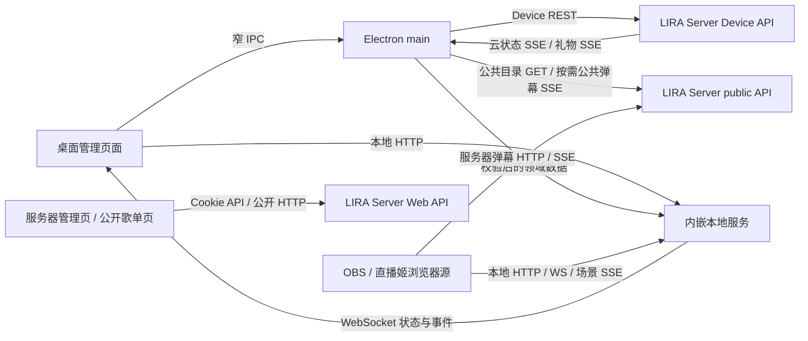

# 客户端与服务器通讯：合并、精炼与复用审查

审查日期：2026-10-10。本文记录当日工作区证据和建议，不是已接受的架构决策或实施计划。

结论：值得收敛的是**同一业务的写入入口、重复读取、传输层公共机制**。其中手动歌库同步存在已复现的数据完整性问题，应先处理；其他建议主要降低重复请求和维护成本。现有 HTTP、SSE、WebSocket、IPC 承担不同职责，整体通讯架构无需推倒重建。

## 基线、范围与验证边界

- Client：`D:/Work/Live`，HEAD `eeedb1440a3123ffde0200e3ddd0ff9f4090ac88`。
- Server：`D:/Work/lira-server`，HEAD `8995b126254fff13345307b564ace15b6be40615`。
- 两仓均有未提交修改，审查期间也存在其他工作区活动；上述 HEAD 不代表所读工作区的完整快照。下文行号对应本轮读取时的文件。
- Node `v24.21.0`。没有连接线上服务器、读取真实凭据或用户数据库，也没有启动用户的 Electron 应用。
- 对当前 Device 通讯逐项核对了客户端方法、服务端路由和 OpenAPI；对本地 HTTP/WS/IPC、场景通讯、服务端浏览器页面检查了传输入口和直接相关消费者。
- 这不是所有业务端点的逐字段安全审计。Bilibili、音乐、AI 和更新器的第三方协议只识别边界，没有重复审计各上游 SDK、媒体流或发布基础设施。

通过注入 `fetch` 调用当前客户端的全部远端方法，捕获到 **42 个 Device method/path 操作 + 1 个公共礼物目录 GET**，均能匹配当前服务器声明。服务器 Device OpenAPI 共 **35 个路径、45 个操作**，其余 3 个是兼容 pairing 列表、创建及撤销入口，当前桌面适配器不调用它们。此核对证明路由映射，不证明所有请求字段和响应字段兼容。

## 通讯地图

| 通讯组 | 当前入口及责任 | 审查判断 |
| --- | --- | --- |
| 设备激活与在线授权 | `activate/challenge/verify/heartbeat/profile`；Client `license-manager`、`license-operations`、`remote-license-client`；Server `device-auth`、`modules/device` | 授权续期已单飞，不能对一次性证明请求套通用自动重试；profile 读取仍有重复，见 C02 |
| 云端配置和歌库 | `cloud-state`、`cloud-state/events`、`cloud-settings`、`songs`、`songs/sync` | 自动同步已有 dirty、revision、账号隔离和请求合并；手动歌库入口绕过同一 owner，见 C01 |
| Bilibili 凭据 | `GET/PUT/DELETE bilibili-credentials`，仅主进程消费秘密 | 保留秘密与普通 renderer DTO 的不同投影，不能因同样是 JSON 而合并权限 |
| 礼物与粉丝事实 | `gift-history`、`gift-history/clear`、`gift-events`、`gift-events/stream`、`gift-card-profiles`、`fan-facts` | 礼物具备 epoch/cursor/bootstrap 与在线原子提交；粉丝事实有独立隐私和轮询合同，保留各领域状态机 |
| 弹幕配置 | `overlay-settings`、`overlay-filters`、`overlay-viewers`、`welcome-settings`、`welcome-settings/v2`、`pk-report-settings` | 多个设置页面重复取账号资料；路由与客户端适配器可按现有领域模式归组，见 C02/C05 |
| 云签到/抽签 | `daily-bot-settings`、`daily-bot-settings/:kind`、`daily-bot-takeover`、imports 的创建/状态/分批上传/预检/提交/取消 | 已有 `remote-danmaku-settings` 与 `device-daily-bots`，可作为精炼其他路由的先例；导入事务不能变成普通设置 PUT |
| 歌单背景 | `GET/PUT/DELETE song-page/background` | 二进制上传与 JSON 元数据复用现有 transport；候选文件提交和清理必须留在领域服务 |
| 公共礼物目录 | `GET /api/public/gifts/catalog?schemaVersion=3` | 已有独立响应预算、ETag/304 和禁止附带 Device token；无需另造目录网络客户端 |
| 公共弹幕流 | `/api/public/overlay/events`，浏览器 EventSource；main 的 `scene-cloud-controller` 按需代理显示数据 | capability/Host 绑定与 DeviceBearer 不同。共同解析器已复用，但连接生命周期有差异，见 C03 |
| 本地普通 API/WS | `api-routes`、`overlay-projection`、`ws`；管理页 `StateService`、overlay `socket-client` | 后端领域路由和大多数 overlay socket 已集中；前端 JSON 信封处理还有重复，见 C04 |
| 本地场景与预览 | `display-source`、`display-notifications`、组件 iframe `postMessage`、窄 preview capability | 场景与单组件显示已共享通知/读取；帧通信有 source/origin 和销毁规则，不宜并进 Device 通讯 |
| Server 浏览器页面 | `/api/auth`、`/api/admin`、`/api/streamer`、`/api/public`；`public/shared/http-client.js` | 管理页已共享 JSON helper；登录恢复、只读页面和二进制二维码保留各自适配 |

上述客户端远端主入口为 [remote-license-client.js](../../src/electron/license/remote-license-client.js)、[remote-danmaku-settings.js](../../src/electron/license/remote-danmaku-settings.js) 和 [remote-gift-reads.js](../../src/electron/license/remote-gift-reads.js)。Server 对应 `src/routes/device.js`、`src/routes/device-daily-bots.js` 与 `src/modules/song-page-background/register-routes.js`。

## C01：优先合并手动与自动歌库写入入口

**优先级：P1 数据完整性缺陷；已用合成数据复现。**

当前链路：

1. [StateService](../../public/js/admin/state.js) 第 227–250 行依据页面筛选请求 `/api/songs`，把筛选结果存入 `this.songs`；`getSongs()` 返回这个数组。
2. [song-import.js](../../public/js/admin/song-import.js) 第 36–41 行把 `state.getSongs()` 作为手动同步的数据来源。
3. [cloud-song-sync.js](../../public/js/admin/cloud-song-sync.js) 第 137–138 行在用户确认后将该数组传给 `liraLicense.syncSongs()`。
4. [license-songs-ipc.js](../../src/electron/ipc/license-songs-ipc.js) 第 31–44 行直接调用 `licenseManager.syncSongs(songs)`，没有经过自动同步队列。
5. Server `src/modules/streamer/song-library-sync.js:36` 执行完整快照替换；`src/storage/song-library-store.js:29` 先删除已有歌曲，再插入传入数组。这符合服务器的完整覆盖协议。

复现使用真实 `StateService`、手动同步模块、客户端歌曲映射及服务器歌曲同步服务，数据库为内存 SQLite，IPC 边界用注入函数连接：本地完整歌库 3 首，搜索后只显示 1 首，确认覆盖后云端剩 1 首；搜索无结果时上传 `[]`，云端变成 0 首。没有使用真实服务器或用户数据。

**建议：**手动按钮向 main 发出“同步当前完整歌库”的窄命令，由现有 [cloud-sync-controller.js](../../src/electron/cloud-sync-controller.js) 排队，[cloud-song-sync-controller.js](../../src/electron/cloud-song-sync-controller.js) 从 runtime 的完整快照/当前 pending mutation 取数。这样手动和自动同步共享账号上下文、顺序、dirty、失败保留和成功确认。

远端 `PUT /api/device/songs/sync` 不必改变。旧 `syncSongs(songs)` IPC 是公开契约，需要新增命令或明确兼容迁移，不能默默忽略原参数。确认弹窗的数量也必须来自完整歌库。手动与自动请求目前可独立发起的事实已确认，具体网络乱序后果本轮没有额外复现，不作为第二个已证实 bug 计数。

实施时的关键验收：保留筛选条件仍上传完整歌库；空筛选结果不清空云端；真实清空完整库仍上传 `[]`；手动/自动重叠时按同一队列执行；切账号和失败重试不越过 owner 或 mutation 边界。现有 `cloud-song-sync-ui.test.js` 检查确认后取新数组，但没有检查数组是完整库。

## C02：合并账号资料的重复读取

**优先级：先做；收益明确，范围较小。**

`danmaku-daily-bots.js:126`、`danmaku-welcome.js:454`、`danmaku-pk-report.js:91`、`display.js:105`、`server-overlay-url.js:70`、`cloud-song-sync.js:89` 和 `settings-license.js:20` 分别调用 `getProfile()`。这些调用发生在各自模块初始化时，并非声称所有页面每次都同时发起 7 次请求；但弹幕工具初始化会一起启动多个消费者。

[license-operations.js](../../src/electron/license/license-operations.js) 第 21 行的 `getProfile()` 每次都会调用远端，当前没有请求合并。用真实 license manager 和现有合成授权 harness 并发调用 6 次，观察到 **6 次远端 profile 调用**。授权 token 的单飞续期没有合并这些资料读取。

**建议：**在 main 的 profile owner 上合并同一授权生命周期内正在进行的读取；renderer 首屏只需要已有账号/URL 时，复用当前 `getState()` 的安全快照和 `onStateChanged`。需要完整设备名称、主动刷新或远端最新资料的场景仍走明确的 profile refresh。避免各页面维护自己的账号缓存，也不引入无期限缓存。

验收要覆盖并发 N 个消费者只发 1 次请求、请求失败后可重试、切账号后旧请求不能进入新账号、明确刷新仍实际查询。初始订阅和异步首读之间的竞态也应由一个 owner 处理。

## C03：收敛 SSE 的连接控制，不合并业务状态机

**优先级：先修适配缺口，再评估小范围抽取；涉及生命周期，风险中等。**

已经做好的部分：[bounded-sse-reader.js](../../src/shared/bounded-sse-reader.js) 是 main 中 Device SSE 和公共弹幕 SSE 的共同字节解析器；Server 的 `src/lib/device-sse.js` 统一 Device SSE 的 keepalive、会话复查、到期关闭，`src/lib/sse-writer.js` 同时服务 Device 和公开弹幕的背压。

仍存在的分叉：

- [remote-license-client.js](../../src/electron/license/remote-license-client.js) 第 186–231 行的 Device SSE 没有应用层建连/空闲 deadline，REST 的 `timeoutMs` 不作用于该路径；依赖 fetch 或调用者中止。相对地，[scene-cloud-controller.js](../../src/electron/scene-cloud-controller.js) 第 138–201 行已有首状态 15 秒、空闲 45 秒控制。本地 display SSE 又有独立的 8 秒请求/5 秒心跳规则，后者匹配本地每秒心跳，不应照抄成远端超时。
- Device 适配器调用 `readBoundedSse` 时没有传入它已支持的 `signal`；scene 适配器传了。用已缓冲的合成 Response，在第 1 条事件回调中 abort 后，Device reader 仍交付第 2 条。生产 cloud/gift controller 会再次检查上下文，故这不证明跨账号写入，但暴露了传输取消语义不一致。
- `cloud-sync-controller.js:220` 和 `remote-gift-controller.js:583` 重复维护退避、Retry-After、超长 timer 分段和过期回调保护；scene 有第三套不同的调度策略。授权的 `license/retry-policy.js` 有有限次数和 jitter，也不能直接替代这些无限恢复流程。

**建议：**先补齐现有 Device SSE reader 的 signal 接线，并为建连与空闲恢复明确合同和测试；随后只提取共同的可取消 deadline/重连调度机制。策略参数和“是否还属于当前 owner”的判断由调用方提供。Server 当前每 25 秒发送 Device keepalive，远端空闲策略必须与之匹配。

礼物的 cursor/epoch、云配置的 revision、公开弹幕的 liveSessionId 保留各自 owner，不做通用 `SyncManager`。抽取时必须保留 Retry-After 下限、旧 timer 失效、断流后的补拉、shutdown drain 与账号切换保护。

## C04：统一本地 JSON 信封与错误读取

**优先级：普通；减少重复维护和错误形状差异。**

[shared/utils.js](../../public/js/shared/utils.js) 第 127 行已有 `api()`，但它主要服务 POST、附带 toast 行为；`readJsonResponse()` 只负责解析。其他消费者因此另写了响应检查：

- `admin/scene-api.js:18`：检查 HTTP + `payload.ok`，附带 `status`。
- `shared/gift-wish-client.js:1`：检查相同信封，附带 `code`，额外拥有 10 秒超时。
- `admin/component-style-api.js:1`：同样处理信封，保留导入错误字段并支持二进制返回。
- `admin/opening-settings-api.js:1`：同样处理信封，但只有 message。
- `admin/danmaku-tool.js:25`：设置写入、读取发送状态及重读各自解析一次。

**建议：**从现有 helper 提炼不触发 UI 的本地 JSON 响应读取核心，统一 HTTP/信封判断与 `status/code/payload` 的保留；现有 `api()` 作为兼容包装继续返回原形状。领域适配器仍负责字段校验、返回 `.data`、上传类型、业务错误文案与通知。

不要把 binary、FormData、公开缓存 GET 和 Device 授权都塞进同一个函数。Server 浏览器端已经有 `public/shared/http-client.js`，保留其 Cookie/401 语义，不跨仓合并运行时 helper。本轮尚未测量错误差异造成的用户问题，这是维护性建议。

## C05：沿现有模式按领域整理远端适配和 Device 路由

**优先级：随下一次相关功能处理；不要单为行数拆文件。**

Client 的 `remote-license-client` 同时拥有 HTTP/SSE transport、礼物帧标准化和多个业务端点；`license-operations` 同时处理 profile、弹幕设置、礼物、歌库和背景。Server `src/routes/device.js` 同时编排授权、各类配置、礼物流和同步，并维护一个跨域错误表。每增加一个设置域，都需要穿过这些相同的汇总文件。

**建议：**延续已有 `createRemoteDanmakuSettings(request)`、`createRemoteGiftReads(request)`、`registerDailyBotRoutes()` 和 `registerBackgroundRoutes()`：传输与授权保持一个 owner，端点方法、领域错误映射和 DTO 转换随对应领域组织。组合根只负责把它们接起来。先从正在修改的领域移出，不做全仓机械拆分或通用路由生成器。

另外，Server `device.js:345–463` 多个设置路由调用 `getProfile(req.device)` 只是取 `streamer.id`，会额外查询账号并构造 URL。只需 ID 的调用可复用已经认证的 `req.device.streamer_id`；需要 subdomain 等完整资料的 overlay 路由仍读取所需字段。保留 body 接收后的再次鉴权及异步写前复查，不能以“重复”为由删除。

## 两个较小的后续机会

1. **同一服务器 origin/稳定身份的纯规范化。** `remote-license-client.js:37`、`remote-gift-cursor-store.js:83`、`scene-cloud-controller.js:10` 重复完整 HTTPS root-origin 检查；`cloud-sync-controller.js:127`、`fan-profile-controller.js:6` 又各自组合 owner。可以扩展现有 `remote-url-policy.js` 来复用纯检查。各持久化 key 的编码、`gift-source-v2` 前缀以及授权 epoch/generation 的区别必须保留，不能一并“统一”。
2. **云端数量不必永远下载整个歌库。** `cloud-song-sync.js:77` 拉完整歌曲只为显示数量，IPC 还会为每首歌投影字段。当前 `cloud-state.songs` **只有 initialized/revision/updatedAt，没有 count**；不能直接改成读取一个不存在的字段。短期可复用同 owner 下已有的完整读取，后续若要新增 count 元数据/窄 IPC，应作为明确的契约变更，检查新旧服务器兼容。没有本轮流量测量，不以估算字节数冒充实测收益。

## 已核实无需重复抽取的部分

- `license-manager.withAuthorizedToken()` 已负责有限重新授权、single-flight renewal、上下文检查和安全响应；不要把这套逻辑复制到各领域 API。
- 普通远端 JSON、原始图片上传和公共目录已共用 `requestWithBody()`，各自有明确预算和 header 策略。
- cloud 通知已有 burst 合并和单个兜底 timer；礼物连续 final SSE 已支持直接原子提交，不是每条通知再 GET。不要按旧印象优化已经完成的工作。
- 大多数本地 overlay 已用 `createOverlaySocket()`；场景与单组件显示也已复用 `createDisplaySource()` / `createDisplayNotifications()`。Admin StateService 仍独立管理 WS，但还拥有 HTTP/实时字段排序，收益不足以支持整块合并。
- Server 的 Cookie 管理接口、DeviceBearer 接口、公开 overlay capability 和本地页面 capability 不能互换。SSE 失效通知与权威 HTTP 恢复也不能互相替代。
- 两仓已有固定 revision/fixture 的 [契约校验](../../scripts/verify-server-contract.js)。增加复用时优先补真实边界场景的契约样例，不引入跨仓运行时引用或未经设计的新共享包。
- 2026-09-21 审查中的大部分事项已有落实；共享样式规则和 protobuf reader 的延期范围以[原实施台账](../../specs/plans/2026-09-21-client-server-reuse-modularity.md)为准，本轮不将它们包装成新发现。

## 验证记录与交付

本轮新增审查报告和索引；业务实现、永久测试、接口合同与用户操作指导没有修改。发现的问题尚未修复；报告建议不能当作已部署行为。

运行了以下完整测试文件：

- Client **147/147**：`remote-license-client`、`remote-license-event-stream`、`remote-license-response-budget`、`license-manager-operations`、`cloud-sync-polling`、`cloud-song-sync-ui`、`scene-cloud-controller`、`admin-state`、`remote-gift-controller-sse`。
- Server **44/44**：`device-sse`、`sse-writer`、`cloud-state-events`、`browser-http-client`、`song-library-sync`。
- 路由探针：42 个 Device 操作均匹配当前 OpenAPI，额外 1 个公共目录 GET；3 个兼容 pairing 操作没有当前桌面调用。
- 行为探针：筛选后歌库覆盖 3→1/3→0；并发 6 次 profile 产生 6 次请求；缓冲 SSE abort 后继续回调；Device SSE 不使用 REST timeout。
- 文档门禁 `npm run verify:docs`：**10/10**；两仓 `git diff --check` 通过。

临时探针和完整日志保存在两仓根目录 `tmp/communication-review/`。`probe.cjs` 使用现有 frontend loader、授权 harness 和内存数据库；`route-inventory.cjs` 只注入 HTTP 返回，没有实际网络访问。它们不属于永久测试基础设施。正式修复应将对应失败场景加入拥有该行为的现有测试套件。

测试同步结论：已有相关测试被执行，C01 的组合回归缺口已指出，尚未修改测试期望。技术文档同步结论：只新增当日审查证据；当前接口事实未因审查而改变，不改 normative/reference 合同。用户指导同步结论：本轮未改变入口与操作，保持原文；修复 C01 时须同时核对同步说明、弹窗计数和对应 IPC 文档。
