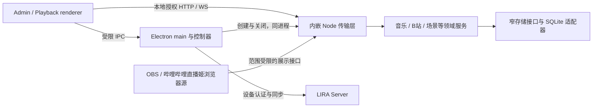

# 客户端结构、模块化与运行效率审查

后续核验、整改和第二轮复审见[整改结果](2026-10-10-client-structure-remediation-review.md)。本文保留首次审查时点的发现与建议。

日期：2026-10-10。基线：`eeedb1440a3123ffde0200e3ddd0ff9f4090ac88` 加审查时的工作区改动。工作区同时有其他任务更新，以下行为与验证按读取时点解释，不代表某个提交的全量认证。

主代理与三个子代理分别检查前端、内嵌后端、Electron，以及工程边界和直播画面组件。本轮只做审查，生产源码未修改。建议尚未成为接受的架构决策或实施计划。

## 总体判断

现有结构基本符合桌面全栈应用的模块化单体设计。Electron、传输层、业务域、存储适配器和前端消费端有实际边界；改进重点是跨模块契约、重复工作和局部复用。



图中表达职责，不表示每个框都是独立进程。main、renderer、preload 的区分符合 [Electron 进程模型](https://www.electronjs.org/docs/latest/tutorial/process-model)。当前保留可模块化的单体也合理；[Monolith First](https://martinfowler.com/bliki/MonolithFirst.html) 强调先形成有效模块边界，再按实际需要演进部署。

| 工程原则 | 当前判断 | 改进重点 |
| --- | --- | --- |
| 职责分离、依赖倒置 | 基本符合 | 组合根接线、领域主要接收窄 store；R10 有具体边界遗漏。 |
| 高内聚、单一状态所有者 | 基本符合 | 授权、礼物恢复、组件草稿各有 owner；R1/R3 的取消与代次语义需要贯通。 |
| DRY、单一事实源 | 已有有效复用 | R2 的缓存契约、R9 的同权限 IPC 校验仍应收敛。 |
| 按变化更新、控制热点工作 | 有明确改善空间 | R4–R8 有可复现的重复构造、渲染、轮询、查询和同步 I/O。 |
| 可测试性、架构约束 | 基础完整，组合覆盖仍有缺口 | 227 项相关既有测试通过，仍遗漏本次跨层案例及跨行 SQL。 |

## 发现与处理顺序

P2 仅标记确认的功能缺陷，效率及维护建议不套用故障严重度。

| 编号 | 性质 | 问题 | 建议顺序 |
| --- | --- | --- | --- |
| R1 | P2 | 前置设置请求不能取消，可能跳过正常关闭保存 | 首批 |
| R2 | P2 | 歌单删除后强制刷新仍返回旧内容 | 首批 |
| R3 | P2 | 同账号换发 token 使机器人页面上下文失效 | 首批 |
| R4 | 热点效率、恢复风险线索 | 播放状态在防抖前全量构造 | 第二批 |
| R5 | 渲染效率 | 局部变化重建隐藏播放队列和搜索列表 | 第二批 |
| R6 | 轮询生命周期 | 隐藏资源面板继续每秒读完整样式库 | 第二批 |
| R7 | 查询效率 | 一次场景读取重复构造完整状态 | 第二批 |
| R8 | 同步 I/O | 每次缓存写入全目录扫描、排序 | 按缓存规模处理 |
| R9 | 局部复用 | 同权限合同的 IPC 来源检查重复 | 随功能维护 |
| R10 | 边界、检查缺口 | 跨行 SQLite 调用逃过架构检查 | 随工程治理 |

### R1：场景设置请求取消没有贯通到关闭流程

[scene-cloud-controller.js](../../src/electron/scene-cloud-controller.js#L144) 为 SSE 传了取消信号，但前置 `getOverlaySettings()` 没有传。[license-operations.js](../../src/electron/license/license-operations.js#L37) 和 [remote-license-client.js](../../src/electron/license/remote-license-client.js#L275) 对应接口也没有接收请求选项。

设置 HTTP 默认可等待 10 秒；控制器销毁后 `whenIdle()` 仍等它。[main.js](../../src/electron/main.js#L298) 先排空控制器再关闭 runtime，总退出期限却是 5 秒。打开云弹幕来源、设置请求较慢时退出，可能先执行 `app.exit()`，尚未正常关闭后端或冲刷播放快照。

合成验证使用真实 manager、remote client、scene controller 与既有 shutdown harness：销毁后 HTTP signal 未 abort；推进退出时钟 5 秒，`app.exit` 为 1 次，`runtime.stop`、播放 flush 均为 0 次。证明的是关闭链遗漏，未实测用户数据损坏。

**最小处理：**沿已有 `requestOptions.signal` 贯通取消，保留退出期限和数据库关闭顺序；补“设置读取期间退出”的组合回归。核对 [桌面生命周期](../reference/desktop/main.md)，用户步骤无需变化。

### R2：两层歌单缓存的刷新与修改契约不一致

[删除操作](../../public/js/playback/operations/playlist-operations.js#L187) 成功后，[首页服务](../../public/js/playback/services/home-service.js#L181) 传 `forceRefresh: true`，但 [ContentLoader](../../public/js/playback/content/loader.js#L131) 仅跳过 renderer 缓存，请求没有携带后端 `refresh`。后端 [lyrics-service.js](../../src/music/lyrics-service.js#L78) 仍命中 5 分钟磁盘缓存，写歌单也没有使其失效。

另一个关联缺口：后端收到 `refresh: true` 时把 `cacheKey` 设为空，新结果不替换旧缓存；空歌单结果同样不覆盖旧内容。

真实 loader→service→合成 provider 复现：删除前 1 首、provider 删除后 0 首、强制刷新仍显示 1 首且没有再次读取 provider；直接发送 `refresh: true` 返回 0 首，随后普通请求又返回旧 1 首。

**最小处理：**明确可修改歌单的缓存 owner。若保留两层，贯通刷新、修改成功后的失效和空结果替换。补“读→删除→刷新→普通再读”用例，同步 [音乐服务](../reference/backend/music/services.md) 和 [播放参考](../reference/frontend/playback.md)；操作步骤可保持原样。

### R3：页面身份与 token 代次混用

[daily-bot-controller.js](../../src/electron/daily-bot-controller.js#L23) 把 `getAuthorizationEpoch()` 拼入页面 owner，变化后生成新 contextId 并清空草稿。[license-manager.js](../../src/electron/license/license-manager.js#L433) 在同账号成功换发 token 时也增加 epoch，导致旧页面下一次操作被拒绝为 `DAILY_BOT_ACCOUNT_CHANGED`。

合成复现中账号仍获授权、登录生命周期 generation 未变，仅 epoch 增加，写请求就被提前拒绝。复现采用无效会话后的同账号重认证；正常定时续期也走成功换发 token 的路径。普通成功 heartbeat 本身不增加 epoch。

**最小处理：**页面上下文采用已有登录生命周期 generation；请求仍保留 token epoch 的过期结果保护。补同账号续期和真正换号的区别测试。核对 [认证](../reference/desktop/auth.md) 和 [IPC](../reference/desktop/preload.md)，不要合并 token、登录和礼物投影的不同代次概念。

### R4：播放防抖发生在全量快照构造之后

[timeupdate](../../public/js/playback/core/initializer.js#L70) 每次都调用保存；[state-persistence.js](../../public/js/playback/operations/state-persistence.js#L68) 先逐首构造当前曲目、各队列和历史，再重置防抖计时器。防抖减少传输，没有减少构造工作。

1000 首合成歌单，当前曲目与两种队列表达合计 2000 条输入；10 秒内 40 次更新触发 **80,000 次曲目序列化**，HTTP 为 0 次，停止更新 1500ms 后保存 1 次。这是调用量，不是 CPU 时间或内存字节数。

**最小处理：**高频事件先标记待保存，在实际保存窗口捕获最新不可变快照；显式关闭仍立即捕获，保留 writer generation、sequence、旧回执拒绝和重试。持续事件延后常规保存是确认行为，但 [文档](../reference/frontend/playback.md#L125) 只承诺 1500ms 防抖，没有承诺最长落盘间隔。新增最大等待时间须作为调度要求明确并测试，不应宣称违反现有定期保存合同。

### R5：播放局部变化仍重建关闭的队列弹窗

[renderer.js](../../public/js/playback/core/renderer.js#L23) 无条件调用 [renderAll](../../public/js/playback/ui/index.js#L37)；[QueuePopup.render](../../public/js/playback/ui/queue-popup.js#L67) 未按弹窗是否打开或输入是否变化判断是否重建。普通 render 路径也重新生成搜索结果。

真实控制器与既有合成 DOM、1000 首歌单、队列弹窗关闭：暂停一次和无关 `app:wesing-state` 一次，各写入 **467,011 字符的完整队列 HTML**。未测 Electron 的实际布局耗时或 FPS。

**最小处理：**队列、当前高亮、待确认项变化才更新；隐藏时记脏、打开时补齐，搜索列表按结果变化更新。沿用 renderer、QueueManager、StateActions；现有队列有原地修改，不能只比较数组引用。验证无关状态不替换节点、隐藏期间变更后首次打开显示最新数据。

### R6：资源编辑器没有接入页面实际可见性

[参数面板](../../public/js/admin/component-resource-settings-panel.js#L66) 每秒仅检查 `root.hidden` 和 `document.hidden`。主页面通过 active class 切换，组件子页通过祖先 hidden 切换，编辑器 root 仍可保持未隐藏。[读取函数](../../public/js/admin/resource-style-settings.js#L10) 每次请求完整样式库再查目标；[pendingList](../../public/js/admin/component-style-client.js#L49) 只合并同时在途请求。

合成验证中，祖先已隐藏而 root 未隐藏，下一轮仍增加 1 次 list。这与 [Admin 参考](../reference/frontend/app.md#L3) 的“可见客户端面板每秒读取”存在偏差。

**最小处理：**把所属页面的激活状态交给现有编辑器生命周期；隐藏停读、返回补读且保留草稿。测试应覆盖真实导航关系，当前专用夹具主动显示面板，不能证明切页会停读。修复时核对技术参考，用户步骤无需变化。

### R7：同一次场景显示重复构造完整后端状态

[scene-components.js](../../src/server/scene-components.js) 的 `getDisplayData()` 先读一次完整状态，extra adapter 丢弃该状态；[scene-extra-display.js](../../src/server/scene-extra-display.js) 的 `gift-sprint` 和 `lyrics` 又分别读取。

真实两个模块组合：只读歌词 **2 次**、只读冲刺 **2 次**、共同读取 **3 次**；仅弹幕也先读 **1 次**无关完整状态。[getState](../../src/server.js#L404) 会读取队列、SC、最近礼物和冲刺统计，不是单纯对象取字段。本轮确认了调用次数，没有测真实数据耗时。

**最小处理：**先在现有 ports 与 extra display 之间复用同一次读取；不依赖全局状态的组件使用已有窄 getter。保留输出投影、来源授权和旧场景切换语义。用组合测试覆盖读取次数；两个各自通过的单测未覆盖此成本。同步内部职责参考，不扩展 HTTP/WS 合同或用户步骤。

### R8：每次写音乐缓存都同步维护整个目录

[music-cache.js](../../src/music/music-cache.js#L34) 每写一个文件就裁剪目录：同步 readdir、逐文件 stat、全量排序，即使远低于容量上限也先做这些工作。预置 1000 个小 JSON，再写 1 个，确认 **1 次同步目录遍历、1001 次同步 stat**。

同步文件 I/O 会占用事件循环，本项目后端嵌入 Electron main，使这个热点值得控制；本次未测得真实桌面卡顿。[Node 事件循环说明](https://nodejs.org/en/learn/asynchronous-work/dont-block-the-event-loop)

**最小处理：**低于配额先跳过排序，再在 cache owner 内合并维护或使用可重建容量状态以减少逐次全扫。改变检查频率时须定义容量暂时偏差，验证上限、失败和重启重建。同步音乐缓存参考，不悄悄弱化容量限制。

### R9：同权限 IPC 检查可直接复用现有 helper

[main-window-ipc.js](../../src/electron/ipc/main-window-ipc.js#L6) 已统一主窗口、主 frame、精确 origin 和管理路径检查。[fan-profile-ipc.js](../../src/electron/ipc/fan-profile-ipc.js#L13) 与 [gift-export-ipc.js](../../src/electron/ipc/gift-export-ipc.js#L25) 仍重复相同规则。

**最小处理：**这两个 registrar 采用现有 helper，保留结果封装、导出导航取消和 disposer。收益是规则只维护一处；未据此发现来源绕过或显著性能问题。每日机器人、license、允许 `/license` 的通道权限不同，继续按 [IPC 契约](../reference/desktop/preload.md#L9) 分别处理。保留来源拒绝测试，用户步骤不变。

### R10：跨行 SQL 漏过边界检查

[requester-target-store.js](../../src/storage/requester-target-store.js#L8) 位于 music 域，直接调用 SQLite；`songDb` 与 `.prepare` 之间换行，使 [门禁正则](../../test/engineering/module-boundaries.test.js#L55) 无法匹配，该文件也不在 SQL 债务额度中。

读取真实规则匹配真实文件：原规则 **0 次**，允许 receiver 与点号间空白后 **1 次**。[规范](../architecture/engineering/modularity-standard.md) 已将此门禁标为增量执行；这是一个具体缺口，不代表已有测试整体无效。

**最小处理：**把这个现成 store 放到 storage，更新组合根和测试引用，同时补跨行调用的门禁回归；维持返回对象和 SQL 语义。更新音乐/存储 owner 路径，用户指南不受影响。

## 应保留的实现与已知折衷

- Admin 已有 changedKeys、单一 WS owner、HTTP/WS 排序；配置控制器已处理草稿、保存中编辑和旧回执，适合继续扩展现有 owner。
- 场景支持布局更新保留 iframe、准备失败保留旧版本、断线隔离旧事件；overlay socket 有幂等启动、退避和销毁，相关定向测试通过。
- WebSocket 已合并同 microtask 广播、跳过无订阅者、按 principal 投影并限制慢客户端，不能描述成所有事件无差别广播全部状态。
- settings/songs 同步与 gift ledger 恢复的 revision、dirty、cursor、事务职责不同；共同使用 SSE 不构成合并状态机的理由。
- 已核实旧报告的 select 生命周期、礼物 changedKeys、播放分页 concat、粉丝快捷死分支、rank identity hint 重复已处理，本轮不重复登记。
- 歌曲 metadata 缓存使用整库变化令牌，settings 写入也会使同值 metadata 重读；[参考](../reference/backend/music/services.md#L181) 已明确该安全折衷，优先级低于上述实证问题。
- 扫描当时覆盖 1821 个受维护源/测试/配置文件，仅 4 个 JS 文件有长度提示：两个组合根、授权管理器、远端礼物控制器。它是定位信号，不是逐文件人工审计或拆分依据，遵循 [ADR-0023](../architecture/adr/0023-purpose-aware-file-size-review.md)。

## 验证与覆盖边界

| 检查 | 结果 | 范围 |
| --- | --- | --- |
| `npm run verify:architecture` | 26 通过，0 失败 | 边界、ESM 作用域、规模报告；仍有 R10 的覆盖缺口。 |
| 前端 6 个相关测试文件 | 62 通过，0 失败 | 状态分发、草稿、Admin runtime、播放状态、WeSing、持久化。 |
| 桌面 4 个相关测试文件 | 78 通过，0 失败 | 每日机器人、粉丝 IPC、场景云连接、旧 IPC 来源约束。 |
| 后端 4 个相关测试文件 | 37 通过，0 失败 | 播放首页生命周期、歌词、基础及 extra 场景显示。 |
| Overlay/scene 4 个相关测试文件 | 24 通过，0 失败 | Socket、显示需求、组件契约、场景渲染状态。 |
| `npm run check` | 1425 个 JS 文件通过 | 全部复用匹配源码/环境哈希的语法检查缓存。 |
| `npm run verify:docs` | 10 通过，0 失败 | 文档链接、导航、owner 路由与契约登记。 |
| 合成探针 | 上述缺陷和工作量均复现 | VM、假时钟、假 provider、内存 SQLite、根 tmp 临时文件。 |

既有测试命令均在仓库根执行：

```text
node --experimental-vm-modules --test test/admin/admin-state-renderer.test.js test/admin/component-config-controller.test.js test/admin/frontend-admin-runtime.test.js test/playback/playback-state-actions.test.js test/playback/playback-wesing.test.js test/playback/playback-persistence.test.js
node --test test/bots/daily-bot-takeover.test.js test/fan-profiles/fan-profiles-ipc.test.js test/scenes/scene-cloud-controller.test.js test/desktop/legacy-ipc-source.test.js
node --experimental-vm-modules --test --test-concurrency=2 test/playback/playback-home-lifecycle.test.js test/lyrics/lyrics.test.js test/scenes/scene-display.test.js test/scenes/scene-extra-components.test.js
node --experimental-vm-modules --test test/overlays/overlay-socket.test.js test/scenes/display-demand.test.js test/scenes/scene-component-contract.test.js test/scenes/scene-renderer-state.test.js
```

后端测试子进程 TEMP/TMP 指向根 `tmp/client-structure-review/`。探针保存在 `tmp/client-structure-review/`、`tmp/client-structure-review-2026-10-10/` 和 `tmp/desktop-review-evidence-20261010.cjs`，不属于新增正式测试。

人工覆盖了以上调用链、组合根、相关契约与测试；未逐行审计全部文件，未评估服务器仓库内部实现、真实账号/上游、长时并发、桌面 CPU/堆内存/FPS、安装器或完整安全性。未运行全仓测试，未启动或操作用户桌面应用。

本轮只新增报告及导航。测试、技术参考和用户指南未随建议提前改写，因为运行行为未改变；上文记录了实施时的同步范围及 R6 的既有说明偏差。`git diff --check` 通过，报告和导航差异及工作区状态已复核；已有及并行改动保留，探针位于 Git 忽略的 tmp 内。
