# LIRA 使用文档补充方案 · 待办版（客户端 + 网页端）

> **这份文档只回答三件事**：① 现状是什么（一句话级别）② 接下来做什么 ③ 做完怎么验收。
> **核查范围（2026-09-22）**：已对照当前客户端与服务器工作区复核关键事实；附录 A 提供证据入口。代码核查不等于桌面实测，尚未验证的运行表现不得作为确定承诺发布。
> **截图修订（2026-09-22）**：已按审阅报告修正文字，重截 16 张并新增 36 张图片。本文现有 134 个图位（124 张候选图 + 复用既有 10 张）。[截图总览](#screenshot-gallery)按 A–F / S 编号排列；每图标明入口、示例状态和使用边界。仍需真实环境补拍的内容见 [D.2 待验证清单](#pending-captures)。
> 读者：文档撰写者、截图提供者、后续维护者。最终读者是主播：电脑小白，不懂术语，只想「照着点就能用」。
> 现有手册文件基线（2026-09-22 核对）：`public/pages/admin/toolbox/usage-guide.html` 是 70 行的入口壳；正文已拆入同目录的 `usage-guide-getting-started.html`、`usage-guide-features.html`、`usage-guide-configuration.html`、`usage-guide-faq.html`。逻辑内容仍为 12 节 / 10 张图 / 15 条 FAQ / 0 个表格。

---

## 一、现状基线（一屏看完）

| 项 | 事实 |
| --- | --- |
| 文档本体 | `usage-guide.html` 入口壳 + 四个正文分片，**12 节**（编号 01–12 写死在正文 HTML 里）；入口 70 行，四个正文分片分别 213 / 467 / 293 / 361 行 |
| 入口 | 百宝箱 → 使用文档（左侧「软件与帮助」组） |
| 目录 / 高亮 | 手写三组共 12 项；滚动高亮与搜索跳转靠 `public/js/admin/usage-guide.js` |
| 全文搜索 | 索引包括章节标题、章节直属 `p` / `h4`，以及 `article, details, .usage-guide-steps > li` 的文本（`usage-guide-search.js` 的 `buildSearchIndex`） |
| 现有截图 | `public/img/usage-guide/` 共 **19 个文件 = 9 张 PNG + 10 张 WebP**；页面里引用 **10 张**（安装 2 + 卸载 1 + DeepSeek 7）。**客户端界面截图 0 张** |
| FAQ | **15 条**（全部是 `<details>`，都在第 12 节） |
| 新手引导 | 聚光灯引导 **8 步 + 1 个完成页**，首次启动自动打开 |
| 表格 | 全文 **0 个 `<table>`**，现有表达方式是卡片 + 列表 |
| 网页端 | 服务器仓库**没有任何面向主播的文档**，对主播完全空白 |

### 1.1 改写时必须遵守的 4 条硬约束

1. **章节编号是硬编码文本**（`<span class="usage-guide-section-index">01</span>`）。插入或追加章节都要改编号 —— 落地映射见 3.1。
2. **目录是手写的三组**。新增章节必须同步加目录项，确保章节可从目录访问并正确显示高亮；搜索索引本身按正文 section 建立，并不依赖目录条目。
3. **搜索支持章节标题、章节直属 `p` / `h4`，以及 `article` / `details` / `.usage-guide-steps > li` 的文本**。其他容器中的独立内容需检查是否被覆盖；不要为了搜索给每个段落强套 `article`。
4. **版式元件复用现有 class**：章节标题、特色卡、`usage-guide-grid`、`usage-guide-step-pair`、`usage-guide-notice`（warning / danger）、`usage-guide-chip`、`usage-guide-faq`；样式在 `public/css/admin/other-features/usage-guide*.css`。现有正文没有表格；优先复用卡片与短列表，比较类内容可按需要使用表格并检查样式和搜索覆盖。

### 1.2 一句话结论（未变）

**骨架很好，问题不在结构，而在覆盖度和入口路径完整性。**

- 现有内容偏向「点歌 / 播放 / 礼物」三条主线；**百宝箱 14 项里 2 项完全没写**（动态抽奖、粉丝档案）、多项写得过简（小游戏、礼物姬、弹幕姬）；
- **一张客户端界面截图都没有**，而小白最需要的正是「这个按钮长什么样、在哪个位置」；
- **网页端对主播完全空白**：网页歌单、礼物流水、数据分析、直播弹幕姬、管理员发的各种码，一个字都没有；
- 现有文档里还有 **3 处写错了的硬错误**（见 P0），主播照着做会直接出错，优先级高于所有新增内容。

---

## 二、待办总表

| 批次 | 做什么 | 依赖 | 验收 |
| --- | --- | --- | --- |
| **P0** | 修 3 处确定错误，补充操作说明与投屏边界 | 无（可立刻做） | 旧文案全文 0 命中；页面照常滚动高亮与搜索 |
| **P1** | 内容块 12《第一次打开 LIRA 会看到什么》+ A 组截图 11 张 | 只需能跑起来一个测试账号 | 小白能照上手说明独立完成注册 / 登录 |
| **P2** | 内容块 13《播放队列怎么用》、14《礼物页余下功能》+ C / D 组截图 | 无 | 「导入点歌」「自动答谢」「导出 PNG」三条路径可照做 |
| **P3** | 内容块 15《百宝箱补遗》+ E 组与 B 组截图（按流程拆分，数量见附录 D） | 无 | 搜索「动态抽奖」「粉丝档案」「投票」均能命中 |
| **P4** | 内容块 16《网页歌单与给观众看的画面》、17《数据保存在哪里》+ F 组截图 + 网页端三篇 + S 组截图 | 发布位置需确认；截图与运行核查可先准备，不阻塞数据边界的文字修正 | 网页端三篇定稿并挂链接 |
| **P5** | 内容块 18《界面与画面外观速查》、19《名词小词典》+ FAQ 按实际问题补充并分组 | 无（可随时插入，不阻塞别人） | 搜「点歌板」「盲盒」「浏览器源」能搜到词典条目 |

> P0 与 P1 都涉及正文修改；若分开实施，需要协调共同章节，P1 不是只加截图。

### 2.1 P0：先修「写错了」的地方（最高优先级）

前三项是当前正文的确定错误；后两项是说明优化，不应混称硬错误：

| # | 位置 | 现在写的 | 代码里的事实 | 证据 |
| --- | --- | --- | --- | --- |
| 1 | 07 节「月底冲刺」 | 水晶球 **2333 元/个** | **100 元/个**（错约 23 倍） | `src/bilibili/gift/query-service.js` 第 13 行 |
| 2 | 05 节「歌单页背景」 | 点击「**删除背景**」 | 按钮文案是「**恢复默认背景**」 | `public/pages/admin/song/import-export.html` 第 227 行 |
| 3 | 11 节「投屏文字」 | 滚动模式「**弹跳 / 连续**」 | 「**循环滚动（首尾相接）**」「**往返滚动（到底后返回）**」 | `public/pages/admin/song/queue-theme.html` 第 65–66 行 |
| 4 | 06 节全民 K 歌「歌词时间调整」 | 向前或向后微调，最多 3 秒 | 原文正确；可补充 **±3000 毫秒**、步进 **50 毫秒** | `public/pages/admin/playback/page.html` |
| 5 | 05 节「歌单页背景」风格名 | 直接写 6 个风格名 | 主标题是「点歌板风格 1…6」，副标题才是那些名字 → 写成「点歌板风格 1（经典队列展示）」 | `queue-theme.html` 第 7–54 行 |

当前 `usage-guide.html` 没有「两种全屏随机样式」这句，不列为待修错误；新增样式说明时写固定 6 种、全屏随机 3 种。

另有两处**漏写的关键提示**，必须补（否则主播会误判）：

- **区分服务器弹幕姬与本机投屏**：服务器弹幕姬不依赖桌面进程持续运行；本机地址依赖 LIRA。退出后本机源无法重新加载或继续获取实时数据，已加载画面是否保留最后一帧取决于该画面的实现，不能统一写「立刻消失」。
- **「浏览器源」页有 11 个地址项**。礼物边框、礼物滚动、礼物许愿、投票评分等还可从各自面板复制；礼物许愿按周期提供多个地址。不要混用功能数、入口数和 URL 数来凑「16 个画面」。正文写「这里列出常用地址，其他地址在对应功能面板复制」。

### 2.2 P1：内容块 12《第一次打开 LIRA 会看到什么》

**为什么先做**：小白第一步就走不下去，而现在这一屏一张图都没有。

要写清的内容：

- 整个登录窗口（说明这是 LIRA 的登录窗口，不是浏览器）；
- **两个模式的标题和字段都不一样**：
  - 注册模式：标题「注册 LIRA」／说明「创建账号并授权这台电脑」／字段「注册激活码」；
  - 登录模式：标题「登录 LIRA」／说明「重装或使用新电脑，请向管理员获取短效登录码」／字段「短效登录码」；
- **用户名规则原文**（现在文档只写「见说明」，等于没写）：「用户名会作为之后网页歌单地址的前缀（子域名）。支持 2–32 个英文字母、数字和中划线（-），不支持中文，中划线不能放在开头或结尾。大写字母会自动转为小写。」
- **密码规则原文**：「新密码需 8–64 个字符，包含大写字母、小写字母、中文、数字、符号中的至少三类。可使用空格，请勿使用常见弱密码。」
- 注册激活码输入框（占位 `XXXX-XXXX-XXXX-XXXX`，说明「由管理员下发的一次性注册码，用户名不可重复」）；
- 「注册并进入 / 登录并进入」「重试连接」按钮，以及「正在为你准备直播工具」等待态、「准备未完成」失败态；
- 两个中间状态原文：「本机授权已通过，可继续准备。」「本机保留的旧设备授权已撤销，请获取新的短效登录码后重新登录。」
- 客户端实际使用的两类码：注册激活码（首次注册）、短效登录码（换电脑 / 重装）。配对码不是当前登录窗口的输入流程，不与这两类码并列为必学步骤；密码重置码放到网页端忘记密码说明。

**必须写进文档的三件事**

1. **桌面客户端没有切换或退出 LIRA 账号的入口**。关闭客户端使用右上角「×」；退出直播账号使用「点歌 → 设置」里的「退出登录」。网页主播中心另有自己的「退出登录」，不要混为一谈。
2. **不用填服务器地址**。默认服务器地址为 `https://api.lirahub.cn`，普通用户无需填写（部署配置可覆盖默认值），当前登录窗口无需输入服务器地址，不向主播介绍部署参数。
3. **第一次打开会有一套高亮指引**（8 步 + 完成页，自动弹出）。以后想再看：百宝箱 → 使用文档 →「重新查看新手引导」，重开的就是这一套。

配图：A 组，登录错误与准备失败分图说明（见 6.3、附录 D）。

### 2.3 P2：内容块 13《播放队列怎么用》、14《礼物页余下功能》

**13 播放队列**（现在几乎没写，但这是主播每天用的）：

- 队列抽屉 / 队列弹窗 / 全屏播放视图三个入口，各自能干什么；
- **「导入点歌」**：把点歌队列一键搬进播放队列 —— 最常用的一步，必须写在最前面；
- 拖动排序、单曲移除、清空（会停止播放）；
- 「点歌队列 vs 播放队列」对比一次，避免混淆；
- 顺带补：播放内容抽屉（浏览内容 / 返回 / 播放全部 / 换一批 / 关闭）、收藏歌单与最近播放入口、点歌匹配诊断（填歌名 / 歌手 / 时长毫秒 →「测试匹配」）。

**14 礼物功能补充**（部分已有简要说明，如导出 PNG，需要补齐流程）：

- **自动答谢礼物**：说明开关位置、会答谢哪些送礼观众、固定格式的消息示例，以及直播账号同步和服务器连接条件；当前没有可编辑的答谢模板，不要写填写模板的步骤。界面原文「由服务器持续运行，退出软件后仍有效。」
- **弹幕查询礼物统计**：观众发什么能查、查出来是什么样、开不开的差别；界面原文「观众可用“今日礼物”等弹幕查询已记录的付费礼物。」
- **礼物记录导出 PNG** 全流程：勾选记录 →「导出所选」→ 选输出方式（拼成一张 / 每条一张）/ 图片背景（透明 / 白色）/ 保存文件夹 → 预览 →「导出 PNG」→「打开文件夹」；
- **礼物许愿**（礼物姬第三个页签）：三个周期（长效 / 本日 / 本场）怎么建、进度怎么算、地址怎么放进直播画面（建议宽 440）。

配图：C 组（队列 C6、内容抽屉 C8、匹配诊断 C9）与 D 组（见 6.3、附录 D）。

### 2.4 P3：内容块 15《百宝箱补遗》

百宝箱共 **14 项**，分 4 个可折叠分组：

- 直播互动：弹幕姬、礼物姬、动态抽奖、小游戏
- 直播画面：加班机、礼物特效、开播动画、萌时钟
- 主播工作：粉丝档案、主播工作台
- 软件与帮助：设置、性能、使用文档、桌面更新

> 现有 08 节开头只提了弹幕姬 / 加班机 / 小游戏，**没提动态抽奖和粉丝档案**，改成按四组介绍一遍。

**待补功能说明（归入百宝箱）**

- **动态抽奖**：独立抽奖账号登录（不影响直播账号）→ 贴动态 / 视频链接 → 中奖人数（默认 10，可填 1–100）→ 选择该内容类型支持的条件 →「获取参与名单」→ 开奖 → 中奖结果与凭证。动态可按界面选择关注作者 / 点赞 / 转发等条件；视频仅支持评论与关注，不能照搬点赞或分享核验。另说明本地最近 50 场记录和 B 站限速提示。
- **粉丝档案**：入口「百宝箱 → 主播工作 → 粉丝档案」。三个标签（档案 / 提醒 / 设置）；六个筛选（全部 / 在舰 / 曾上舰 / 特别关注 / 待补资料 / 待核实）；搜索「搜索昵称、备注名或 UID」；「新建档案」；设置页三组 —— 同步与更新（同步大航海名单、自动更新（每天 12:10 核对身份）、重新加载档案）、导出与备份（导出档案表格、保存完整备份、从备份文件恢复、恢复到之前的状态）、档案管理（不再自动建档的粉丝、已归档的档案、清除全部档案）。
  - ⚠️ **不要写**「快速档案」弹窗（从点歌队列看观众档案）：代码里没有接线，点不到。
- **小游戏 · 投票与评分**：投票主题 ≤60 字符、选项 ≤10 字符、投票时长与预设、评分范围 1–10、「收集中不显示平均分」；推荐画面 **800 × 600**；每次只运行一场，投票和评分共用一个画面。

**细化已有小节（现在只写了一句话）**

- **弹幕姬**：连接状态区；**弹幕样式完整清单**（固定位置 6 种：聊天气泡 / 深色面板 / 蝴蝶结 / 经典样式 / 透明文字 / 头像横卡；全屏随机 3 种：简洁白卡 / 奶油气泡 / 流光气泡）—— 现在只说「选择喜欢的样式」，一种都没列；参数调节 · 深色面板（字体、正文字号 18–48 px、弹幕文字颜色、背景不透明度、礼物通知图片）；全屏随机样式另有停留时间 2–30 秒；**用户黑名单**（按 UID 屏蔽，可从当前直播间在线榜读取）与**敏感词屏蔽**（「一键清空屏蔽词」）；发送弹幕区（Ctrl + Enter 发送、自动钓鱼 / 打劫、发送结果）；回复与辅助设置（随机点歌回复 / 签到机器人 / 抽签机器人 / 自定义关键词回复 / 进场欢迎 / PK 对手信息播报 / 昵称生僻字自动注音）。
- **礼物姬**：礼物边框（默认页签，触发金额默认 20 元、动效模式三档、播放预览、地址复制）；滚动礼物（四档金额配色区间、显示行数 1–10、滚动速率 1–50、最小礼物金额、「本日礼物循环」零点换日、保存 / 恢复默认 / 取消修改）。
- **小游戏**：数字炸弹（1 人 / 多人，不限观众数量）、五子棋（弹幕坐标落子）、你画我猜（回合 1–12、每局 15–300 秒、本场词库多选、**画板快捷键 B/E/L/R/O/I、Ctrl+Z**）、转盘（总份数决定概率）；说清「三款游戏共用一个直播画面」「转盘与投票评分各有独立地址」。
- **加班机**：手动输入时长（时:分）、选择时长小时 / 分钟、「设置初始时间」；「刷新在售礼物」与「在售目录：未刷新」；规则编辑（效果类型：直接改时间 / 随机抽结果 / 文字展板；时间操作：增加 / 减少 / 乘除倍数 / 清零；按连击组 vs 按具体数量）；「最近结算」20 条；暂停与关闭的区别。
- **礼物特效**：礼物 ID 怎么找（面板外链「查找礼物 ID」指向 `gifts.lirahub.cn`）；播放特效测试；**弹幕触发四种写法**（`礼物特效 32132` / `礼物特效32132` / `🎁 32132` / `🎁32132`）。
- **开播动画**：主标题 / 副标题 / 主播名 / 底部文案四个文本框；画质三档（普通 · 推荐 / 高 · 更多氛围粒子 / 低 · 轻量模式）；轨道动效三种；漂浮音符与音乐律动开关；人物图（≤16 MB）与开场音乐上传；音乐音量默认 35%；总开关同时控制预览与投屏。
- **萌时钟**：六种风格名（桃桃便签 / 星夜软糖 / 汽水小鸭 / 横向刻度 / 竖向刻度 / 白字数显）；显示日期 / 显示秒数 / 小时格式 / 角标文案（≤16 字）；推荐浏览器源 **580 × 210**。
- **主播工作台**：日历「上个月 / 下个月 / 今天」；日程分类（直播 / 工作 / 个人）；备忘分类（随手记 / 观众约定 / 复盘）；待办勾选；「新建日程」对话框字段；强调「已保存到本机」。
- **设置**：账户与网站（账号信息、LIRA 官网 `lirahub.cn`、账号登录 `admin.lirahub.cn`、忘记密码请联系管理员）。
- **性能**：同页六张卡，分别显示电脑整体和 LIRA 的处理器、显卡、内存占用，没有「电脑 / LIRA」切换入口；本机硬件区（型号、核心、内存条、GPU 温度仅在检测时读取）；采样窗口 5 秒。
- **桌面更新**：检查更新 / 下载更新 / 重启并更新三个状态的截图；「自动更新」开关；**数据目录**与**日志目录**两个「打开目录」按钮（推荐从这里打开日志目录）。

配图：E 组；长面板及不同操作状态分图（见 6.3、附录 D）。

### 2.5 P4 / P5

- **P4**：内容块 16《网页歌单与给观众看的画面》、17《数据保存在哪里》；F 组截图；网页端三篇文档 + S 组截图。发布位置见第十章第 4 项；截图与运行核查可先准备，数据边界修正不受阻塞。
- **P5**：内容块 18《界面与画面外观速查》、19《名词小词典》；FAQ 按真实故障场景补充并按主题分组（见第七章）。不依赖任何人，可以随时插队做。

### 2.6 现有 12 节的补写与补图（优先就地补齐）

现有内容「写了但不够用」的地方按第 3.3 节的分工规则就地补，不要另起章节：

| 节 | 要补写的内容 | 配图 |
| --- | --- | --- |
| 02 账号与设备 | 区分 LIRA、B 站与音乐平台账号；B 站入口配 B5–B7，音乐平台登录说明放播放章节配 C1 | B5 / B6 / B7、C1 |
| 05 点歌页 | 队列条目操作「置顶 / 取消置顶、复制歌名、删除」，以及**队列满了会怎样**；歌库的新增 / 编辑 / 删除清单、语言与分类字段、标签、可点开关、批量操作、能不能搜索筛选；设置项默认值与控件类型（见 4.1）；展示板各项（滚动速率 1–100、排序方式、字号、是否同步点歌板主题）；浏览器源分组完整清单 + 「LIRA 授权及服务器链接读取成功后才能复制；直播消息接收另需配置直播账号」；导入导出的模板列名、导入结果提示怎么看、导出的 Excel 长什么样、网页歌单同步的按钮顺序；桌面歌词「字体 / 颜色 / 描边 / 透明度 / 逐字」分别在哪；随机点歌条件示例墙 | B1–B4、B8–B12b、B14；桌面歌词 B13–B13e |
| 06 播放页 | 音质（默认「标准」）、音量（默认 30%）、「清理缓存」按钮；**收藏与浏览抽屉**（浏览内容 / 返回 / 播放全部 / 换一批 / 关闭）与「收藏歌单」「最近播放」入口；「心动 / 电台」会自动补 10 首 | C1–C6（C5 待补）、C8 / C9；C7 属于点歌页歌词预览 |
| 07 礼物页 | 礼物统计 / 礼物提示两个开关的界面；「最近礼物」卡片 +「查看全部」入口；礼物历史的界面原文（「正在更新礼物记录…」「当前仅能查看部分历史记录」）与导出入口；月底冲刺设置 + 「重置本轮**不清**记录」；盲盒分析三种视图的每列含义；自定义盲盒的填写界面 | D1、D4、D8–D10 |
| 08 百宝箱 | 开头改成按四组（直播互动 / 直播画面 / 主播工作 / 软件与帮助）介绍一遍，补上**动态抽奖**和**粉丝档案**；各工具细项优先在本节补齐；内容块 15 仅为素材索引，是否另拆章节按 3.3 决定 | E1 |
| 10 / 11 投屏与速查 | 8 张卡片 / 6 张速查卡逐张配图；投屏类表述统一按 4.2（本机 vs 服务器） | B11 + 各画面效果图 |

---

## 三、待写章节规格

### 3.1 候选内容映射（编号尚未定稿）

**实施原则：优先在原章节补齐登录、队列、礼物和百宝箱操作；首次启动内容放在前面的上手部分。下表 12–19 仅保留为本方案的内容块编号，便于引用，不代表最终正文顺序，也不要求新增 8 节。最终目录按阅读顺序编排，保留已有章节 ID，并同步更新目录与交叉引用。**

| 素材编号 | 内容主题 | 来源 |
| --- | --- | --- |
| 01–11 | 原有前 11 节，编号不动 | 现有 |
| **12** | **第一次打开 LIRA 会看到什么** | 新增（P1） |
| **13** | **播放队列怎么用** | 新增（P2） |
| **14** | **礼物页余下功能** | 新增（P2） |
| **15** | **百宝箱补遗** | 新增（P3） |
| **16** | **网页歌单与给观众看的画面** | 新增（P4） |
| **17** | **数据保存在哪里** | 新增（P4） |
| **18** | **界面与画面外观速查** | 新增（P5） |
| **19** | **名词小词典** | 新增（P5） |
| FAQ | 常见问题（现有 12） | 保留在帮助末尾，最终编号随目录确定 |

原候选目录分组如下，实施时合并重复入口，不以 20 节为目标：

- **上手准备**（5）：快速上手 / 账号与设备 / 更新或重新安装 / 主流程 / **第一次打开 LIRA**
- **常用功能**（8）：点歌页 / 播放页 / 礼物页 / 百宝箱 / **播放队列** / **礼物余下功能** / **百宝箱补遗** / **网页歌单与给观众看的画面**
- **配置与帮助**（7）：配置 AI 助手 / 直播姬 · OBS 投屏 / 常用设置在哪里 / **数据保存在哪里** / **外观速查** / **名词小词典** / 常见问题

> 章节 id 建议 `#ug-login`、`#ug-queue`、`#ug-gift-extra`、`#ug-toolbox-extra`、`#ug-web-songlist`、`#ug-data`、`#ug-appearance`、`#ug-glossary`（沿用现有 `ug-` 前缀）。

### 3.2 内容块要点与优先级

| 编号 | 内容要点 | 截图数 | 优先级 |
| --- | --- | --- | --- |
| 12 | 登录窗口全流程；用户名 / 密码规则逐条；客户端两种登录码的区别；「不用填服务器地址」 | 6–8 | ★★★ |
| 13 | 队列抽屉 / 弹窗 / 全屏；导入点歌；拖动排序、移除、清空；与点歌队列的区别 | 4–5 | ★★★ |
| 14 | 自动答谢、弹幕查询礼物统计、导出 PNG、礼物许愿 | 6–8 | ★★★ |
| 15 | 动态抽奖、粉丝档案、投票与评分、弹幕姬细项、小游戏细项、礼物姬细项、加班机细项 | 14–16 | ★★★ |
| 16 | 网页歌单怎么进、观众扫码看、背景与标题设置、哪些画面是给观众看的 | 5–6 | ★★★ |
| 17 | 只在本机 / 随账号同步 / 云端账本三张对照卡；换电脑要重做什么 | 2–3 | ★★ |
| 18 | 风格 / 主题 / 字号 / 配色 的「一键预设 + 精细调节」统一入口 | 4–6 | ★★ |
| 19 | 弹幕姬、礼物姬、加班机、盲盒、盈亏、大航海、SC、逐字歌词、浏览器源、点歌板 / 展示板 / 桌面歌词 | 0（可配小图） | ★★ |

### 3.3 内容归属（避免重复）

1. 登录、播放队列、礼物、百宝箱内容优先补入已有所属章节，保留完整操作步骤；
2. 数据保存、网页端和词典按实际内容量决定是否独立成章，不按清单强行拆分；
3. 同一操作只保留一处完整说明，其他位置链接到章节标题与稳定 ID，避免依赖临时编号。

### 3.4 每个内容块的写作骨架（六段式）

1. **一句话结论**：这个功能是干什么的。
2. **入口**：`点歌 → 设置` 这种完整路径，每一级都用「」标出。
3. **操作步骤**：编号列表，一步一个动作，动词开头。
4. **你会看到什么**：把界面反馈原文抄进来（如「本机已登录」「正在更新礼物记录…」），并配截图。
5. **没成功怎么办**：一到三条最可能的原因 + 下一步动作。
6. **提醒**：会丢数据、会影响别人、会花钱的，用 `usage-guide-notice` 单独标出。

---

## 四、写作素材（写的时候直接查这几张表）

### 4.1 参数核查素材（只在影响操作时写入正文）

| 位置 | 写法 |
| --- | --- |
| 点歌 → 设置 | 最多排队歌曲数：默认 **50**，可填 1–300；同一观众点歌间隔：默认 **0** 秒，可填 0–3600；「接收弹幕和礼物」是**下拉**（暂不启用 / 启用），不是开关 |
| 点歌 → 点歌板 | 滚动速率 1（最慢）–100（最快）；点歌内容字号默认 **28 px** |
| 点歌 → 展示板 | 字体大小默认 **28 px**；滚动速率 1–100 |
| 播放 | 搜索结果数量默认 **9**，可填 1–30；音量默认 **30%**；音质默认「标准」 |
| 礼物 → 盲盒盈亏榜 | 排行人数默认 **3**（-1 全部 / 0 仅汇总 / 1–10）；「仅显示盈利」默认**已勾选**；标题默认「今日盲盒盈亏」 |
| 礼物姬 → 礼物边框 | 触发金额默认 **20 元**（0 元表示所有付费礼物） |
| 礼物姬 → 滚动礼物 | 显示行数 1–10、滚动速率 1–50、最小礼物金额（0 表示不限制） |
| 礼物姬 → 礼物许愿 | 目标数量 1–999999999，默认 **10**；只支持整数 |
| 弹幕姬 → 参数调节 | 字号随样式不同：聊天气泡 / 深色面板 18–48 px，经典样式 20–44 px，透明文字 18–56 px，头像横卡 18–42 px，其余 18–40 px；全屏随机停留时间 2–30 秒 |
| AI 互动助手 | 触发关键词 ≤12 字；回复长度偏好 10–50（默认 50）；同时处理提问数 1–5（默认 3）；同一观众提问间隔 0–3600（默认 0）；每分钟上限 1–120（默认 20）；AI 性格文本 20–8000 字；发送间隔固定 500–2000 毫秒（只读） |
| 小游戏 | 你画我猜回合 1–12、每局 15–300 秒；投票主题 ≤60 字符、选项 ≤10 字符；评分范围 1–10 |
| 动态抽奖 | 中奖人数默认 **10**，可填 1–100 |
| 开播动画 | 主标题 ≤20 字；音乐音量默认 35%；人物图 ≤16 MB |
| 萌时钟 | 角标文案 ≤16 字；推荐画面尺寸 580 × 210 |
| 歌词时间调整 | 全民 K 歌：±3000 毫秒；桌面歌词：±5000 毫秒；两者步进均为 50 毫秒。桌面歌词字号需按当前字体控件另核，不能沿用旧范围 |

> HTML 的 `value` / `placeholder` 不能单独证明运行默认值；还要核对初始化代码、设置默认值和后端校验。未完成核查的参数仅作写作素材，不直接发布为事实。弹幕样式范围见 `public/js/shared/danmaku-style-options.js`。

### 4.2 投屏画面全表（写「直播姬 / OBS 投屏」和内容块 15 / 16 时照这张表写）

**以下按功能整理复制入口，不统计画面总数。浏览器源页有 11 项；一个功能可能提供多个地址，同一地址也可能有多个入口。**

| 画面 | 在哪复制 | 本机 / 服务器 | 可调参数 | 建议尺寸 |
| --- | --- | --- | --- | --- |
| 点歌板 | 浏览器源 或 点歌板页 | 本机 | 无（设置存在样式里） | 按风格说明 |
| 歌曲展示滚动版 | 浏览器源 或 展示板页 | 本机 | 无 | 按展示板说明 |
| 桌面歌词 | 浏览器源 或 桌面歌词设置页 | 本机 | 无 | 由 OBS 源宽高决定 |
| 弹幕姬 | 弹幕姬面板；浏览器源页（需 LIRA 授权及服务器配置读取成功） | **服务器** | 无 | 按样式说明 |
| 盲盒盈亏榜 | 礼物页「盲盒盈亏榜」卡片 | 本机 | `top`(-1 / 0 / 1–10)、`title`、仅显示盈利、仅显示心动盲盒 | 自动适配捕捉窗口 |
| 直播小游戏 | 小游戏页「游戏网页」 | 本机 | 无 | 按游戏说明 |
| 抽奖转盘 | 小游戏 → 转盘 | 本机 | 无 | 按转盘说明 |
| 加班机 | 加班机面板「直播画面」 | 本机 | 无（背景与适配在面板里选） | 按画面设置 |
| 礼物特效 / 礼物边框 | 礼物特效面板；礼物姬 → 礼物边框 | 本机 | 无 | 全屏 |
| 开播画面 | 开播动画面板「固定浏览器源地址」 | 本机 | 无（文案 / 画质 / 动效 / 音乐在面板里设） | 16:9 |
| 萌时钟 | 萌时钟面板「萌时钟网址」 | 本机 | 无 | **580 × 210** |
| 礼物滚动词条 | 礼物姬 → 滚动礼物「复制地址」 | 本机 | 无 | **宽 900**，高随行数 |
| 礼物许愿 | 礼物姬 → 礼物许愿「复制地址」 | 本机 | 三个周期各自一个地址 | 建议 **宽 440**，高度随内容与展示样式调整 |
| 弹幕投票 / 观众评分 | 小游戏 → 投票与评分「浏览器源」 | 本机 | 无 | **800 × 600** |

**必须写进文档的三句话**

1. 使用 `127.0.0.1` 的本机源需在运行 LIRA 的电脑上加载；退出 LIRA 后不能重新加载或继续更新实时数据。服务器弹幕姬不依赖桌面进程持续运行，但仍依赖服务器与直播间连接状态。
2. 弹幕姬链接需要 LIRA 授权和服务器配置读取成功；获取链接与接收直播消息是两件事，不能把复制失败直接归因为没登录 B 站。证据：`public/js/admin/server-overlay-url.js`。
3. 按各面板实际交互说明保存方式：弹幕姬点「应用到直播画面」，萌时钟在修改时自动保存（`clock-card.js`）。不要统一编造「保存」按钮；透明空态也可能只是没有歌曲、歌词或触发事件。

**三条容易写错的说明**

| | 本机运行时服务 | 远程 LIRA 服务器 |
| --- | --- | --- |
| 地址 | `http://127.0.0.1:端口/...` | 默认 `https://api.lirahub.cn`（普通界面无需填写；部署配置可覆盖） |
| 谁在用 | 除弹幕姬以外的**全部**投屏画面 | 授权、账号、歌库 / 设置云同步、礼物记录、在线弹幕姬 |
| 主播要不要填 | **不用填，也没有地方填** | **不用填，也没有地方填** |
| 关了 LIRA 会怎样 | 不能重新加载或更新实时数据；已加载内容的表现需逐页验证 | 云端继续工作 |

- **overlay 地址上其实还能带参数，但界面不暴露**（例如点歌板的 `speed`、开播画面的 `quality`、时钟的 `style`）。**不写进主播文档**；要写给进阶用户就单开一节并注明「不熟悉就别动」。
- **空白排查按功能区分**：先检查地址与本机服务，再检查是否有歌曲、歌词、许愿或触发事件，最后检查启用状态与样式。没有逐页运行证据时，不把空白一律归因为「未保存配置」。

### 4.3 数据边界（写数据保存说明用）

通用云同步控制器管理 `settings`、`songs`、`bilibili` 三个范围，但它不是全部云端数据的清单。弹幕姬样式、背景图、机器人等有独立接口；判断数据归属必须核对所属功能的读写路径。

**① 会跟着账号走的**

- 歌库（上限 **5000 首**，**整份覆盖**，不会自动合并）；
- 点歌行为设置：直播间号、接收弹幕和礼物、暂停点歌、最多排队歌曲数、点歌间隔、只允许歌库歌曲、允许重复点歌；
- 直播账号（B 站）登录状态；
- 盲盒设置（官方自动同步 + 自定义那部分）；
- 弹幕姬已应用的样式、各样式参数与全屏随机停留时间（服务器按主播保存；尚未应用的编辑草稿不等于已保存配置）；
- 弹幕触发礼物特效开关（`giftEffectDanmakuEnabled`）；
- 礼物页两个云端开关：**自动答谢礼物**、**弹幕查询礼物统计**；
- 歌单页背景图（每主播只保留最新一张，新的覆盖旧的）。

**② 只保存在这台电脑（换电脑要重做）**

- 点歌队列、播放队列和 LIRA 的本机播放历史；QQ 音乐、网易云的「我喜欢 / 收藏歌单」由对应平台账号提供，换电脑后需重新登录该平台，不要将其归为 LIRA 本机收藏数据；
- 本机画面设置：点歌板样式、展示板样式、桌面歌词设置、开播动画、萌时钟、礼物边框、滚动礼物、礼物许愿；**不包括服务器弹幕姬样式与参数**；
- 投票与评分的外观设置（代码里明确「不参与云端设置同步」）；
- 礼物导出目录、**月底冲刺目标**、礼物提示开关；
- 音乐平台登录（QQ 音乐 / 网易云）、全民 K 歌缓存路径；
- 日历、备忘、待办、粉丝档案（本机数据库）；
- 小游戏历史、动态抽奖的本地记录（最近 50 场）。

**③ 跑在服务器上、关了客户端也在工作**

- 礼物记录（云端账本）；
- 自动答谢、弹幕查询礼物统计（界面原文：「由服务器持续运行，退出软件后仍有效。」）；
- 签到机器人、抽签机器人、PK 对手信息播报、进场欢迎。

**④ 要提醒主播的两个坑**

- 现有正文的「盲盒设置会同步」不能直接认定错误；应明确它指盲盒配置，不扩展为冲刺目标、礼物边框等所有礼物设置；
- 「本机上次同步」这个时间**只记录手动点「同步到网页」的时间**，不代表云端和本机完全一致，别让主播拿它当「已经同步好了」的证据。

### 4.4 界面里「看不见的一层」（抽屉、弹窗、浮窗）

小白卡住最多的地方不是页面，而是**点下去之后弹出来的东西**：

| 看不见的东西 | 出现在哪 | 要写什么 |
| --- | --- | --- |
| **点歌确认悬浮通知** | 观众点歌时自动弹出 | 「收到点歌请求」卡片（歌名、匹配信息、点歌人）+「✓ 下一首播放」「✗ 跳过」 |
| **播放内容抽屉** | 播放页点任意卡片后从右侧滑出 | 「浏览内容」「播放全部」「随机播放」「换一批」；空态「点击左侧卡片浏览内容」 |
| **播放队列弹窗 / 抽屉 / 全屏** | 播放器右下角 | 导入点歌、清空、拖动排序、单曲移除 |
| **礼物记录全屏抽屉** | 礼物页「查看全部」 | 五个筛选字段、表格、拖动框选、Ctrl 拖动追加、「导出所选」 |
| **导出 PNG 子视图** | 礼物记录里点「导出所选」 | 返回选择、输出方式、图片背景、保存文件夹、打开文件夹 |
| **点歌匹配诊断** | 播放页折叠区 | 填歌名 / 歌手 / 时长毫秒 →「测试匹配」 |

> ⚠️ 仓库里还有一套 **7 步弹窗引导**（`public/pages/admin/toolbox/onboarding.html` + `public/js/admin/onboarding.js`），**代码里没有任何地方会打开它**（`maybeAutoOpen` 第 442 行定义、第 570 行导出，全仓库无调用；`reopenOnboardingBtn` 元素不存在）。属于未接线的休眠代码。**不要写进文档。**

### 4.5 错误提示素材库（写 FAQ 时直接抄原文，不要自己造词）

| 提示出现在哪 | 文案来源文件 | 适合写成哪些 FAQ |
| --- | --- | --- |
| 登录 / 激活页全部提示（40 多条） | `public/js/license.js` 第 51–107 行 | 注册失败、密码不合规、用户名被占用、设备被撤销、协议不兼容、双进程 |
| 右下角提示条 | `public/js/shared/toast.js`（提示 / 成功 / 注意 / 错误） | 所有「操作成功 / 失败」的判定依据 |
| 需要确认的对话框 | `public/js/shared/confirmation-dialog.js`（「确认操作」「这项操作无法撤销」「请确认这一步」） | 危险操作的预警写法 |
| 歌单同步的 9 条错误 | `public/js/admin/cloud-song-sync.js` 第 18–37 行 | 歌库同步失败类 |
| 礼物自动答谢 / 弹幕查询的 6 条 | `public/js/admin/gifts/interaction-controls.js` 第 5–12 行 | 「开关点不动」类 |
| 歌单背景上传提示 | `public/js/admin/song-background.js` 第 7–14 行 | 背景图传不上去 |
| 弹幕姬云端提示 | `danmaku-overlay-settings.js`、`danmaku-overlay-filters.js`、`danmaku-daily-bots.js` | 云端开关、屏蔽设置、签到抽签 |
| 断线与离线提示 | `public/js/admin/state.js`（「前端连接断开，重连中」「程序已退出」）、`gifts/history-view.js`（「当前离线，显示已保存的记录」） | 断网时能做什么、不能做什么 |
| 复制地址成功 / 失败 | 各模块的「复制…已复制」与「复制失败，请手动复制地址」 | 投屏类 |
| 操作确认框标题 | 清空队列、清空歌库、清空 SC 记录、清空礼物记录、重置本轮、覆盖同步、退出 LIRA、删除日程…… | 每一类危险操作的「请确认」段落 |

---

## 五、写作规范（面向主播）

### 5.1 三条硬规矩

1. **用「你」，不用「您」。**
2. **一个动作一句话，动词开头**：打开、点击、填写、勾选、粘贴、复制、等待、刷新、重试、确认。
3. **句子短、段落短**：一个动作一句话，通常一段 1–3 句；不硬性限制 20 字，避免截断完整按钮名或必要条件。

### 5.2 界面文案要「抄」，不要「转述」

| ❌ 不要写 | ✅ 要写 |
| --- | --- |
| 点击进入账号登录入口 | 点击「扫码登录直播账号」 |
| 在设置中开启弹幕接收 | 打开「点歌 → 设置」，把「接收弹幕和礼物」改成「启用」，再点「保存设置」 |
| 切换至直播间管理界面 | 点击右上角的「刷新直播」 |

### 5.3 术语翻译对照表

| 代码 / 后台里的词 | 文档里要写成 |
| --- | --- |
| 服务端 / 云端 | 账号云端、服务器（首次出现补一句「就是保存你歌单和礼物记录的地方」） |
| API Key | 密钥（API Key） |
| Token / 凭据失效 | 登录过期 |
| overlay / 浏览器源 | 直播画面链接、浏览器源 |
| 同步冲突 / 覆盖 | 会用这台电脑的歌库替换云端歌库 |
| 逐字歌词 | 逐字歌词（跟唱时字会跟着亮） |
| 大航海 / 舰长 | 大航海（舰长、提督这些） |
| 盲盒盈亏 | 盲盒盈亏（开盒花的钱和开出来的价值差多少） |
| 403 / 请求失败 | 提示「XXX」，说明…… |
| 初始化状态 | 准备中与完成分开写；「正在为你准备直播工具」只表示准备中 |

### 5.4 让人安心的四类句子

| 场景 | 模板 | 例子 |
| --- | --- | --- |
| 操作会失败 | 「如果 XX，就 YY；不用 ZZ。」 | 「失败时检查网络并点击「重试」，不用重新注册。」 |
| 会覆盖数据 | 「这只是替换云端，不会删除这台电脑的歌曲。」 | 「点击「同步到网页」并确认后，会用这台电脑的歌库替换云端歌库。」 |
| 不可恢复 | 「无法恢复，请确认后再操作。」 | 「清空全部记录」那段 |
| 不用管它 | 「保持默认即可。」 | 「安装位置不用修改，直接点击「安装」即可。」 |

### 5.5 禁用清单

- **禁用词**：旨在、致力于、强大的、一站式、助力、赋能、打造、极致、智能化、全方位、多维度、闭环、抓手。
- **禁用句式**：「需要注意的是」「值得一提的是」「为了更好地…」「综上所述」「如下所示」「本功能支持」→ 换成「提醒：」「另外说一句」「简单说」「这个功能能帮你」。
- **禁用被动语态**：「歌曲会被自动同步」→「会自动同步歌曲」。
- **禁用双重否定**：「不是不能…」→ 直接说可以的。
- **中英混排**：中文之间不加空格；数字与单位之间留一个空格（`5 MB`、`1–30 条`）。
- 破折号、省略号克制使用；不要用「～」卖萌，主播是要干活的。

**自检**：写完一段读出来 —— 像在跟人解释 → 过；像念说明书 → 重写。一段里出现两次以上「以及」「并且」「相关」→ 拆句。

### 5.6 可复制的模板

**功能说明**

```text
【这个功能是干什么的】（一句话）
【在哪】点歌 → 设置
【怎么做】
1. 打开「点歌 → 设置」。
2. 先扫码登录直播账号，并填写要连接的直播间号。
3. 把「接收弹幕和礼物」改成「启用」。
4. 点击「保存设置」，再检查右上角的直播间连接状态。
【你会看到】右上角显示实际连接状态。保存成功只表示设置已保存，不等于已经连上直播间。
【没成功】若显示「未设置直播间」，核对房间号并保存；若提示连接异常，按提示检查账号，再点击「刷新直播」。登录失效时重新扫码。
【提醒】服务器连接正常时，关闭客户端仍可继续接收礼物；要停止接收，将第 3 步改回「暂不启用」并保存，确认服务器设置已同步。
```

**FAQ（三段式：判断依据 → 一个动作 → 仍失败的下一步）**

```text
问题：用主播会说的原话当标题（不要写「连接异常处理」）
1. 先做最简单的检查（一句话）
2. 再给出对应入口（带完整路径）
3. 最后给「找谁」或「记录什么」（比如日志目录）
```

**改写示例**

> ❌ 系统会自动同步并覆盖云端歌单数据，用户需注意多设备并发修改可能造成数据不一致的问题。
> ✅ 歌库会自动同步到同一账号的其他电脑，不用手动上传。**但不要同时用两台电脑改歌库**——最后同步成功的那一份会替换掉之前的内容，LIRA 不会自动把两边合并。

> ❌ 清空操作不可逆，请谨慎执行。
> ✅ 点「清空全部记录」后，这个账号在这台电脑和云端的礼物记录都会永久删除，其他电脑同步后也会跟着清空。**删了就找不回来了**，确定要清再点。

---

## 六、截图

### 6.1 命名与规格

- 正式手册发布目录：`public/img/usage-guide/`；本文配套候选图保存在 `docs/images/usage-guide/`，通过相对路径内嵌。文件名**小写英文 kebab-case**，`功能-动作`，例如 `song-settings-bilibili-login`。
- 页面使用 WebP；原始截图与标注源文件另行归档，不要求发布目录同时保留 PNG 与 WebP。现有 `uninstall-lira` 只有 WebP。
- 插入写法（宽高必须和真实图片一致，否则页面会跳动）：

```html

```

- **尺寸**：整窗 1280–1440 宽；面板局部 800–1000 宽；控件特写 300–500 宽。比例尽量统一 16:9 或 4:3。
- **体积预算**：单张 WebP 以 ≤200 KB 为目标，保证按钮和正文清晰。当前保留 134 个图位，正式手册按流程选用，不以固定张数验收。使用 `loading="lazy"` 与实际宽高控制加载和排版。
- **alt 文案**：按现有风格写「位置 + 内容 + 要看的元素」，例如「DeepSeek 开放平台 API keys 页面，左下角显示首次充值赠送余额，右侧有创建 API key 按钮」。

### 6.2 截图前的统一准备（能省一半返工）

1. **脱敏**：优先使用专用测试账号与示例数据；昵称、房间号、UID、头像、观众信息，以及激活码、短效码、密码重置码、API 密钥和带访问凭证的链接不得暴露真实值。固定一套示例：主播名 `示例主播`、房间号 `123456`、观众 `观众A / 观众B`、UID 打码。
2. **状态**：使用隔离示例环境。操作示例优先有数据；未登录、等待播放、暂无提醒等正常空态只用于说明入口或排查，不作为操作成功的截图。
3. **窗口**：固定同一个窗口尺寸和主题（深浅色不要混），同一批连续截完。
4. **标注**：统一标注样式（例如同色细边框 + 序号圆圈），源文件归档，方便界面改动后重做。
5. **工具**：`Win + Shift + S` 区域截图；要连窗口一起截用 `Alt + PrtScn`。

### 6.3 截图需求与配图索引（含跨端素材）

**统一定位规则**：每个流程先给带导航的定位图，后续特写在图前写完整入口并标「局部图」。长页面分图拍摄；上下两图合起来必须覆盖所述操作，不能只检查元素存在。图标操作逐项标注。客户端、网页主播中心、管理员后台和投屏输出分别写明，不能混称一个页面。

> 截图组按**页面**划分，和章节不是一一对应（见 6.4）。当前共有 124 张候选图，实际尺寸见附录 D。表中成功状态要求不代表本地示例已经验证真实服务；未完成项集中列在 D.2。

#### A. 首次启动与登录

| 编号 | 文件名建议 | 截什么 | 必须有 | 尺寸 | 本次截图 |
| --- | --- | --- | --- | --- | --- |
| A1 | `client-login-window.png` | 登录窗口整屏（注册模式） | 左侧插图、右侧表单、底部主按钮 | 1280×800 | [查看](#shot-a1) |
| A2 | `client-login-existing-mode.png` | 切到「登录已有账号」 | 模式按钮选中态、短效登录码输入框 | 1280×800 | [查看](#shot-a2) |
| A3 | `client-login-username-help.png` | 悬停用户名旁疑问图标 | **弹出的规则说明文字**（子域名那段） | 900×500 | [查看](#shot-a3) |
| A4 | `client-login-password-help.png` | 密码规则浮层 | 8–64 字符、至少三类 | 900×500 | [查看](#shot-a4) |
| A5 | `client-login-activation-code.png` | 注册激活码输入框 | 占位 `XXXX-XXXX-XXXX-XXXX`、下方说明 | 800×400 | [查看](#shot-a5) |
| A6 | `client-login-preparing.png` | 「正在为你准备直播工具」 | 状态文字与进度 | 1280×800 | [演示状态](#shot-a6) |
| A7 | `client-login-failed-retry.png` | 失败态 | 错误提示原文 +「重试连接」 | 1280×800 | [演示状态](#shot-a7) |
| A8 | `client-main-first-open.png` | 第一次进主界面 | 顶部四个主标签、右上角状态与「刷新直播」 | 1440×900 | [查看](#shot-a8) |
| A9 | `client-tour-bubble.png` | 聚光灯引导气泡（建议截「登录你的直播账号」） | 高亮区域、气泡卡片、进度点、「下一步」 | 1440×900 | [查看](#shot-a9) |
| A10 | `client-topbar-status.png` | 顶栏状态区特写 | 实际直播间连接状态、「刷新直播」、右上角关闭窗口「×」 | 1000×200 | [未设置直播间](#shot-a10) |

#### B. 点歌页

| 编号 | 文件名建议 | 截什么 | 必须有 | 本次截图 |
| --- | --- | --- | --- | --- |
| B1 | `song-queue-overview.png` | 点歌页整页 | SC 队列、点歌队列、7 个页签 | [查看](#shot-b1) |
| B2 | `song-queue-item-actions.png` | 单条点歌的操作按钮 | ①置顶 / 取消置顶、②复制歌名、③删除，分别标注 | [查看](#shot-b2) |
| B3 | `song-library-list.png` | 歌库列表 | 列名（歌名 / 歌手 / 语言 / 分类 / 标签 / 可点） | [查看](#shot-b3) |
| B4 | `song-library-edit.png` | 点歌 → 歌库中的新增歌曲内嵌表单 | 所有字段 + 可点开关；与 B3 配套定位 | [查看](#shot-b4) |
| B5 | `song-settings-account.png` | 设置页「直播账号登录」区 | 「扫码登录直播账号」「本机已登录」 | [未登录入口](#shot-b5) |
| B6 | `song-settings-room.png` | 设置页「连接你的直播间」区 | 房间号输入框、房主资料 | [未连接入口](#shot-b6) |
| B7 | `song-settings-rules.png` | 设置页六个规则项 | 接收弹幕和礼物、暂停点歌、最多排队歌曲数、点歌间隔、只允许歌库歌曲、允许重复点歌 | [查看](#shot-b7) |
| B8 | `song-theme-styles.png` | 点歌板页 6 个风格按钮 | 「点歌板风格 1–6」与副标题 | [查看](#shot-b8) |
| B9 | `song-theme-detail.png` | 某个风格的详细设置区 | 字号 / 配色 / 毛玻璃 / 发光 | [查看](#shot-b9) |
| B10 | `song-board-settings.png` | 展示板设置 | 滚动速率、排序、字号、是否同步主题 | [查看](#shot-b10) |
| B11 / B11b | `song-overlay-addresses*.png` | 浏览器源页，分上下两张 | 三个分组共 11 个地址及复制按钮；上图保留页签，下图拍全「场景与氛围」四项 | [上半页](#shot-b11) / [下半页](#shot-b11b) |
| B12 | `song-import-export.png` | 导入导出页 | 模板下载、文件选择、粘贴区、「导入歌库」 | [查看](#shot-b12) |

补充分图：[导入计数反馈 B12b](#shot-b12b)；[歌词基础样式 B13](#shot-b13)、[描边 B13b](#shot-b13b)、[逐字与翻译 B13c](#shot-b13c)、[透明度与时间偏移 B13d](#shot-b13d)、[背景与渲染 B13e](#shot-b13e)；[点歌确认通知 B14](#shot-b14)。

导出表格用列名与示例行解释即可，不要求为了表格外观伪造 Excel 截图。当前导出列依次为：歌曲名字、原唱/首发歌手、歌曲分类、歌曲标签、是否可点、语言、点歌价格、歌切、核对平台、核对备注（`src/music/song-import-schema.js`）。示例填写「说明用示例歌曲 / 示例歌手 / 示例 / 文档 / 是 / 华语 / 免费」，最后三列可留空；也可直接下载 B12 图中的模板查看完整十列。

#### C. 播放页

| 编号 | 文件名建议 | 截什么 | 必须有 | 本次截图 |
| --- | --- | --- | --- | --- |
| C1 | `playback-platform-tabs.png` | 顶部平台切换 + 登录按钮 | 三平台、右上角登录 / 已登录 | [未登录入口](#shot-c1) |
| C2 | `playback-search.png` | 在线搜索区 | 搜索框、结果条数 1–30、「清除」 | [查看](#shot-c2) |
| C3 | `playback-wesing-cache.png` | 全民 K 歌的 `WeSingCache` 选择 | 文件夹路径、「保存并检测」、歌词时间调整 | [查看](#shot-c3) |
| C4 | `playback-player-bar.png` | 底部播放器控制栏 | 封面 / 歌名 / 进度条 / 上下一首 / 播放模式 / 加入歌单 / 折叠 | [未播放](#shot-c4) |
| C5 | `playback-fullscreen-lyric.png` | 全屏歌词 | 逐字高亮、「罗」「译」按钮 | 待真实播放 |
| C6 | `playback-queue-drawer.png` | 播放队列抽屉 | 拖动排序、移除、清空队列、**导入点歌** | [查看](#shot-c6) |
| C7 | `playback-desktop-lyric-preview.png` | 点歌 → 桌面歌词中的预览入口 | 预览区 +「复制桌面歌词」；本图仅说明等待播放状态，不是播放页或歌词效果图 | [等待播放入口](#shot-c7)，实际歌词效果仍待补 |

补充：[最近播放的内容抽屉 C8](#shot-c8)与[展开的匹配诊断 C9](#shot-c9)。C6 是播放队列，C8 才是浏览内容的抽屉。「返回」只在有上一级内容时出现；「换一批」只在支持刷新内容的视图显示，不要求每个抽屉同时有全部按钮。

#### D. 礼物页

| 编号 | 文件名建议 | 截什么 | 必须有 | 本次截图 |
| --- | --- | --- | --- | --- |
| D1 | `gift-page-overview.png` | 礼物页上半页 | 统计、提示、最近礼物；冲刺与盲盒区块由 D9 / D10 补充 | [上半页](#shot-d1) / [下半页](#shot-d9) |
| D2 | `gift-auto-thanks.png` | 自动答谢礼物 | 开关 +「由服务器持续运行，退出软件后仍有效。」 | [查看](#shot-d2) |
| D3 | `gift-danmaku-query.png` | 弹幕查询礼物统计 | 开关 +「观众可用“今日礼物”等弹幕查询已记录的付费礼物。」 | [查看](#shot-d3) |
| D4 | `gift-recent-and-all.png` | 最近礼物 +「查看全部」 | 送礼人、礼物、金额、时间 | [查看](#shot-d4) |
| D5 | `gift-history-drawer.png` | 礼物记录全屏抽屉 | 五个筛选、表格、拖动框选提示、「导出所选」 | [查看](#shot-d5) |
| D6 | `gift-export-workspace.png` | 导出 PNG 子视图 | 输出方式、图片背景、保存文件夹、「导出 PNG」「打开文件夹」 | [界面演示](#shot-d6) |
| D7 | `gift-wishes.png` | 礼物许愿 | 三个周期、卡片 / 纯文字样式、动态文字预览、进度、复制地址（建议宽 440） | [卡片](#shot-d7) / [纯文字](#shot-d7b) |
| D8 / D8b / D8c | `gift-blindbox-*.png` | 盲盒分析的三个视图 | 观众汇总、盲盒汇总、开盒记录的列与分页栏；示例不足多页时不声称翻页已验证 | [按观众看](#shot-d8) / [按盲盒看](#shot-d8b) / [开盒记录](#shot-d8c) |
| D9 | `gift-blindbox-leaderboard-settings.png` | 盲盒盈亏榜设置 | 标题、排行人数、仅显示盈利、仅显示心动盲盒、复制链接 | [查看](#shot-d9) |
| D10 | `gift-sprint.png` | 月底冲刺 | 目标金额、已收、还差、≈水晶球、重置本轮 | [查看](#shot-d10) |

#### E. 百宝箱

| 编号 | 文件名建议 | 截什么 | 必须有 | 本次截图 |
| --- | --- | --- | --- | --- |
| E1 / E1b | `toolbox-nav*.png` | 百宝箱左侧导航，分上下两张 | 四个分组与 14 个工具名；软件与帮助的四项必须完整 | [上半部](#shot-e1) / [软件与帮助](#shot-e1b) |
| E2 | `danmaku-connection.png` | 弹幕姬连接状态 | 发送账号、目标直播间、发送状态、刷新 | [未连接](#shot-e2) |
| E3 / E6c | `danmaku-styles.png` 等 | 弹幕样式选择 → 参数 → 应用 | 6 种固定位置 + 3 种全屏随机；「应用到直播画面」单独补图 | [选样式](#shot-e3) / [参数与应用](#shot-e6c) |
| E4 | `danmaku-send.png` | 发送弹幕区 | 手动输入、Ctrl+Enter、自动钓鱼 / 打劫、发送结果 | [查看](#shot-e4) |
| E5 | `danmaku-blacklist.png` | 用户黑名单 / 敏感词屏蔽 | 添加输入框、列表、「读取当前直播间观众」「一键清空屏蔽词」 | [查看](#shot-e5) |
| E6 / E6b | `danmaku-params.png` 等 | 固定样式与全屏随机样式分别截图 | 深色面板：字体、正文字号 18–48、颜色、透明度、礼物通知图片；仅全屏随机样式显示停留 2–30 秒 | [固定样式](#shot-e6) / [随机样式](#shot-e6b) |
| E7 / E7b | `ai-assistant-config.png` 等 | AI 配置与平台下拉框 | AI 平台 6 项、密钥与测试入口；真实测试成功反馈需有可用账号后另拍 | [配置](#shot-e7) / [展开平台](#shot-e7b) |
| E8 | `dynamic-lottery-setup.png` | 动态抽奖设置 | 链接、中奖人数 1–100、三个附加条件、「获取参与名单」 | [设置页](#shot-e8) |
| E9 | `dynamic-lottery-progress.png` | 名单获取进度 / 开奖 | 进度表、「开始抽奖」、中奖结果与开奖凭证 | 待真实开奖 |
| E10 系列 | `toolbox-*.png` | 小游戏按操作分图 | 数字炸弹、五子棋、你画我猜设置与主持区、转盘、投票、评分 | [炸弹与五子棋](#shot-e10) / [你画我猜](#shot-e10d) / [主持区与快捷键](#shot-e10f) / [转盘](#shot-e10e) / [投票](#shot-e10b) / [评分](#shot-e10c) |
| E11 | `toolbox-overtime-rule.png` | 加班机规则编辑 | 礼物、效果类型、时间操作、按连击组 / 按具体数量 | [查看](#shot-e11) |
| E12 | `toolbox-gift-effects.png` | 礼物特效 | 礼物 ID 输入、「播放特效」、「直播投屏」地址、弹幕触发写法 | [查看](#shot-e12) |
| E13 | `toolbox-planner.png` | 主播工作台 | 日历、备忘、待办 | [查看](#shot-e13) |
| E14 | `toolbox-desktop-update.png` | 桌面更新 | 三个状态 + 数据目录 / 日志目录 | [当前](#shot-e14) / [可下载](#shot-e14b) / [可安装](#shot-e14c) |
| E15 | `gift-frame-settings.png` | 礼物姬 → 礼物边框（默认页签） | 启用开关、触发金额 20 元、动效模式、预览、OBS 地址 | [查看](#shot-e15) |
| E16 | `gift-feed-settings.png` | 礼物姬 → 滚动礼物 | 价格分色四档、显示行数 1–10、滚动速率 1–50、最小礼物金额、OBS 建议宽度 900 | [查看](#shot-e16) |

补充分图：

| 操作 | 对应图片 | 使用边界 |
| --- | --- | --- |
| 加班机初始时间与开始 / 暂停 | [主控制区 E11b](#shot-e11b)、[最近结算 E11c](#shot-e11c) | 当前结算为空，不能证明真实礼物加时成功 |
| 开播动画音乐与音量 | [设置上半页 E18](#shot-e18)、[下半页 E18b](#shot-e18b) | 预览暂停状态，不展示开播动画运行效果 |
| 粉丝档案列表与详情 | [列表 E19](#shot-e19)、[选中详情 E19g](#shot-e19g)、[提醒页 E19h](#shot-e19h) | 提醒页为空，实际提醒和处理结果待补 |
| 粉丝档案新建表单 | [基本信息 E19c](#shot-e19c)、[标签 E19i](#shot-e19i)、[生日与偏好 E19e](#shot-e19e)、[备注与提醒 E19f](#shot-e19f) | 表单分图，不把一张截图当作全部字段 |
| 粉丝档案设置 | [同步与备份 E19b](#shot-e19b)、[档案管理 E19d](#shot-e19d) | 仅展示入口，不代表备份恢复已验证 |
| 回复与辅助 | [入口 E22](#shot-e22)、[关键词编辑 E22b](#shot-e22b)、[欢迎设置 E22c](#shot-e22c)、[PK 说明 E22d](#shot-e22d) | 远程设置为演示值，没有发送弹幕 |
| 其他百宝箱入口 | [萌时钟 E17](#shot-e17)、[账户与网站 E20](#shot-e20)、[性能 E21](#shot-e21) | 性能为同页六卡，不虚构切换视图 |

#### F. 给观众看的画面（可与网页端文档共用）

| 编号 | 文件名建议 | 截什么 | 必须有 | 本次截图 |
| --- | --- | --- | --- | --- |
| F1 | `public-song-page.png` | 网页歌单在手机上的样子 | 标题、歌曲列表、搜索 / 筛选 | [查看](#shot-f1) |
| F2 | `public-song-page-qr.png` | 客户端「查看网页歌单」入口 + 主播中心二维码（两处界面） | 标清各自入口；二维码在主播中心，不虚构客户端二维码按钮 | [客户端](#shot-f2a) / [网页端](#shot-f2) |
| F3 | `public-song-page-appearance.png` | 客户端背景设置 + 主播中心页面名称 / 背景设置 | 分别标明客户端和主播中心的操作位置 | [客户端](#shot-f3a) / [网页端](#shot-f3) |
| F4 | `public-overlay-blindbox.png` | 盲盒盈亏榜投屏效果 | 排行、金额、布局 | [查看](#shot-f4) |
| F5 | `public-overlay-danmaku.png` | 弹幕姬投屏效果 | 弹幕、头像、粉丝身份 | [内置预览](#shot-f5) |

其他 F 组配图：[网页歌单同步反馈 F2b](#shot-f2b)、[完整歌单外观 F3b](#shot-f3b)、[礼物许愿输出 F6](#shot-f6)、[点歌板输出 F7](#shot-f7)、[歌曲展示板输出 F8](#shot-f8)。F7 / F8 是实际本机网页输出，OBS 自身的添加源界面尚未拍摄。

正式投屏说明至少写出一条完整操作链：在 LIRA 复制对应地址 → 在 OBS「来源」中添加「浏览器」 → 粘贴地址 → 按该画面建议填写宽高 → 确认后检查输出。桌面客户端与 OBS 在同一电脑时才能使用 `127.0.0.1` 地址；本方案中的随机端口和演示域名不可直接照抄。OBS 对话框位置与实际版本需在补拍时核对，不能用 F7 / F8 代替这一步。

### 6.4 截图组 → 用在哪一节（新增的对应关系）

| 截图组 | 主用章节 |
| --- | --- |
| A 登录 / 首启 | 内容块 12「第一次打开 LIRA」，并入上手部分及现有 02 / 03 |
| B 点歌页 | 现有 05（补图）+ 02（B5 / B6 / B7） |
| C 播放页 | 现有 06 与内容块 13「播放队列怎么用」，最终按 3.1 编排 |
| D 礼物页 | 现有 07 与内容块 14「礼物页余下功能」 |
| E 百宝箱 | 现有 08 / 09 与内容块 15「百宝箱补遗」 |
| F 观众画面 | 内容块 16「网页歌单与给观众看的画面」及现有 10（投屏） |
| S 网页端 | 网页端三篇文档 |

### 6.5 网页端截图清单（已补本地前端示例，线上状态待核）

| 编号 | 文件名建议 | 截什么 | 必须有 | 本次截图 |
| --- | --- | --- | --- | --- |
| S1 / S1b | `server-manage-login.png` 等 | 网页登录与密码重置 | 账号密码、「使用重置码」入口；忘记密码后先联系管理员获取重置码 | [登录](#shot-s1) / [使用重置码](#shot-s1b) |
| S2 | `server-manage-overview.png` | 管理台四个分区 | 礼物流水、数据分析、网页歌单、直播弹幕姬 | [查看](#shot-s2) |
| S3 | `server-manage-gift-ledger.png` | 礼物流水 | 时间、送礼人、礼物、金额、筛选、分页 | [查看](#shot-s3) |
| S4 | `server-manage-analytics.png` | 数据分析 | 收礼趋势、价值构成 | [趋势](#shot-s4) / [构成](#shot-s4b) |
| S5 | `server-manage-song-page.png` | 网页歌单管理上半页 | 歌曲列表和分享；名称 / 背景见 F3，二维码见 F2 | [列表与分享](#shot-s5) / [外观](#shot-f3) / [二维码](#shot-f2) |
| S6 / S6b | `server-manage-danmaku*.png` | 直播弹幕姬分上下两张 | 样式设置、完整的 OBS 地址与复制按钮，保留左侧分区选中态 | [样式](#shot-s6) / [OBS 地址](#shot-s6b) |
| S7 | `admin-issue-code.png` | 管理员后台生成激活码 / 短效登录码 | 生成按钮、有效期、一次性提示（仅维护者取证） | [维护者示例](#shot-s7) |
| S8 | `admin-device-list.png` | 设备授权列表 | 设备名、状态、撤销（说明「多设备」怎么处理） | [维护者示例](#shot-s8) |
| S9 | `admin-reset-code.png` | 管理员生成密码重置码 | 生成按钮、有效期、可用次数（仅维护者取证） | [维护者示例](#shot-s9) |

> S7 / S8 / S9 仅作为维护者取证素材，不纳入主播手册截图。主播文档使用「联系管理员获取对应码」的文字流程（对应第十章第 3 项）。

---

## 七、FAQ

**现状：15 条平铺**（无法登录、换电脑登录、歌库同步、重复进程、页面空白、弹幕发不出、签到不回复、AI 不回复、随机点歌无反应、礼物不更新、加班机不加时、投屏不显示、更新卡住、卸载、表格导入失败）。

**待办两件**：① 按主题分组（条目增加后便于查找，不设最低条数）；② 现有 15 条里有 5 条（换机怎么登录、歌库会不会同步、怎么卸载……）**本质是操作说明而不是故障排查**，挪回正文，FAQ 只留真正会出错的场景。

### 7.1 分组与已归位情况

| 分组（`h4`，沿用 `usage-guide-subsection-title`） | 已有条目 | 待补条目 |
| --- | --- | --- |
| 账号与设备 | 无法登录、换电脑登录、重复进程 | 用户名填了中文 / 带横线报错；忘记密码；「客户端协议不兼容」/「构建校验失败」；管理员发的码用不了 / 过期了；任务管理器怎么结束残留进程 |
| 安装与系统 | 页面空白、更新卡住、卸载 | 杀毒软件 / Windows 拦截；装完打不开、双击没反应；能不能装 D 盘；显卡驱动太旧导致画面异常 |
| 点歌与播放 | 随机点歌无反应 | 加进队列但播不出声 / 音源异常；QQ 音乐或网易云登录过期；全民 K 歌歌词对不上（`WeSingCache` 怎么找）；点歌队列 vs 播放队列（配对比图） |
| 歌库与同步 | 歌库同步、表格导入失败 | 同步到一半断了会怎样（按代码事实回答，不确定就标「待确认」）；两台电脑同时打开会怎样；换电脑要重做什么；**歌库超过 5000 首会怎样**（原文「结果歌库超过 5000 首，无法完整同步…」「歌库超过 5000 首限制。」，要告诉主播怎么精简） |
| 礼物与账本 | 礼物不更新、加班机不加时 | 礼物统计关了加班机还生效吗（会）；关掉 LIRA 还收礼物吗；云端记录和本机不一样 / 只显示部分历史；「云端记录已清空，本机记录尚未更新。」；**弹幕姬「自动钓鱼 / 打劫」一次发送 15 条**（钓鱼 10 条、打劫 5 条，间隔 5 秒，发送完毕自动结束）；界面已有开始、进度和完成提示，文档提醒不要误触，不要描述为无限循环或没有提示 |
| 投屏与 OBS | 投屏不显示、弹幕发不出 | 弹幕姬链接是灰的 / 复制不了（检查 LIRA 授权与服务器配置读取）；弹幕姬画面不更新；改了样式 OBS 里没变；换电脑后原来的画面链接还能用吗（本机地址指向当前电脑，需在新电脑重新核对端口与配置，不能断言地址必变） |
| 云端功能、AI 与维护 | 签到不回复、AI 不回复 | 点「开启自动答谢 / 弹幕查询」没反应（「请先登录 B 站，再同步到服务器。」「连接云端账号后可设置」→ 要写清**检查 B 站登录与云端连接，等待账号同步成功后再开启；不要虚构独立的手动同步步骤**）；「B 站登录已失效…」怎么重新登录；「关闭还没同步，服务器可能仍在运行。」；日志目录在哪、怎么发给管理员；如何彻底清除数据 / 换账号 |

### 7.2 观众侧被拒（主播会收到观众来问，必须有条目）

- 观众说「点歌队列已达到上限。」
- 观众说「队列里已经有这首歌。」
- 观众说「请先登录直播账号后再随机点歌。」
- 观众说「当前已暂停接收点歌。」
- **观众点了歌没反应**——冷却时间可能静默拦截，但也应检查监听、暂停状态和指令，不能把无响应一律归因为冷却。这条要特别说明，否则主播会以为软件坏了。

### 7.3 FAQ 写法

三段式（判断依据 → 一个动作 → 仍失败的下一步），**问题标题用主播会说的话**（「歌单传不上去」「点了没反应」），正文第一句给出**界面上的原话**。示例见 5.6。

---

## 八、网页端（服务器端）待写文档

### 8.1 现状事实

- 服务器仓库**没有任何面向主播的文档**。`docs/guides/` 只有 `client-onboarding.md`（面向开发者）；`README.md`、`AGENTS.md`、`docs/README.md` 面向部署者 / 维护者。
- **主播能登录的界面是「主播中心」，只有 4 个分区**：礼物流水、数据分析、网页歌单、直播弹幕姬。页面底部原文：「直播间连接与直播平台账号在桌面客户端中管理。」
- **管理台**（管理员用，主播看不到）导航 5 项：概览 / 主播 / 激活码 / 设备 / 审计日志；主播详情页 5 个标签：概览 / 24h 连接 / 礼物 / 设备 / 授权（「最近弹幕」在「24h 连接」里，只保留内存中的实时记录，服务器重启就清空）。
- ⚠️ **主播中心和管理台共用同一套礼物页面组件，但内容不一样**：管理员的「数据分析」比主播多（收礼频次、构成趋势、贡献排行），主播侧多日期筛选。**写主播文档只能写主播侧那一列**，不要照抄管理台截图。
- ⚠️ **「盲盒盈亏榜」不是服务器页面**，是客户端生成的本机投屏画面（服务器只提供数据）。服务器端**没有榜单路由、没有「名人堂」、没有「抽卡活动」**（小游戏是本地概率模拟，页面自述「不是任何直播平台的官方活动」）。
- 公开站点：`lirahub.cn`（官网）、`admin.lirahub.cn`（统一登录入口）、`<用户名>.lirahub.cn`（**主播自己的网页歌单页**，用户名就是前缀）、`gifts.lirahub.cn`（礼物目录，客户端「礼物特效」的「查找礼物 ID」指向这里）、`games.lirahub.cn`（小游戏目录）。
- `<用户名>.lirahub.cn/manage` **会自动跳转到统一登录页** → 「入口记不住」有答案：直接用统一入口登录。
- **所有配对码 / 短效登录码只能由管理员生成**（服务器代码固定返回 `403 PAIRING_CODE_ADMIN_ONLY`）。⚠️ 三份旧文档的相反说法都已过时，写文档一律以代码为准。
- ⚠️ `docs/protocol/management-api.md` 说弹幕样式只有 4 个值，**实际是 9 个**（与客户端界面一致）。→ 以客户端界面为准。
- **服务器在主播离线时继续工作**：继续收礼物并记账，还会主动发弹幕做欢迎 / 答谢。但**弹幕本身不落库、断线期间的弹幕不会补发**。
- **维护与备份属于部署运维约定**：不能仅凭本地脚本推断线上停机时长、礼物补记结果或备份保留期。未核对部署配置与恢复流程前，不向主播承诺「几分钟后自动恢复」或把漏记礼物描述为正常。

### 8.2 要写的三篇

**《网页歌单：给观众看的歌单怎么用》**

- 我的歌单网址是什么（`用户名.lirahub.cn`）、怎么改标题和背景、二维码在哪、观众在手机上看到什么；
- 观众在歌单页能做什么（已查到搜索、筛选、随机点歌和复制点歌指令；复制不等于自动发送弹幕，收藏等未确认功能不写）；
- 怎么更新歌曲（在客户端修改并同步；主播中心当前只查看歌曲，另可改页面名称和背景）；
- 最多 5000 首、覆盖式同步、不会自动合并；
- 打不开 / 显示空白 / 歌不全时的排查顺序。

**《主播中心使用说明：礼物流水、数据分析、网页歌单、直播弹幕姬》**

- 怎么登录（统一入口 + 主播账号），登录后看到什么；
- 四个分区各能做什么、不能做什么（明确写「直播间连接要去桌面客户端设置」）；
- 礼物流水怎么查询、筛选和翻页；网页端当前没有导出入口。需要 PNG 时指向客户端「礼物 → 查看全部 → 选择记录 → 导出所选」，并保留 D6 尚未验证实际导出的限制；
- 数据分析每一块图在看什么（**只写主播能看到的**）；
- 直播弹幕姬的样式与 OBS 地址，与客户端「弹幕姬」的关系（两处操作同一主播的服务器配置；客户端草稿需点击「应用到直播画面」才保存）；
- ⚠️ **账号密码的重置流程**（客户端手册 0 命中）：忘记密码怎么办、重置码多少分钟、几次有效；
- 常见问题：登录不上、数据为空、时间对不上。

**《你的账号、设备和管理员给你的码》**

- 用户实际流程：注册激活码（首次注册）、短效登录码（换电脑 / 重装）、密码重置码（忘记密码）；配对码仅在另有已验证入口时补充；
- 一次性 + 有效期规则（激活码默认 60 分钟，短效码与重置码都是短时的）；
- 多设备怎么处理、设备被撤销会看到什么、该找谁；
- ⚠️ 提醒管理员：**撤销一张「已经用过」的激活码，会连带把绑定在这张码上的设备一起撤掉**；
- 不要复制旧电脑的数据文件夹（为什么）。

### 8.3 两边怎么互相挂

- **网页端内容的写作主线是「客户端手册没说到的部分」**（网页歌单的外观与二维码、主播中心、忘记密码、礼物特效档案、小游戏目录、去哪儿复制 OBS 浏览器源地址），开头先指向客户端手册，就不会和现有内容打架；
- 客户端保留完成登录、授权和打开网页歌单所需的步骤；网页端详细操作链接到对应文档，避免首次使用必须来回跳转；
- 网页端文档里所有「去客户端设置」内容，同样只写一句 + 指向客户端章节名；
- 两边文档顶部说明适用入口与相互链接；必要的前置步骤可以简要重复，不承诺内容完全不重复。

---

## 九、维护约定

1. **文案以界面为准**：改界面文案时，在 `public/pages/admin/toolbox/usage-guide*.html` 中搜索同名文案；正文改对应的上手 / 功能 / 配置 / FAQ 分片，目录和入口壳按需同步。
2. **加用户可见功能时补文档**：按需要添加 `lira-help`，并在所属章节补充可检索的说明，不强制新增 `article`。
3. **截图要能重拍**：截图前按 6.2 准备示例数据，标注图保留可编辑源文件。
4. **每季度做一次「文案对不上」检查**：把文档里 `「」` 中的文案抽出来，在 `public/` 里搜一遍，搜不到的列为人工核查候选；动态拼接和跨仓库文案不能据此直接判定过期。

### 9.1 每次改文档的验收清单

以下为正式 HTML 手册落地后的验收项；本轮方案 Markdown 主要核对事实、配图、入口说明、文件链接和图片尺寸。

- [ ] `git diff` 后搜索旧文案，旧表述 **0 命中**；
- [ ] 章节编号连续，目录三组数量与正文一致；
- [ ] 新增内容符合实际索引范围，并用代表性关键词验证能被搜到；
- [ ] 每张图都有 `width` / `height` / `loading="lazy"` / `alt`，且宽高与真实图片一致；
- [ ] 页面能正常滚动高亮、返回顶部、全文搜索，无控制台报错；
- [ ] 没有把「未接线功能」（快速档案弹窗、7 步 onboarding）写进去。

---

## 十、后续落地与真实环境验收

本轮按审阅报告修订的是补充方案和配图；正式手册 HTML 的落地仍按第二章优先级实施。以下事项不阻塞本方案的文字纠错或示例截图准备。

| # | 当前结论 / 后续事项 | 影响范围 |
| --- | --- | --- |
| 1 | 粉丝档案按可见的「档案 / 提醒 / 设置」编写，配列表、详情、表单和设置分图；不介绍未接线的快速档案 | 内容块 15、E19 系列 |
| 2 | 点歌板和展示板已补代表输出 F7 / F8；六种风格不要求机械地各配一张，按正文差异选用 | B8、观众画面 F 组 |
| 3 | S 组本地示例已经提供；管理员界面仅供维护者，不进入主播手册 | 第六章、第八章 |
| 4 | 网页文档发布位置尚未确定；可先在服务器仓库整理文稿，发布页面及正式链接在发布前确定 | 第八章的发布链接 |
| 5 | 真实账号登录、歌曲播放与歌词、AI 测试、同步、开奖、导出与更新的实际成功流程，以及 OBS 添加源界面，按附录 D.2 逐项验收 | 对应成功状态，不能以演示截图代替 |
| 6 | 正式手册修改四个正文分片及入口目录；章节编号、搜索与图片加载需在正式落地后验证 | P0–P5 的 HTML 落地 |

---

## 附录 A：已核实事实与证据

### A.1 现有 12 节写了什么（一句话版，用于避免重复写）

| 节 | 标题 | 已覆盖 |
| --- | --- | --- |
| 01 | 快速上手 | 英文安装路径、注册 / 登录、连接直播间三步、导入歌库、选音乐平台 |
| 02 | 账号与设备 | 注册激活码、用户名规则、自动登录、短效登录码、扫码登录直播账号、直播间号、接收开关、「本机已登录」、关掉 LIRA 仍会接收 |
| 03 | 更新或重新安装 | 安装程序四步（「仅为我安装」→ 下一步 → 保持原位置 → 安装）+ 3 张图 |
| 04 | 主流程 | 5 步开播流程（登录 → 确认直播间 → 收点歌 → 选歌播放 → 打开工具） |
| 05 | 点歌页详解 | SC / 点歌队列、切歌标记完成、清空队列、歌库增删改与同步、不可点、随机点歌条件、设置页各项、点歌板、展示板、浏览器源 11 个地址、导入导出、桌面歌词设置、云端歌单同步、歌单页背景 |
| 06 | 播放页详解 | 三平台音源、登录入口、检查连接、快捷入口、在线搜索 1–30 条、全民 K 歌歌词同步、播放器控制栏、播放队列（清空）、全屏歌词、桌面歌词浏览器源 |
| 07 | 礼物页详解 | 礼物统计、礼物提示、最近礼物、历史同步与「清空全部记录」、月底冲刺、今日盲盒盈亏、盲盒分析三视图、盲盒盈亏榜投屏参数、盲盒设置 |
| 08 | 百宝箱详解 | 账号与安全（同步清单）、弹幕姬、AI 互动助手、礼物姬（含导出 PNG）、小游戏、加班机、礼物特效、开播动画与萌时钟、主播工作台、性能检测、桌面更新 |
| 09 | 配置 AI 助手 | DeepSeek 全流程 9 步 + 7 张截图 |
| 10 | 直播姬 / OBS 投屏设置 | 8 张卡片：点歌队列、歌单展示板、歌词、盲盒盈亏榜、加班机、礼物特效、弹幕与礼物边框、游戏与场景 |
| 11 | 常用设置在哪里 | 6 张速查卡：点歌规则、主题美化、投屏文字、礼物与盲盒、签到与回复、歌单展示板 |
| 12 | 常见问题 | 15 条 FAQ（见第七章） |

### A.2 证据位置

| 结论 | 证据 |
| --- | --- |
| 使用文档 12 节 / 10 张图 / 15 条 FAQ / 0 个表格 | `usage-guide.html` 入口壳及 `usage-guide-getting-started.html`、`usage-guide-features.html`、`usage-guide-configuration.html`、`usage-guide-faq.html` 四个正文分片 |
| 现有截图 9 PNG + 10 WebP，`uninstall-lira` 仅 WebP | `public/img/usage-guide/` |
| 搜索索引范围 | `public/js/admin/usage-guide-search.js` 的 `buildSearchIndex`，包含 section 直属段落与子标题 |
| 章节编号与目录（3 组 12 项） | `usage-guide.html` 的目录与分片引用；四个正文分片的 `usage-guide-section-index` |
| 新手引导 8 步 + 完成页 | `public/js/admin/interactive-tour-config.js`（9 个 step，含 `complete`） |
| 7 步 onboarding 未接线 | `public/js/admin/onboarding.js` 第 442 行定义 / 第 570 行导出，全仓库无调用；`reopenOnboardingBtn` 元素不存在 |
| 点歌页 7 个页签 | `public/pages/admin/song/shell-start.html` 第 76–94 行 |
| 点歌规则取值范围 | `public/pages/admin/song/settings.html` 第 102–123 行 |
| 点歌板 6 种风格真实名称 | `public/pages/admin/song/queue-theme.html` 第 7–54 行 |
| 浏览器源 11 项（3 组）；按钮初始 disabled 不代表运行时授权条件 | `public/pages/admin/song/overlay-addresses.html` 第 92 行 |
| 水晶球 100 元 | `src/bilibili/gift/query-service.js` 第 13 行 |
| 「恢复默认背景」按钮 | `public/pages/admin/song/import-export.html` 第 227 行 |
| 滚动模式「循环滚动 / 往返滚动」 | `public/pages/admin/song/queue-theme.html` 第 65–66 行、510–511 行 |
| 通用云同步 scope 为 `settings` / `songs` / `bilibili`，不代表所有云端功能 | `src/electron/cloud-sync-controller.js` |
| 普通用户无需填写服务器地址，默认值可由部署配置覆盖 | `src/electron/license/remote-license-client.js` 的 `resolveConfiguredBaseUrl` |
| 播放页组成 | `src/server/admin-page.js` 第 42–45 行 |
| 礼物页组成与功能分区 | `public/pages/admin/gifts/page.html` 各 `ui-section-title` |
| 礼物许愿页签与实际面板 | `public/pages/admin/toolbox/gift.html` 引入 `gift-wishes.html`，后者包含展示样式选择 |
| 百宝箱 14 个工具与四组 | `public/pages/admin/toolbox/shell-start.html` 第 477 行 `admin-fragment` 引入（含 `fan-profiles-nav.html`） |
| 小游戏含投票与评分 | `public/pages/admin/toolbox/games.html` 第 412 行 |
| 动态抽奖规则与范围 | `public/pages/admin/toolbox/dynamic-lottery.html` |
| 弹幕姬页签与功能 | `public/pages/admin/toolbox/danmaku.html` |
| 设置页真实内容 | `public/pages/admin/toolbox/settings.html` |
| 登录窗口与两条规则原文 | `public/pages/license.html` 第 118–197 行 |
| 登录页 40 多条提示 | `public/js/license.js` 第 51–107 行 |
| 粉丝档案「快速档案」未接线 | `public/js/admin/fans/index.js` 第 618 行 `openFanQuickProfile` 定义后全仓库无调用 |
| 版式元件样式位置 | `public/css/admin/other-features/usage-guide.css`、`usage-guide-navigation.css`、`usage-guide-search.css` |
| 主播中心 4 个分区 | `D:\Work\lira-server\public\streamer\manage.html` 第 37–57 行 |
| 管理台导航 5 项、主播详情 5 标签 | `D:\Work\lira-server\public\admin\` 与 `src/routes/admin.js` |
| 公开站点 URL 形态 | `D:\Work\lira-server\src\app.js` 第 305–444 行 |
| 配对码只能管理员生成 | `D:\Work\lira-server\src\routes\device.js` 第 244–247 行 |
| 弹幕样式实际 9 个 | `D:\Work\lira-server\src\modules\streamer\overlay-settings.js` 第 10–11 行；客户端 `danmaku.html` 第 180–290 行 |
| 网页端无主播文档 | `D:\Work\lira-server\docs\guides\` 仅 `client-onboarding.md`（面向开发者） |

### A.3 本次改写订正的本文档自身错误

| 原文 | 实际 |
| --- | --- |
| 「单文件已 62 KB」 | 已拆为入口壳和四个正文分片，不再用旧单文件体积作为当前基线 |
| 拆分前的行数统计 | 当前入口壳 70 行；正文在四个分片，见第一章 |
| 「9 组画面 / 19 个文件（png + webp 成对）」「现有 10 张都是 png + webp 成对」 | 9 张 PNG + 10 张 WebP；`uninstall-lira` **只有 WebP** |
| FAQ「14 条」（出现 3 次）与「15 条」并存 | **15 条**（15 个 `<details>`，全在第 12 节） |
| 4.2 表格把「首次进入的引导弹窗（7 步弹窗）」列为待写内容 | 该弹窗未接线，**不要写**（已移入附录 B）；与当前已接线的聚光灯引导区分 |
| 搜索索引「每个章节的 `article`、`details`、主流程 `li`」 | 实际还索引章节标题及章节直属 `p` / `h4`，并索引 `article, details, .usage-guide-steps > li` |
| 「全套控制在 60 张以内」 | 按操作完整性选图，不限制固定张数；单张 WebP 以 ≤200 KB 为目标 |
| 第四章内容块用 A–H、第五章截图组也用 A–F | 易混 → 素材使用**内容块 12–19**（不是最终章节号），截图组保留 A–F / S1–S9 |

---

## 附录 B：不要写进文档的东西

| 不要写 | 原因 |
| --- | --- |
| 「快速档案」弹窗（从点歌队列看观众档案） | `openFanQuickProfile` 定义后全仓库无调用，主播点不到 |
| 7 步 onboarding 弹窗（`onboarding.html`） | `maybeAutoOpen` 无调用、`reopenOnboardingBtn` 元素不存在，属于休眠代码；真正会弹的是聚光灯引导 |
| 手写 URL 才生效的 overlay 参数（`speed`、`quality`、`style` 等） | 界面不暴露，写出来只会让小白乱改；要写给进阶用户就单开一节并注明「不熟悉就别动」 |
| 管理台（管理员后台）里的界面细节 | 主播没有入口；只在「码从哪来」「设备被撤销怎么办」处用示意图或文字说明 |
| 管理台「数据分析」里比主播多出来的块（收礼频次、构成趋势、贡献排行） | 主播中心看不到 |
| 服务器端的「盲盒盈亏榜」「名人堂」「抽卡活动」 | 服务器没有这些路由 / 功能，盲盒盈亏榜是客户端本机画面 |
| 「配对码可以自己生成」的旧说法 | 服务器代码固定返回 `403 PAIRING_CODE_ADMIN_ONLY` |
| 弹幕样式「4 个」或「全屏随机 2 种」的旧说法 | 实际 9 个（固定 6 + 全屏随机 3），以客户端界面为准 |

## 附录 C：2026-09-22 复核补充

- 本轮只修订方案，不修改客户端实现或实际使用文档；基于当前工作区，未对所有操作做 Electron 运行验收。
- 搜索范围：`public/js/admin/usage-guide-search.js` 的 `buildSearchIndex`。
- 弹幕姬服务器保存与链接条件：`public/js/admin/server-overlay-url.js`、`public/js/admin/danmaku-overlay-settings.js`、服务器 `src/modules/streamer/overlay-settings.js`。
- 字号按样式区分：`public/js/shared/danmaku-style-options.js`；全民 K 歌偏移见 `public/pages/admin/playback/page.html`，桌面歌词偏移见 `public/pages/admin/song/desktop-lyric-behavior.html`。
- 主播中心歌曲只读、页面名称与二维码入口：服务器 `public/streamer/manage.html`；观众复制指令见 `public/song/request-actions.js`。
- 萌时钟自动保存：`public/js/admin/clock-card.js`；服务器默认地址支持配置覆盖：`src/electron/license/remote-license-client.js` 的 `resolveConfiguredBaseUrl`。
- 礼物许愿当前工作区已有「礼物卡片 / 纯文字」两种展示方式；补写与截图要覆盖样式选择、动态占位符和文字预览。该功能存在未提交修改，应在界面稳定后拍图，不能按旧截图清单验收。
- 浏览器源页经逐项复数仍为 **11 项**；此前审阅回复的「12 项」是误计，未写入方案。
- 剩余验证：其余参数运行默认值、首次启动自动引导触发条件、服务中断后的具体投屏表现、线上部署 / 备份 / 补记保证。未核实项不得以「全部已核实」发布。

<a id="screenshot-gallery"></a>

## 附录 D：已补充截图（2026-09-22）

当前保留 **124 张**候选截图，另在附录 E 复用 10 张既有素材。本次重截 16 张、新增 36 张，修正裁切、错误状态和流程缺图。候选 WebP 共约 **5.36 MiB**，单张最大 **89 KB**，均低于 200 KB 目标。

### D.1 截图来源与使用边界

- 客户端图在独立 Electron 窗口中拍摄，使用真实 preload、本机请求授权和隔离示例数据库；授权、更新、云端设置等远程响应为演示数据。未操作当前用户的客户端实例或真实账号。
- 网页端图运行 `lira-server` 仓库的实际前端，接口由本地示例服务提供；没有访问线上 lirahub.cn，也不代表真实登录、同步或授权成功。
- 盲盒榜与许愿为本机浏览器源；弹幕图 F5 是产品内置的静态预览。所有示例链接和二维码均不包含可用的访问凭证。
- 下面列出的尺寸取自实际图片。客户端整窗通常为 1440×902，登录说明图为 880×802；少数窗口受系统工作区限制为 1440×913，局部图按面板裁切；不应把第六章的建议尺寸当作图片实际尺寸。
- S7 / S7b / S8 / S9 是维护者材料，仍不纳入面向主播的手册。旧版安装与第三方平台截图单列附录 E。

| 组别 | 已补图数 | 范围 |
| --- | --- | --- |
| [A 组](#gallery-a) | 11 | 首次启动与登录 |
| [B 组](#gallery-b) | 20 | 点歌页 |
| [C 组](#gallery-c) | 8 | 播放页 |
| [D 组](#gallery-d) | 13 | 礼物页 |
| [E 组](#gallery-e) | 47 | 百宝箱 |
| [F 组](#gallery-f) | 12 | 给观众看的画面 |
| [S 组](#gallery-s) | 13 | 网页端与维护者后台 |

<a id="pending-captures"></a>

### D.2 仍需补拍或运行验证的状态

| 编号 / 状态 | 当前材料 | 仍需补拍的内容 |
| --- | --- | --- |
| C5 全屏歌词 | 未用静态文本伪造播放状态 | 可播放曲目对应的逐字歌词、罗马音 / 翻译开关 |
| E9 名单获取与开奖 | 已有 E8 设置页 | 真实账号和动态的名单进度、结果与开奖凭证 |
| B5 / B6 / C1 / E2 登录与连接成功 | 已补未登录或未连接入口 | B 站及音乐平台实际登录状态、房主资料和弹幕连接状态 |
| D6 导出成功 | 已补导出界面演示 | 修复导出运行时的 `getGlobalSnapshot` 调用问题后，验证生成与保存文件 |
| A6 / A7 / E14 等远程状态 | 已补受控演示状态 | 真实授权初始化、网络恢复、更新下载和安装流程 |
| C7 桌面歌词效果 | 只有等待播放的预览入口，B13 系列已补齐设置分组 | 正在播放的曲目、同步歌词及实际渲染效果；不能用设置图代替 C5 全屏歌词 |
| E7 AI 测试成功 | 配置与六项平台菜单完整，密钥留空 | 使用可用测试账号，拍保存配置及正常测试反馈 |
| F2b 云端同步 | 已拍点击覆盖同步后的界面反馈，接口为演示响应 | 真实上传后核对网页歌单内容；示例反馈不能证明线上同步成功 |
| E19 提醒与备份恢复 | 已补详情、全部表单标签、设置及提醒空态 | 有生日 / 约定的提醒和处理结果；导出表格与备份恢复结果需用隔离测试档案验证 |
| E10f / E11c 游戏与结算 | 已有未开局主持区、初始时间和结算空态 | 实际作画的画板及结束结果；实际礼物触发后的结算记录，不能用空态代替 |
| OBS 添加浏览器源 | 已补复制入口 B11 / B11b、S6b，以及输出 F7 / F8 | 真实 OBS 的添加来源、URL、宽高及最终场景；本次未打开或操作用户的 OBS |

本轮已消除原审阅指出的 B11、E1、E19 表单 / 设置、S6、F3a 的关键控件裁切或缺失；补充了歌词参数、小游戏配置、盲盒三视图、回复辅助、粉丝详情、导入计数、同步反馈、加班机控制及代表投屏。上表仍开放的成功状态不能记为验收通过，也不阻塞使用已标注的入口与示例图编写操作说明。

### D.3 文件与补拍方式

候选图随本文保存在 `docs/images/usage-guide/<组>/`；原始 PNG、隔离数据库、Electron 测试配置和过程报告留在已忽略的 `screenshots/usage-guide/`。正式手册选用时，再按 6.1 的 `` 写法发布到 `public/img/usage-guide/`。

```bash
# 首次创建隔离示例数据；已有数据时跳过
node scripts/usage-guide-shots/seed-data.cjs

# 使用真实 Electron/preload 补拍客户端图
node scripts/usage-guide-shots/supplement.cjs
node scripts/usage-guide-shots/supplement.cjs --only=A1,B1

# 网页端真实前端 + 本地示例接口，补拍样式、OBS 地址与外观
node scripts/usage-guide-shots/web-supplement.cjs --only=S6,S6b,F3b

# PNG → WebP；转换后按选用清单复制到 docs/images/usage-guide/
node scripts/usage-guide-shots/to-webp.cjs
```

网页端示例服务见 `scripts/usage-guide-shots/web-fixture.cjs`。旧 `capture.cjs` 的筛选参数写作 `--group=B`、`--only=A1,B1`；其中浏览器桥桩路径仅保留作早期样张工具，客户端补拍以 Electron 路径为准。

### D.4 图片总览

<a id="gallery-a"></a>

#### A 组 · 首次启动与登录

<a id="shot-a1"></a>

**A1 · 注册 LIRA**

**入口：客户端 → 登录 / 注册窗口。**

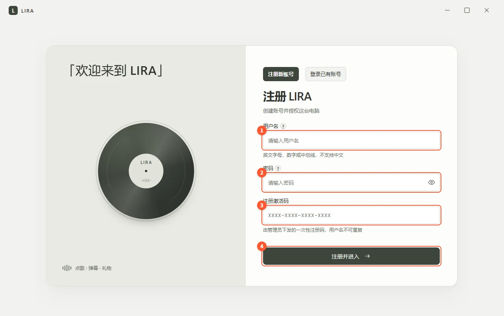

原图：[client-login-window.webp](images/usage-guide/A/client-login-window.webp) · 1280×802 · 27 KB。

<a id="shot-a2"></a>

**A2 · 登录已有账号与短效登录码**

**入口：客户端 → 登录 / 注册窗口。**

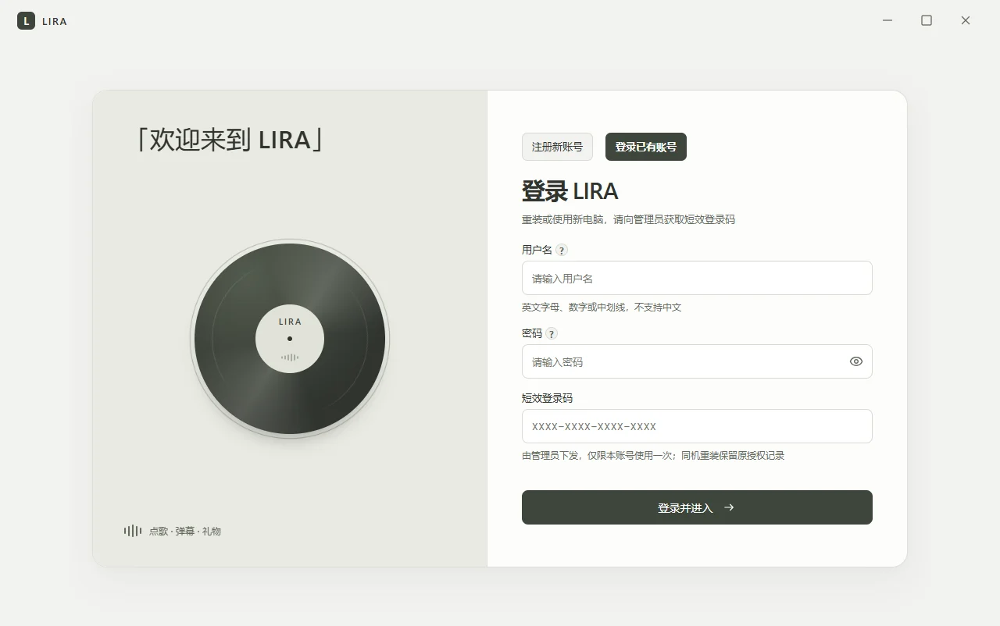

原图：[client-login-existing-mode.webp](images/usage-guide/A/client-login-existing-mode.webp) · 1280×802 · 26 KB。

<a id="shot-a3"></a>

**A3 · 用户名规则**

**入口：客户端 → 登录 / 注册窗口。**

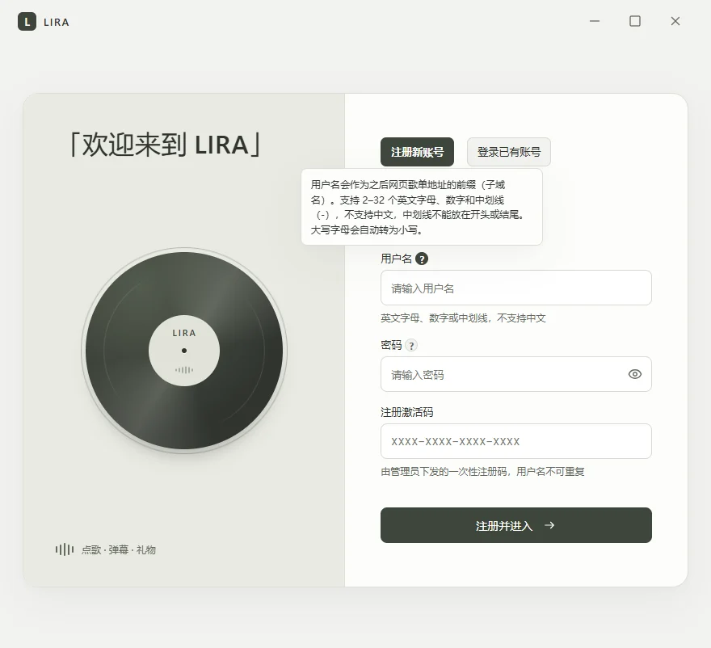

原图：[client-login-username-help.webp](images/usage-guide/A/client-login-username-help.webp) · 880×802 · 27 KB。

<a id="shot-a4"></a>

**A4 · 密码规则**

**入口：客户端 → 登录 / 注册窗口。**

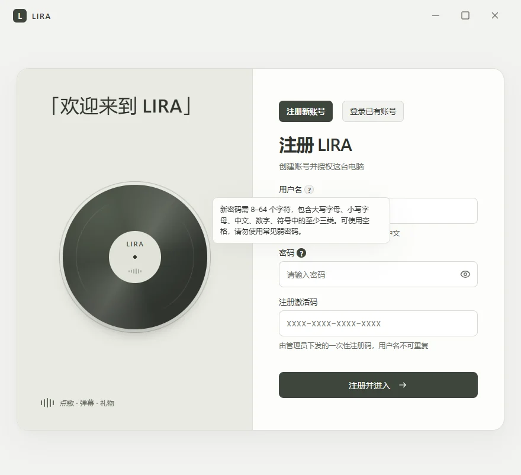

原图：[client-login-password-help.webp](images/usage-guide/A/client-login-password-help.webp) · 880×802 · 26 KB。

<a id="shot-a5"></a>

**A5 · 注册激活码与一次性使用提示**

**入口：客户端 → 登录 / 注册窗口（局部图）。**

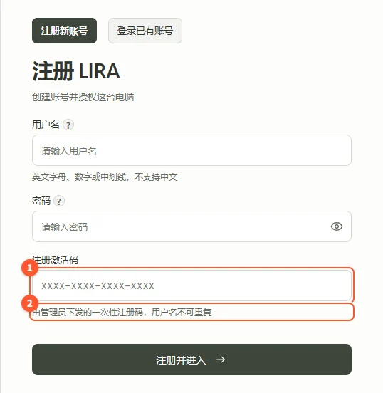

原图：[client-login-activation-code.webp](images/usage-guide/A/client-login-activation-code.webp) · 538×552 · 16 KB。

<a id="shot-a6"></a>

**A6 · 正在准备直播工具（演示状态）**

准备进度为演示状态，用于说明首次初始化界面。

**入口：客户端 → 登录 / 注册窗口。**

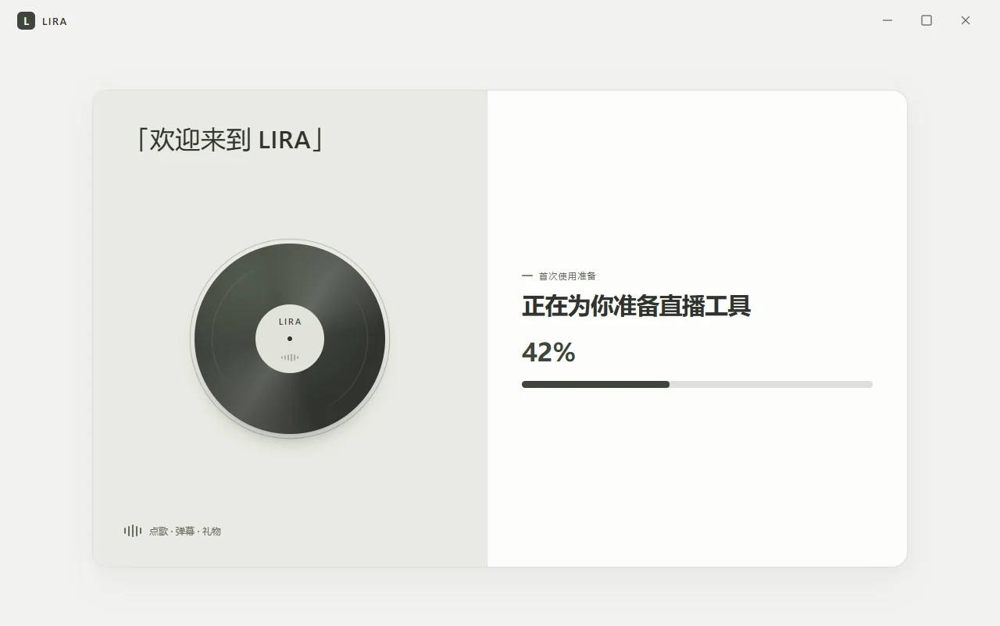

原图：[client-login-preparing.webp](images/usage-guide/A/client-login-preparing.webp) · 1280×802 · 16 KB。

<a id="shot-a7"></a>

**A7 · 连接失败与重试连接（演示状态）**

授权连接失败的演示状态，可见重试入口；不代表本机当前服务故障。

**入口：客户端 → 登录 / 注册窗口。**

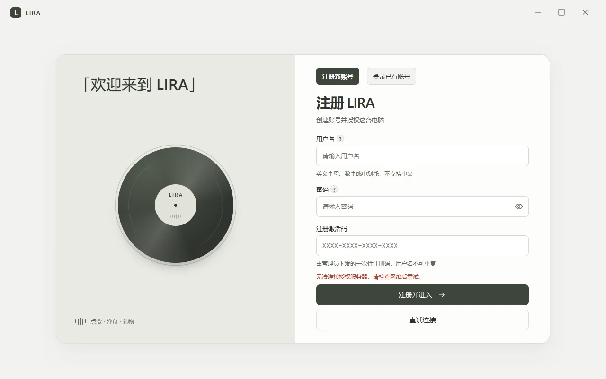

原图：[client-login-failed-retry.webp](images/usage-guide/A/client-login-failed-retry.webp) · 1280×802 · 27 KB。

<a id="shot-a7b"></a>

**A7b · 准备未完成与重新准备（演示状态）**

礼物目录准备失败的演示状态，与授权连接失败分开说明。

**入口：客户端 → 登录 / 注册窗口。**

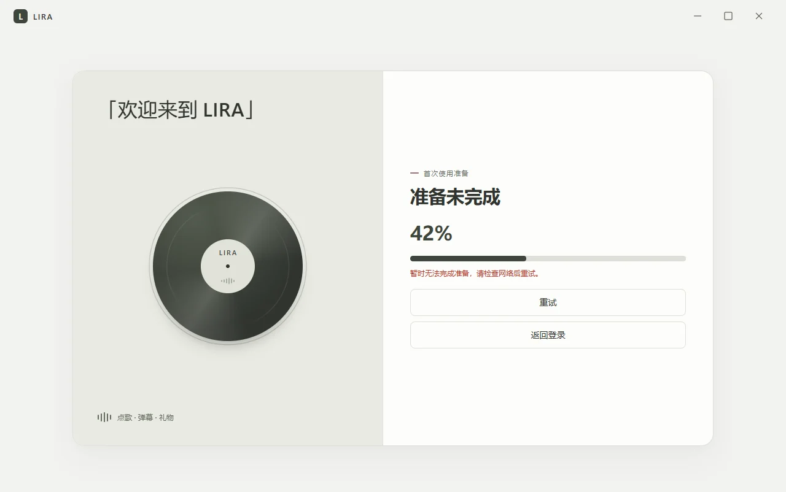

原图：[client-preparation-failed.webp](images/usage-guide/A/client-preparation-failed.webp) · 1280×802 · 17 KB。

<a id="shot-a8"></a>

**A8 · 客户端主界面与顶部导航（已有示例数据）**

隔离环境的主界面总览；首次启动自动触发逻辑仍需单独验收。

**入口：客户端 → 主界面顶部导航。**

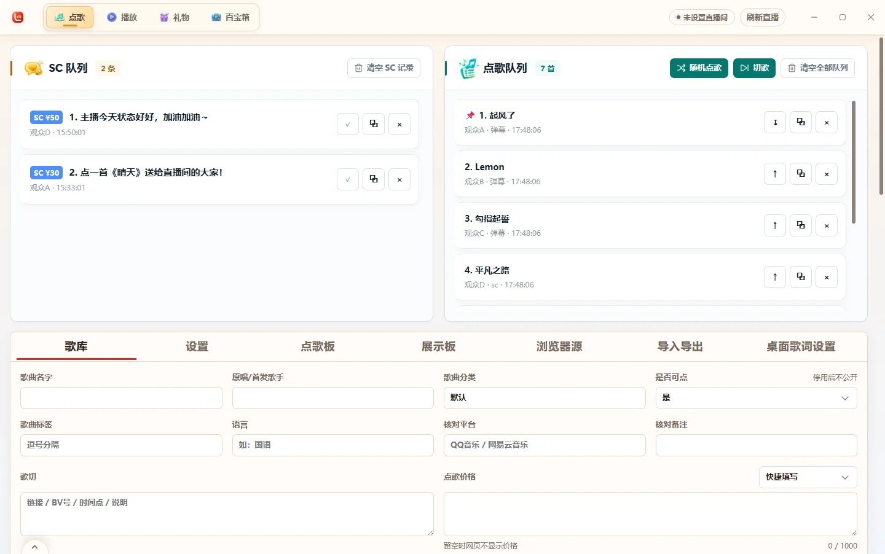

原图：[client-main-first-open.webp](images/usage-guide/A/client-main-first-open.webp) · 1440×902 · 52 KB。

<a id="shot-a9"></a>

**A9 · 聚光灯引导：登录你的直播账号**

通过“重新查看引导”进入该步骤，展示高亮区域、说明气泡与下一步按钮。

**入口：客户端 → 百宝箱 → 使用文档 → 重新查看新手引导。**

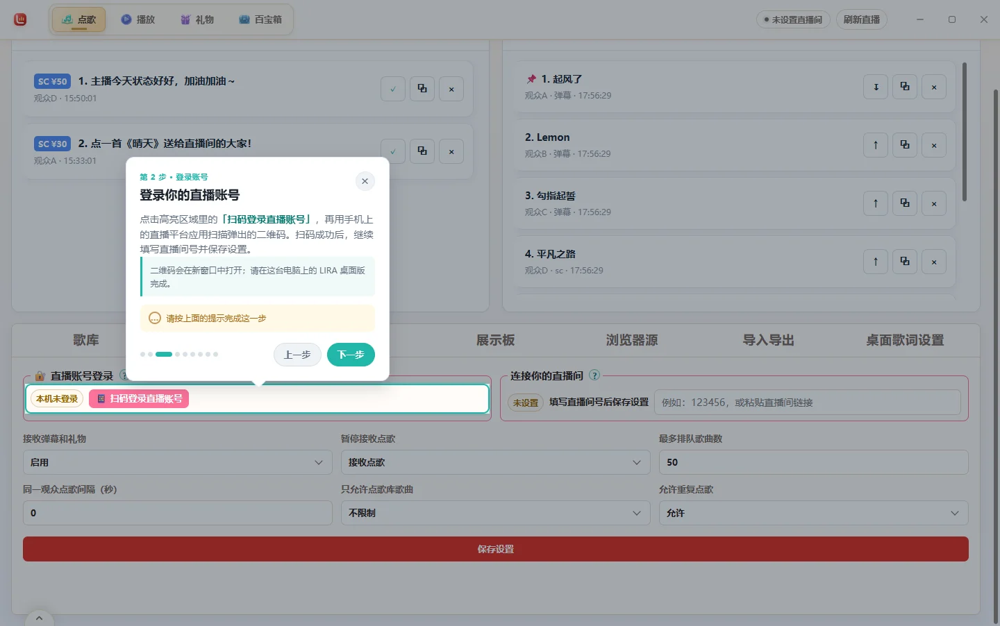

原图：[client-tour-bubble.webp](images/usage-guide/A/client-tour-bubble.webp) · 1440×902 · 55 KB。

<a id="shot-a10"></a>

**A10 · 顶部导航、直播状态与窗口按钮**

**入口：客户端 → 主界面顶部导航（局部图）。**


原图：[client-topbar-status.webp](images/usage-guide/A/client-topbar-status.webp) · 1440×58 · 5 KB。

<a id="gallery-b"></a>

#### B 组 · 点歌页

<a id="shot-b1"></a>

**B1 · 点歌与 SC 队列总览**

**入口：客户端 → 点歌 → 歌库 / 点歌队列。**


原图：[song-queue-overview.webp](images/usage-guide/B/song-queue-overview.webp) · 1440×902 · 52 KB。

<a id="shot-b2"></a>

**B2 · 队列条目：置顶、复制歌名和删除**

图中 ① 置顶（已置顶时为取消置顶），② 复制歌名，③ 删除；不是查看详情。

**入口：客户端 → 点歌 → 歌库 / 点歌队列。**

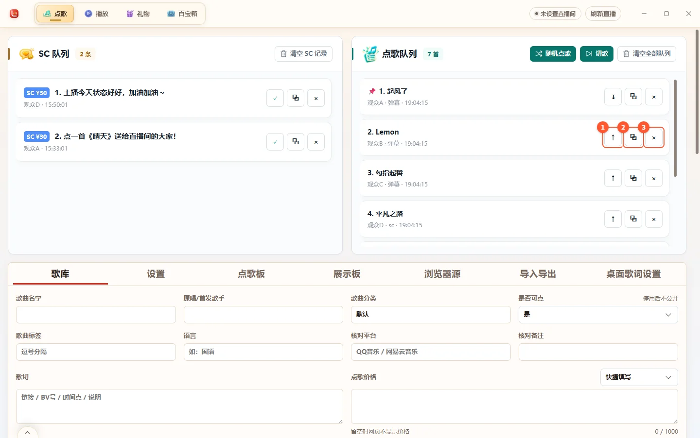

原图：[song-queue-item-actions.webp](images/usage-guide/B/song-queue-item-actions.webp) · 1440×902 · 53 KB。

<a id="shot-b3"></a>

**B3 · 歌库列表、搜索与筛选**

**入口：客户端 → 点歌 → 歌库 / 点歌队列。**

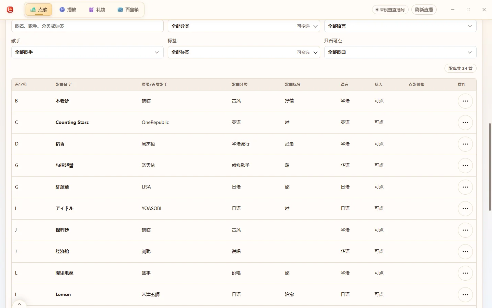

原图：[song-library-list.webp](images/usage-guide/B/song-library-list.webp) · 1440×902 · 46 KB。

<a id="shot-b4"></a>

**B4 · 歌库中的新增歌曲内嵌表单**

**入口：客户端 → 点歌 → 歌库 / 点歌队列（局部图）。**

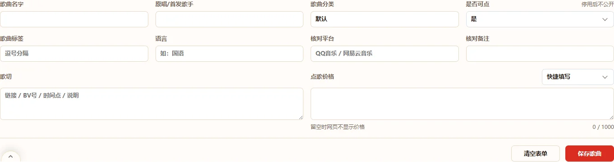

原图：[song-library-edit.webp](images/usage-guide/B/song-library-edit.webp) · 1362×362 · 17 KB。

<a id="shot-b5"></a>

**B5 · 直播账号登录入口（未登录）**

显示未登录时的扫码入口，不作为扫码成功或本机已登录的证据。

**入口：客户端 → 点歌 → 设置。**


原图：[song-settings-account.webp](images/usage-guide/B/song-settings-account.webp) · 1440×902 · 52 KB。

<a id="shot-b6"></a>

**B6 · 连接直播间设置（未配置）**

直播间尚未连接，房主资料的真实加载状态未拍摄。

**入口：客户端 → 点歌 → 设置（局部图）。**

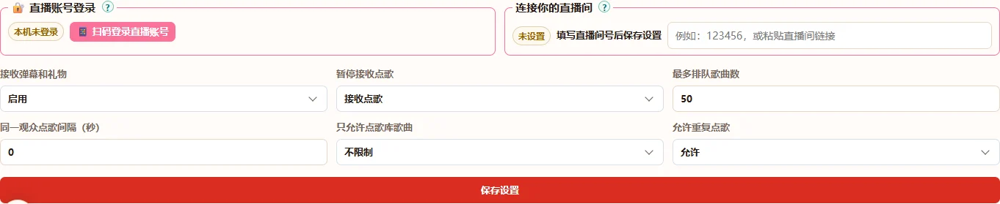

原图：[song-settings-room.webp](images/usage-guide/B/song-settings-room.webp) · 1362×279 · 21 KB。

<a id="shot-b7"></a>

**B7 · 接收消息与点歌规则**

**入口：客户端 → 点歌 → 设置。**

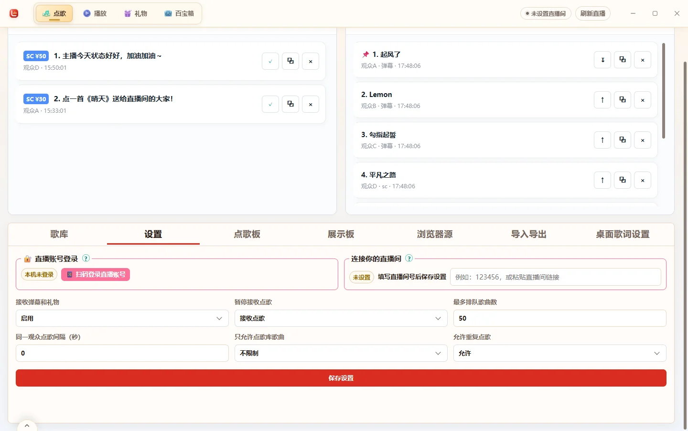

原图：[song-settings-rules.webp](images/usage-guide/B/song-settings-rules.webp) · 1440×902 · 52 KB。

<a id="shot-b8"></a>

**B8 · 点歌板六种风格**

**入口：客户端 → 点歌 → 点歌板。**

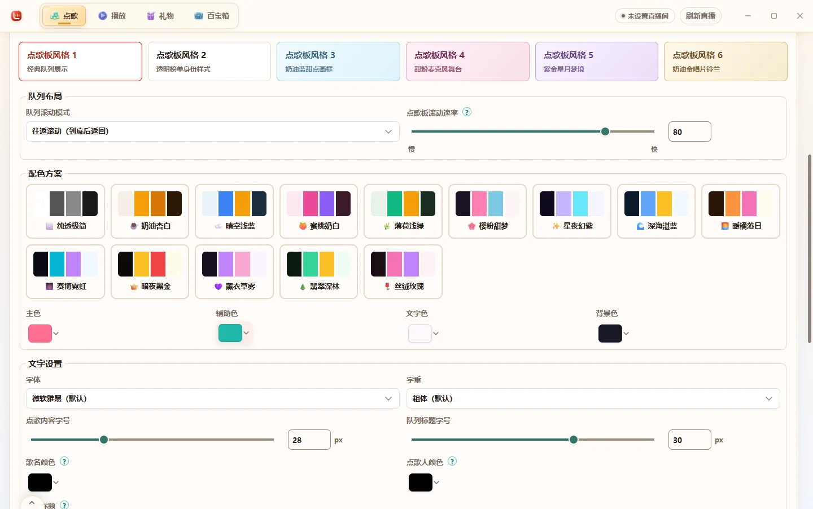

原图：[song-theme-styles.webp](images/usage-guide/B/song-theme-styles.webp) · 1440×902 · 57 KB。

<a id="shot-b9"></a>

**B9 · 点歌板文字与滚动设置**

**入口：客户端 → 点歌 → 点歌板（局部图）。**

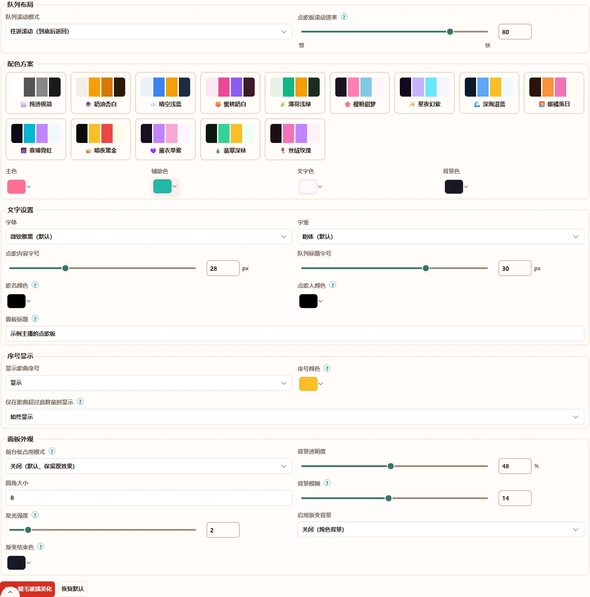

原图：[song-theme-detail.webp](images/usage-guide/B/song-theme-detail.webp) · 1362×1378 · 65 KB。

<a id="shot-b10"></a>

**B10 · 展示板排序、滚动与主题设置**

**入口：客户端 → 点歌 → 展示板（局部图）。**

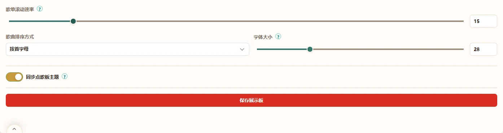

原图：[song-board-settings.webp](images/usage-guide/B/song-board-settings.webp) · 1394×370 · 10 KB。

<a id="shot-b11"></a>

**B11 · 浏览器源上半页：点歌与音乐**

保留「浏览器源」选中页签，完整显示点歌与音乐的 3 项及直播互动的 4 项；下方场景与氛围接 B11b。

**入口：客户端 → 点歌 → 浏览器源。**

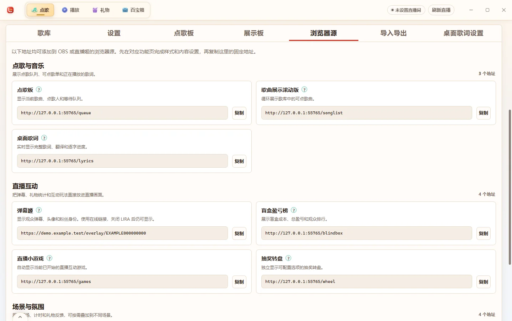

原图：[song-overlay-addresses.webp](images/usage-guide/B/song-overlay-addresses.webp) · 1440×902 · 67 KB。

<a id="shot-b11b"></a>

**B11b · 浏览器源下半页：场景与氛围**

承接 B11：加班机、礼物特效、开播画面、萌时钟的地址与复制按钮完整显示，两图合计覆盖 11 项。图中地址仅为示例。

**入口：客户端 → 点歌 → 浏览器源。**

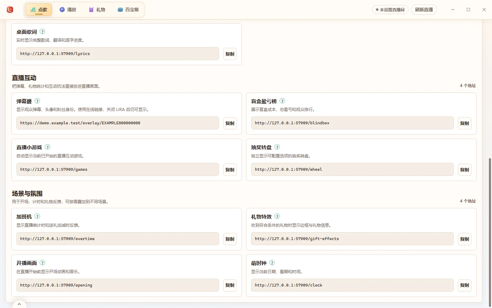

原图：[song-overlay-addresses-scene.webp](images/usage-guide/B/song-overlay-addresses-scene.webp) · 1440×902 · 63 KB。

<a id="shot-b12"></a>

**B12 · 下载模板、导入与导出歌库**

**入口：客户端 → 点歌 → 导入导出。**

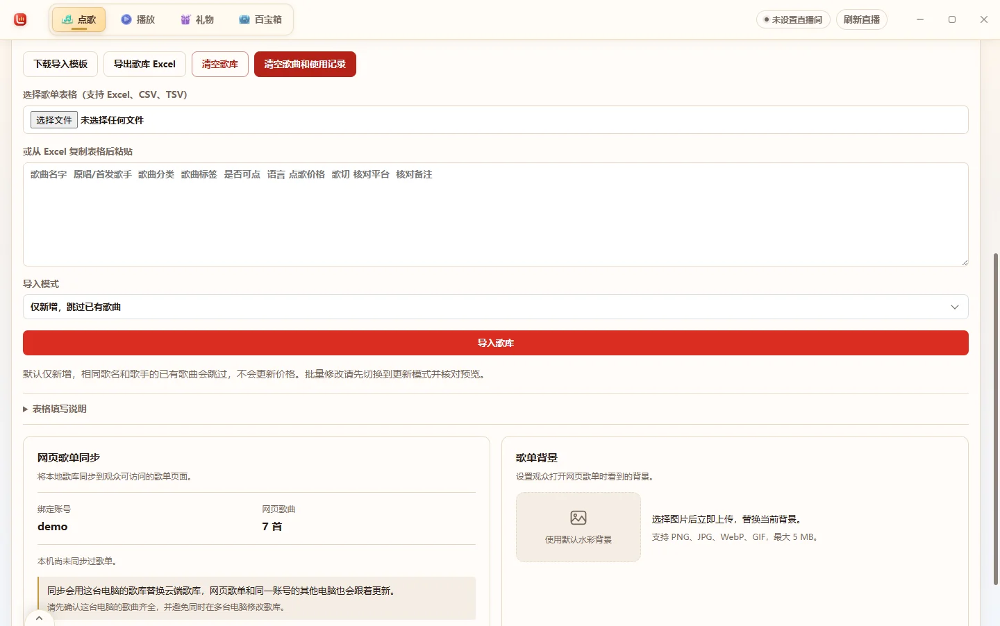

原图：[song-import-export.webp](images/usage-guide/B/song-import-export.webp) · 1440×902 · 55 KB。

<a id="shot-b12b"></a>

**B12b · 粘贴表格后的实际导入结果（隔离歌库）**

真实点击隔离歌库的「导入歌库」后显示逐类计数。首次导入新增 1 条；重复运行脚本会显示重复跳过，不等于失败。

**入口：客户端 → 点歌 → 导入导出。**

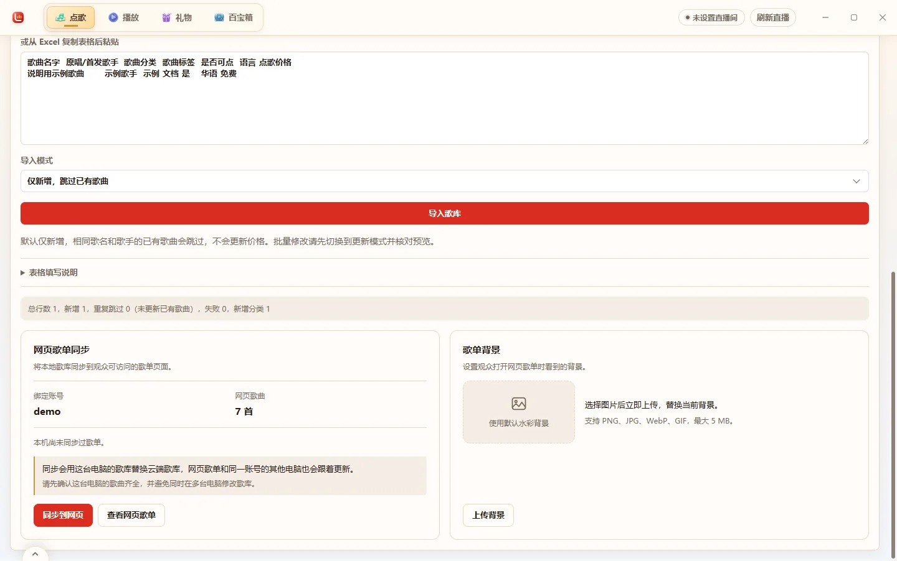

原图：[song-import-result.webp](images/usage-guide/B/song-import-result.webp) · 1440×902 · 55 KB。

<a id="shot-b13"></a>

**B13 · 桌面歌词基础字体设置**

基础字体、字号、字重、颜色、对齐、字间距和行间距；其余分组见 B13b–B13e。右侧等待播放不是歌词效果。

**入口：客户端 → 点歌 → 桌面歌词设置。**

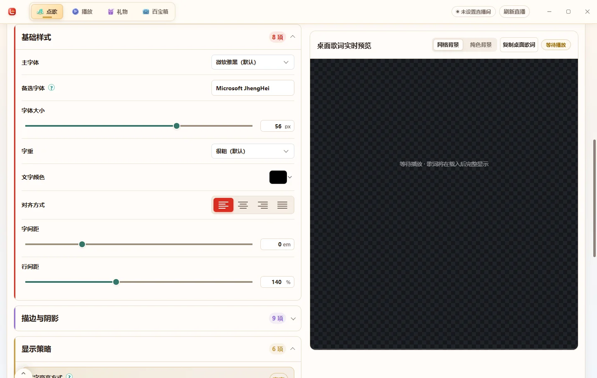

原图：[desktop-lyric-appearance.webp](images/usage-guide/B/desktop-lyric-appearance.webp) · 1440×913 · 53 KB。

<a id="shot-b13b"></a>

**B13b · 桌面歌词描边与阴影**

**入口：客户端 → 点歌 → 桌面歌词设置。**

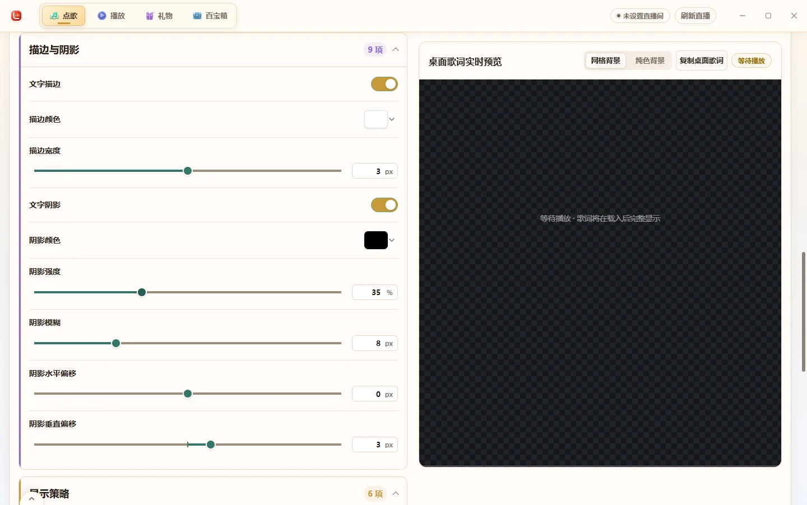

原图：[desktop-lyric-stroke.webp](images/usage-guide/B/desktop-lyric-stroke.webp) · 1440×902 · 49 KB。

<a id="shot-b13c"></a>

**B13c · 桌面歌词逐字高亮与翻译**

**入口：客户端 → 点歌 → 桌面歌词设置。**

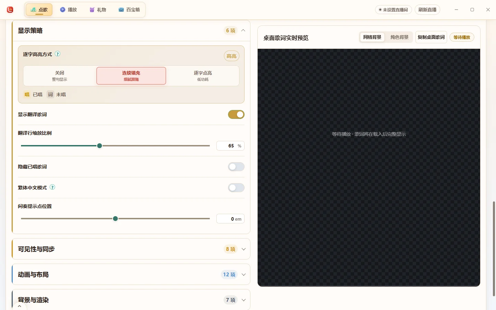

原图：[desktop-lyric-karaoke.webp](images/usage-guide/B/desktop-lyric-karaoke.webp) · 1440×902 · 55 KB。

<a id="shot-b13d"></a>

**B13d · 桌面歌词可见性与时间偏移**

**入口：客户端 → 点歌 → 桌面歌词设置。**

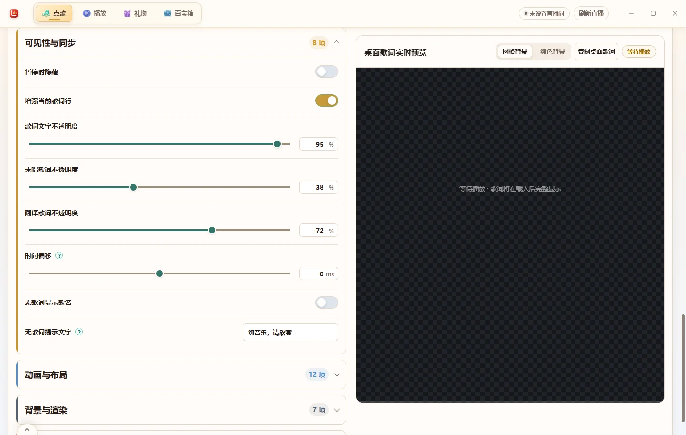

原图：[desktop-lyric-opacity.webp](images/usage-guide/B/desktop-lyric-opacity.webp) · 1440×913 · 55 KB。

<a id="shot-b13e"></a>

**B13e · 桌面歌词背景与整体透明度**

**入口：客户端 → 点歌 → 桌面歌词设置。**

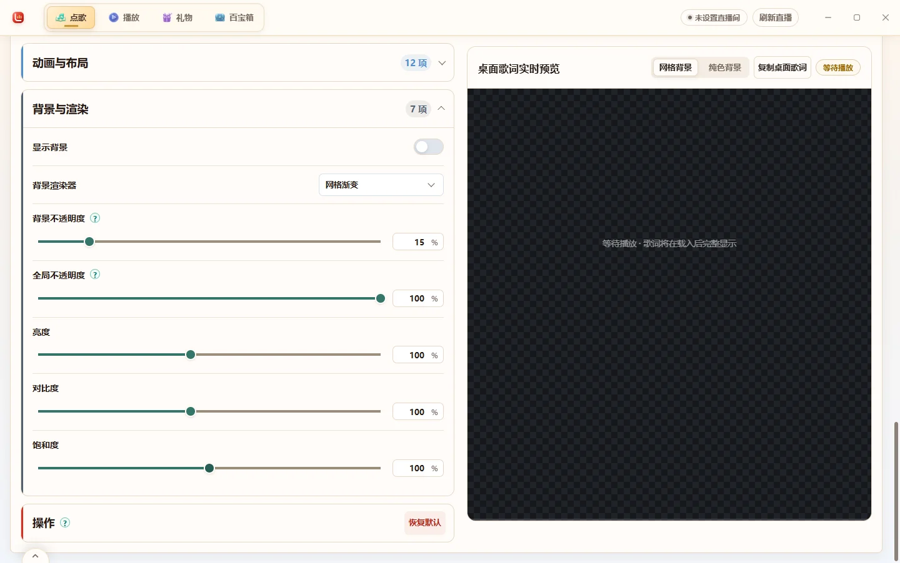

原图：[desktop-lyric-rendering.webp](images/usage-guide/B/desktop-lyric-rendering.webp) · 1440×902 · 50 KB。

<a id="shot-b14"></a>

**B14 · 点歌匹配后的下一首播放与跳过通知（示例请求）**

合成的待确认点歌由实际通知组件展示。① 下一首播放，② 跳过；本次只展示通知，没有启动音源播放。

**入口：客户端 → 点歌 → 歌库 / 点歌队列。**

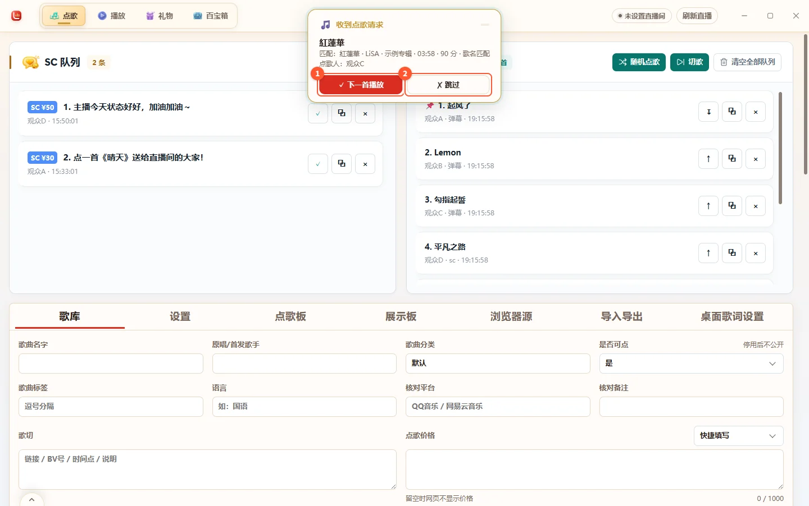

原图：[song-request-confirmation.webp](images/usage-guide/B/song-request-confirmation.webp) · 1440×902 · 56 KB。

<a id="gallery-c"></a>

#### C 组 · 播放页

<a id="shot-c1"></a>

**C1 · 三个音乐平台与登录入口（未登录）**

三个平台均为未登录状态；真实扫码登录后的状态仍待补拍。

**入口：客户端 → 播放 → 音乐平台。**

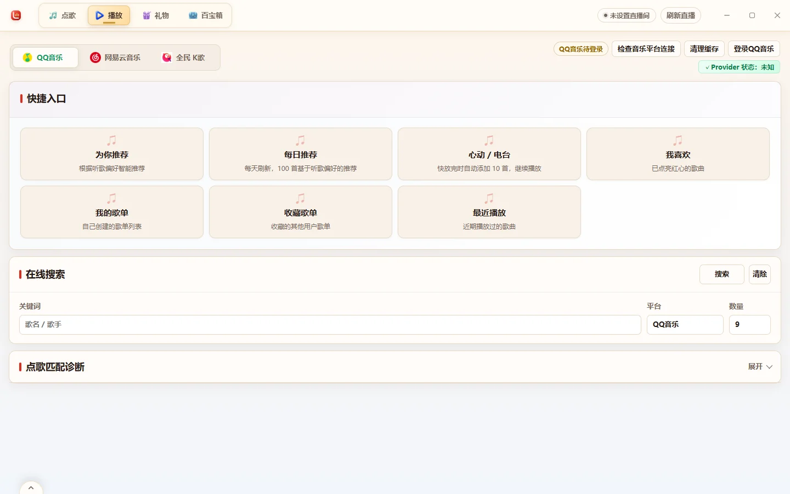

原图：[playback-platform-tabs.webp](images/usage-guide/C/playback-platform-tabs.webp) · 1440×902 · 41 KB。

<a id="shot-c2"></a>

**C2 · 在线搜索与结果条数**

**入口：客户端 → 播放 → 在线搜索（局部图）。**

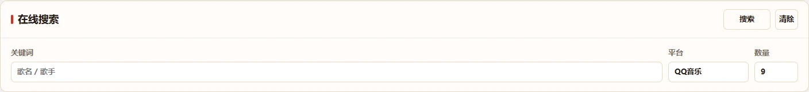

原图：[playback-search.webp](images/usage-guide/C/playback-search.webp) · 1408×161 · 7 KB。

<a id="shot-c3"></a>

**C3 · 全民 K 歌缓存目录与歌词时间调整**

展示目录选择、保存检测与歌词偏移控件，未连接真实全民 K 歌缓存。

**入口：客户端 → 播放 → 全民 K 歌。**

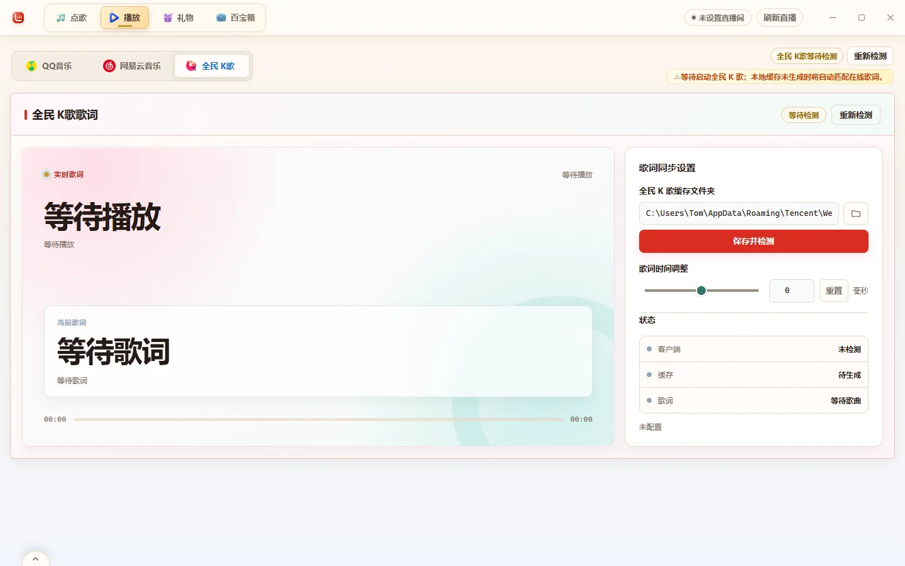

原图：[playback-wesing-cache.webp](images/usage-guide/C/playback-wesing-cache.webp) · 1440×902 · 43 KB。

<a id="shot-c4"></a>

**C4 · 播放器控制栏（示例曲目，未播放）**

使用示例曲目信息，播放器未开始播放。

**入口：客户端 → 播放 → 播放器控制栏（局部图）。**


原图：[playback-player-bar.webp](images/usage-guide/C/playback-player-bar.webp) · 1440×95 · 5 KB。

<a id="shot-c6"></a>

**C6 · 播放队列、导入点歌与清空**

播放队列包含示例歌曲和一条待确认点歌；标出“导入点歌”和“清空队列”。

**入口：客户端 → 播放 → 播放队列。**

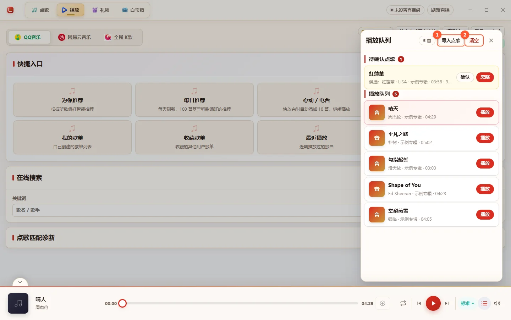

原图：[playback-queue-drawer.webp](images/usage-guide/C/playback-queue-drawer.webp) · 1440×902 · 54 KB。

<a id="shot-c7"></a>

**C7 · 点歌 → 桌面歌词：等待播放的预览入口**

本图用于定位「复制桌面歌词」入口，预览仍是等待播放；实际歌词效果与全屏歌词 C5 另列待补。

**入口：客户端 → 点歌 → 桌面歌词设置 → 实时预览（局部图）。**


原图：[playback-desktop-lyric-preview.webp](images/usage-guide/C/playback-desktop-lyric-preview.webp) · 648×791 · 32 KB。

<a id="shot-c8"></a>

**C8 · 最近播放的内容抽屉（登录状态与历史演示）**

真实内容抽屉显示本机示例历史和「播放全部」；音乐账号登录状态由隔离接口提供，仅用于展示入口，不代表真实平台登录成功。此视图不显示「换一批」；该按钮用于推荐等支持刷新内容的视图。

**入口：客户端 → 播放 → 最近播放 → 内容抽屉。**

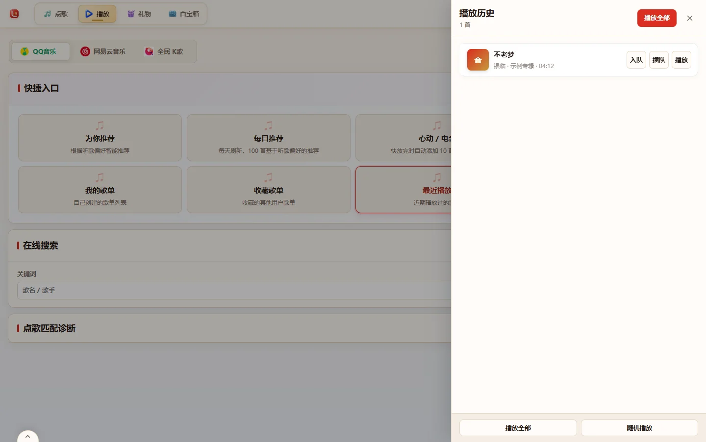

原图：[playback-content-drawer.webp](images/usage-guide/C/playback-content-drawer.webp) · 1440×902 · 31 KB。

<a id="shot-c9"></a>

**C9 · 点歌匹配诊断（未找到候选的示例）**

已展开歌名、歌手、时长和「测试匹配」。图示结果未找到候选；不能据此判断歌库没有该歌曲，也不作为音乐平台匹配成功证据。

**入口：客户端 → 播放 → 点歌匹配诊断。**

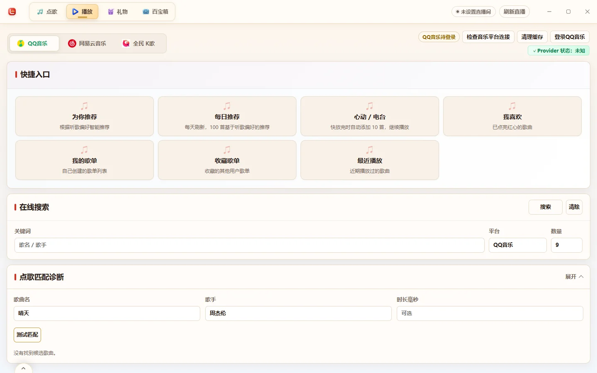

原图：[playback-match-diagnostic.webp](images/usage-guide/C/playback-match-diagnostic.webp) · 1440×902 · 45 KB。

<a id="gallery-d"></a>

#### D 组 · 礼物页

<a id="shot-d1"></a>

**D1 · 礼物页上半部：统计与最近礼物**

本图只覆盖礼物页上半部；盲盒榜与月底冲刺设置分别见 D9、D10。

**入口：客户端 → 礼物 → 统计与最近礼物。**

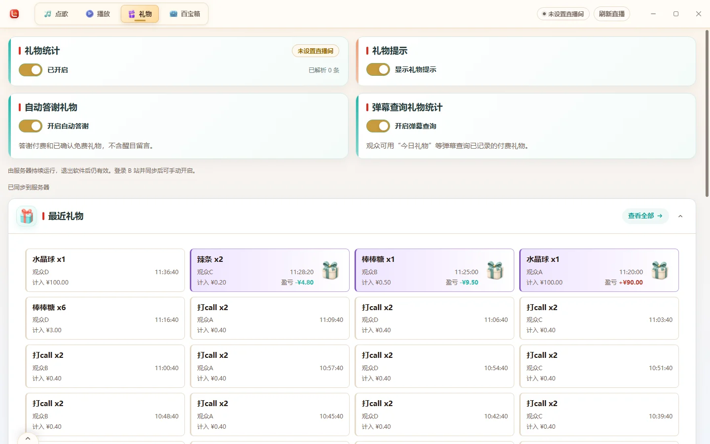

原图：[gift-page-overview.webp](images/usage-guide/D/gift-page-overview.webp) · 1440×902 · 69 KB。

<a id="shot-d2"></a>

**D2 · 自动答谢、礼物查询与服务器运行说明（演示设置）**

开关值来自演示响应；后台持续运行能力不在本次截图验证范围。

**入口：客户端 → 礼物 → 自动答谢（局部图）。**

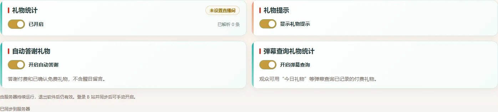

原图：[gift-auto-thanks.webp](images/usage-guide/D/gift-auto-thanks.webp) · 1396×315 · 24 KB。

<a id="shot-d3"></a>

**D3 · 弹幕查询礼物统计开关（演示设置）**

用于说明查询开关与提示语，没有发送真实直播弹幕。

**入口：客户端 → 礼物 → 弹幕查询礼物统计（局部图）。**

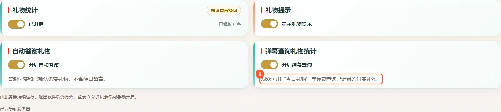

原图：[gift-danmaku-query.webp](images/usage-guide/D/gift-danmaku-query.webp) · 1396×315 · 25 KB。

<a id="shot-d4"></a>

**D4 · 最近礼物和查看全部入口**

**入口：客户端 → 礼物 → 最近礼物（局部图）。**

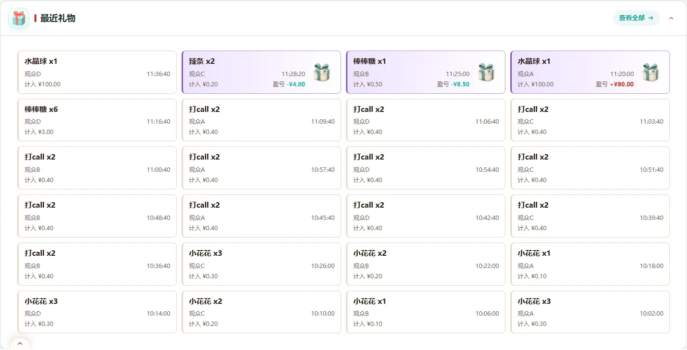

原图：[gift-recent-and-all.webp](images/usage-guide/D/gift-recent-and-all.webp) · 1396×713 · 57 KB。

<a id="shot-d5"></a>

**D5 · 礼物历史筛选、已选记录与导出入口**

已勾选 2 条示例记录，右上角显示「导出所选 2 条」；后续导出界面见 D6。

**入口：客户端 → 礼物 → 查看全部。**

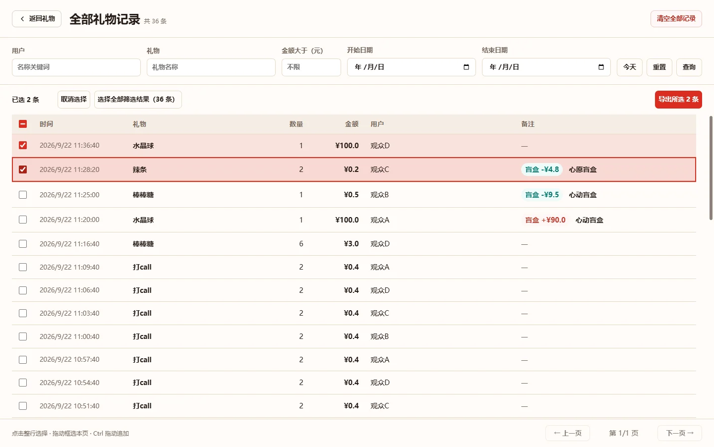

原图：[gift-history-drawer.webp](images/usage-guide/D/gift-history-drawer.webp) · 1440×902 · 48 KB。

<a id="shot-d6"></a>

**D6 · 礼物 PNG 导出预览与保存设置（界面演示）**

仅为导出界面演示。本次直接调用导出运行时遇到 services.overtimeGiftCatalog.getGlobalSnapshot is not a function，截图环境改用示例快照显示预览；未执行文件保存，也不能作为导出成功的证据。

**入口：客户端 → 礼物 → 查看全部 → 导出所选。**

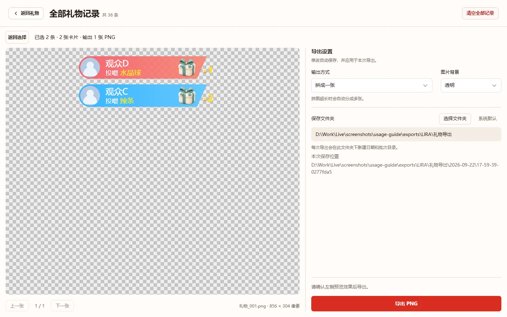

原图：[gift-export-workspace.webp](images/usage-guide/D/gift-export-workspace.webp) · 1440×902 · 62 KB。

<a id="shot-d7"></a>

**D7 · 礼物许愿三个周期与目标进度**

使用示例目标与进度；纯文字样式、占位符见下一张。

**入口：客户端 → 百宝箱 → 礼物姬 → 礼物许愿。**

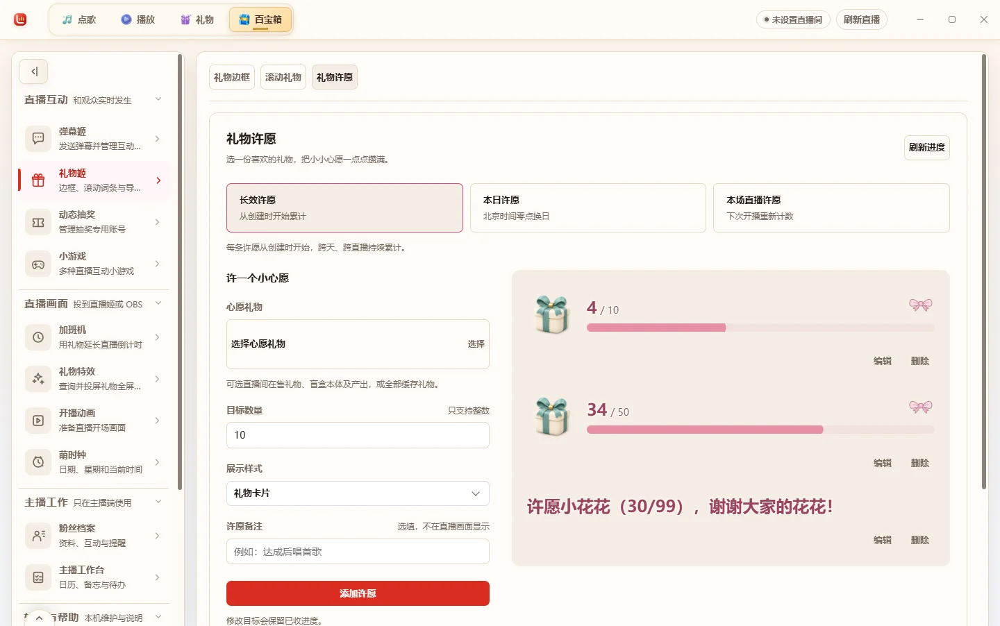

原图：[gift-wishes.webp](images/usage-guide/D/gift-wishes.webp) · 1440×902 · 59 KB。

<a id="shot-d7b"></a>

**D7b · 礼物许愿纯文字样式与动态占位符**

纯文字样式使用 {礼物}、{已收}、{目标} 展示动态文案。

**入口：客户端 → 百宝箱 → 礼物姬 → 礼物许愿（局部图）。**

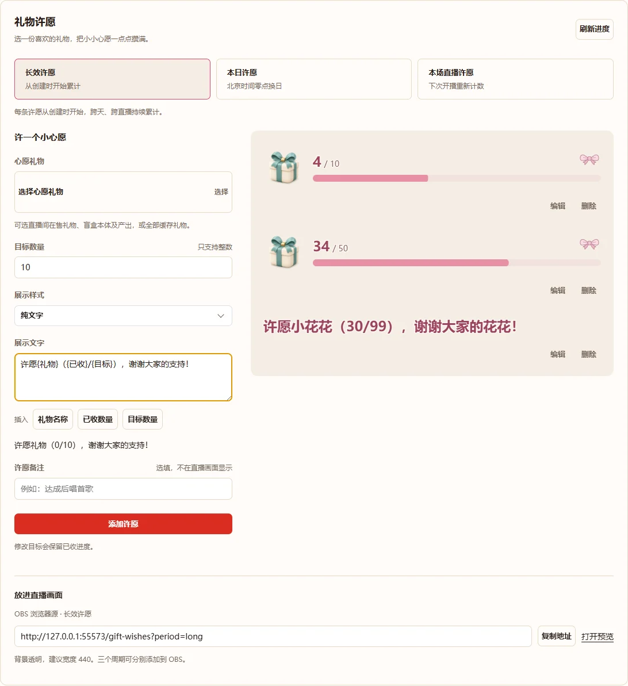

原图：[gift-wishes-text.webp](images/usage-guide/D/gift-wishes-text.webp) · 1092×1193 · 50 KB。

<a id="shot-d8"></a>

**D8 · 盲盒盈亏分析工作区**

**入口：客户端 → 礼物 → 盲盒分析。**

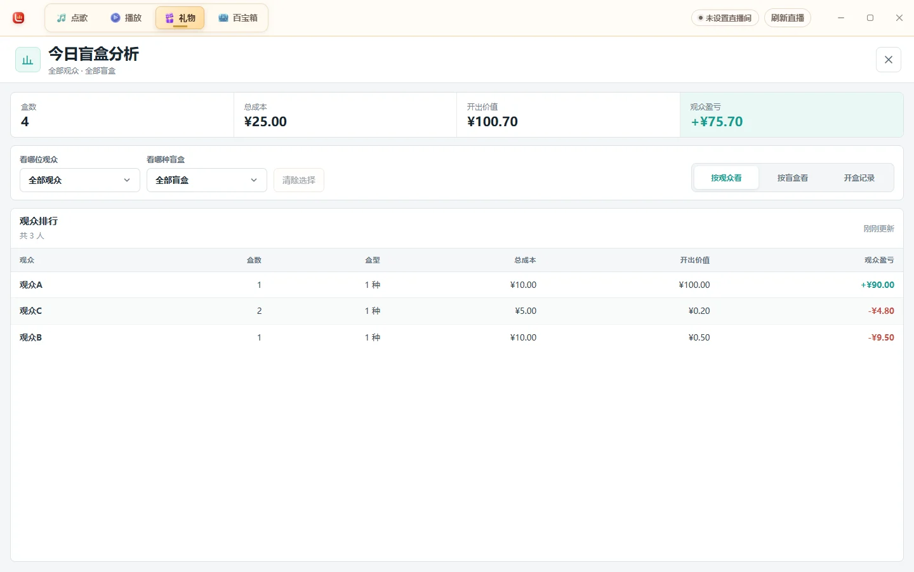

原图：[gift-blindbox-analysis.webp](images/usage-guide/D/gift-blindbox-analysis.webp) · 1440×902 · 30 KB。

<a id="shot-d8b"></a>

**D8b · 盲盒盈亏分析：按盲盒看**

显示盲盒汇总的成本、开出价值与观众盈亏。

**入口：客户端 → 礼物 → 盲盒分析。**

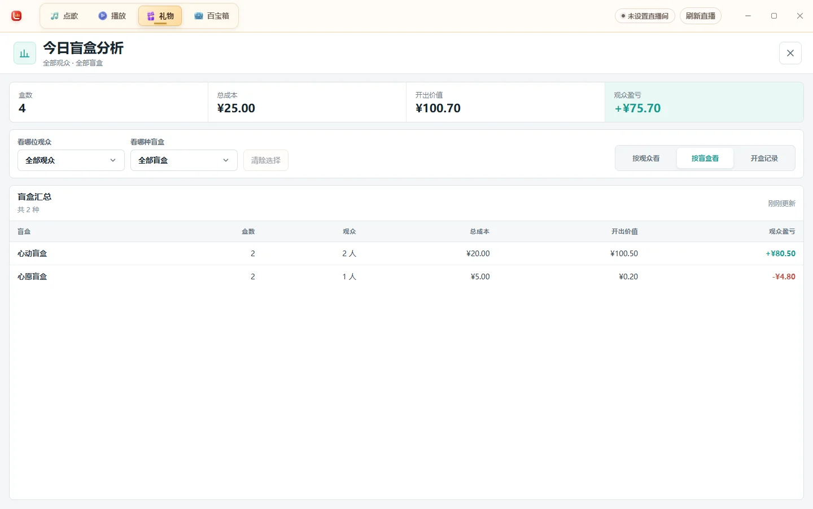

原图：[gift-blindbox-boxes.webp](images/usage-guide/D/gift-blindbox-boxes.webp) · 1440×902 · 28 KB。

<a id="shot-d8c"></a>

**D8c · 盲盒盈亏分析：开盒记录**

显示逐条开盒记录及其成本与盈亏；只有 3 条示例记录，不宣称已验证多页翻页。

**入口：客户端 → 礼物 → 盲盒分析。**

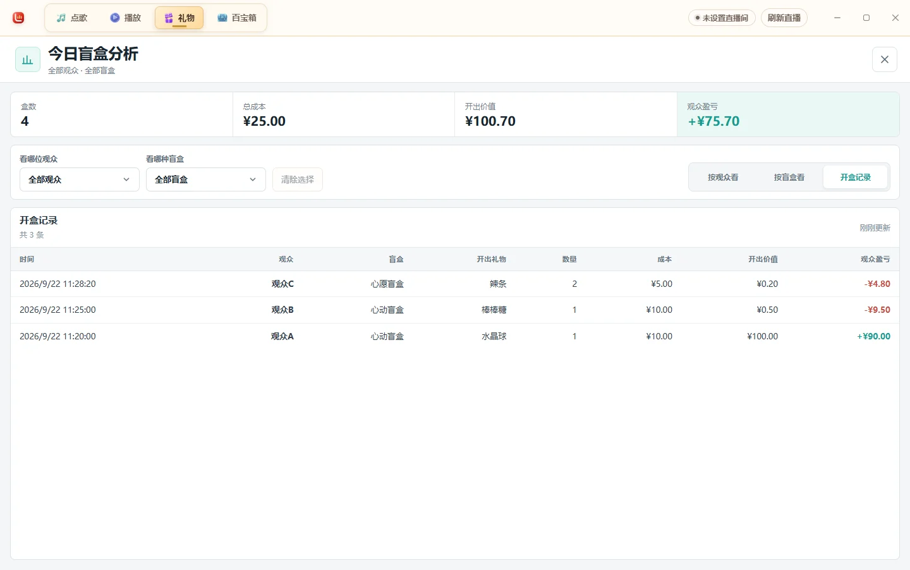

原图：[gift-blindbox-records.webp](images/usage-guide/D/gift-blindbox-records.webp) · 1440×902 · 36 KB。

<a id="shot-d9"></a>

**D9 · 盲盒盈亏榜标题、人数与筛选**

**入口：客户端 → 礼物 → 盲盒盈亏榜。**

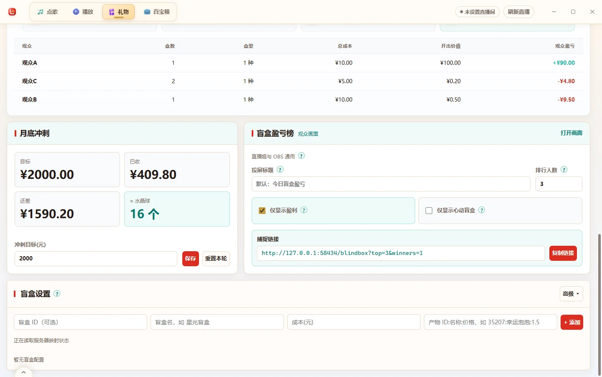

原图：[gift-blindbox-leaderboard-settings.webp](images/usage-guide/D/gift-blindbox-leaderboard-settings.webp) · 1440×902 · 52 KB。

<a id="shot-d10"></a>

**D10 · 月底冲刺目标、进度与重置本轮**

**入口：客户端 → 礼物 → 月底冲刺。**


原图：[gift-sprint.webp](images/usage-guide/D/gift-sprint.webp) · 1440×902 · 52 KB。

<a id="gallery-e"></a>

#### E 组 · 百宝箱

<a id="shot-e1"></a>

**E1 · 百宝箱导航：直播互动、直播画面与主播工作**

侧栏上半部显示直播互动、直播画面和主播工作；软件与帮助的完整列表见 E1b。

**入口：客户端 → 百宝箱 → 左侧工具导航。**

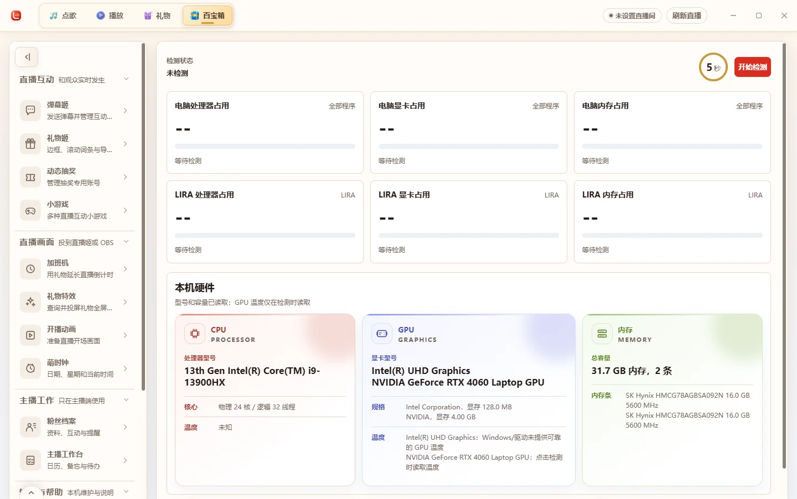

原图：[toolbox-nav.webp](images/usage-guide/E/toolbox-nav.webp) · 1440×902 · 69 KB。

<a id="shot-e1b"></a>

**E1b · 百宝箱导航：软件与帮助**

侧栏向下滚动后，设置、性能、使用文档、桌面更新四项完整可见。

**入口：客户端 → 百宝箱 → 左侧工具导航。**

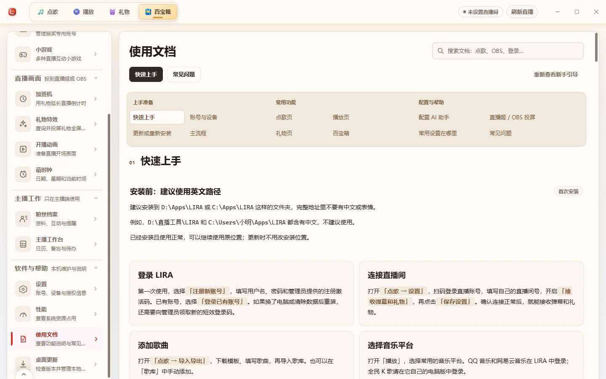

原图：[toolbox-nav-help.webp](images/usage-guide/E/toolbox-nav-help.webp) · 1440×902 · 89 KB。

<a id="shot-e2"></a>

**E2 · 弹幕姬连接状态（未登录、未设置直播间）**

发送账号和直播间均未连接，图中状态与这一前提一致。

**入口：客户端 → 百宝箱 → 弹幕姬。**

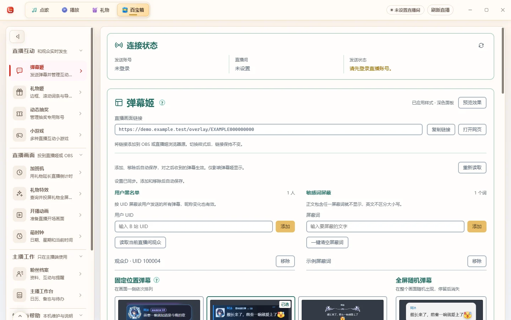

原图：[danmaku-connection.webp](images/usage-guide/E/danmaku-connection.webp) · 1440×902 · 74 KB。

<a id="shot-e3"></a>

**E3 · 六种固定样式与三种全屏随机样式**

**入口：客户端 → 百宝箱 → 弹幕姬（局部图）。**

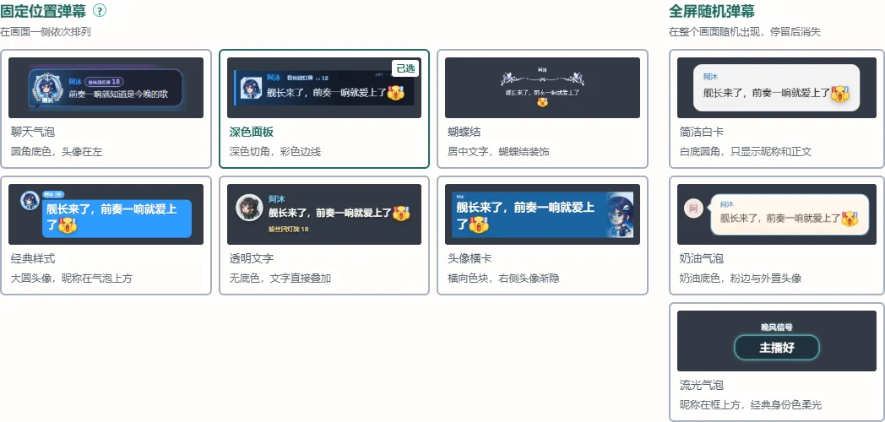

原图：[danmaku-styles.webp](images/usage-guide/E/danmaku-styles.webp) · 1048×500 · 40 KB。

<a id="shot-e4"></a>

**E4 · 弹幕输入、发送与自动钓鱼入口**

展示输入与发送入口，未向直播间发送消息。

**入口：客户端 → 百宝箱 → 弹幕姬（局部图）。**

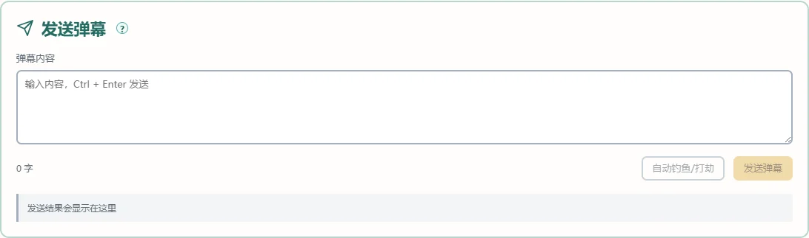

原图：[danmaku-send.webp](images/usage-guide/E/danmaku-send.webp) · 1092×323 · 8 KB。

<a id="shot-e5"></a>

**E5 · 用户黑名单与敏感词屏蔽（示例数据）**

**入口：客户端 → 百宝箱 → 弹幕姬（局部图）。**

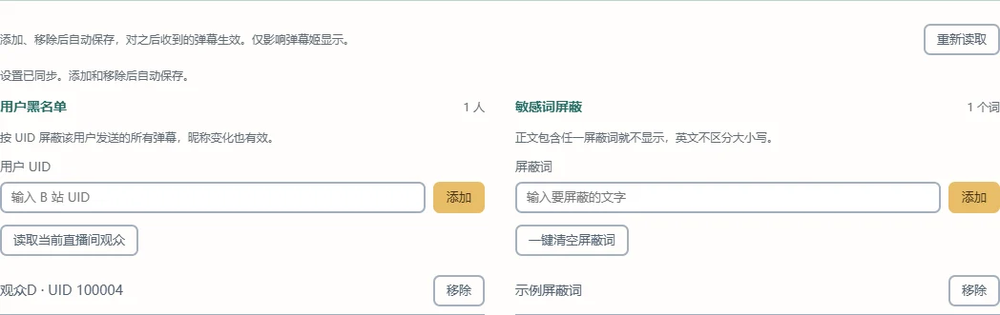

原图：[danmaku-blacklist.webp](images/usage-guide/E/danmaku-blacklist.webp) · 1048×331 · 20 KB。

<a id="shot-e6"></a>

**E6 · 深色面板字体、颜色与透明度**

**入口：客户端 → 百宝箱 → 弹幕姬（局部图）。**

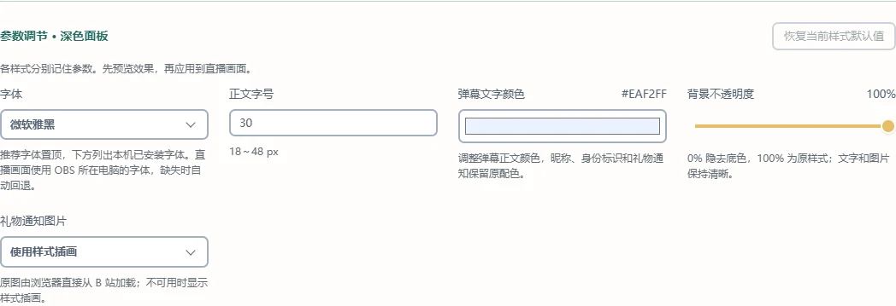

原图：[danmaku-params.webp](images/usage-guide/E/danmaku-params.webp) · 1048×359 · 21 KB。

<a id="shot-e6b"></a>

**E6b · 全屏随机样式停留时间与应用按钮**

选中全屏随机的「简洁白卡」后，参数区显示停留秒数与「应用到直播画面」。当前是未应用草稿；固定位置深色面板没有停留时间控件。

**入口：客户端 → 百宝箱 → 弹幕姬。**

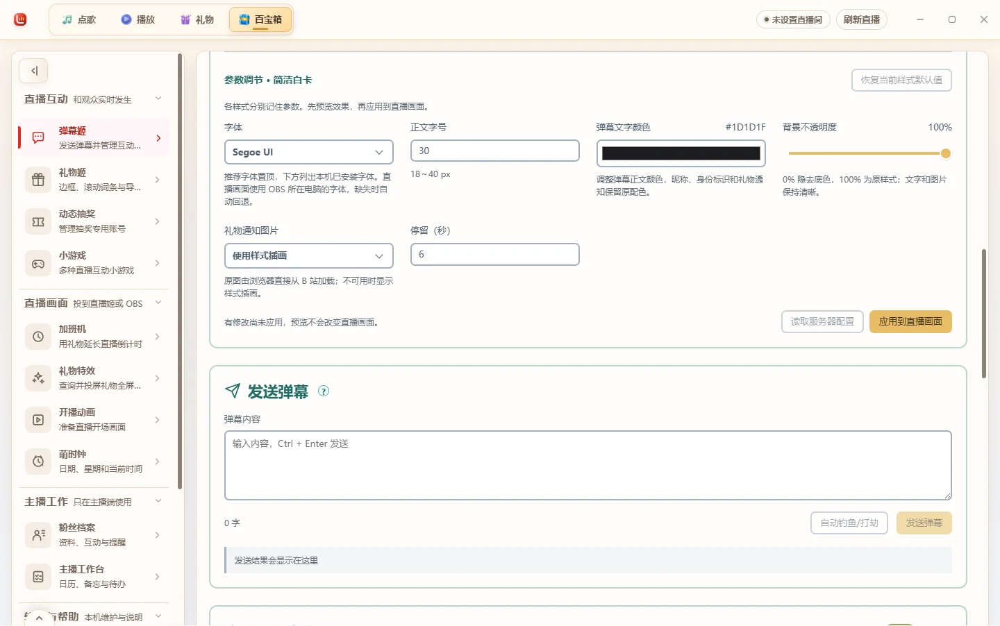

原图：[danmaku-random-params.webp](images/usage-guide/E/danmaku-random-params.webp) · 1440×902 · 60 KB。

<a id="shot-e6c"></a>

**E6c · 深色面板参数与应用到直播画面**

当前样式未修改时，「应用到直播画面」为禁用状态；修改参数后再应用。不要把未应用草稿解释为已经保存。

**入口：客户端 → 百宝箱 → 弹幕姬。**

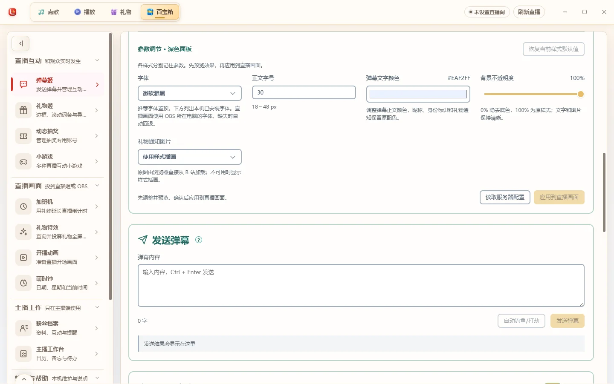

原图：[danmaku-apply-style.webp](images/usage-guide/E/danmaku-apply-style.webp) · 1440×902 · 60 KB。

<a id="shot-e7"></a>

**E7 · AI 互动助手配置（未填写密钥）**

密钥留空，未调用外部 AI 服务。

**入口：客户端 → 百宝箱 → 弹幕姬（局部图）。**

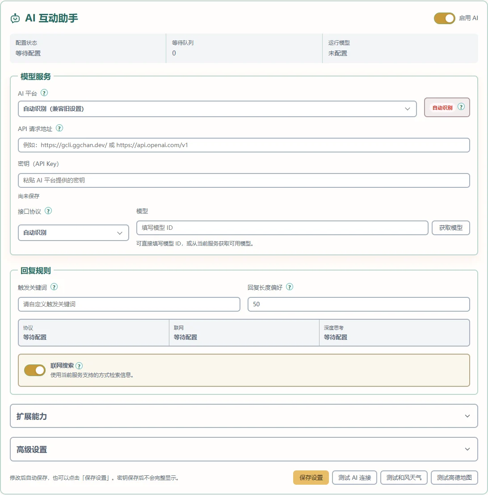

原图：[ai-assistant-config.webp](images/usage-guide/E/ai-assistant-config.webp) · 1092×1107 · 46 KB。

<a id="shot-e7b"></a>

**E7b · AI 平台选择（展开下拉框）**

展开后可看到自动识别、DeepSeek、OpenAI、Claude、Gemini、自定义 / 第三方兼容六项。密钥留空，尚未执行外部服务测试。

**入口：客户端 → 百宝箱 → 弹幕姬。**

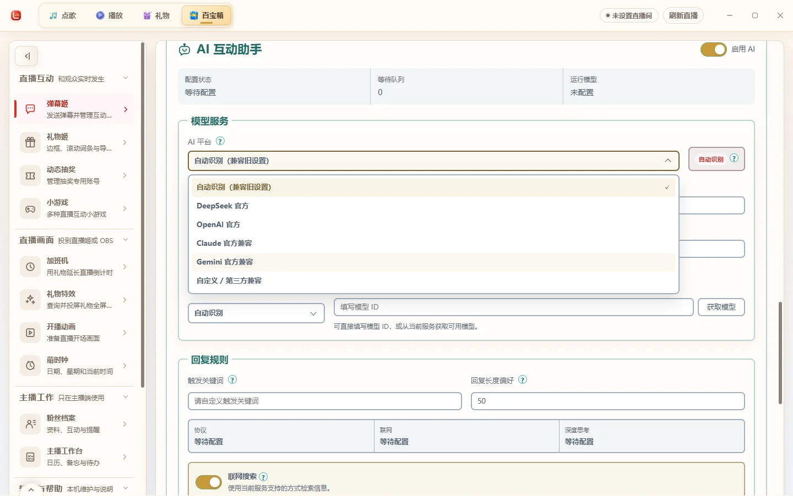

原图：[ai-assistant-provider-menu.webp](images/usage-guide/E/ai-assistant-provider-menu.webp) · 1440×902 · 57 KB。

<a id="shot-e8"></a>

**E8 · 动态抽奖设置（未登录）**

正常桌面环境中的未登录入口；错误的「请在 LIRA 桌面客户端使用动态抽奖」已不再出现。名单与开奖仍需真实条件验收。

**入口：客户端 → 百宝箱 → 动态抽奖。**

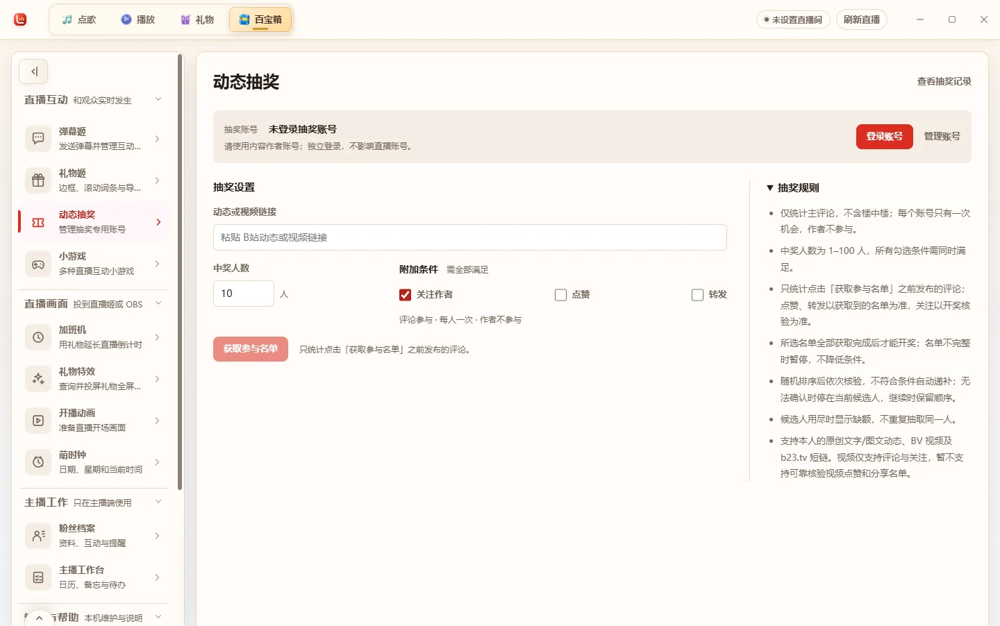

原图：[dynamic-lottery-setup.webp](images/usage-guide/E/dynamic-lottery-setup.webp) · 1440×902 · 65 KB。

<a id="shot-e10"></a>

**E10 · 小游戏入口与启动设置**

**入口：客户端 → 百宝箱 → 小游戏。**

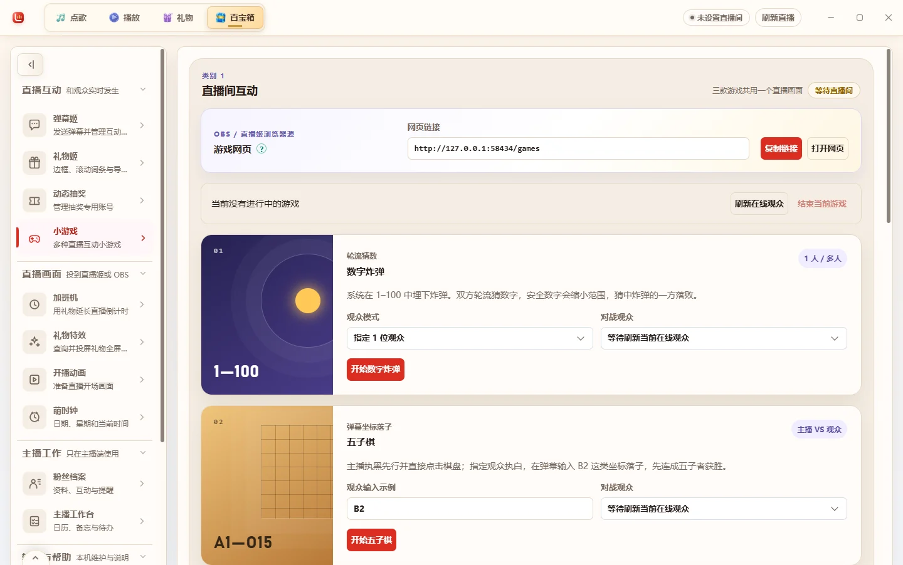

原图：[toolbox-games.webp](images/usage-guide/E/toolbox-games.webp) · 1440×902 · 65 KB。

<a id="shot-e10b"></a>

**E10b · 投票与评分设置**

**入口：客户端 → 百宝箱 → 小游戏（局部图）。**

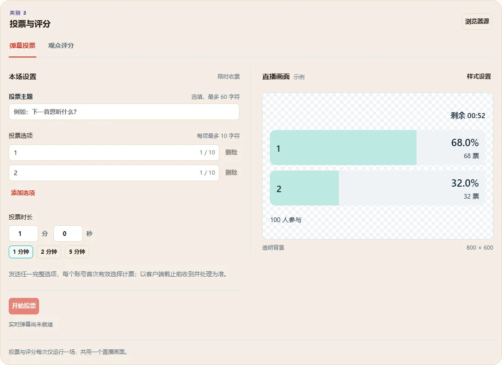

原图：[toolbox-voting.webp](images/usage-guide/E/toolbox-voting.webp) · 1092×794 · 40 KB。

<a id="shot-e10c"></a>

**E10c · 观众评分范围与平均分显示设置**

**入口：客户端 → 百宝箱 → 小游戏（局部图）。**

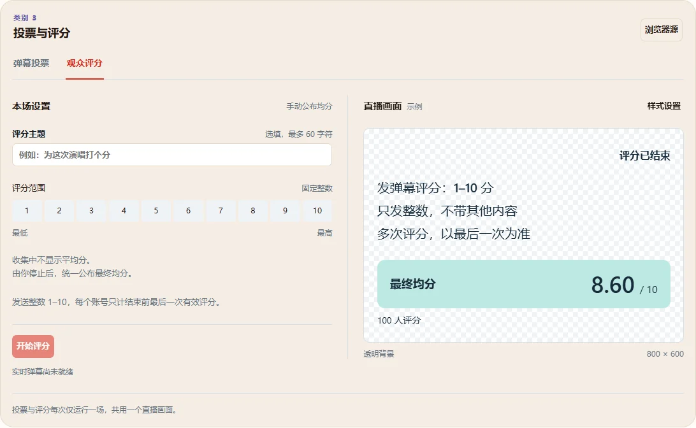

原图：[toolbox-rating.webp](images/usage-guide/E/toolbox-rating.webp) · 1092×672 · 45 KB。

<a id="shot-e10d"></a>

**E10d · 你画我猜回合与题库设置**

你画我猜的回合数、每局时长与本场题库；下方主持操作见 E10f。

**入口：客户端 → 百宝箱 → 小游戏。**

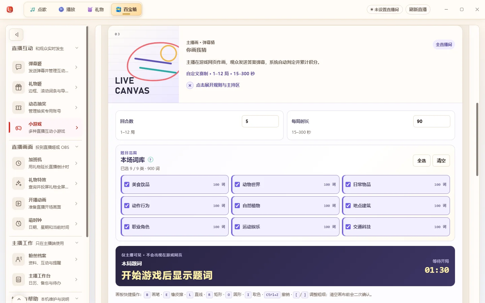

原图：[toolbox-draw-guess.webp](images/usage-guide/E/toolbox-draw-guess.webp) · 1440×902 · 69 KB。

<a id="shot-e10e"></a>

**E10e · 转盘内容、份数与独立网页入口**

转盘使用独立地址；两项内容仍未填写，开始按钮不可用。填写至少两个选项并保存后再开始。

**入口：客户端 → 百宝箱 → 小游戏。**

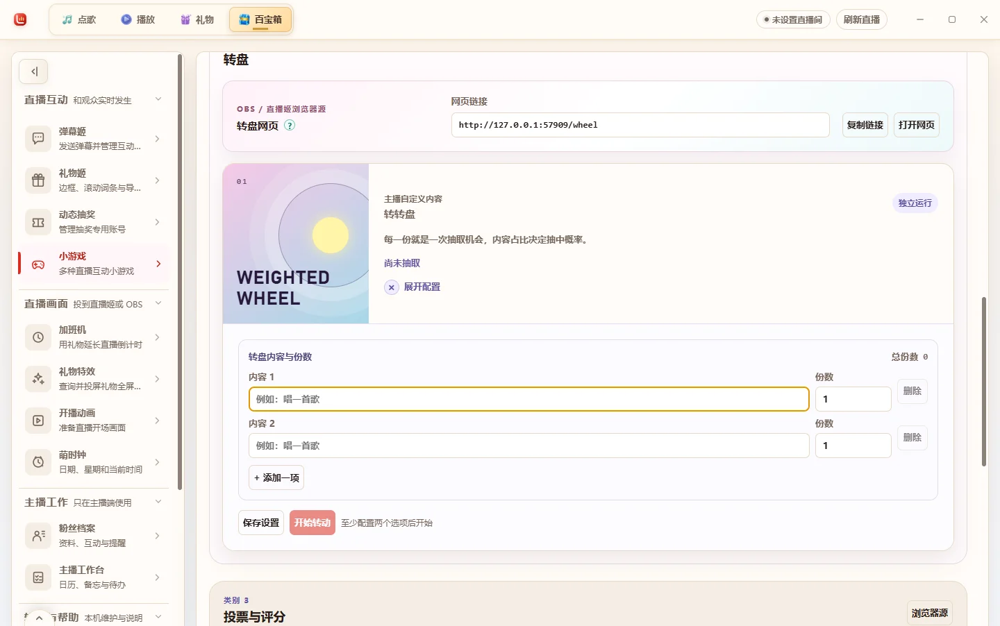

原图：[toolbox-wheel.webp](images/usage-guide/E/toolbox-wheel.webp) · 1440×902 · 54 KB。

<a id="shot-e10f"></a>

**E10f · 你画我猜主持区、快捷键与开始入口（未开局）**

完整显示题词等待区、画板快捷键说明及开始 / 结束作画 / 公布答案 / 下一题入口。本图未开局，不充当作画中的画板截图。

**入口：客户端 → 百宝箱 → 小游戏。**

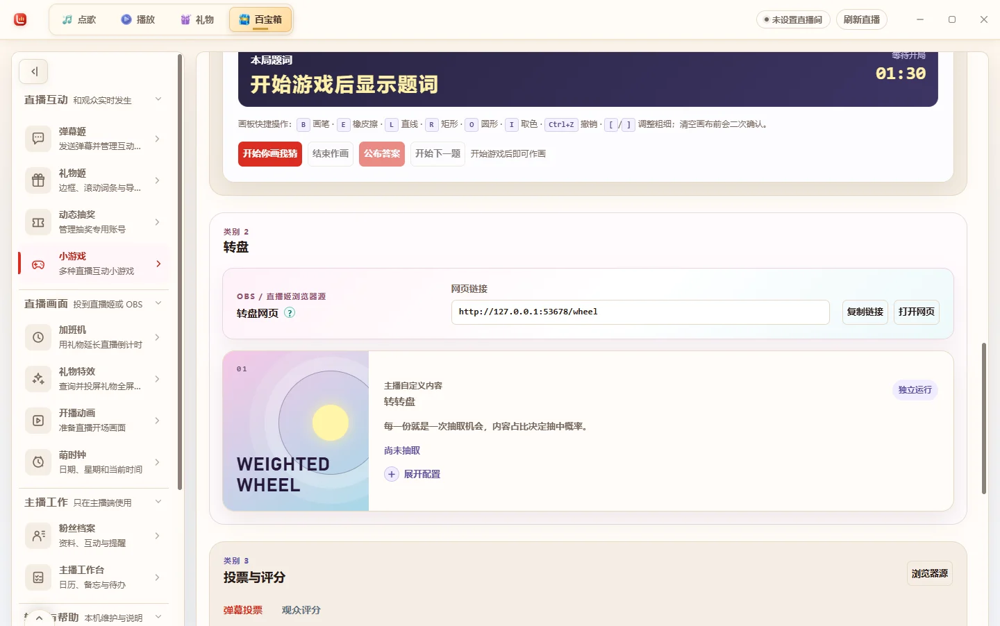

原图：[toolbox-draw-board.webp](images/usage-guide/E/toolbox-draw-board.webp) · 1440×902 · 62 KB。

<a id="shot-e11"></a>

**E11 · 加班机礼物规则编辑**

**入口：客户端 → 百宝箱 → 加班机（局部图）。**

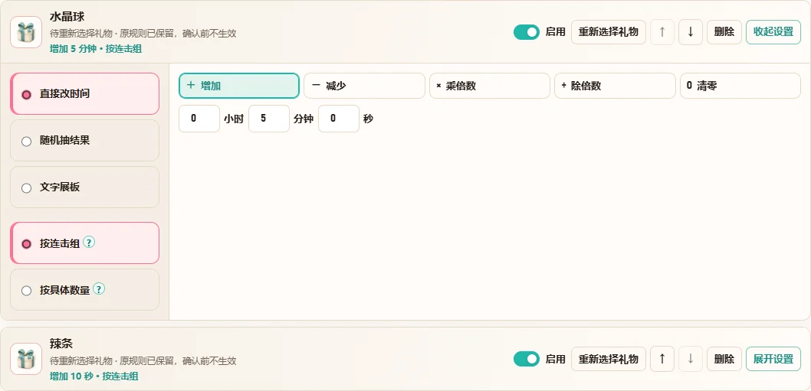

原图：[toolbox-overtime-rule.webp](images/usage-guide/E/toolbox-overtime-rule.webp) · 1058×511 · 25 KB。

<a id="shot-e11b"></a>

**E11b · 加班机初始时间、启用与开始暂停**

初始时间、启用 / 关闭、开始、暂停与重置入口。示例倒计时已结束，部分控制按钮不可用；不当作计时运行效果。

**入口：客户端 → 百宝箱 → 加班机。**

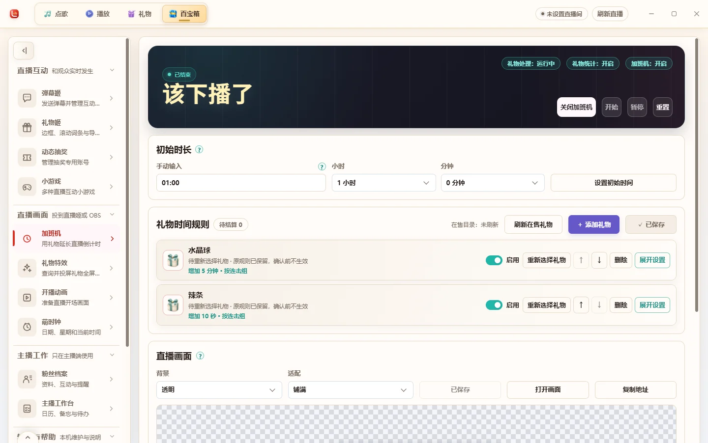

原图：[toolbox-overtime-controls.webp](images/usage-guide/E/toolbox-overtime-controls.webp) · 1440×902 · 71 KB。

<a id="shot-e11c"></a>

**E11c · 加班机最近结算与直播画面入口（暂无结算）**

最近结算区完整显示「本场还没有礼物结算」。实际礼物触发后的结算内容待运行验证。

**入口：客户端 → 百宝箱 → 加班机。**

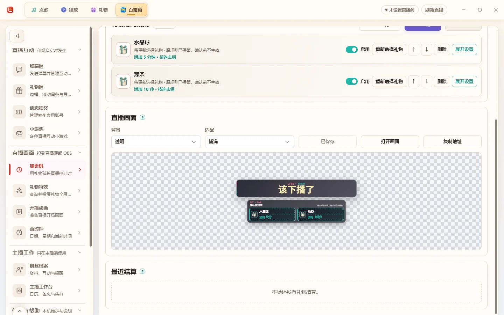

原图：[toolbox-overtime-settlements.webp](images/usage-guide/E/toolbox-overtime-settlements.webp) · 1440×902 · 81 KB。

<a id="shot-e12"></a>

**E12 · 礼物特效 ID、测试与画面链接**

**入口：客户端 → 百宝箱 → 礼物特效。**

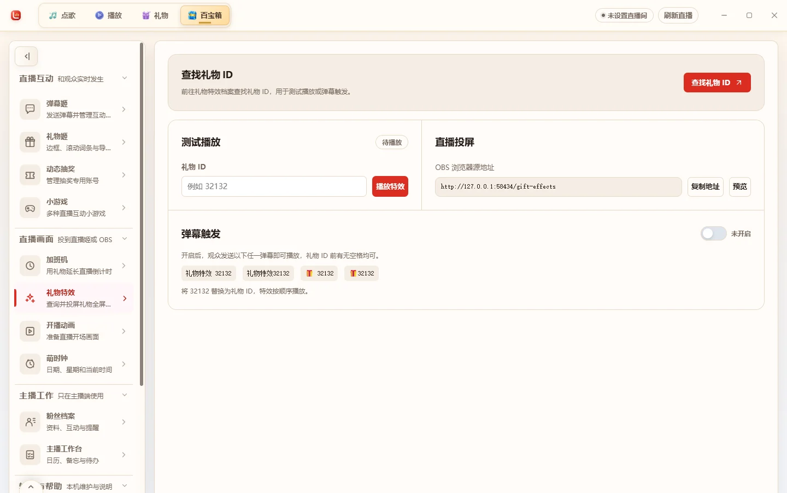

原图：[toolbox-gift-effects.webp](images/usage-guide/E/toolbox-gift-effects.webp) · 1440×902 · 47 KB。

<a id="shot-e13"></a>

**E13 · 主播工作台日历、备忘与待办**

展示工作台的日历、备忘和待办空状态；新建日程表单见下一张。

**入口：客户端 → 百宝箱 → 主播工作台。**

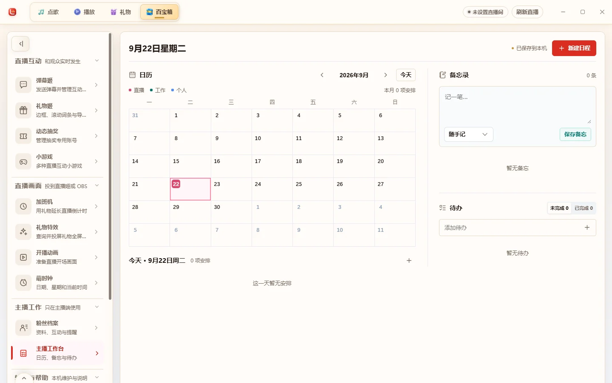

原图：[toolbox-planner.webp](images/usage-guide/E/toolbox-planner.webp) · 1440×902 · 46 KB。

<a id="shot-e13b"></a>

**E13b · 新建日程的日期、时间与分类**

**入口：客户端 → 百宝箱 → 主播工作台（局部图）。**

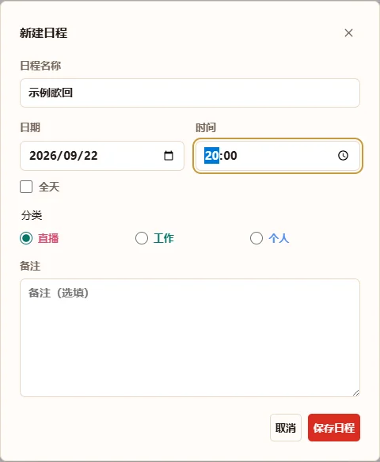

原图：[toolbox-planner-event.webp](images/usage-guide/E/toolbox-planner-event.webp) · 480×584 · 10 KB。

<a id="shot-e14"></a>

**E14 · 检查更新、自动更新与目录入口（演示状态）**

当前版本与更新状态来自演示响应，不证明线上已有此版本。

**入口：客户端 → 百宝箱 → 桌面更新。**

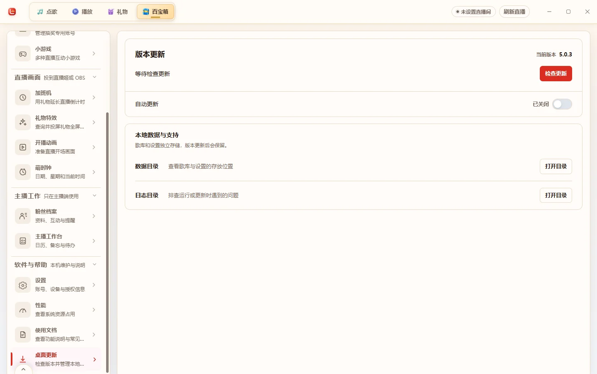

原图：[toolbox-desktop-update.webp](images/usage-guide/E/toolbox-desktop-update.webp) · 1440×902 · 43 KB。

<a id="shot-e14b"></a>

**E14b · 发现新版本与下载按钮（演示状态）**

状态文字与「下载更新」按钮一致；演示可下载状态，没有下载真实更新。

**入口：客户端 → 百宝箱 → 桌面更新。**

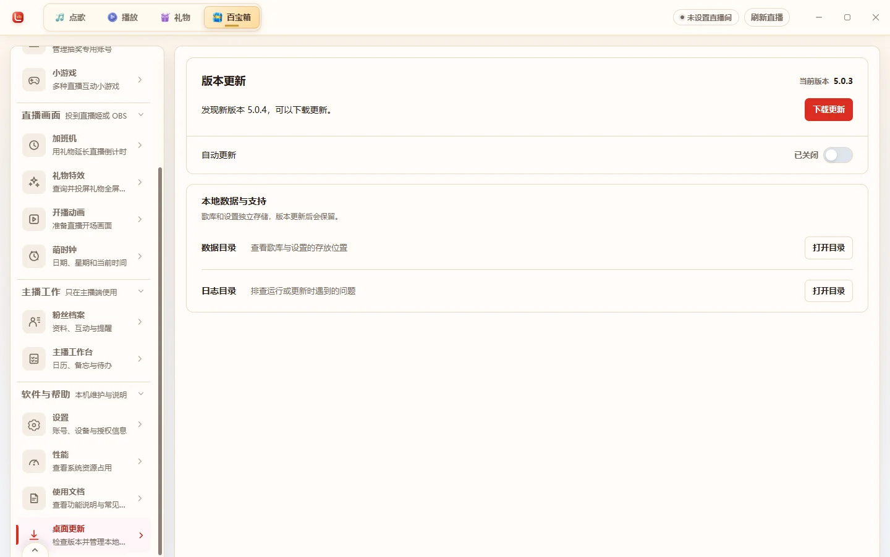

原图：[toolbox-update-download.webp](images/usage-guide/E/toolbox-update-download.webp) · 1440×902 · 44 KB。

<a id="shot-e14c"></a>

**E14c · 重启并更新（演示状态）**

状态文字与「重启并更新」按钮一致；演示下载完成状态，没有安装真实更新。

**入口：客户端 → 百宝箱 → 桌面更新。**

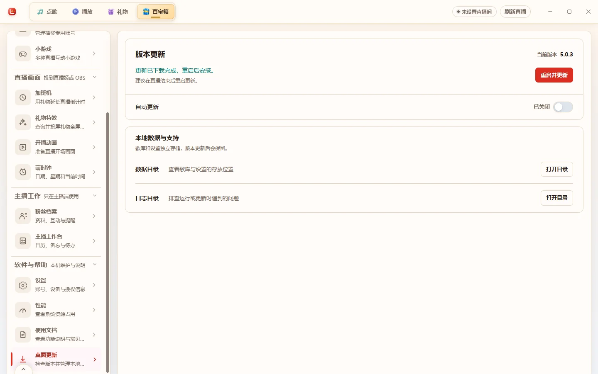

原图：[toolbox-update-ready.webp](images/usage-guide/E/toolbox-update-ready.webp) · 1440×902 · 44 KB。

<a id="shot-e15"></a>

**E15 · 礼物边框金额、动效与预览**

**入口：客户端 → 百宝箱 → 礼物姬 → 礼物边框。**

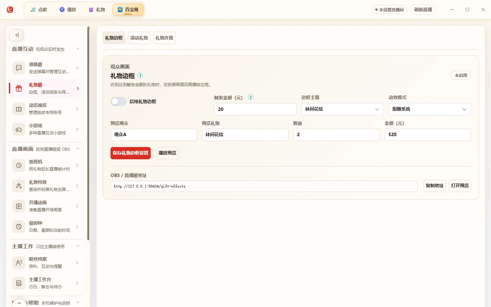

原图：[gift-frame-settings.webp](images/usage-guide/E/gift-frame-settings.webp) · 1440×902 · 47 KB。

<a id="shot-e16"></a>

**E16 · 滚动礼物分色、行数与滚动速率**

**入口：客户端 → 百宝箱 → 礼物姬 → 滚动礼物。**

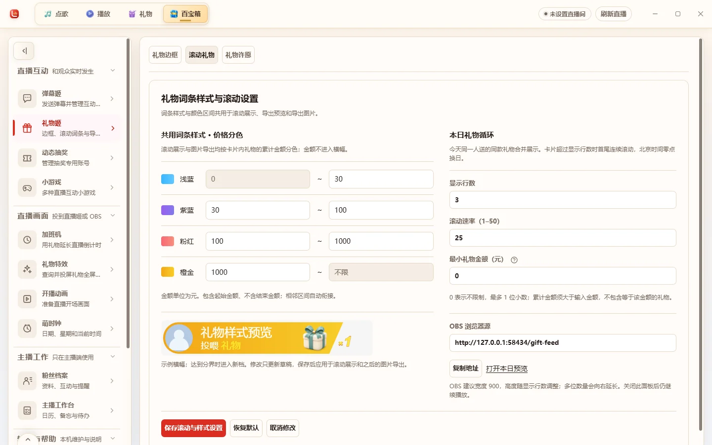

原图：[gift-feed-settings.webp](images/usage-guide/E/gift-feed-settings.webp) · 1440×902 · 72 KB。

<a id="shot-e17"></a>

**E17 · 萌时钟六种风格与预览**

**入口：客户端 → 百宝箱 → 萌时钟。**

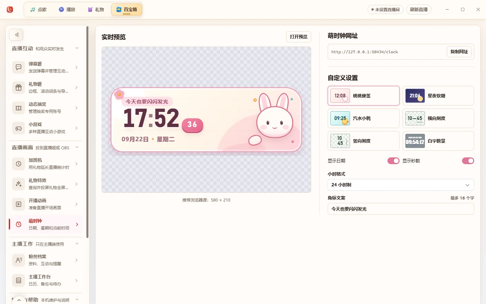

原图：[toolbox-clock.webp](images/usage-guide/E/toolbox-clock.webp) · 1440×902 · 68 KB。

<a id="shot-e18"></a>

**E18 · 开播动画文案、画质与素材**

**入口：客户端 → 百宝箱 → 开播动画。**

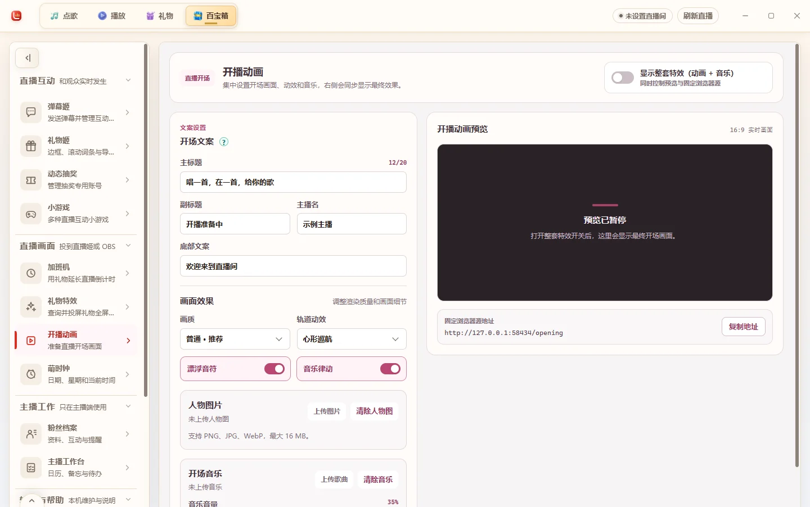

原图：[toolbox-opening.webp](images/usage-guide/E/toolbox-opening.webp) · 1440×902 · 64 KB。

<a id="shot-e18b"></a>

**E18b · 开播动画人物、音乐、音量与地址**

下半部拍全人物图片、开场音乐上传 / 清除、音乐音量与固定地址。总开关关闭，右侧预览暂停，不作为动画运行效果。

**入口：客户端 → 百宝箱 → 开播动画。**

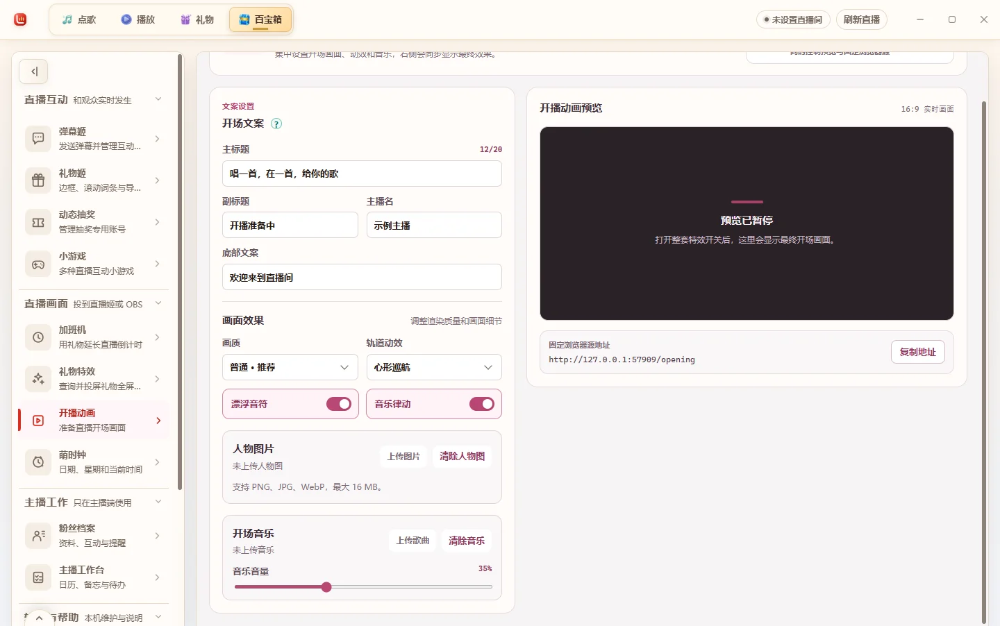

原图：[toolbox-opening-audio.webp](images/usage-guide/E/toolbox-opening-audio.webp) · 1440×902 · 60 KB。

<a id="shot-e19"></a>

**E19 · 粉丝档案入口与筛选**

档案均为观众 A/B/C 的合成示例。

**入口：客户端 → 百宝箱 → 粉丝档案。**

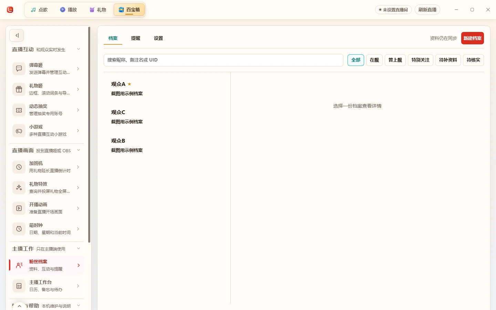

原图：[toolbox-fan-profiles.webp](images/usage-guide/E/toolbox-fan-profiles.webp) · 1440×902 · 39 KB。

<a id="shot-e19b"></a>

**E19b · 粉丝档案设置：同步与备份**

保留粉丝档案与「设置」页签，完整展示同步与更新、导出与备份；档案管理接 E19d。未执行真实备份或恢复。

**入口：客户端 → 百宝箱 → 粉丝档案。**

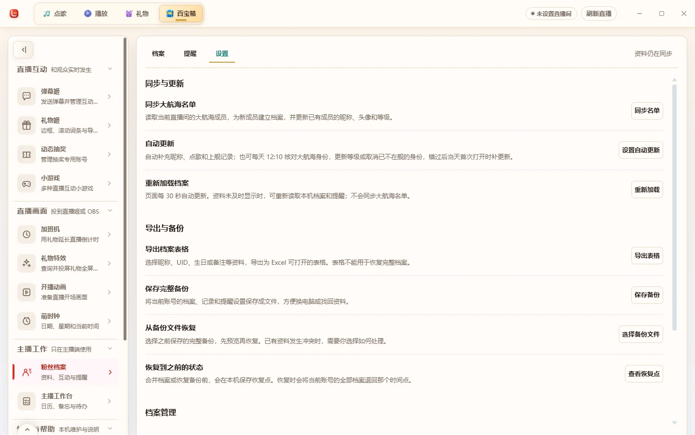

原图：[fan-profiles-settings.webp](images/usage-guide/E/fan-profiles-settings.webp) · 1440×902 · 70 KB。

<a id="shot-e19c"></a>

**E19c · 新建粉丝档案：基本信息上半部**

基本信息上半部；标签和特别关注请接 E19i，生日与备注分别见 E19e / E19f。

**入口：客户端 → 百宝箱 → 粉丝档案。**

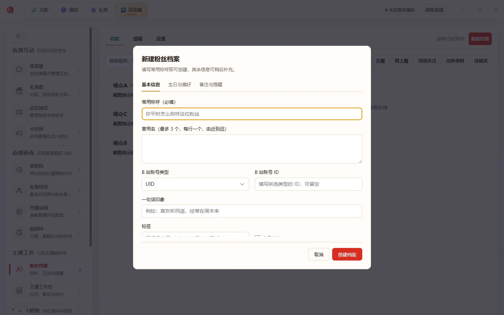

原图：[fan-profiles-create.webp](images/usage-guide/E/fan-profiles-create.webp) · 1440×902 · 39 KB。

<a id="shot-e19d"></a>

**E19d · 粉丝档案设置：档案管理**

**入口：客户端 → 百宝箱 → 粉丝档案。**

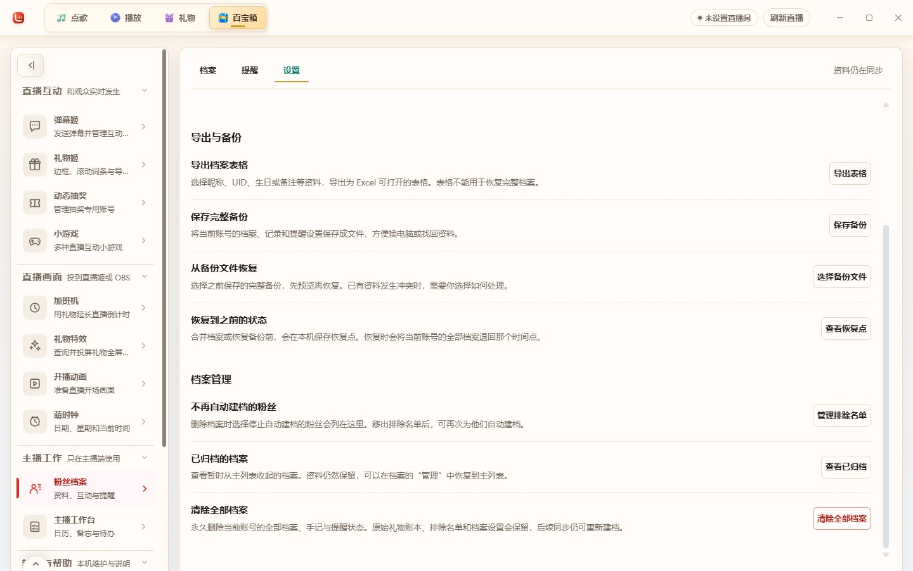

原图：[fan-profiles-management.webp](images/usage-guide/E/fan-profiles-management.webp) · 1440×902 · 70 KB。

<a id="shot-e19e"></a>

**E19e · 新建粉丝档案：生日与偏好**

表单原标签为「生日与偏好」；本图显示生日历法、生日、出生年份、提前提醒、星座与 MBTI。

**入口：客户端 → 百宝箱 → 粉丝档案。**

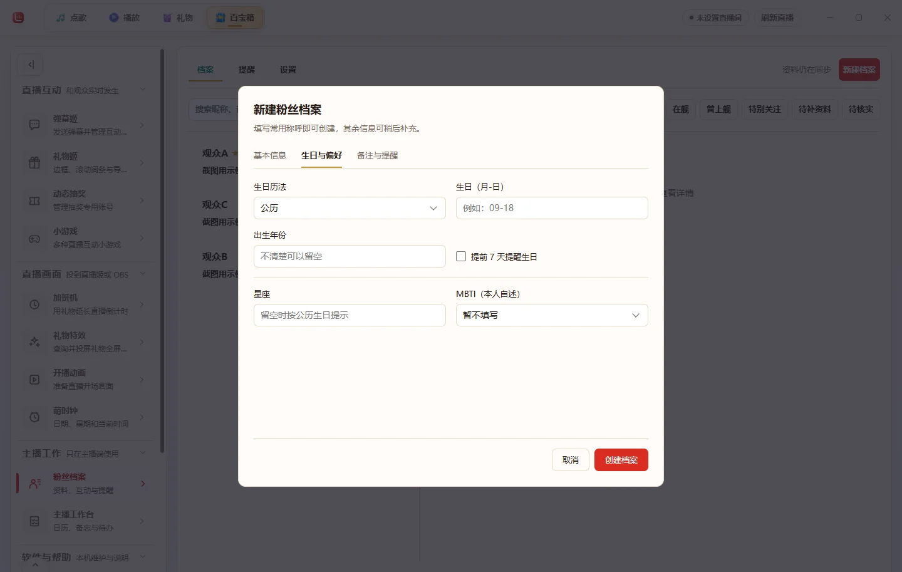

原图：[fan-profiles-personal.webp](images/usage-guide/E/fan-profiles-personal.webp) · 1440×913 · 37 KB。

<a id="shot-e19f"></a>

**E19f · 新建粉丝档案：记录与提醒**

表单的「备注与提醒」标签，显示下次想聊什么、个人备注和大航海提醒选项。

**入口：客户端 → 百宝箱 → 粉丝档案。**

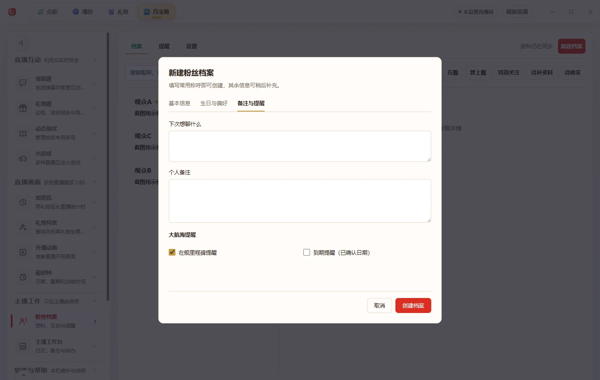

原图：[fan-profiles-notes.webp](images/usage-guide/E/fan-profiles-notes.webp) · 1440×913 · 34 KB。

<a id="shot-e19g"></a>

**E19g · 选中粉丝后的档案详情**

选中观众 A 后显示实际详情组件；数据为合成档案，平台身份尚未关联。

**入口：客户端 → 百宝箱 → 粉丝档案。**

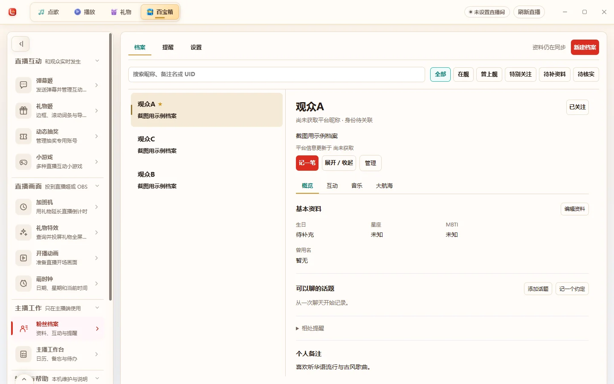

原图：[fan-profiles-detail.webp](images/usage-guide/E/fan-profiles-detail.webp) · 1440×902 · 57 KB。

<a id="shot-e19h"></a>

**E19h · 粉丝档案提醒页（暂无提醒）**

提醒页的真实空态，用来说明入口；还不能代替有生日、约定或到期提醒的操作结果图。

**入口：客户端 → 百宝箱 → 粉丝档案。**

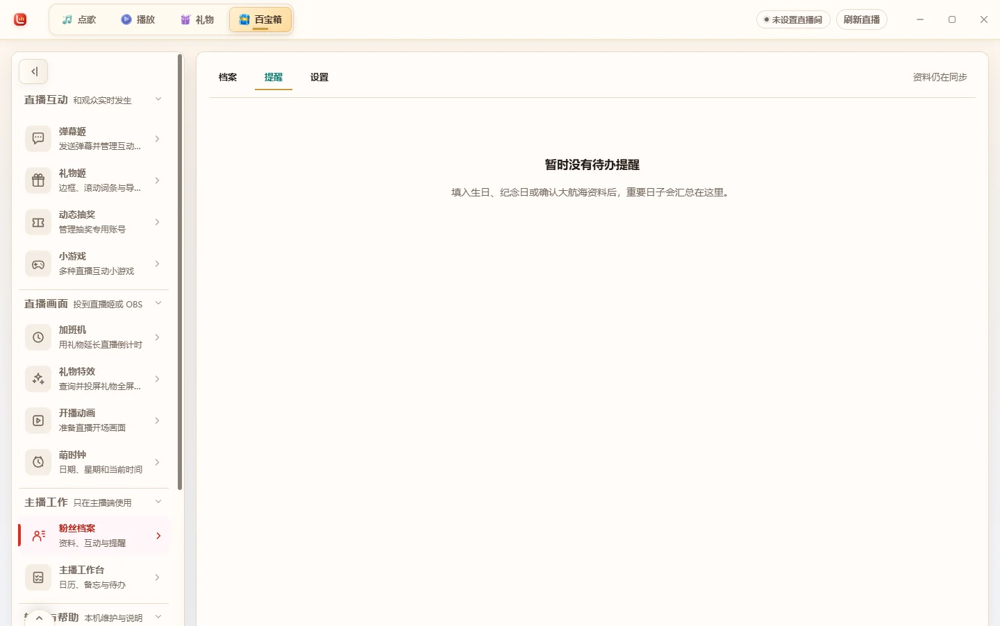

原图：[fan-profiles-reminders.webp](images/usage-guide/E/fan-profiles-reminders.webp) · 1440×902 · 33 KB。

<a id="shot-e19i"></a>

**E19i · 新建粉丝档案：标签与特别关注**

滚动表单内部后，标签与特别关注完整显示；保留新建粉丝档案标题和基本信息页签。

**入口：客户端 → 百宝箱 → 粉丝档案。**

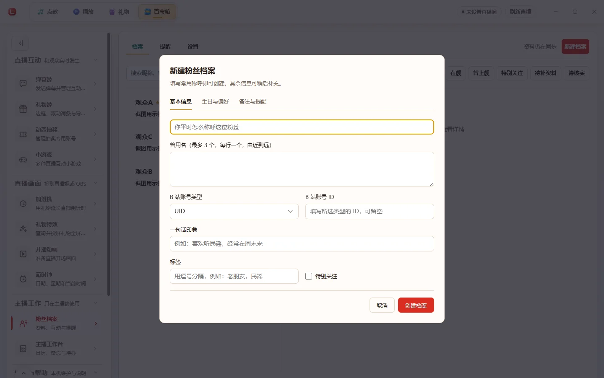

原图：[fan-profiles-basic-tags.webp](images/usage-guide/E/fan-profiles-basic-tags.webp) · 1440×902 · 40 KB。

<a id="shot-e20"></a>

**E20 · 账户与网站设置（示例账号）**

**入口：客户端 → 百宝箱 → 设置。**

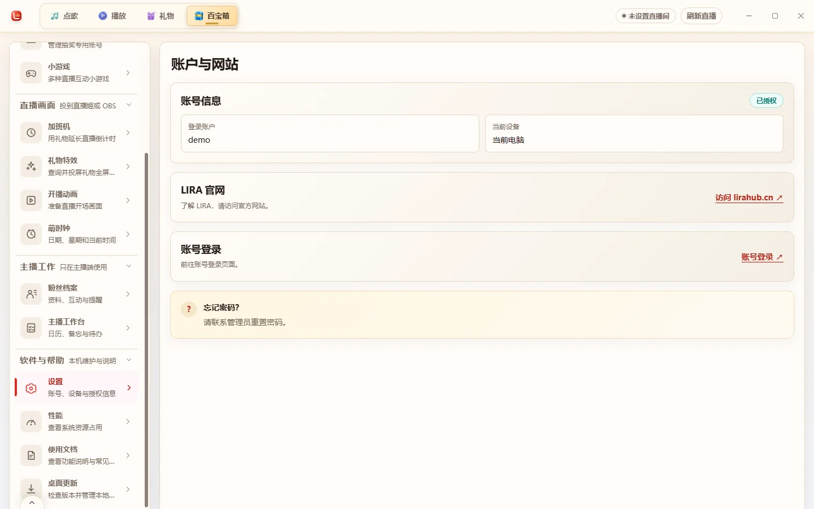

原图：[toolbox-settings.webp](images/usage-guide/E/toolbox-settings.webp) · 1440×902 · 42 KB。

<a id="shot-e21"></a>

**E21 · 性能页与本机硬件入口**

截图测试进程的资源与硬件状态不用于性能结论。

**入口：客户端 → 百宝箱 → 性能。**

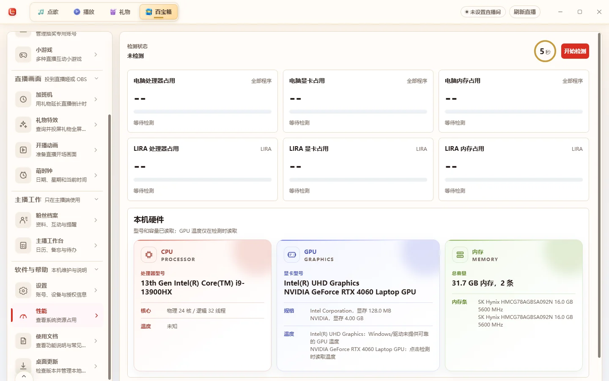

原图：[toolbox-performance.webp](images/usage-guide/E/toolbox-performance.webp) · 1440×902 · 70 KB。

<a id="shot-e22"></a>

**E22 · 回复与辅助：签到、抽签、欢迎与 PK**

各固定回复及辅助功能的入口。签到、抽签、欢迎和 PK 的云端开关为合成的关闭状态，不代表真实服务验证。

**入口：客户端 → 百宝箱 → 弹幕姬。**

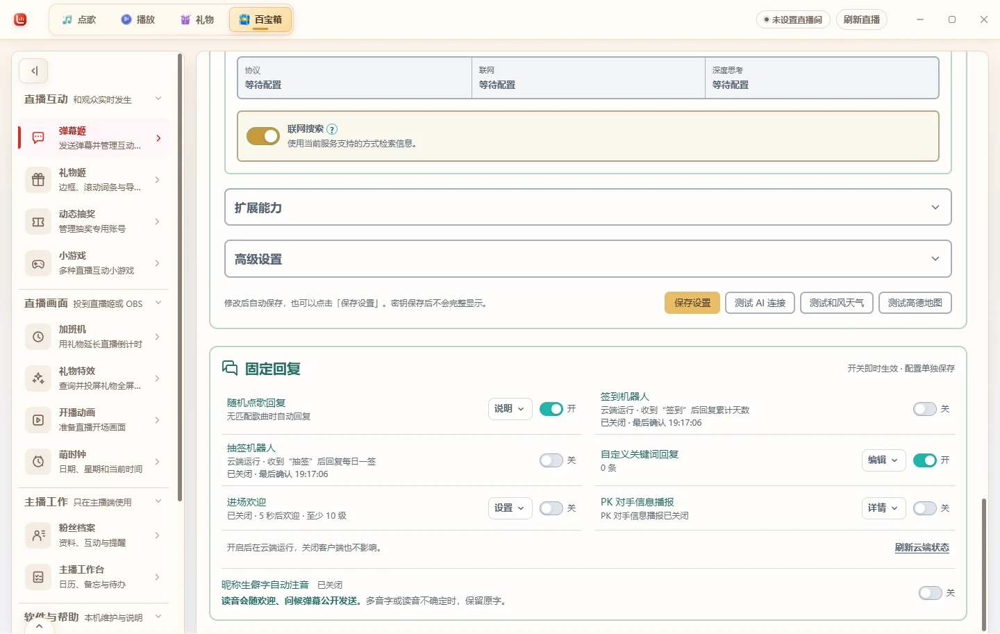

原图：[danmaku-reply-tools.webp](images/usage-guide/E/danmaku-reply-tools.webp) · 1440×913 · 68 KB。

<a id="shot-e22b"></a>

**E22b · 自定义关键词与回复编辑**

展开关键词编辑后，关键词、回复内容、添加与保存入口均可见；未实际发送消息。

**入口：客户端 → 百宝箱 → 弹幕姬。**

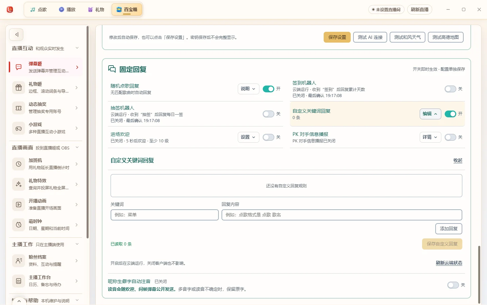

原图：[danmaku-custom-reply.webp](images/usage-guide/E/danmaku-custom-reply.webp) · 1440×902 · 69 KB。

<a id="shot-e22c"></a>

**E22c · 进场欢迎参数与词库入口（演示草稿）**

展示进场欢迎参数编辑草稿、词库入口及保存按钮；欢迎处于关闭状态，未保存到真实服务器。说明中的「0 秒立即处理、0 级不限」是在解释特殊取值。

**入口：客户端 → 百宝箱 → 弹幕姬。**

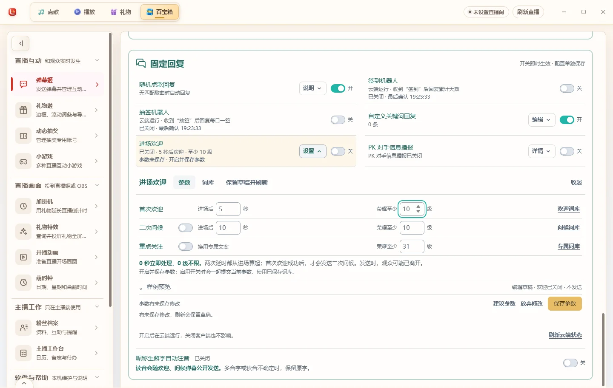

原图：[danmaku-welcome-settings.webp](images/usage-guide/E/danmaku-welcome-settings.webp) · 1440×913 · 79 KB。

<a id="shot-e22d"></a>

**E22d · PK 对手信息播报说明**

展开 PK 播报的功能说明；当前关闭，未向直播间发送弹幕。

**入口：客户端 → 百宝箱 → 弹幕姬。**

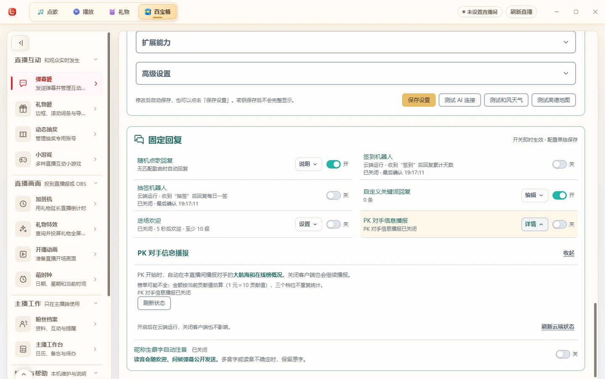

原图：[danmaku-pk-settings.webp](images/usage-guide/E/danmaku-pk-settings.webp) · 1440×902 · 72 KB。

<a id="gallery-f"></a>

#### F 组 · 给观众看的画面

<a id="shot-f1"></a>

**F1 · 观众网页歌单在手机上的样子**

本地运行服务器仓库的真实前端，使用示例歌库，按 390×844 手机视口拍摄。

**入口：观众网页歌单 → 手机视图。**

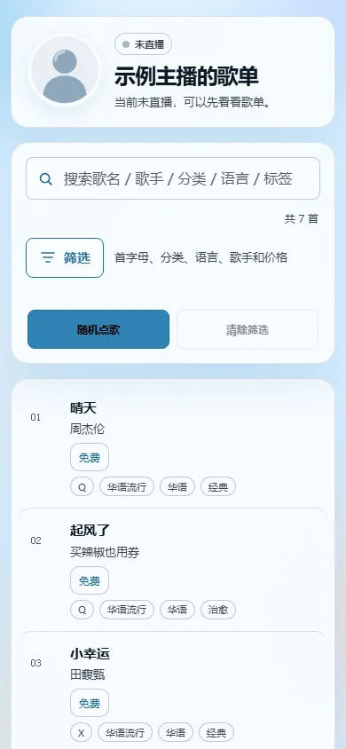

原图：[public-song-page.webp](images/usage-guide/F/public-song-page.webp) · 390×844 · 21 KB。

<a id="shot-f2"></a>

**F2 · 主播中心网页歌单分享链接与二维码**

二维码位于主播中心；二维码与分享链接指向 demo.example.test，仅作示意。

**入口：网页主播中心 → 网页歌单 → 分享（局部图）。**

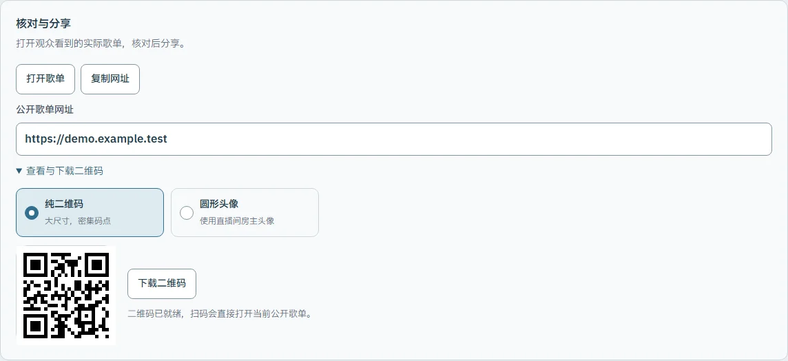

原图：[public-song-page-qr.webp](images/usage-guide/F/public-song-page-qr.webp) · 1144×524 · 21 KB。

<a id="shot-f2a"></a>

**F2a · 客户端查看网页歌单入口**

网页歌曲数量使用合成的 7 首，读数完整；二维码位于网页主播中心，见 F2。

**入口：客户端 → 点歌 → 导入导出 → 网页歌单同步（局部图）。**

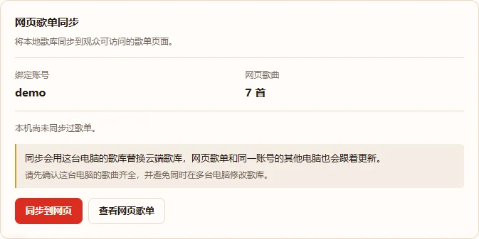

原图：[client-song-page-link.webp](images/usage-guide/F/client-song-page-link.webp) · 673×337 · 17 KB。

<a id="shot-f2b"></a>

**F2b · 覆盖同步确认后的反馈（接口演示）**

实际点击「同步到网页」并确认覆盖后，由隔离接口返回完成响应，界面显示本机同步时间及数量。只验证反馈呈现，不表示线上歌单已同步。

**入口：客户端 → 点歌 → 导入导出 → 网页歌单同步。**

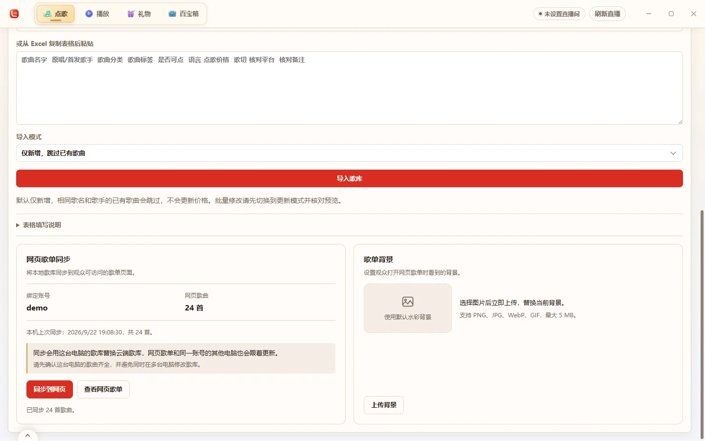

原图：[client-song-sync-result.webp](images/usage-guide/F/client-song-sync-result.webp) · 1440×902 · 50 KB。

<a id="shot-f3"></a>

**F3 · 主播中心歌单名称与背景设置**

主播中心内展开页面名称和背景设置后的操作位置。

**入口：网页主播中心 → 网页歌单 → 页面名称 / 背景 / 歌单外观。**

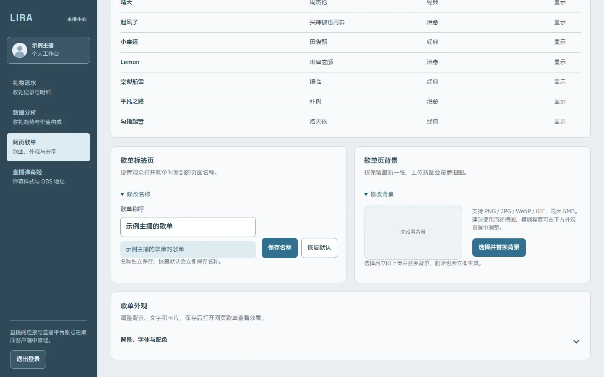

原图：[public-song-page-appearance.webp](images/usage-guide/F/public-song-page-appearance.webp) · 1440×900 · 54 KB。

<a id="shot-f3a"></a>

**F3a · 客户端当前背景与恢复默认背景（示例图片）**

使用本机可访问的示例图片作为当前背景，完整显示预览、「上传背景」和「恢复默认背景」；未操作真实账号的背景。

**入口：客户端 → 点歌 → 导入导出 → 歌单背景。**

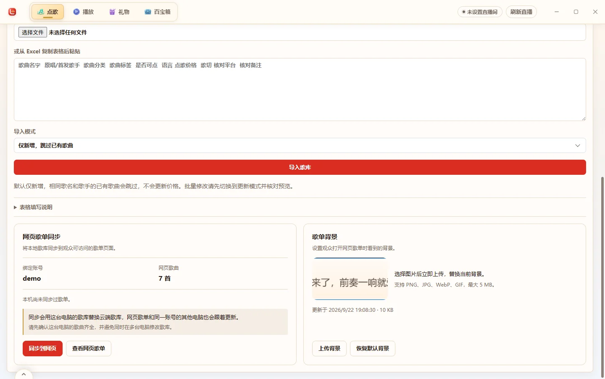

原图：[client-song-page-background.webp](images/usage-guide/F/client-song-page-background.webp) · 1440×902 · 54 KB。

<a id="shot-f3b"></a>

**F3b · 网页主播中心：展开歌单外观设置**

展开歌单外观，拍全背景、字体、卡片配色和「保存外观」。恢复默认只修改草稿，仍需保存后发布。

**入口：网页主播中心 → 网页歌单 → 页面名称 / 背景 / 歌单外观。**

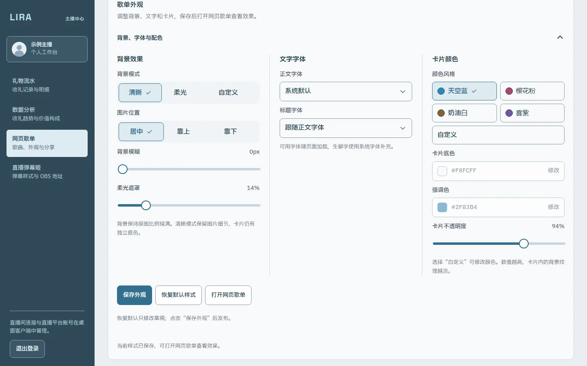

原图：[public-song-page-appearance-expanded.webp](images/usage-guide/F/public-song-page-appearance-expanded.webp) · 1440×900 · 56 KB。

<a id="shot-f4"></a>

**F4 · 盲盒盈亏榜投屏画面（示例记录）**

本机浏览器源中的盲盒榜，金额和排行来自隔离示例记录。

**入口：本机投屏 → 盲盒盈亏榜。**

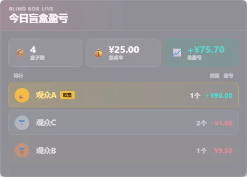

原图：[public-overlay-blindbox.webp](images/usage-guide/F/public-overlay-blindbox.webp) · 420×302 · 7 KB。

<a id="shot-f5"></a>

**F5 · 弹幕姬深色面板投屏（内置样式预览）**

产品内置的静态样式预览，包含身份、文字、表情和礼物通知；不是实际直播弹幕。

**入口：弹幕姬 → 产品内置样式预览。**


原图：[public-overlay-danmaku.webp](images/usage-guide/F/public-overlay-danmaku.webp) · 900×700 · 60 KB。

<a id="shot-f6"></a>

**F6 · 礼物许愿投屏：礼物卡片与纯文字（示例进度）**

合成的两条卡片许愿与一条纯文字许愿；礼物图片使用兜底图标。

**入口：本机投屏 → 礼物许愿。**

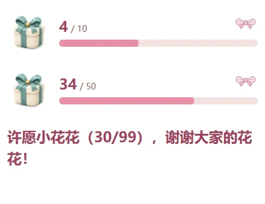

原图：[gift-wishes-overlay.webp](images/usage-guide/F/gift-wishes-overlay.webp) · 440×340 · 10 KB。

<a id="shot-f7"></a>

**F7 · 点歌板实际输出（隔离示例队列）**

隔离本机 /queue 实际输出，展示一款点歌板风格的示例队列；不是客户端设置页，也不是 OBS 操作截图。

**入口：本机投屏 → 点歌板 /queue。**

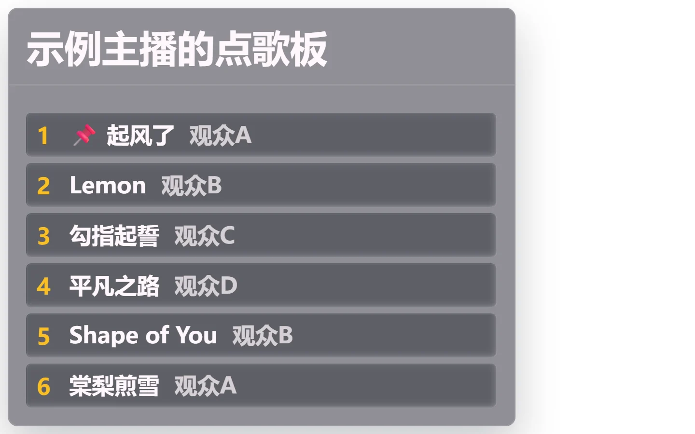

原图：[public-overlay-queue.webp](images/usage-guide/F/public-overlay-queue.webp) · 1440×900 · 32 KB。

<a id="shot-f8"></a>

**F8 · 歌曲展示板实际输出（隔离示例歌库）**

隔离本机 /songlist 实际输出，展示部分正在滚动的歌库。示例启用同步点歌板主题，标题沿用示例点歌板名称；不是点歌队列。

**入口：本机投屏 → 歌曲展示板 /songlist。**

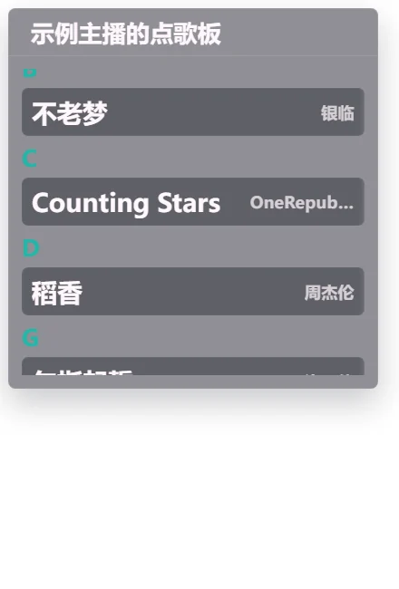

原图：[public-overlay-songs.webp](images/usage-guide/F/public-overlay-songs.webp) · 440×650 · 9 KB。

<a id="gallery-s"></a>

#### S 组 · 网页端与维护者后台

<a id="shot-s1"></a>

**S1 · 网页端账号登录与重置码入口**

本地服务器前端的登录表单，未访问线上站点或使用真实账号。

**入口：网页统一登录。**

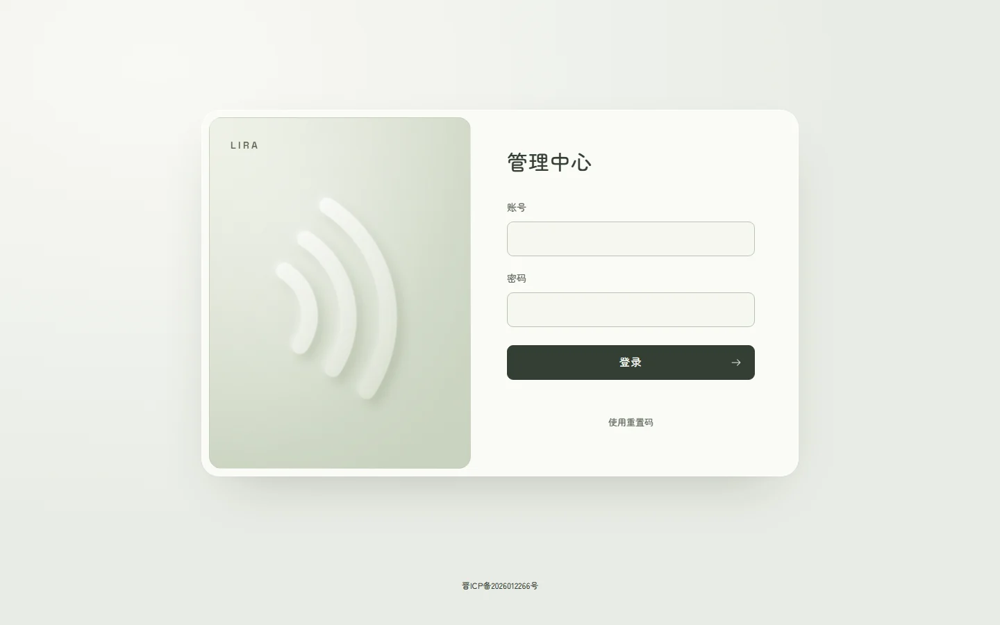

原图：[server-manage-login.webp](images/usage-guide/S/server-manage-login.webp) · 1440×900 · 11 KB。

<a id="shot-s1b"></a>

**S1b · 网页端使用重置码重置密码**

忘记密码时先联系管理员取得重置码，再从登录页点击「使用重置码」进入本表单；本图没有使用真实重置码。

**入口：网页统一登录 → 使用重置码。**

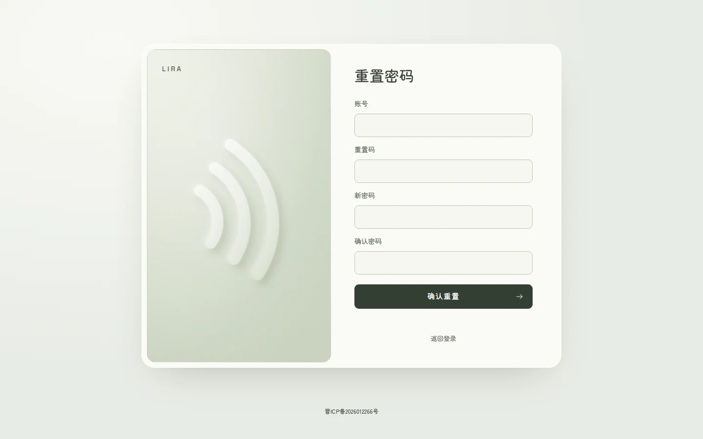

原图：[server-password-reset.webp](images/usage-guide/S/server-password-reset.webp) · 1440×900 · 13 KB。

<a id="shot-s2"></a>

**S2 · 主播中心四个分区与导航**

**入口：网页主播中心 → 左侧导航。**

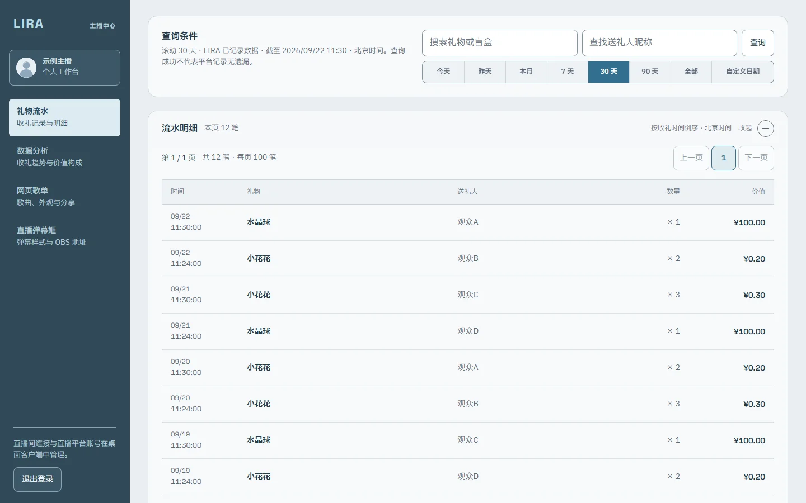

原图：[server-manage-overview.webp](images/usage-guide/S/server-manage-overview.webp) · 1440×900 · 49 KB。

<a id="shot-s3"></a>

**S3 · 网页端礼物流水、筛选与分页**

**入口：网页主播中心 → 礼物流水（局部图）。**

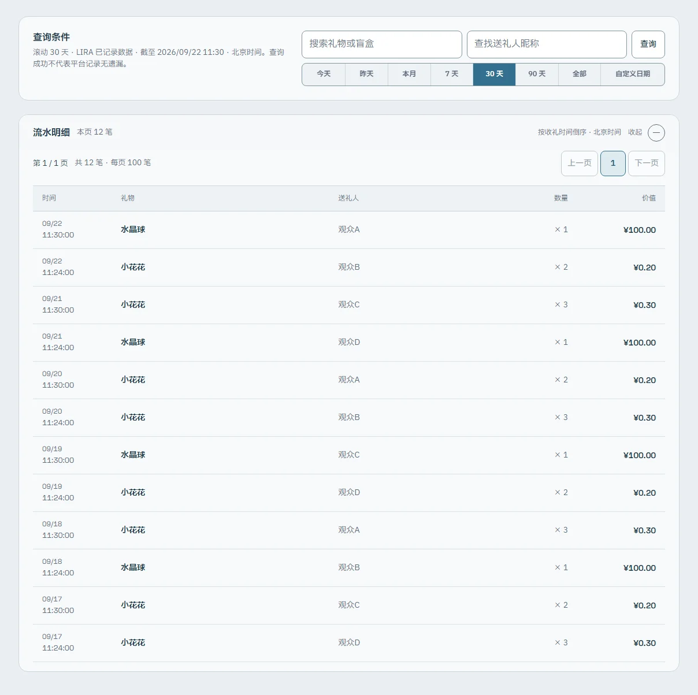

原图：[server-manage-gift-ledger.webp](images/usage-guide/S/server-manage-gift-ledger.webp) · 1208×1203 · 46 KB。

<a id="shot-s4"></a>

**S4 · 网页端礼物趋势与收礼概览（示例数据）**

金额与趋势由同一套示例流水计算，按北京时间分日汇总。

**入口：网页主播中心 → 数据分析。**

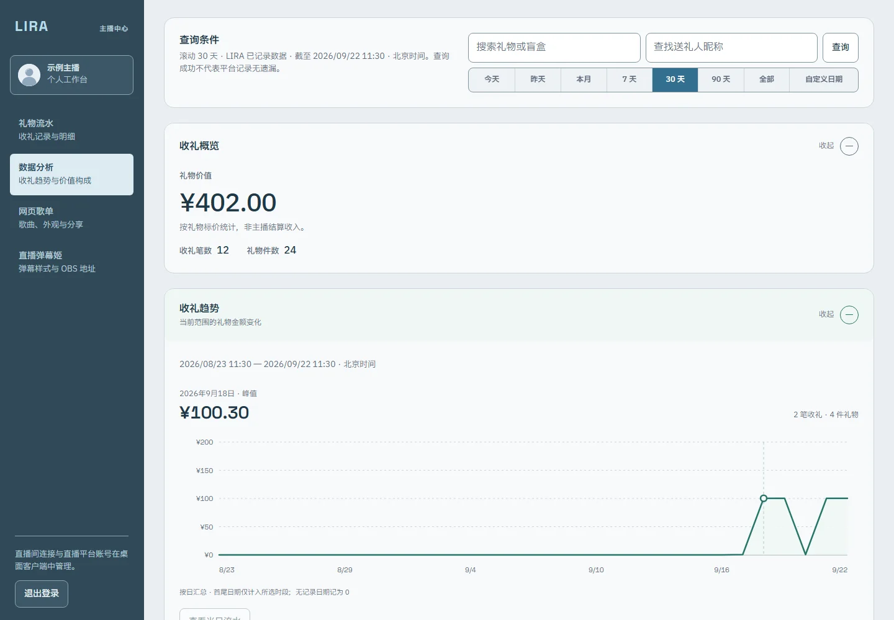

原图：[server-manage-analytics.webp](images/usage-guide/S/server-manage-analytics.webp) · 1440×1000 · 50 KB。

<a id="shot-s4b"></a>

**S4b · 网页端礼物价值构成（示例数据）**

展开“礼物构成”后的示例；本组数据只包含普通礼物。

**入口：网页主播中心 → 数据分析（局部图）。**

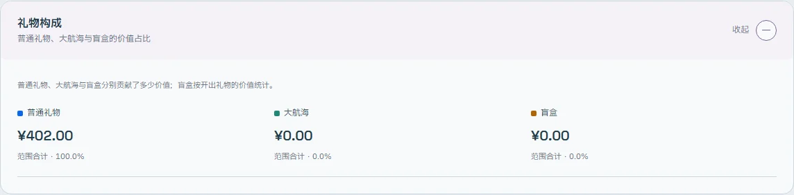

原图：[server-manage-gift-composition.webp](images/usage-guide/S/server-manage-gift-composition.webp) · 1144×282 · 12 KB。

<a id="shot-s5"></a>

**S5 · 网页歌单管理上半页：歌曲列表与分享**

本图只说明歌曲列表与分享入口；名称 / 背景见 F3，精细外观见 F3b，二维码见 F2。

**入口：网页主播中心 → 网页歌单。**

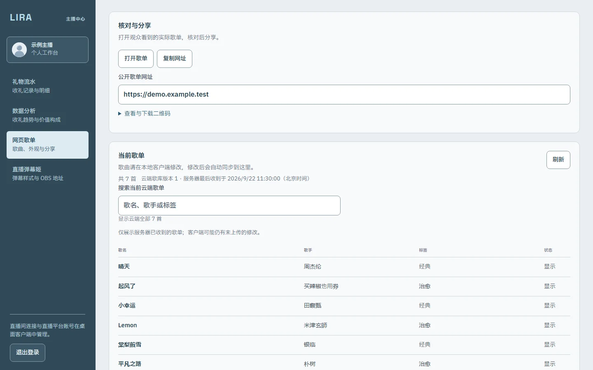

原图：[server-manage-song-page.webp](images/usage-guide/S/server-manage-song-page.webp) · 1440×900 · 47 KB。

<a id="shot-s6"></a>

**S6 · 网页主播中心：弹幕姬样式**

样式选择与保存入口；完整 OBS 地址和复制按钮请接 S6b。

**入口：网页主播中心 → 直播弹幕姬。**

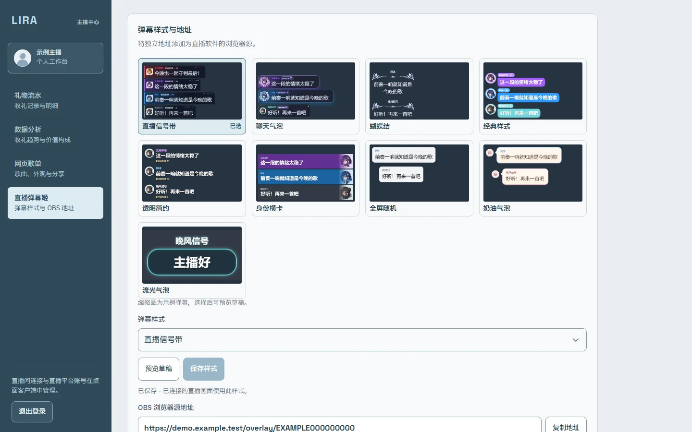

原图：[server-manage-danmaku.webp](images/usage-guide/S/server-manage-danmaku.webp) · 1440×900 · 67 KB。

<a id="shot-s6b"></a>

**S6b · 网页主播中心：OBS 地址与复制按钮**

保留左侧「直播弹幕姬」选中项，OBS 地址和「复制地址」按钮完整可见。链接为不可用的演示地址。

**入口：网页主播中心 → 直播弹幕姬。**

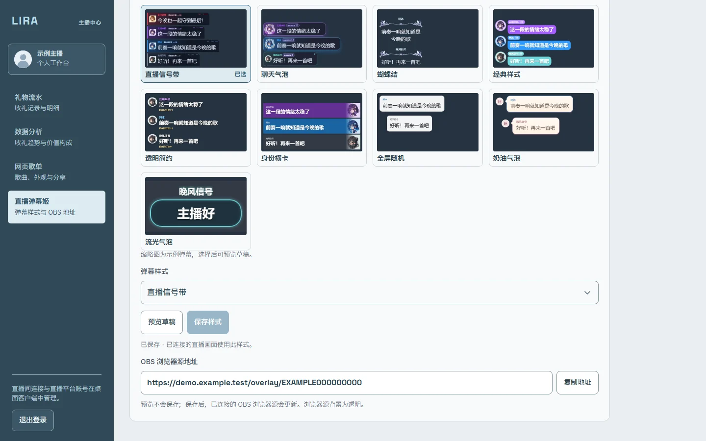

原图：[server-manage-danmaku-url.webp](images/usage-guide/S/server-manage-danmaku-url.webp) · 1440×900 · 68 KB。

<a id="shot-s7"></a>

**S7 · 管理台注册码与授权码入口（维护者示例）**

仅维护者素材：展示生成注册码前的入口，不含真实注册码。

**入口：网页管理员后台（维护者材料） → 注册码 / 短效登录码。**

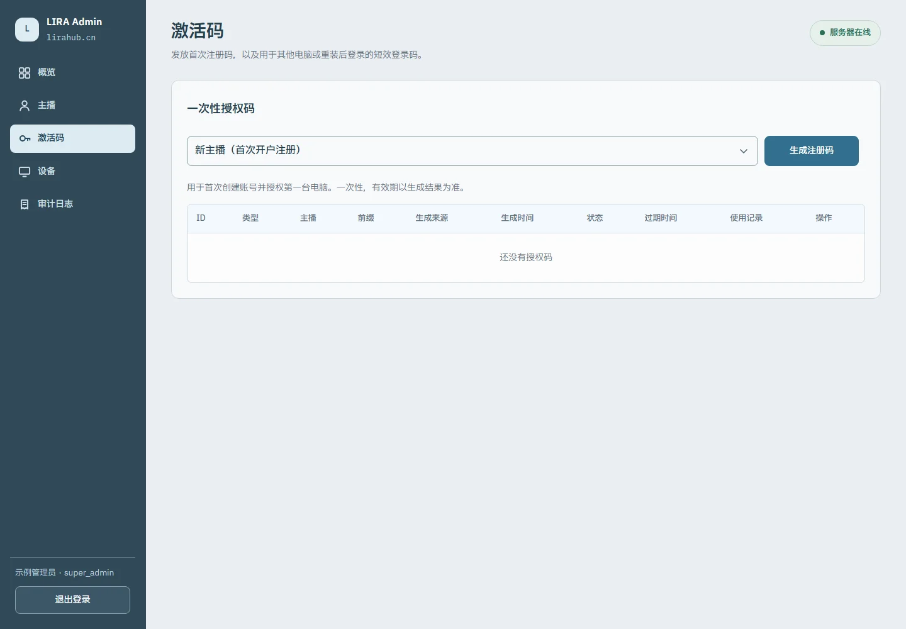

原图：[admin-registration-code.webp](images/usage-guide/S/admin-registration-code.webp) · 1440×1000 · 27 KB。

<a id="shot-s7b"></a>

**S7b · 已有主播短效登录码入口（维护者示例）**

选择已有主播后的短效登录码入口；没有生成授权码。

**入口：网页管理员后台（维护者材料） → 注册码 / 短效登录码。**

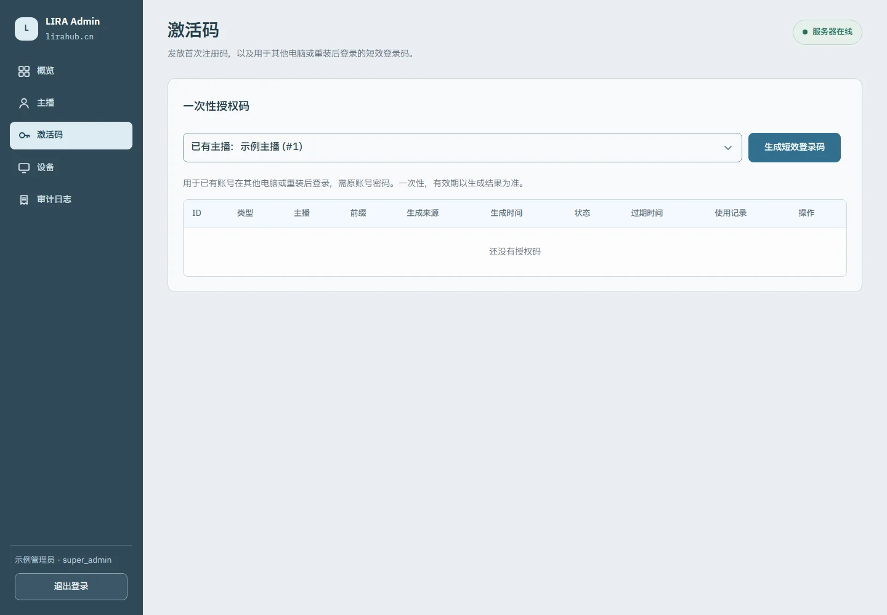

原图：[admin-short-login-code.webp](images/usage-guide/S/admin-short-login-code.webp) · 1440×1000 · 28 KB。

<a id="shot-s8"></a>

**S8 · 设备授权列表与撤销入口（维护者示例）**

仅维护者素材：示例电脑的授权状态与撤销入口；没有撤销任何设备。

**入口：网页管理员后台（维护者材料） → 设备。**

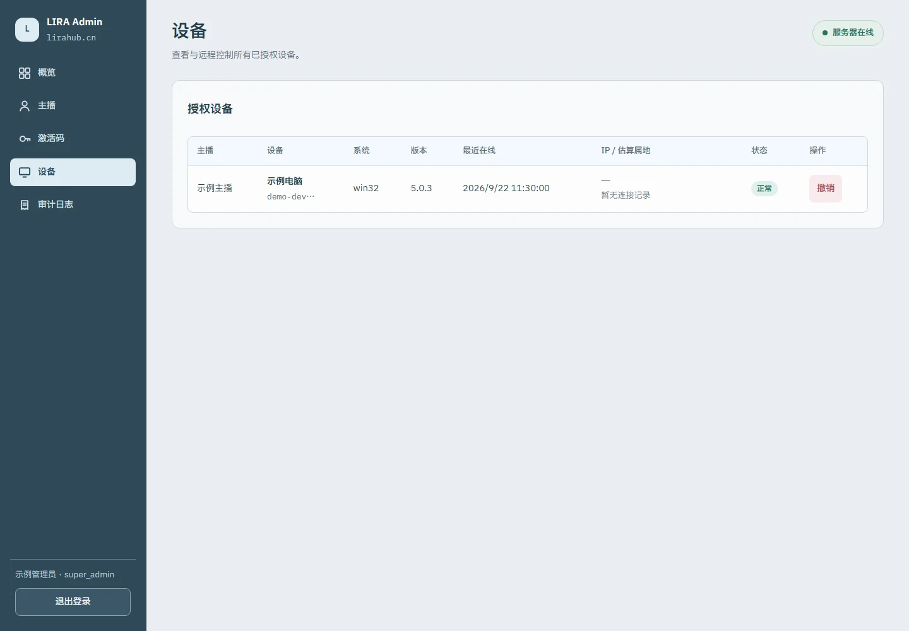

原图：[admin-device-list.webp](images/usage-guide/S/admin-device-list.webp) · 1440×1000 · 22 KB。

<a id="shot-s9"></a>

**S9 · 主播安全页与密码重置码入口（维护者示例）**

仅维护者素材：密码重置码生成入口与有效期说明；没有生成或撤销重置码。

**入口：网页管理员后台（维护者材料） → 主播 → 安全与密码重置。**

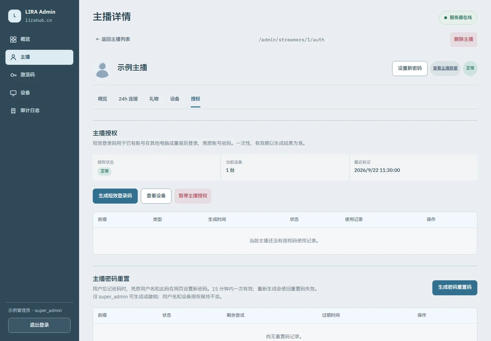

原图：[admin-reset-code.webp](images/usage-guide/S/admin-reset-code.webp) · 1440×1000 · 49 KB。

## 附录 E：复用的既有截图（10 张）

以下直接引用现有 `public/img/usage-guide/` 素材，不计入上述 124 张候选图。安装图含旧版名称和版本；第三方平台界面、余额、价格与活动信息仅表示当时截图，不作为当前界面的核实依据。API 密钥图沿用遮盖后的版本。

**R1 · 安装程序：已有用户安装提示（旧版素材）**

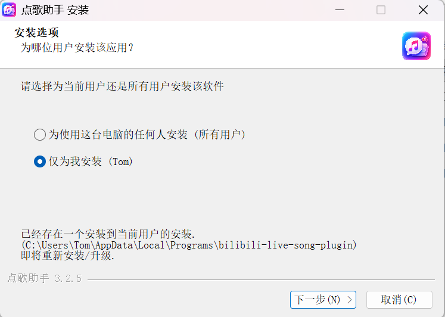

**R2 · 安装程序：保留原安装位置（旧版素材）**

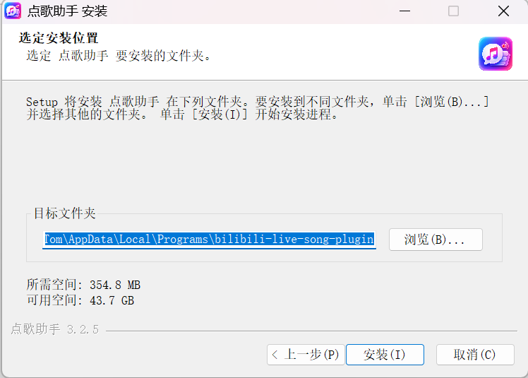

**R3 · 安装目录中的卸载程序**

本图只用于识别卸载程序的文件名，不能说明安装位置。请从自己安装 LIRA 时选择的目录查找，不把截图当作固定目录路径。


**R4 · DeepSeek 开放平台登录页面（既有素材）**

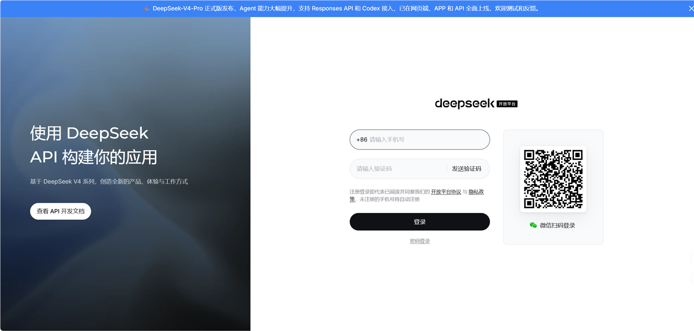

**R5 · DeepSeek 绑定邮箱提示（既有素材）**

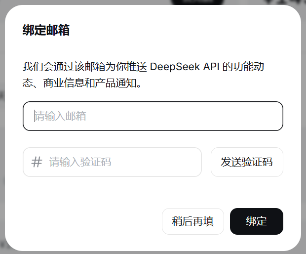

**R6 · DeepSeek API keys 管理页与创建入口**

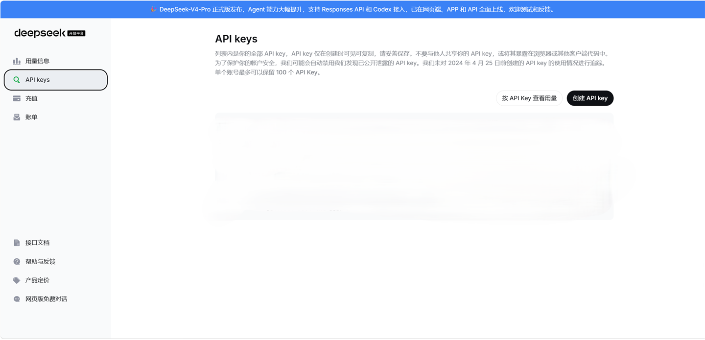

**R7 · DeepSeek 创建 API key 的命名表单**

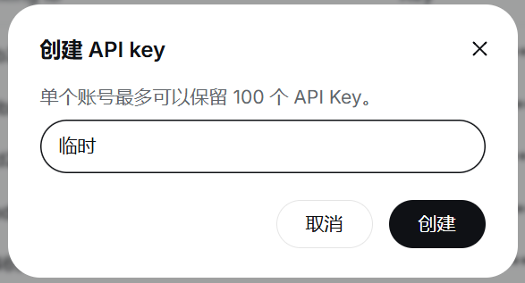

**R8 · DeepSeek 创建成功后的复制入口（密钥已遮盖）**

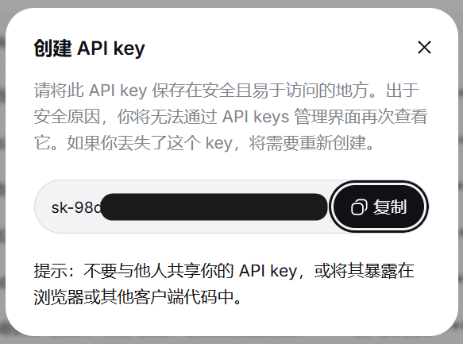

**R9 · DeepSeek 用量与余额页面（既有素材）**

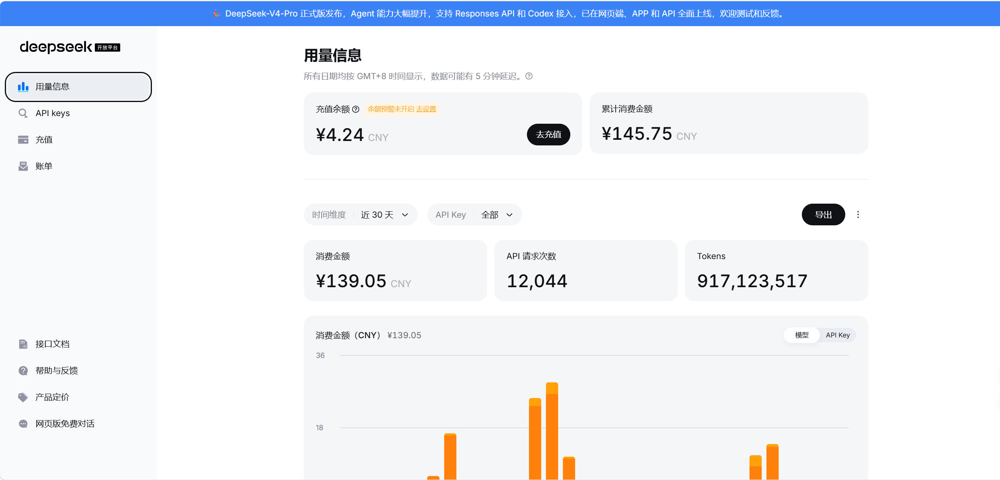

**R10 · DeepSeek 充值页面（既有素材）**

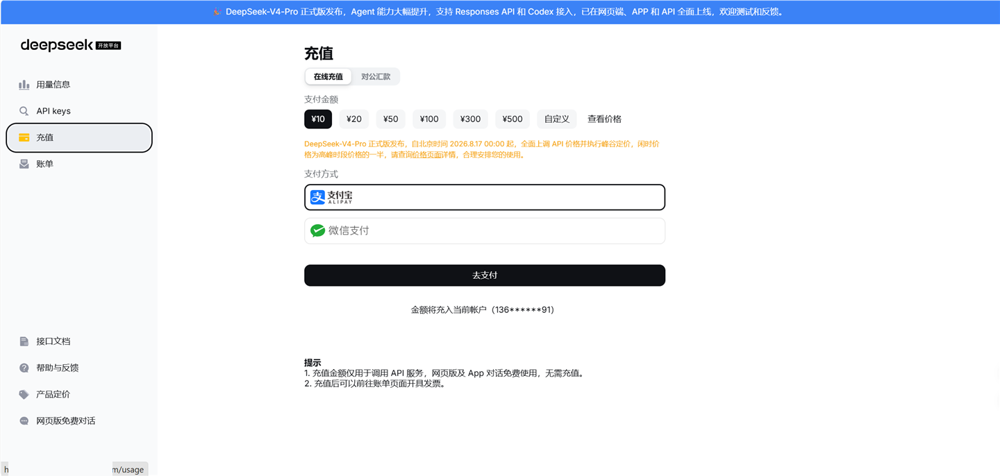
