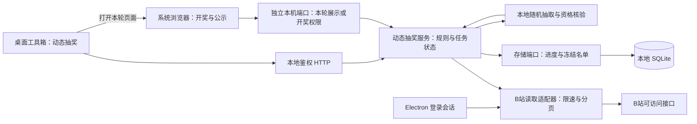

# LIRA 动态抽奖设计与实施报告

## 状态

Draft / 当前客户端流程已接入、未测试。2026-09-14 按最新用户要求，在独立登录的基础上加入活动创建、评论采集、点赞/转发交集、随机排序、按需关注核验与递补，以及百宝箱中的进度、历史和结果界面。本轮明确不运行测试或真实账号探测；适配器已允许用户主动操作，但不把接入等同于上游可用性已经验证。旧报告中的多奖项、领奖、导出和独立公示网页仍未交付。[实施计划](plans/2026-09-14-bilibili-dynamic-lottery.md)记录当前范围和未验证事项。

### 最新用户确认的简化流程（优先于下文原里程碑）

- 主评论必选，按 UID 去重并排除作者；三个附加开关为必须点赞、必须转发、必须关注作者，中奖人数为 1–100。
- 评论截止固定为点击创建采集的时刻。点赞/转发是采集时的可见名单，不还原历史时点；关注是核验时的关系。没有事件时间的互动不伪造发生时间。楼中楼、预设未来截止和多奖项不属于本轮表单。
- 本人原创文字/图文动态支持尝试评论及 reaction 分页；点赞/转发共用分页，明确识别动作，缺少完整分页或数量不一致时暂停，不使用部分名单开奖。接口只提供可见快照，不承诺删除或隐藏的记录可获取。
- BV 视频单独解析作者与视频评论区，仅支持评论与关注条件；视频点赞/分享数不是用户列表，选中这两项时明确拒绝，不静默忽略规则。
- 采集完所选来源后才建立交集；crypto.randomInt Fisher–Yates 均匀洗牌，先保存完整顺序，再依序核验。确认为非粉丝才递补；未知/失败暂停同一位置；继续、重复点击和重启不重新排序。用尽则明确显示缺额。
- 启动仅恢复历史与暂停状态，不自动调用 B站。账号、授权切换使旧操作失效；数据和结果按可信 LIRA streamerId 隔离。退出时先中止、排空后台工作，再关闭原有抽奖数据库。
- 本轮交付以代码接入和差异审阅为止，按用户要求不运行测试。不得引用旧登录测试为本轮业务流程背书。

**调研日期：** 2026-09-13 至 2026-09-14。本文区分项目源码证据、设计建议和待实测能力；第三方项目的功能说明不代表 B站对接口可用性或名单完整性的承诺。

**只读负向实测（2026-09-14）：** 运行中的 LIRA 报告登录有效，且账号与当天加密快照一致；用用户提供的一条原创文字/图文动态调用 M0 provider 时，动态详情可读，但其作者与当前登录账号不一致，因此在评论分页前按 `LOTTERY_DYNAMIC_OWNER_MISMATCH` 拒绝。该结果只验证了本人动态边界的负向路径，不构成评论分页或关注关系可用证据；测试未发出任何写请求，也未留存 Cookie、UID 或参与者数据。

**设计假设：** 集成到 LIRA 桌面工具箱；主播登录自己的 B站账号，输入自己发布的动态链接。多个链接先作为独立活动排队，不隐式合并参与池。按本轮反馈增加系统浏览器中的独立开奖与公示页面，软件窗口无需全屏。

**追加要求（2026-09-14）：** 动态抽奖使用独立的“抽奖专用账号”登录/退出入口，与直播 B站账号及云端凭据同步互不影响。专用 Chromium 分区和 `safeStorage` 快照按可信 LIRA 主播身份隔离，不自动复制现有登录。粉丝核验采用作者会话查询参与者与登录者的关系；作者登录解决主体不匹配，但不等于免除限流或保证接口始终可用。无法确认的关系保持“待核验”，不得判为未关注。

## 建议结论

建议实施为 LIRA 本地功能。首个可交付版本完成“评论参与 + 可选关注条件 + 公平抽取 + 结果留档”，转发、点赞及联合条件按各自上游能力验证结果开放。先证明数据链路，再做完整产品；不能用界面已经完成来掩盖接口无法取得必要名单的问题。

现有项目主要提供采集入口、筛选交互和接口适配的参考。LIRA 需要补齐的是：按互动发布时间严格截止、经过验证的关注检测、主播可选的中奖与补抽规则、可恢复的抽取顺序、统一请求预算，以及独立网页开奖和公示图。

建议按单名熟悉仓库的工程师估算：含独立网页的评论与关注首版约 9–14 个工作日，加入经验证的转发、点赞与全员核验约 11–18 个工作日。此为排期估计，假设测试账号可用、接口验证通过；上游权限或名单范围不满足时须调整能力范围，不能以赶进度代替证据。

## Goal

主播在自己的电脑上完成“输入链接 → 收集互动 → 查看参与者 → 随机抽取 → 核验资格 → 展示结果”。采集任务可暂停、恢复，遇到上游限制会停止请求并保存进度。

采集、去重和随机抽取不需要 GPU 或本地大模型；3050、3060 均不是能力瓶颈。能够正常运行 LIRA 的电脑原则上可以承担此功能，实际等待主要来自网络、分页数与访问限制。直播时的额外 CPU、内存和事件循环占用仍需实测，不能承诺所有配置和后台负载下都无卡顿。

## Context

### 已找到的工具

| 工具 | 已查证的定位 | 对本方案的参考价值 |
| --- | --- | --- |
| [bilibili_dynamic_lottery](https://github.com/hexie2108/bilibili_dynamic_lottery) | README 声明支持评论、转发、点赞名单与随机抽奖、粉丝查询；提供网页及本地扩展入口 | 功能范围与本次需求接近 |
| [Bilibili-Lottery-Local-Extension](https://github.com/sakmist/Bilibili-Lottery-Local-Extension) | 本地浏览器扩展，使用当前登录态读取互动数据，支持粉丝核验 | 最接近“主播本机采集”的参考实现；本次查看了请求和关系处理源码，未安装运行 |
| [BiliCLMonkey](https://github.com/InJeCTrL/BiliCLMonkey) | 本地油猴评论抽奖工具，支持 UID 去重、时间/内容筛选、中奖者粉丝核验和降速 | 可参考评论抽奖交互；其前身 [BiliCLOnline](https://github.com/InJeCTrL/BiliCLOnline) 已声明逐渐降低维护频率并推荐此项目 |
| B站官方互动抽奖 | 当前仍有官方承载的[活动详情页](https://www.bilibili.com/h5/lottery/result?business_id=1234028345690161225&business_type=1) | 若主播有使用权限且活动规则适配，可优先使用；本次未核实其当前开通门槛，不假定存在可供 LIRA 调用的完整官方抽奖 API |

这些项目足以说明本地采集抽奖有可参考的实现，但不构成对当前任意动态、账号、地区或数据规模的兼容性保证。

### 参考项目如何结合

2026-09-14 通过项目自身仓库读取的取样版本如下。原网页工具和本地扩展属于同一代码来源关系，不能当作两个完全独立的成功验证。

| 项目取样 | 采用的思路 | LIRA 的调整 |
| --- | --- | --- |
| 网页工具 [`cdf74c34`](https://github.com/hexie2108/bilibili_dynamic_lottery/tree/cdf74c34baa2ff00ba1249e5c4958ea2094fc4e7)，提交于 2026-05-09 | 分开表示评论、点赞、转发及组合条件 | 按现有 Node / 原生 ESM 实现；不引入 PHP、Vue 或云集中采集 |
| 本地扩展 [`64e131ac`](https://github.com/sakmist/Bilibili-Lottery-Local-Extension/tree/64e131ac0a79e2532ec091afce97a05be5c45528)，提交于 2025-11-11 | 当前账号执行、分页游标和可恢复采集 | 迁移成任务级持久化；所有实际请求、辅助请求和重试都走同一预算 |
| BiliCLMonkey [`a8cbbf1e`](https://github.com/InJeCTrL/BiliCLMonkey/tree/a8cbbf1e801986e39e34506f7e80fa8b3a9b93b6)，提交于 2025-09-27 | 时间/文字筛选、UID 去重、筛掉原因、中奖者核验 | 把规则与抽奖决定放在后端；相同口令不跨用户去重；资格未知时不越过候选人 |

静态阅读发现以下不宜直接照搬的处理；这是代码风险分析，不声称已在这些项目的实际运行中复现故障。

| 观察 | 在 LIRA 中的处理 |
| --- | --- |
| 扩展对未知互动类型有默认点赞分支，评论结束与互动数量判断也包含宽松推断 | 未知字段进入适配失败；结束以经验证的分页协议为依据，不能用页面计数补猜 |
| 扩展的动态详情失败后会尝试旧接口 | 只对已识别的兼容性情况切换；风控、登录或权限错误立即停止，不连续尝试其他入口 |
| 扩展读取评论返回值里附带的子回复 | 首版明确只含一级评论；楼中楼需要独立分页能力通过验证 |

上述观察对应扩展的[固定版本采集源码](https://github.com/sakmist/Bilibili-Lottery-Local-Extension/blob/64e131ac0a79e2532ec091afce97a05be5c45528/src/services/bilibili-service.js)。限流计量也需重做：扩展的请求计数同时被实际请求和返回记录数推进，LIRA 分别统计“请求次数”和“读取条数”，用于不同目的。[请求计数源码](https://github.com/sakmist/Bilibili-Lottery-Local-Extension/blob/64e131ac0a79e2532ec091afce97a05be5c45528/src/services/http-client.js)

BiliCLMonkey 的粉丝显示使用正数关系值判断，且包含跨用户的相似评论排除和两两文本比较。LIRA 对关系枚举逐项验证，保留未知值；首版不自动识别“抽奖号”，不按相似度淘汰用户，也不执行两两文本比较。统一口令活动中，同文恰恰可能是正常参与。[固定版本脚本](https://github.com/InJeCTrL/BiliCLMonkey/blob/a8cbbf1e801986e39e34506f7e80fa8b3a9b93b6/bilicommentlottery.user.js)

复用策略是参考行为并自行实现最小必要模块，不整包搬入。原项目有 [MIT 许可文件](https://github.com/hexie2108/bilibili_dynamic_lottery/blob/cdf74c34baa2ff00ba1249e5c4958ea2094fc4e7/LICENSE)，BiliCLMonkey 标示 GPL-3.0；扩展取样树中未发现独立 LICENSE。若后续确需复制实现，先核对对应文件的来源、许可和保留标注要求。

### LIRA 可复用的基础

- `src/electron/bilibili-auth.js` 已有登录分区、Cookie 获取和加密快照能力。
- `src/electron/main.js` 已向内嵌后端注入 `bilibiliAuth` 能力；复用这一方向，不向 renderer 提供 Cookie。
- `src/bilibili/wbi-signer.js` 已有 WBI 支持。复用时须审查密钥获取的网络请求是否经过本任务调度，不因隐藏请求突破限速。
- `src/server/routes/bilibili-routes.js` 已承载 B站本地 HTTP 能力；新增能力遵守现有鉴权和 loopback 边界。
- 现有用户资料查询只能补充昵称/头像，不能据此推断关注关系。动态采集也不应依赖直播弹幕监听是否开启。

相关契约：[架构事实地图](../docs/architecture/README.md)、[模块化标准](../docs/architecture/engineering/modularity-standard.md)、[桌面会话](../docs/architecture/desktop/auth.md)、[存储边界](../src/storage/AGENTS.md)。

## 能力与边界

| 用户想知道什么 | 设计方案 | 必须向用户说明的边界 |
| --- | --- | --- |
| 哪些人评论了 | 枚举该动态实际绑定评论区的分页，保存 UID、评论 ID、时间和必要内容 | 默认一级评论；楼中楼若启用需完整分页，不能把首页附带的几条回复当成全部 |
| 哪些人转发了 | 验证并枚举动态互动/转发数据，按 UID 汇总 | 只能覆盖接口可见记录；动态转发和视频分享次数不能混同 |
| 哪些人点赞了 | 验证并枚举点赞用户数据 | 点赞总数不等于可获得完整点赞名单；不能用“点赞数”代替用户身份 |
| 哪些参与者关注了主播 | 在主播登录态下查询“观众 → 主播”的关系 | 支持按需核验或检查全部参与者；不默认扫描主播全部粉丝，也不把未查到当作未关注 |
| 同时满足若干条件 | 按 UID 做交集，再核验资格 | 任一必要数据源受限或不完整，不能悄悄取消该条件继续开奖 |

参考扩展的[采集实现](https://github.com/sakmist/Bilibili-Lottery-Local-Extension/blob/main/src/services/bilibili-service.js)使用动态详情、评论分页、互动分页及双向关系查询。可将以下接口作为验证候选，而非已获保障的生产契约：

| 能力 | 源码中的候选路径 | 适配器需确认的内容 |
| --- | --- | --- |
| 动态详情 | `/x/polymer/web-dynamic/v1/detail` | 动态类型、作者、实际评论对象和类型 |
| 评论 | `/x/v2/reply/wbi/main` | 排序、游标、结束标志、评论时间和可见范围 |
| 点赞/转发互动 | `/x/polymer/web-dynamic/v1/detail/reaction` | 互动类型、UID、翻页及有无列表上限 |
| 与登录者的关系 | `/x/space/wbi/acc/relation` | `be_relation` 的方向和已关注/互粉等语义 |

路径和字段必须以实施时验证为准。未知互动类型不得默认解释成点赞；未知关系值不得默认解释成未关注。动态 ID、评论区 ID 与 UID 均按十进制字符串处理，避免 JavaScript 大整数精度损失。

优先验证主播原创的文字/图文动态。视频投稿、分享和转发动态需分别确认评论区归属及互动对象后开放，不能用同一套类型猜测全部处理。

## 规则建议

下列是供审阅的具体产品默认值，不是对原需求的隐式扩张。P0 为评论与关注首版；P1 为同一实施计划后续阶段。不可验证的条件不提供可选开关。

| 规则 | 建议默认值及语义 | 阶段 |
| --- | --- | --- |
| 活动对象 | 一场活动绑定一条已验证为当前主播发布的原创文字/图文动态 | P0 |
| 参与来源 | 默认一级评论；“粉丝评论抽奖”预设增加关注条件，需主播明确选择 | P0 |
| 参与次数 | 每个 UID 在同一奖项中一次机会；重复评论不增加权重 | P0 |
| 跨奖项重复中奖 | 主播选择“允许 / 不允许”，建议默认不允许；允许时中了一等奖仍可参与二等奖，但同一奖项不重复中 | P0 |
| 主播自己 | 默认排除动态作者 UID，在规则摘要中列出 | P0 |
| 评论资格 | 用户至少有一条满足时间和内容规则的评论即合格；先筛评论，再按 UID 去重 | P0 |
| 口令 | 默认不要求；启用后只支持一个明确的“包含文字”或“全文匹配”，不开放任意正则 | P0 |
| 同文评论 | 不跨 UID 合并；不同用户发送同一口令都保留 | P0 |
| 排除文字 | 默认关闭；只排除命中的那条评论，不因一条无效评论取消该用户的其他合格评论 | P0 |
| 楼中楼 | 默认不参加；需单独确认每个评论线程能完整分页后支持 | P1 |
| 互动组合 | 每个活动选择一个主要来源，可增加必须完成的互动，全部条件按 UID 取交集 | P1 |
| 任一互动即可 | 首轮不做任意 AND/OR 规则树；并集规则列为后续扩展，仍必须取得所有相关来源 | 后续 |
| 时间 | 按互动的发布时间判断报名开始/截止，截止之后发布的一律排除；明确显示北京时间，持久化为 UTC 毫秒，边界两端包含，精度不超过来源可证明范围 | P0 |
| 关注 | 以候选人轮到时“观众关注当前主播”的核验为准；不要求推断首次关注或持续关注天数 | P0 |
| 粉丝牌/大航海/会员 | 不等同关注关系，首版不提供这些资格条件；每项都需独立证据与规则 | 后续 |
| 用户等级 | 默认不限制；P1 仅在观察记录有可信等级时允许设置下限，缺失等级属于待核验 | P1 |
| 排除名单 | 主播可在规则锁定前填写 UID 与理由；不根据昵称或“像抽奖号”自动排除 | P0 |
| 奖项 | 支持有序奖项和各自名额，明确先分配的奖项；各名额为正整数，首版合计最多 100 个中奖名额 | P0 |
| 人数不足 | 不允许跨奖项重复时，基础池须不少于总名额；允许时，须不少于任一单项名额。关注核验后不足则显示实际授奖和空缺 | P0 |
| 领奖时限 | 主播选择开启或关闭；开启时建议 72 小时，可修改；关闭时没有自动到期状态 | P0 |
| 空缺是否补抽 | 主播选择开启或关闭，建议开启；关闭时放弃/逾期只记录空缺，不产生新人选 | P0 |
| 补抽方式 | 开启补抽后选择“沿原顺序递补 / 重新随机补抽”，建议前者；只处理选定空缺，保留原中奖记录 | P0 |
| 新一轮活动 | 新名单、规则或奖项变化产生新版本/活动并关联旧活动，旧结果保留；不提供无痕重抽 | P0 |

这里保证的是每个 UID 的机会，不是每个自然人的机会。接口没有提供跨账号实名去重证据，不收集 IP、设备指纹或推测同一人控制哪些账号。

### 评论筛选的确定性

文字匹配统一做 Unicode NFC、首尾去空白和连续空白合并，拉丁字母按不区分大小写比较；保留原文用于查看。首版不做模糊匹配，不删除标点或把形近字视为同字。B站表情按原始文本参与匹配，不假定所有方括号内容都属于表情。

一名用户的多条合格评论中，使用时间最早的一条作为展示证据；同一时间按评论 ID 的十进制数值顺序选择。其他合格记录仍可供解释，不增加权重。任意查询/展示顺序不能改变该 UID 是否入池。

举例：甲在截止前先评论“来了”，后评论“参加抽奖”；乙也评论“参加抽奖”。若活动口令是全文匹配“参加抽奖”，甲、乙各有一次机会。不得先保留甲的第一条评论再筛口令，也不得只保留最先发送该口令的用户。

### 主播可选择的中奖与补抽规则

“跨奖项不重复中奖”指：例如一等奖抽到甲，二等奖不再把甲放入可中奖范围。“允许”则让甲仍能参与二等奖，两种选择都不增加甲在同一奖项里的机会。它是活动设置，不是程序写死的限制。

“沿原顺序递补”指：程序已经随机排出甲、乙、丙、丁，甲、乙中奖后甲放弃，就继续轮到丙。“重新随机补抽”则从该空缺允许的剩余人选中重新随机决定顺序。选择“关闭补抽”就保留空缺。设置界面用这三个直接可理解的选项说明结果，不能只写“补位策略”。

规则在开抽前锁定并写入公示文案：

- **不允许跨奖项重复：** 全活动共用一个随机顺序，按已锁定的奖项顺序分配；曾获任一奖项的人不再参与本活动补抽，包括已经放弃的获奖者。
- **允许跨奖项重复：** 每个奖项各自产生独立的均匀随机顺序，每个 UID 在每个奖项最多获奖一次。不能把同一顺序从头用于每个奖项，否则会系统性重复选中排在前面的人。
- **沿原顺序递补：** 继续该活动或该奖项原顺序中的未处理部分。**重新随机补抽：** 从同一冻结基础池中排除所选重复范围内曾中奖、已明确核验不合格的人，建立新的补抽批次；同批次先保存顺序再核验，不能靠重试反复换人。网络错误者不属于已明确不合格。
- **领奖时限：** 可关闭，或在规则中设置时长。开启时由主播确认公示时间后开始计算；新补抽结果另记其公示时间和领奖截止，不继承原获奖者已过期的截止时间。

关注核验正常得到明确的“已关注 / 未关注”，通过后授奖。仅在请求失败、登录失效或返回异常等情况下停在当前候选人；恢复时查询同一 UID，不把请求失败当成未关注。各奖项、补抽批次按先后串行执行，不越过暂停批次开另一批。

正式开奖结果与领奖状态分开保存。用户放弃或逾期后，原“曾中奖”记录保留，替补获奖记录指向原空缺。开启补抽也不表示自动补抽：主播记录放弃或到期情况后主动点击执行，其他已确定奖项保持原结果。关闭领奖时限时不能标记“逾期”；只有明确放弃等已记录空缺可补抽。

规则修改只能产生关联的新版本。暂停、重新登录、网络重试、网页刷新都复用已保存的批次与结果，不受“重新随机补抽”选项影响。

### 建议的活动文案

以下为“粉丝评论抽奖”的文案示例，界面按实际规则生成文本供主播复制，不自动发布：

> 在本动态下，于【开始时间】至【截止时间】发送包含【口令】的一级评论即可报名，以评论发布时间为准，截止后发送无效。重复评论不增加机会，每个 UID 在同一奖项最多中奖一次。开奖时核验是否关注本账号，通过后确定中奖。奖项按【奖项顺序】分配，【允许 / 不允许】跨奖项重复中奖。名单以截止后采集期间本账号可访问、且发布时间在报名区间内的评论为准；采集受限时暂停开奖。【有领奖时限时：每批结果公示后须在指定时长内领取。】【补抽关闭 / 放弃或逾期后沿原顺序递补 / 放弃或逾期后重新随机补抽】，原中奖记录保留。

方括号为文案生成逻辑，界面只输出选定分支；未设口令或关注条件时删去对应句子。选择点赞/转发也必须能证明互动发生在报名时间内；不能用“采集时看得到”替代截止要求。关注条件另行明确为开奖核验时关注，不把它写成无法证明的“截止前已关注”。

## 用户流程

采集和开奖都由主播手动发起。报名截止时间只用于限定参与资格；到达该时间、打开活动页面或重启软件，都不会自动开始采集或开奖。

1. **选择动态。** 粘贴 `t.bilibili.com`、`www.bilibili.com/opus/` 或 `b23.tv` 链接；显示作者、摘要、当前登录账号及可用互动类型。首版作者与登录身份不一致时拒绝创建可开奖活动，保留解析结果及原因供查看。
2. **设定规则。** 选择可验证的参与互动、截止时间、关注条件、奖项名额、跨奖项重复中奖、领奖时限和补抽方式；自己的 UID 默认排除并展示该规则。
3. **手动确认并采集。** 截止后由主播点击“采集名单”，核对弹窗中的动态、截止时间及规则，点击“确认并开始采集”后才提交任务；取消则不采集。采集时显示已读取记录、去重人数、采集范围、预计剩余时间、暂停原因。未知总量不显示虚假的百分比，多个活动共用队列。
4. **检查名单。** 分页显示 UID、昵称、互动证据和关注状态。可查看失败原因；“未核验”与“不符合”必须区分。
5. **冻结本轮。** 报名截止后完成最终采集，固定名单和规则，显示本轮使用的采集时间范围及证据限制。必要来源未完成时无法正式开奖；继续采集或改变规则会产生新版本。
6. **手动开奖。** 采集完成后等待主播操作，可留在软件内，也可点“在浏览器开奖”打开独立窗口，再点击“开始开奖”。采集完成或打开网页本身不触发随机抽取。两处调用同一个本地抽奖任务，有关注条件时按随机顺序核验，通过后才形成中奖结果。
7. **公示和保存。** 完成后切换“公示模式”，显示清晰的奖项和中奖名单；支持截图、保存公示 PNG、中奖公示 CSV 和本地完整记录 JSON，不自动发布。软件内保留资格核验、领奖和补抽记录。

界面采用“活动与规则 / 名单与进度 / 开奖与领奖”三个区域。默认只展示完成当前步骤所需选项；高级规则折叠。名单页把“有效证据 / 已排除及原因 / 待核验”分开计数，未做全员关注检查时只显示候选核验进度，不展示虚构的“合格粉丝总数”。UI 状态查询读取本地任务，不能每次刷新页面都向 B站查询。

### 独立网页开奖与公示

浏览器页面随软件提供，打开的是本机 LIRA 页面。软件窗口可以保持较小，浏览器可单独最大化、按 F11 全屏，或移到第二块屏幕。准备活动、修改规则及管理领奖仍在工具箱；浏览器提供本轮“开始 / 继续开奖”、全屏、公示模式和保存图片，不复制一套采集或抽奖程序。

| 画面 | 内容及行为 |
| --- | --- |
| 开奖前 | 活动标题、动态标识、截止时间、参与 UID 数、奖项、规则摘要和开始按钮；不把未核验人数称作合格粉丝数 |
| 开奖中 | 当前奖项、核验进度和明确的暂停原因；不向公开画面发送完整候选顺序、未中奖评论或未通过者名单 |
| 结果公示 | 奖项、中奖昵称和 UID、开奖时间、轮次标识与结果版本；关闭操作栏，结果可分页，长昵称换行 |
| 保存公示图 | 使用同一已完成结果版本生成 1920 × 1080 PNG；人数较多自动分成多页，每页带页码/总页数，逐页保存，不为塞入一张图缩成难以阅读的小字 |

网页和软件同步读取本地状态。网页可见时持续每两秒查询本地摘要，包括已经开奖完成的状态，以便接收后续补抽更新；隐藏时暂停查询，恢复可见后立即刷新。多开页面、同时点击开始或刷新只恢复同一批次；关闭浏览器不取消已开始的后台任务。公示图从一次固定结果快照生成，多页不能混入补抽前后的版本。补抽后生成新版公示图并注明更新，原图仍是原版本记录。

“公示模式”只切换画面，不自动记录“已经对外发布”，领奖计时仍由主播显式确认公示时间。正在核验、结果未完成时不导出正式中奖公示图；断连后标记最后更新时间和状态未知，不能继续播放成成功开奖。已经生成的图片可离线查看、手动发布；此本机页面链接本身不是观众可从互联网访问的公开活动地址。

默认从软件打开的页面有本轮开奖操作权限；另提供“只展示结果”的入口，仅查看同一轮次。页面既不接收 B站 Cookie，也不取得整个管理后台的会话 token。具体隔离方式见后文，浏览器展示需要单独计入资源验收。

### 截止时间和名单完整性

- 默认规则明确为“本账号可访问、由本次采集记录覆盖的互动”，不是平台内部全部互动。记录 `collectionStartedAt`、`collectionCompletedAt` 和证据时间；一次分页遍历不是平台级原子快照。
- 评论时间经过验证后，可按约定起止时间过滤。若启用楼中楼，规则需提前说明，不能采集中途改变。
- 点赞、转发若无可靠时间字段，就不能作为有截止时间的报名来源或必选条件，界面应说明原因并禁用；可以查看当前可见互动，但不能把截止后新增互动混入抽奖池。
- 当前关注关系只能证明核验时的状态；不能承诺还原某日某秒的关注状态，或用关系修改时间证明首次关注时间。
- 每个来源分别记录 `exhausted`（可见分页已结束）、`partial`、`restricted`、`unknown`。`exhausted` 不代表获得了平台隐藏、删除或不可访问的全部记录。
- 不只抓热门评论/前若干页，也不靠“已读条数等于详情页计数”判断完成。必须检查可信结束标志、游标推进、去重及来源范围；计数差异用于诊断，不能和楼中楼等不同口径直接比对。
- 重复游标、缺失必要字段、异常空页、明确列表上限或中途失败必须停在未完成状态。可查看部分数据，不能据此宣称按完整参与池开奖。

### 报名截止与采集时间分别计算

之前所说“预览”仅指报名未结束时，提前读取一次当时已有的参与名单，方便估算人数；它不是提前抽奖。为减少步骤和重复请求，首版删除预采集流程：截止前准备规则，截止后等待主播点击并确认采集，不要求先做一次预览，也不设置到点自动执行。

例如截止时间为北京时间 20:00:00，主播在 20:10 开始采集：19:59:00 的合格评论计入，20:00:00 的计入，20:00:01 及之后发布的排除。是否符合报名时间只看经过验证的评论发布时间，不看软件何时读到它。即使第二天才采集，也不能放宽截止时间。

主播在报名截止后点击并确认采集，才建立正式批次，从各来源的首游标枚举，按报名时间过滤并去重；冻结名单只引用一个成功完成的批次。采集开始晚于截止是正常情况，不会把晚报名算进去，也不能反过来把截止前发布、采集时仍可见的合格评论漏掉。

最终批次成功提交的页可用于断点恢复，但前提是已确认上游游标在中断后仍有效；游标失效、排序语义改变或无法确认时，保留旧批次作为失败证据，重新建立最终批次从首游标采集。不能把旧批次和新批次的条目任意拼接为“完整名单”。

最终遍历中的置顶变化、内容删除和访问范围变化仍可能影响可见记录，因此活动约定必须写清“最终采集期间可访问”。已经删除或被平台隐藏、无法读取的评论不能凭数量推断补回。此方案不保证平台内部原子快照，也不反复扫描到计数一致来制造完整性的假象。

没有可靠互动时间的点赞/转发不使用“最终采集所见”作为替代开奖规则。不能从当前名单恢复过去的取消点赞、删评论或取关历史；关注仍是单独、提前写明的开奖核验条件。

## 关注核验与随机抽取

### 现有项目实际如何判断关注

本地扩展的 `checkIsMyFans(userId)` 将参与 UID 作为 `mid`，在当前登录态下查询 `/x/space/wbi/acc/relation`，带 WBI 签名，读取 `data.be_relation.attribute`，分别显示粉丝、互粉和拉黑状态。[固定版本源码](https://github.com/sakmist/Bilibili-Lottery-Local-Extension/blob/64e131ac0a79e2532ec091afce97a05be5c45528/src/services/bilibili-service.js#L329-L359)

BiliCLMonkey 也带当前登录凭据查询关系并读取 `be_relation`，取样版本使用旧路径 `/x/space/acc/relation` 和 `attribute > 0`；原网页项目的关系模型则明确列出 0、2、6、128。LIRA 参考这种按 UID 查询的方式，但不照搬“正数就是粉丝”或“字段缺失就是 0”的判断。[Monkey 源码](https://github.com/InJeCTrL/BiliCLMonkey/blob/a8cbbf1e801986e39e34506f7e80fa8b3a9b93b6/bilicommentlottery.user.js)、[原项目关系模型](https://github.com/hexie2108/bilibili_dynamic_lottery/blob/cdf74c34baa2ff00ba1249e5c4958ea2094fc4e7/api/lib/model/class-relation-model.php)

拟实现的正常路径是：确认登录者就是动态所属主播 → 用参与者 UID 查询双向关系 → 检查 HTTP/业务码和必要字段 → 读取经验证的“参与者关注主播”方向，返回明确结果。无需登录参与者账号，也无需先遍历全部粉丝。

| 参考实现中的关系值 | LIRA 拟议判定 | 验证要求 |
| --- | --- | --- |
| 2 | 已关注，符合关注条件 | 观众只关注主播时通过；主播只关注观众时不能通过 |
| 6 | 互相关注，符合关注条件 | 两个方向都已关注的受控账号确认 |
| 0 | 未关注，不符合关注条件 | 必须是成功响应中明确存在的 0 |
| 128 | 拉黑状态，不归为已关注 | 单独记录原因，不能因大于 0 而通过 |
| 字段缺失、未识别值或请求失败 | 检测异常，保留候选并暂停 | 不伪装成已关注或未关注 |

**关注检测是首版开放的前置验收项。** M0 必须用专门账号验证观众单向关注、主播反向单向关注、互粉、未关注、取关后更新及会话切换；另用合成异常覆盖拉黑、缺字段、登录失效与限流。对关注列表隐藏的参与账号也验证此查询能否得到正确结果，不能假定可以读取其全部关注列表。记录版本和日期，有明确成功证据后才开启“要求关注”条件；遇到能力不满足，先修适配并重新验证，不能把普通流程设计成总让主播人工猜。

这里已经查明参考项目的具体检测方法，但尚未用 LIRA 和受控账号实测当前 B站接口。因此可以把准确检测作为必须完成的功能要求，不能提前承诺外部接口在断网、登录过期或风控时也必定返回结果。“异常时暂停”是保护报名者机会的故障处理，不是用来替代正常关注检测。

### 控制核验请求量

默认采用“完整收集基础互动池 → 冻结 UID → 均匀随机候选顺序 → 按顺序查关注”的方式。

例如 10,000 名评论者抽 10 人，无须先发出 10,000 次关系查询。若前 10 名均满足关注条件，通常只需 10 次资格查询；粉丝比例低时会查更多，最坏仍可能检查全部参与者。该策略不会把请求量无条件压到中奖人数。

对于固定资格状态，均匀随机排列后保留其中符合资格的人，与在符合资格的集合中均匀抽取具有相同的分布。现实关注关系会变化，因此产品规则明确采用“轮到该候选人时的核验状态”，并记录时间，不声称得到统一历史时刻的粉丝快照。

- 身份方向固定为参与 UID 关注当前已验证主播；不能把主播关注参与者当作满足条件。
- 状态至少包括 `unverified`、`eligible`、`ineligible`、`unknown`。超时、验证码或字段缺失进入 `unknown`，暂停在该候选位置，恢复后核验同一人，避免因网络快慢改变机会。
- 使用 Node 的 `crypto.randomInt` 实现选定范围内无放回的均匀随机排列；跨奖项能否再次入选由已锁定设置决定。动画只展示结果，不参与决定结果。
- 每个活动/奖项/补抽批次的候选顺序先保存，再进行该批次的网络核验；重启后延续原顺序。数据池不足则显示实际可授奖名额，不能违反已选重复规则补足。
- 如果主播要查看“所有参与者中谁关注了我”，提供独立的全员核验操作并先显示额外耗时估计；检查十个中奖候选人不能展示为全员粉丝统计。
- 同一批次的重复点击、HTTP 重试与崩溃恢复复用已保存结果；补抽按锁定的开关和方式执行。规则或名单变化创建关联的新活动版本，并保留前轮记录。
- 名单摘要和日志用于检查本机记录一致性，不能单独证明主播从未删改记录或暗中重抽；本方案不承诺平台公证或可对外独立验证的防作弊能力。

## 请求调度与失败行为

以下都是 **LIRA 拟议的保守起点，不是 B站公布的安全阈值**。低速请求仍可能受账号状态、出口 IP、其他设备流量、接口策略等因素影响。

| 项目 | 拟议默认行为 |
| --- | --- |
| 并发 | 本机所有动态抽奖活动共用 1 个在途 B站请求名额；同账号共用预算 |
| 节奏 | 上次请求完成后等待 4–6 秒；微小延迟变化仅用于平滑任务节奏，不承诺规避检测 |
| 连续采集 | 每完成 50 次实际上游请求，再休息 60 秒 |
| 小时预算 | 滚动 1 小时至多 600 次，重试、详情、签名辅助请求、关系查询都计数；更严格的接口限制优先 |
| 网络/上游暂时故障 | 至多重试 3 次，分别等待至少 30、60、120 秒；仍失败转可恢复暂停 |
| HTTP 429 | 尊重 `Retry-After`；缺失则冷却至少 5 分钟，到期仅发一次探测；再次限流则暂停等待用户恢复 |
| HTTP 403/412、业务风控码、验证挑战 | 立即暂停相关账号的整个采集队列；不轮换接口继续尝试；需要重新登录或页面验证时展示明确原因 |
| 响应异常 | HTML 验证页、结构变化、缺少关键字段均不能解释为零互动或未关注 |
| 取消/退出 | 取消在途请求和待执行计时器，保存最后已提交分页；重启不自动形成突发请求 |

普通限流和验证挑战采用不同状态：429 冷却可到期单次探测；403/412、业务 `-352`/`-412`、验证码及登录失效进入需要处理的暂停。业务 `-101` 等登录失败不执行网络故障的三次重试。WBI 参数失效也须先分类，不能对任何错误都循环刷新密钥。

实际 HTTP 请求在出站前记入持久预算，辅助获取 WBI 参数和账号资料也计算；缓存命中不计请求。休息与冷却使用可取消计时器，重启后恢复剩余冷却。活动删除不能清空账号或本机的冷却预算。健康的低速采集不自动爬升到高并发。

预算只约束 LIRA 能控制的采集请求，无法限制主播手机、网页、同一出口下其他电脑或现有远程 B站功能的流量。因此“本地运行”不会自动消除平台风控。

按页保存结果与游标；重试同一页依赖稳定记录 ID 去重；相同动态只采集规则需要的数据。已经冻结的名单复用本地记录，修改过滤条件不应重新下载相同页面。新一轮活动需要明确的新鲜度策略，不能无限使用旧点赞或关系缓存。

不设计代理池、账号轮换、验证码自动破解或指纹伪装。此处解决的是减少请求、尊重限流和中断恢复。

### 等待时间示例

假设一页实际返回 20 条、平均间隔约 5 秒：1,000 条互动约 50 页，基础等待约 4 分钟；10,000 条约 500 页，基础等待约 42 分钟，加批次休息约 50 多分钟。实际还需加响应耗时、辅助请求和可能的限流暂停。

这只是算术估计，20 条不是已验证的固定页大小。组合条件需按实际涉及的分页和资格查询累加；若一个互动接口同时返回点赞与转发，不重复下载。全员逐人核验 10,000 个关注关系会达到十几小时甚至更久，应在界面显示代价，默认只核验随机候选人。

建议主播在直播前完成长时间采集，直播时冻结名单、核验少量候选人和展示结果；采集耗时无法靠升级显卡解决。

应把报名截止时间设在直播开奖之前，为截止后的正式采集预留窗口。例如 19:00 截止、20:00 开奖，中间用于采集；数据未收齐就延后开奖，不能把 19:00 之后报名的人算入，也不能只抽已读到的几页。若 B站分页没有可信结束语义，停止该能力的正式开奖，不靠更快采集解决。

## Architecture

保留 Electron + 内嵌 Node 的模块化单体，使用现有 JavaScript、HTTP、SQLite 能力；不新增常驻进程、云采集服务、框架或运行时依赖。独立网页按需使用同进程中的专用 loopback HTTP 监听端口，以隔离现有管理页面的 token 注入；这是待接受的展示边界变更，理由见 ADR-DYNAMIC-06。

建议职责归属（均为提案，不表示这些新文件已存在）：

| 位置 | 职责 |
| --- | --- |
| `public/pages/admin/toolbox/` 与对应 admin 模块 | 输入、规则、分页名单、进度与结果；使用现有 CSS token |
| `public/pages/dynamic-lottery.html` 与对应独立 ESM/CSS | 浏览器开奖、公示排版和本地 PNG 生成；复用设计 token，不包含管理后台脚本 |
| `src/server/dynamic-lottery-presentation.js` | 按需启动独立回环端口，提供固定资源与限于本轮的 HTTP 合同，不执行通用静态目录托管 |
| `src/server/routes/dynamic-lottery-routes.js` | 独立的同域路由模块，注册至现有 `api-routes.js`；校验调用后转交服务 |
| `src/server/dynamic-lottery-runtime.js` | 装配任务服务及端口，管理启动、暂停、退出和会话切换 |
| `src/bilibili/dynamic-lottery/` | 任务、分页适配、限速、过滤、随机抽取和关注证据的明确职责 |
| `src/storage/dynamic-lottery-store.js` | 分页结果与游标原子提交、名单版本、开奖事务及恢复 |
| `src/electron/main.js` / `src/server.js` | 组合根注入窄能力；领域模块不反向导入 Electron 或入口文件 |

服务只接收所需的上游请求/认证身份、存储、时钟和进度发布能力。新领域不借用直播客户端的可变 `roomId` 或用户资料缓存作为活动身份。

现有路由按固定路径匹配，新接口沿用该机制，不为此引入动态路径路由器。以下为主服务的拟新增合同，统一前缀 `/api/bilibili/dynamic-lottery`；所有读写都需要现有本地会话鉴权和当前主播作用域。

| 方法与后缀 | 参数与作用 |
| --- | --- |
| `POST /tasks` | `{url, requestId}`；幂等创建草稿并异步解析动态，返回任务 ID 与状态 |
| `GET /tasks` | 可选 `taskId`；无 ID 时列出当前主播活动，有 ID 时返回该活动摘要 |
| `POST /task-action` | `{taskId, expectedRevision, action, payload}`；动作白名单为 `updateRules`、`collectFinal`、`pause`、`resume`、`freeze`、`verifyAll`、`archive`、`delete` |
| `GET /participants` | `{taskId, cursor, limit, filter}` 查询参数；默认每页 50 条，上限 100，游标绑定名单版本 |
| `POST /draw` | `{roundId, expectedRevision, requestId}`；开始或继续当前批次，已完成时返回已存结果，不接受前端中奖 UID |
| `POST /award-action` | `{roundId, expectedRevision, requestId, action, payload}`；`publish`、`claim`、`decline`、`expire`、`replace`，记录原因和时间 |
| `GET /result` | `roundId`；返回已确定的结果及领奖记录，不暴露尚未核验的完整未来顺序 |
| `GET /export` | `roundId` 与 `mode=winners/record`；分别输出公示 CSV 或完整记录 JSON |
| `POST /presentation` | `{roundId, action: open/revoke, mode: control/display}`；在可信主播身份下签发或撤销仅限该轮的网页会话，返回后端生成的本机 URL；不接收任意跳转地址 |

写操作在服务/存储端检查状态与版本：错误输入为 400，登录/授权失效按现有会话机制处理，非所属任务返回 404，版本冲突、必要来源未完成、未来截止或不支持条件为 409。`requestId` 的同键异参为 409，同键同参返回原结果。新的页游标遇到名单版本改变也返回 409，不混用不同版本页面。

会话权威来自 Electron 组合根：授权身份使用现有 `licenseManager.getCloudSyncIdentity()` 与 `getAuthorizationEpoch()`；B站 UID 以经过限速队列的账号信息请求验证。浏览器传来的作者、UID、`streamerId` 或角色都不能建立权限。独立 `npm start` 且未注入可信桌面身份时，本功能返回不可用，不允许前端填写 Cookie 解锁。

历史记录的本地查看依据可信 LIRA 主播身份，在既有授权策略允许本地读取的状态下，可查看该身份名下不同已绑定 B站账号的活动，界面始终标明所属账号。创建、采集和在线核验还必须匹配活动绑定的当前 B站会话；B站登出暂停网络任务，但不删除本机历史。已验证的会话身份在内存按 sessionEpoch 缓存，本地页面每两秒读进度不重新请求 B站账号接口，不扩展既有离线授权能力。

### 网页通道与权限

现有 Electron 主窗口已经允许把 `127.0.0.1` 的 HTTP 地址交给系统浏览器，打开动作沿用该路径。但 `src/server/http-utils.js` 当前会向托管 HTML 注入整个后台的 session token；直接在同源新增页面并隐藏按钮，无法提供独立的权限范围。因此由新 presentation 模块在**同一个 Node 进程**中按需绑定 `127.0.0.1` 的系统分配端口，只提供下列静态资源白名单和 API，不提供 `/admin`、通用文件路径、B站代理或其他管理接口。

| 独立端口合同 | 行为 |
| --- | --- |
| `GET /` 及固定 JS/CSS 资源 | 返回不含管理 token 的页面壳和本地静态资源；不加载远程脚本、字体、头像 |
| `GET /api/presentation/state` | 凭本轮会话返回规则摘要、进度、已完成结果及版本；身份与 roundId 从会话记录取得，不接受请求指定另一个活动 |
| `POST /api/presentation/action` | 只接受 `draw` 与幂等参数；限 `control` 会话，在冻结轮次上调用既有 startDraw 开始/继续该批次；不能改规则、选人、补抽或清理数据 |

`display` 会话只能读结果；`control` 会话也只能开始/继续已经准备好的同一轮。两者都不能绕过采集完成、截止、关注核验、冷却或版本检查。补抽由软件中的明确空缺操作发起，网页同步展示其进度和新版结果。

会话使用后端生成的 32 字节随机凭据，内存绑定 `streamerId`、轮次、权限、授权 epoch 和失效时间，建议 4 小时到期，可从软件重新打开。首次 URL 通过 fragment 交付凭据，页面读入当前标签页的 sessionStorage 后移除 fragment；请求以认证头发送，不使用查询串、日志、导出或跨标签长期存储传递。页面设为 no-store、no-referrer，并使用只允许本站必要资源的 CSP。

新端口独立执行严格的 Host/Origin 和认证检查，不启用跨来源 CORS；主服务保持原有检查和 `PUBLIC_API_PATHS`，不能为此把新路径列为公开接口。当前同源 Origin 边界及主服务对跨源读取的拒绝需要测试，不能只靠端口不同作出隔离承诺。登出/身份切换、撤销页面、活动删除和应用退出立即使有关会话失效；重启不恢复旧凭据。关闭页面不终止业务任务，退出 LIRA 则按正常任务生命周期暂停。

### 持久化与一致性

- 最小数据包括活动身份及规则、每个来源的分页检查点与证据、冻结后的 UID 集合、开奖顺序/核验记录/结果。Cookie、请求头及完整上游响应不写入活动数据。
- 一页证据与下一游标在同一事务落盘。崩溃发生在事务前则重取该页，事务后从下一游标续取，不因先保存游标而跳过参与者。
- 活动绑定 LIRA 的所属 `streamerId`（适用时）和通过会话验证的 B站主体 UID；`roomId`、链接作者及前端传入字段不能代替授权证据。
- 注销、切换账号或所属主播变化时立即暂停请求；恢复前重新验证活动与身份匹配。异步旧响应不得写入新账号的活动或缓存。
- 冻结和开奖由存储事务校验版本与状态，保证同一轮只有一个有效抽取过程；任何 UI 动画或刷新都不能重抽。
- 新增 `lotteryDb` / `lottery-data.db`，注册在现有数据库工厂中，使用应用持久数据目录；不复用礼物账本或 settings 表。此为待接受的存储边界提案：抽奖不存在与点歌/礼物的跨库事务需求，独立库可避免其历史清理和高频写入互相影响。
- 新库通过独立命名域的 v1 迁移建表；不改写既有迁移步骤。关闭、schema 版本检查、维护与升级测试都覆盖新连接。
- 新库打开/迁移有独立错误边界：失败时关闭该连接、记录脱敏原因并令 `lotteryDb` 不可用，阻止新功能运行；原五库的既有失败语义保持不变，不因可隔离的抽奖存储故障中断播放。
- 活动记录不接入现有云端 settings/songs 同步，不新增名单或 Cookie 上传。

建议最小持久模型如下。实现可以拆分同一职责的 SQL 文件，但不得改变下列事务和身份语义。

| 记录 | 主要内容与唯一性 |
| --- | --- |
| `lottery_tasks` | 活动 ID、所属 `streamerId`/已验证 B站 UID、动态 ID、规则 JSON、规则版本、活动状态；创建请求 ID 在所属身份内唯一 |
| `lottery_scans` | 截止后正式采集批次、起止时间、每个来源游标与覆盖状态；已完成批次不可变，失败后重建新批次 |
| `lottery_evidence` | `(scan_id, source, record_id)` 唯一；UID、可信时间、必要评论内容与最小资格字段 |
| `lottery_rounds` | 冻结规则、来源批次、名单摘要、轮次状态、当前开奖批次、幂等请求信息及算法版本 |
| `lottery_round_members` | `(round_id, uid)` 唯一；冻结证据引用与基础资格；不在此行保存唯一一份中奖/领奖状态，以支持跨奖项中奖 |
| `lottery_orders` | 活动或奖项范围、初抽/补抽批次、不可变 UID 顺序、下一位置及状态；`(round_id, scope, generation)` 唯一，顺序落盘后才核验；资格失败按该作用域记录，不能跨奖项误用 |
| `lottery_awards` | 每次授奖的 ID、轮次、奖项/名额、UID、领奖状态、公示/截止时间和被替换获奖记录 ID；同一名额至多一条有效授奖，`(round_id, prize_id, uid)` 唯一 |
| `lottery_events` | 追加记录的规则变更、开奖、暂停原因、核验、发布、领奖、补位及中止事件；包含幂等请求 ID 与规范化请求摘要 |
| `lottery_request_budget` | 本机与账号的有限请求时间窗口、最早恢复时间、人工处理原因；活动删除不清除此表 |

冻结名单及生成随机顺序可以分批准备，准备中的轮次不可读取为正式结果。每个开奖批次的顺序必须完整提交后才能查询该批次资格或展示结果；初始化未提交就崩溃，可丢弃未生效准备数据，已提交的顺序绝不能重新生成。允许跨奖项重复时按奖项依次准备和执行，不同时把所有奖项的全量顺序载入内存。随机值仅由后端生成，不接受 UI 指定的 seed 或人选。

授奖事务同时检查活动版本、当前批次位置、名额是否空缺，以及当前设置的重复中奖范围。不允许跨奖项重复时，还检查全活动的历史授奖 UID；允许时按奖项限制。原授奖记录不能因放弃而删除来绕过唯一性。“重新随机补抽”只创建有明确空缺依据的新 generation，不修改任何初抽顺序。

所有数据选择以活动所属身份为边界。记录导出默认只包含中奖者；完整 JSON 需显式选择并说明包含参与 UID/评论，绝不带 Cookie 或原始请求头。CSV 对公式前缀和特殊字符进行转义。

不自动清理正在采集、核验或领奖的活动。归档活动建议在 90 天后提示用户清理，由用户明确删除；删除前暂停任务并等待在途操作结束，事务删除其证据与轮次。现有“清空所有数据”流程增加当前身份的抽奖记录清理，并在确认范围中列出；复用现有跨库清理协调与部分失败报告，不宣称多个 SQLite 文件构成一个事务。冷却预算作为运行保护状态保留，不随活动数据重置。

### 本机资源控制

采集不需要浏览器自动化或完整动态页面。正常数据请求由受控的读取适配器完成；登录或人工验证复用受限的桌面会话。主播选择网页开奖时才打开系统浏览器展示页，浏览器仅读取少量本地状态，不再采集一份数据。

名单分批写库、分页显示，默认不下载所有头像、图片和视频。Node 与 Electron main 共处同一进程，循环与大量数据处理必须分批让出事件循环，SQLite 使用短事务。只有实测证明分批处理不足时才另行评估 Worker，不预先引入线程/进程架构。

建议验收负载为 10,000 名参与者、评论与互动混合证据；压力验证可使用 100,000 名合成参与者。需要实际测量相对空闲 LIRA 的内存增量、事件循环延迟和直播同时运行时的响应，不把尚未测量的资源数字写成产品保证。

首版评估目标：10,000 名合成参与者在 LIRA 进程中的额外常驻内存不超过 150 MB，前台交互期间因本模块产生的事件循环延迟 p95 不超过 50 ms，暂停操作的本地反馈在 1 秒内出现。另记录浏览器打开、动画、公示图生成时的进程内存和 CPU 增量，不能把浏览器成本藏在 150 MB 之外后宣传总开销。展示默认轻量动画并可关闭，图片逐页生成并释放 Canvas。以上是工程验收目标，尚非实测结论；由记录中的 CPU、内存、系统、是否同时运行 OBS/LIRA 来解释结果。100,000 名压力数据只用于本地测试，不对 B站发同等规模压测。遇到内存/磁盘不足则暂停并报告，不能静默截断参与池。

## Security and Compatibility

- 所有采集只读；不自动关注、点赞、转发、评论、私信或发布活动。仅访问主播会话有权访问的数据。
- 链接解析只接受明确的 B站 HTTPS 主机与受支持路径。`b23.tv` 跳转逐跳校验、限制跳转次数；不提供任意 URL 代理。携带 Cookie 的请求只允许已审核 API origin，跳转不得把凭据转发到其他 origin。
- 原文评论与昵称按不可信文本渲染；不通过 `innerHTML` 执行上游内容。日志只记录必要错误类别和脱敏任务信息，不输出认证头或完整响应。
- 抽奖凭据使用独立 Electron 分区与 `safeStorage` 加密快照，不导入直播登录、不上传云端、不提供明文 Cookie 导出；现有直播远程凭据同步契约不变，不能因此宣传整个 LIRA 的凭据从不离开本机。
- 不降低 context isolation、Host/Origin 检查、HTTP 会话鉴权或 OBS 权限边界。新增浏览器页通过独立端口和本轮权限访问，仅本轮控制入口可开始/继续；只展示入口不具备管理能力。OBS 若后续接入，应另定义访问期限与只读合同，不能直接复制可开奖链接。
- 当前已开始实现 M0/M1 的内部读取、会话、数据库和采集合同，并增加抽奖专用账号面板与受限 IPC；尚未新增活动产品 HTTP/完整开奖界面，也未扩展数据清理范围。现有直播登录、点歌、礼物、OBS、更新器及云端凭据同步行为保持其合同，不借机重构。

## 提议的决策记录

### ADR-DYNAMIC-01：在本机模块化单体内执行（Proposed）

**背景：** 主播希望在不同配置电脑上自行采集和开奖，LIRA 已具有登录会话与 Node 后端。

**决定：** 复用桌面进程模型，以异步读取和分批处理实现。**备选：** 云集中采集、额外 Python/浏览器进程。**取舍：** 本机方案不增加中央抓取账号和出口压力，但仍需承担上游适配维护及本机限流；离线可处理已冻结名单，获取新数据和关系核验仍需联网。

### ADR-DYNAMIC-02：以证据范围决定功能可用性（Proposed）

**背景：** 计数、可见名单和全平台互动记录不是同一概念。

**决定：** 来源能力逐项验证，未知状态保留，必要来源不完整时阻止正式开奖。**备选：** 抓取到多少便从多少中抽。**取舍：** 可能暂停活动，但避免把未覆盖的参与者排除后仍声称满足原规则。

### ADR-DYNAMIC-03：关注默认在随机顺序中逐个核验（Proposed）

**背景：** 对所有参与者逐人查询会显著增加上游请求。

**决定：** 在冻结基础池的均匀随机顺序上核验，未知暂停，不越过候选人。**备选：** 全员预查关注，或扫描全部粉丝后取交集。**取舍：** 通常减少请求，但不能提供完整粉丝统计或统一时刻的历史资格；全员检查作为显式操作。

### ADR-DYNAMIC-04：冻结名单并保存每轮结果（Proposed）

**背景：** 采集中名单会变化，点击重试与崩溃不应改变机会。

**决定：** 名单/规则版本化，随机顺序在核验前保存，开奖操作幂等。**备选：** 每次点击直接在当前内存名单中重新随机。**取舍：** 需要少量持久状态和事务，得到可恢复、可解释的本机记录；不承诺对外防篡改证明。

### ADR-DYNAMIC-05：新增独立抽奖数据库（Proposed）

**背景：** 现有五库分属点歌、醒目留言、礼物、音乐和签到，抽奖证据有独立保留及开奖事务需求。

**决定：** 在现有数据库工厂新增 `lotteryDb`，沿用 SQLite、迁移与关闭机制；任务规则留在活动记录内。**备选：** 将记录加入 giftDb，或塞入 settings JSON。**取舍：** 增加一个连接及维护清理覆盖面，换取清晰的历史与事务边界；不增加进程、服务或依赖。

### ADR-DYNAMIC-06：独立浏览器画面使用单独的本机来源（Proposed）

**背景：** 主播需要较大的开奖和截图空间；当前主服务向 HTML 注入完整管理 token，同源页面无法只凭隐藏按钮隔离权限。

**决定：** 在现有 Node 进程按需增加一个仅监听回环的展示端口，提供固定页面与限定本轮的接口；由软件签发控制或只展示会话，浏览器复用领域服务和已存结果。**备选：** 直接开放同源管理页、仅导出静态 HTML、增加独立服务进程。**取舍：** 增加一个 HTTP 监听器及其安全/退出测试，换取浏览器单独全屏、实时结果和权限隔离；不改变正常桌面 UI 的主入口，不新增部署服务。

## 实施顺序与交付边界

| 阶段 | 交付物 | 退出条件 | 估计 |
| --- | --- | --- | --- |
| M0 数据可行性 | 来源能力矩阵、最小读取适配器、专门测试动态的验证记录 | 评论分页、关注方向与身份验证有证据；点赞/转发分别判定能否开放 | 1–2 工作日 |
| M1 采集与恢复 | 本地任务、新库迁移、统一限速、截止后采集、暂停恢复 | 多页、风控、中断和换账号不漏记、不串数据；批次具备明确范围 | 2–3 工作日 |
| M2 规则与开奖 | 确定性筛选、冻结、均匀抽取、候选核验、可选重复/领奖/补抽规则、幂等留档 | 同文口令、公平性、异常暂停、各选项组合及崩溃恢复的聚焦测试通过 | 2–3 工作日 |
| M3 桌面与网页首版 | 工具箱、独立网页开奖与公示 PNG、本地进度、导出与清理 | 专门测试账号完成评论与关注活动；桌面/浏览器同步、权限及资源检查通过 | 4–6 工作日 |
| M4 增强互动 | 已验证的转发/点赞及交集规则、全员关注核验、可选等级与楼中楼 | 每个增强条件都有枚举范围、时间语义和失败关闭证据，否则保持不可用 | 2–4 工作日 |

M3 是可以单独交付的评论与关注首版；M4 是本报告范围内的条件性增强。M0 不通过的来源不进入正式开奖，先保留清楚的不可用原因，不能用仅有热门列表或统计数字替代。调研能力、测试能力、可向用户开放的能力分别记录。

上线初期只有主播点击并确认后才开始名单采集；创建活动或到达截止时间都不自动执行。已启动任务按既定限速完成分页与允许的重试，退出即停，重启后等待手动恢复；不后台常驻轮询所有动态。上游结构或权限变化时按来源停止新活动，已有冻结轮次可继续本地查看；仍需在线资格核验的轮次不能在离线状态下自动判为合格。

## Acceptance Criteria

| 编号 | 可验证行为 | 实施阶段 |
| --- | --- | --- |
| R01 | 主体来自可信会话；非本人动态、越界短链、失效身份、跨主播读取均被拒绝；所属历史可离线读取 | M0、M3 |
| R02 | 每类动态/来源独立声明可用范围；未知类型、缺少字段和数字 ID 精度丢失不被猜测修复 | M0、M4 |
| R03 | 截止前不能开始正式采集；截止后仅点击并确认才启动，取消、到点、打开页面或重启不自动采集。时间筛选保留截止前合格记录、排除迟到记录，只用一个成功批次，不拼接失效游标的两个批次 | M1、M3 |
| R04 | 部分列表、重复游标、异常空页和风控响应不会被标成完成；置顶重复与多页重复正确去重 | M1 |
| R05 | 先筛评论后去重；同 UID 多条合格评论仅一次，不同 UID 的相同口令全部保留；排除原因可见 | M2 |
| R06 | 已验证来源按 UID 取交集，任一必要来源未完成则禁止生成正式池；等级缺失不能当作 0 | M2、M4 |
| R07 | 主播身份下检测观众单向关注、反向单向关注、互粉、未关注及取关更新；实际方向和正常是/否有受控账号证据。拉黑/未知不能当成粉丝，错误暂停后查询同一人 | M0、M2 |
| R08 | 按 UID 在所选范围内均匀无放回；跨奖项重复开关按锁定设置执行，允许时各奖项独立随机；名额不足按对应范围校验 | M2 |
| R09 | 随机顺序提交后、授奖提交后断连、双击、请求重试和同键异参均不产生另一个结果 | M2 |
| R10 | 请求/辅助请求/重试共享预算；重启、切换任务和删除活动不清空冷却；错误分类和取消行为正确 | M1 |
| R11 | 换账号后旧响应不可落盘；退出先停止任务再关闭库；新库故障可隔离且不伪装可用 | M1、M3 |
| R12 | 领奖时限可关闭；开启后按每批公示时间起算，未到期不能标逾期。补抽关闭/原序/重新随机均按设置执行、限定空缺且保留旧记录，重试不重抽 | M2、M3 |
| R13 | 时间边界和文案一致，截止后报名排除；无可信事件时间的点赞/转发不能启用严格截止活动，关注核验时点单独说明 | M1、M2、M4 |
| R14 | 跨身份访问被拒绝；导出和日志无凭据；评论/昵称不执行 HTML，CSV 不执行公式 | M0、M3 |
| R15 | 新库迁移重复启动安全，清理暂停写入、覆盖当前身份抽奖记录并报告部分失败，不重置冷却 | M1、M3 |
| R16 | 10,000 名合成参与者达到资源目标；100,000 名压力样本不截断参与池、不导致不受控写入 | M3 |
| R17 | 专门测试账号的受控动态完成开启能力的分页、资格和抽奖流程；全员核验与少量候选核验不混报 | M0、M3、M4 |
| R18 | 采集完成及打开浏览器均不自动抽取，点击开始后才开奖；独立浏览器支持全屏和公示，双开/刷新共享结果，断连不伪装成功；100 个名额和长昵称的多页 PNG 无漏人、截字或版本混用 | M3 |
| R19 | 展示端口仅绑定回环，固定资源不泄露管理 token；本轮控制/只读凭据、错误 Origin/Host、跨轮次、过期/撤销/退出均有拒绝测试 | M3 |

## Done When

本报告和配套实施计划供审阅与实施；当前已开始 M0/M1 的代码实现，但尚未达到受控账号验证和完整恢复矩阵的退出条件。按 M0–M4 顺序推进，每阶段有独立退出条件；评论与关注首版可以先交付，其他必要能力未完成时记录为 In Progress，不将接口受限自动等同于原需求已完成。

只有在上述行为由源码、聚焦测试和受控账号验证共同支持后，才可标记 Implemented。当前阶段仍为实现中；文档检查和合成测试不能代替 B站运行验证。
