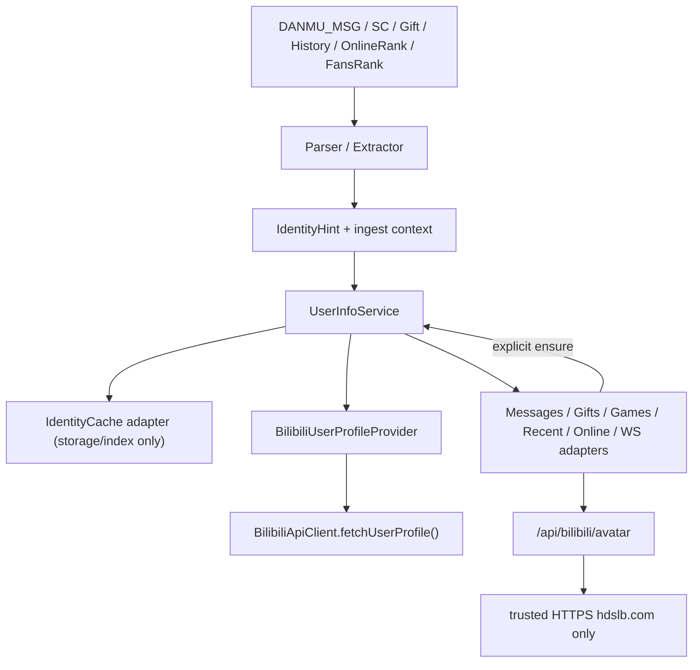

# Feature: Bilibili 用户信息模块化设计

## 状态

Implemented（实现、聚焦回归、架构检查和完整测试已通过；不改变下列公共契约）

**审阅日期：** 2026-08-21
**Owner：** `src/bilibili/` 领域；跨域装配由 `src/server/bilibili-runtime.js` 和
`src/server/bilibili-client.js` 负责。
**相关契约：** [Bilibili 协议](../docs/architecture/backend/bilibili/protocol.md)、
[弹幕监听管线](../docs/architecture/backend/bilibili/danmaku.md)、
[模块化标准](../docs/architecture/engineering/modularity-standard.md)。

## Goal

在不改变现有 HTTP、WebSocket、IPC、数据库和前端事件格式的前提下，为弹幕、SC、礼物、大航海、粉丝牌、头像、昵称、历史消息和在线榜提供一个后端统一的用户信息门面。解析器和轮询器只产生身份提示（`IdentityHint`），缓存合并、资料补全、请求去重、房间生命周期和更新通知由 `UserInfoService` 负责。

这是一项增量边界收敛，不是 Bilibili 协议解析器或 `IdentityCache` 的大爆炸式重写。

## Context and Verified Current Behavior

当前代码已经有可复用的部件，但调用入口分散：

- `src/bilibili/danmaku/identity-cache.js` 同时维护 UID/name 索引、最近用户和在线 UID，并按 10 分钟 TTL 清理。
- `src/bilibili/danmaku/message-handlers.js` 直接调用 `IdentityCache.resolve()` 处理 DANMU_MSG、SC 和礼物。
- `src/bilibili/danmaku/online-rank-poller.js` 与 `src/bilibili/danmaku/fans-medal-poller.js` 直接调用 `remember()` 和 `markOnlineSnapshot()`。
- `src/bilibili/danmaku-client.js` 的 `getViewerCandidates()` 直接读取 `listOnline()`，并把 `onMessage() === true` 当作头像请求信号。
- `src/server/bilibili-runtime.js` 的游戏中奖头像查询直接调用 `BilibiliApiClient.fetchUserProfile()`。
- `src/bilibili/parsers/superchat-parser.js` 已保留 SC 的 UID、昵称、大航海和粉丝牌字段，但尚未把 `user_info.face` 映射为统一的 `avatarUrl`。

本次审阅在 Node `v24.15.0` 下运行了现有 Bilibili/头像/弹幕聚焦基线：27 项通过。该结果只说明当前回归基线通过，不代表新门面已经实现，也不替代后续 `npm run verify:quick` 和 `npm test`。当前基线没有覆盖下列两个新回归：完整昵称被掩码昵称覆盖、SC `user_info.face` 缺失映射。用现有代码复现前者时，`listRecent()` 会返回掩码昵称。

## Problem Statement

### 已确认缺陷

1. **完整昵称可能被掩码昵称覆盖。** `IdentityCache.resolve()` 恢复缓存后，又用本次输入的 `userName` 写入 `recentByUid`；低质量的 `**昵称` 因而覆盖了较早的完整昵称。
2. **SC 头像没有进入统一身份。** `user_info.face` 尚未进入 SC parser 的身份输出。
3. **头像请求由布尔返回值隐式触发。** `BilibiliDanmakuClient.deliverDanmaku()` 通过 `onMessage() === true` 决定是否调用资料接口，使业务处理结果和网络副作用耦合。

### 必须保留的现有语义

- 未归属当前主播的粉丝牌不能进入当前房间身份。
- “没有提供字段”与“已验证当前房间没有该字段”不同。现有测试已经锁定：当前房间验证的空牌子可以抑制旧的别家牌子。
- 粉丝牌归属由 `target_id` / `targetId` / `ruid` 与主播 UID 比较；`roomId` 不能替代主播 UID。
- 在线榜是当前在线快照，游戏观众候选只能来自最新快照。
- 头像仍须经现有 `https://*.hdslb.com` 校验和 `/api/bilibili/avatar` 代理，渲染层不能直接访问任意远程地址。

## Scope

### In scope

- 新增 `UserInfoService` 作为 Bilibili 用户信息的统一后端门面。
- 复用现有 `IdentityCache`、`BilibiliApiClient.fetchUserProfile()`、用户元数据提取器和头像代理。
- 统一 parser/poller 到 `IdentityHint` 的输入边界。
- 处理全局资料（昵称、头像）与房间身份（大航海、粉丝牌）的不同作用域。
- 对资料请求做 provider 级 in-flight 合并和短期失败负缓存。
- 将在线榜、最近用户、游戏用户资料查询收口到门面或窄 facade。
- 以显式服务调用取代 `onMessage() === true` 头像副作用。

### Non-goals

- 不新增进程、端口、数据库表、运行时依赖、HTTP 端点、IPC 通道或 preload API。
- 不在第一阶段持久化头像/昵称，不建立用户历史身份库。
- 不假设用户资料接口能可靠返回当前房间的大航海等级或粉丝牌状态。
- 不让 Avatar Proxy 参与用户信息合并，也不把远程图片响应暴露给 renderer。
- 不一次性移动或重写 `IdentityCache`、所有 parser 或游戏模块。

## Design Decisions

1. **Facade first.** 先新增门面并以适配方式复用旧缓存，保持旧事件和字段兼容；只有迁移完成后才考虑移动实现文件。
2. **Single merge owner.** 从 `UserInfoService` 引入开始，字段优先级、freshness、verified absence 和 evidence 的合并决策只允许由 service 做出。`IdentityCache` 在迁移期只能作为 storage/index compatibility primitive 接收 service 已合并的最终状态；遗留入口可以暂时保留签名，但只能委托 service 或执行 exact projection，不得再次调用自己的字段覆盖策略。新生产者和消费者都不得绕过 service 写入或读取它。
3. **Two scopes.** `name` 和 `avatarUrl` 属于 UID 的全局 profile；`guard` 和 `fansMedal` 属于 `{roomId, ownerUid}` 的房间身份。房间切换不能清掉仍然有效的 profile 请求结果，但旧房间身份不得写入新房间。
4. **Three-state fields.** `undefined/absent` 表示未知；只有 `roomIdentityVerified: true` 且 `guardKnown` 或 `medalKnown` 为真时，`guardLevel: 0` 或 `fansMedal: null` 才表示“已确认不存在”，可以清除旧的同房字段。空字符串不是独立的 absence 标记，只能作为 parser 归一化前的输入。
5. **Owner UID is canonical.** 粉丝牌值必须携带 `targetUid`，并与当前 `ownerUid` 一起保存；`roomId` 只用于房间缓存和生命周期，不作为粉丝牌归属判断。
6. **Evidence is internal.** 来源、优先级、验证状态和观察时间保存在 service 内部 evidence metadata；日常业务只消费稳定的公开 snapshot。诊断需要时另设 `inspect()`，不把 `sources` 结构扩散到业务或兼容 cache。
7. **Provider-level deduplication.** `ensure(uid, { fields: ['name'] })` 与 `ensure(uid, { fields: ['avatarUrl'] })` 必须共享 `profile:${uid}` 在途请求，因为一次 `fetchUserProfile()` 同时返回两个字段。
8. **Explicit side effects.** parser 不发请求；业务在确实需要头像或昵称时显式调用 `ensure()`。`onMessage()` 的布尔返回值不再具有头像触发语义。

## High-Level Architecture



用户身份与一次消息严格分层：`UserInfoService` 只保存 `user`（UID、昵称、头像、当前房间身份和 presence 索引），不保存弹幕文字、SC 内容、SC 金额或礼物数量。解析器应分别产出 `IdentityHint` 与消息 payload；领域内部可以组合成标准 `BilibiliMessageEvent`，对外仍由 compatibility adapter 产生现有消息、HTTP、WebSocket 和前端事件形状：

```js
{
  type: 'danmaku' | 'superchat' | 'gift',
  user: UserInfoSnapshot,
  payload: { /* text/price/gift fields for this message only */ }
}
```

因此 DANMU_MSG 与 SC 的 `user` 结构一致，只有 `payload` 不同；消息历史不是用户资料字段。

`BilibiliDanmakuClient`、轮询器和 `MessageHandlers` 属于 Bilibili domain；`src/server/bilibili-runtime.js` 是组合与生命周期边界；`src/games/` 只通过注入的窄 `UserProfileResolver` 使用资料能力，不直接 import Bilibili 私有实现。

## Data Model

### IdentityHint

Parser 返回一次消息或快照中明确观察到的字段。`source`、`roomId`、`ownerUid`、generation 和 runToken 放在 ingest context，不塞进用户本体；`observedAt` 由 service 在接受 hint 时补齐。

```js
{
  uid: '123',
  name: 'Alice',                 // optional; absent means unknown
  avatarUrl: 'https://i0.hdslb.com/...', // optional; must be normalized
  roomIdentity: {                // optional; only current-room fields
    guardKnown: true,
    guardLevel: 3,               // 0 is valid only when guardKnown is true
    medalKnown: true,
    fansMedal: {
      name: 'imilly',
      level: 28,
      targetUid: '999'
    }
  },
  observedAt: 1787278000000 // service 接受 hint 的时间；不是上游 payload 的原始事件时间
}
```

`ingestHint()` context：

```js
{
  source: 'danmaku' | 'superchat' | 'gift' | 'history'
    | 'online_rank' | 'fans_rank' | 'profile',
  roomId: '100',
  ownerUid: '999',
  generation: 4,
  runToken: 7,
  roomIdentityVerified: true
}
```

`roomIdentityVerified` 只有在 parser 已用当前主播 UID 验证目标，或上游接口语义明确代表当前房间时才为真。仅存在一个 medal 对象不能自动令其为真。

### Public UserInfoSnapshot

业务默认得到的快照不暴露来源优先级、原始响应或生命周期控制字段。公开用户对象把当前房间字段平铺，房间 scope 单独标注：

```js
{
  uid: '123',
  name: 'Alice',
  avatarUrl: 'https://i0.hdslb.com/...',
  room: {
    roomId: '100',
    ownerUid: '999'
  },
  guard: { known: true, level: 3 },
  fansMedal: {
    known: true,
    value: { name: 'imilly', level: 28, targetUid: '999' }
  },
  updatedAt: 1787278000000
}
```

没有当前 room scope 时，`room`、`guard` 和 `fansMedal` 不出现在 profile-only snapshot 中。当前 room 存在但字段未知时，保留 `known:false` 形状；业务必须按未知处理，不得把它当成“没有”。`generation` 和 poller run token 只存在于 service scope、ingest context、生命周期方法返回值和诊断 `inspect()` 中，不属于 `UserInfoSnapshot`。兼容适配器可以继续产生现有的 `requesterGuardLevel`、`requesterMedalName` 和 `requesterMedalLevel` 字段，但新业务不应依赖 cache 的内部字段名。

### Internal evidence

```js
{
  name: { source: 'profile', observedAt, quality: 'full' },
  avatarUrl: { source: 'danmaku', observedAt },
  room: {
    guard: { source: 'superchat', observedAt, verified: true },
    fansMedal: { source: 'danmaku', observedAt, verified: true }
  }
}
```

Evidence 只服务于字段级合并、诊断和测试，不成为 HTTP/WS/IPC 公共契约。

## Merge and Freshness Rules

### Field ownership

| 字段 | 作用域 | 可写来源 | 规则 |
|---|---|---|---|
| `name` | UID 全局 | message、history、online/fans snapshot、profile | 完整名优先于掩码名；缺失不覆盖；同质量按 freshness 再按来源优先级决定 |
| `avatarUrl` | UID 全局 | message、SC `user_info.face`、history、online/fans snapshot、profile | 只接受已归一化的可信 HTTPS URL；空值不覆盖有效值 |
| `guard` | 当前 `{roomId, ownerUid}` | 已验证的 DANMU_MSG、SC、Gift、history、online/fans snapshot | 未验证来源不能写入；`guardKnown: true, guardLevel: 0` 可以清除旧值 |
| `fansMedal` | 当前 `{roomId, ownerUid}` | 已验证的 DANMU_MSG、SC、history、online/fans snapshot | 非空值的 `targetUid` 必须等于 `ownerUid`；`medalKnown: true, fansMedal: null` 可以清除旧值 |

初始来源优先级按字段处理，而不是一个全局排行榜。source 分值为 `danmaku`/`superchat`/`gift` 30、`history` 20、`fans_rank` 10、`online_rank` 5、`profile` 0；优先级是字段级 evidence metadata，不出现在公开模型。`source` 不是所有字段的无条件第一排序键：

- `name` 先比较是否为空和完整/掩码质量，再比较 `observedAt`，最后以 source 作为同时间或冲突时的 tie-break；完整名不会被更新的掩码名覆盖。
- `avatarUrl` 先比较 URL 合法性，再比较 `observedAt`，最后以 source 作为 tie-break；因此较新的合法 profile/SC 头像可以替换较旧头像，但非法或空值永远不能覆盖有效值。
- `guard`/`fansMedal` 先要求当前 room verification；非空 `fansMedal` 的 `targetUid` 还必须等于当前 `ownerUid`。不匹配或缺失时只拒绝该 `fansMedal` room field，并记录脱敏诊断；在 room context 有效的前提下，同一 hint 的合法 name/avatar/guard 仍可合并，不抛异常。通过校验后，未过期 evidence 按 `danmaku/superchat/gift = 30`、`history = 20`、`fans_rank = 10`、`online_rank = 5` 比较 authority；更高 authority 胜出，authority 相同时才由较新的 `observedAt` 胜出。verified absence 使用同一个 comparator，因此仍有效的消息 presence 不会被榜单 absence 清除，但同 authority 的更新 absence 可以清除旧 presence。

room field comparator 固定为以下顺序，实施不得另行解释：

```js
function mergeRoomField(current, incoming, nowMs) {
  if (!incoming.verified) return current;
  if (incoming.field === 'fansMedal'
      && incoming.value !== null
      && incoming.targetUid !== currentScope.ownerUid) {
      return current; // 仅丢弃该 room field；hint 的其他合法字段仍可合并
  }
  if (!current || isExpired(current, nowMs)) return incoming;

  const authorityDelta = roomFieldAuthority(incoming.source)
    - roomFieldAuthority(current.source);
  if (authorityDelta !== 0) return authorityDelta > 0 ? incoming : current;
  return incoming.observedAt >= current.observedAt ? incoming : current;
}
```

`guardLevel: 0` 和 `fansMedal: null` 只有在各自 `*Known: true` 且上述 verification 通过后才形成可参与比较的 absence evidence；unknown 在 comparator 之前即被丢弃。非空 fans medal 必须携带自己的 `targetUid`；verified absence 没有 medal value，因此不伪造 `targetUid`，其房间归属完全由已匹配当前 scope 的 ingest context 和 `roomIdentityVerified: true` 证明。

`IdentityHint` 只读取数据模型中列出的已知属性；未知属性在归一化边界被忽略且不得进入 evidence 或 snapshot。`source` 不在允许枚举中时，`ingestHint()` 记录脱敏诊断后抛出 `TypeError`，整条 hint 不合并；不能用默认 authority 悄悄参与合并。

`observedAt` 在 service 内统一表示 LIRA 接收并接受该 hint 的时间（通常由 service 使用 `Date.now()` 赋值）。上游 payload 自带的事件时间只用于消息排序/去重等既有语义，不直接作为不同接口之间的 identity freshness 比较值；若实现需要保留原始时间，必须放在内部 evidence 中且不能进入公开 snapshot。因此 profile 可以填充缺失头像，新的合法 SC face 可以替换旧的 profile face，但 fans/online snapshot 仍不能覆盖更高可信的当前房间消息证据。

History poller 必须串行拉取，上一批 fetch、排序和 ingest 未完成时跳过下一次 tick，不允许批次并发或交错。同一批必须先按上游消息时间稳定排序为 old → new；随后在 identity ingest 前调用现有 `MessageDeduplicator.remember(uid, text, timestamp, { source: 'history' })`，只有返回 `true` 的首次记录才调用 `ingestHint()`，从而沿用既有稳定键、跨 source 匹配和保留窗口。后续批次重复返回的旧记录不得刷新 identity `observedAt`。同一毫秒内后 ingest 的不同记录按上面 `>=` 规则胜出。不得按 new → old 顺序逐条赋予 service observation time，避免旧记录获得更新的 `observedAt`。

### Unknown versus verified absence

以下输入不能清除缓存：

```js
{ uid: '123', roomIdentity: undefined }
// 或 { roomIdentity: { guardKnown: false, medalKnown: false } }
```

以下输入可以清除当前房间字段：

```js
{
  uid: '123',
  roomIdentity: {
    guardKnown: true,
    guardLevel: 0,
    medalKnown: true,
    fansMedal: null
  }
}
// ingest context.roomIdentityVerified === true
```

这条规则防止“未知”错误继承别家粉丝牌，也防止已确认没有当前房间身份时继续显示旧身份。

### Name quality

掩码判定沿用当前 `**` 规则，但合并不应只靠最后一次输入：

- 完整名可以填充空值，也可以替换先前的掩码名。
- 掩码名只能填充空值，不能替换完整名。
- `seenAt`/`observedAt` 变化本身不构成业务更新事件。
- 新字段缺失、`null` 或归一化为空时，不覆盖已有全局资料。

### TTL and negative cache

第一阶段保持现有 10 分钟内存 TTL，避免同时改变缓存行为；不写入 SQLite 或磁盘。资料请求失败建立 30 秒短期负缓存，防止失败时每条弹幕重复请求。未来如需不同 TTL，应分别为 profile 和 room identity 建立新决策，不在本次迁移中隐式改变。

## UserInfoService Contract

以下是第一阶段稳定门面；具体文件位置可在实现计划中决定，但不得让消费者绕过这些接口读 `IdentityCache`。

```js
class UserInfoService {
  peek(uid, { roomId, fields } = {})
    // 有当前缓存时按 fields 投影返回 UserInfoSnapshot；无任何缓存时固定返回 null。

  ingestHint(hint, { source, roomId, ownerUid, generation, runToken, roomIdentityVerified } = {})
    // 字段级合并；成功返回 { snapshot, changedFields }；失效 room context 返回 { snapshot: null, changedFields: [] } 且不通知。

  ensure(uid, { fields = ['name', 'avatarUrl'], roomId } = {})
    // Promise<UserInfoSnapshot|null>；初期只允许 name/avatarUrl。

  listRecent({ roomId, fields } = {})
    // 替代 IdentityCache.listRecent()。

  listOnline({ roomId, fields } = {})
    // 替代 IdentityCache.listOnline()。

  replaceOnlineSnapshot(uids, { roomId, ownerUid, generation, runToken } = {})
    // 供 OnlineRankPoller 使用；只接受当前 room scope + service-issued generation/runToken；空数组表示清空。

  subscribe(listener, { fields, roomId } = {})
    // 返回 unsubscribe 函数；按 fields/roomId 投影，只在实质变化时通知。

  setRoom({ roomId, ownerUid } = {})
    // 只管理 room identity；返回 { roomId, ownerUid, generation }，pair 变化时递增 generation 并使旧 run 失效。

  beginRoomRun()
    // 为整个 room runtime 的一次协调启动/重连生成一个 runToken，返回所有 poller 共用的完整 context。

  endRoomRun({ roomId, ownerUid, generation, runToken } = {})
    // 仅在 context 匹配当前 scope 时幂等地使 runToken 失效并清空 online snapshot；旧 context 调用是 no-op。

  dispose()
    // 幂等地使 lifecycle token、runToken、subscription 和异步写入资格失效。
}
```

所有方法先执行参数归一化和 `fields` 校验，再执行显式 `roomId` stale guard；因此非法 fields 即使 roomId 已过期也先抛 `TypeError`。`fields` 未传时返回完整的公开 snapshot；传入时必须是数组，非数组、非字符串元素或未知字段都由 `normalizeFields()` 抛出 `TypeError`，不能静默忽略。允许值只有 `name`、`avatarUrl`、`guard`、`fansMedal`；重复字段按第一次出现去重，`uid` 永远返回且不需要放进 `fields`，空数组只返回 `uid`。仅请求 profile 字段时不返回 `room`；请求 `guard` 或 `fansMedal` 时，若当前 room scope 存在则附带 `roomId/ownerUid`，并对未知字段保留 `known:false`，若不存在当前 room scope 则省略 room-scoped 字段。显式 `fields` 投影不返回 `updatedAt`、evidence、source 或生命周期 token。`ensure()` 在通用 fields 校验后只允许 `name`/`avatarUrl`，请求 `guard`/`fansMedal` 同样抛出 `TypeError`。

`roomId` 一旦显式传入，就表示 caller 要求 stale-context protection；与当前 scope 不匹配（包括当前没有 scope）时，即使只请求 global profile 字段，也必须采用以下固定结果：

- `peek()` 返回 `null`；
- `listRecent()` 和 `listOnline()` 返回 `[]`；
- `subscribe()` 返回 no-op unsubscribe 且不通知；若注册时匹配，则订阅绑定当时的 generation，scope 改变后不得在 A → B → A 时恢复；
- `ensure()` 返回 `null` 且不发 provider 请求。

未传 `roomId` 的 `peek()`/`ensure()` 可以正常读取或补全 global profile。`ensure()` 以显式 `roomId` 调用时还要捕获调用开始时的 generation；provider 返回前若 scope 曾改变，即使已经 A → B → A 回到同一 roomId，profile 结果仍可合入全局状态，但该旧 caller 固定收到 `null`。guard/fans medal 必须由消息/榜单 hint 提供，不能通过 profile provider 猜测。`listRecent()` 和 `listOnline()` 的 audience index 属于当前 room scope；换房后清空，整个 room runtime 同房重连时保留 TTL 状态。

更新事件形状：

```js
{
  type: 'user-info:updated',
  uid: '123',
  changedFields: ['avatarUrl'],
  snapshot
}
```

同一条弹幕只更新 `seenAt` 或重复写入相同字段时不发事件，避免前端、游戏和 WebSocket 订阅者被每条消息放大。

订阅者只在其 `fields` 投影内发生实质变化时收到事件；`subscribe()` 未传 `fields` 等同于完整四字段投影（`name`、`avatarUrl`、`guard`、`fansMedal`），`uid` 不计入 `changedFields`。`changedFields` 只包含该订阅者请求的字段，不会因为未请求字段变化而唤醒订阅者。显式传入 `roomId` 的订阅在 scope 改变时先失效，不接收终止/清空事件，也不会在 A → B → A 后恢复；未传 `roomId` 的通用订阅在 `setRoom()` 清除旧 room identity 后立即收到一次新 scope 的 room 投影 invalidation（仅当其投影中确有变化），后续再按 hint 接收实质变化。两类订阅都不把 `generation` 或 `runToken` 暴露为 changed field。

### Profile Provider

`BilibiliUserProfileProvider` 是 `BilibiliApiClient.fetchUserProfile(uid)` 的窄适配器，初期只负责 `name` 和 `avatarUrl`。它不得被 parser、游戏 domain 或 renderer 直接调用。

`ensure()` 的并发规则：

1. UID 必须先通过现有数字 UID 校验。
2. `name` 和 `avatarUrl` 的并发需求合并到同一个 `profile:${uid}` promise。
3. 成功结果只写全局 profile；如果调用期间发生房间切换，profile 仍可合入当前 UID，但不会写入任何 room identity。若 service 已 dispose，则结果完全丢弃。
4. 失败进入短期负缓存；负缓存期间返回已存在的 snapshot，不重复发请求。

## Room Lifecycle, Generation and Run Tokens

`UserInfoService` 分开维护 room identity scope 与当前 room runtime run：

```js
const roomScope = {
  roomId: '100',
  ownerUid: '999',
  generation: 4
};
const activeRoomRun = {
  ...roomScope,
  runToken: 7
};
```

它不能直接复用 `BilibiliDanmakuClient.connectionGeneration`：后者表示 WS 连接代际，不只表示房间切换。

`setRoom({ roomId, ownerUid })` 只负责 room identity：

```js
const roomScope = userInfoService.setRoom({ roomId: '100', ownerUid: '999' });
// { roomId: '100', ownerUid: '999', generation: 4 }
```

pair 变化时 `setRoom()` 递增 generation、使当前 runToken 失效，并立即清除旧房间的 guard、fans medal、online snapshot、recent audience index 和 room evidence；全局 profile 保留。清除完成后，未绑定特定 roomId 的通用 subscription 对受影响 UID 立即收到一次新 scope room 投影 invalidation；显式 roomId subscription 已先失效且不收到事件。pair 不变时重复调用不轮换 runToken。

组合根在启动或协调重连整个 room runtime 时只调用一次 `beginRoomRun()`：

```js
const roomRunContext = userInfoService.beginRoomRun();
// { roomId: '100', ownerUid: '999', generation: 4, runToken: 7 }

historyPoller.start(roomRunContext);
onlineRankPoller.start(roomRunContext);
fansMedalPoller.start(roomRunContext);
```

`beginRoomRun()` 要求已存在有效 `roomScope`，否则抛出 `Error`。每次调用都原子地使先前 active run 失效、清空 online snapshot、创建一个新的 runToken，并返回不可变 context；因此连续 begin 也不能保留旧 online 状态。History、OnlineRank 和 FansMedal 等所有 room-scoped producer 必须共享这一个对象；不得因依次启动多个 poller 而多次调用 `beginRoomRun()`。这里的“重连”是组合根对整组 room-scoped producer 的协调重启；单次 WS `connectionAttempt` 不自动定义新 room run。

- 只有整个 room runtime 停止或协调重连时，组合根才调用 `endRoomRun(roomRunContext)`；它原子地使该 runToken 失效并清空 online snapshot。协调重连的正常顺序固定为 `endRoomRun(oldContext) → beginRoomRun() → start all producers`；`beginRoomRun()` 的防御性失效/清空保证漏掉显式 end 时也不会接纳旧 run 写入。
- 单个 poller 独立停止/重启必须复用当前 `roomRunContext`，不得调用 `beginRoomRun()` 或 `endRoomRun()`，也不得让其他 poller 的结果失效。poller 自己需要阻止 stop 后回写时，继续使用其本地 generation/abort 状态。
- `ingestHint()` 和 `replaceOnlineSnapshot()` 的 room-scoped 写入只接受与 service 当前 active run 完全匹配的 `{ roomId, ownerUid, generation, runToken }`；任一不匹配即丢弃。实现不得从 room pair 重新推导任一 token。
- 来自 room-scoped producer 的 hint 即使同时携带 global name/avatar，只要其 room context 已失效就整条拒绝，不能把延迟的旧批次伪装成更新的 global observation；只有 context-free 的 profile source/provider 结果按 lifecycle token 独立合入全局 profile。
- 同房协调重连不递增 generation，但会由一次新的 `beginRoomRun()` 轮换 runToken；guard、fans medal 和 recent audience 在 TTL 内保留，online snapshot 在新 poll 成功前为空。
- profile provider 返回的 name/avatar 不依赖 room generation/runToken，可以安全补入全局 profile；它只检查 service 的 lifecycle token 未失效，不能因切房或重连而被错误丢弃。
- `dispose()` 才使 lifecycle token、订阅和全部异步写入资格失效；room run 的结束不得清除全局 profile。

## Parser and Poller Boundaries

### Parser

Parser 只从协议输入提取字段，不调用 cache、网络、service 或业务通知：

- DANMU_MSG：提取 UID、显示名、消息头像和已按 `target_id/ruid` 校验的房间身份。
- SC：提取 UID、昵称、`user_info.face → avatarUrl`、大航海和粉丝牌；`face` 只做归一化，不触发请求。
- Gift：提取消息本身已有的 UID/昵称/头像（若有）；只有 guard purchase/toast 的上游语义可证明它属于当前直播间时，才额外产生 verified guard presence。普通 gift 不产生 guard/fans medal，缺失字段保持 unknown。
- History、OnlineRank、FansRank：输出同一 `IdentityHint` 形状；由调用方提供 source 和 room context。

### Poller

轮询器允许请求自己负责的 history/online-rank/fans-rank HTTP endpoint，并拥有间隔、分页、停止和重入控制；但不应知道 `IdentityCache`，也不应调用 profile provider、头像代理或任何额外的头像网络请求：

```js
new OnlineRankPoller(apiClient, {
  ingestHint: (hint, context) => userInfoService.ingestHint(hint, context),
  replaceOnlineSnapshot: (uids, context) => userInfoService.replaceOnlineSnapshot(uids, context)
});
```

poller 的每个 context 必须是组合根一次 `beginRoomRun()` 返回的共享 `roomRunContext`；poller 不能自行生成或修改 token。`FansMedalPoller` 使用相同的 `ingestHint` port。`HistoryPoller` 先将同一批记录稳定排序为 old → new，再通过 `onIdentityHint` 回调依次进入 service。只有整组 room-scoped producer 停止或协调重连时组合根才调用 `endRoomRun()`；单个 poller 重启复用现有 context。这样“统一身份信息生产入口”覆盖 parser、extractor 和 poller，而不仅是 parser。边界测试必须允许榜单/history 请求，同时断言 poller 不会调用 `fetchUserProfile()` 或 Avatar Proxy；还必须覆盖多 poller 共用 token、单 poller 重启不使其他 poller 失效，以及同房协调重连后旧 runToken 结果被丢弃。

每个 poller 必须实现一致的本地运行资格检查：`start(context)` 递增并捕获 `localGeneration`，`stop()` 再次递增；每次 `await` 返回后以及每次调用 `ingestHint()`/`replaceOnlineSnapshot()` 前都比较捕获值与当前值，不匹配立即丢弃。History 还维护 `pollInFlight`，上一批未完成时跳过 tick。共享 room runToken 负责整组生命周期，本地 generation/abort 负责单 poller 生命周期，两者不能互相替代。

## Explicit Avatar Flow

目标调用链：

```text
消息进入
  → parser 提取 avatarUrl（有则直接 ingest）
  → UserInfoService.peek()
  → 业务确实需要且缺失时显式 ensure(uid, { fields: ['avatarUrl'] })
  → service 更新并发布 user-info:updated
  → 现有业务事件/游戏会话按兼容适配器刷新
  → renderer 继续使用 /api/bilibili/avatar
```

迁移期间可以让 `onAvatarResolved` 订阅 service 更新以保持画猜会话兼容，但 `BilibiliDanmakuClient.deliverDanmaku()` 不得再解释 `onMessage()` 的布尔返回值，也不得因此隐式发网络请求。迁移完成后删除 `resolveDanmakuAvatar()`、`avatarProfileRequests` 和旧回调适配器；删除条件是没有消费者依赖它们。

## Cross-Domain Consumers

- `BilibiliDanmakuClient.getViewerCandidates()` 改为调用 `userInfoService.listOnline()`。
- 最近用户读取统一改为 `userInfoService.listRecent()`。
- 游戏模块只注入窄接口，例如：

  ```js
  {
    ensure(uid, options) { return userInfoService.ensure(uid, options); },
    peek(uid, options) { return userInfoService.peek(uid, options); }
  }
  ```

  游戏不直接依赖 `BilibiliApiClient`、`IdentityCache` 或 `src/bilibili/users/` 私有路径。
- `/api/games/winner-profile`、现有游戏事件和头像代理的响应形状保持不变；只替换其内部资料来源。
- 不向 preload 暴露新的 UserInfoService API。第一阶段 renderer 继续消费现有 HTTP/WS 载荷；未来若确实需要桌面桥，另立契约和 ADR。

## Security and Reliability

- 头像 URL 统一经过现有 `normalizeBilibiliAvatarUrl()` 和 `/api/bilibili/avatar` 的 HTTPS、主机和图片类型校验。
- UserInfoService 不保存或返回 Bilibili Cookie、Token、完整远程响应或上游错误详情。
- profile provider 复用已有认证边界；不允许 renderer 直接调用 Bilibili API。
- UID、roomId、ownerUid 在 service 入口再次归一化；无效 UID 不进入 cache 或网络请求。
- 同一 provider 查询必须 in-flight 去重；失败负缓存避免网络风暴。
- poller、profile 和未来 room provider 的旧结果必须经过 generation、共享 room runToken 或 lifecycle token 检查。整个 room runtime 停止时由组合根清理 poller timer、poller-local sink 和 in-flight room writes；service subscription 不因 `endRoomRun()` 自动销毁，显式 room subscription 已在 generation 切换时失效，通用 profile subscription 继续有效，直到调用 unsubscribe 或 `dispose()`。`dispose()` 才统一失效 service subscription、lifecycle token 和全部异步写入资格。
- 订阅回调异常不能阻止其他订阅者或破坏 cache 合并；日志只记录脱敏 UID/错误摘要。

## Compatibility

迁移不得改变：

- `requesterGuardLevel`、`requesterMedalName`、`requesterMedalLevel` 等现有消息、队列和 SC 字段。
- `/api/bilibili/avatar` 的路径、校验和 inline cacheable 图片响应。
- `/api/games/winner-profile` 的路径和 `{ avatarUrl, name }` 响应形状。
- Bilibili HTTP 方法/路径、WebSocket 消息类型、IPC 通道、前端事件和数据库 schema。
- 现有同房间重连、在线榜快照和 fans-rank 分页停止条件。

旧消费者迁移期间允许存在一个明确标注的 compatibility adapter，但必须记录消费者清零条件；不得让新代码继续直接调用 `IdentityCache`。

## Migration Phases

### Phase 0 — 修复并建立基线

- 修复完整昵称被掩码昵称覆盖，增加 `listRecent()` 回归。
- 修复 SC `user_info.face` 到 `avatarUrl` 的 parser 回归。
- 用三态字段测试锁定 unknown、verified absence 和别家粉丝牌隔离。
- 在 Node >= 24 环境执行 Bilibili 聚焦测试，并记录命令和结果；不把局部结果写成完整套件通过。

### Phase 1 — 新增门面

- 新增 `UserInfoService`、profile provider 和测试 fake。
- 复用现有 `IdentityCache`，不移动文件并保留现有方法签名；增加 service-owned exact projection/委托适配路径，使遗留 `resolve()`/`remember()` 不再成为第二套 merge policy。
- 先接入 `peek/ingestHint/ensure/listRecent/listOnline/subscribe/setRoom/beginRoomRun/endRoomRun/dispose`，建立 provider 级 dedupe、负缓存和 room runtime 级共享 run token。

### Phase 2A — 消息生产入口

- DANMU_MSG、SC、Gift、History parser/extractor 统一产生 `IdentityHint`。
- `MessageHandlers` 通过 service ingest，不再让 parser 或 handler 发头像请求。
- 维持现有消息事件形状。

### Phase 2B — Poller 生产入口

- OnlineRank、FansMedal、History poller 改为注入 `ingestHint`/`replaceOnlineSnapshot` port。
- poller 不再直接引用 `IdentityCache`。
- 保留现有分页上限、短页/空页停止和 poller 本地停止逻辑；History batch 固定 old → new ingest，三个 poller 共享组合根签发的 room run context。

### Phase 3 — 消费者迁移

- 迁移 viewer candidates、最近用户、礼物/SC/UI、游戏中奖头像和画猜会话。
- 游戏通过 runtime 注入的 `UserProfileResolver` 调用 `ensure()`，不直接调用 Bilibili API。
- 使用 service 更新事件替代 `onAvatarResolved` 的隐式路径。

### Phase 4 — 删除隐式入口

- 删除 `onMessage() === true` 头像触发、`resolveDanmakuAvatar()`、重复 `fetchUserProfile()` 和无消费者的兼容回调。
- 保留消息/HTTP/WS/IPC 公共格式。

### Phase 5 — 收口和文档

- 在没有直接消费者后再移动或收窄 `IdentityCache`。
- 将头像 URL 归一化规则收敛到现有用户头像模块。
- 更新 [Bilibili 弹幕架构事实源](../docs/architecture/backend/bilibili/danmaku.md)、[协议事实源](../docs/architecture/backend/bilibili/protocol.md)、AI route table 和 legacy boundary registry。
- 本稿当前为 Accepted；开始实现后变为 In Progress，只有实现和验收证据齐全后才变为 Implemented，并同步维护 ADR 与规格索引状态。

## Acceptance Criteria

1. Parser/extractor 不访问 cache 或网络；Gift 只有在 guard purchase/toast 明确属于当前直播间时才产生 verified guard presence，普通 gift 不产生 room identity。poller 只访问自己负责的 history/online-rank/fans-rank endpoint，并通过注入 sink 提交 hint，不访问 cache、不调用 profile provider 或 Avatar Proxy。
2. `UserInfoService` 是唯一 merge policy owner；`IdentityCache` 只保存/index service 已合并状态且不再二次决定字段覆盖。完整昵称永远不会被掩码昵称覆盖；缺失字段不会覆盖已有值。
3. unknown 与 verified absence 可被测试区分；已确认无当前房间身份时不继承别家身份。
4. 粉丝牌输出包含 `targetUid`，且只接受与当前 `ownerUid` 匹配的值。
5. SC `user_info.face` 能进入 `avatarUrl`，并沿用头像 URL 安全校验。
6. 同一 UID 的 name/avatar 并发 `ensure()` 只产生一个 profile provider 请求。
7. 只有公开资料或房间身份实质变化才发 service 更新事件；重复 hint 或仅 `seenAt` 变化不广播。
8. 房间切换后旧 room generation 的 guard、fans medal、online snapshot 和 room 请求结果不能写入新房间；同房协调重连后旧 runToken 的结果也不能写入。失效 room context 的混合 hint 连同 name/avatar 整条拒绝；context-free profile provider 结果仍可补全全局资料。`beginRoomRun()` 无 room scope 时失败，每次成功调用都先清 online；一次返回的 token 被所有 poller 共用。单个 poller 重启不轮换共享 token、不使其他 poller 失效，并由本地 generation/abort 丢弃 stop 后结果。
9. viewer candidates、recent users 和游戏资料查询不再直接依赖 `IdentityCache` 或 `BilibiliApiClient` 私有实现。
10. `onMessage() === true` 不再触发头像请求；业务通过显式 `ensure()` 请求资料。
11. 现有 HTTP、WebSocket、IPC、数据库和前端事件契约保持兼容。
12. 头像代理继续拒绝非 HTTPS、非允许主机和非图片响应；认证 Cookie/Token 不进入 renderer 或用户快照。
13. Node >= 24 下通过新增聚焦回归、`npm run check`、`npm run verify:quick` 和完整 `npm test`。
14. A → B → A 的旧 generation 结果不能写入当前 room；同房协调重连的旧 runToken 结果也不能写入；下一次在线榜成功前返回空 online snapshot，但保留 TTL 内的 room identity/recent audience。room field 按 verification → 未过期 authority → freshness 的固定 comparator 合并，`gift` message authority 为 30；verified fans-medal absence 不要求虚构 `targetUid`。History poll 不重入、每批按 old → new 排序，并在 ingest 前通过现有 message deduplicator 拒绝跨批重复记录。
15. provider 失败会进入 30 秒负缓存；负缓存期间不重复请求，过期后下一次 `ensure()` 可以重试。
16. `peek/listRecent/listOnline/subscribe` 的 `fields` 投影只返回请求字段和永远存在的 `uid`，不泄露 `updatedAt`、evidence、source 或生命周期 token；非数组/非字符串/未知 field 以及 `ensure` 请求 room field 均抛出 `TypeError`，重复 field 去重。显式非当前 `roomId` 时 `peek/ensure → null`、`list* → []`、`subscribe → no-op/no event`，且 `ensure` 不发请求；匹配 room 发起的 `ensure` 在 A → B → A 后向旧 caller 返回 `null`。显式 room 订阅切房时无终止/清空事件，通用订阅才接收新 scope 投影；`changedFields` 只包含订阅投影内字段。DANMU_MSG 与 SC 的 `user` 结构一致，消息文字/金额只存在各自 payload。
17. 迁移完成后结构测试确认 `resolveDanmakuAvatar`、`avatarProfileRequests`、`onAvatarResolved` 及其兼容适配器没有剩余消费者，且删除不会改变游戏头像更新行为。
18. `IdentityHint` 未知属性在归一化边界被忽略且不进入状态；未知 source 记录脱敏诊断后由 `ingestHint()` 抛出 `TypeError`，整条 hint 不合并。

## Accepted First-Phase Defaults

这些默认值随本稿一并接受；若实施需要改变，必须先更新规格并重新评审受影响的契约：

| 问题 | 建议 | 原因 |
|---|---|---|
| `avatarUrl` 是否持久化 | 不持久化，仅内存缓存 | 避免新增 schema、旧头像长期滞留和数据迁移 |
| profile/identity TTL | 先沿用 10 分钟；失败负缓存 30 秒 | 最小化行为变化并防止失败重试风暴 |
| 主动刷新 | 第一阶段不提供业务公开的 force refresh | 避免绕过去重和 TTL；以后可另立契约 |
| guard/fans medal 历史 | 不做，只提供当前 room state | 历史身份是独立的审计/分析需求 |
| preload 暴露 | 不暴露；仅后端 service | 保持 renderer 权限面和现有 HTTP/WS 边界 |

## Verification Plan

实现阶段按仓库验证顺序执行：

1. 新增/修改的 Bilibili focused tests（identity merge、freshness/source、SC avatar、service dedupe、room generation/runToken、fields projection、subscription changedFields、poller sink、dispose/explicit avatar flow）。
2. `npm run check`。
3. `npm run verify:architecture`，确认跨域依赖仍通过显式 facade/port。
4. `npm run verify:quick`，包括文档治理检查。
5. `npm test`，并记录 Node 版本、失败环境和未覆盖的外部网络条件。

文档评审阶段不宣称完整测试已通过；本稿的当前证据仅为代码核对和已运行的 27 项聚焦基线。

## Implementation-time Uncertainties

以下问题不得改变已接受的边界；无法确认 absence、字段质量或消费者清零条件时，实施必须采用保守行为并记录发现：

- Bilibili 各类 online/fans rank payload 对“无粉丝牌”的明确表示是否稳定；若不稳定，必须保持 unknown，而不能推断 verified absence。
- profile API 的 `name` 是否在所有账号状态下代表完整公开昵称；若返回掩码值，仍需保留已有完整名。
- `UserInfoService` 的最终文件位置和 runtime 装配参数，需结合实施任务避免形成新的通用 dependency bag。
- 旧游戏会话订阅 avatar 更新的最小兼容适配器何时可以删除，需要以实际消费者搜索结果为准。

## Done When

本稿已转为 `Implemented`：`UserInfoService`、profile provider、parser/poller sink、房间 run 生命周期和显式头像路径已落地；Node v24.15.0 下聚焦测试、`npm run check`、`npm run verify:docs`、`npm run verify:architecture`、`npm run verify:quick` 与完整 `npm test` 均通过。完整测试未调用真实 Bilibili 上游；外部 DNS、认证和 API 可用性不在确定性门禁范围内。
