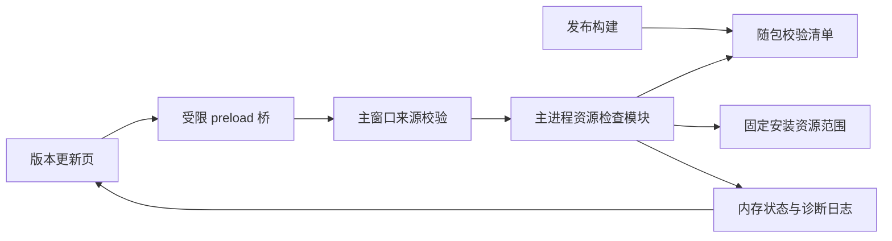

# 客户端资源完整性检查设计

> 状态：In Progress。2026-09-26。按用户明确指令开始实施；代码、针对性测试和隔离无签名安装包验证已落地，正式签名安装验收仍待完成。
> 实施计划：[2026-09-26-client-resource-integrity.md](plans/2026-09-26-client-resource-integrity.md)。不修改授权协议或服务端。

## 1. Goal：目标与产品定位

在「百宝箱 → 版本更新 → 本地数据与支持」提供手动的「检查客户端资源」入口。当用户遇到内置页面、图片或其他应用资源异常时，检查**当前已安装版本的应用资源是否与随安装包提供的校验清单一致**，并给出可以执行的下一步。

本功能是低频、只读的故障排查工具，不是新的更新器、杀毒工具或正版认证系统。检查通过仅说明本次范围内的资源与本地清单一致，不保证客户端所有功能正常，也不证明软件未遭恶意篡改。

第一版优先支持当前 Windows x64、NSIS 打包桌面端。普通浏览器和 OBS 页面不提供入口；开发运行模式说明不支持检查，不把开发目录当作安装包扫描。

### 1.1 典型用户路径

1. 用户因页面或内置资源异常进入版本更新页。
2. 点击「开始检查」，看到当前版本、检查范围和进度。
3. 无异常：提示已核对的范围，并建议继续通过日志排查其他原因。
4. 发现缺失或内容不一致：提示异常文件及重新安装官方安装包的处理方式。
5. 无法读取、校验清单无效等：明确显示「无法完成检查」，不武断认定资源损坏。

## 2. Context：当前实现与缺口

以下是设计编写时的实施前基线；本次新增实现与验证见实施计划及对应架构契约文档：

| 现有能力 | 依据 | 与本功能的关系 |
| --- | --- | --- |
| 更新检查、下载安装由 Electron 更新模块管理 | [`update-manager.js`](../src/electron/update-manager.js)、[`desktop-update-controller.js`](../src/electron/desktop-update-controller.js) | 继续复用，不改版本判定和更新状态枚举 |
| 更新包校验失败已有提示 | [`friendlyUpdateError`](../src/electron/update-manager.js)、[更新运行时文档](../docs/reference/desktop/update.md) | 下载包校验不等于安装后资源扫描 |
| 计算 `app.asar` 的 SHA-256，并用于构造 `buildId` | [`license/build-integrity.js`](../src/electron/license/build-integrity.js) | 当前函数的 `verified` 表示成功取得摘要；函数本身未与预期摘要比较，不能直接用作本功能的通过结论 |
| 应用启用 ASAR，包含 `src/`、`public/` 等资源，并明确排除部分文件 | [`package.json`](../package.json) | 清单以实际打包产物为准，不能把整个源码目录当作必需资源集合 |
| `afterPack` 目前仅移除 `default_app.asar` | [`scripts/after-pack.js`](../scripts/after-pack.js)、[`packaging-scope.test.js`](../test/engineering/packaging-scope.test.js) | 目前没有本功能所需的随包校验清单；后续构建接入须保留原清理行为 |
| 发布脚本使用构建器的 `--publish always`，构建与上传连在一起 | [`scripts/publish-release.js`](../scripts/publish-release.js) | 不能在该命令返回后才检查本地资源，再宣称已阻止异常产物上传 |
| 更新页已有本地数据、日志支持区 | [`desktop-update.html`](../public/pages/admin/toolbox/desktop-update.html) | 新入口放在此处，不再新增同用途设置入口 |
| 设置页目前以账户与网站为主 | [`settings.html`](../public/pages/admin/toolbox/settings.html) | 不把低频安装诊断混入账户设置 |
| 主窗口 IPC 已有来源校验封装 | [`main-window-ipc.js`](../src/electron/ipc/main-window-ipc.js) | 新增接口必须沿用主窗口、主 frame、精确 origin 和允许路径的校验 |

现有授权链路中的 `buildId`、`integrityStatus` 及服务端对构建的判断不属于本次变更。自检结果不得覆盖它们，也不得因资源检查失败而改变授权状态。

## 3. Constraints 与 Non-goals

- 保持本地模块化单体，不新增服务、常驻进程、运行时依赖或前端构建步骤。
- 不自动修复、不删除资源、不清空缓存、不恢复默认设置、不自动下载安装。
- 不扫描数据库完整性，不检查歌库内容、账号、网络、远程服务器或第三方音乐服务是否正常。
- 不检查用户自定义素材是否存在或正确，不把按需下载的缓存缺失判定为安装损坏。
- 不增加启动全量扫描、定时扫描、后台自动告警或自动上传诊断结果。
- 不承诺逐张图片定位：第一版以归档和外置文件为单位检查，不解包或执行可疑归档内容。
- 不改变已有 HTTP/WebSocket/授权 IPC、持久化设置键、数据目录和更新策略。
- 本功能需要客户端能够启动并打开页面；无法启动的安装仍须通过外部官方安装包恢复。

## 4. 检查范围

### 4.1 第一版必须覆盖

| 对象 | 检查方式 | 说明 |
| --- | --- | --- |
| `resources/app.asar` | 原始文件大小与 SHA-256 | 覆盖其中打包的代码、页面、CSS、图片、字体等；只报告归档整体是否一致 |
| 构建产物中存在的 `resources/app.asar.unpacked/` 内普通文件 | 按清单逐文件比较大小与 SHA-256 | 仅检查实际随包发布的文件；目录在构建时不存在则清单不要求它存在 |

校验清单存放在 `resources/client-integrity-manifest.json`，路径相对 `resources` 根目录。清单自身不纳入摘要列表，避免自引用。第一版的路径允许范围固定为 `app.asar` 和 `app.asar.unpacked/` 下文件，不能凭清单内容任意扩张。

以下均不在第一版范围：Electron 主程序、安装器、安装根目录下的 Chromium/Electron 运行时文件、`app-update.yml`、卸载程序、用户业务数据、日志、浏览器配置及下载缓存。后续若纳入其他资源，须同时更新构建清单生成规则、运行时允许范围、UI 说明与验收测试。

额外文件不作为损坏依据，也不执行清理。通过结果应写「本次检查范围内的资源与校验清单一致」，不能写「所有客户端文件完整」。

### 4.2 数据隔离

检查器只读取安装资源及其清单，允许通过既有日志组件写诊断摘要；不遍历数据目录，不读取歌库、设置、凭据、Cookie、用户媒体或缓存内容。用户数据的检查与修复如有需要，应另立需求，不复用本入口扩大扫描。

## 5. 校验基准与构建流程

### 5.1 拟采用：随安装包交付的离线清单

第一版在发布构建阶段生成清单，由同一个安装包交付。检查不联网、不请求最新版本摘要，不要求登录授权服务器或 GitHub 可用。

**信任边界必须写清楚：这是以原始官方安装包为来源的本地诊断基准，不是独立的密码学真实性证明。** 第一版不增加清单数字签名或签名密钥体系。攻击者若同时替换程序、清单或检查代码，可能绕过自检；不能以本功能宣称防篡改、正版认证或发布者认证。

清单丢失、格式错误或版本不符时，检查器必须返回「无法完成检查」，不能根据当前磁盘内容重新生成基准，也不能联网取最新版本清单后与旧版程序比较。

清单格式草案如下。尖括号内容仅为说明占位，不是可供交付的合法清单：

```json
{
  "schemaVersion": 1,
  "appVersion": "<本次构建的实际版本>",
  "platform": "win32",
  "arch": "x64",
  "scope": "packaged-app-resources",
  "algorithm": "sha256",
  "files": [
    {
      "path": "app.asar",
      "size": 123456,
      "sha256": "<该最终文件的64位十六进制摘要>"
    }
  ]
}
```

生成要求：

- 从实际打包目录枚举允许范围内的普通文件；不从源码树推导，不把已排除素材误列为必需文件。
- 使用稳定的路径分隔符和排序；每个路径唯一；摘要对应文件原始字节。
- `appVersion`、平台和架构来自本次构建上下文，不来自开发机器或网上最新版本。
- 每次构建都生成，不复用其他版本、架构或上次输出的清单。
- 清单在打包输出目录内写入，不修改源码资源或提交生成产物。

### 5.2 打包与签名时序

不能简单假定 `afterPack` 中读到的所有文件就是最终字节。当前安装的构建器先触发 `afterPack`，后续还有签名阶段；并且未发生签名时不能依赖 `afterSign` 一定执行。

拟定最小接入方式：

1. 提取一个构建期清单生成函数，保持 `afterPack` 现有移除默认示例归档的职责。
2. `afterPack` 完成现有处理后生成清单，覆盖未签名构建路径。
3. 如果发生后续签名，在 `afterSign` 再使用同一函数按最终资源重新生成，随后才创建安装器；不能重写已经签名的可执行文件。
4. 发布验证从最终安装产物的隔离提取/安装结果检查清单和资源是否一致；不能只验证中间输出目录。无清单、校验不一致、清单越界或必需文件缺失时，阻止发布。
5. `dist:win`、`dist:win:local` 及发布脚本使用同一配置，不允许其中某条路径漏掉清单。

发布门禁必须在安装包及更新元数据上传前完成最终安装产物验证；校验失败时不得上传，上传对象必须是同一组已验证且未变化的产物，不能在验证后重新构建另一份产物用于上传。优先复用现有构建钩子和发布机制，并核对实际上传时序；只有现有接入点无法保证上述门禁时，才将发布脚本拆分为「仅构建、不上传 → 验证最终安装产物 → 上传已验证的同一组产物」。保留现有版本/tag 校验、凭据保护、重试与远端资产核对语义，具体接入方式及失败分支验证在实施计划中明确。本轮不执行构建、签名、创建 tag 或发布操作。

实施时需再次核对当时使用的构建器和签名配置的实际时序。该接入改变打包链路，必须有有签名/无签名分支的验证；不能仅凭一个开发目录测试宣布完成。

未来若要求抵御恶意篡改，应另行设计可信签名清单及公钥分发、轮换、发布者认证和失败策略，不把该安全承诺悄悄加到本次离线诊断上。

## 6. 用户界面与交互

### 6.1 入口布局

沿用更新页的支持行样式，在「日志目录」附近增加一项；不新增导航、不改变「检查更新」主按钮，不在设置中重复提供同一检测。

```text
本地数据与支持
  数据目录                  [打开目录]
  日志目录                  [打开目录]
  客户端资源检查            [开始检查]
  核对当前安装的应用资源，不检查或修改个人数据。
```

开始前或结果区提供可见的范围说明：检查应用归档及随包外置资源，不覆盖完整运行环境，不代替网络和功能诊断。

### 6.2 状态与文案

| 状态 | 文案示例 | 操作 |
| --- | --- | --- |
| 尚未检查 | 可在内置页面或资源异常时检查当前安装 | 开始检查 |
| 检查中 | 正在检查客户端资源，已检查 3 / 12 个文件 | 按钮显示「检查中…」并禁用；保留页面其他正常操作 |
| 检查通过 | 本次检查范围内的资源与校验清单一致；不代表所有功能正常 | 重新检查 |
| 发现异常 | 发现 2 个文件缺失或内容不一致 | 展示异常详情、重新检查及重新安装建议 |
| 无法完成 | 无法读取部分文件／当前安装缺少有效校验清单，暂不能确认完整性 | 展示具体原因、重试与日志入口 |
| 不支持 | 开发模式或当前平台暂不支持此检查 | 禁用入口并说明，不报损坏 |

结果显示当前版本、检查时间、范围、总数和已检查数量。异常详情只展示安装资源相对路径及中文原因；不把绝对安装路径、系统用户名或原始异常堆栈直接推给页面。大量异常只展示前 20 项并注明总数，日志保留有界的详细信息。

状态区域使用可访问的状态提示，异常不能仅靠颜色表达。扫描按文件计数展示进度，不用虚假百分比掩盖单个较大归档仍在读取的情况。

### 6.3 后续处理

- 检查通过但问题仍在：提示从日志继续排查，不重复建议清空数据或卸载。
- 文件缺失/摘要不一致：提示关闭客户端后，从官方渠道重新安装适用安装包；提醒先备份重要业务数据，不承诺重装能解决所有故障。
- 复用已有 `openLogDir()` 查看日志。若展示下载引导，复用受控的 `openGithub()` 打开项目页面，由用户进入 Releases；不更改既有外链接口含义，也不接收任意 URL。
- 不自动调用「检查更新」或「下载安装」，因为同版本重装与升级不是同一行为。
- 未完成检查但已有确定异常时，同时展示「已发现异常」和「部分项目未完成」，不能隐藏已发现的问题。

## 7. Architecture：职责和数据流



### 7.1 拟议归属

| 层 | 拟议落点 | 责任与边界 |
| --- | --- | --- |
| 构建 | 现有 `scripts/after-pack.js`、新增清单生成辅助模块及 `afterSign` 接入 | 从最终资源生成清单，不触及用户运行数据 |
| 发布门禁 | 现有构建钩子及验证辅助逻辑；必要时调整 `scripts/publish-release.js` | 在安装包及更新元数据上传前验证最终产物，确保上传的是同一份已验证内容，不扩大凭据使用范围 |
| 检查业务 | 新增 `src/electron/resource-integrity-manager.js` | 清单验证、文件摘要、单任务状态、取消和有界诊断；不依赖页面或网络 |
| IPC | 在现有更新/支持 IPC 注册边界接入受限接口 | 沿用来源校验，不接收路径或清单内容，不改变现有通道行为 |
| 组合与生命周期 | `src/electron/main.js` | 创建单例、注入资源根路径、状态发送、更新安装和退出时停止检查 |
| 桥接 | `src/electron/preload.js` | 只暴露检查、读取状态和订阅状态，不暴露文件系统 |
| 展示 | `public/js/desktop.js`、现有更新页及对应样式 | 渲染独立检查状态，复用支持区视觉与既有日志入口 |

文件名为设计建议，实施前须再次按模块归属确认。新增独立检查模块是因为更新器负责版本和安装、授权模块负责构建指纹，均不应承载这次资源扫描的生命周期；不复制已有更新器或授权实现。

### 7.2 拟议最小 IPC 契约

| 通道 | 输入 | 输出/作用 |
| --- | --- | --- |
| `desktop:get-resource-integrity-state` | 无 | 返回当前检查状态快照 |
| `desktop:check-resource-integrity` | 无 | 请求启动检查，立即返回状态；已有任务时返回该任务状态，不重复扫描 |
| `desktop:resource-integrity-state` | 主进程发送事件 | 推送状态快照；preload 订阅必须提供移除监听的函数 |

三者现已接入受限 preload 与更新支持 IPC 注册边界。调用只允许符合既有安全条件的主窗口管理页面；不为本功能开放登录页、子 frame、OBS 窗口、普通浏览器或远程 HTTP 接口；携带任何参数均被拒绝。

状态字段草案：

- `revision`：本次进程生命周期内单调递增；页面忽略旧快照，避免订阅事件与初始读取相互覆盖。
- `status`：`idle | checking | passed | issues | inconclusive | unavailable | cancelled`。
- `appVersion`、`scope`、`startedAt`、`finishedAt`：版本、固定范围与检查时间。
- `totalFiles`、`checkedFiles`：通过清单验证后确定总数，已得到单文件结果的数量。
- `complete`：是否对所有预期项目得出了确定的匹配/不匹配结论。
- `issueCount`、`unresolvedCount`、`details`：确定异常数、未确定项目数和有界详情。
- `reasonCode`：整体不能运行、校验清单无效或任务中止的稳定原因；页面按代码映射中文，不使用原始异常文本。

总数尚不能确定时用 `null`，不显示误导性的 `0 / 0` 通过。状态只保存在内存中，重启后回到 `idle`；不新建持久化设置、历史表或诊断数据库。

### 7.3 状态归并规则

1. 检查前先验证平台、打包模式、清单、版本和路径边界；失败时不得进入文件内容扫描。
2. 全部文件一致且没有未确定项：`passed`，`complete: true`。
3. 至少一个确定缺失、大小不符或摘要不符：`issues`；若仍有未确定项，则 `complete: false`。
4. 没有确定异常，但有读取失败、文件检查中变化或其他未确定项：`inconclusive`。
5. 退出或即将安装更新导致取消：`cancelled`，`complete: false`；保留已经确认的计数，不显示完成或通过。
6. 扫描结束后再次点击必须重新读取文件，不复用上一次通过结果。

## 8. 执行、安全与故障处理

### 8.1 清单和路径验证

- 清单只从主进程确定的固定安装资源目录读取。renderer 不得指定根目录、文件、算法、摘要或扫描范围。
- 要求支持的 schema、精确匹配的版本/平台/架构、固定 scope、SHA-256、非负安全整数大小和合法摘要格式；必须包含 `app.asar`。
- 拒绝绝对路径、盘符路径、UNC、反斜杠变体、空段、`.`、`..`、冒号/备用数据流及允许范围外的路径；拒绝 Windows 大小写不敏感比较下的重复路径。
- 清单及目标只接受普通文件；检查路径组成中的符号链接/junction 和真实路径边界，不跟随链接读取安装资源根目录之外的文件。
- 第一版建议清单上限为 4 MiB、条目上限为 10000，构建端和运行时使用一致限制；超限不截断后放行，而是构建失败或报告无法检查。最终数值须以正式打包产物验证。
- 清单缺失、不受支持或无效时不可用磁盘现状自建清单，更不能仅成功计算摘要就判通过。

### 8.2 I/O 与生命周期

- 以原始字节读取 `app.asar`，避免 Electron 的 ASAR 虚拟文件系统把归档当目录处理；沿用现有 `original-fs` 使用事实，但不直接复用授权函数的同步整文件读取。
- 第一版在既有主进程内异步流式读取，单文件顺序处理，初始块大小建议 256 KiB；不整包载入内存，不新增 worker 或独立进程。
- 摘要计算与状态推送有界，进度事件最多每 250 ms 一次；必须通过打包桌面端验证交互响应，不能只因使用 stream 就声称不会卡顿。
- 检查开始和完成时比较文件句柄对应的大小、修改时间等信息，并核对路径仍指向同一文件，避免路径已被替换而旧句柄仍读到原文件。检测到读取期间变化时标记 `FILE_CHANGED`，不要误报为静态损坏。该措施不构成对恶意并发篡改的安全保证。
- 第一版建议总检查时限 120 秒；超时停止读取并给出未完成结论，不能忽略剩余文件后通过。该限制不是完成时间承诺。
- 重复请求合并为同一个任务。退出、重启或安装更新前取消扫描并释放流/计时器；晚到回调不得再覆盖取消状态或向已销毁窗口发送消息。
- 开始安装后拒绝新检查；仅检查/下载新版本不修改当前安装资源，可保持现有行为。取消资源扫描不得破坏原有播放保存、授权释放、退出和安装顺序。
- 切换工具箱页不重新启动或取消任务；返回页面读取当前状态。渲染进程刷新后不得累积事件监听。

### 8.3 错误分类

| 类别 | 例子 | 判断 |
| --- | --- | --- |
| 确定文件异常 | `FILE_MISSING`、`SIZE_MISMATCH`、`HASH_MISMATCH` | 当前清单要求的资源缺失或不一致 |
| 文件无法判定 | `FILE_UNREADABLE`、`FILE_CHANGED` | 权限、I/O 或检查中变化；不是内容损坏证据 |
| 基准不可用 | `MANIFEST_MISSING`、`MANIFEST_INVALID`、`MANIFEST_UNSUPPORTED`、`MANIFEST_VERSION_MISMATCH` | 不能完成本次检查，不推导整个客户端已损坏 |
| 边界不可用 | `PATH_INVALID`、`PATH_UNSAFE` | 拒绝越界/链接/不受允许的对象，不继续访问 |
| 运行限制 | `DEV_MODE`、`PLATFORM_UNSUPPORTED`、`UPDATE_INSTALLING` | 当前不支持或暂不可开始，允许用户理解原因 |
| 任务终止 | `CHECK_TIMEOUT`、`CHECK_CANCELLED`、`CHECK_FAILED` | 未完成；存在确定异常时保留已知结果，未知错误必须收敛状态并清理资源 |

### 8.4 日志与隐私

使用现有桌面日志组件记录开始、结束、耗时、版本、范围、计数及归一化错误码；文件只记录允许范围内的相对路径。详细文件结果最多记录前 200 条异常/未确定项，并保留总计与截断标记。不记录文件内容、Cookie、令牌、用户数据或无过滤的异常对象。

不新增自动上报，不把检测结果作为授权处罚依据，不开放管理员权限或通用文件读取能力。

## 9. Compatibility 与设计取舍

| 决定 | 选择理由 | 明确代价/不采用方案 |
| --- | --- | --- |
| 放更新页支持区，不放账户设置 | 安装维护与日志排障在同一入口，避免重复功能 | 不增加首页提示或新导航 |
| 离线随包清单，不依赖线上最新版本 | 对应实际安装构建，断网可检查，不新增服务端契约 | 基准本身不具备独立防篡改认证；旧包没有清单时只能报告无法检查 |
| 归档整体摘要，不逐条解包 | 可发现当前归档与基准不一致，执行范围清晰 | 不能直接定位归档里哪张图片损坏 |
| 独立诊断状态，不复用授权 `verified` | 两者证据和消费者不同，避免改变授权协议语义 | 新增很小的状态与受限 IPC 契约 |
| 手动扫描，不自动修复 | 减少直播期间 I/O，避免运行中写程序或误删数据 | 用户需要主动检查，确认异常后自行安装 |
| 排除主程序和完整 Electron 运行环境 | 第一版聚焦应用资源，避免把签名和完整安装认证混为一谈 | 检查通过后仍可能存在其他运行环境问题 |

用户已指示按上述边界实施，实际落地行为同步到现有架构事实源。规格保留 In Progress，不以单元测试替代正式签名安装验收；若未来扩展到签名信任体系，应另立需求与决策记录。

## 10. Acceptance Criteria：验收条件

| 编号 | 场景 | 可观察结果 |
| --- | --- | --- |
| AC01 | 正常的正式打包版本 | 单击开始，在范围说明下完成检查并得到通过；没有写入安装资源或业务数据 |
| AC02 | 临时安装副本中一个资源缺失、大小变化或同大小内容变化 | 分别识别缺失、大小不符、摘要不符，不仅检查文件是否存在 |
| AC03 | 只改变或删除清单外文件/用户缓存 | 不报告资源损坏，也不扫描或修复这些文件 |
| AC04 | 缺少/损坏清单、schema 不支持、版本/架构不符、空文件表或缺少 app.asar 条目 | 无法完成检查，无联网回退，无重建本地基准，无假通过 |
| AC05 | 清单绝对路径、目录穿越、ADS、大小写重复、越界链接或非普通文件 | 在越界读取发生前拒绝，产生明确而脱敏的原因 |
| AC06 | 文件无读取权限、读取中变化或超时 | 结论不完整，不把无法读取等同内容损坏；已有确定异常仍可见 |
| AC07 | 连续点击、切换页面、renderer 刷新 | 至多一个扫描任务；快照顺序正确；没有重复监听、请求或渲染 |
| AC08 | 扫描期间退出/重启/安装更新 | 流与计时器被清理，无晚到状态复活；现有关闭、保存和更新流程保持有效 |
| AC09 | iframe、其他窗口、错误 origin、普通网页请求调用 | 受限 IPC 拒绝；不能传入任意扫描路径或读取文件内容 |
| AC10 | 断网运行有有效清单的已安装客户端 | 自检仍能完成；网络、授权服务和 GitHub 故障不影响检查结果 |
| AC11 | 开发模式、不支持的平台或正在安装更新 | 提供明确的不可用/稍后重试说明，不扫描开发目录、不报文件损坏 |
| AC12 | 有签名和无签名构建、两条 Windows 打包命令及发布失败分支 | 最终安装产物含有效清单，安装后的资源与清单一致；校验失败时上传不发生，上传对象必须是同一份已验证产物 |
| AC13 | 大归档及大量异常 | 内存随读取块和有界清单/结果增长，不随整个归档大小增长；界面可响应，进度/日志受限 |
| AC14 | 检查后再次修改资源并重新检查 | 重新读取并发现变化；不复用上一轮成功结果 |
| AC15 | 进行检查或得到异常结果 | 不改变既有授权、构建指纹、自动更新设置及用户业务数据 |

测试必须使用临时构建产物或隔离安装副本，不能修改用户正在使用的安装、真实数据或现有运行进程。无需为验证本功能而扫描、删除或移动真实歌库与缓存。

## 11. 实施边界与验证建议

本次按 [`PLANS.md`](../PLANS.md) 建立实施计划后执行。涉及新增 IPC、退出生命周期及打包链路，采用如下验证顺序：

1. 清单格式和构建生成：用临时资源验证确定性、范围及签名前后最终字节。
2. 独立检查模块：验证通过/缺失/修改/不可读/无效清单/路径边界及结果归并。
3. 受限 IPC 和主进程生命周期：验证来源拒绝、单任务、安装互斥与取消清理。
4. 现有更新页接入：验证明确文案、一次订阅、进度、重新检查和异常详情，不影响更新按钮。
5. 隔离的正式打包桌面验证：核对最终安装包、真实 ASAR 原始字节读取、响应性与用户数据隔离。

直接相关的既有回归入口包括 `test/engineering/packaging-scope.test.js`、`test/engineering/build-integrity.test.js`、`test/desktop/update-manager.test.js`、`test/desktop/frontend-desktop-update.test.js` 及主窗口 IPC/桌面认证测试。新增测试优先归入对应现有测试组；需要扩展哪些仓库门禁由实际变更边界决定，不以文档编写为由运行全套或真实安装。

## 12. Done When 与待评审项

只有以下证据齐备，才能把本规格从 Draft/Accepted/In Progress 改为 Implemented：

- 上述范围、离线本地基准及非防篡改承诺得到确认。
- 当前实现、正式打包产物和 AC01–AC15 的针对性证据一致。
- IPC、构建及更新运行时的实际契约已同步到对应唯一事实源，规格索引状态和证据已更新。
- 用户看到的检查范围、未完成结果和重装建议不存在超出实现的承诺。

评审重点：第一版是否接受只检查应用归档/外置资源而不覆盖完整 Electron 环境；是否接受本地清单仅用于意外损坏排查。若需要独立防篡改证明或完整安装审计，应明确扩大需求，而不是沿用本草案的「检查通过」含义。
