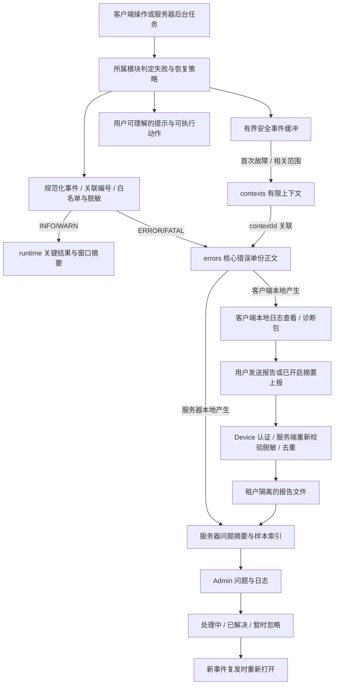

# LIRA 客户端与服务器日志、诊断及问题中心设计

状态：**In Progress**。首次调查：2026-09-13；容量复查与生产服务器只读核查：2026-09-14；同日用户要求按报告开始实施。当前仅进入阶段 A1（源头降噪、AI 成功汇总、现有客户端日志适配器的单条/队列/单文件保护），统一分流轮转、跨重启日预算、故障上下文、两端页面、服务器仓库和部署配置尚未实现。

本轮交付现状调查和设计，不改变运行程序、线上配置或既有日志。依据本地 `Live`、相邻 `lira-server` 工作区和 2026-09-14 经用户授权的生产服务器只读核查；包括本地旧日志匿名计数、临时合成实验、线上进程/配置/文件元数据。没有查询生产业务数据库，报告不复制用户日志正文或凭据。截图只用于确定客户端入口位置。

容量、正常输出精简及验证证据详见 [2026-09-14 专项报告](../docs/reports/2026-09-14-log-volume-and-signal-report.md)，第 6 节新增本机实际部署、目录配置和轮转责任。本草案已同步取消成功请求默认逐条落盘和错误全文双份保存，并保留线上现有 PM2 日志路径。

## 1. 目标与建议

让客户端用户能够找到故障记录、导出诊断信息；让管理员在服务器 Admin 集中看到问题、判断影响范围、追踪修复和复发。

建议采用“**统一事件格式 + 有限保留的日志文件 + Admin 问题聚合**”。沿用两个项目已有的 Node.js、Electron、SQLite 和 PM2，不引入独立日志服务。日志记录事实，问题中心组织处理，审计日志保留操作责任。

交付后应能回答：什么时候、哪个版本、哪个模块、哪次操作失败；影响哪些已观测设备/主播；是否重试、是否恢复；管理员何时处理、哪个版本修复、后来是否复发。

相关决策：[ADR-0018](../docs/architecture/adr/0018-unified-logging-and-diagnostics.md)。本文中的目录、限额与新增接口均为建议，不能视为已部署配置。

## 2. 目前是什么样

| 位置 | 已有能力与存储 | 当前不足 |
| --- | --- | --- |
| 客户端桌面壳 | `desktop.log` 追加记录启动、窗口、登录、更新、退出等；有时间、runId、顺序号、进程和 scope，并做凭据脱敏 | 文本与内嵌 JSON 混用，没有统一 level/errorCode；同步逐条写文件；没有轮转上限 |
| 客户端内嵌 Node 后端 | Electron 包裹主进程 `console.log/info/debug/warn/error`，镜像到 `terminal.log` | 初始化清空旧文件；只包裹所在进程 console；先向原 console 输出，再对文件内容脱敏；单独 `npm start` 不经过这层桌面镜像 |
| 客户端 AI | `ai.log` 记录 request、response、normalized_response、error，带独立 requestId；遮盖已知密钥、截断长字符串 | 创建 logger 时覆盖旧会话；仍保存非 system 请求内容、响应正文等；脱敏规则与桌面日志分离；日志写入被请求链等待 |
| 客户端页面 | `public/js/shared/logger.js` 输出到页面 console；个别功能有专用 IPC 日志 | 未发现统一的页面异常落盘、未处理 Promise 捕获及 renderer 崩溃接线；用 localhost 判断 debug，而正式 Electron 页面也从回环地址加载 |
| 截图入口 | 桌面更新页“本地数据 → 日志目录”，经 preload/IPC 调用 `shell.openPath(logDir)` | 只是打开文件夹，没有筛选、问题详情、导出或发送诊断 |
| 服务器运行 | `src/lib/logger.js` 输出一行 JSON，包含 time、level、msg；B 站连接、备份、维护等已部分使用 | 只有 info/warn/error；仍混有普通 console；没有统一脱敏、Error 序列化和上下文约束 |
| 服务器 HTTP | 分配/回传 `x-request-id`；未处理 HTTP 错误记录 requestId、method、path、message，生产响应隐藏异常正文 | 缺少统一请求耗时/完成记录和堆栈；部分异步任务没有关联 ID；传入 requestId 目前只截长，不做严格格式校验 |
| 服务器审计 | 默认 `admin/admin.db` 的 `audit_logs` 表；Admin 已有“审计日志”；API 返回最近最多 200 条，前端每页 50 条 | 记录管理行为，不是服务器错误检索/处理系统；没有问题分组、修复状态及客户端报告 |
| 部署侧 | 已核实宝塔 Nginx → 回环 3000 → root 所属 PM2 单实例；access 使用不含 query 的格式 | 已检查的线上 logrotate/cron 入口无 LIRA 匹配规则，PM2 无轮转模块；LIRA 原生代理错误继承全局 crit，存在覆盖缺口 |

### 2.1 现有目录的准确含义

- **已安装客户端**：`<LIRA.exe 所在目录>/logs/{desktop.log,terminal.log,ai.log}`。当前实现按安装目录解析，不能套用通用 Electron 默认路径，把它误写成 `%APPDATA%/LIRA/logs`。
- **当前客户端开发工作区**：`D:/Work/Live/logs/`；独立后端 AI 路径随其 `dataDir` 的父目录解析。
- **服务器**：已核实程序在 `/www/wwwroot/lira-server`，logger 只写 console；PM2 的实际应用文件为 `/root/.pm2/logs/lira-server-out-0.log`、`lira-server-error-0.log`，守护事件另在 `/root/.pm2/pm2.log`。当前项目 logs 及拟议的 `/var/log/lira-server` 均不存在；其他部署仍按其有效 PM2 配置解析路径。[PM2 官方说明](https://pm2.keymetrics.io/docs/usage/log-management/)
- **Nginx**：已核实实际访问日志为 `/var/log/nginx/lirahub.cn.access.log`，LIRA 站点配置在 `/www/server/panel/vhost/nginx/lirahub.cn.conf`；目前继承 `/www/wwwlogs/nginx_error.log crit`，没有专用 LIRA error 文件。
- **安装失败**：已有安装迁移错误文件 `%TEMP%/LIRA-install-error.txt`；`collect-install-diagnostics.ps1` 汇总相关 Windows 事件、安装包校验等，TXT 输出到脚本旁，写入失败则回退临时目录。它与应用运行日志分开。
- **原生崩溃目录**：现有 [ADR-0016](../docs/architecture/adr/0016-separated-client-data-lifecycles.md) 将 Crashpad 归于 `data/browser/Crashpad`。本设计保留该布局；目录约定不代表当前已开启完整 crashReporter 链路。

### 2.2 现状证据

客户端：[桌面 logger](../src/electron/desktop-logger.js)、[终端镜像](../src/electron/terminal-log.js)、[AI logger](../src/ai/request-logger.js)、[AI 内容记录](../src/ai/deepseek-client.js)、[页面 logger](../public/js/shared/logger.js)、[路径解析](../src/electron/desktop-user-data.js)、[共享目录](../src/shared/data-paths.js)、[独立后端配置](../src/server/runtime-config.js)、[截图页面](../public/pages/admin/toolbox/desktop-update.html)、[按钮接线](../public/js/desktop.js)、[IPC](../src/electron/ipc/update-ipc.js)、[安装诊断](../scripts/collect-install-diagnostics.ps1)。

服务器链接指向相邻工作区：[logger](../../lira-server/src/lib/logger.js)、[HTTP/启动/退出](../../lira-server/src/app.js)、[审计写入](../../lira-server/src/lib/audit.js)、[审计查询](../../lira-server/src/modules/admin/audit-logs.js)、[Admin 页面](../../lira-server/public/admin/index.html)、[PM2 配置](../../lira-server/ecosystem.config.cjs)、[Nginx 示例](../../lira-server/nginx/lirahub.cn.conf.example)、[B 站连接](../../lira-server/src/modules/bilibili/room-monitor.js)。

## 3. 日志如何分类、输出什么

分类、严重程度、模块是三个字段，不能互相代替。同一个 network 模块可以产生 INFO、WARN 或 ERROR。

### 3.1 分类与级别

| 分类 | 应记录 | 输出与用途 |
| --- | --- | --- |
| 运行 runtime | 低频生命周期、实际状态变化、关键任务结果、恢复事件；高频正常活动的窗口摘要 | INFO/WARN 写 runtime，排查关键过程；无变化探测不逐条落盘 |
| 请求 access | 请求完成时累计次数/失败量/延迟桶；失败、慢操作等例外样本带方法、路由模板、状态码、耗时和 requestId | 正常成功主要写窗口摘要；服务器 access 只存例外明细，不复制核心错误正文；SSE 正常续期/心跳不刷屏 |
| 错误 error | errorCode、安全消息、规范化堆栈、有限 cause、失败操作、是否可重试、关联 ID | ERROR/FATAL 核心只写 errors 一份；按问题聚合重复次数，界面合并时间线 |
| 审计 audit | 谁、何时、对什么对象做了什么、成功与否；后续增加问题状态变更、敏感报告人工查看/导出操作 | 沿用 audit_logs 及原事务语义；自动刷新列表不逐次新增审计，不与可清理的诊断文件混存 |
| 调试 debug | 临时排查所需的状态分支、重试细节、耗时分段 | 独立 debug 文件；主动开启，默认 15 分钟自动关闭 |
| 崩溃/安装 | 崩溃进程、退出原因、版本、上次会话；安装器错误与环境摘要 | 崩溃摘要进入 error，原生 dump 和安装 TXT 独立管理 |

| 级别 | LIRA 判定例子 | 用户与 Admin 表现 |
| --- | --- | --- |
| DEBUG | 同步判断、播放器切换分支 | 默认关闭；不影响正常功能 |
| INFO | 启动、同步完成、连接恢复、更新成功 | 不弹错误提示，不创建问题 |
| WARN | 短暂断网、正在重试、使用可用旧缓存 | 同一事件限频；持续异常才升级为待处理问题 |
| ERROR | 操作最终失败、保存失败、API 5xx、页面脚本异常 | 操作处给中文说明与关联编号；进入问题中心 |
| FATAL | 主进程无法安全继续、不可恢复启动失败 | 尽力保存诊断后退出/由监督进程重启；优先显示 |

用户取消、预期校验失败、正常退出、正常停播不记系统 ERROR。401/403/429 按具体原因记录轻量请求/安全摘要；不能把每次登录过期当成系统故障。数据库损坏等单次但严重的事件立即升级，不依赖次数阈值。

正常活动默认以 15 分钟窗口汇总，无活动/无变化不输出空摘要；分组键和活跃分组数均有界。重要操作结果、首次失败、原因变化和恢复继续保留。精简的故障前线索放入有界内存，首次故障按 contextId 保存有限相关上下文；不能把正常成功的全部历史永久保留当作诊断前提。具体缓冲、去重和准入规则见专项报告第 3—5 节。

### 3.2 按模块记录内容

| module | 记录的事实 | 不记录的正文 |
| --- | --- | --- |
| lifecycle / update | 应用/build 版本、会话起止、更新阶段、错误码、退出原因 | 环境变量全集、带签名的下载 URL |
| auth | 登录/续期/失效状态、认证后的内部引用、失败原因代码 | Cookie、token、授权码、密码、硬件指纹、密钥、加密凭据原文 |
| cloudSync / network | scope 名、操作 ID、耗时、重试次数、结果/计数 | 完整请求/响应、歌库和设置值、SSE handle、opaque cursor/page token |
| bilibiliConnection | 连接/认证/断开/重连、上游错误码、间隔 | 认证包、弹幕正文、用户 UID、原始 WebSocket packet |
| giftProcessing | 成功/失败计数、阶段、耗时、目录版本、操作 ID | 礼物流水明细、原始 payload、受现有协议保护的 event/cursor/身份字段 |
| playback | 音源类型、播放阶段、错误码、缓冲/解析耗时 | 本地媒体绝对路径、账号信息、带授权参数的音源链接 |
| ai | provider、model、purpose、耗时、token 用量、状态码、错误码 | prompt、聊天正文、模型完整输出、工具参数正文和 API Key |
| storage / backup | 逻辑库名、迁移版本、耗时、条数、备份结果、存储错误码 | 行数据、SQL 参数、数据库内容和备份内容 |
| logging | 写入故障、丢弃计数、队列积压、轮转/索引异常 | 再次记录导致故障的完整原对象 |

现有特定存储恢复契约要求在内部日志保留备份位置时，只按该契约记录；进入诊断 DTO/导出包再转为安全逻辑位置，不把路径透传前端。更严格的现有领域规范优先，DEBUG 和“发送诊断”不能放宽它们。

### 3.3 统一结构

文件使用 UTF-8 JSON Lines，一行一个事件。文件名可用 `.jsonl`，界面把字段转换为中文，用户不必阅读 JSON。保留稳定英文 event/errorCode 供程序检索。

| 字段 | 来源/语义 |
| --- | --- |
| schemaVersion、eventId | 格式版本；单次事件的去重 ID，与问题分组 ID 不同 |
| timestamp、receivedAt | UTC 发生时间；远端上报另记服务器接收时间，排序优先可信接收时间 |
| level、category、event、message | 严重程度、分类、稳定事件名、安全说明 |
| service、module、processType | client/server 与所属模块；main/localBackend/renderer/worker 等 |
| appVersion、buildId、environment | 真实运行版本与部署信息；开发/生产不由 hostname 推断 |
| runId、sequence | 一次进程启动和本进程顺序；不承诺跨进程全局顺序 |
| operationId、requestId | 一次用户/后台操作；单次 HTTP 请求编号，重试新建 requestId 并保留 operationId |
| streamerId、deviceId | 仅在允许的内部诊断上下文使用，服务端从已认证 principal 推导；不是授权证明 |
| error、durationMs、outcome、attempt | 按事件白名单选择；error 包含 code/name/message/stack/cause，有限深度和长度 |

没有的数据省略，不伪造 ID、版本或成功状态。`traceId/spanId` 只在未来真实接入追踪时添加，不把 UUID requestId 假称 OpenTelemetry traceId。借鉴其时间、级别、来源、关联字段语义即可，不要求立即安装 SDK。[OpenTelemetry 数据模型](https://opentelemetry.io/docs/specs/otel/logs/data-model/)

示例是虚构事件；实际文件应写成一行：

```json
{
  "schemaVersion": 1,
  "timestamp": "2026-09-13T08:30:00.000Z",
  "eventId": "example-event-1",
  "level": "error",
  "category": "error",
  "service": "server",
  "module": "cloudSync",
  "event": "cloudSync.writeFailed",
  "message": "云端设置保存失败",
  "requestId": "example-request-1",
  "operationId": "example-operation-1",
  "error": { "code": "SYNC_STORAGE_FAILED", "name": "Error" },
  "durationMs": 126,
  "outcome": "failed"
}
```

## 4. 输出目录、轮转和生命周期

### 4.1 客户端

继续使用当前解析得到的 `<安装目录>/logs/`；开发环境是 `D:/Work/Live/logs/`。

```text
<安装目录>/
  logs/
    runtime/app-2026-09-13.001.jsonl
    errors/error-2026-09-13.001.jsonl
    contexts/context-<contextId>.json # 首次故障的有限安全上下文
    debug/debug-2026-09-13.001.jsonl
    exports/                         # 临时生成的脱敏诊断包
    pending-reports/                 # 已获用户允许、尚未送达的有界摘要
  data/browser/Crashpad/             # 沿用既有目录，原生 dump 非普通日志
```

同一客户端主进程拥有文件写入；renderer 通过窄 IPC 提交规范化事件，不能选择文件名/目录。独立 Node 调试进程不能与 Electron 同时写同一活动文件：检测所有权冲突，使用单独 runId 文件或直接报运行冲突。窗口/worker 的上下文由其可信宿主注入。

原有 `desktop.log`、`terminal.log`、`ai.log` 首次升级时保留在原地，标为 legacy，只读且默认不进入上报包。新 logger 停止向旧文件写入；不在启动时清空它们。旧版无结构、无统一脱敏的数据不能直接导入问题中心。

### 4.2 服务器

新增可配置的 `LIRA_LOG_DIR`，开发默认 `<serverProjectRoot>/logs`，本机部署建议 `/var/log/lira-server`。线上旧版本尚未支持该配置，必须先实现配置读取与新 logger。使用实际运行账号拥有的专用目录；当前为 root，目录建议 0750、文件 0640，未来切换服务账号时再配套迁移所有权。业务逻辑不硬编码本机路径。

```text
/var/log/lira-server/
  runtime/app-2026-09-13.001.jsonl
  errors/error-2026-09-13.001.jsonl
  contexts/context-<contextId>.json   # 按认证租户/操作筛选上下文
  access/http-2026-09-13.001.jsonl
  debug/debug-2026-09-13.001.jsonl

/root/.pm2/logs/lira-server-out-0.log # 本机保留现有 PM2 路径，部署单独轮转
/root/.pm2/logs/lira-server-error-0.log
/root/.pm2/pm2.log                    # 同时计入 PM2 日志预算

<adminDbPath 所在目录>/diagnostics/diagnostics.db
<现有 streamersRoot>/<data_dir>/diagnostics/reports/<reportId>.json
<现有 adminDbPath>                   # 审计日志 + 低频的问题处理状态
/var/log/nginx/...                   # 反向代理继续拥有它自己的日志
```

诊断状态根默认派生自 `path.dirname(adminDbPath)`，本机为 `/www/wwwroot/lira-server/admin`；诊断库不能放到会整体清理的日志根。租户报告必须通过已认证 streamer 的现有 storage 路径所有者取得实际 data_dir，不能假设目录恒等于裸 streamerId。诊断库只保存平台运行的脱敏问题摘要、受影响内部引用及样本，不复制租户私有业务数据；客户端报告文件按租户隔离，不能公开静态挂载。管理员修改的问题状态放在 admin.db 的独立低频表，与对应审计在同一事务内提交；不需要跨两个 SQLite 数据库做伪原子事务。

**写入责任只有一份**：应用 logger 拥有 runtime/errors/contexts/access/debug 文件及其轮转；PM2 管理 stdout/stderr 与守护日志，本机优先复用系统 logrotate 并配置唯一轮转责任；Nginx 由部署侧单独管理。不得让 PM2、logrotate 和应用同时轮转同一个文件。生产普通事件以应用文件为主，不把所有日志再镜像一份 stdout；早期故障和写盘失败仍走安全 stderr。PM2 的 stderr 包含 WARN 等情况，不能把“stderr 文件”直接等同于 ERROR 数据集。

实际 `.env`、宝塔站点文件、日志重开机制、数据备份边界与部署顺序见专项报告第 6 节。Nginx 原生 error 上下文不受 path-only access 格式保护；降低 crit 级别或新增专用 error 文件之前，须先解决敏感 query/referrer 的落盘保护。第一阶段保留安全的代理失败访问摘要，不直接把原生错误文件挂到 Admin。

### 4.3 第一版建议默认值

| 数据 | 客户端 | 服务器 |
| --- | --- | --- |
| runtime | 7 天 | 14 天 |
| errors | 14 天 | 30 天 |
| contexts | 14 天 | 14 天 |
| access | 不单独常驻记录本地所有请求 | 例外明细 7 天；成功请求计数汇总 |
| debug | 24 小时，开启 15 分钟后停止采集 | 同左，服务器开启需管理员并限定模块 |
| 导出临时文件 / 客户端报告 | 临时包 24 小时 | 已接收报告 7 天 |
| 问题统计 / 样本 | 本地从近期文件读取 | 汇总统计 90 天，样本 30 天；处理状态随审计独立保留 |
| 现有审计 | 保留现有行为 | 保留现有行为，不跟随诊断清理 |

客户端单文件 10 MiB，日志根总预算 200 MiB；服务器单文件 20 MiB，应用与 PM2 日志合计预算 2 GiB。诊断库先以 256 MiB、报告存储合计 500 MiB 为预算并设置租户限额。以上是起始容量，不是对现有规模的测量。

总预算是应急保护，正常写入另设客户端 1 MiB/日、服务器应用 5 MiB/日预算，关键错误/恢复/审计不共用；客户端无操作、无变化、无异常的 24 小时普通日志目标不超过 64 KiB。各流更小的容量、文件数、DEBUG 会话、临时包、上下文、部署侧及审计归档建议统一列于专项报告第 5 节；不能用文件轮转替代源头精简。

按日期或文件大小先到者轮转，只清理归自己所有的已关闭文件；保留天数、文件数与空间上限先到者生效。写入前按实际编码字节准入，活动文件、临时文件与压缩副本计入预算；重启恢复有界持久化的当日已用/预留额度，清理旧分片不退还当日额度。界面显示实际可查时间范围和丢弃计数，不保证空间不足时仍保存足额天数。优先清理 DEBUG、旧 runtime/access，再清理旧错误样本；索引超限优先削减样本并告警，不静默丢掉仍待处理的问题状态。SQLite 预算必须包含 WAL/SHM，删除行后文件不会自动缩小，维护要检查实际空间并安排受控回收。

legacy 计入已知占用但保留只读，未知文件不能擅自清理；存量超预算须显示并限制新增日志，不能宣称已自动降至上限。PM2/Nginx 周期轮转可能在检查间隔内超出目标，严格物理边界需要部署配额。审计及问题处理状态采用独立保留/归档政策，不能让普通日志清理器截断 admin.db。

原生 dump 默认不自动上传、不加入普通诊断包；由 Crashpad/明确的崩溃维护流程管理，不能为清日志删除整个 `data/browser`。用户另存到指定位置的导出文件不属于后台自动清理范围。

## 5. 报错之后如何输出和处理

### 5.1 一次故障的完整流程



同一异常原则上在能判定操作结果的所有者/统一边界记录一次完整错误。下层返回错误，上层补充操作关联，不逐层重复打印堆栈。runtime/errors 按级别分流，错误正文不复制；access 如需保留结果/耗时，可引用 requestId，但不再附一份错误栈。查看器按事件时间、runId/sequence 合并时间线，问题只按核心失败事件计数；重复失败按增量汇总并保留实际覆盖范围。

远程 API 失败时，客户端保存响应的 requestId；UI 提示例如：“设置保存失败，请重试。问题编号：…”。服务器查此编号即可找到失败请求。网络请求未到服务器时只显示本地 operationId，不能假装已有服务器记录。客户端收到服务器已记录的 5xx 时，可作为该问题的客户端影响/上下文，不再凭相同响应制造第二次服务器故障计数。

### 5.2 不同故障的行为

| 情况 | 输出和处理 |
| --- | --- |
| 一次短暂断网、允许的上游重试 | 首次 WARN，后续按时间窗口汇总重试次数；遵循原领域重试策略；恢复记 INFO。持续 5 分钟等初始阈值到达才提升问题优先级 |
| 操作失败/API 5xx | ERROR + 安全堆栈 + requestId；向用户返回稳定错误码/可读提示；不把栈、路径、密钥返回普通页面 |
| 数据保存失败 | 明确告诉用户尚未成功保存；不因日志模块建议而自动清数据库、补写或重放有副作用的业务操作 |
| renderer 的脚本异常/未处理 Promise | 本地页面监听 error/unhandledrejection，通过受限桥提交；主进程注入真实窗口/版本信息。媒体加载失败、用户取消分别处理，避免大量误报 |
| renderer 退出、GPU/子进程崩溃 | 记录进程类型、原因、退出码；主窗口显示适当恢复动作。不能因日志功能自动重载正在播放/编辑的页面 |
| Node/Electron main 未捕获异常 | 最小同步安全记录作为最后兜底；终止不可信运行状态。服务器让 PM2 按退避/重启上限恢复，客户端下次启动提示上次异常退出 |
| OOM、强制结束、断电 | 不保证最后一条日志或 dump 完整；根据上次启动/正常结束标记展示“上次未正常结束，原因待确认”，不直接断言程序崩溃 |
| 磁盘满/权限不足/文件锁 | 不递归记录日志错误；有界内存缓冲 + 限频安全 stderr；UI/health 的日志状态显示降级和丢弃量；仍有可用 sink 则继续业务 |
| 索引不可用 | 文件采集继续；Admin 明确显示索引故障、最后入库时间和查询不完整，不能显示成“没有错误” |
| 服务器进程停止 | 同机 Admin 也可能打不开；排查依靠 PM2/Nginx/主机日志。要主动发现全站停机，需要后续接已有外部探活；本功能自身无法观测自己的完全停机 |
| 安装器未能启动客户端 | 继续使用独立安装诊断脚本；不能要求用户进入打不开的应用才能导出 |

主进程捕获不能实现为 `uncaughtException` 打一条日志后继续运行；可使用不改变退出语义的 `uncaughtExceptionMonitor` 做最小观测。正常退出可以等待有界 flush，致命异常不要运行任意异步修复或开启新业务事务；未处理 Promise 不应被“只记录不退出”的监听器吞掉。[Node.js 异常处理说明](https://nodejs.org/docs/latest-v24.x/api/process.html#warning-using-uncaughtexception-correctly)

原生崩溃收集作为后续独立能力，Electron main 初始化 `crashReporter` 时显式设置 `uploadToServer: false`，保留既有 Crashpad 路径；JS 错误栈与原生 minidump 分开处理。原生符号文件按 buildId 在维护端保存，不进入普通安装包/公开页面。[Electron crashReporter](https://www.electronjs.org/docs/latest/api/crash-reporter)

## 6. 客户端和 Admin 页面设计

### 6.1 客户端：放在截图的“本地数据”卡片

保留已有三个按钮和含义，新增下一行诊断动作，避免挤满一排：

```text
本地数据
歌库、设置等数据独立存储，更新不影响已有内容。
[数据目录] [日志目录] [项目主页]

运行与诊断                     日志保存正常 · 可查看最近 7 天
[查看日志] [导出诊断包]
```

“查看日志”打开当前客户端的诊断面板，默认显示本次运行的 WARN/ERROR；提供时间、级别、模块筛选和“只看错误”。详情显示中文说明、时间、版本、问题编号、安全技术信息、复制动作。高级区域显示真实目录、临时调试开关与到期时间。面板只读取当前本机合法范围内的记录。

“导出诊断包”允许选择本次运行/最近一小时/最近一天，预览文件类型、条数和大小，再通过主进程保存对话框选择位置。包内建议只含 `manifest.json`、`environment.json`、脱敏事件和用户自填复现说明，默认最大 10 MiB；不打包整个 data、不含数据库、浏览器 profile、凭据、完整歌单或原生 dump。

后续增加“发送问题报告”，说明发送到当前配置的 LIRA 服务器，显示成功返回的报告编号。提供独立“自动发送错误摘要”开关，首次明确说明采集内容，由用户开启；开启后后台限量上报，无需每次点击。完整日志不因开启摘要上报而自动上传。未登录、凭据已撤销或服务器不可用时仍能本地导出。

本轮用户授权的是设计；以上是产品内最终用户的信息控制流程，并不要求为这次写设计文档再次确认权限。

### 6.2 服务器：Admin 新增“问题与日志”

保留“审计日志”的现有独立入口及 `/admin/audit`。在其附近新增“问题与日志”，目标地址建议 `/admin/diagnostics`。

```text
问题与日志
[待处理 8]  [今日新增 3]  [已观测受影响设备 5]    采集正常 · 刚刚更新

[问题列表] [服务器日志] [客户端报告]
时间范围  来源  严重程度  模块  版本  主播/设备  [问题编号/关键词]

优先级  问题摘要          次数  受影响范围  首次/最近发生  状态
高      设置保存失败      18    3 台设备    …             待处理
中      B站连接持续中断    7    1 位主播    …             处理中
```

数字均为布局示意，实际必须来自查询。“受影响”指已收到证据的范围，不把未启用上报、离线或未上报设备算成无故障，也不把上报样本数称为全部发生次数。

点击一条问题，右侧详情分为：中文摘要、影响范围/版本、首次与最近发生、发生次数与采样说明、错误码与安全堆栈、最近相关事件、关联 requestId/报告、处理记录。状态可设“待处理、处理中、已解决、暂时忽略”；解决时记录修复版本/说明，操作进入现有审计链路。

问题列表默认按严重程度、是否新出现/复发、影响范围、最近活跃排序，不单纯按报错条数排序。第一版站内提示即可；外部邮件/聊天告警作为以后显式配置的出口，不在本轮自动发送任何消息。

### 6.3 同类错误如何合并

参考成熟错误平台按异常特征归组的做法，LIRA 建议 `fingerprintVersion + service + environment + module + event/errorCode + exceptionType + 规范化应用栈特征`。去除绝对路径前缀、行号扰动和动态参数；没有栈时按稳定 event/errorCode 分组。分组键不含时间、requestId、主播、设备或完整 message；build 版本作为筛选维度，便于识别修复后复发。[Google Cloud 错误分组](https://docs.cloud.google.com/error-reporting/docs/grouping-errors)

自动分组是相似性判断，不能显示为已确认根因。具体来源、原始安全样本和 fingerprint 算法版本必须保留，便于判断误合并。每组保留有限代表样本，其余累加计数/时间段。

新发生事件到达已解决问题时重新打开，并记录“复发”。延迟上传的旧事件依据发生时间与修复版本判断；时钟不可信时标注待确认，不用 receivedAt 武断认定复发。版本比较使用实际版本/build 对照，不能直接比较任意字符串。暂时忽略设置期限；仍累计事件，期限到达且有新异常时再提醒。[Google Cloud 问题状态管理](https://docs.cloud.google.com/error-reporting/docs/managing-errors)

## 7. 实现边界、权限和可靠性

### 7.1 所有者与接线

| 所有者 | 职责 |
| --- | --- |
| 客户端 `src/shared/` 日志工具 | 事件序列化、通用脱敏与安全字段辅助；不导入 Electron、HTTP 路由或业务服务 |
| Electron main / 独立 Node 组合根 | 创建 logger、配置路径/级别、接入生命周期并在正常退出时有界 flush |
| 各业务模块 | 选择 event/code、白名单上下文、正常/重试/失败/恢复语义；通过显式 logger 依赖输出 |
| renderer 与 preload | 本机日志面板、事件提交和文件选择的窄桥；不暴露 Node fs、任意路径或凭据 |
| 服务器 `src/lib/logger.js` 及 `src/app.js` | 升级已有入口，组合根配置 sink；HTTP 请求上下文覆盖认证、请求完成和错误边界 |
| 服务器 diagnostics 模块/存储 | 诊断库的有界问题投影/样本/报告引用；admin.db 的低频状态与审计事务；存储实现归 `src/storage/`，路由只编排 |
| Admin 页面 | 显示受保护查询结果、筛选、翻页、处理问题；不执行 shell、不读取 PM2 控制口 |

不跨仓库引用源文件。两个项目各自实现小适配器，以相同版本 fixture 验证 envelope、脱敏、关联编号规则。客户端页面 logger 改为由可信启动配置控制 debug，不能继续将正式 localhost 页面当作开发模式。

日志主体先按白名单与有界输入规模选择字段，再统一处理 Error/cause/循环引用/BigInt/字符串；遍历深度、字段数、数组长度和最终编码字节数均受限。普通结果/请求样本/摘要上限 2 KiB，错误核心 16 KiB，独立上下文 64 KiB，超长可选字段明确标记截断；调用者不得覆盖可信 level/service/process/tenant 等字段。文件、终端、内存缓冲、查询、上报和导出均受保护，不能仅对其中一个出口脱敏。console 兼容适配必须在恢复原 console 时正确解绑，避免递归/双重输出。

### 7.2 服务器查询和客户端上报

以下为接口职责草案，最终 wire schema 在两端协议/OpenAPI 中定义后再实施：

| 接口建议 | 职责与范围 |
| --- | --- |
| `GET /api/admin/diagnostics/issues` | 游标分页的问题摘要；默认 50、最多 200；索引查询 |
| `GET /api/admin/diagnostics/issues/:id` | 安全样本、发生统计、关联报告和处理记录 |
| `PATCH /api/admin/diagnostics/issues/:id` | 带版本检查的状态修改，避免两个页面覆盖；admin.db 内状态与审计同事务，失败一起回滚 |
| `GET /api/admin/diagnostics/events` | 近期服务器文件中的事件，按登记的逻辑流和游标读取 |
| `GET /api/admin/diagnostics/reports` | 客户端报告列表；按认证授权后可见的范围读取 |
| `GET /api/admin/diagnostics/reports/:id` | 经过安全 DTO 投影的报告；不返回原始存储路径 |
| `GET /api/admin/diagnostics/health` | 最近写入、轮转、索引延迟、存储占用/降级状态 |
| `POST /api/device/diagnostics/reports` | Device 凭据上传有界结构化摘要，持久化确认后返回 reportId |

Admin 第一版复用现有 `adminAuth + superAdmin`，仅 `super_admin` 可跨租户查看/处理/导出诊断；普通 Admin 暂不赋予跨租户运行日志访问。客户端、主播、overlay 和公开页面不能访问此组接口。限定管理 Host 和现有会话规则；状态修改需精确校验 Origin 为配置的管理 origin、要求 JSON，拒绝跨站表单，沿用项目既有更严格防护，返回 `Cache-Control: no-store`。若希望普通 Admin 也能使用，需明确相应角色要求，不能仅隐藏导航。

日志浏览的第一版是“有界近期查询”，不是无限历史全文搜索：默认最近一小时，单次选择最长一天，按已登记日期/分片顺序流式扫描，每次最多 100 条结果、16 MiB 扫描或 1 秒预算。响应给出实际扫描范围、nextCursor/partial；超范围可继续翻页或下载指定分片。UI 不得把部分扫描结果写成“没有匹配日志”。关键词为限长字面量，不执行用户正则、SQL 或 shell；游标不接受文件路径。历史问题统计由索引查询，不扫描整个日志目录。

服务端从 Device 认证结果取得真实 streamerId/deviceId，忽略上报 payload 中声称的租户/角色。主体长度、event/code 枚举、字段数量、堆栈和用户复现说明都有限额；自动摘要每项最多 16 KiB、主动报告最多 128 KiB。初始速率可设每设备每分钟 10 次、每日 100 次，并有单租户/全局上限，超过返回可重试限流响应。

上报采用结构化 JSON，不接受任意 ZIP、任意路径附件或截图链接代取。主进程只访问已配置并验证的 LIRA HTTPS 服务器。用户自填文本作为不可信数据，服务端二次脱敏；Admin 用 textContent/安全文本渲染，绝不执行日志中的 HTML。

客户端只重试已允许发送的摘要；网络/5xx/429 指数退避并遵守 Retry-After，401 仅按现有主进程认证流程恢复，403/撤销/明确无效请求停止发送。队列先受字段白名单保护，最多 200 条/5 MiB/7 天，超限合并重复或丢弃并记计数。退出账号/切换服务器时暂停旧队列，不能把 A 主播的历史报告用 B 的凭据发送；关闭自动上报立即停止后续上传。

服务端按“认证后的 deviceId + 客户端 eventId/reportId”去重。原始记录需要先持久化到自有文件/事务，才确认收到；断线后重试返回同一报告编号。问题索引可以异步投影，使用稳定事件 ID 和检查点恢复；文件尚未索引时显示延迟，重放只覆盖仍保留的源记录，不能声称可从 30 天日志完整重建 90 天统计。处理状态按稳定 issueKey 保存在 admin.db，不能当作可随意重建/删除的缓存；复发状态变更也与审计同事务。文件与诊断 SQLite 不做伪原子事务，失败重放需幂等。

跨层 requestId 只用于关联，不能授予权限。现有 `x-request-id` 保持响应兼容；入口只接受合法格式/长度，非法则重新生成。反向代理已有 ID 可信与否应由部署入口约束，客户端同一 ID 不能被当作另一租户操作。优先使用认证上下文过滤，再按关联 ID 检索。

### 7.3 性能、完整性与隐私约束

- 普通写入采用单写者有界队列、异步批量 append；业务请求不等待常规日志磁盘 I/O。初始队列上限 2,000 条/4 MiB，先丢 DEBUG 和重复 INFO，为 ERROR 保留容量。仍溢出时明确计数，不能承诺永不丢日志。
- 正常退出 flush 最长 1 秒，必须纳入既有 playback flush/服务关闭顺序，不能抢先退出或无限挂起；fatal 使用最小应急同步输出。模块卸载负责释放 listener/timer。
- 请求完成时更新全量轻量计数，正常成功不逐条落盘；代表性事件可以采样。进程重启、限流或容量超限造成的不完整必须显示；不把样本数或推算量标为准确总量，不从采样 access 文件计算精确失败率。关键业务失败仍由所属模块报告，不只依赖 HTTP 状态码。
- 高频心跳、音频进度、弹幕、单条礼物推送不逐条 INFO；记录状态转换、窗口计数和明确失败。离线小游戏已有“本地状态不上传/不落日志”边界继续遵守。
- 不复制审计秘密；敏感管理操作已有审计事务失败回滚的语义照旧。普通诊断写入失败可以降级，这条原则不能套到安全审计事务上。
- 客户端目录使用当前用户权限，Linux 日志目录建议 0750、文件 0640；导出/报告目录不经 Express/Nginx 静态暴露。查询与下载只允许登记的流/报告 ID，并验证真实路径仍在指定根内、拒绝符号链接逃逸。
- 独立安装诊断 TXT 和旧日志可能含用户名/系统路径；默认不自动附加。需要主动导出时按单独白名单收集并预览。原生 minidump 可能包含内存中的秘密，不能声称普通文本脱敏可清理它。
- 日志保留/清理只作用于该子系统自己的文件。报告到期及主播永久删除时，要联动清理该租户诊断附件和私有引用；审计与法定/现有备份边界遵循其独立政策，不能冒充彻底抹除所有历史。

## 8. 分阶段落地与验收

### 8.1 实施顺序

| 阶段 | 交付 | 对用户的价值 |
| --- | --- | --- |
| A：先保证日志可信且有界 | 源头精简/格式/脱敏/级别/容量准入；有限故障上下文；停止覆盖旧会话；分级后补齐页面异常、服务器错误和 requestId；保留安装兜底 | 正常少写，出问题有可用证据，重启后还能查 |
| B：两端诊断入口 | 客户端查看/导出；Admin 服务器问题聚合/状态处理/近期日志/采集健康 | 管理员可以集中排查服务器、追踪处理 |
| C：客户端问题汇总 | 主动发送、可选自动摘要、Device 认证/去重/限流/离线队列，Admin 报告关联 | 客户端与服务器问题能在同一处查清 |
| 后续按实际需要 | 原生 dump、外部停机探活/通知、外部日志平台 | 补齐原生崩溃或规模增长场景，不阻塞前三阶段 |

实施前按 [PLANS.md](../PLANS.md) 建立跨边界实施计划。客户端新增 IPC/关闭接线、日志持久格式和服务器诊断 API/存储属于高风险，不能按普通按钮改动交付。

服务器改动须同步 requirement、acceptance criteria、management/device protocol、OpenAPI、fixture、测试及相应 ADR；具体依照相邻仓库 [文档权威规则](../../lira-server/docs/README.md)。本草案不覆盖其现有礼物、凭据、租户、小游戏规范。两个仓库已存在其他任务的未提交修改，实施时必须保留。

先升级服务器接收与查询，再发布带新能力的客户端；旧客户端继续现有契约。新客户端遇到尚不支持的诊断 API，明确提示“当前服务器不支持”，保留本地导出。格式带 schemaVersion；首次过渡保留旧日志只读，不回写旧版文件，也不清理业务 data。回退时可关闭新诊断/上报，保留文件与已有问题状态，不破坏账号、同步或播放功能。

### 8.2 验收标准

1. 连续启动两次仍可查看第一次的错误；按时间和大小正确轮转，超预算清理不碰 data、未知文件、活动文件或另存的导出包。
2. 同一故障只有一份核心错误正文；runtime/access 不复制完整堆栈，查看器正确合并时间线；重复上报、超时重试、重启恢复不重复计数。
3. 页面脚本报错、未处理 Promise、远程 5xx、业务保存失败、B 站持续断线均能产生正确级别/模块/关联编号；取消、正常停播不误报。
4. requestId 可从客户端失败提示追到服务端事件；多个并发租户请求不串上下文。随机/伪造 ID 无法绕过授权。
5. Cookie/token/API Key/授权码/硬件指纹/敏感 URL/聊天正文等 fixture 在文件、console、异常 cause、上报、导出与 Admin 中都不出现；嵌套循环和超长对象不导致 logger 抛错。
6. 磁盘满、权限拒绝、队列满、索引锁定时不拖垮业务，出现可见的采集降级和丢弃数量；安全审计失败仍遵守原有事务回滚。
7. Admin 未登录/普通 Admin/Streamer/Device/Overlay/错误 Host 的越权请求均被服务端拒绝；客户端不能指定租户、读取任意文件或注入可执行 HTML。
8. Admin 筛选和游标翻页有明确扫描边界；新旧日志轮转时游标失效返回稳定提示；大文件查询不整文件同步读入、不阻塞直播处理。
9. 问题解决/忽略进入审计；新版本复发重新打开；旧报告迟到不会误判新复发。采样与实际观测范围清楚显示。
10. 客户端导出仅包含预览范围；未选择发送不上传。退出/换账号/撤销设备/关闭上报后不会把旧租户队列发出。
11. 使用临时目录/数据库做致命异常、重启/去重和容量测试；不拿真实用户 data、安装目录或生产服务器做故障注入。
12. 正常空闲 24 小时普通日志不超过 64 KiB；高频成功礼物/歌词/心跳不逐条落盘，没有空摘要/空分片；Admin 自动刷新不造成审计或诊断刷屏。
13. 单条普通/错误/上下文、每日普通写入、活动与临时文件、总文件数及有界内存同时受限；跨日、重启、时钟异常不绕过容量保护。PM2/Nginx 的部署验证与应用验证分开。
14. 错误风暴保留首次详情、原因变化、重复增量与恢复；上下文按租户/操作筛选且显示实际覆盖范围，超预算显示损失而不宣称无错误。具体负载与限额见专项报告第 9 节。

### 8.3 本轮已经完成的验证

- Node.js v24.15.0 下，客户端 `node --test test/terminal-log.test.js test/ai-request-logger.test.js test/log-redaction.test.js`：13/13 通过。现有测试也明确验证 terminal/AI 覆盖旧会话，这是待改变的当前行为，并非本方案已实现。
- 服务器 `node --test test/http-log-privacy.test.js`：2/2 通过，验证 HTTP/Nginx 的 path-only 约束。
- 2026-09-14 复查补充本地旧日志匿名计数、AI logger 临时合成大事件实验、容量算例与线上部署只读核查；已验证 PM2 实际路径、账号、模式、Nginx 配置和日志文件描述符，当前 Nginx 配置检查通过。这不代表已实现新容量控制。
- 新文档本地链接与代码围栏检查通过，`git diff --check` 通过；2026-09-14 的 `npm run verify:docs` 为 5/5 通过。本次仅修改报告/设计，未重复运行前次的运行代码测试。
- 线上仅查询允许的 PM2 运行字段、部署配置及文件元数据，未导出生产日志正文、秘密或业务数据；未执行部署、日志清理、PM2 重开/重启、Nginx 重载或原生崩溃试验。

**完成条件**：上述仅是设计交付。只有各阶段对应的功能、协议、验收测试和必要的 Electron/Admin 运行检查通过后，才可把规格状态改为 Implemented。

## 9. 参考实践与取舍

| 官方来源 | 本设计借鉴 | LIRA 的取舍 |
| --- | --- | --- |
| [OpenTelemetry Logs Data Model](https://opentelemetry.io/docs/specs/otel/logs/data-model/) | 时间、严重程度、来源、结构化属性与关联信息 | 先统一可映射的字段，不立即引入 Collector/SDK |
| [Google Cloud Error Reporting](https://docs.cloud.google.com/error-reporting/docs/grouping-errors) | 将类似异常组织成问题组 | 自有简单分组和有限样本，规则可解释，不声称自动确定根因 |
| [Google Cloud 问题管理](https://docs.cloud.google.com/error-reporting/docs/managing-errors) | 处理状态与复发管理 | 适合单管理员的轻量处理流程，不建设工单平台 |
| [PM2 Log Management](https://pm2.keymetrics.io/docs/usage/log-management/) | 显式输出路径与轮转责任 | 保留 PM2 监督进程及启动故障兜底，与应用主日志分工 |
| [Electron crashReporter](https://www.electronjs.org/docs/latest/api/crash-reporter) | 原生崩溃与上传控制 | 原生 dump 独立、默认不上传，保持已有数据目录 |
| [Node.js 异常处理](https://nodejs.org/docs/latest-v24.x/api/process.html#warning-using-uncaughtexception-correctly) | 致命错误记录与退出语义 | 不靠吞异常维持表面运行 |

保留周期、目录配额、页面布局、接口职责和分阶段顺序是针对 LIRA 的设计建议，不是这些项目的统一标准。若实际日志量、查询延迟或多实例部署突破有界文件/SQLite 的能力，再依据测量引入外部日志后端；当前直接部署大型日志集群会增加额外运维工作。
