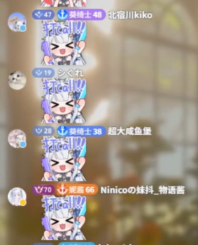
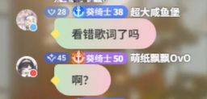
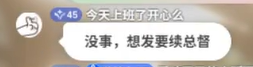

# Feature: 流霞固定弹幕

**Status:** In Progress — 主题、双端展示投影与设置已实现，隔离验收通过；真实上游/实播及契约版本锁核验未完成。
**Last reviewed:** 2026-10-08

## Goal

在弹幕姬的「固定弹幕」中新增一种样式，尽量还原用户提供的五张参考图：左侧头像、上方 B 站身份栏、下方文字气泡或透明表情包，以及紧凑的白色送礼通知。样式名「流霞」，运行时样式键 `prismatic`。

身份栏使用 B 站原始勋章、图标和配色；普通弹幕昵称统一白色。文字气泡按大航海身份区分柔和彩色与白色，每条彩色消息独立配色。复用现有固定列表、消息渲染和设置通道，适用于 OBS 与哔哩哔哩直播姬的浏览器源。

本文件定义目标与验收，不能作为功能已交付的证明。当前运行时契约仍由[弹幕姬技术参考](../docs/reference/frontend/overlays.md#61-弹幕姬)、[本地弹幕管线](../docs/reference/backend/bilibili/danmaku.md)及 LIRA Server 的 `docs/protocol/public-overlay-api.md` 维护。

## Context 与证据边界

用户已明确：新增固定样式；表情包/图片的内容区透明；舰长、提督、总督的文字弹幕使用每条不同的混色气泡；无大航海使用白色气泡；身份信息贴近 B 站；**只显示当前直播间的粉丝牌**；礼物参考图 4/5；先完善文档，随后已明确授权实施。

2026-10-08 查看了[直播间 26832833](https://live.bilibili.com/26832833)的真实页面、弹幕与礼物 DOM，并检查该页加载的官方渲染代码和公开资源接口：

| 已核对事实 | 对实现的意义 |
| --- | --- |
| 荣耀勋章资源表包含 1～80 级原图，组件按等级查图；网页显示尺寸为 36×16 CSS px | 等级数字、形状和颜色直接来自官方原图，按组件倍率同比缩放；此范围是采样时的资源覆盖，不作为永久等级上限 |
| 现场分别出现「荣耀 28 / 葵绮士 38」「荣耀 47 / 葵绮士 48」 | 荣耀等级、灯牌等级必须独立读取，不互相推算 |
| 「葵绮士」牌子的所属主播标识为 `3493115843315726`，同时出现属于其他主播的「自麂人」舰长灯牌 | 佩戴牌上的大航海图标不等于当前直播间大航海；所属主播 UID 也不等于房间号 |
| 灯牌实际使用如 `#4C7DFF99`、`#A773F199` 的颜色，边框色另有字段 | 保留透明通道与独立边框色，不按等级臆造固定色表 |
| 现场送礼行包含荣耀原图、昵称、礼物名称与数量 | 普通弹幕和礼物可以复用荣耀勋章渲染；金额仍来自已结算礼物数据 |

这是页面显示与官方客户端代码的证据，**不是 LIRA 已完整接收到相应字段的原始 WebSocket 抓包证据**。尤其是礼物荣耀字段、`dm_v2` 覆盖及本房间身份语义，仍需在接入前核验。

## 视觉参照

以下是用户提供的原始设计参考，作为文档资产保留；背景视频、人物和画面模糊不属于弹幕组件。设计参考不依赖临时剪贴板文件，也不是已经实现的预览图。

| 图 | 参照内容 |
| --- | --- |
|  | 表情包、头像与身份栏的位置及比例 |
|  | 大航海文字气泡的混色、轮廓和留白 |
|  | 无大航海的文字气泡 |
|  | 单件礼物通知 |
|  | 礼物行的纵向高度、横向对齐与文字密度 |

### 还原标准

- 透明画布上纵向堆叠消息。头像为小圆形，位于整条消息左侧；身份栏在内容上方，气泡和表情从身份栏左缘起排。头像、徽章、文字、间距随已有画布倍率整体缩放。
- 长昵称紧接徽章继续排版，到内容区域右边界才换行，不将整个昵称提前移到第二行。
- 身份栏按「荣耀勋章 → 大航海图标及当前房间灯牌名称/等级 → 昵称」组织，缺失项不留空槽。大航海图标优先置于灯牌左侧，与 B 站原牌结构一致；已知本房间大航海但无可展示灯牌时可单独显示图标，避免重复出现两枚相同图标。
- 荣耀勋章使用原图；灯牌采用饱满的胶囊圆角，按上游有效颜色渲染，含文字色和透明度；昵称为白色，可用轻微暗色文字阴影保证视频背景上的可读性。活动头衔、房管标识和会员彩色昵称不自动加入本次范围。
- 气泡为紧凑圆角轮廓，短句随内容收缩，长句换行后自然增高。大航海气泡使用浅粉、淡黄、浅青、薄荷等柔和色块融合，按用户追加要求移除左侧黄色装饰；普通观众使用图 3 的白色轮廓及小尾部。正文均为清晰深色。
- 背景混色以静态柔和融合为主，不增加循环流光、强烈发光或持续变色。保持图中的紧凑密度，不扩成大卡片。
- 以原图并排对比轮廓、比例、相对位置、混色柔和度和文字密度。原图分辨率较低，字体文件和原始 CSS 未提供，因此不承诺逐像素完全一致；官方徽章与颜色可以直接对齐原始资源。最终字号、圆角、内边距在实际设计尺寸下对照原图校准，不把裁剪图中的像素值硬套到画布逻辑尺寸。

## Requirements

### 消息类型与身份规则

| 输入 | 必须呈现的结果 |
| --- | --- |
| 独立表情包/图片，任意身份 | 保留头像和身份栏；内容区完全透明，无文字气泡底色、气泡尾部或混色装饰；保持图片比例和动图能力 |
| 文字或文字夹小表情，本房间舰长/提督/总督 | 深色正文与柔和混色气泡；身份栏配色仍按官方规则，不随气泡变色 |
| 文字或文字夹小表情，明确无本房间大航海 | 白色气泡；仅有粉丝牌、荣耀等级高或主播标记均不自动触发彩色气泡 |
| 本房间大航海身份未知 | 使用中性白色外观，不将缺失值推断为真实无大航海，不借用其他房间身份 |
| 礼物事件 | 同一固定列表中的白色长胶囊，详见下节 |

本房间大航海作为彩色判定依据，是本草案沿用「只显示当前直播间身份」的设计解释；用户明确确认的是粉丝牌范围。本房间大航海与佩戴灯牌必须在数据层分别处理，不能直接用佩戴牌上的 `guard_level` 替代。

粉丝牌只展示已证明属于当前房间主播的资料。佩戴其他房间灯牌时不显示该牌；只有已有、有效的本房间身份资料能提供当前房间牌时才显示。资料未知时隐藏，不伪造名称/等级，也不新增每条弹幕查询所有粉丝牌的流程。

仅明确标记为独立 `sticker` 的表情包采用透明内容区；`inline` 小表情与正文等高（`1em`），单独、重复或夹在文字中发送均保留对应身份的弹幕背景。流霞中缺少类型标记的表情也按文字大小保留气泡；其他样式沿用既有兼容分类。不能只凭图片尺寸或出现 `` 来判断整条透明。本次不新增文字与大图交替组成多段气泡的富消息机制。

### 每条不同的混色

- 配色单位是消息，不是用户、舰队档位或内容文本。同一人连续发送相同内容，也应获得不同配色。
- 从 12 组柔和色系中按消息稳定选取，再变化各颜色的色相、饱和度、亮度、混合方向、两处色块位置及扩散比例；同屏彩色消息应有可辨识差异，相邻消息不可使用相同配方，不退化成固定配色循环。
- 每条消息首次进入展示时确定配色；滚动、图片加载、窗口缩放、相同快照及 DOM 重建时保持该消息颜色稳定。不能在每次 render 中重新调用随机数，也不能只使用列表下标。
- 使用已有事件身份/序列及渲染上下文保持消息级配色，必要时在现有有界展示状态中保存分配结果；消息退出时同步释放，不新增无限增长的颜色历史或业务持久化字段。
- 配色在既有样式装饰函数中同步完成，使用三层静态 CSS 渐变绘制，不增加网络请求、图片生成、等待队列、计时器或循环动画；普通观众和礼物跳过混色计算。

### 大航海与 SC 感谢卡（2026-10-09 追加）

大航海购买使用居中圆头像、白底昵称和感谢文案的渐变卡：舰长珠光香槟金、提督冰蓝紫晶、总督浓郁玫瑰金，以多段渐变和静态高光形成层次。右下角用粗体白字显示本次人民币结算总额的上半部分，下半部分沿卡片底边裁切；缺失或非法金额省略，不重复乘数量。开通／续费读取明确的 B 站通知动作，未知时显示“感谢支持”；陪伴天数优先使用当次通知的明确天数，否则按绑定房主与观众 UID 读取陪伴榜 `accompany`，缺失时省略，不换算购买月数或使用本地补录。SC 为薄荷至粉色渐变，上方昵称与右侧白色 CN¥ 金额胶囊，下方完整原文与换行；不显示头像和金额旁圆点，保持实际金额。大航海与 SC 卡片均铺满弹幕内容区，与容器左右边缘对齐，沿用现有画布安全留白；共用字号基准，SC 昵称和正文左边线一致、金额靠右。长内容超出可用高度时缩小字号并重新换行，保留卡片宽度和完整文本。

参考：[大航海卡片](../docs/images/danmaku-prismatic/reference-06-guard-thanks.png)、[SC 卡片](../docs/images/danmaku-prismatic/reference-07-superchat.png)。名单解析复用粉丝档案的 `src/shared/bilibili-guard-roster.js`；Server 镜像在 `src/lib/bilibili-guard-roster.js`。上舰事实与感谢共用 Server `bilibili-guard-membership.js`，稳定事实 ID 和本地累计天数不变。名单查询只在有可靠 UID、绑定房主且缺少本次天数时触发，同场并发查询合并、最多等待 3 秒；停播、禁用礼物或切换运行实例后旧结果失效。公开事件只增加可选动作／天数，不暴露 UID、原文通知或本地私人档案。

### 普通礼物胶囊

白色长胶囊铺满可用弹幕区域宽度，内部整体居中排列「荣耀勋章 + 昵称 + 赠送了 + 礼物名 + 数量 + ¥金额」。昵称和礼物名称为深色；数量使用稍小的灰色文字，金额使用加粗的深暖色，并通过间距和细竖线与前文区分。**普通弹幕白色昵称规则不覆盖这条白底礼物通知**。

- 数量为 1 时省略 `×1` 以贴近参考图，数量大于 1 时显示 `×N`。
- 金额读取现有 `giftTotalPrice`，单位人民币元、已是整组结算总额；最多两位小数，例如 `¥0.1`、`¥12.34`，不再乘数量。缺失/非法金额显示 `—`，不能误报 `¥0`。
- 不显示大头像、礼物原图或额外感谢模板；荣耀徽章与名字只出现一次。长名字或礼物名允许自然换行，保留完整数量与金额，沿用现有整条适配策略。
- 礼物数据仍来自现有结算与去重链路；主播发送的感谢文字仍是普通弹幕，不转换成礼物通知。

## Architecture：直接复用与最小扩展

下面列出的文件是当前可复用入口，不是新样式已经存在的证据。LIRA Server 路径在表中带仓库前缀。

| 能力 | 现有 owner / 入口 | 复用方式与必要增量 |
| --- | --- | --- |
| 固定列表、向上/向下滚动、测量、超界淘汰、动画与清理 | [danmaku-feed.js](../public/js/overlays/danmaku-feed.js)，Server `public/overlay/danmaku-feed.js` | 直接使用 `createDanmakuFeed`；不新建消息队列、订阅或滚动计时器 |
| 头像、昵称、纯文本、表情、图片失败回退 | [danmaku-message-renderer.js](../public/js/overlays/danmaku-message-renderer.js)，Server 同名 renderer | 继续由 `createDanmakuMessageRenderer` 建 DOM；按新样式选择身份栏结构与内容容器，扩展透明大图判断，不复制整个渲染器 |
| 身份栏与荣耀勋章 | 当前 renderer 的 `createIdentity` / `createAvatar`；已有大航海图标资源与 `danmaku-moonlit.js` 装饰入口 | 提取供普通弹幕、礼物实际共用的荣耀徽章/官方灯牌小模块；头像仍走原实现。只共享确有多个消费者的能力，不建立通用主题框架 |
| 消息稳定配色 | renderer 中 `starveil` 的消息 seed/hash 做法 | 复用稳定种子的思路；其 `% 6` 调色板不满足本需求，不能原样套用。主题内实现受控混色与同屏差异 |
| 礼物名称、数量、结算金额与去重 | renderer 的 `appendGiftContent`；Server `toOverlayGift` 与 `src/modules/bilibili/room-monitor.js` | 复用数据与格式化逻辑，新增该样式紧凑 DOM/CSS 分支；补礼物荣耀投影，不建立另一条礼物检测/结算链 |
| 画布位置、大小、整体缩放 | [danmaku-canvas.js](../public/js/overlays/danmaku-canvas.js)、[danmaku-layout.js](../public/js/shared/danmaku-layout.js) | 增加新样式的默认固定区域并沿用编辑/适配；旧布局仅补缺失区域，不重置已有区域 |
| 样式选择、参数、草稿、保存 | [danmaku-style-options.js](../public/js/shared/danmaku-style-options.js)、[danmaku-appearance-draft.js](../public/js/shared/danmaku-appearance-draft.js)、[danmaku-overlay-settings.js](../public/js/admin/danmaku-overlay-settings.js) | 沿用现有字体、字号、滚动方向与应用流程；仅开放确实适用的参数，不加入能覆盖官方身份颜色的参数或无效的礼物图片开关 |
| 编辑预览、本机组件和组合场景 | [danmaku-preview.js](../public/js/overlays/danmaku-preview.js)、[danmaku-component-source.js](../public/js/overlays/danmaku-component-source.js)、[scene-danmaku-display.js](../public/js/overlays/scene-danmaku-display.js) | 共享新样式 renderer/CSS，预览仅增加合成样例；正式输出不注入示例，不开第二条上游连接 |
| 正式在线来源与静态资源发布 | Server `public/overlay/`、`src/lib/overlay-assets.js`；本机 `public/css/overlays/danmaku/` | 按现有客户端/服务器镜像约定同步主题、资源映射与契约；不是两个互相独立的设计实现，不引入新构建框架 |

新样式的混色、装饰和特殊布局放在主题 CSS/必要的小型装饰模块；共享 renderer 保留消息语义和安全 DOM 职责，feed 保留布局与生命周期职责。CSS 选择器限定在新样式内，不能影响小游戏及既有弹幕风格。

## 数据来源与接入缺口

### 上游字段核对表

以下来源来自 2026-10-08 的 B 站网页代码核对，进入 LIRA 前仍要以最小脱敏报文样例验证实际输入格式。头像和表情已有处理，其他字段不能因网页能显示就假定当前 LIRA 投影已保留。

| 信息 | 网页使用的来源 | 处理要求 |
| --- | --- | --- |
| 头像 | `info[0][15].user.base.face`，并有其他兼容来源 | 延用当前可信图片 URL 规范化与 resolver |
| 荣耀等级 | 数组消息 `info[16][0]`；网页 `dm_v2` 的 `user.wealth.level` | 独立于普通用户等级/灯牌等级；未知不显示虚构等级，不把未知新等级夹到 80 |
| 佩戴牌 | `info[0][15].user.medal` 的 `name/level/ruid/is_light/guard_level` | 根据绑定房间的主播 UID 核对归属；保留未点亮与未知的区别 |
| 灯牌配色 | `v2_medal_color_start/end/border/text` | 只接收合法颜色值，保留 alpha；不把上游任意 CSS 字符串放入页面 |
| 本房间大航海 | 网页数组解析器单独读取 `info[7]` | 需核验本房间/其他房间样本，不拿佩戴牌的 `guard_level` 当同一语义 |
| 礼物荣耀 | 网页适配层有 `wealth_level` / `wealth_info.level` 与 `sender_uinfo` 路径 | 核对真实礼物报文和结算投影，不能从历史弹幕按昵称拼接身份 |

当前 Server `src/lib/bilibili-danmaku.js` 的 `toOverlayDanmaku` 优先用 `medal[10]` 生成 `guardLevel`，旧字段继续保留；新增可选展示字段由独立解析分支提供，本机 [scene-cloud-controller.js](../src/electron/scene-cloud-controller.js) 已同步扩展白名单和场景缓冲。不改变其他旧风格的身份语义。

展示投影已采用可选 `roomGuardLevel`（0–3）、`honorLevel`（正整数）、`roomMedal`。`roomMedal` 包含名称、等级、所属牌大航海档位和可选点亮状态/十六进制颜色；未知点亮状态省略，不推定为已点亮。正式 schema 由 Server public overlay OpenAPI 与 `overlay-prismatic.json` 合成 fixture 维护，Electron 同步校验。原始报文语义与 dm_v2 覆盖仍需实播核验。

房间归属由已绑定的服务端 runtime 判定，不接受渲染器自报主播/房间身份作为依据。公开投影只提供渲染需要的最小字段，不外发原包、身份缓存证据或认证信息。旧事件缺少新字段时保留头像、昵称与内容，按上文的未知规则降级。

### 官方素材

- [荣耀资源表](https://api.live.bilibili.com/xlive/general-interface/v1/content/get?key=wealth)：`data.content` 中的 `wealth_level_medal` 提供等级、URL 与尺寸。28、45、47、70 级 URL 已与参考样本对应。
- [粉丝牌/大航海资源表](https://api.live.bilibili.com/xlive/open-interface/v1/query_resource?module=medal_icon%2Cmedal)：包含三档图标，以及部分特殊主播/活动挂件规则。普通图标和特殊规则应区分处理；无法核对的装饰不得冒充已还原。

先核对现有本地大航海图片是否与此版本相同；相同则直接复用，不重复下载或复制一套。新增荣耀资源采用共享映射和既有静态资源发布方式，在线来源和本机预览使用同一版本；资源随实现落地，不把本次 `tmp/` 调研数据作为运行依赖。不为每条消息请求资源表或新建常驻采集服务。上游 URL 仍遵守既有可信 B 站 CDN 限制，加载失败使用诚实回退，不能显示错误身份。

固定弹幕共用常规参数“边缘处理”（两端渐隐、上边渐隐、下边渐隐、直接切断）。流霞默认上下两端渐隐；缺少参数的旧配置和恢复默认均采用此效果。明确选择的上/下边不随滚动方向改变；旧 `single` 值兼容为随滚动方向处理移出端，界面显示具体边缘。参数沿用现有逐样式保存、本地预览与服务端正式来源同步流程。

## Compatibility、Security 与范围

- 保留现有页面地址、身份业务、租户边界、授权机制、礼物结算及事件顺序；新主题使用现有 SSE/本机转发，不从 B 站网页持续抓 DOM 来驱动正式弹幕。
- 正文、昵称和礼物名仍以 `textContent`/节点渲染；只传递验证后的颜色、图片和等级，不把抓取的 HTML 或内联脚本直接注入组件。
- 新样式需要服务端和客户端支持后才能用于正式在线来源；旧版本不支持时通过既有能力校验提示更新，不能仅本地预览可选却声称线上已生效。
- 2026-10-09 用户追加大航海与 SC 参考：大航海购买使用居中圆头像、白底昵称和感谢文案的渐变卡：舰长珠光香槟金、提督冰蓝紫晶、总督浓郁玫瑰金，以多段渐变和静态高光形成层次。右下角用粗体白字显示本次人民币结算总额的上半部分，下半部分沿卡片底边裁切；缺失或非法金额省略，不重复乘数量。开通／续费读取明确的 B 站通知动作，未知时显示“感谢支持”；陪伴天数优先使用当次通知的明确天数，否则按绑定房主与观众 UID 读取陪伴榜 `accompany`，缺失时省略，不换算购买月数或使用本地补录。SC 为薄荷至粉色渐变，上方昵称与右侧白色 CN¥ 金额胶囊，下方完整原文与换行；不显示头像和金额旁圆点，保持实际金额。大航海与 SC 卡片均铺满弹幕内容区，与容器左右边缘对齐，沿用现有画布安全留白；共用字号基准，SC 昵称和正文左边线一致、金额靠右。长内容超出可用高度时缩小字号并重新换行，保留卡片宽度和完整文本。进房提示沿用已有开关与默认值。
- 原图里头像旁的小圆点语义未确认，作为待核验的视觉细节；不能把它擅自定义为在线、舰队或认证状态。
- 不增加任意上传图片能力；本需求的图片指现有弹幕数据能表达的表情/图片内容。

## Acceptance Criteria

| 编号 | 可验证结果 |
| --- | --- |
| AC-01 | 新样式出现在固定弹幕分类，可预览、保存、重新打开并在正式来源生效；既有样式和区域保持原值 |
| AC-02 | 用图 1/2/3 对照：头像在左、身份在上、内容在下；透明画布、紧凑间距及消息宽度贴近参考，不重复身份栏 |
| AC-03 | 荣耀与灯牌不同等级的样例分别正确显示；已知等级使用正确官方勋章，不以普通用户等级替代 |
| AC-04 | 当前房间牌显示准确名称、等级、原始图标、含 alpha 的颜色及点亮状态；其他房间牌不会被误展示为本房间牌 |
| AC-05 | 本房间三档大航海文字均为混色；无大航海但有灯牌/高荣耀、仅其他房间大航海的文字均不误触发；缺失与明确无身份的测试分别覆盖 |
| AC-06 | 同一观众连发相同文本时，消息配色有可辨识差异；同时显示的彩色消息不重复配方；快照、重建、滚动、缩放和图片加载不改变已有消息配色 |
| AC-07 | 三档身份与普通观众的独立 sticker 表情包均透明；单独、重复、夹在文字中的 inline 及缺少类型标记的表情均与文字等高并保留正确气泡；图片失败仍可读，身份栏不重复 |
| AC-08 | 图 4/5 对照：白色紧凑礼物条、正确荣耀与深色文字；数量 1、多件、小数金额、缺失金额均正确，结算总额不重复乘数量 |
| AC-09 | 长昵称、多行文本、长礼物名在设定区域内完整展示；复用现有整体缩放与裁剪策略，新主题的图标、尾部和装饰不被误裁 |
| AC-10 | 实际 B 站样例证明上游接收、服务端投影、Electron 转发和正式 renderer 的字段含义一致；合成预览不能替代这项证据 |
| AC-11 | 预览与正式输出同结构、同素材、同配色规则；消息不重复渲染，不增加重复订阅/请求，切换与销毁后释放主题持有的有界状态 |
| AC-12 | 改动影响的原有普通弹幕、表情、礼物、SC、小游戏消费者通过相应回归；未实测的 OBS/直播姬运行环境明确标注，不以普通浏览器结果代替两者实测 |
| AC-13 | 三档大航海渐变高光有区分、头像居中、昵称白底，右下角白色粗体实际总额仅露上半部分；开通／续费和陪伴天数与当次有效数据一致；SC 两行分区、渐变、CN¥ 金额和原文一致。缺失、长文、图片失败、同名 UID、重复结算、查询失败及停播后的迟到结果有定向覆盖 |

## 验证路径与 Done When

1. 在已有接收链路取得最小、脱敏的目标房间弹幕/礼物样例，覆盖房间大航海与其他房间佩戴牌的区别，落实展示 schema。若确有字段不可取得，记录缺口，不用伪造身份满足截图。
2. 扩展现有 `test/danmaku/danmaku-message-renderer.test.js`、`danmaku-local-preview.test.js` 及受影响的设置/布局/场景投影测试；Server 沿用 `bilibili-danmaku-overlay-parser.test.js`、`overlay-message-renderer.test.js` 和相应协议/礼物测试，新增真实风险的断言，不复制一套测试基础设施。
3. 使用同一组可重复样例，对本机预览与正式在线 renderer 做一次集中视觉检查，包含三档大航海、无大航海、表情、长文本和礼物；对照本文五张参考图校准。编辑与保存通过正常桌面入口验证，浏览器源通过对应网页运行时验证。
4. 确认相邻配色差异、滚动稳定及公共字段兼容；按受影响范围运行检查，更新对应 owner 文档与证据后才可标为 Implemented。部署、提交、推送仍需用户另行授权。

当前实现与检查结果见下节；原始报文与实播证据尚未取得。

## 2026-10-08 实施与验证记录

- 新样式及官方资源映射分别位于 `danmaku-prismatic.js`、`danmaku-bilibili-badges.js` 和 `prismatic.css`，客户端与 Server 使用相同主题资源。荣耀图片直接使用已核对的官方 CDN 映射；未知等级或加载失败隐藏，运行时不读取 tmp 调研文件。
- 已实现固定列表注册、预览缩略图、参数保存、当前房间身份白名单、透明贴纸、稳定逐消息混色、全区域宽度居中的礼物条与经典 SC。用户追加的长昵称到边界换行要求已同步。
- 客户端：renderer 14 项、样式/布局/场景相关 82 项；点亮未知分支复验 cloud-controller 47 项；已有 Electron 画布保存回归 2 项及新增流霞选择、应用、重新打开用例 1 项通过。
- Server：parser/monitor/gift/protocol 49 项、style/layout/effects 10 项、renderer 3 项；最终 parser/protocol 19 项与文档协议检查 48 项通过。
- 实际浏览器样例检查：双端八条同组消息、官方徽章加载、三档混色、白色普通文字、透明打 call、长昵称/多行文字与礼物总額；输出布局一致。主题静态设计检测无发现。
- 客户端 JS 语法检查 1370 文件及架构检查 26 项通过；文档检查 10 项通过。`verify:contracts` 因本地 Server HEAD 与现有 `server-contract.lock.json` 锁定提交不一致未通过；没有改写版本锁掩盖差异。
- 未提交/部署；正式服务器需包含本次对应修改。AC-10 的真实 WS 样本、dm_v2 解码覆盖及 OBS/直播姬实播验证未完成，不能以合成样例替代。旧 `/danmaku` 本地 WS 兼容入口未扩展身份采集；当前组件和场景使用既有云展示链路。

## 2026-10-09 大航海与 SC 扩展验证

- 新增三档珠光渐变感谢卡及沿底边半露的白色结算总额；SC 使用薄荷粉渐变、CN¥ 金额和完整原文。客户端与 Server 的主题 CSS、感谢模块和 SC 模块一致，预览包含三档合成样例。
- 实际陪伴榜接口与用户 DOM 的 `accompany` 数值已核对；当次通知优先，名单查询按房主和 UID 匹配，查询失败省略天数。共用粉丝档案名单解析与 Server 会员事实识别，档案累计规则及稳定事实 ID 不变。
- 客户端 renderer、预览、名单、档案导入、场景投影 97 项通过；Server 会员事实、礼物、monitor 50 项及新增解析、renderer、预览 21 项通过。新卡片浏览器用例及已有 SC 浏览器用例通过，覆盖窄画布、长文、失败头像和金额半露；使用隔离夹具向正式页面事件处理入口输入合成消息，不代表真实 SSE/WS 或 OBS/直播姬实播验收。
- 规格、公开契约、粉丝档案模块说明及使用指南同步；完整检查记录见[实施计划](plans/2026-10-08-danmaku-prismatic.md#2026-10-09-大航海感谢与-sc-扩展实现与定向验证完成)。未提交或部署，原先真实上游身份验收缺口仍保留。
