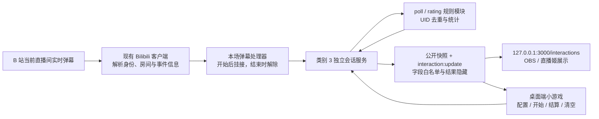

# 小游戏：弹幕投票与观众评分设计报告

- 状态：**In Progress**：功能已实现并通过隔离验证；真实直播间 C0 与端到端验收待补。
- 执行调整：用户于 2026-09-20 明确要求先执行修改、测试失败后修正，因此第 11 节的 C0 前置顺序改为实现后复核。实现与验证记录见 [实施计划](plans/games-poll-rating.md)。
- 日期：2026-09-20。
- 范围：LIRA 桌面端小游戏控制、客户端接收 B 站直播间弹幕、拟新增的 `/interactions` 本地展示页。
- 依据：本次需求、现有小游戏实现，以及 Streamlabs、Slido 官方产品资料。

## 1. 建议方案

在小游戏中新增 **「类别 3：投票与评分」**，包含「弹幕投票」「观众评分」两张卡片，共用独立地址 **`http://127.0.0.1:3000/interactions`**。类别 1 继续使用 `/games`，类别 2 继续使用 `/wheel`。三个地址对应三个类别，OBS / 直播姬可以分别配置位置和尺寸。

分类名称本身不强制决定 URL，但本方案建议独立地址：投票和评分属于同一类观众意见收集，布局与棋盘、画布不同，且展示页只需要读取统计结果。两者共用 `/interactions`，不再分别新增 `/vote`、`/rating`。这是新增地址，不是重命名现有 `/games`；新页面已随类别 3 实现。

**地址独立与弹幕收集并行是两件事。** 首版要求类别 1 与类别 3 的进行中活动互斥，避免同一条 `1` 同时参与数字炸弹和评分。结束后停止本场接收，保留的结果不占用接收资格，可以与另一类别的活动同时展示。转盘不参与这一限制；详细边界见 7.3。

**弹幕捕捉范围已经明确：只在主播开始本场之后接收，到本场结束立即停止。** 投票在到时或主播提前结束时停止，评分在主播手动停止时结束。开始前不预先收集参与者，结束后不继续计数，也不补录历史弹幕；打开和刷新展示页都不会开始捕捉。

| 项目 | 弹幕投票 | 观众评分 |
| --- | --- | --- |
| 主播设置 | 自定义选项、投票时间 | 固定 1–10 分，可填写评分主题 |
| 观众参与 | 发送某个选项的完整内容 | 发送整数 `1` 至 `10` |
| 每个账号 | 第一条匹配选项的有效弹幕计一票 | 只贡献一个分数，停止前最后一次有效评分覆盖之前的评分 |
| 进行中展示 | 规则、倒计时、每项票数与百分比 | 规则；平均分区域留空 |
| 结束方式 | 到时自动结束，也可提前结束 | 主播点击「停止并公布平均分」 |
| 结束后展示 | 冻结最终票数与百分比 | 显示最终平均分和有效评分人数 |

本报告采用两项明确的设计解释：

1. **“每个人只能打一次”理解为每个 UID 在最终平均分中只占一份权重**，允许停止前修改评分，因为需求同时指定“最后一次打分”。例如 A 发 `3 → 8 → 10`，最终只算 A 的 `10`。本次按用户要求执行本报告，采用末次有效评分规则。
2. **配置、开始、结算在桌面端「小游戏」界面完成，`/interactions` 负责同步显示。** 这是对“小游戏界面控制结算、127 网页控制显示”的现有产品模式解释。新展示页只读；在 OBS 网页交互窗口内直接结算不属于首版控制方式。

## 2. 成熟产品调研与取舍

调研日期为 2026-09-20。以下是官方资料中的产品行为；最后一列是针对 LIRA 的设计建议。

| 参考 | 已核实的设计 | LIRA 采用方式 |
| --- | --- | --- |
| [Streamlabs Cloudbot：How to Run a Poll](https://streamlabs.com/content-hub/post/how-to-run-a-poll-for-viewers-in-streamlabs-desktop) | 通过聊天指令投票；至少两个选项；支持设置持续时间、到时关闭，并在运行界面查看进度 | 保留“配置 → 开始 → 收集 → 关闭”的流程；按本次需求直接匹配选项文本，省去 `!vote` 前缀 |
| [Slido：固定选项顺序](https://community.slido.com/poll-display-settings-221/fix-the-order-of-multiple-choice-poll-options-535) | 支持按创建顺序展示选项；官方展示示例使用横向条形和百分比 | 使用固定顺序的横向进度条，减少直播过程中选项跳动；同时显示票数 |
| [Slido：Rating poll](https://community.slido.com/interactive-poll-types-210/create-and-run-a-rating-poll-855) | 支持最高 10 分的评分量表，展示平均值；官方建议按需隐藏结果以减少观众受已有答案影响 | 固定 1–10 整数分；收集阶段隐藏平均分；结束后突出平均分 |
| [Slido：Hide poll results](https://community.slido.com/poll-display-settings-221/hide-poll-results-476) | 主持端与展示端分开，支持隐藏和揭晓结果 | 将“是否揭晓”作为会话状态；评分仅在主动结算后展示结果 |

可以直接查看官方 [投票画面示例](https://uploads-eu-west-1.insided.com/slido-en/attachment/07e68323-cf55-4306-9596-75b64a656a3d.png) 和 [评分画面示例](https://uploads-eu-west-1.insided.com/slido-en/attachment/9d8e2335-6fd8-48de-a558-7dff8be7732b.png)。前者突出选项、横条与百分比，后者包含平均分与分布柱图。LIRA 只采用本次需要的平均分展示，首版不增加分布统计图。

这些参考用于交互设计。LIRA 的“首次投票有效”和“末次评分有效”由本次需求定义，不推断为上述产品具有相同计票规则。

## 3. 现有系统与分类位置

### 3.1 已核实的实现

| 现状 | 代码依据 | 对设计的影响 |
| --- | --- | --- |
| 类别 1 为「直播间互动」，包含数字炸弹、五子棋、你画我猜；类别 2 为转盘 | [小游戏管理页](../public/pages/admin/toolbox/games.html) | 新增类别 3 可以把统计型互动与回合制游戏区分开 |
| `/games` 跟随一个当前游戏会话；已有会话时再次开始返回冲突 | [会话服务](../src/games/game-session-service.js)、[既有单会话规范](games-single-overlay-session_design.md) | 保留三款原有游戏的会话模型；类别 3 使用独立会话，并在开始边界与类别 1 互斥 |
| B 站消息会进入 `games.handleDanmaku()`，随后继续进入其他业务 | [弹幕接入](../src/server/bilibili-client.js) | 在客户端 Node 进程中复用现有接入，不让网页单独连接 B 站 |
| 会话通过 HTTP 快照与 `game:update` 同步到网页 | [游戏路由](../src/server/routes/game-routes.js)、[展示脚本](../public/js/overlays/games.js) | 复用快照与推送模式，新增独立 `interaction:update`，不让旧游戏页处理新类型 |
| 展示端具有专用权限和字段投影；`stop()` 当前直接清空会话 | [展示权限](../src/server/access-policy.js)、[展示请求处理](../src/server/overlay-http.js)、[字段投影](../src/server/overlay-projection.js) | 新建只读 interactions scope；类别 3 明确区分 finish 与 clear，不改变原游戏 stop 的含义 |

**弹幕链路注意事项：** [架构索引](../docs/architecture/README.md) 仍包含“本地获取通道暂停”的描述，但当前 [Bilibili runtime](../src/server/bilibili-runtime.js) 与 [danmaku client](../src/bilibili/danmaku-client.js) 保留配置、启动长连、失败重连的实际路径。因此本方案以复用当前客户端直连为待验证前提；本次仅核对代码，没有登录用户直播间验证真实连接。第 11 节将真实接入验证列为实施第一步，通过后再确定接入合同。

现有 `liveStatus.connected` 在历史消息回退时也可能为真，不能单独证明实时长连可用。另外，普通投票文本不一定进入现有“命令消息”去重，历史轮询也主要围绕命令处理。实现时必须分别核实实时连接状态、普通弹幕身份与事件顺序。

### 3.2 信息架构

```text
小游戏
  类别 1 · 直播间互动
    游戏网页：127.0.0.1:3000/games          [复制链接] [打开网页]
    数字炸弹 / 五子棋 / 你画我猜

  类别 2 · 转盘
    转盘网页：127.0.0.1:3000/wheel          [复制链接] [打开网页]

  类别 3 · 投票与评分
    互动网页：127.0.0.1:3000/interactions   [复制链接] [打开网页]
    弹幕投票                    观众评分
    自定义选项、限时收票         1–10 分、结束后公布均分
```

每个类别保留自己的链接与状态区，不把 `/games` 提升成三类通用链接。类别 3 的两张卡片共用一个当前互动会话与一个网页；开始下一场投票或评分前要先关闭当前结果，但保留结果不妨碍开始类别 1 的游戏。网址通过既有 `localOverlayOrigin()` 生成，3000 只是默认端口，不硬编码到业务逻辑。

## 4. 弹幕投票规则

### 4.1 配置与校验

- 至少两个选项，可增加、删除、修改内容。初始提供 `1`、`2`，主播也可以改成 `唱歌`、`聊天`、`游戏`，或混合数字和文字。
- 每项内容为 **1–10 个可见字符**。按 Unicode 字素簇计数，汉字、英文、数字及一个完整 emoji 各按显示字符处理；前后空白去除后计数。前后端采用相同规范，服务端最终校验。
- 使用 `trim + Unicode NFC` 规范化；不自动转换大小写、全半角或同义词，不删除中间空格。规范化后为空或重复的选项不能开始。
- 字素计数与可见性分别校验。规范化后仍含控制字符、换行/段落分隔符，或游离、夹在普通文字中的隐藏格式字符时拒绝开始；包括零宽空格 `U+200B`、词连接符 `U+2060`、残留的 `U+FEFF` 及双向文本控制字符。仅有空白或游离组合标记也无效。例如 `\u200B`、`唱\u200B歌`、`A\nB`、`\u0000` 均应拒绝；这里的转义表示实际字符，不是反斜杠组成的可见文字。
- 正常可见字素中的组合附加符，以及完整合法 emoji 序列中的 ZWJ、变体选择符和标签字符予以保留；例如 `e\u0301`、`👩‍💻`、`❤️` 均可作为一个字素参与长度校验。不能把所有组合标记或格式字符一律删除或禁止，也不能静默删除隐藏字符后接受选项。错误标在对应输入框，提示移除不可见字符或换行；前后端使用相同判定和样例。
- “10 字符”是单项内容长度，**不是最多 10 个选项**，支持超过 10 项。工程上需限制整份配置及公开快照的字节数，不能承诺无限选项或直接依赖现有 16 MiB 通用请求上限；拟定限制与超限行为见 7.6。
- 输入框旁显示 `当前长度 / 10`；重复、超长、缺少选项的错误直接标在对应位置，不静默截断用户输入。
- 实施时使用同一套字素计数口径；不能简单设置 HTML `maxlength=10` 或使用字符串 `.length`，否则 emoji 等内容会被按 UTF-16 单元误判。中文输入法组词期间不截断，完成输入和提交时校验。
- 可填写投票主题；未填时显示“弹幕投票”。建议主题限 60 个可见字符，这是新增字段的设计建议。
- 时间由主播设置，建议默认 60 秒，提供 30 秒、1 分钟、2 分钟快捷值与自定义秒数。首版建议范围为 1–3600 秒；该上限属于待评审建议，不是原需求中的限制。多页选项还需按 6.2 显示一轮展示所需时间的提示，帮助主播避免后面的选项尚未出现就截止。
- 开始后锁定本场主题、选项和时长。修改内容或增减选项应在结束当前会话后进行，避免已收票的含义变化。

### 4.2 匹配与账号去重

对本场接收到的每条有效实时弹幕：先检查会话、房间、账号、时间，再按 4.1 使用相同的文本规范化与非法字符判定，匹配完整选项。包含被禁止字符的弹幕不计票，也不消耗该 UID 的资格；不通过移除隐藏字符把它变成有效选择。

| 场景 | 处理 |
| --- | --- |
| A 先发普通聊天，再发 `唱歌` | 普通聊天不占用投票资格；`唱歌` 计 1 票 |
| A 先发 `唱歌`，再发 `聊天` | 只保留 `唱歌` |
| A 连续发 20 次 `唱歌` | 仍然只有 1 票 |
| B 与 A 昵称相同，但 UID 不同 | 各计 1 票 |
| `我选唱歌`、`唱歌！`，选项为 `唱歌` | 不匹配 |
| ` 唱歌 `，选项为 `唱歌` | 去除前后空白后匹配 |
| 选项为 `唱歌`、`聊天`，观众发送 `1` | 不匹配；列表位置不会自动成为别名 |

参与者按 B 站可信 UID 去重，以字符串保存。缺失、零值、脱敏或无法可靠确定的身份不计票，不能改用昵称代替。延续现有小游戏的观众范围，主播自己的弹幕不参与；其他观众不附加粉丝牌、舰长或付费门槛。

本场收到的第一条匹配弹幕才消耗该 UID 的资格。每场建立独立计票集合，下一场重新计数。

### 4.3 截止与进度

收票区间为客户端游戏服务确定的 **`[开始时刻, 截止时刻)`**。到达截止时刻及之后进入服务的弹幕一律不收；主播提前结束时以结束操作在服务端生效的时刻为界。页面倒计时只负责显示，页面关闭或 OBS 隐藏不影响截止。

这里明确采用**客户端本场服务接收有效实时事件的时刻**作为收票截止依据。观众在 B 站提前发送、但网络或解析延迟导致截止后才进入本场服务的弹幕也不计入；不在结果公布后追加补票。规则说明应包含“以客户端截止前收到并处理为准”，具体边界见 7.4。

计算口径：

```text
总票数 N = 已成功投票的不同 UID 数
选项 i 的票数 = 首次有效投给该选项的 UID 数
选项 i 的占比 = 选项票数 / N × 100%
```

没有有效票时，所有选项显示 `0 票 · 0.0%`。百分比显示一位小数，横条使用实际比例，所有横条采用相同的 0–100% 标尺；不把当前最高票选项固定拉满。逐项四舍五入后，显示值之和可能略偏离 100%；例如六项各一票会显示六个 16.7%，合计 100.2%。真实票数、分母和单项比例不为凑整而调整。

投票过程中保持主播设置的选项顺序。结束后保留顺序与最终数值，最高票可标记“最高票”，并列时标记“并列最高”；零票结束显示“本场暂无有效投票”，不制造胜出选项。

## 5. 观众评分规则

- 分数固定为整数 `1`、`2`、……、`10`，一分最低，十分最高。
- 去除前后空白后作完整匹配。`0`、`11`、`8.5`、`08`、`8分`、`我打8分` 都不是有效评分。
- 每个 UID 只有一条最终记录。在收集期间再次发送有效分数，替换该 UID 之前的有效分数；发无效文字不会取消已有分数。
- 身份规则与投票相同：按可信 UID 区分账号，不按昵称去重，主播及无法确定 UID 的弹幕不参与。
- 主播点击「开始评分」后开始收集，点击「停止并公布平均分」后关闭收集并一次性结算。首版评分不增加自动计时，按需求由主播决定停止。
- 收集期间 `/interactions` 展示主题与固定规则，**平均分数值留空**，不显示 `0`、`--`、实时分布或上一场平均分。有效参与人数可在主播控制界面显示。
- 结算后显示平均分，建议保留两位小数，并显示有效评分人数。规则仍然可见，改为已结束状态。

```text
有效评分人数 N = 当前有有效分数的不同 UID 数
最终平均分 = 各 UID 最后一次有效分数之和 / N
```

示例：A 发 `3 → 8 → 10`，B 发 `6 → 文字`，C 发 `9`。最终记录为 A=10、B=6、C=9，人数为 3，平均分为 `8.33`。停止后 A 再发 `1`，结果仍为 `8.33`。

无人评分时停止，显示“暂无有效评分”，平均分数据为 `null`，不显示 `0 分` 或 `NaN`。

## 6. 界面与操作流程

### 6.1 桌面端控制

**投票卡片：** 主题 → 可增减的选项列表 → 时间及多页展示时长提示 → 自动生成的规则摘要 →「开始投票」。开始后显示剩余时间、有效人数和实时结果，主按钮变为「提前结束投票」。自动到时或提前结束后，保留最终结果与「关闭结果」。

**评分卡片：** 主题 → 固定评分规则 →「开始评分」。开始后显示已收到多少个不同账号的评分，主按钮变为「停止并公布平均分」。结算后显示平均分与「关闭结果」。

**公共操作：** 类别 1 的游戏未结束或类别 3 正在收集中时，禁用另一类别的开始/重开按钮，并说明原因；结束后的结果可以继续展示。类别 3 内部仍然只有一个会话，开始下一场前先关闭结果。转盘沿用现有独立行为。另一个管理窗口发起冲突操作也由服务端拒绝。进行中若要放弃本场，使用次级「取消本场」；该动作停止接收并清空当前数据，正常结算只停止接收并保留结果。

### 6.2 `/interactions` 投票画面示意

```text
今晚先做什么？                              剩余 00:42
发送下方任一完整选项，每个账号首次有效选择计票

唱歌
┌─────────────────────────────────────────────────────┐
│ ████████████████████████            66 票     55.0%  │
└─────────────────────────────────────────────────────┘
聊天
┌─────────────────────────────────────────────────────┐
│ █████████████                      36 票     30.0%  │
└─────────────────────────────────────────────────────┘
游戏
┌─────────────────────────────────────────────────────┐
│ ███████                            18 票     15.0%  │
└─────────────────────────────────────────────────────┘

已参与 120 人                 截止后不再收票
```

票数和百分比位于完整进度轨道内的固定位置，不放在可能很窄的填充色块中，保证 0 票和低比例时仍可读。结束后将倒计时替换为“投票已结束”，冻结数值。

选项较多时使用固定高度的选项列表，主题、规则和倒计时保持固定。可复用 `startOverlayPages()` 的每 8 秒翻页滚动；现有 helper 没有页码接口，首版不承诺自动页码，也不为了页码修改所有浏览器源。每场从第一屏开始并重新起算翻页间隔，只给选项容器绑定一次，实时更新不重建容器或重置滚动；切换会话和卸载页面时清理。不能只渲染前几项或隐藏零票选项。

**展示时长提示：** 实现布局时需确定并在链接旁标出本页推荐的 OBS 浏览器源尺寸。管理端按该尺寸下的选项区高度、实际内容高度和现有翻页步长估算屏数 `P`，让每屏停留 8 秒的一轮展示需 `8 × P` 秒；不能只按选项数量粗略相除而忽略换行和翻页重叠。选项或时长变化时更新提示。`P > 1` 且设定时长不足一轮时，在时长输入旁提示“按推荐尺寸，选项预计分 P 屏展示，建议至少 N 秒，当前时长可能来不及展示全部选项”。该提示不新增硬性时长下限或确认弹窗，主播仍可按原设定开始，服务端按原截止时刻结束。

例如三屏选项建议至少 24 秒；设为 5 秒时必须提示不足，单屏的 1 秒投票不触发多页提示。估算针对从第一屏开始且未暂停翻页的推荐布局；主播缩小浏览器源尺寸、延后显示或暂停翻页后，需自行预留更长时间。管理端不采集 OBS 窗口尺寸，不承诺任意显示条件下都能在截止前展示完整一轮。

### 6.3 `/interactions` 评分画面示意

收集期间：

```text
为这次演唱打个分

在弹幕发送 1–10 的整数
1 分最低，10 分最高
每个账号只计一份，结束前以最后一次有效评分为准
主播结束后公布平均分

                    （此处实际保持空白）
```

结算后：

```text
为这次演唱打个分                              评分已结束

                       8.33
                    平均分 / 10
                   有效评分 3 人

每个账号只计结束前最后一次有效评分
```

复用 LIRA 现有字体、颜色与圆角变量，数字使用等宽数字显示。投票采用短促的宽度过渡，评分结算仅做一次轻量揭晓动画；不采用持续闪动、滚动计分或强制音效。OBS 画面不出现配置表单、UID、原始弹幕和管理员控制信息。

## 7. 技术设计与责任边界

### 7.1 客户端数据流

这里的“客户端计算”指 **LIRA 桌面程序中的本地 Node 服务**。浏览器源渲染聚合结果，B 站凭据与参与者明细留在客户端进程内。



继续使用 Node 24+、CommonJS 后端、原生前端 ES modules 与 CSS。不引入新进程、框架、外部投票平台或运行时依赖，也不把此功能迁移到远端 LIRA Server。

### 7.2 模块职责

| 拟调整位置 | 职责 |
| --- | --- |
| `src/games/poll.js`、`src/games/rating.js`（拟新增） | 输入规则、UID 记录、票数/总分、公开结果；两种“首次/末次”规则独立明确 |
| `src/games/interaction-session-service.js`（拟新增） | 类别 3 的单会话、捕捉启停、时钟、结算、清空、公开状态和广播 |
| `src/games/game-session-service.js` | 只新增只读“是否有未结束游戏”查询与开局/重开门禁，不加入 poll / rating 状态分支 |
| `src/server.js`、`src/server/runtime-api-context.js`、`src/server/api-context.js` | 创建和销毁新服务；注入弹幕来源、跨类别开始检查与 API facade；关闭时释放处理器及定时器 |
| `src/server/bilibili-client.js`、`src/server/bilibili-runtime.js` | 复用现有连接，为本场处理器提供可信房间/账号归属和真实就绪状态 |
| `src/bilibili/danmaku/websocket-connection.js`、`message-handlers.js`、相关 parser | 捕获不可变的消息来源与顺序；在命令过滤前提供本场实时文本入口，不改变原命令行为 |
| `src/server/routes/interaction-routes.js`（拟新增）、`src/server/api-routes.js` | 注册 `/api/interactions` 前缀和路由；不复用 `/api/games/session` 来创建新类型 |
| `src/server/access-policy.js`、`src/server/overlay-http.js`、`src/server/overlay-projection.js` | 注册 interactions 页面/scope、只读 GET、HTTP/WS 字段白名单；独立于 games 的可操作权限 |
| `public/pages/admin/toolbox/games.html`、`public/js/admin/games.js`、`games-interactions.js`（拟新增） | 类别 3 链接、表单和主持操作；按现有 wheel 的入口方式初始化专用模块 |
| `public/js/admin/state.js` | 转发 `interaction:update` 为类别 3 UI 事件，避免前端漏收新事件 |
| `public/pages/overlays/interactions.html`、`public/js/overlays/interactions.js`、`public/css/overlays/interactions.css`（拟新增） | 独立展示页，复用 socket-client 与列表翻页 helper，不改旧 games 视图 |
| `public/css/admin/other-features/` | 新卡片和表单样式，复用既有变量及样式入口 |

实际开发前按 [PLANS.md](../PLANS.md) 编写实施计划，并核对对应目录的 scoped `AGENTS.md`。架构事实文档仅根据已落地的代码更新；未完成的真实接入验收不提前标记通过。

### 7.3 会话与状态

类别 3 会话使用 `kind: poll | rating`，由新服务持有。配置草稿留在管理界面，读取网页、配置表单、查询状态都不创建会话。

| 状态/动作 | 收集行为 | 展示行为 |
| --- | --- | --- |
| 无会话 | 没有本场处理器，不收集或缓存参与弹幕 | 等待主播开始 |
| `collecting` | 本场处理器已启用，接收窗口内有效实时弹幕 | 投票实时结果；评分仅规则 |
| `interrupted` | 房间或账号发生变化，解除本场处理器，不恢复旧场接收 | 提示本场已中断；评分仍不公开均分 |
| `finished` | 不再接收 | 冻结投票结果或评分均分 |
| `finish` | 先关闭接收并解除处理器，再从 collecting / interrupted 结算至 finished | 保留最终结果；同一会话重复结算返回同一结果 |
| `clear` / 取消本场 / 关闭结果 | 解除处理器、定时器与推送任务，清空会话 | 回到等待画面 |

**开始顺序：** 校验配置 → 确认实时弹幕就绪及跨类别门禁 → 创建 sessionId 和空统计 → 记录开始边界 → 启用本场处理器 → 发布开始状态。最终门禁检查、创建和启用之间不能有异步等待；准备过程中未完成的开局不收票、不计分。

**结束顺序：** 标记本场关闭接收 → 解除处理器 → 取消投票计时器及待发送的中间更新 → 冻结统计、进入 finished → 发布最终结果。该状态变更同步完成，捕捉回调还须检查 sessionId 和 phase，已排队的旧回调不能写回。结算后可释放 UID Map，重复结算直接返回冻结结果。

投票截止由会话服务的单调时钟判断；定时器触发、接收弹幕、读取快照、手动结算时均校验截止，避免事件循环延迟造成超时收票。即使定时器晚执行，超过截止的消息也会被拒绝并触发关闭。页面按快照中的 remainingMs 建立本地倒计时，不按网页计时器决定是否收票。

短暂网络断连保留 collecting 阶段和原截止时刻，处理器暂不接收，记录本场可能漏收；同一身份/房间恢复实时连接后，仅在本场仍 collecting 且未超时的情况下重新启用。已经 finish 或 clear 的会话绝不能因重连重新监听。interrupted 的投票仍在原定截止时冻结为 finished；评分始终等待主播主动结算，两个阶段都允许取消本场。

跨类别门禁通过 `src/server.js` 注入只读回调，由各会话服务在开始边界执行；服务之间不直接互相导入，也不新建通用事件总线或锁服务。

| 当前情况 | 是否可开始另一类别 |
| --- | --- |
| 类别 1 游戏未结束，包括主播回合、观众回合、你画我猜中间回合结果 | 不可开始类别 3 |
| 类别 3 collecting，包括等待重连 | 不可开始或重开类别 1 |
| 类别 1 全局已结束，或类别 3 finished / interrupted | 可以开始另一类别，旧结果继续展示；旧活动不能恢复收集 |
| 类别 3 已有任何会话，包含结果页 | 不可直接新建另一场类别 3；先 clear，再开始 |

必须同时保护类别 1 的 `start()` 和 `restart()`。现有 restart 会先清空再调用 start，新门禁应在清空旧结果之前检查，冲突时返回 409 并保留结果，不能因重开失败丢失旧会话。

### 7.4 接入、重复消息与“最后一次”

**本场接收入口。** 复用现有 B 站长连，开始时挂接本场处理器，结束时解除；未开始及已结束时，不给该功能转发或缓存弹幕。解除本场处理器不关闭其他功能共享的 B 站连接。只接受当前房间的实时 `source: danmaku`；历史轮询、SC、礼物和手动模拟输入不进入正式统计，也不通过在线观众列表预先建立参与者。

入口应位于实时消息解析后、原有命令过滤/去重之前。现有 `MessageHandlers.handleDanmaku()` 对命令文本先过滤再调 onMessage，自定义投票选项可能恰好也是命令；仅在现有 onMessage 末尾加计票会继承不适合投票的过滤。新增统计入口只通知当前处理器，原有点歌/机器人链路继续按原规则执行，同一事件不再从第二条路径重复送入统计。

**真实就绪。** 由 Bilibili runtime 提供只读就绪状态：当前连接有效、WebSocket 已打开且 B 站鉴权回复 accepted、房间及主播身份已解析。现有 `connected: true` 和 `waitForOpen` 均不足以证明鉴权成功，`WebSocketConnection.connectionTrace.authStatus` 已有相关信息可复用。未就绪时开始失败，不挂接处理器；头像、在线榜单获取失败不应阻止已有可信 UID 的观众参与。

**身份与连接代次。** 本场绑定可信账号与解析后的真实房间号；事件携带创建该连接时捕获的 client/connection/attempt 代次，不能在异步回调结束后读取已经切换到新房间的可变字段来补身份。固定绑定的是账号和房间，不是开局时的 socket 代次；同房间正常重连后接受当前新连接，旧连接回调作废。网页不能指定 UID、房间或租户来伪造参与者。

**开始/结束边界。** 在传输回调开始时记录本地接收时间与 frameSeq，再进行可能的异步二进制读取；解出的每条消息追加包内序号。开局前到达而开局后才解出的旧帧不算。只有解析后在本场窗口内进入统计服务的事件才算；截止前到达、截止后才处理的消息不补计。结束不等待积压队列清空，立即冻结结果。

**先后与重复。** 本场入口按 frameSeq、包内序号保持接收顺序；在消息读取发生异步等待时，应在传输拥有者处串行处理并校验连接代次。应用下述过期/重放过滤后，投票取第一条有效事件，评分取最后一条有效事件。不能以头像查询结束时间或多个 Promise 回调完成顺序决定先后。

有已核验的稳定平台事件 ID 时，必须排除同一事件重放；缺少 ID 时，连续相同分数本来就不会增加人数或改变总分。不得用 UID+文本，或 UID+秒级时间+文本全场去重，否则同一秒内真实的 `8 → 9 → 8` 可能被误判。新事件与该 UID 已接受记录均有可比较的可信平台时间，且新事件时间更早时，必须忽略该过期事件；例如先收到较新的 `9`，后收到较旧的 `8`，评分保持 `9`。其余情况按本地接收顺序处理。当前时间提取函数会退回 Date.now，必须区分平台时间与本地回退，不能把回退值冒充平台时间。

没有稳定 ID、且平台时间相同或不可用时，首版明确采用**本地接收顺序**，优先保留观众真实改分的能力；无法保证识别这一条件下所有跨报文重放。这是可执行的降级口径，不把无法区分的事件留给实现者自行猜测。真实报文联调仍需验证 UID、事件 ID 和时间精度，不能宣称掌握全体观众的真实发送顺序。

### 7.5 HTTP、推送与公开数据

使用独立路由组，不扩展旧 `/api/games/session` 的 game 枚举：

| 接口 | 调用者 | 行为 |
| --- | --- | --- |
| `GET /api/interactions/session` | 管理端、interactions overlay | 只读公开快照；无会话时 session 为 null，不启动捕捉 |
| `GET /api/interactions/host-state` | 管理端 | runtimeId、当前 sessionId、实时就绪状态、有效参与人数、阻止开始的原因；不返回 UID 明细或未结算均分 |
| `POST /api/interactions/session` | 管理端 | 校验 kind、主题、选项和时间后开始；已有本类会话或另一类别未结束时返回 409 |
| `POST /api/interactions/session/finish` | 管理端 | 必须带当前 sessionId；停止捕捉并冻结结果，同一已完成会话重复调用返回同一结果 |
| `POST /api/interactions/session/clear` | 管理端 | 必须带当前 sessionId；取消本场或关闭结果；旧 ID 不能影响新会话 |

配置无效返回 400；就绪/活动冲突、已清空或不匹配的 sessionId 返回 409；当前 finished 会话再次 finish 按上表返回原结果。完成校验后，开始操作同步检查并提交；一个页面的失败不能覆盖另一个页面已创建的会话。

在 `OVERLAY_PAGES` 注册 `interactions: interactions.html`，现有 `servePageOrAsset()` 会生成地址映射并注入该 scope 的凭据。`OVERLAY_ROUTES` 只加入对应公开 GET；现有通用 `/api/state` 若可读，也必须得到空的领域投影。同步补齐 STATE_SCHEMAS、HTTP 响应投影和 WS 事件投影，不能只改一张页面映射表。

`interactions` scope 不能 POST、不能读 host-state、不能访问 games/wheel 管理操作；games scope 也不能访问 interactions 数据。新地址不是旧 `/games` 的别名，不继承它的落子、绘画、退出权限。

公开 HTTP 返回 `{ ok: true, data: { runtimeId, revision, session } }`；WS 使用 `{ type: 'interaction:update', state: { runtimeId, revision, session } }`。runtimeId 在新服务实例启动时生成，revision 在该实例内跨场次递增；clear 后仍带 revision 和 `session: null`。不要把 revision 只放在可能为空的 session 内。

| 数据 | 公开方式 |
| --- | --- |
| 共同字段 | 外层 runtimeId、revision；session 内 kind、sessionId、phase、主题、规则、必要的计时和连接提示 |
| 投票 | 原顺序的选项内容、各项票数、有效总票数；百分比由一致的计算口径生成 |
| 评分未结算 | 规则、状态、`average: null`；展示投影不含总分、分布、参与者明细 |
| 评分已结算 | average、有效评分人数、结束原因和必要的不完整提示 |
| 内部数据 | UID → 选项/分数、时序与去重记录，只留在领域状态，不返回给网页 |

评分隐藏应由公开状态构造和 overlay 白名单共同保证，不能仅靠 CSS 把数字藏起来。即使打开多个浏览器源，也只读取同一个聚合结果，不产生多个计票器。

投票每条有效弹幕立即更新内存状态，公开状态变化使 revision 递增，可以约 200 ms 合并推送；结束和 clear 立即推送，并取消旧的待发送更新。评分收集过程中只更新内部记录，不逐次公开分数变化；主持端可见时每秒读取一次 host-state 显示人数，离开面板即停止轮询。

HTTP 与 WS 使用同一份公开快照。客户端比较同 runtimeId 的 revision，并保留请求代次保护；重连时废弃旧连接回调和在途请求，经新连接的快照建立当前 runtimeId，不能让旧实例的迟到响应切回旧状态。确认切到新场或 session=null 时立即清空旧评分。例如 A 场结果响应晚于 B 场开始推送返回，必须丢弃 A 的响应。

新 overlay 通过专用 GET 取得初始/重连状态；现有全局 snapshot 没有 interactions 字段，不能把它的缺失字段当作“清空本场”。管理端在 `state.js` 接入新事件，并在连接恢复时重新读取本类状态。旧 game:update 的空闲消息不影响类别 3。

### 7.6 长度、规模与资源释放

建议新增配置输入总上限 16 KiB，并在开始前验证最坏情况下公开快照不超过 64 KiB；两者是为输入解析、广播与展示成本拟定的工程值。现有 HTTP 通用请求上限为 16 MiB；`src/server/ws.js` 的 256 KiB 是入站帧/消息限制，并非发往 OBS 的快照上限，不能替代本功能的规模校验。配置超限时明确拒绝，不默默丢弃尾部选项；单项 10 字素校验仍然独立生效。

投票使用 UID → 选项 Map 和各项计数，评分使用 UID → 分数 Map、有效人数及分数和；改分时 `sum += newScore - oldScore`，人数不变。只对最终平均分作显示舍入，累计总分不反复舍入。不在每条弹幕到来时复制整个 UID Map 或遍历所有参与者。

首版只保存当前会话内存状态。finish 解除处理器、清除计时/推送任务并保留最终汇总；clear / dispose 再释放全部本场状态。刷新网页保留结果且不会重新挂接处理器，完整退出客户端或服务重启后不恢复本场，不新增数据库与评分历史。

## 8. 异常行为、安全与兼容

| 情况 | 规定行为 |
| --- | --- |
| 未配置直播间、实时长连未就绪 | 开始按钮说明原因，服务端也拒绝开始；不能只靠前端禁用 |
| 配置表单、开始失败或尚未开始 | 不挂接本场处理器，不缓存待计入的弹幕 |
| 只有历史消息回退 | 不冒充实时可用；新场不能开始，已有场提示接收中断 |
| 进行中短暂断连 | 已收记录保留，投票计时继续；仅本场仍 collecting 且未超时时，允许同一账号/房间的新连接继续接收，历史消息不补入 |
| 断连后继续或结算 | 主持端提示可能漏收；最终结果保留“接收曾中断”说明，不展示为完整采集 |
| 切换房间或绑定账号 | 旧场进入 interrupted 并解除处理器，不混入新房间数据，也不因切回原房间恢复；评分等待手动结算，投票保留原截止时刻 |
| 投票到时、提前结束或停止评分 | 同步关闭接收并解除处理器，冻结并保留汇总；结束后到达的回调和重连都不能恢复捕捉 |
| 取消本场、关闭结果、服务销毁 | 解除处理器并清理计时/推送任务；丢弃对应会话状态 |
| OBS 刷新、关闭、隐藏或查询结果 | 不改变本场收集状态；重开只读取快照，不启动或延长捕捉 |
| 另一类别保留已结束结果 | 可以开始本类活动；另一类别仍未结束则拒绝开始，本类已有结果仍需先关闭 |
| 客户端完整重启 | 丢弃当前场，页面回到等待开局；不自动开始，也不恢复旧均分 |
| 主播连续点击结算 | 同一 sessionId 幂等返回；结果不会重复计算或重新开放 |
| 自定义选项含 HTML 字样 | 按文本显示；使用 textContent，不插入可执行 HTML |

沿用现有 loopback、Host/Origin、管理会话与 overlay scope 校验。B 站 Cookie、登录凭据和观众 UID 集合不进入浏览器源。客户端不新增发送弹幕的自动通知或回复。

类别 3 新增 `/interactions` 和只读 interactions scope；保留既有 `/games`、`/wheel` URL、三款游戏规则、转盘行为及其权限。类别 1 只增加与类别 3 的开始/重开冲突检查；不复用数字炸弹的宽松数字解析来判断评分，不让投票选项改变全局命令过滤规则。

## 9. 主要设计决策记录

以下均为本报告内的 Proposed 决策，评审通过后再决定是否需要独立 ADR。

| 决策 | 理由 | 替代方案与代价 |
| --- | --- | --- |
| D1：新增类别 3，独立 `/interactions` 与会话 | 类别、链接、统计布局对应明确；结果保留不占用另一类展示页 | 共用 `/games` 可少配一个浏览器源，但会混合旧游戏与统计视图；独立地址需要首次配置浏览器源 |
| D2：客户端 Node 负责计数与截止 | 网页刷新不影响结果，凭据不出进程 | 网页直接计数会受页面生命周期影响；远端计数超出本次客户端需求 |
| D3：投票首次有效，评分末次有效 | 分别对应选择不可更改与评分可修正 | 统一套用同一种去重会违背其中一项规则；不增加可配置计票模式 |
| D4：实时投票、结算后公开评分 | 满足两类不同的展示要求 | 实时公开均分不符合需求；先把总分发给网页再隐藏会泄露未揭晓结果 |
| D5：只统计开始后收到、截止前进入本场服务的实时事件 | 本地顺序可验证，结束立即冻结，历史和解析积压不补入 | 按平台发送时间补录需要等待窗口与结果修订，复杂度更高且不符合即时截止体验 |
| D6：仅当前会话内存状态 | 适合当前单场小游戏，改动集中 | 持久化恢复需要迁移、跨重启时钟与身份恢复设计，本次没有该需求 |
| D7：独立只读展示权限，桌面端主持 | 展示凭据只能读取本类公开结果，评分在结算前不泄露 | 沿用 games scope 会继承棋盘、绘画等无关操作权限；在 OBS 内新增主持能力超出本次采用的控制模式 |
| D8：开始挂接、结束解除；仅进行中跨类互斥 | 同一条数字弹幕不会同时参与两类活动，结束结果仍可保留 | 按会话是否存在一律互斥会让结果页阻塞下一类活动；全面并行容易把普通游戏输入误计成投票或评分 |

## 10. 验收标准

以下是后续实现需要满足的标准，**不代表本次已经完成这些功能测试**。

| 编号 | 可观察的验收结果 |
| --- | --- |
| P1 | 两项可以开始，一项、空项、规范化后重复项不能开始；含中文、组合字符和 emoji 的 10 字素通过，11 字素被拒绝；输入法组词不中途截断 |
| P2 | 可配置超过 10 个选项；所有选项都能参与计数并在列表翻页中出现；超出配置/快照字节上限时明确拒绝，不能静默截掉尾部选项 |
| P3 | 数字、汉字及混合选项按完整内容匹配；普通聊天不占资格；不自动接受行号别名 |
| P4 | 同 UID 连发、换选项均不增加第二票；同名不同 UID 独立计票；无可靠 UID 与主播弹幕不参与 |
| P5 | 票数为 66、36、18 时，总数为 120，占比为 55.0%、30.0%、15.0%，顺序不跳动 |
| P6 | 开始后收到且截止前进入服务的有效弹幕计入，等于或晚于截止无效；开始前已收到的旧帧、截止后才解出的积压帧不计；迟到定时器、OBS 关闭都不能延长收票 |
| P7 | `\u200B`、`唱\u200B歌`、内部换行、控制字符和游离组合标记作为选项时被明确拒绝；正常组合字符、ZWJ emoji 和变体选择符 emoji 保留并正确计数；相同非法字符进入弹幕时不计票、不消耗资格、不通过静默删除变成有效选择 |
| P8 | 推荐布局下三屏选项、5 秒投票显示至少 24 秒的提示；修改选项或时长后提示更新；24 秒从第一屏开始且未暂停翻页时每屏可展示 8 秒；单屏 1 秒不触发多页提示，主播保留较短时长时仍按原截止结束 |
| R1 | 只接收 1–10 的整数文本；无效分数不会替换已有有效评分 |
| R2 | A=3→8→10、B=6→文字、C=9 时，人数为 3，结算平均分为 8.33 |
| R3 | 停止前 `/interactions` 平均分区域空白，公开 HTTP/WS 数据无法从总分或分布推算均分；新场不闪现旧结果 |
| R4 | 主播停止后立即显示最终均分，之后弹幕不能改分；零人结算显示“暂无有效评分” |
| R5 | 同名不同 UID 分别计分；主播、未知或无可靠 UID 的弹幕不参与评分，不附加粉丝牌或付费门槛 |
| L1 | 开始成功才挂接本场处理器；表单输入、失败开始、GET、打开/刷新 OBS 均不挂接，也不缓存待参与弹幕 |
| L2 | 投票到时/提前结束、评分手动停止时立即关闭接收并解除处理器；finish 保留结果，clear / dispose 清理本场；共享 B 站连接仍服务其他功能 |
| L3 | 结束后的迟到回调、计时器、推送任务、网络重连不能改写结果或恢复捕捉；同一房间重连只恢复仍 collecting 且未超时的本场 |
| C0 | 接入实现前已有经授权的受控验证结论：鉴权 accepted、房间/主播归属及测试账号 UID 可核实，同一账号 UID 稳定、不同账号可区分；事件 ID 和平台时间的可用性、精度及降级限制有记录；合成事件测试不能替代这些接入证据 |
| C1 | 类别 1 未结束与类别 3 collecting 互斥；类别 3 内已有会话不能再开；并发开始返回 409 且不覆盖已有数据；finished / interrupted 不阻塞另一类别 |
| C2 | 类别 3 收集中，重开类别 1 返回 409 并保留其旧结果；相同 sessionId 重复结算不改变结果，旧 sessionId 的结束/清空请求不能影响新场 |
| C3 | 多个 OBS 页面显示同一份统计；同 runtimeId 只接受最新 revision，包括 session=null；旧请求和旧实例响应不能覆盖新场或清空状态，game:update / 全局 snapshot 缺少本类字段不清空本场 |
| C4 | 历史消息、失效连接、其他房间事件不能计入；仅 socket open、鉴权未 accepted 或仅历史回退均不能开始；有效事件只送入一次，自定义选项等于既有命令时仍能计票 |
| C5 | 同一秒内真实改分 `8→9→8` 最终为 8；先收到可信平台时间较新的 9、再收到较旧的 8 时保持 9；异步解帧不颠倒本地先后；有可靠事件 ID 时必须排除同一事件重放；无可靠 ID 且时间相同/缺失时按本地接收顺序，明确记录重放识别限制 |
| C6 | 断连继续计时并提示可能漏收；切换房间/账号解除旧处理器，切回也不恢复；评分不自动揭晓，投票仍在原截止时结束 |
| C7 | `/interactions` 正常提供本类投票/评分页，`/games` 和 `/wheel` 仍为原页面；链接使用实际本地端口，旧浏览器源无需换址 |
| C8 | interactions 凭据只能读取本类公开快照，不能 POST、读 host-state 或其他领域数据；games 凭据不能读 interactions；未揭晓均分、UID 明细与 Cookie 不进入展示数据 |

## 11. 实施顺序与完成条件

建议分四步实施，各步直接验证其负责的行为：

1. **真实接入前置验证。** 在经授权的测试直播间复用现有客户端做最小受控验证：确认鉴权 accepted、真实房间与主播归属、普通实时弹幕的可信 UID，以及同账号身份稳定、不同账号可区分；同时核实事件 ID 是否存在、其唯一性范围与重放时是否稳定，以及平台时间的来源、精度和缺失情况。按 7.4 记录来源、连接代次、本地顺序等必要字段的取得方式，明确平台字段与本地产生字段，通过后再确定接入合同。记录验证结论和去标识的结构样例，不把真实 UID、凭据或原始用户报文写入测试与仓库。缺少可靠事件 ID 或平台时间时可采用 7.4 已定义的降级；无法验证可信 UID、房间归属或真实就绪时，先修订接入方案，再开展依赖该前提的实现，不能靠昵称、历史消息或合成事件通过测试来替代。
2. **计数、接入与会话。** 新建 poll / rating 规则和独立会话服务；按前置验证确定的合同，在已有 Bilibili 拥有者处补就绪、不可变来源和顺序信息，在组合根挂接生命周期及跨类别门禁。用虚拟 UID、假时钟和隔离消息源验证首次投票、末次评分、开始后启用、结束解除、截止、异步乱序、重连与重复消息边界，以及可见性和字素长度校验。
3. **接口、权限与同步。** 新增并注册 `/api/interactions` 路由及只读 scope，补 HTTP/WS 投影、runtimeId/revision、clear 快照和管理端事件转发。验证两类开局冲突、重开失败保留旧结果、过期操作和评分隐藏；更新相关 API、WS、页面合同，保留旧游戏接口。
4. **控制与展示。** 完成类别 3 的独立链接、表单、主持状态和 `/interactions` 两种画面；确定并标注推荐 OBS 尺寸，完成多页展示时长估算与提示。在隔离 Electron 环境检查主持操作，在浏览器源检查进度条、长列表、短时投票提示、隐藏均分与结算展示。最后再做经授权的真实直播间端到端复核，确认前置验证中的接入能力已贯穿实际计票与展示流程。

新增功能应有专用的规则/会话、路由、管理页、展示页测试，拟使用 `test/interactions.test.js`、`test/interaction-routes.test.js`、`test/frontend-interactions.test.js`、`test/interactions-overlay.test.js`。上述文件已实现，具体证据见实施计划。直接相关的现有验证入口如下：

| 现有测试 | 实施时核对的影响 |
| --- | --- |
| `test/games.test.js`、`test/game-routes.test.js` | 类别 1 开始/重开门禁、旧会话和原有接口 |
| `test/frontend-games.test.js`、`test/games-overlay.test.js` | 类别 1 管理流程、旧 `/games` 展示 |
| `test/overlay-http-access.test.js`、`test/overlay-projection.test.js` | 新 scope 的只读边界与字段隐藏、原 scope 隔离 |
| `test/bilibili-runtime.test.js`、`test/danmaku-client.test.js`、`test/bilibili-danmaku-parser.test.js`、`test/websocket-connection.test.js` | 真实就绪口径、消息来源、接入顺序、重连与旧命令链路 |

确定性测试使用虚拟 UID、假时钟和临时状态，不连接真实平台或写入用户数据。浏览器检查前先确认准确路由及状态码；桌面主持流程使用正常 Electron 预加载和授权环境，不能用匿名浏览器代替。

功能完成需以本报告经确认的行为为准，相关测试与运行检查通过，接入和投影合同一致，最终 diff 已审查。是否需要更广的验证由最终改动的认证、连接生命周期和公共契约范围决定。

本次代码已实现本报告的投票、评分、只读展示和跨类别收集互斥，并完成合成事件测试与隔离 Electron/浏览器源验证。真实直播间的 UID 稳定性、房间/主播归属和平台事件字段仍待复核；当前 eventId=null，平台时间相同或缺失时采用本地顺序降级，不能识别所有跨报文重放。按用户指示先交付代码，不将 C0 标记为通过；未重新打包安装版。
