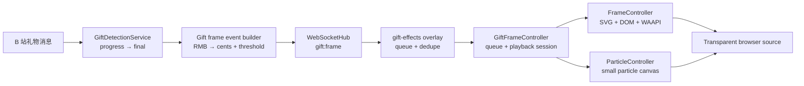
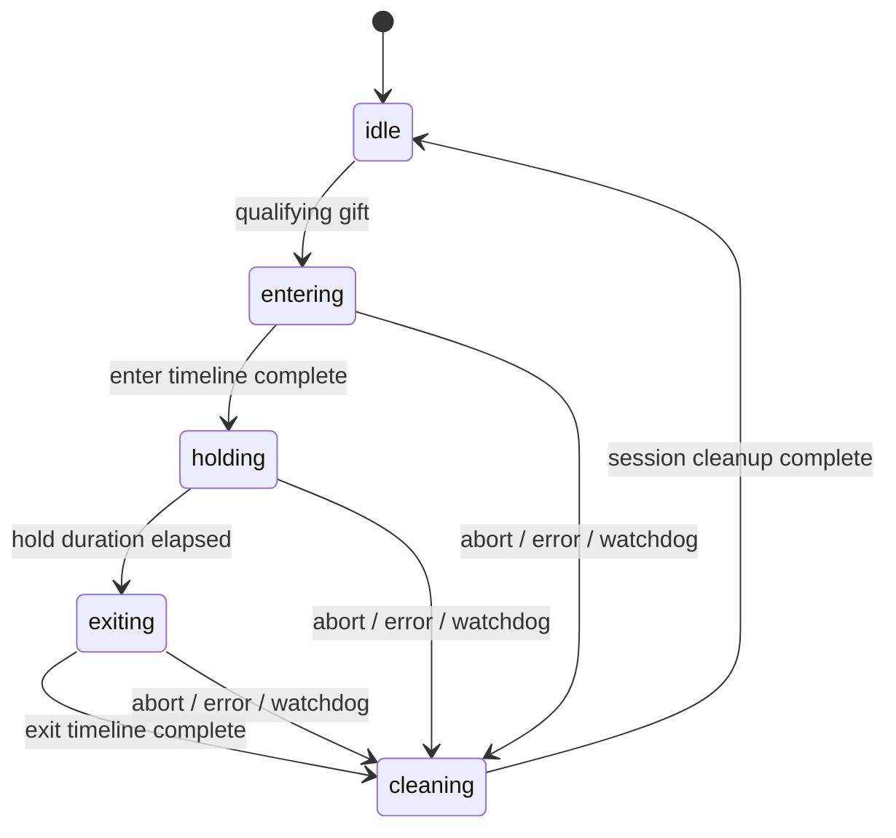

# Feature: 礼物四方边框全屏特效

## Status

Draft

本文是实现前的设计报告，描述在 LIRA 现有礼物 final 链上增加 SVG 边框、动态装饰、礼物信息和可配置金额阈值的方案。它不是已接受的实现承诺；涉及新增 settings 键、WebSocket 事件和旧媒体路径退役的部分，需要在实现前确认。

## Goal

当直播间收到达到配置金额的礼物时，LIRA 的 OBS/直播姬浏览器源播放一个透明全屏特效：四个角落与四条边从上下左右温和地进入，逐步组装成自然、轻柔、略带可爱感的固定礼物框，底边同时形成礼物信息底座，显示观众、礼物、数量和最终金额；特效保持一段时间后像被风吹散一样淡出退场。

中间直播画面保持可见。整个效果只由本地 SVG、DOM、CSS/WAAPI 和可选的少量 Canvas 粒子组成，不读取、不下载、不播放礼物本身的官方媒体特效。

## Context

### 当前运行证据

LIRA 已经具备以下基础能力：

- [`/gift-effects`](../public/pages/overlays/gift-effects.html) 是一个透明全屏浏览器源页面。
- [`public/js/overlays/gift-effects.js`](../public/js/overlays/gift-effects.js) 已连接 `/ws`，具备单个播放、有限队列、重复事件去重和预览模式的基础。
- [`src/server.js`](../src/server.js) 已在礼物收尾后执行回调；礼物检测链已有 progress → final 的连击收尾语义，可作为独立边框事件的触发入口。
- [`public/js/admin/gift-effects.js`](../public/js/admin/gift-effects.js) 已提供礼物特效工具入口和浏览器源地址复制，可以扩展为金额阈值、主题和测试信息配置。
- [`test/gift-effects-overlay.test.js`](../test/gift-effects-overlay.test.js) 已覆盖透明 Overlay、队列、预览和管理页入口，可增加边框动画专用断言。

当前能力的边界是：现有 Overlay 还没有渲染四面 SVG/DOM 边框、动态礼物信息，也没有礼物金额阈值和主题选择。现有礼物数据包含礼物名称、数量、单价、观众名和最终总金额。

LIRA 当前把 `gift_events.total_price` 定义为人民币元：协议解析把付费金瓜子除以 1000，`normalizeMoney()` 将结果归一化到两位小数，SQLite 使用 `REAL` 保存。Frame Event 不重新计算金额；它只读取 final 行的权威 `total_price`，在 Frame Adapter 边界转换成整数分后进行阈值比较和前端传输。

### 设计方向

第一套主题命名为“林间花信 / Woodland Bloom”：以细枝、叶片、小花和少量圆润果实组成边框。整体像一张自然主题的手绘卡片或植物标本框，不使用霓虹、机械锁定、能量轨道、强扫描光或大面积发光。

视觉比例以“固定边框为主、动态装饰为辅”为准：约 70%–85% 的观感来自稳定的四边、四角和底部信息底座；动态只表现为边框从四方长出、连接处轻轻亮起、个别叶尖短暂摆动和极少量萤光点。组装完成后，边框应基本安静地停留，不能让四条边持续循环跑光或整体呼吸。

主题基础色控制在 5–6 种：叶绿色、浅草绿、柔和花粉黄、低饱和花瓣粉、暖白和树皮棕。示例色值为 `#6F8F72`、`#A8C49A`、`#E7CD86`、`#E9B7B0`、`#F8F3E8`、`#4B4338`。这些颜色只作为主题 token，实际透明度应让中间直播画面保持清楚。

主题资源可以替换为其他自然风格，但不改变运行时控制器和事件协议。第二套主题仍可做成森林、花园或四季变化，而不是重新引入高密度粒子或高亮特效。

### 视觉约束

为了避免实现时又回到“很酷的全屏特效”，V1 增加以下可验收的视觉边界：

- 四边主体使用 24–48 SVG units 的细线/枝条带宽，四角植物簇不超过 150 × 150 units；
- 中间透明安全区至少保持画布宽度的 86%、高度的 78%，安全区按边框主体的 inner contour 计算。四角叶片尖端允许少量伸入，但不得形成大面积覆盖；除底部信息底座外不放置大面积半透明面板；
- 边框主体不做整体缩放、整体旋转或整体呼吸；Holding 阶段同时运动的元素最多 3 个，单个微动作位移不超过 12px、旋转不超过 2°；
- Holding 阶段不建立循环动画；每次播放最多安排 1–2 个 one-shot 微动作，且不使用四边同步跑光；没有合适的装饰动画时，允许完全静止；
- 四角每处最多 2–3 个主要装饰元素，整屏同时出现的粒子最多 6 个；
- 固定边框和礼物信息的可见度高于动态高光，任何高光都只能作为局部强调，不能形成白色闪屏或覆盖中间画面的光幕。

## Requirements

### Functional

1. Overlay 页面始终保持透明，无礼物时不产生可见内容。
2. 礼物最终事件满足金额阈值时，播放一次完整的边框动画。
3. 连击或 progress 事件不重复触发；使用礼物 final 事件作为播放入口。
4. 动画由四个 Corner、四个 Edge 和一个 Gift Information 组件组成。
5. 复杂装饰使用 SVG 分层，局部高光使用 SVG Path，过渡使用 CSS 或 Web Animations API。
6. 粒子、星屑和少量漂浮光点由独立 Canvas 层绘制；Canvas 不负责边框、文字或复杂 SVG 花纹。粒子层是可选的，V1 默认关闭或限制为进入/退场阶段的 4–6 个轻量光点。
7. 礼物信息至少展示：观众名、礼物名、数量和总金额。
8. 整个播放过程不依赖官方 MP4、外部视频或礼物 ID 到媒体资源的映射。
9. 支持单个特效串行播放、有限队列和重复事件去重。
10. 支持 `?preview=1` 测试播放和 `?debug=1` 调试背景，不改变直播时的透明效果。
11. 进入阶段内部的 Corner、Edge、局部收束高光和 Gift Information 动画必须按同一时间线重叠执行，而不是串行等待。
12. 每次播放拥有可强制取消的 PlaybackSession；正常完成、超时、异常和页面重置都必须进入同一个清理出口。
13. V1 核心 SVG 必须 inline 到 Overlay DOM，允许直接操作 path、mask、ornament、soft-shadow 和 highlight。
14. 长昵称、长礼物名、Emoji 和中英文混排不能撑破底座；金额始终完整显示。

### Non-functional

- **清晰度**：V1 明确保证 16:9 Browser Source；SVG 使用 `viewBox="0 0 1920 1080"`，适配 1080p、2K 和 4K，不依赖位图缩放。竖屏不在本版本支持范围内。
- **性能**：正常模式优先使用 `transform`、`opacity`、SVG stroke 和 mask 动画；避免 JS 每帧改写布局属性。
- **帧率**：浏览器源默认以 30 FPS 工作；高性能机器可以测试 60 FPS。
- **可靠性**：WebSocket 断线沿用现有指数退避重连；SVG、DOM、Canvas 任一视觉层失败时，其余层仍可完成生命周期；watchdog 必须保证队列继续前进。
- **可维护性**：新增代码保持 Vanilla JavaScript，不引入动画库、渲染框架或构建步骤。
- **无障碍/舒适性**：支持 `auto`、`full`、`reduced` 三种 motion mode；显式 URL/Admin 配置优先于系统 `prefers-reduced-motion`。

## Non-goals

- 不在本功能中加载或播放 B 站官方礼物 MP4，也不依赖 `effect-config.js` 的媒体映射。
- 不把礼物本身的媒体特效转码成 SVG、Canvas 或新的本地媒体格式；本方案只制作独立的金额触发边框。
- 不新增独立进程、服务、端口、前端框架或第三方运行时依赖。
- 第一版不做在线主题编辑器，不允许用户从网络加载任意 SVG、JS 或 CSS。
- 第一版不做运行时 SVG ThemeLoader；只有一个内置主题时直接使用 inline SVG 和冻结的本地时序配置。
- 第一版不渲染全屏 veil；视觉强调只来自四边、四角、礼物底座和局部高光。
- 第一版不做竖屏主题；竖屏应在后续使用独立主题，而不是把横屏边框强行压缩。
- 不修改礼物入库、冲刺统计或加班机的业务含义。

## High-level Architecture



### Layer order

```text
Layer 3  Gift information bottom plate and text
Layer 2  Inline SVG frame, corners, edges, ornaments and local highlights
Layer 1  Particle canvas
Layer 0  Transparent page
```

V1 中间区域始终透明，不增加全屏 veil。四边的局部柔和阴影或小范围高光可以向内扩散，但不能形成覆盖整个画面的透明混合层。

## Component Design

### Page structure

在现有 `giftEffectStage` 内增加固定层，不拆成多个浏览器源：

```text
giftEffectStage
├── particleStage
├── giftFrame
│   ├── gift-frame-svg (inline)
│   │   ├── corner-tl
│   │   ├── edge-top
│   │   ├── corner-tr
│   │   ├── edge-right
│   │   ├── corner-br
│   │   ├── edge-bottom
│   │   ├── corner-bl
│   │   └── edge-left
│   └── gift-info
```

所有新增层使用 `position: fixed; inset: 0; pointer-events: none`。局部高光直接作为 inline SVG 中的 `highlight` 分组，不建立独立的 flash/local-highlight DOM 层。动态文本使用 DOM 节点和 `textContent`，不使用拼接 HTML。V1 的核心 SVG 直接 inline 到 `gift-effects.html`，用稳定的 `data-frame-part` 标识各分组；不使用 ``，因为它无法直接控制内部 path、mask 和 ornament。

### GiftFrameController

`GiftFrameController` 是 Overlay 的运行时入口，负责 WebSocket 事件校验、去重、pending 队列、创建 PlaybackSession 和在当前会话结束后调度下一条。它不直接操作 SVG path 或粒子实例。

### FrameController

`FrameController` 是边框视觉层的唯一控制入口，职责是准备、进入时间线、保持、退场和重置。它不读取 WebSocket，也不负责礼物队列。

```text
prepare(payload, theme)
  → playEnterTimeline()
  → hold()
  → playExitTimeline()
  → reset()
```

`playEnterTimeline()` 同时创建 Corner、Edge、局部收束高光和 Gift Information 的 WAAPI Animation，通过各自动画的 `delay` 形成重叠组装；它不能依次 `await enterCorners()`、`await assembleEdges()`。第一版不必为每个角和每条边创建独立 JavaScript 类。Corner 和 Edge 先作为 `FrameController` 内部 DOM 分组；只有第二套主题出现实质不同时序时，再提取独立控制器。

### Corner

每个角落至少分为以下 SVG/DOM 层：

```text
corner
├── base        角落枝条/叶片主体
├── ornament    一朵小花、果实或圆润叶片
├── soft-shadow 局部柔和阴影
└── highlight   连接完成时的短暂亮点
```

进入动画建议是：主装饰从边缘短距离滑入 → 叶片/花朵从 0.98 缩放回正 → 枝条与相邻边连接 → 连接处短暂亮起。位移控制在 12px 以内，旋转不超过 2°，强调“长出来”而不是“锁定”或持续抖动。

### Edge

四条边必须分别从对应方向进入，但进入距离只略超出安全内缩区，不制造强烈的飞入感。推荐每条 Edge 同时使用“短距离移动 + 结构揭示”两层动画：顶部从上方 `translateY(-36px → 0)`，底部从下方 `translateY(+36px → 0)`，左边从左侧 `translateX(-36px → 0)`，右边从右侧 `translateX(+36px → 0)`；同时通过 mask/clipPath 或 path reveal 让枝条和叶片逐段出现。

复杂边框主体不使用 `width` 或 `scaleX` 拉伸。推荐：

- 复杂花纹使用 SVG `mask` 或 `clipPath` 从两端揭示，避免装饰被拉扁；
- 细枝和轮廓线使用 `stroke-dasharray` + `stroke-dashoffset`；
- 高光只在进入完成或退场开始时沿一小段路径移动一次，不建立持续循环的能量轨道；
- 运行期动画只改 `opacity`、`transform`、SVG stroke 属性和 mask reveal 值。

顶部和底部可以采用水平路径；左右边使用同一组路径旋转 90°，但主题资源需要在 SVG 层面确认旋转后不会破坏叶片生长方向。每条边主体以静态枝条和少量叶片为主，四边不要求同时持续出现移动高光。

### Holding ambient effects

Holding 阶段持续 2600ms，默认不建立循环动画。固定边框稳定存在，每次播放最多安排 1–2 个 one-shot 微动作，例如在 Holding 开始后约 700ms 让一片叶子轻摆一次、约 1800ms 让另一角的小花回弹一次；也允许完全静止。微动作结束后保持最终位置，不重新循环。

- 顶边：静态枝条和叶片保持不动，最多播放一次很淡的暖色高光；
- 左边：如有萤光点，只播放一次缓慢上移，不连续循环；
- 右边：与左边错开，最多播放一次叶尖 1–2px 的轻摆；
- 底边：信息底座和底部枝条保持稳定，不做整条边呼吸；
- 四角：主体固定，每次最多选择两个角执行一次性叶尖或花瓣动作。

如果没有合适的自然主题资源，Holding 阶段宁可完全静止，也不使用通用跑光、连续闪烁或密集粒子。`reduced` 模式下所有 ambient effect 都关闭。

### Gift Information

礼物信息不悬浮在画面正中，而作为底边的一部分：

```text
边框底线 ───────╮        ╭─────── 边框底线
                 ╰ 梦幻城堡 ╯
                   小明 × 2
                    ¥520
```

时序为：底边形成 → 中间留下柔和缺口 → 信息底座从下方上升 8–12px → 左右边框与底座自然连接 → 连接处出现一次小亮点 → 礼物名和金额先出现，观众名与数量随后出现。底座是边框结构的一部分，不使用厚重、强对比的产品 UI 面板。

建议字段：

```json
{
  "userName": "观众A",
  "giftName": "梦幻城堡",
  "num": 2,
  "totalPriceCents": 52000
}
```

金额使用人民币格式，例如 `¥520.00`；礼物数量和金额不能只依赖单价推算，必须使用 final 事件中的最终总金额。视觉上礼物名与金额为第一层信息，观众名和数量为第二层信息；避免四个字段等权排列成后台通知条。

底座使用 `grid` 或约束明确的 flex 布局。视觉优先级固定为：礼物名与金额并列第一层，数量与用户名为第二层。金额设置 `flex: 0 0 auto`、`white-space: nowrap` 和等宽数字；礼物名和用户名所在容器必须有 `min-width: 0`、`max-width`、`overflow: hidden`、`text-overflow: ellipsis` 和 `white-space: nowrap`。CSS 负责显示溢出，JavaScript 不按 UTF-16 code unit 粗暴截断 Emoji。

### ParticleController

Canvas 只负责少量可丢弃效果：萤光点、花粉状小点和短促碎光。它不是 V1 的必需层，默认最多同时 4–6 个粒子，而且只在进入和退场阶段出现。Holding 阶段如需要单个萤光点，使用 SVG/DOM ornament 实现；ParticleController 默认不参与 Holding。它应具备：

- 独立的粒子数量上限，默认值为 6；
- `start(theme)`、`stop()`、`resize(width, height)` 三个最小接口；
- 页面不可见或 reduced-motion 时自动停止或降级；
- 粒子渲染失败不影响 FrameController 的 SVG 和文字层。

粒子不用于承载必须传达的信息，也不使用大量半透明烟雾、连续爆发或满屏漂浮，避免在直播浏览器源中造成 GPU/CPU 压力。

### PlaybackSession

每次播放创建一个独立会话，所有可取消资源都归它所有：

```text
PlaybackSession
├── sessionId
├── AbortController
├── animations[]
├── timers[]
├── particleHandle
└── watchdog
```

会话必须以 `try/finally` 为唯一收尾路径：正常结束、watchdog 超时、控制器异常、页面重置或主动取消都会执行 `cleanupSession()`。清理内容至少包括：abort 当前信号、cancel 全部 WAAPI Animation、清理 timer/watchdog、停止粒子、移除临时 class/内联样式、恢复 SVG mask/stroke 初始值、把控制器置回 `idle`，最后调度队列下一条。

## State Machine



顶层状态只表示会话阶段。`entering` 内部是一个并行动画编排：

| Enter offset | 视觉行为 |
|---:|---|
| `0.00` | 四角出现，枝条和叶片以很小位移进入；不产生大面积光晕 |
| `0.12` | 上、下、左、右四条边分别从对应方向短距离进入，并开始 mask/path reveal |
| `0.45` | 四边逐段连接到四角，连接点出现一次柔和亮点 |
| `0.62` | 底边中央形成缺口，礼物信息底座上升 8–12px |
| `0.82` | 礼物名与金额出现，随后淡入观众名和数量 |
| `0.90` | 框体基本完成，进入稳定的 holding |
| `1.00` | entering 完成 |

时长只有一个权威来源。V1 使用冻结的本地配置：

```json
{
  "enterDuration": 900,
  "holdDuration": 2600,
  "exitDuration": 650,
  "watchdogGraceDuration": 500
}
```

进入阶段的各动画只记录 0–1 相对 offset，由 `enterDuration` 计算实际 delay。CSS 不再另写一套生命周期总时长，JS 也不重复硬编码绝对毫秒表。正常总时长为 4150ms，watchdog 为 `enter + hold + exit + grace = 4650ms`。主题配置在使用前必须经过本地范围校验，不能让异常时长无限占用队列。

从观众视角，完整 Storyboard 是：0–120ms 四角出现植物轮廓；120–650ms 四条边从对应方向温和进入并逐段显形；420–760ms 四角和边框自然连接；620–900ms 底部信息底座升起并接入；900–3500ms 固定边框稳定展示，仅保留极少量叶尖或萤光点微动作；3500–4150ms 礼物文字先淡出，四边向来时方向轻轻回收，四角最后消失。这个 Storyboard 是视觉验收依据，不要求实现成更多顶层状态。

## Event and Settings Design

### Event design

由于本功能不使用礼物本身的官方媒体特效，建议新增语义明确的 `gift:frame` 事件。不要扩展现有 `gift:effect` 协议；`/gift-effects` 的目标运行路径只消费 `gift:frame`。旧 `gift:effect` 和 `effect-config.js` 先做消费者审计，再决定迁移后删除还是与新 Overlay 隔离保留。

```json
{
  "type": "gift:frame",
  "eventId": "gift-frame:77",
  "giftEventId": 77,
  "giftId": 35457,
  "giftName": "梦幻城堡",
  "num": 2,
  "totalPriceCents": 52000,
  "userName": "观众A",
  "themeId": "woodland-bloom"
}
```

`giftEventId` 必须是 `gift_events` 中一次 final gift group 的主键，不是礼物 ID、用户 ID 或平台 WebSocket 包 ID。实时 `eventId` 由服务端确定性构造为 `gift-frame:${giftEventId}`；同一 final 行重复广播时仍得到同一 ID。Overlay 只以该字符串做播放去重。

`gift:frame` 只负责传递动态文字和主题选择，不携带视频 URL、Alpha 坐标或任何外部媒体字段。服务端 Frame Adapter 读取 final 行的 RMB `total_price`，使用 `Math.round(totalPriceRmb * 100)` 产生 `totalPriceCents`；它不使用 `unitPrice * num` 重新推算。管理页测试应新增 `POST /api/gifts/frame/preview`，直接接收并校验测试用观众名、礼物名、数量和人民币金额，不再根据礼物 ID 查询官方媒体资源。预览事件带 `preview: true` 和独立的预览 session ID，不进入实时事件去重集合。

实时事件只在服务端确认 final 且达到阈值后广播。Overlay 只消费 `gift:frame`，这样重复的 progress 包不会进入前端队列。

### Threshold

建议新增 settings 键：

```text
giftFrameEnabled
giftFrameThresholdRmb
giftFrameTheme
giftFrameMotionMode
```

推荐语义：

- `giftFrameEnabled` 默认值为 `false`；为 `false` 时，实时服务端不广播 `gift:frame`；
- `giftFrameEnabled` 为 `true` 时，才继续执行金额阈值判断；
- `giftFrameThresholdRmb` 值为非负金额；
- `giftFrameThresholdRmb` 默认值为 `20`；
- `giftFrameThresholdRmb = 0` 表示所有付费 final 礼物都可以触发边框，但不承担关闭功能；
- 线上建议由主播配置为 `20` 或其他适合房间的金额；
- 判断字段为 final 行的权威 `total_price`，不是 `unit_price`；
- 服务端将 `total_price` 和配置阈值都转换成整数分再比较；
- 合格条件固定为 `totalPriceCents > 0 && totalPriceCents >= thresholdCents`；
- 管理页测试播放显式绕过启用开关和阈值，但不进入实时事件去重集合。

由于这些是新的持久化 settings 键，实现时需要同步更新 settings 默认值、设置读写、管理页表单、owner 文档和回归测试。金额设置继续使用和 `giftSprintTargetRmb` 一致的人民币字符串格式，比较边界再转换为整数分，不迁移现有礼物数据库。推荐的 V1 默认配置是 `giftFrameEnabled=false`、`giftFrameThresholdRmb="20"`、`giftFrameTheme="woodland-bloom"`、`giftFrameMotionMode="auto"`，避免升级后自动对所有已有付费礼物播放边框。

`giftFrameMotionMode` 只接受 `auto`、`full`、`reduced`。解析优先级为：URL `?motion=` 显式值 > Admin 保存值 > 系统 `prefers-reduced-motion`。这样既保留无障碍降级，也让直播浏览器源拥有可预测的固定效果。

### Theme configuration

V1 只有一个内置主题，不建立运行时 ThemeLoader。核心 SVG inline 在 Overlay HTML 中，时序只引用 State Machine 一节定义的冻结配置；颜色、阴影、局部高光和粒子强度使用同一个本地主题对象或由它注入 CSS custom properties，不在 CSS 中重复声明生命周期时长。

`themeId` 仍通过固定 allowlist 校验，为第二套主题保留稳定协议，但 V1 只接受 `woodland-bloom`。出现第二套主题后，才评估以下本地目录和 allowlisted ThemeLoader：

```text
public/gift-effects/themes/
├── woodland-bloom/
└── seasonal-garden/
```

金额档位可以在第二阶段作为视觉强度选择规则，而不是复制动画状态机：

```text
20+   normal
100+  premium
500+  luxury
```

V1 只实现一个主题和一个动画强度，避免在没有第二套真实资源前提前抽象。

## Queue and Concurrency

继续沿用 Overlay 的单通道播放：

- `MAX_PLAYING = 1`，边框、礼物信息和粒子属于同一个播放实例；
- `MAX_PENDING = 3`；单个 pending 事件等待超过 `MAX_EVENT_AGE_MS = 12000` 时丢弃，避免礼物在队列中滞留太久；
- 每个 pending 项保存本地 `queuedAt`；从 pending 取出、准备真正开始 playback 前，必须重新检查 `now - queuedAt`；超过 `MAX_EVENT_AGE_MS` 时丢弃当前项并继续检查下一项；
- 实时 `eventId` 使用 `gift-frame:<giftEventId>` 字符串，并进入有界去重集合；
- 相同 eventId 不重复入队；
- 队列未满时按 FIFO 入队和播放；
- 队列已满且新礼物金额不高于 pending 最低金额时，丢弃新礼物；
- 队列已满且新礼物金额更高时，移除 pending 中金额最低且最晚入队的一条，再把新礼物追加到队尾；
- 当前正在播放的礼物永不被抢占；
- 预览事件不污染直播事件去重集合；过期事件也不重新排队。

该策略保持正常播放顺序，同时避免大额礼物在满队列时被低额事件直接丢弃。被丢弃或替换的数量应记录为本地调试计数，但不写入礼物账本，也不影响当前播放。

## Performance and Rendering

### CSS/SVG

- 使用 `transform`、`opacity`、`filter` 的有限组合；
- 复杂 SVG 花纹用 mask reveal，不用 `scaleX` 拉伸；
- 局部亮点使用短段 path dash 动画，不能持续覆盖四条边；
- 不在动画过程中修改 `width`、`height`、`top`、`left` 等布局属性；
- SVG 内容与 viewBox 边界保留 24–48 units 的安全内缩；需要 blur 的 filter region 必须扩大，不能裁掉角落或边缘的柔和阴影；
- 对正在动画的层谨慎使用 `will-change`，只在进入和退场期间启用，避免长期占用内存。

### Canvas

- 粒子 Canvas 使用设备像素比上限，建议 `Math.min(devicePixelRatio, 2)`；
- Canvas 尺寸只在 resize 时更新，不在每一个粒子循环里重新设置；
- 采用粒子上限和生命周期，默认主题保持低数量；
- 粒子 Canvas 与 SVG/DOM 层分离；边框动画不做逐像素图像合成。

### Reduced motion

解析后的 motion mode 为 `reduced` 时：

- 取消角落旋转和路径亮点移动；
- 粒子数量设为 0；
- 边框改为短促淡入淡出；
- 保留礼物信息、颜色和结构状态。

`full` 强制使用完整动画；`auto` 才读取系统 `prefers-reduced-motion`。URL/Admin 显式模式优先，避免主播操作系统设置意外改变直播中的礼物动画。

## Security and Failure Handling

| 情况 | 影响 | 处理 |
|---|---|---|
| 礼物名称或观众名包含 HTML | 可能注入 Overlay DOM | 只用 `textContent` 创建文本节点 |
| 长文本、Emoji 或混合文字 | 底座溢出或金额被挤压 | 约束文本列、CSS ellipsis，金额列固定且完整显示 |
| 主题 ID 被篡改 | 加载任意本地/远程资源 | 只接受内置主题 allowlist |
| SVG 资源损坏 | 边框缺失 | 回退到内置最小线框和文字信息 |
| WebSocket 断开 | 收不到新事件 | 沿用指数退避重连，清理过期连接定时器 |
| Canvas context 不可用 | 粒子层缺失 | 不影响 SVG、文字和生命周期 |
| 礼物事件短时间爆发 | 延迟或内存增长 | 队列上限、去重和可观测的丢弃计数 |
| 金额无效、为零或单位混用 | 错误触发或漏触发 | 只读取 final RMB 金额，在 Adapter 转整数分并要求 `> 0` |
| WAAPI/timer 未完成或控制器抛错 | 队列永久卡住 | PlaybackSession watchdog + AbortController + `finally` 强制清理 |
| 直播姬与 LIRA 不在同一台机器 | 本地 URL 不可访问 | 第一版要求同机运行，不通过放宽 Host 绑定解决 |

不应为了让远程直播姬访问 Overlay 而把本地服务暴露到 LAN；这会触及 LIRA 现有本地服务和 token 安全边界，需要单独的架构决策。

## Implementation Plan

### Milestone 1: Contract and static frame

范围：

- 增加 `giftFrame` 的 HTML 层级；
- inline 一个内置 `woodland-bloom` SVG 主题，不增加 ThemeLoader；
- 实现 GiftFrameController、FrameController 和并行 `playEnterTimeline()`；
- 实现 PlaybackSession、AbortController 和 watchdog 的统一清理；
- 使用本地调试 payload 预览，不接入真实礼物事件。

验证：

- `?debug=1&preview=1` 可以完整播放一轮；
- 1920×1080 和 2560×1440 下边框比例正确；
- 无事件时页面透明；
- 进入阶段的 Corner/Edge/局部高光/礼物信息按 offset 重叠，不被串行执行；
- `motion=reduced` 下无持续位移和粒子；
- 正常完成、异常和 watchdog 超时都恢复到 `idle`。

### Milestone 2: Gift frame event and threshold

范围：

- 新增 `gift:frame` 事件，携带稳定事件 ID、`totalPriceCents`、`themeId` 和礼物展示字段；
- final 礼物达到阈值后广播该事件；
- 增加 `POST /api/gifts/frame/preview`，不读取官方媒体配置；
- 审计 `gift:effect`、官方媒体映射和 Alpha Canvas 的全部消费者；如果它们只服务于旧 `/gift-effects` 运行路径，则在迁移后删除，否则保留但新 Overlay 不再消费。

验证：

- final 事件只触发一次；
- progress 和重复 WebSocket 包不重复播放；
- `giftEventId` 对应一次 final gift group，同一行重播得到相同 `gift-frame:<id>`；
- 20 元阈值下 0、19.99 不播放，20.00 播放；
- 金额从权威 RMB final 行转换成整数分，不重新计算 `unitPrice * num`；
- 满队列时低额新事件被丢弃，高额新事件替换 pending 最低金额事件；
- pending 事件在 dequeue 准备开始 playback 前重新检查 `queuedAt`，超过 12 秒不再播放并继续下一项；
- 播放结束后 FrameController、ParticleController 和 WAAPI 动画句柄全部清理。

### Milestone 3: Settings and admin controls

范围：

- 增加 `giftFrameEnabled`、`giftFrameThresholdRmb`、`giftFrameTheme` 和 `giftFrameMotionMode` 默认值和读写；
- 管理页增加启用开关、金额阈值、主题和 motion mode；
- 预览接口支持指定礼物信息或使用默认测试信息。

验证：

- settings round-trip 测试；
- `giftFrameEnabled=false` 时实时 final 礼物不广播 `gift:frame`，管理页预览仍可用；
- 非法金额被拒绝或规范化；
- 预览不改变直播阈值配置；
- motion 优先级为 URL > Admin > 系统偏好；
- 重启后配置仍然有效。

## Ownership and Compatibility

| 责任 | Owner | 现有契约/消费者 |
|---|---|---|
| 礼物 final 生命周期与总金额 | `src/bilibili/gift/` | `docs/architecture/backend/bilibili/gift.md` |
| 礼物 frame 事件构造、RMB→整数分和阈值 | `src/bilibili/gift/` 的具名 Frame Adapter | 新增 `gift-frame` focused tests |
| Overlay 页面与动画 | `public/pages/overlays/`、`public/js/overlays/`、`public/css/overlays/` | `docs/architecture/frontend/overlays.md`、`test/gift-effects-overlay.test.js` |
| 浏览器源 URL 与预览 | `public/js/admin/gift-effects.js`、`src/server/routes/gift-routes.js` | `/gift-effects`、新增 `/api/gifts/frame/preview` |
| settings 持久化 | `src/storage/settings-store.js` | `docs/architecture/backend/storage.md` |

兼容性约束：

- 保留 `/gift-effects` 地址；
- `/gift-effects` 目标运行路径只消费 `gift:frame`，不再播放 `gift:effect` 或官方媒体；
- 实现前审计旧 `gift:effect`、媒体映射、预览接口和 Alpha Canvas 的消费者；确认只服务于旧 Overlay 时随迁移删除，存在其他消费者时保留但与新 Overlay 隔离；
- 新增 `gift:frame` 事件和独立预览入口；
- 不改变礼物入库、统计、加班机结算和 progress/final 语义；
- 不把任意远程 SVG、CSS、JS 纳入主题系统；
- 不修改本地服务默认回环绑定或 token 注入规则。

## Acceptance Criteria

1. 达到阈值的 final 礼物可以在浏览器源中触发一次完整的四面组装动画。
2. 四角、四边和底部礼物信息可以独立分层，不依赖整张边框位图。
3. 四条 Edge 分别从上、下、左、右对应方向短距离进入，并与 mask/path reveal 叠加；不是只有一条路径被画出来。
4. 进入阶段的 Corner、Edge、局部高光和礼物信息在一个 WAAPI 时间线内按 offset 重叠执行，顶层状态仅为 `entering`。
5. Holding 阶段固定边框是主要视觉内容；不建立循环动画，每次最多安排 1–2 个 one-shot 微动作，动态元素最多 3 个，粒子最多 6 个，允许完全静止。
6. 生命周期只使用一份 `enterDuration/holdDuration/exitDuration` 配置；CSS 和 JS 不维护冲突的绝对总时长。
7. 复杂花纹通过 mask/clipPath reveal，细线局部亮点通过 SVG path 动画；不存在通过 `scaleX` 拉伸复杂花纹的实现。
8. 动态文本显示观众名、礼物名、数量和最终总金额，礼物名与金额为第一层信息，且使用安全文本节点；长文本省略时金额保持完整。
9. 播放逻辑完全不依赖礼物 ID 对应的官方媒体特效或外部视频，`/gift-effects` 只消费 `gift:frame`。
10. `giftFrameEnabled=false` 时实时 final 礼物不广播 `gift:frame`；启用后 Frame Adapter 才读取 final 行权威 RMB 金额并转整数分，零金额和低于阈值的事件不广播。
11. `eventId` 稳定对应一个 final gift group；同一连击的 progress 包和重复广播不会重复播放。
12. 队列正常 FIFO，最多保留 3 个 pending；dequeue 准备开始 playback 前重新检查 `now - queuedAt`，过期事件不播放，满队列按金额替换 pending 最低项，且不抢占当前播放。
13. 正常结束、异常、watchdog 和主动取消都通过 PlaybackSession `finally` 清理粒子 Canvas、WAAPI、timer 和 DOM 状态。
14. V1 使用 inline SVG，局部高光属于 SVG 内部 highlight 分组，不建立独立的高光 DOM 层、运行时 ThemeLoader 或全屏 veil。
15. 页面在无事件时透明，并能在 16:9 的 1920×1080、2560×1440 下保持正确比例。
16. `motion=auto/full/reduced` 按 URL > Admin > 系统偏好解析；reduced 模式关闭粒子和大幅运动但保留礼物信息。
17. 透明 Overlay、新 `gift:frame` 预览、启用开关、阈值边界、队列替换、过期 dequeue 和资源清理测试通过。

## Done When

- 本规格获得接受，新增 settings、`gift:frame` 事件、整数分边界和旧媒体路径处置被确认；
- focused tests 覆盖事件构造、金额归一化、阈值、唯一 ID、队列、并行时间线、SVG/DOM 分层和 PlaybackSession 清理；
- `npm run check`、`npm run verify:quick` 和完整相关测试通过；
- Overlay 在直播姬/OBS 浏览器源中以透明背景播放，且未改变中间直播画面可见性；
- owner 文档、spec index 和实现保持一致；
- 最终 diff 只包含本功能文件，没有覆盖工作区已有修改。

## External References

- [OBS Browser Source](https://obsproject.com/kb/browser-source)：透明背景、网页尺寸、FPS 和浏览器源属性。
- [StreamElements Overlays](https://docs.streamelements.com/overlays)：单浏览器源叠加和自定义 HTML/CSS/JS 的常见模式。
- [StreamElements Custom Widget](https://docs.streamelements.com/overlays/custom-widget)：事件队列和动画生命周期控制参考。
- [MDN `prefers-reduced-motion`](https://developer.mozilla.org/en-US/docs/Web/CSS/Reference/At-rules/%40media/prefers-reduced-motion)：减少动画偏好的 CSS 机制。
