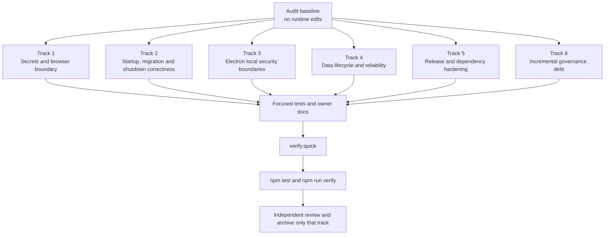

# 现有代码治理审计与整改规划

> Status: Active
> Audit date: 2026-08-17
> Scope: `src/`, `public/js/`, `scripts/`, storage schemas and migrations,
> Electron trust boundaries, runtime lifecycle, public owner documents, tests,
> dependencies, and local Windows release artifacts.

## Goal

在不进行大爆炸重构的前提下，把已经写好的代码逐步收敛到仓库治理规范：
先修复会泄露密钥、破坏用户数据、突破本地信任边界或导致旧库无法升级的问题，
再补齐生命周期、数据保留、发布链和契约治理，最后按任务切片减少已冻结的架构债务。

本文件是审计报告和整改总规划，不授权直接修改运行时代码。六个整改轨道相互独立，
实施时必须分别建立活动计划、分别评审和验收，不能合并成一次全仓重写。

## Non-goals

- 本轮不修改业务代码、数据库、配置、锁文件或发布产物。
- 不一次性迁移全部 `window.AdminApp`、域内 SQL 或空 catch 历史债务。
- 不重写 Admin、storage、Electron、AI、礼物或加班机子系统。
- 不改变 HTTP、WebSocket、IPC、页面 URL、设置键、持久化 JSON 或更新资产名，
  除非对应轨道先明确记录并接受该契约变化。
- 不把当前通过的测试当作预期行为的唯一证据；已有测试若固化了不安全行为，
  应先改为安全契约的回归测试。
- 不自动创建提交，不使用破坏性 Git 回滚，不读取或修改真实用户数据。

## Executive Conclusion

当前治理基础已经能阻止新增架构债务，但现有实现仍有需要主动整改的运行时问题。
本次确认 `0 Critical / 9 High / 13 Medium / 4 Low / 2 Info`。最高风险集中在：

1. AI 公开配置返回解密后的 API Key。
2. 新 runtime 在取得独占权前已打开并修改真实数据库。
3. 真正的 pre-v1 song/gift 数据库会在迁移前被当前索引阻断。
4. “清空全部数据”没有兑现仅保留配置的公开契约。
5. `local-media://` 将整个 Electron 数据目录视为媒体白名单。
6. 本地 HTTP 服务缺少严格的绑定主机、Host 和浏览器 Origin 边界，存在
   LAN 暴露与 DNS rebinding 后令牌泄露路径。
7. Windows 自动更新产物没有发行者签名，更新器会自动下载和安装。
8. 第三方登录页和主窗口可把任意 URI scheme 交给操作系统。
9. 生产依赖树中的 `js-yaml@4.3.0` 命中 High 级拒绝服务公告。

建议先执行 Track 1 和 Track 2。Track 3、Track 4、Track 5 可以分别规划，
但不得与前两个轨道打包成一个超大变更。Track 6 只做增量治理，不设全仓迁移目标。

## Current Behavior

- 治理文件、route table、legacy registry 和边界测试已经建立，能够阻止已知
  Admin global、域外 SQL 和空 catch 文本债务继续增加。
- 运行时仍把若干历史行为当作正常路径，包括 public AI config 返回密钥、
  runtime 构造即改库、dataDir 全目录媒体授权和未签名自动更新。
- 当前 tests 更擅长证明既有功能没有回归，尚未完整覆盖旧库真实升级、浏览器
  Host/Origin、安全关闭、跨库部分失败和发布者身份。
- owner 文档总体可定位事实，但 API 路由、gift schema 版本和 server 启动顺序
  已出现少量漂移，需要用小型确定性门禁收口。

## Audit Method And Evidence

- 按 [架构事实地图](../../docs/architecture/README.md)、
  [AI workflow route table](../../docs/architecture/engineering/ai-workflow.md)、
  exports/imports/callers、相关测试和 owner 文档的顺序确认所有权。
- 对 351 个 JavaScript 文件进行了 secrets、危险 Electron 边界、HTML sink、
  SQL、catch、生命周期和公开错误面的只读扫描。
- 手工复现了 pre-v1 song/gift 迁移失败、clear-all 残留、AI shutdown 后回写、
  pending overtime settlement 孤儿和伪造 Host 返回含令牌 Admin HTML 等行为。
- 抽查了 Admin/shared HTML sink 和 raw toast 调用；用户可控字段使用 escaping、
  `textContent` 或 DOM API，未确认新的 stored XSS 或未登记 Admin global 扩张。
- 检查了本地 `release/` 产物的 Authenticode 状态；安装器和主程序均为
  `NotSigned`。产物仅作只读证据，不纳入变更。
- `npm audit --omit=dev --audit-level=moderate --json` 返回两个 production High
  条目，均落到同一 `js-yaml` 公告；完整审计返回 19 个 High，主要来自
  Electron 构建工具的传递依赖。
- 未发现硬编码的 AWS、GitHub、Stripe、JWT、私钥或类似高置信度真实密钥。
- Semgrep、Gitleaks 和 Trivy 未安装，因此结论由 `rg` 扫描、`npm audit`、
  手工调用图审查和定向测试共同支持，不声明覆盖所有漏洞类型。

当前基线验证：

- `npm run verify:architecture`: 9/9 通过。
- Electron 定向测试: 16/16 通过；其中部分测试固化了风险行为。
- Server lifecycle/WebSocket 定向测试: 14/14 通过；现有覆盖未触及 Host、
  drain 和关闭预算问题。
- Admin 定向测试: 51/51 通过；现有前后端测试分别固化了互相冲突的加班机
  时间和权重边界，未覆盖跨层 round-trip。
- 前一治理阶段的 `npm run verify`: 533/533 通过。

## Findings Summary

### High

| ID        | Finding                                     | Evidence                                                                                                                                                                                                                                                             | Impact                                                                                                  | Track |
| --------- | ------------------------------------------- | -------------------------------------------------------------------------------------------------------------------------------------------------------------------------------------------------------------------------------------------------------------------- | ------------------------------------------------------------------------------------------------------- | ----- |
| `AUD-H01` | AI 公开配置返回明文密钥                     | [config-store.js](../../src/ai/config-store.js#L38), [api-context.js](../../src/server/api-context.js#L104), [ai-routes.js](../../src/server/routes/ai-routes.js#L31), [ai-config-store.test.js](../../test/ai-config-store.test.js#L40)                             | renderer、注入脚本和调试工具可读取 DeepSeek、QWeather、Amap Key；测试与 owner 契约相反                  | 1     |
| `AUD-H02` | runtime 构造在旧实例清理前打开并修改数据库  | [server.js](../../src/server.js#L57), [server.js](../../src/server.js#L95), [server.js](../../src/server.js#L245)                                                                                                                                                    | 仅构造第二个 runtime 就可能迁移数据库、清直播队列和执行保留期，与旧实例并发写库                         | 2     |
| `AUD-H03` | 当前索引阻断 pre-v1 数据库迁移              | [database.js](../../src/storage/database.js#L43), [schema.js](../../src/storage/schema.js#L179), [schema.js](../../src/storage/schema.js#L308)                                                                                                                       | 老用户 song/gift 数据库分别报 `no such column: pinned_at` 和 `counted_in_sprint`，无法启动升级          | 2     |
| `AUD-H04` | clear-all 未清除全部业务与个人数据          | [database.js](../../src/storage/database.js#L532), [storage.md](../../docs/architecture/backend/storage.md#L128), [api.md](../../docs/architecture/backend/api.md#L298), [settings.js](../../public/js/admin/settings.js#L425)                                       | 用户确认清空后仍保留 AI 审计/上下文/黑名单、收藏、歌单、加班机状态和规则，违反隐私与公开契约            | 4     |
| `AUD-H05` | `local-media://` 授权整个数据目录           | [local-media-access.js](../../src/electron/local-media-access.js#L15), [update-ipc.js](../../src/electron/ipc/update-ipc.js#L24), [music-ipc.js](../../src/electron/ipc/music-ipc.js#L68), [local-media-protocol.js](../../src/electron/local-media-protocol.js#L62) | renderer 边界失守时可读取 session token、五个数据库、Cookie 快照和访问清单                              | 3     |
| `AUD-H06` | 本地 HTTP 浏览器源边界缺失                  | [server.js](../../src/server.js#L36), [server.js](../../src/server.js#L139), [http-utils.js](../../src/server/http-utils.js#L107), [main.js](../../src/electron/main.js#L158)                                                                                        | 非回环 `HOST` 可直接暴露到 LAN；即使绑定回环，伪造 Host/DNS rebinding 仍可取得注入 HTML 的 bearer token | 1     |
| `AUD-H07` | Windows 自动更新发行链无签名                | [package.json](../../package.json#L56), [update-manager.js](../../src/electron/update-manager.js#L36), [publish-release.js](../../scripts/publish-release.js#L1)                                                                                                     | Release 凭据或资产被替换时，SHA-512 只能证明清单与安装器一致，不能证明发行者身份                        | 5     |
| `AUD-H08` | 任意 URI scheme 可传给 `shell.openExternal` | [main.js](../../src/electron/main.js#L284), [login-window.js](../../src/electron/login-window.js#L31), [bilibili-login-window.js](../../src/electron/bilibili-login-window.js#L37)                                                                                   | 远程内容可触发 `file:`、`ms-settings:` 或自定义协议处理器；结果取决于宿主机注册程序                     | 3     |
| `AUD-H09` | production `js-yaml@4.3.0` 命中 High 公告   | [package-lock.json](../../package-lock.json), [package.json](../../package.json)                                                                                                                                                                                     | `GHSA-5p4m-2wfm-xmqj` 可造成二次方 CPU 消耗；`electron-updater@6.8.9` 的范围允许安全的 `4.3.1`          | 5     |

### Medium

| ID        | Finding                                      | Evidence                                                                                                                                                                                                                                                                                                                                                                                 | Required outcome                                                                                                             | Track |
| --------- | -------------------------------------------- | ---------------------------------------------------------------------------------------------------------------------------------------------------------------------------------------------------------------------------------------------------------------------------------------------------------------------------------------------------------------------------------------- | ---------------------------------------------------------------------------------------------------------------------------- | ----- |
| `AUD-M01` | 删除礼物事件会遗留永久 pending 的加班结算    | [query-service.js](../../src/bilibili/gift/query-service.js#L145), [retention.js](../../src/storage/retention.js#L61), [overtime-store.js](../../src/overtime/overtime-store.js#L193)                                                                                                                                                                                                    | 手动清理和保留期删除必须在同库事务中处理 pending/applied/ignored 三类结算                                                    | 4     |
| `AUD-M02` | AI shutdown 不取消或等待在途任务             | [async-coordinator.js](../../src/ai/async-coordinator.js#L36), [ai-assistant-service.js](../../src/ai/ai-assistant-service.js#L174), [server.js](../../src/server.js#L373)                                                                                                                                                                                                               | stop 后不得投递、重新填充 ready 队列、写数据库或遗留 delivery timer                                                          | 4     |
| `AUD-M03` | 服务关闭不追踪异步 HTTP handler              | [server.js](../../src/server.js#L139), [server.js](../../src/server.js#L340), [server.js](../../src/server.js#L373)                                                                                                                                                                                                                                                                      | shutdown 必须先停止 ingress，等待请求/异步任务，再关闭 DB，且端口只能在 DB 关闭后释放                                        | 2     |
| `AUD-M04` | clear-all 跨五库逐个提交，失败后可能部分清空 | [database.js](../../src/storage/database.js#L539), [database.js](../../src/storage/database.js#L591)                                                                                                                                                                                                                                                                                     | 提交前失败统一回滚；不可避免的提交期失败返回精确 per-database partial 结果并触发状态重载                                     | 4     |
| `AUD-M05` | AI 审计、上下文和缓存没有主动保留期          | [config-store.js](../../src/ai/config-store.js#L80), [config-store.js](../../src/ai/config-store.js#L149), [retention.js](../../src/storage/retention.js#L9)                                                                                                                                                                                                                             | 启动时清 TTL 数据；AI request log 采用明确、可配置的默认保留期并支持 dry-run                                                 | 4     |
| `AUD-M06` | session token 被写入 `terminal.log`          | [server.js](../../src/server.js#L258), [terminal-log.js](../../src/electron/terminal-log.js#L49)                                                                                                                                                                                                                                                                                         | 不再输出 token 原值；桌面和终端日志统一脱敏 Authorization、Cookie、API Key、代理 userinfo 和敏感查询参数                     | 1     |
| `AUD-M07` | 登录 URL 策略允许 HTTP 降级                  | [auth-manager.js](../../src/electron/auth-manager.js#L58), [bilibili-auth.js](../../src/electron/bilibili-auth.js#L49)                                                                                                                                                                                                                                                                   | 持久化认证窗口只允许精确白名单域名的 `https:`                                                                                | 3     |
| `AUD-M08` | 端口清理信任可伪造 `serviceId` 后强杀 PID    | [lifecycle.js](../../src/server/lifecycle.js#L76), [lifecycle.js](../../src/server/lifecycle.js#L94), [lifecycle.js](../../src/server/lifecycle.js#L100)                                                                                                                                                                                                                                 | 强制终止必须同时匹配可信 runtime 记录、health PID 和进程身份；HTTP 响应不能单独授权 kill                                     | 2     |
| `AUD-M09` | 发布脚本记录完整代理 URL                     | [publish-release.js](../../scripts/publish-release.js#L74)                                                                                                                                                                                                                                                                                                                               | 日志只显示协议、主机和端口，不显示 userinfo 或敏感查询参数                                                                   | 5     |
| `AUD-M10` | 未处理异常把原始 `error.message` 返回客户端  | [server.js](../../src/server.js#L152)                                                                                                                                                                                                                                                                                                                                                    | 已知输入错误映射稳定 4xx；未知 5xx 只返回固定公开消息，详细错误仅进脱敏日志                                                  | 1     |
| `AUD-M11` | 旧实例清理预算短于合法 graceful shutdown     | [server.js](../../src/server.js#L31), [playback-flush.js](../../src/electron/playback-flush.js#L5), [lifecycle.js](../../src/server/lifecycle.js#L87)                                                                                                                                                                                                                                    | 等待预算覆盖 renderer flush、runtime drain 和 server close；强杀前重新验证实例                                               | 2     |
| `AUD-M12` | Admin 控制页可被跨站 iframe                  | [http-utils.js](../../src/server/http-utils.js#L145)                                                                                                                                                                                                                                                                                                                                     | Admin HTML 返回 `Content-Security-Policy: frame-ancestors 'none'` 和 `X-Frame-Options: DENY`；overlay 页面保持可供 OBS 使用  | 1     |
| `AUD-M13` | 加班机限制在后端、Admin 和 owner 文档间漂移  | [overtime-contract.js](../../src/overtime/overtime-contract.js#L3), [schema.js](../../src/storage/schema.js#L315), [overtime.js](../../public/js/admin/overtime.js#L380), [overtime-rule-editor.js](../../public/js/admin/overtime-rule-editor.js#L5), [overtime.md](../../docs/architecture/backend/overtime.md#L165), [frontend-queue.test.js](../../test/frontend-queue.test.js#L377) | Admin 必须无损加载、展示和提交所有服务端合法值；限制由后端契约通过 additive `limits` 下发，前端和 owner 文档不再复制过期常量 | 4     |

### Low And Informational

| ID        | Severity | Finding                                                      | Evidence / disposition                                                                                                                                                                                                           |
| --------- | -------- | ------------------------------------------------------------ | -------------------------------------------------------------------------------------------------------------------------------------------------------------------------------------------------------------------------------- |
| `AUD-L01` | Low      | 音乐登录首次 `loadURL` 失败会遗留窗口和 Cookie listener      | [login-window.js](../../src/electron/login-window.js#L68); Track 3 统一 cleanup 并补失败测试                                                                                                                                     |
| `AUD-L02` | Low      | API owner 文档漏记四个公开端点                               | [gift-routes.js](../../src/server/routes/gift-routes.js#L58), [overtime-routes.js](../../src/server/routes/overtime-routes.js#L21), [api.md](../../docs/architecture/backend/api.md#L5); Track 6 增加 route-key 与文档完整性门禁 |
| `AUD-L03` | Low      | storage owner 文档仍写 gift DB v1-v5，代码已到 v6            | [storage.md](../../docs/architecture/backend/storage.md#L104), [database.js](../../src/storage/database.js#L94); Track 2 随迁移测试修正文档                                                                                      |
| `AUD-L04` | Low      | server owner 文档错误描述 `PORT` 和启动迁移顺序              | [server-core.md](../../docs/architecture/backend/server-core.md#L43), [server.js](../../src/server.js#L57); Track 2 修正文档并避免复制易漂移顺序                                                                                 |
| `AUD-I01` | Info     | 可选 `cookies.txt` 明文 Bilibili Cookie 导出没有仓库内消费者 | [bilibili-auth.js](../../src/electron/bilibili-auth.js#L99), [auth.md](../../docs/architecture/desktop/auth.md#L84); 实施前需确认外部兼容需求，不自动删除用户文件                                                                |
| `AUD-I02` | Info     | 主窗口仍为 `sandbox: false`，CSP/IPC sender 参数门禁不完整   | [main.js](../../src/electron/main.js#L263); 当前未确认直接利用链，作为 Electron 后续加固，不与 P0 修复混做                                                                                                                       |

## Frozen Debt, Not New Defects

以下基线已经由治理测试冻结，只能在任务触及相应代码时减少。它们不构成本轮
一次性整改范围，也不能作为“大重构”的理由：

- 11 个文件、115 处 receiver-aware SQL 位于 `src/storage/` 之外。
- 39 个文件、382 个 `window.AdminApp` 文本 token。
- 37 个文件、65 个空或仅注释 catch。
- 31 个 Admin 模块中，13 个为 ESM，18 个为 classic/IIFE。
- [domain-services.js](../../src/server/domain-services.js#L48) 的共享 mutable state、
  [domain-services.js](../../src/server/domain-services.js#L61) 的宽 `baseContext`、
  [shared/utils.js](../../src/shared/utils.js) 的高 fan-in，以及较大的 composition roots
  都属于已登记迁移方向。

任何整改轨道只能迁移它直接触及的一小段债务，并同步降低对应测试基线；不得
为了“顺手变规范”改写邻接模块。

## Ownership

| Area                                  | Runtime owner                                                     | Public contract                                                                 | Primary tests                                                                                                                              |
| ------------------------------------- | ----------------------------------------------------------------- | ------------------------------------------------------------------------------- | ------------------------------------------------------------------------------------------------------------------------------------------ |
| AI config and lifecycle               | `src/ai/`, `src/server/ai-runtime.js`                             | `docs/architecture/backend/ai.md`                                               | `test/ai-config-store.test.js`, `test/ai-routes.test.js`, `test/ai-assistant-service.test.js`                                              |
| Server lifecycle and browser boundary | `src/server.js`, `src/server/`                                    | `docs/architecture/backend/server-core.md`, `api.md`, `ws.md`                   | `test/server-smoke.test.js`, `test/server-lifecycle.test.js`, `test/websocket-transport.test.js`                                           |
| Storage and migrations                | `src/storage/`                                                    | `docs/architecture/backend/storage.md`                                          | `test/database-maintenance.test.js`, `test/overtime-service.test.js`                                                                       |
| Electron security                     | `src/electron/`                                                   | `docs/architecture/desktop/`                                                    | `test/electron-main-modules.test.js`, `test/local-media-access.test.js`, `test/bilibili-login-window.test.js`, `test/terminal-log.test.js` |
| Admin clear-data UX                   | `public/js/admin/settings.js`                                     | `docs/architecture/frontend/app.md`, backend API/storage owners                 | `test/frontend-admin-shell.test.js`, `test/server-smoke.test.js`                                                                           |
| Release and dependencies              | `package.json`, `package-lock.json`, `scripts/publish-release.js` | `docs/architecture/engineering/build.md`, `docs/architecture/desktop/update.md` | `test/update-manager.test.js`, new release preflight tests                                                                                 |

## Compatibility Constraints

- `PUT /api/ai/config` 继续保持：secret 空字符串表示不覆盖，`null` 表示显式清除；
  GET/PUT 响应只删除 secret 字段并保留三个 `has*ApiKey` 布尔值。
- 服务公开地址继续是 `http://127.0.0.1:<port>`；`localhost` 可归一化为
  `127.0.0.1`，非回环监听不属于当前本地应用契约。
- 保持 session token、Authorization、WebSocket token 和静态页面注入的现有
  客户端兼容方式，但只对严格允许的 Host/Origin 提供页面和连接。
- 保持 `local-media://media/<base64url-path>` URL、Range 请求和已选择本地音频
  的重启恢复；删除的是整个 `dataDir` 的隐式授权，不是本地播放能力。
- 数据库迁移只追加或重排“基础建表 -> 迁移 -> 依赖索引”的执行阶段；不得修改
  已发布迁移步骤的含义，不得丢失现有行。
- clear-all 明确保留普通 settings、theme presets 和作为设置保存的 AI provider
  配置；删除审计、个人上下文、黑名单、业务队列、收藏/歌单和加班机业务状态。
- 保持 Node.js 24+、CommonJS backend、Vanilla JS ESM、`node:test`、Electron
  packaging 和现有安装器/更新资产名。
- 不新增进程、服务、端口、前端构建步骤、框架或运行时依赖。

## Remediation Architecture



Execution rules:

- Track 1 and Track 2 are P0/P1 and should be planned first.
- Track 3、Track 4、Track 5 可并行设计，但每个轨道独立提交、独立回滚。
- Track 6 永远按当前业务任务切片，不设“完成全仓迁移”的 milestone。
- 每个轨道开始前，先检查相同文件是否已有用户改动；有重叠时先合并意图，
  不能覆盖或回退用户变更。

## Proposed Changes

1. 收紧公开 secret、HTTP Host/Origin、Admin framing 和日志/错误边界。
2. 将 runtime 初始化移到取得端口独占之后，并让数据库在端口释放前完成关闭。
3. 修复 pre-v1 schema 的“基础表、迁移、依赖索引”顺序。
4. 将 Electron 本地媒体、外链和登录导航改为显式最小授权。
5. 用逐表矩阵、写入 quiesce、结算协调和 AI drain 完成数据生命周期治理。
6. 建立签名发布门禁、修复 production advisory，并逐项补齐契约文档门禁。

这些变化分别属于六个可独立验收的 deliverable，不新增服务、框架、端口或
前端构建步骤。

## Milestones

## Track 1: Immediate Secrets And Browser Boundary

Recommended child plan:
`specs/plans/2026-08-17-secrets-and-browser-boundary-hardening.md`

### Deliverable 1.1: Remove Secrets From Public AI Config

Files:

- Modify: `src/ai/config-store.js`
- Modify: `public/pages/admin/toolbox/danmaku.html`
- Modify: `public/js/admin/ai-assistant-settings.js`
- Modify: `test/ai-config-store.test.js`
- Modify: `test/ai-routes.test.js`
- Modify: `test/frontend-admin-ai.test.js`
- Modify: `docs/architecture/backend/api.md`
- Modify: `docs/architecture/backend/ai.md`
- Modify: `docs/architecture/frontend/app.md`

Steps:

- [ ] Change the public projection to derive `has*ApiKey` first, then remove every
      key in `AI_SECRET_KEYS`; do not maintain a second hardcoded secret list.
- [ ] Replace the test that expects `sk-secret-value` in the public result with
      assertions that all three keys are absent while internal `getConfig()` still
      returns the decrypted value.
- [ ] Add GET and PUT route assertions proving response bodies never contain
      plaintext keys and blank/`null` update semantics remain unchanged.
- [ ] Keep secret input values empty after loading, but when a `has*ApiKey` flag
      is true, render a fixed `********` mask inside the corresponding input so a
      novice user can clearly see that the Key was saved successfully. The mask is
      display-only and must never be treated as, submitted as, or persisted as a Key.
- [ ] Use password-style inputs so newly pasted Key text is visually masked. An
      untouched masked field preserves the existing Key; a real newly entered value
      replaces it; explicit `null` clearing semantics remain unchanged.
- [ ] Document the exact GET/PUT secret-field contract in
      `docs/architecture/backend/api.md`, the storage/public-projection boundary in
      `docs/architecture/backend/ai.md`, and the `********` saved-state behavior in
      `docs/architecture/frontend/app.md`.
- [ ] Add Admin regressions proving all three saved flags render `********`, the
      DOM never receives the real secret, untouched fields preserve their Keys, and
      the mask is never included in a PUT or model-list request.

Focused verification:

```powershell
node --test test/ai-config-store.test.js test/ai-routes.test.js test/frontend-admin-ai.test.js
```

### Deliverable 1.2: Enforce The Local Browser Origin Boundary

Files:

- Modify: `src/server.js`
- Modify: `src/server/http-utils.js`
- Modify: `src/server/ws.js`
- Modify: `test/server-smoke.test.js`
- Modify: `test/websocket-transport.test.js`
- Modify: `test/admin-page-composition.test.js`
- Modify: `docs/architecture/backend/server-core.md`
- Modify: `docs/architecture/backend/ws.md`

Steps:

- [ ] Accept only `127.0.0.1` and `localhost` input, normalized to
      `127.0.0.1`; reject `0.0.0.0`, LAN addresses and arbitrary hostnames before
      any filesystem or database side effect.
- [ ] Build request URLs from the trusted runtime base URL, not
      `req.headers.host`; reject an unexpected Host header before serving HTML,
      APIs or WebSocket upgrades.
- [ ] Validate browser Origin for state-changing API requests and WebSocket
      upgrades when Origin is present; preserve non-browser health checks.
- [ ] Add Admin-only `frame-ancestors 'none'` and `X-Frame-Options: DENY`;
      do not apply frame blocking to OBS overlay pages.
- [ ] Add regressions for `Host: rebind.example`, non-loopback startup,
      mismatched WS Origin and cross-site iframe headers; responses must not include
      the session token.

### Deliverable 1.3: Stop Credential And Internal Error Leakage

Files:

- Create: `src/shared/log-redaction.js`
- Modify: `src/server.js`
- Modify: `src/server/http-utils.js`
- Modify: `src/electron/terminal-log.js`
- Modify: `src/electron/main.js`
- Modify: `test/terminal-log.test.js`
- Create: `test/http-utils.test.js`

Steps:

- [ ] Remove the startup line that prints the bearer token; keep the protected
      token file and runtime API intact.
- [ ] Apply one focused string redactor before both `terminal.log` and
      `desktop.log` writes; cover bearer headers, cookie values, secret-key JSON
      fields, URL query secrets and proxy userinfo.
- [ ] Map malformed JSON and oversized request bodies to stable 4xx responses;
      map unexpected exceptions to a fixed 500 message while logging the redacted
      detail locally.
- [ ] Add string、object、Error and URL regression cases proving raw credentials
      never reach either log.

Track 1 Done When:

- Public AI responses contain no secret field or value.
- Every configured AI Key is shown in Admin as `********` without placing the
  real Key or the mask sentinel in submitted configuration data.
- Rebinding/LAN/foreign Origin requests cannot obtain token-bearing HTML or WS.
- Admin cannot be framed by another site; overlays remain frame-compatible.
- Neither local log nor generic 500 response exposes credentials or internals.
- Focused tests, `npm run verify:quick`, `npm test`, and `npm run verify` pass.

## Track 2: Startup, Migration And Shutdown Correctness

Recommended child plan:
`specs/plans/2026-08-17-startup-migration-lifecycle-correctness.md`

### Deliverable 2.1: Make Runtime Construction Side-effect Free

Files:

- Modify: `src/server.js`
- Modify: `src/server/lifecycle.js`
- Modify: `test/server-smoke.test.js`
- Modify: `test/server-lifecycle.test.js`
- Modify: `docs/architecture/backend/server-core.md`

Required startup order:

1. Validate host and options without touching the data directory.
2. Ask a trusted old instance to stop and wait for its port release.
3. Bind the exact port to reserve exclusivity; while initializing, return a
   stable `503 starting` health state and no token-bearing HTML.
4. Open databases, run migrations, build stores/runtimes, repair gift data,
   ensure defaults, clear active queue and run startup retention.
5. Write token/runtime files, mark ready, then reconnect external runtimes.

Steps:

- [ ] Move all `createDatabases()` and startup mutations from constructor time
      into the post-bind initialization phase.
- [ ] Keep every created resource in explicit creation order; failure closes
      partial resources in reverse order, removes only files owned by this instance
      and releases the reserved listener.
- [ ] Add a temp-directory test proving `createServerRuntime()` alone creates no
      DB, token, runtime-info or log file and changes no queue row.
- [ ] Add a two-runtime test proving the old instance completes shutdown before
      the new instance opens the same DB and performs startup repair.

### Deliverable 2.2: Repair Pre-v1 Migration Ordering

Files:

- Modify: `src/storage/schema.js`
- Modify: `src/storage/database.js`
- Modify: `test/database-maintenance.test.js`
- Modify: `docs/architecture/backend/storage.md`

Steps:

- [ ] Split each schema into idempotent base table DDL and migration-dependent
      index DDL; run `base tables -> immutable migrations -> dependent indexes`.
- [ ] Do not edit or renumber published migration steps; v1 remains the owner of
      `pinned_at` and `counted_in_sprint` compatibility columns.
- [ ] Build real pre-v1 song and gift fixtures, keep representative rows, start
      twice, and assert data、schema versions and all current indexes survive.
- [ ] Correct the owner document from gift v1-v5 to v1-v6 and document the
      three-stage ordering instead of copying volatile source line numbers.

### Deliverable 2.3: Quiesce Before Releasing The Port

Files:

- Modify: `src/server.js`
- Modify: `src/server/lifecycle.js`
- Modify: `src/electron/playback-flush.js` only if a shared deadline is needed
- Modify: `test/server-smoke.test.js`
- Modify: `test/server-lifecycle.test.js`

Required shutdown order:

1. Enter quiescing state and reject new business requests.
2. Stop Bilibili/WS ingress and await the renderer playback flush.
3. Await tracked HTTP handlers, AI work, gift finalization and owned timers.
4. Optimize and close all databases.
5. Close the HTTP listener, release the port, remove owned runtime files and
   exit if requested.

Steps:

- [ ] Track async request promises and reject new work with stable 503 while
      quiescing; health may report the shutdown state without touching closed stores.
- [ ] Increase previous-instance wait budget to cover the documented worst-case
      graceful deadline plus a bounded margin; do not SIGTERM at 1.2 seconds.
- [ ] Force-kill only when runtime record PID、health PID and process identity
      all match; a public `serviceId` response alone never authorizes kill.
- [ ] Add failure-injection tests for handler drain、renderer flush、DB close and
      spoofed PID; confirm the new instance cannot open the DB before port release.

Track 2 Done When:

- Runtime construction is pure with respect to disk and DB state.
- Real pre-v1 fixtures upgrade twice without loss or missing-index errors.
- Shutdown completes writers and closes DBs before another instance can start.
- A spoof local service cannot cause another PID to be terminated.
- Focused tests and all layered gates pass.

## Track 3: Electron Local Security Boundaries

Recommended child plan:
`specs/plans/2026-08-17-electron-local-security-boundaries.md`

### Deliverable 3.1: Restrict Local Media To Explicit Audio Grants

Files:

- Modify: `src/electron/local-media-access.js`
- Modify: `src/electron/local-media-protocol.js`
- Modify: `src/electron/ipc/music-ipc.js`
- Modify: `test/local-media-access.test.js`
- Modify: `test/electron-main-modules.test.js`
- Modify: `docs/architecture/desktop/main.md`
- Modify: `docs/architecture/desktop/preload.md`

Steps:

- [ ] Remove the implicit `dataDir` subtree allowance; only exact paths selected
      through the audio file dialog and persisted in the allowlist may resolve.
- [ ] Canonicalize both grants and requests with `realpath`; reject symlink or
      junction escape and reject files that no longer resolve to the granted target.
- [ ] Enforce the current audio extension set at grant、resolution and protocol
      serving boundaries; never fall back to `application/octet-stream` for an
      unapproved extension.
- [ ] Prove `.session-token`、all DB files、Cookie snapshots and the allowlist
      itself return 403 while selected audio and Range requests still work.

### Deliverable 3.2: Centralize External URL And Login Policy

Files:

- Create: `src/electron/external-url-policy.js`
- Modify: `src/electron/main.js`
- Modify: `src/electron/login-window.js`
- Modify: `src/electron/bilibili-login-window.js`
- Modify: `src/electron/auth-manager.js`
- Modify: `src/electron/bilibili-auth.js`
- Create: `test/electron-url-policy.test.js`
- Modify: `test/bilibili-login-window.test.js`

Steps:

- [ ] Allow `shell.openExternal` only for parsed `https:` URLs; reject `file:`,
      `javascript:`, `data:`, `ms-settings:` and custom schemes without invoking the OS.
- [ ] Keep provider domain allowlists for in-window navigation, but require
      `https:` and exact hostname matching.
- [ ] Install cleanup before initial `loadURL`; on navigation failure remove
      Cookie listeners and destroy the failed login window.
- [ ] Add direct policy tests plus handler integration tests for all three window
      types.

### Deliverable 3.3: Resolve Plaintext Cookie Compatibility Explicitly

Decision before implementation:

- Repository search found no consumer of `cookies.txt`.
- Recommended decision: remove future plaintext export after the owner confirms
  there is no external integration. Do not automatically delete an existing
  user file without a separate explicit destructive-data decision.
- If an external consumer exists, replace continuous export with explicit,
  one-shot, short-lived export and record owner、expiry、ACL and removal criteria
  in the legacy registry.

Track 3 Done When:

- `local-media://` can serve only explicitly granted audio files.
- OS external opening is HTTPS-only and login windows cannot downgrade to HTTP.
- Initial navigation failure leaves no window/listener leak.
- The plaintext Cookie path has an explicit accepted compatibility decision.
- Electron-focused tests and all layered gates pass.

## Track 4: Data Lifecycle And Reliability

Recommended child plan:
`specs/plans/2026-08-17-data-lifecycle-reliability.md`

### Deliverable 4.1: Define And Enforce The Clear-all Matrix

Files:

- Modify: `src/storage/database.js`
- Modify: `src/server/domain-services.js`
- Modify: `src/server/routes/data-routes.js`
- Modify: `public/js/admin/settings.js`
- Modify: `test/database-maintenance.test.js`
- Modify: `test/server-smoke.test.js`
- Modify: `test/frontend-admin-shell.test.js`
- Modify: `docs/architecture/backend/storage.md`
- Modify: `docs/architecture/backend/api.md`

Required matrix:

- Preserve: `settings`, `theme_presets`, and AI provider configuration/keys as
  settings.
- Delete: songs、categories、queue、request history、imports、cooldowns、AI request
  logs、usage、viewer context、query cache、blacklist、Super Chats、gift events、
  settlements、overtime rules/state、play history、queue snapshot、favorites、
  playlists/tracks and check-ins.
- Recreate required singleton/default rows after deletion, including default song
  category and default disabled overtime machine state.

Steps:

- [ ] Insert one row into every business table across all five temp databases and
      assert the exact post-clear matrix table by table.
- [ ] Begin all DB transactions before deleting; a pre-commit failure rolls all
      back. If a commit-stage failure occurs, return a structured per-database result
      with `partial: true`, committed/rolled-back/unknown state and force every client
      to reload rather than claiming success.
- [ ] Quiesce pre-clear asynchronous writers so no request accepted before the
      confirmation can repopulate deleted AI or gift data after the response.
- [ ] Reset in-memory cooldown、gift、overtime and playback state only after the
      corresponding persistent operation succeeds.
- [ ] Expand Admin confirmation and result copy to list all deleted data and the
      exact preserved configuration; do not keep the current under-description.

Public-contract gate:

- A structured partial-failure response is an explicit additive error contract.
  Record it in `docs/architecture/backend/api.md` and the child plan before code
  changes; success status/path remain unchanged.

### Deliverable 4.2: Keep Gift Deletion And Overtime Settlement Consistent

Files:

- Create: `src/storage/gift-maintenance-store.js`
- Modify: `src/bilibili/gift/query-service.js`
- Modify: `src/storage/retention.js`
- Modify: `src/server/domain-services.js`
- Modify: `test/overtime-service.test.js`
- Modify: `test/database-maintenance.test.js`

Steps:

- [ ] Move the touched clear-recent SQL behind the storage owner rather than
      adding more receiver-aware SQL to the gift domain.
- [ ] In one `BEGIN IMMEDIATE` transaction, mark pending settlements for deleted
      events as `ignored` with a stable maintenance reason, preserve completed audit
      rows when the narrow clear contract allows it, then delete gift events.
- [ ] Apply the same coordination to retention deletion and cover pending、applied
      and ignored settlements for both manual and automatic paths.
- [ ] Confirm `countPending()`、recovery scheduling and recent audit lists contain
      no unreachable orphan after maintenance.

### Deliverable 4.3: Add AI Cancellation And Retention Governance

Files:

- Modify: `src/ai/async-coordinator.js`
- Modify: `src/ai/ai-assistant-service.js`
- Modify: `src/ai/danmaku-delivery-verifier.js`
- Modify: `src/ai/http-client.js` and provider/tool adapters that need a signal
- Modify: `src/server/ai-runtime.js`
- Modify: `src/storage/retention.js`
- Modify: `src/storage/settings-store.js`
- Modify: `test/ai-assistant-service.test.js`
- Modify: `test/ai-danmaku-delivery-verifier.test.js`
- Modify: `test/database-maintenance.test.js`

Steps:

- [ ] Make `shutdown()` asynchronous: reject new jobs, abort network/tool work,
      clear delivery waiters, await tracked promises and check cancellation before
      context/cache/audit writes or danmaku delivery.
- [ ] Resolve pending delivery waiters as false and clear every owned timer during
      stop.
- [ ] Call TTL prune at trusted startup after exclusivity is acquired.
- [ ] Add `aiRequestLogRetentionDays` with a documented default of 30 days;
      include log counts in dry-run/real retention results. Keep blacklist and current
      provider configuration until explicit clear-all or user action.
- [ ] Test a hanging generation released after shutdown: no DB write、delivery、
      ready job or timer may remain.

### Deliverable 4.4: Make Overtime Limits A Round-trip Contract

Files:

- Modify: `src/overtime/overtime-service.js`
- Modify: `src/server/routes/overtime-routes.js` only if response composition stays
  at the HTTP boundary
- Modify: `public/js/admin/overtime.js`
- Modify: `public/js/admin/overtime-rule-editor.js`
- Modify: `test/overtime-service.test.js`
- Modify: `test/server-smoke.test.js`
- Modify: `test/frontend-queue.test.js`
- Modify: `docs/architecture/backend/overtime.md`
- Modify: `docs/architecture/backend/api.md`
- Modify: `docs/architecture/frontend/app.md`

Current recommended owner:

- Treat the v6 schema checks、`src/overtime/overtime-contract.js` exports and
  backend validation tests as the current contract unless an accepted spec or
  ADR explicitly supersedes them. They currently agree on
  `MAX_OVERTIME_SECONDS = 9_999 * 365 * 24 * 60 * 60`,
  `MAX_EFFECT_FACTOR = 1_000`, `MAX_RANDOM_WEIGHT = 100_000` and
  `MAX_ENABLED_RULES = 8`.

Steps:

- [ ] Add a `limits` object to the successful `GET /api/overtime` data, derived
      from the backend contract and containing at least `maxSeconds`,
      `maxEffectFactor`, `maxRandomWeight` and `maxEnabledRules`; existing fields、
      status and path remain unchanged.
- [ ] Make Admin validators and input bounds consume the returned limits; remove
      the stale 999-hour initial-time clamp、24-hour rule-effect ceiling and 10,000
      per-outcome weight ceiling instead of replacing them with another copied value.
- [ ] Preserve any server-valid value during load、render and save. If a control
      cannot conveniently edit the full range, it must still display and round-trip
      the untouched value without silent normalization.
- [ ] Correct backend API、overtime and frontend owner documents in the same
      change and remove frontend tests that inject stale constants.
- [ ] Add maximum-boundary fixtures for initial/remaining time、fixed effects and
      random outcomes; load them through `GET /api/overtime`, render them in Admin,
      submit without edits and assert exact values survive.

Public-contract gate:

- `limits` is an additive public response change. Record its exact field names、
  units and ownership in the child plan and `docs/architecture/backend/api.md`
  before implementation; clients that ignore the new object remain compatible.

Track 4 Done When:

- Clear-all matches the explicit table matrix and reports partial failure honestly.
- Gift cleanup cannot create unreachable pending settlements.
- AI and HTTP/gift writers cannot write after shutdown or a confirmed clear barrier.
- TTL and 30-day AI audit retention are deterministic, idempotent and visible in
  dry-run statistics.
- Every backend-valid overtime boundary value survives API -> Admin -> API
  round-trip without truncation, rejection or a frontend-owned business limit.
- All focused and layered gates pass with only temp databases.

## Track 5: Windows Release And Dependency Hardening

Recommended child plan:
`specs/plans/2026-08-17-windows-release-dependency-hardening.md`

### Required Owner Input

Before implementation, the release owner must provide the exact Windows code
signing certificate subject/publisher name and the approved secret-storage method.
The plan must never invent a publisher identity or commit certificate material.

### Deliverable 5.1: Require A Signed Update Chain

Files:

- Modify: `package.json`
- Modify: `scripts/publish-release.js`
- Create: `scripts/verify-windows-release.js`
- Create: `test/release-verification.test.js`
- Modify: `test/update-manager.test.js`
- Modify: `docs/architecture/engineering/build.md`
- Modify: `docs/architecture/desktop/update.md`

Steps:

- [ ] Configure the accepted `publisherName` and force code signing for release
      builds; signing credentials remain outside the repository.
- [ ] Before tag or upload, verify installer and unpacked executable are
      Authenticode `Valid`, signed by the exact accepted subject and timestamped.
- [ ] Keep the current SHA-512/latest.yml verification as transport integrity;
      do not treat it as a substitute for publisher identity.
- [ ] Make release preflight fail closed for unsigned、wrong-publisher、invalid or
      non-timestamped artifacts and prove no upload command runs after failure.
- [ ] Keep existing installer name、version and updater asset contract.

### Deliverable 5.2: Remove Credential Logging And Known Production Advisory

Files:

- Modify: `scripts/publish-release.js`
- Modify: `package-lock.json`
- Modify only if necessary: `package.json`
- Modify: `test/release-verification.test.js`

Steps:

- [ ] Log only proxy protocol/host/port; remove userinfo and sensitive query
      parameters before any console output.
- [ ] Refresh the transitive `js-yaml` lock entry to `4.3.1` within
      `electron-updater`'s existing semver range; do not add an unnecessary direct
      runtime dependency and do not use `npm audit fix --force`.
- [ ] Run `npm ci`, inspect the lockfile diff, and verify
      `npm audit --omit=dev --audit-level=moderate` has no production High result.
- [ ] Triage the remaining build-tool advisories separately against the latest
      direct Electron packaging dependencies; do not suppress them by changing the
      deterministic local `verify` gate into a network-dependent command.

Focused verification:

```powershell
node --test test/release-verification.test.js test/update-manager.test.js
npm ci
npm audit --omit=dev --audit-level=moderate
npm run dist:win:local
```

Release verification additionally requires `Get-AuthenticodeSignature` to report
`Valid` for both shipped executables and the expected signer before publication.

Track 5 Done When:

- An unsigned or wrong-publisher build cannot be released.
- Proxy credentials never enter terminal/CI logs.
- Production dependency audit has no High entry from `js-yaml`.
- Signed update install flow and existing asset names remain compatible.

## Track 6: Incremental Governance And Contract Coverage

Recommended child plan:
`specs/plans/2026-08-17-incremental-governance-coverage.md`

Files:

- Modify: `docs/architecture/backend/api.md`
- Modify: `test/governance-docs.test.js`
- Modify only when touched debt decreases: `test/module-boundaries.test.js`
- Modify relevant owner documents identified by a child track

Steps:

- [ ] Export or derive the literal registered API route keys and compare them
      against backticked `METHOD /api/path` entries in the owner document; fail on
      missing and stale entries. Add the four currently missing gift-effect/overtime
      routes first.
- [ ] Keep numeric debt authority only in architecture tests. When a task removes
      SQL、global or empty-catch matches, lower or delete that exact per-file baseline.
- [ ] Move only touched receiver-aware SQL into a real storage owner; do not
      introduce repositories for unrelated code or hypothetical reuse.
- [ ] Convert classic Admin producer/consumer slices only when a feature or fix
      already changes both ends; preserve page fragment order and no-build loading.
- [ ] Correct owner-document facts in the same track that changes runtime
      behavior; do not rewrite documentation merely to mirror a defect.

Track 6 Done When:

- API docs cannot silently omit or retain stale route keys.
- No tracked debt metric increases and task-owned reductions are reflected in
  the enforcing tests.
- No big-bang Admin/storage/composition-root migration is introduced.

## Verification Strategy

For every child plan, run the narrowest deterministic test first, then expand:

1. Directly affected test files named in that track.
2. `npm run verify:docs` when owner or governance documents change.
3. `npm run verify:architecture` when dependency boundaries or frozen debt change.
4. `npm run check` for JavaScript syntax.
5. `npm run verify:quick` before review.
6. `npm test` and `npm run verify` before marking the child plan done.

Final review for each track:

```powershell
git diff --check
git status --short --untracked-files=all
git diff --stat
git diff
git diff --cached
```

`git diff --cached` is required only because this worktree already contains staged
governance content. Review it; do not unstage, restore or rewrite unrelated user
changes.

## Rollback Or Failure Handling

- Stop at the first failed focused test and inspect only the current track's diff.
- Revert task-owned hunks with an explicit patch. Never use blanket checkout、
  `git reset --hard` or broad deletion.
- Do not modify real user DBs in tests. Migration and clear-data tests use temp
  directories and complete five-database fixtures.
- Never rewrite a published migration to roll back. Correct migration defects by
  appending or safely reordering execution phases while preserving version history.
- A clear-all operation is intentionally destructive after user confirmation;
  implementation must provide accurate scope copy and failure status, not a hidden
  automatic retry that can delete more data.
- If signing preflight fails, stop publication. The rollback is to publish nothing,
  never to fall back to an unsigned installer.
- If a child track discovers a contract conflict, keep its plan Active, record the
  conflict and obtain an accepted spec/ADR decision before continuing.

## Done When

This remediation program is complete only when:

- All High findings are closed by focused regressions and compatible owner docs.
- Medium lifecycle/data findings are either closed or have an explicit accepted
  deferral with owner、risk、exit criteria and non-expansion test.
- Real pre-v1 DB fixtures upgrade idempotently without data loss.
- Public AI config、local media、Host/Origin、external URL and update-signing
  boundaries fail closed.
- Clear-all deletes the documented matrix, does not leave orphan or post-response
  writes, and reports partial failures accurately.
- Production dependency audit has no High advisory with a reachable supported fix.
- Frozen Admin、SQL and catch debt has not increased; only task-scoped reductions
  were made.
- Each child plan passes focused checks、`verify:quick`、full tests、full verify and
  final diff review independently.
- No generated installer、database、log、Cookie、token、certificate or secret
  material enters the Git diff.
- This report is updated with completion notes and archived only after all child
  tracks meet their own Done When conditions.
