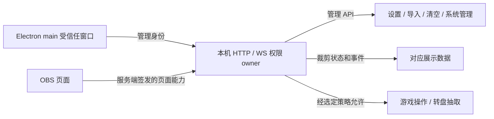

# R4-HTML-TOKEN：桌面与 OBS 权限分离方案

状态：Deferred（2026-09-18 用户明确“先跳过”）；保留第 4 阶段决策草案，本轮不实施，也不改变运行时权限契约。

## Context / Requirements

审计已复现匿名 `GET /lyrics` 中的管理会话 token 可直接调用 `/api/state`。当前 `http-utils.servePageOrAsset` 向所有 HTML 注入同一个 token；API 与 WS 只认该 token。主窗口初次及许可状态切换导航均未携带受信任的引导凭据。

OBS 页面包含交互：小游戏调用 move、draw、结束/重开；转盘调用 spin。只移除 HTML 注入会破坏展示和互动。修复需限制 HTTP 路由及 WS 数据，不以隐藏按钮充当鉴权，不降低 loopback、Host、Origin 或 Electron partition 防护。

## Proposed Decision

保持模块化单体，不增加依赖、进程或身份服务。

1. **桌面管理身份**：由 Electron main 在自身受信任窗口/精确本机 origin 的请求中附带管理凭据；覆盖初次加载、重载、许可状态切换及 WS。不要把管理 token 注入匿名 HTML，也不要让任意 renderer origin、登录窗口 partition 或重定向携带它。独立服务的外部管理浏览器须提供现有本机管理凭据，不能再靠匿名取 HTML 获得。
2. **展示身份**：每个 overlay 页面只获得该页面的限权凭据。签发和验证由同一服务权限 owner 持有，按本次运行的随机密钥派生/轮换。路径参数或客户端声明的 scope 不能扩大权限。
3. **HTTP**：在路由分发前验证 method + path + 必要操作参数；越界返回 403，缺失/失效返回 401。`/api/state` 必须按展示能力裁剪，不能仍返回完整管理状态。
4. **WS**：握手保存服务端确认的能力；初始 snapshot、后续 snapshot 和专用事件均使用同一过滤规则。拒绝越界订阅；不能只限制 REST。
5. **兼容性**：保持现有 overlay 页面 URL、展示样式、连接恢复和桌面操作。仅限权凭据失效时按现有机制恢复；匿名访问管理 HTML 不获得管理能力。直接静态 HTML 路径与页面别名执行相同规则。

## Capability Inventory

| 页面族 | 展示读取/推送 | 现有互动能力 |
|---|---|---|
| queue | queue 与该页面使用的设置、队列相关 snapshot | 无 |
| songlist | 已启用歌库、分类及歌单展示设置 | 无 |
| blindbox | 盲盒统计与展示设置 | 无 |
| overtime | 加班机显示状态/事件及展示设置 | 无 |
| lyrics | lyric-state、lyric-timeline、歌词显示设置 | 无 |
| danmaku | 弹幕历史/事件、头像代理、弹幕显示设置 | 无 |
| gift-effects | 礼物特效/礼物框事件与显示设置 | 无 |
| games | 游戏会话、画笔事件、胜者头像；不包含主播私有答案 | move、draw、结束/重开；不签发新建游戏或其他后台设置权限 |
| wheel | 转盘状态与 wheel:update | spin；不包含编辑转盘配置 |
| opening / clock | 已有公开只读配置与相关展示资源 | 无 |

字段 allowlist 以实际消费者为准，独立于管理 settings 对象；本机路径、诊断细节、凭据、私有答案和无关领域数据不得通过 `/api/state` 或 WS 顺带下发。

## Compatibility Choice Requiring User Direction

**A（建议）：保持现有 OBS 互动使用方式，按页面限制能力。** 现有 `/games` 与 `/wheel` 链接继续能互动，但凭据只允许表中对应操作；其他匿名页面只读。优点是用户无需重新配置 OBS 链接；局限是能访问本机相应页面的客户端仍可执行该页面的互动，不能把它表述为只有主播本人可以点击。

**B：匿名 OBS 全部只读，互动使用单独的限权链接。** 在桌面管理端复制带互动凭据的链接后才能落子、画画、结束/重开、抽取；旧普通链接继续显示，但互动需更新链接。权限更严格，但会改变当前 OBS 使用流程，需要相应复制入口、失效恢复和迁移说明。

拒绝的方案：直接删除注入（破坏展示）；所有 OBS 共用完整管理 token（问题仍在）；只校验客户端 scope 或隐藏按钮（没有服务端权限边界）。

## Verification / Done When

- 匿名 HTML 所有入口均不包含或签发管理凭据；展示 token 不能读管理状态、改设置、导入/清空数据或关闭进程。
- 每个展示族的 REST 与 WS 初始/增量数据一致且满足实际消费字段；越界 method/action/topic 被拒绝。
- 选定互动策略的允许和拒绝路径均有回归；不泄漏你画我猜答案。
- Electron 首次加载、导航、重载、许可恢复及 WS 能管理；其他 origin、登录 partition 和重定向拿不到管理凭据。
- OBS 在服务重启后恢复；既有授权互动和页面 URL 按所选策略保持/迁移。
- 聚焦安全/生命周期/消费者测试，以及合同和架构门禁通过；主进程实机与 OBS 验证不能由桩测试冒充。

## Rollback / Failure Handling

实施前保存代码基线。按能力逐项验证，在受信任桌面引导与所有展示读取可用前不切换鉴权入口。失败只回退本阶段拥有的改动，不恢复已被修复的数据安全问题；不使用持久化用户 token/密钥做实验。
