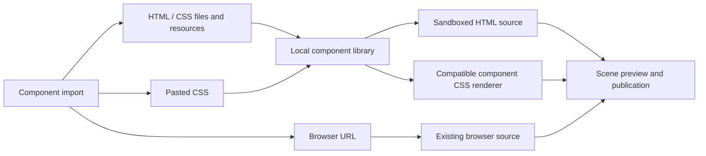

# Third-party component import implementation plan

Status: Completed

## Goal

Import third-party HTML with its companion files, pasted/file CSS, and browser URLs from component style controls. Preserve the delivered page and relative resources, expose working previews, and publish through the existing scene workflow. The user should not have to author a LIRA package manifest.

## Current behavior and evidence

`component-style-library.js` only accepts image/video uploads and LIRA ZIPs. `scene-browser-source.js` accepts HTTP(S) URLs, and `browser-source-frame.js` renders them with an opaque sandbox. Native component DOM is different from third-party chat DOM. Research: [OBS browser source](https://obsproject.com/kb/browser-source), [blivechat](https://github.com/xfgryujk/blivechat), [blivechat HTML SDK](https://github.com/xfgryujk/blivechat/wiki/自定义HTML模板), [BLC](https://github.com/Tsuk1ko/bilibili-live-chat), [LAPLACE templates](https://laplace.live/chat/templates), [complete clock delivery example](https://github.com/somali0128/clock-widget-qiu). CSS changes appearance of a matching host; arbitrary third-party business integrations are not implied by importing a file.

## Ownership and compatibility

- Style import UI: `public/js/admin/component-style-*`, picker and inspector.
- Authenticated upload/import: `src/server/routes/component-style-routes.js`; reuse desktop admin/canvas authorization and recheck before installation.
- Imported files: extend the existing component library with a distinct web-resource path and preserve original relative paths. Existing media validation and LIRA ZIP behavior remain intact.
- Desktop file chooser: narrow main-owned callback; renderer never supplies arbitrary filesystem paths. Browser fallback explicitly selects files/folders.
- CSS: isolated component frames only; common blivechat DOM receives existing LIRA display events. Native CSS uses the selected component. Unsupported provider-specific CSS must explain the missing host, not claim compatibility.
- Browser URLs continue using existing scene URL encryption and redaction. Imported HTML becomes a browser component; no management token or desktop bridge is given to imported code.
- No branch, commit, dependency, process, user-data migration, or remote server change.

## Decisions (proposed within this implementation)

1. Keep HTML as a complete browser source, classified under the component where it was imported. Converting it into an image discards scripts; inserting it into admin DOM breaks isolation.
2. Import original companion files into a bounded bundle. Preserve relative paths and reject traversal/symlinks; serve scripts only within a sandboxed HTML response. CSS resources retain their stylesheet-relative base.
3. Do not attempt generic remote-page proxying or cross-origin CSS injection. Existing remote URLs continue to run as supplied. CSS-only chat skins require an implemented compatible host; bundled HTML can host its own CSS.

## Milestones and verification

- [x] File import and serving: native chooser and explicit browser upload; bounded file/resource validation, atomic installation, authorization recheck, correct MIME/CORS/CSP; test missing files, paths, cancellation, and restart.
- [x] Shared source/CSS contracts and rendering: preserve old configs, support relative imported browser sources and CSS host selection, receive live chat events; focused contract and rendering tests.
- [x] Unified controls for component categories and replacement: file/CSS/URL inputs, meaningful errors, retain layer geometry, no duplicate frames/listeners; browser workflow regression test.
- [x] Verify preview -> save -> published output with synthetic HTML/CSS/resource fixtures and live event updates. Run relevant Electron checks for the native picker; record any environment limitation.
- [x] Update guides and contract references; inspect task-owned diff, `git diff --check`, and `git status --short`. Run JS/architecture/documentation gates justified by the added contracts.

## Failure handling and completion

Incomplete imports are removed from staging; failed rendering must not be described as business readiness. Existing installed resources and scene publications survive failed imports. Preserve all pre-existing work and reverse only this task's edits if needed. Completion requires the three entry flows, companion-file persistence, matching preview/output behavior, and recorded focused verification. Real purchased assets and upstream services can impose additional host/login requirements; do not invent successful testing of them.

## Progress

Research, implementation and focused validation complete. The three browser workflows pass with synthetic resources and live events. Resource resolution preserves HTML-document fetch bases versus module-file import bases. Windows can transiently deny a directory rename after streaming; only the pre-install rename gets a bounded retry, with authorization checked again before every attempt.

### Interactive QA inventory

- Open the shared import dialog from a component category; inspect the file, pasted CSS and URL controls at the Electron fixture's launched size.
- Select synthetic HTML through the authenticated desktop picker callback; inspect copied companion CSS/image/JSON resources in the resulting frame and its published output.
- Paste chat CSS, select a CSS file with resources, and enter a browser URL: automated browser tests cover previews, save, reload, cloud events and geometry-preserving replacement; review representative dialog/output screenshots.
- Failure checks: missing companion resource, cancelled picker, invalid CSS/host, authorization revoked during import and transient Windows rename failure. Existing tests use isolated data only.
- Native OS dialog return is controlled in isolated Electron QA; the operating-system picker chrome is not itself automated. No real purchased bundle or upstream account is available for signoff.

### Verification evidence (2026-10-06)

- New backend/picker tests: 33/33 pass; the original intermittent Windows HTTP reproduction now passes 35 consecutive imports. Deterministic tests cover transient and persistent rename locks, authorization revoked during retry, and no replay after an index-commit failure.
- New browser tests: 3/3 pass. HTML modules, nested CSS, JSON and images survive original-folder deletion and reload. Native clock CSS and both chat hosts publish correctly; synthetic live events arrive once. HTML-to-HTML replacement preserves identity and geometry, and moving a layer does not reload its frame.
- Existing scene output, live updates, document model and real Electron bridge regression group: 34/34 pass. Preview protocol and item notifications: 8/8 pass. Existing browser-source and ordinary media import workflows pass. Guide tests pass.
- Interactive Electron: isolated fixture with real preload/request authentication and the main-owned picker callback; controlled chooser result imported HTML/CSS/JS/JSON, saved and reloaded successfully. Imported page origin is null and no desktop bridge is present. File/CSS/URL panels fit the launched 1426 × 837 content viewport without clipped controls. Screenshots retained only in `tmp/third-party-import/`; test Electron processes and temporary profile were removed.
- JavaScript syntax check passes. API route/document comparison, module reference checks, dependency boundaries and file-size review pass. Full architecture/docs command has two unrelated pre-existing failures: empty-catch debt in `gift-wishes-canvas-data.js`, and the status of `2026-10-06-woodland-frame-avatar.md`. Existing Moonlit package test expects queue font size 22 while the working-tree preset uses 30; this task does not change either value. No unrelated fixes were made.
- One existing clock viewport test observed a transient timeline-vertical clipping assertion during the broader preview run; a focused rerun passed. Other preview tests passed. This was recorded rather than silently removed from the results.
- Task-owned code was compared with the saved start-of-task baseline; unrelated concurrent queue changes were preserved. Final whitespace and status review performed. No commit, build, publication, user-profile access or real upstream account use.
