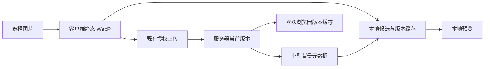

# 歌单背景压缩与本地缓存实施计划

**Status:** Completed.

## 目标与当前证据

用户要求客户端保留上传图片、服务器供观众读取，减少首次下载和重复刷新流量；已确认 GIF 只取首帧。当前 renderer 上传原始文件后立即读取远程图片，服务器公开图片继承 CORP same-origin，且仅缓存 300 秒。

## 设计决定与边界

沿用现有 IPC、设备授权和服务器版本文件事务。按用户补充要求以清晰度优先：客户端 renderer 将图片转为静态 WebP，长边优先 2560px、必要时 1920px，小图不放大；quality 0.82/0.76，目标 500 KiB、硬上限 1 MiB，仍过大则拒绝而非继续缩小。使用 Chromium Cache Storage 保存本地副本，通过 Blob URL 预览。上传前保存临时候选，云端成功后按完整公开版本 URL 发布本地缓存；失败保留原有背景。缓存不可用不能把已成功的云端上传显示为失败。服务器仍是当前版本的权威来源，进入页面只查询小型元数据；本地缺少当前版本时匿名低优先级下载一次。恢复默认清理本地缓存。缓存可被系统清理，清理后按需重建，不是原图备份。

服务器仅公开背景图片允许匿名跨来源读取。匹配当前唯一版本文件的 v 使用一年 immutable 缓存；无版本请求和当前 updatedAt 旧时间戳请求 revalidate；过期版本返回 no-store 404，不能把新图写入旧缓存键。v 与 ETag 采用已有唯一文件标识，避免同毫秒、删除后重传或时钟回退碰撞，不修改持久格式。旧客户端及兼容上传保留 5 MiB 和原格式边界，现存图片不会自动压缩，需重新上传。

不修改直播事件/SSE、全局限流、Nginx 部署配置或用户已有改动。减少传输不能保证所有带宽条件下无卡顿；不引入运行依赖、后台图片轮询或服务端图片转码。

## 所有者与实施步骤

- [x] 客户端：`public/js/admin/song-background.js` 接线；`song-background-image.js` 拥有压缩与候选生命周期。背景面板、内置使用说明及前端参考已同步。验证压缩上限、GIF 首帧、上传不回源、本地重开命中、失败/删除。
- [x] 服务端（`D:/Work/lira-server`）：`src/routes/public.js` 拥有公开图片响应；`src/lib/song-background.js` 保证版本变化。同步 supplemental HTTP 协议、REQ/AC-SONG-004 和追踪表。验证默认同源、公开图片跨源、版本缓存/条件请求、旧版本/删除。
- [x] 验证：两仓相关 Node 测试和文档门禁；客户端 ESM 检查；隔离 Electron renderer 验证实际图片解码与 Cache Storage 持久化。测试数据位于 tmp，不控制用户应用。

## 失败处理与完成条件

上传失败不发布本地候选；本地写入失败提示缓存未保存但保留可用预览；异步旧预览不能覆盖新背景；页面卸载释放 Blob URL。更换或删除最多保留一个已确认缓存和一个临时候选。服务器存储事务及租户检查不变。

完成需上述行为检查通过，文档同步，两仓检查 touched diff、`git diff --check` 和 `git status --short`。不提交、不部署。回退只撤销本任务代码；不删除运行数据或用户改动。

## 验证记录

- 客户端 `node --experimental-vm-modules --test test/license/song-background-image.test.js test/license/license-ui.test.js test/license/license-background.test.js test/admin/frontend-usage-guide.test.js test/engineering/esm-module-boundaries.test.js`：37 项通过；`npm run verify:docs`：10 项通过。
- 服务端使用仓库已有 `tmp/runtime/node-v24.15.0/node.exe`（默认 Node 24.21 被仓库版本门禁拒绝，未修改门禁）。`--require ./test/support/test-mode.cjs --test` 运行 song-background、song-background-service、public-background-missing、device-protocol-contract、cloud-sync-http 五份测试：32 项通过；documentation-governance、architecture-governance、gift-sync-documentation-governance、overlay-protocol-contract 四份：39 项通过。
- 隔离 Electron 使用生产 preload、测试专用 IPC 和独立 userData/sessionData；没有加载生产主进程或真实账户。800×600 红蓝两帧 GIF 输出红色首帧；3840×2160 合成图片输出 2560×1440 WebP。上传后/重新加载无图片下载；删缓存后一次下载，再加载不增加；Electron 进程重启仍命中本地副本。失败上传保留原图，恢复默认清除缓存。测试进程与 HTTP fixture 已关闭，截图在 `tmp/song-background-qa/preview.png`。
- 只验证上述功能与接口，没有生产部署、真实账号联调或多人并发带宽/实播性能基准；不能由合成测试图的压缩率推断所有原图体积。
