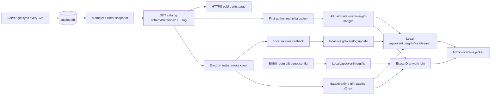

# Remote Gift Catalog Sync 技术设计

## 目标与范围

加班姬礼物选择器的主目录使用当前配置直播间的礼物面板、`giftConfig`，并只从房间实际出现的盲盒 ID 展开服务器官方关系。服务器维护的 v2 全局目录在首次授权后把 `coinType === "gold" && priceRaw >= 0` 的资料和官方盲盒关系作为同一个版本镜像到本机；正价 active 子集用于本地名称/ID 搜索，完整镜像用于按精确礼物 ID 补图、只读映射展示和关系解析。个人账号背包、本地 Markdown、静态 manifest 和打包图库不再参与目录；礼物检测由服务器负责，客户端继续持久化和消费已处理事件、加班规则、结算与 overlay 投影。

远程入口默认为 `https://api.lirahub.cn`，也可由 `LIRA_LICENSE_API_BASE` 配置为另一个使用 DNS 主机名的 HTTPS 根 origin。配置不得包含凭据、子路径、查询参数或片段；HTTP、`localhost` 和 IPv4/IPv6 literal 均被拒绝。业务代码只在该已校验 origin 上请求固定相对路径 `/api/public/gifts/catalog?schemaVersion=2`。

## 端到端数据流



v1 仍使用服务器同步成功运行的 `id` 作为 `version`。v2 把确定性排序的 gold 礼物资料和 `blindBoxes` 关系共同计算为 `sha256:` 业务版本；关系单独变化也会改变 version/ETag。服务端按内容摘要复用 v2 快照，构造失败继续保留上一个成功版本。

## Wire contract

`GET /api/public/gifts/catalog?schemaVersion=2` 成功返回：

```json
{
  "ok": true,
  "schemaVersion": 2,
  "catalog": "all",
  "version": "sha256:0123456789abcdef0123456789abcdef0123456789abcdef0123456789abcdef",
  "updatedAt": "2026-08-29T08:00:00.000Z",
  "stale": false,
  "sources": {
    "gifts": { "asOf": "...", "stale": false },
    "effects": { "asOf": "...", "stale": false }
  },
  "count": 2,
  "gifts": [
    {
      "id": "100",
      "name": "示例礼物",
      "battery": 100,
      "rmb": 1,
      "priceRaw": 1000,
      "coinType": "gold",
      "bagGift": false,
      "active": true,
      "isBlindBox": true,
      "sourceUrl": "https://i0.hdslb.com/bfs/live/example.webp",
      "imageUrl": "/gift-media/images/sha256.webp"
    },
    {
      "id": "101",
      "name": "示例产物",
      "battery": 50,
      "rmb": 0.5,
      "priceRaw": 500,
      "coinType": "gold",
      "bagGift": false,
      "active": true,
      "isBlindBox": false,
      "sourceUrl": null,
      "imageUrl": null
    }
  ],
  "blindBoxes": [
    { "giftId": "100", "outputGiftIds": ["101"] }
  ]
}
```

v2 要求顶层 `schemaVersion: 2` 和完整 `blindBoxes`，礼物项要求显式 boolean `active/isBlindBox`；所有关系引用必须在同包 gifts 中存在。ID 是 1–20 位正十进制字符串，盒子最多 100、每盒 1–200 个去重输出；重复/缺失/自引用使整包无效。`sourceUrl` 仅在服务端和客户端重新校验为允许的 B 站 HTTPS 图片 URL 时使用，否则为 `null`；`imageUrl` 只允许服务器自身 `/gift-media/images/` 路径并作为兼容回退。响应使用 `Cache-Control: public, max-age=300, stale-while-revalidate=1800` 和稳定 ETag；带匹配 `If-None-Match` 返回 `304`。无成功 catalog 时返回 `503`、`CATALOG_NOT_READY` 和 `Retry-After: 60`；无效 schema 参数返回 `400 INVALID_CATALOG_SCHEMA_VERSION`。省略参数的 v1 和现有按名称组分页 API 不变。

## Client cache and lifecycle

Electron main process sends the v2 conditional request. The access token remains in `license-manager`; the public catalog method does not expose it through IPC or renderer. `data/overtime-gift-catalog-v2.json` stores only normalized public metadata and relations, ETag, content version, server update time, and fetch/check times. The legacy cache filename is never treated as a completed v2 package.

Cache rules:

1. Local `/api/overtime/gifts` synchronously returns the last successful current-room snapshot. Base membership comes from Bilibili panel/config data; for each box ID present in that room, its official output IDs are added from the same v2 package. Expansion never starts from a relation-only output and never removes independently present gifts or saved rules.
2. A refresh is single-flight and uses the v2 `If-None-Match`; `304` updates the check time without replacing gifts or relations.
3. Changed metadata or relations atomically replace the complete global cache. A relation-only change emits one semantic `gift-catalog:update`. After the image scan, the update carries local image paths and `assetsUpdatedAt`; same-version image recovery also notifies. Admin updates artwork and official mapping display by exact ID but does not apply the whole global catalog as current-room membership.
4. Network/HTTP failure never overwrites a valid cache. The UI can continue using stale gifts and the explicit refresh action reports the failure.
5. After the first successful authorization, Electron keeps the license page visible while a forced metadata refresh and a complete paid-image scan run. Progress crosses a narrow sanitized IPC bridge; a missing catalog is retryable and blocks first entry, while individual image failures complete with a warning.
6. A schema-v2 `data/overtime-gift-assets-state-v2.json` records a completed v2 scan. Later authorized launches enter Admin immediately and perform one conditional check regardless of the persisted check time; the open runtime repeats every 12 hours. Every check, including 304, scans for missing/changed images. The timer stops with the local runtime. Subsequent actual downloads report start/progress/completion in one Admin toast; unchanged and metadata/relationship-only checks remain silent.
7. A room refresh obtains the current/cached global snapshot, joins by normalized numeric ID, and reuses the initialized image mirror for room and expanded-blind-box gifts. If the remote refresh fails, a prior metadata cache is reused; without one the room snapshot still succeeds with empty image paths.
8. `POST /api/overtime/gifts/local/search` filters the persisted snapshot by gift name or ID without a network request. The legacy `/server/search` route is the same local operation and remains only for compatibility. Without a local snapshot both report an understandable error.
9. Every cached gold catalog gift, including zero-price metadata and inactive referenced records, is checked in `data/overtime-gift-images/`. Valid current files are reused; changed source or validated server image URLs produce a new ID-plus-image-identity-hash filename. `index.json` atomically retains last-good basenames by exact ID. Failed replacements keep old artwork (or a placeholder), with no network fallback to LIRA Server when a Bilibili source exists. Server-only rows remain downloadable. Renderer image paths are `/overtime-gift-images/<basename>`.

The preferred image source must be HTTPS on `hdslb.com` or a subdomain, without credentials, a non-default port, or a fragment. The fallback URL is resolved only against the configured, already validated LIRA Server HTTPS origin and fixed media path. Both paths reject redirects and enforce a 15-second timeout, 5 MiB limit, raster signature validation and atomic writes. When a desktop user saves a gift as an overtime rule, the rule stores the same-origin `/overtime-gift-images/<basename>` path. Existing guard paths remain valid; an obsolete `/img/bilibili-gifts/...` rule path is replaced by the current exact-ID local image when available and otherwise displays the placeholder without deleting the rule. Gift names are rendered with `textContent`, and missing or invalid images use the existing placeholder.

## Security and failure boundaries

- The public endpoint contains only official global metadata/relations and no streamer-private settings, takeover state or mapping revision; it reuses the existing public limiter and immutable server image cache. Device and streamer authorization boundaries are not weakened.
- The configured remote base is a credential-free HTTPS root origin with a valid DNS hostname. HTTP, localhost, and IPv4/IPv6 literals are never accepted for the Device API, catalog, or catalog images.
- The local runtime still requires its existing license/session gate. Client input can provide only a 1–100 character search query and cannot choose a server URL, room id, tenant, image basename, filesystem path, or SQL fragment.
- ETags are length-limited and header-safe. Remote JSON is size-limited and normalized to an allowlist of fields. Relative image paths reject traversal, credentials, query credentials, and cross-origin values.
- Server-side sync retention remains authoritative: a failed or suspicious upstream sync cannot publish an empty/bad snapshot.
- No remote WebSocket/SSE is added. The existing local WebSocket carries a normalized global-cache update to connected Admin pages, which do not apply it as the current-room catalog; HTTPS/ETag remains the cross-host transport. The current catalog is bounded below the local outbound queue limit; if the global catalog grows materially, the notification can be reduced to a version-only signal without changing the HTTP contract.
- The room refresh no longer accepts or forwards a Bilibili Cookie because the personal backpack endpoint is no longer called.

## Acceptance Criteria

- The default remote origin is `https://api.lirahub.cn`; a configured HTTPS root origin with a valid DNS hostname reaches the fixed catalog endpoint.
- HTTP, localhost, IP literals, invalid DNS labels, credentials, non-root paths, queries, fragments, cross-origin image URLs, and redirects are rejected without issuing a remote image request.
- Removing the packaged debug page and API does not alter the local room catalog, paid global cache, or OBS/local WebSocket paths.
- Current-room membership expands official outputs only from a box ID actually present in the room; exact-ID server artwork is used when available, missing artwork keeps the entry with a placeholder, and duplicate names remain separate.
- First authorization does not navigate to Admin until the paid metadata mirror and full image scan finish; later completed launches do not wait for background incremental synchronization.
- Global picker search and recent/high-value/blind-box artwork lookup use the local mirror and issue no request to LIRA Server or Bilibili while handling the UI lookup.
- Source/install packages contain no static Bilibili gift Markdown, manifest, or artwork tree.

## Verification

- Server contract evidence: `node --test test/gift-client-catalog.test.js test/gift-public-routes.test.js test/public-gift-catalog-contract.test.js` in lira-server when that repository changes.
- Client: `node --experimental-vm-modules --test test/remote-gift-image-cache.test.js test/remote-catalog-cache.test.js test/remote-overtime-catalog.test.js test/overtime-routes.test.js test/gift-catalog-initializer.test.js test/gift-catalog-background-updates.test.js test/frontend-gifts.test.js`.
- Final review: `git diff --check` and inspect status for secrets/runtime files.
