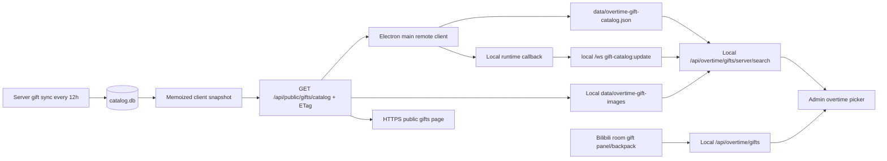

# Remote Gift Catalog Sync 技术设计

## 目标与范围

加班姬礼物选择器的主目录使用当前配置直播间的礼物面板、盲盒和当前账号可用背包；服务器维护的全局礼物目录只用于弹窗中的手动名称/ID 搜索。此设计只增加“服务器搜索元数据和图片缓存来源”；礼物事件接收、加班规则持久化、结算和 overlay 仍由本地运行时负责。

远程入口默认为 `https://api.lirahub.cn`，也可由 `LIRA_LICENSE_API_BASE` 配置为另一个使用 DNS 主机名的 HTTPS 根 origin。配置不得包含凭据、子路径、查询参数或片段；HTTP、`localhost` 和 IPv4/IPv6 literal 均被拒绝。业务代码只在该已校验 origin 上请求固定相对路径 `/api/public/gifts/catalog`。

## 端到端数据流



服务器同步成功运行的 `id` 和完成时间组成 `version`。查询层按该 revision 缓存扁平 active code 列表，避免每次 HTTP 请求重复扫描和序列化；服务端同步失败继续使用上一个成功 revision。

## Wire contract

`GET /api/public/gifts/catalog` 成功返回：

```json
{
  "ok": true,
  "catalog": "all",
  "version": "42",
  "updatedAt": "2026-08-29T08:00:00.000Z",
  "stale": false,
  "sources": {
    "gifts": { "asOf": "...", "stale": false },
    "effects": { "asOf": "...", "stale": false }
  },
  "count": 1,
  "gifts": [
    {
      "id": "100",
      "name": "示例礼物",
      "battery": 100,
      "rmb": 1,
      "priceRaw": 1000,
      "coinType": "gold",
      "bagGift": false,
      "imageUrl": "/gift-media/images/sha256.webp"
    }
  ]
}
```

`imageUrl` 只允许服务器自身 `/gift-media/images/` 路径。响应使用 `Cache-Control: public, max-age=300, stale-while-revalidate=1800` 和稳定 ETag；带匹配 `If-None-Match` 返回 `304`。无成功 catalog 时返回 `503`、`CATALOG_NOT_READY` 和 `Retry-After: 60`。现有按名称组分页 API 不变。

## Client cache and lifecycle

Electron main process sends the conditional request. The access token remains in `license-manager`; the public catalog method does not expose it through IPC or renderer. The local cache stores only normalized public metadata, ETag, revision, server update time, and fetch/check times.

Cache rules:

1. Local `/api/overtime/gifts` synchronously returns the last successful current-room snapshot, so opening the picker never changes to a global server catalog.
2. A refresh is single-flight and uses `If-None-Match`; `304` updates the check time without replacing gifts.
3. A changed `version` atomically replaces the remote search cache and emits one local `gift-catalog:update` message; Admin must not apply that snapshot as the primary current-room catalog.
4. Network/HTTP failure never overwrites a valid cache. The UI can continue using stale gifts and the explicit refresh action reports the failure.
5. After authorization, a forced first refresh runs once; while authorized, a low-frequency timer performs conditional checks. The timer is stopped with the local runtime.
6. Server search first performs a forced conditional refresh, then filters the available remote snapshot by gift name or ID. If refresh fails but a prior snapshot exists, search may continue from that stale snapshot; without any remote snapshot it reports an understandable error.
7. Only matched server gifts have their immutable `/gift-media/images/<basename>` bytes downloaded to `data/overtime-gift-images/`. Valid files are reused, one failed image falls back to the built-in placeholder without failing the other matches, and the renderer receives only `/overtime-gift-images/<basename>`.

Remote image URLs are resolved only against the configured, already validated HTTPS API base. The local runtime downloads matched server images with redirects disabled, a 15-second timeout, a 5 MiB limit, raster signature validation and atomic writes. When a desktop user saves a searched server gift as an overtime rule, the rule stores the same-origin `/overtime-gift-images/<basename>` path; existing `/img/...` and previously stored validated HTTPS server URLs remain compatible. Gift names are rendered with `textContent`, and missing or invalid images use the existing placeholder.

## Security and failure boundaries

- The public endpoint contains no streamer-private data; it reuses the existing public limiter and immutable server image cache. Device and streamer authorization boundaries are not weakened.
- The configured remote base is a credential-free HTTPS root origin with a valid DNS hostname. HTTP, localhost, and IPv4/IPv6 literals are never accepted for the Device API, catalog, or catalog images.
- The local runtime still requires its existing license/session gate. Client input can provide only a 1–100 character search query and cannot choose a server URL, room id, tenant, image basename, filesystem path, or SQL fragment.
- ETags are length-limited and header-safe. Remote JSON is size-limited and normalized to an allowlist of fields. Relative image paths reject traversal, credentials, query credentials, and cross-origin values.
- Server-side sync retention remains authoritative: a failed or suspicious upstream sync cannot publish an empty/bad snapshot.
- No remote WebSocket/SSE is added. The existing local WebSocket carries a normalized server-search cache update to connected Admin pages, which do not apply it as the current-room catalog; HTTPS/ETag remains the cross-host transport. The current catalog is bounded below the local outbound queue limit; if the global catalog grows materially, the notification can be reduced to a version-only signal without changing the HTTP contract.

## Acceptance Criteria

- The default remote origin is `https://api.lirahub.cn`; a configured HTTPS root origin with a valid DNS hostname reaches the fixed catalog endpoint.
- HTTP, localhost, IP literals, invalid DNS labels, credentials, non-root paths, queries, fragments, cross-origin image URLs, and redirects are rejected without issuing a remote image request.
- Removing the packaged debug page and API does not alter the local room catalog, server search cache, or OBS/local WebSocket paths.

## Verification

- Server contract evidence: `node --test test/gift-public-routes.test.js test/gift-catalog-service.test.js` in lira-server when that repository changes.
- Client: `node --test test/remote-gift-image-cache.test.js test/remote-catalog-cache.test.js test/remote-overtime-catalog.test.js test/overtime-routes.test.js test/frontend-admin-shell.test.js test/frontend-queue.test.js`.
- Final review: `git diff --check` and inspect status for secrets/runtime files.
