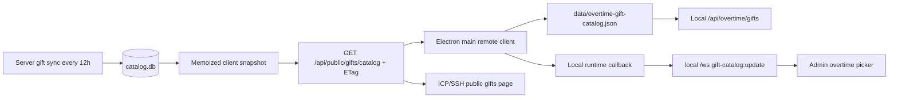

# Remote Gift Catalog Sync 技术设计

## 目标与范围

加班姬礼物选择器需要使用服务器维护的全局礼物目录，而不是每次依赖本地房间礼物面板。此设计只改变“选择器元数据和图片来源”；礼物事件接收、加班规则持久化、结算和 overlay 仍由本地运行时负责。

同时支持两种部署入口：

- 生产/ICP备案网页和 API：`https://api.lirahub.cn`（由 `LIRA_LICENSE_API_BASE` 配置）。
- 测试 SSH 隧道：显式配置 `http://127.0.0.1:<port>`，例如现有 `desktop:tunnel` 的 `13000`。

业务代码不区分域名，也不把生产地址复制到目录服务；两种入口请求同一个相对路径 `/api/public/gifts/catalog`。

## 端到端数据流



服务器同步成功运行的 `id` 和完成时间组成 `version`。查询层按该 revision 缓存扁平 active code 列表，避免每次 HTTP 请求重复扫描和序列化；服务端同步失败继续使用上一个成功 revision。

## Wire contract

`GET /api/public/gifts/catalog` 成功返回：

```json
{
  "ok": true,
  "catalog": "all",
  "version": "42",
  "updatedAt": "2026-08-29T08:00:00.000Z",
  "stale": false,
  "sources": {
    "gifts": { "asOf": "...", "stale": false },
    "effects": { "asOf": "...", "stale": false }
  },
  "count": 1,
  "gifts": [
    {
      "id": "100",
      "name": "示例礼物",
      "battery": 100,
      "rmb": 1,
      "priceRaw": 1000,
      "coinType": "gold",
      "bagGift": false,
      "imageUrl": "/gift-media/images/sha256.webp"
    }
  ]
}
```

`imageUrl` 只允许服务器自身 `/gift-media/images/` 路径。响应使用 `Cache-Control: public, max-age=300, stale-while-revalidate=1800` 和稳定 ETag；带匹配 `If-None-Match` 返回 `304`。无成功 catalog 时返回 `503`、`CATALOG_NOT_READY` 和 `Retry-After: 60`。现有按名称组分页 API 不变。

## Client cache and lifecycle

Electron main process sends the conditional request. The access token remains in `license-manager`; the public catalog method does not expose it through IPC or renderer. The local cache stores only normalized public metadata, ETag, revision, server update time, and fetch/check times.

Cache rules:

1. Local `/api/overtime/gifts` synchronously returns the last remote snapshot if present, so opening the picker does not wait for the network.
2. A refresh is single-flight and uses `If-None-Match`; `304` updates the check time without replacing gifts.
3. A changed `version` atomically replaces the cache and emits one local `gift-catalog:update` message.
4. Network/HTTP failure never overwrites a valid cache. The UI can continue using stale gifts and the explicit refresh action reports the failure.
5. After authorization, a forced first refresh runs once; while authorized, a low-frequency timer performs conditional checks. The timer is stopped with the local runtime.
6. If no remote callback is configured (legacy web/test mode), the existing Bilibili room catalog service remains the fallback implementation. Local Markdown search remains an explicit offline/manual source.

Remote image URLs are resolved only against the configured, already validated API base. When a desktop user saves a server gift as an overtime rule, the local rule contract permits only that same validated origin and a single immutable `/gift-media/images/<basename>` path; existing `/img/...` paths remain unchanged. Renderer code accepts text and image `src` values from the normalized local response; gift names are rendered with `textContent`, and invalid URLs use the existing placeholder.

## Security and failure boundaries

- The public endpoint contains no streamer-private data; it reuses the existing public limiter and immutable server image cache. Device and streamer authorization boundaries are not weakened.
- The local runtime still requires its existing license/session gate. Client input cannot choose a server URL, room id, tenant, filesystem path, or SQL fragment.
- ETags are length-limited and header-safe. Remote JSON is size-limited and normalized to an allowlist of fields. Relative image paths reject traversal, credentials, query credentials, and cross-origin values.
- Server-side sync retention remains authoritative: a failed or suspicious upstream sync cannot publish an empty/bad snapshot.
- No remote WebSocket/SSE is added. The existing local WebSocket carries the normalized catalog update to already connected Admin pages; HTTP/ETag remains the cross-host transport that works for both SSH and ICP. The current catalog is bounded below the local outbound queue limit; if the global catalog grows materially, the notification can be reduced to a version-only signal without changing the HTTP contract.

## Verification

- Server: `node --test test/gift-public-routes.test.js test/gift-catalog-service.test.js`; `npm run docs:check`.
- Client: `node --test test/remote-catalog-cache.test.js test/remote-license-client.test.js test/overtime-routes.test.js`; `npm run check`; `npm run verify:architecture`.
- Final review: `git diff --check` in both repositories and inspect status for secrets/runtime files.
