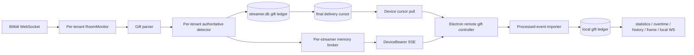

# Feature: Server-authoritative gift detection

## Goal

Move the existing LIRA gift parsing, combo accumulation, duplicate suppression,
blind-box mapping, and quiet-window finalization to LIRA Server. The server is
the sole owner of raw Bilibili gift detection, while the Electron client keeps
its local Bilibili connection for danmaku song requests, Super Chat, user
identity, and games, and projects only server-processed gift events into the
existing local gift consumers.

## Requirements

- While a tenant RoomMonitor is connected, when it receives any supported gift
  command, the server shall normalize it with the same rules as the current
  desktop parser and pass it to that tenant's detector.
- While a combo is still progressing, when the server receives cumulative
  packets, it shall keep one ledger row and finalize it once after 10 seconds of
  platform silence, unless the platform supplies an explicit final packet.
- While a Device session is authorized, when it subscribes to gift events, the
  server shall scope the stream from the verified Device identity and shall not
  accept a client-supplied `streamerId` as authorization evidence.
- While a Device is online, when a gift first enters progress or becomes final,
  the server shall send at most one `progress` event and one `final` event for
  that server event ID; cumulative platform packets shall not each cross the
  Device boundary.
- While a Device is reconnecting, when it requests finalized events after its
  durable cursor, the server shall return the tenant's final events in ascending
  cursor order and bounded pages.
- While a Device has no durable cursor for this server and tenant, when it first
  establishes a baseline, the server shall return the current latest cursor
  without replaying historical gifts.
- While the Electron client receives a validated server event, when it projects
  that event locally, it shall use a dedicated processed-event import path and
  shall never call the local raw gift detector.
- While the local Bilibili connection is enabled, when it receives a gift
  command, the client shall suppress only the local gift detector callback;
  danmaku, song requests, Super Chat, user metadata, and games shall remain
  active.
- While a server event is replayed after a crash or reconnect, when the client
  imports the same public event ID again, local statistics, overtime settlement,
  history updates, snapshots, and `gift:frame` shall not be delivered twice.
- While a server predating the blind-box setting extension has no
  `giftBlindBoxConfig`, when the client reconciles cloud settings, it shall keep
  its local mapping and seed that mapping to the server instead of replacing it
  with an empty list.

## Architecture



### Server

- `RoomMonitor` owns Bilibili ingress and binds every parsed event to its
  authenticated/configured Streamer runtime before detection.
- `gift-detector.js` owns business identity, compatibility duplicate matching,
  cumulative maxima, blind-box values, and the 10-second quiet window.
- `streamer-storage.js` owns the tenant ledger migration and the final-delivery
  cursor transaction. A final row and its delivery cursor commit atomically.
- `gift-event-broker.js` is an online fan-out only. It is keyed by internal
  `streamerId`, has no offline queue, and never supplies tenant selection from a
  request field.
- `gift-event-service.js` reads only final outbox rows. A request without
  `after` establishes a no-replay baseline; a request with `after` returns at
  most 200 items per page.

### Device wire contract

`GET /api/device/gift-events` and
`GET /api/device/gift-events/stream` require the existing Device Bearer token.
The stream event name is `gift-event`. The JSON allowlist is:

```json
{
  "eventId": "public opaque event id",
  "cursor": 42,
  "phase": "final",
  "gift": {
    "giftId": "33988",
    "giftName": "示例礼物",
    "userName": "观众",
    "num": 2,
    "unitPrice": 0.1,
    "totalPrice": 0.2,
    "coinType": "gold",
    "isBlindBox": false,
    "blindBoxName": "",
    "blindBoxPrice": null,
    "blindProfit": null,
    "createdAt": "2026-08-30T00:00:00.000Z"
  }
}
```

`progress` uses `cursor: null`; cursor pull returns final events only. The wire
contract excludes UID, room ID, Streamer ID, command names, platform/combo IDs,
raw packets, cookies, CSRF values, access tokens, and internal database IDs.

### Electron main process

- The remote client validates HTTPS/loopback transport as it does for all Device
  calls, bounds response and SSE buffers, and keeps the Device token inside the
  main process.
- The remote gift controller owns exactly one stream, reconnect backoff,
  backfill serialization, and cleanup. Initial startup obtains a no-replay
  baseline, opens the stream, and then pulls after that cursor so the
  baseline-to-subscription race is recovered. Reconnect opens the stream first
  and then pulls after the durable cursor, so events finalized during recovery
  are either pulled or streamed and are harmlessly deduplicated.
- The cursor store atomically replaces a small local JSON file after each
  successfully imported final event. Its source key is derived locally from the
  configured server and licensed Streamer so a different tenant cannot inherit
  an unrelated cursor.
- The local processed-event importer projects `progress` and `final` directly
  into the current gift ledger using an event-derived platform key. It freezes
  local consumer eligibility on the first observed phase, dispatches final
  consumers once, and stores no server raw payload.

## Security and privacy

- Authentication and tenant authorization are enforced before both Device
  routes. The request does not contain a tenant selector.
- SQL statements are parameterized and every tenant database is resolved from
  the authenticated Device or the RoomMonitor's bound Streamer.
- Wire output is an explicit display DTO. No UID or upstream/raw identifier is
  needed after authoritative detection, so those fields remain server-private.
- The server publishes no more than two Device messages per detected gift group.
  Keepalive comments contain no event or identity data. Final recovery is pull
  based and happens only at startup/reconnect, using pages of at most 200.
- Neither event payloads nor credentials are logged by the new client
  controller. The renderer receives the existing local snapshots and WebSocket
  events only; it never receives the Device token or remote SSE handle.
- Gift and user display strings are length-limited at both boundaries and remain
  JSON data; existing UI consumers render names as text.

## Failure and ordering semantics

- The final ledger transition and final outbox cursor are one SQLite
  transaction. Process failure after commit but before SSE publication is
  recovered by cursor pull.
- A client crash after local import but before cursor persistence replays the
  same public event ID; the local importer treats it as already final and does
  not re-run consumers, then advances the cursor.
- SSE is an acceleration path, not the source of recovery truth. Cursor pull is
  the recovery path for final events; progress is intentionally not replayed.
- Bilibili REST/WebSocket disconnects and server downtime before ingress still
  have no upstream historical replay guarantee. This design does not claim
  zero-loss Bilibili ingestion.
- The in-memory broker is single-process. A future multi-instance deployment
  requires a separate single-consumer/fan-out decision and is outside this
  change.

## Compatibility and non-goals

- Existing local gift history, statistics, overtime rules and settlements,
  overlays, settings keys, local HTTP/WebSocket paths, and renderer contracts
  remain in place.
- Existing server gift and guard history is migrated/read compatibly and is not
  deleted. New guard purchases follow the authoritative gift parser and are not
  double-recorded through the legacy `GUARD_BUY` path.
- The local Bilibili client remains connected for all non-gift features.
- This change does not add Redis, a queue service, a second server process,
  cross-instance delivery, upstream event replay, or renderer access to remote
  credentials.

## Acceptance criteria

1. Parser fixtures that pass in the desktop implementation produce equivalent
   normalized server gifts for all supported command families.
2. Repeated/cumulative packets create one tenant row, one first progress event,
   and one final outbox cursor; explicit platform finals and the 10-second quiet
   window finalize only once.
3. Device A cannot read or subscribe to Device B's Streamer events, and neither
   route succeeds without Device authentication.
4. The Device payload contains only the documented allowlist and never contains
   UID, room/Streamer identity, command/combo/platform identity, raw JSON, or
   credentials.
5. A disconnect after final commit is recovered in cursor order without double
   local statistics, overtime settlement, history, snapshot, or `gift:frame`.
6. A fresh client establishes a latest-cursor baseline and does not replay old
   server history.
7. Disabling local gift detection does not stop local danmaku, song request,
   Super Chat, game, or identity handling.
8. Blind-box mappings converge to the server without an older server response
   erasing a non-empty local configuration.
