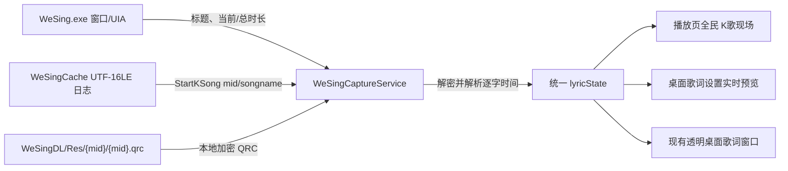

# 全民 K 歌实时歌词捕捉设计

## 目标与边界

在现有“播放”页面的 QQ 音乐、网易云音乐旁新增“全民 K歌”信源。该信源不登录全民 K 歌账号，也不读取云端歌单或控制全民 K 歌播放；它只观察本机全民 K 歌客户端，并把当前歌曲、播放进度和本地 QRC 逐字歌词送入项目已经存在的桌面歌词通道。

参考实现来自 `Widdit/now-playing-service`：

- 通过窗口标题 `全民K歌 - {歌名}` 识别当前歌曲。
- 通过 Windows UI Automation 查找 `00:08 | 04:16` 形式的进度文本。
- 从 `WeSingCache\Log\WeSing` 最新 UTF-16LE 日志尾部读取 `StartKSong` 的 `mid` 与 `songname`。
- 使用 `WeSingDL\Res\{mid}\{mid}.qrc`，跳过可选的 `[offset:...]` 文件头后解密 QRC。
- 使用 QRC 行、字时间戳驱动逐字歌词。

## 数据流

## 组件职责

### `src/music/wesing-capture.js`

- 校验并规范化用户选择的 `WeSingCache` 路径。
- 仅在全民信源激活时启动一个长期 PowerShell 子进程，使用 .NET UI Automation 读取窗口与进度；停用和服务退出时终止子进程。
- 进度变化时判定播放中；连续 1.5 秒不变时判定暂停。
- 每次歌曲变化读取最新日志尾部（最多 100 KiB），只接受安全的 `songmid` 字符集。
- 优先按 `songmid` 精确定位 QRC；精确定位失败时，仅扫描最近修改的有限数量 QRC 并按 `[ti:]` 标题匹配。
- 解密本地 QRC、解析 `[start,duration]字(start,duration)`，生成当前行和逐字时间。
- 向运行时回调发布安全、限长的公开状态和标准化 `lyricState`。

### HTTP 与运行时

- `GET /api/music/wesing/status`：返回路径、检测状态、当前歌曲和当前歌词状态。
- `POST /api/music/wesing/configure`：校验并保存缓存路径，然后重新检测。
- `POST /api/music/wesing/active`：切换捕捉开关；只有当前播放信源为全民 K 歌时为 `true`。
- `POST /api/music/wesing/refresh`：手动重新读取目录、日志与歌词。
- 服务端通过 `wesing-state` WebSocket 消息更新全民页面，并在激活时复用现有 `lyric-state` 消息更新桌面歌词。

### 播放页

- 全民页面与在线搜索/歌单页互斥显示。
- 页面提供客户端、缓存、歌词三个状态，目录输入/目录选择、重新检测、当前歌曲、进度和逐字歌词。
- 所有路径、歌名、歌词使用 `textContent` 写入 DOM。
- 切入全民时暂停本页在线音频并激活捕捉；切回 QQ/网易云时停用捕捉并恢复在线 Provider 状态。

### 桌面歌词设置

- 在现有设置表单上方增加实时预览舞台。
- 预览订阅同一 `lyric-state`，用播放锚点在相邻状态之间插值，并实时反映字体、字重、字号、颜色、描边、透明度、缩放、行距和阴影输入。
- 现有独立透明歌词窗口不创建第二套协议，继续消费同一状态。

## 安全与失败处理

- 所有 API 沿用现有 session token 校验。
- 不执行用户输入的路径，不把路径拼入命令行；PowerShell 脚本是固定内容。
- `songmid` 必须匹配保守白名单，QRC 解析前限制日志尾部和文件大小，阻止目录穿越和过量读取。
- 不把原始日志、Cookie 或 QRC 文件内容返回浏览器。
- 非 Windows 环境、全民客户端未启动、目录不存在、日志未命中和 QRC 尚未写完分别返回可理解状态；这些情况不影响 QQ/网易云功能。
- 子进程错误会更新状态但不使本地 HTTP 服务退出；重新检测可重启监视器。

## 验收标准

- 可选择并保存 `WeSingCache`，重启后仍可读取。
- 全民 K 歌播放一首已缓存歌曲时，页面显示歌名、进度和逐字动态歌词。
- 切到全民后现有桌面歌词窗口与设置页预览同步更新；切回在线信源后全民不再覆盖歌词。
- 无效路径、恶意 `songmid`、损坏 QRC 和未运行客户端不会导致未捕获异常或文件越界。
- `npm run check`、专项测试及完整 `npm test` 通过。
